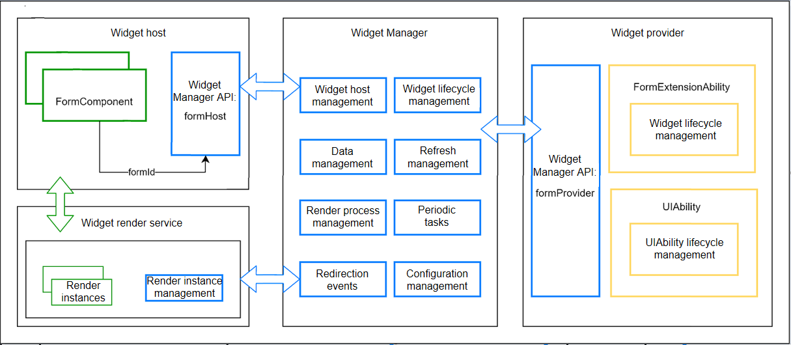
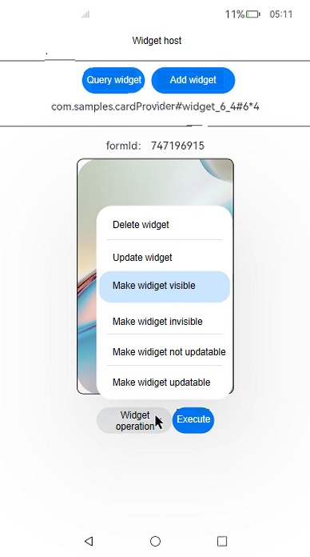

# ArkTS Widget Host Development (for System Applications Only)
<!--Kit: Form Kit-->
<!--Subsystem: Ability-->
<!--Owner: @Qian-Win-->
<!--Designer: @cx983299475-->
<!--Tester: @mahailong123456-->
<!--Adviser: @HelloShuo-->

## Widget Overview

A widget is a set of UI components that display important information or operations specific to an application. It provides users with direct access to a desired application service, without the need to open the application first.

A widget usually appears as a part of the UI of another application (which currently can only be a system application) and provides basic interactive features such as opening a UI page or sending a message. The widget host is responsible for displaying the service widget.

- Before you get started, it would be helpful if you have a basic understanding of the following concepts:

  - Widget provider: an atomic service that controls the widget content to display, how widget components are laid out, and how they interact with users.
  
  - Widget host: an application that displays the widget content and controls the widget location.
  
  - Widget Manager: a resident agent that provides widget management features such as periodic widget updates.
  
   

## When to Use

Carry out the following operations to develop the widget host based on the stage model:

- Use **FormComponent**.
- Use the APIs provided by the **formHost** module to delete or update widgets.

## Using FormComponent

**FormComponent** is a component used to display widgets. For details, see [FormComponent](../reference/apis-arkui/arkui-ts/ts-basic-components-formcomponent-sys.md).

> **NOTE**
>
> - This component is supported since API version 7. Updates will be marked with a superscript to indicate their earliest API version.
>
> - This component functions as the widget host.
>
> - To use this component, you must have the system signature.
>
> - The APIs provided by this component are system APIs.

When a widget is added through **FormComponent**, the [onAddForm](../reference/apis-form-kit/js-apis-app-form-formExtensionAbility.md#formextensionabilityonaddform) API in **FormExtensionAbility** of the widget provider is called.

### Temporary and Normal Widgets

The **temporary** field in **FormComponent** specifies whether a widget is a temporary or normal widget. The value **true** indicates a temporary widget, and **false** indicates a normal widget.

- Normal widget: a widget persistently used by the widget host, for example, a widget added to the home screen.

- Temporary widget: a widget temporarily used by the widget host.
  
Data of a temporary widget will be deleted on the Widget Manager if the widget framework is killed and restarted. The widget provider, however, is not notified of the deletion and still keeps the data. Therefore, the widget provider needs to clear the data of temporary widgets proactively if the data has been kept for a long period of time. If the widget host has converted a temporary widget into a normal one, the widget provider should change the widget data from temporary storage to persistent storage. Otherwise, the widget data may be deleted by mistake. 

## Using formHost APIs

The **formHost** module provides a series of APIs for the widget host to update and delete widgets. For details, see the [API reference](../reference/apis-form-kit/js-apis-app-form-formHost-sys.md).

## Example
<!-- @[form_host_index](https://gitcode.com/openharmony/applications_app_samples/blob/master/code/DocsSample/Form/FormHost/entry/src/main/ets/pages/Index.ets) -->

``` TypeScript
import { HashMap, HashSet } from '@kit.ArkTS';
import { formHost, formInfo, formObserver } from '@kit.FormKit';
import { bundleMonitor } from '@kit.AbilityKit';
import { BusinessError } from '@kit.BasicServicesKit';
import { hilog } from '@kit.PerformanceAnalysisKit';

const TAG: string = 'FormHost';
const DOMAIN_NUMBER: number = 0xFF00;

@Entry
@Component
struct formHostSample {
  // Enumerated values of the widget size.
  static FORM_DIMENSIONS_MAP = [
    '1*2',
    '2*2',
    '2*4',
    '4*4',
    '1*1',
    '6*4',
  ]
  // Simulate the widget sizes.
  static FORM_SIZE = [
    [120, 60], // 1*2
    [120, 120], // 2*2
    [240, 120], // 2*4
    [240, 240], // 4*4
    [60, 60], // 1*1
    [240, 360],// 6*4
  ]
  // Replace $r('app.string.Host') with the actual resource file. In this example, the value of the resource file is "Widget host".
  @State message: Resource | string = $r('app.string.Host');
  formCardHashMap: HashMap<string, formInfo.FormInfo> = new HashMap();
  @State showFormPicker: boolean = false;
  // Replace $r('app.string.formOperation') with the actual resource file. In this example, the value of the resource file is "Widget operation".
  @State operation: Resource | string = $r('app.string.formOperation');
  @State index: number = 2;
  @State space: number = 8;
  @State arrowPosition: ArrowPosition = ArrowPosition.END;
  formIds: HashSet<string> = new HashSet();
  currentFormKey: string = '';
  focusFormInfo: formInfo.FormInfo = {
    bundleName: '',
    moduleName: '',
    abilityName: '',
    name: '',
    displayName: '',
    displayNameId: 0,
    description: '',
    descriptionId: 0,
    type: formInfo.FormType.eTS,
    jsComponentName: '',
    colorMode: -1,
    isDefault: false,
    updateEnabled: false,
    formVisibleNotify: true,
    scheduledUpdateTime: '',
    formConfigAbility: '',
    updateDuration: 0,
    defaultDimension: 6,
    supportDimensions: [],
    supportedShapes: [],
    customizeData: {},
    isDynamic: false,
    transparencyEnabled: false
  }
  formInfoRecord: TextCascadePickerRangeContent[] = [];
  // Replace $r('app.string.formType') with the actual resource file. In this example, the value of the resource file is "Widget type".
  pickerBtnMsg: Resource | string = $r('app.string.formType');
  @State showForm: boolean = true;
  @State selectFormId: string = '0';
  @State pickDialogIndex: number = 0;

  aboutToAppear(): void {
    try {
      // Check whether the system is ready.
      formHost.isSystemReady().then(() => {
        hilog.info(DOMAIN_NUMBER, TAG, 'formHost isSystemReady success');

        // Subscribe to events indicating that a widget becomes invisible and events indicating that a widget becomes visible.
        let notifyInvisibleCallback = (data: formInfo.RunningFormInfo[]) => {
          hilog.info(DOMAIN_NUMBER, TAG, `form change invisibility, data: ${JSON.stringify(data)}`);
        }
        let notifyVisibleCallback = (data: formInfo.RunningFormInfo[]) => {
          hilog.info(DOMAIN_NUMBER, TAG, `form change visibility, data: ${JSON.stringify(data)}`);
        }
        formObserver.on('notifyInvisible', notifyInvisibleCallback);
        formObserver.on('notifyVisible', notifyVisibleCallback);

        // Subscribe to bundle installation events.
        try {
          bundleMonitor.on('add', (bundleChangeInfo) => {
            hilog.info(DOMAIN_NUMBER, TAG,
              `bundleName : ${bundleChangeInfo.bundleName} userId : ${bundleChangeInfo.userId}`);
            this.getAllBundleFormsInfo();
          })
        } catch (errData) {
          let message = (errData as BusinessError).message;
          let errCode = (errData as BusinessError).code;
          hilog.error(DOMAIN_NUMBER, TAG, `errData is errCode:${errCode}  message:${message}`);
        }
        // Subscribe to bundle update events.
        try {
          bundleMonitor.on('update', (bundleChangeInfo) => {
            hilog.info(DOMAIN_NUMBER, TAG,
              `bundleName : ${bundleChangeInfo.bundleName} userId : ${bundleChangeInfo.userId}`);
            this.getAllBundleFormsInfo();
          })
        } catch (errData) {
          let message = (errData as BusinessError).message;
          let errCode = (errData as BusinessError).code;
          hilog.error(DOMAIN_NUMBER, TAG, `errData is errCode:${errCode}  message:${message}`);
        }
        // Subscribe to bundle uninstall events.
        try {
          bundleMonitor.on('remove', (bundleChangeInfo) => {
            hilog.info(DOMAIN_NUMBER, TAG,
              `bundleName : ${bundleChangeInfo.bundleName} userId : ${bundleChangeInfo.userId}`);
            this.getAllBundleFormsInfo();
          })
        } catch (errData) {
          let message = (errData as BusinessError).message;
          let errCode = (errData as BusinessError).code;
          hilog.error(DOMAIN_NUMBER, TAG, `errData is errCode:${errCode}  message:${message}`);
        }
      }).catch((error: BusinessError) => {
        hilog.error(DOMAIN_NUMBER, TAG, `error, code: ${error.code}, message: ${error.message}`);
      });
    } catch (error) {
      hilog.error(DOMAIN_NUMBER, TAG,
        `catch error, code: ${(error as BusinessError).code}, message: ${(error as BusinessError).message}`);
    }
  }

  aboutToDisappear(): void {
    // Delete all widgets.
    this.formIds.forEach((id) => {
      hilog.info(DOMAIN_NUMBER, TAG, 'delete all form');
      formHost.deleteForm(id);
    });
    // Unsubscribe from bundle installation events.
    try {
      bundleMonitor.off('add');
    } catch (errData) {
      let message = (errData as BusinessError).message;
      let errCode = (errData as BusinessError).code;
      hilog.error(DOMAIN_NUMBER, TAG, `errData is errCode:${errCode}  message:${message}`);
    }
    // Unsubscribe from bundle update events.
    try {
      bundleMonitor.off('update');
    } catch (errData) {
      let message = (errData as BusinessError).message;
      let errCode = (errData as BusinessError).code;
      hilog.error(DOMAIN_NUMBER, TAG, `errData is errCode:${errCode}  message:${message}`);
    }
    // Unsubscribe from bundle uninstall events.
    try {
      bundleMonitor.off('remove');
    } catch (errData) {
      let message = (errData as BusinessError).message;
      let errCode = (errData as BusinessError).code;
      hilog.error(DOMAIN_NUMBER, TAG, `errData is errCode:${errCode}  message:${message}`);
    }
    // Unsubscribe from events indicating that a widget becomes invisible and events indicating that a widget becomes visible.
    formObserver.off('notifyInvisible');
    formObserver.off('notifyVisible');
  }

  // Save the information of all widgets to formHapRecordMap.
  getAllBundleFormsInfo() {
    this.formCardHashMap.clear();
    this.showFormPicker = false;
    let formHapRecordMap: HashMap<string, formInfo.FormInfo[]> = new HashMap();
    this.formInfoRecord = [];
    formHost.getAllFormsInfo().then((formList: Array<formInfo.FormInfo>) => {
      hilog.info(DOMAIN_NUMBER, TAG, 'getALlFormsInfo size:' + formList.length);
      for (let formItemInfo of formList) {
        let formBundleName = formItemInfo.bundleName;
        if (formHapRecordMap.hasKey(formBundleName)) {
          formHapRecordMap.get(formBundleName).push(formItemInfo)
        } else {
          let formInfoList: formInfo.FormInfo[] = [formItemInfo];
          formHapRecordMap.set(formBundleName, formInfoList);
        }
      }
      for (let formBundle of formHapRecordMap.keys()) {
        let bundleFormInfo: TextCascadePickerRangeContent = {
          text: formBundle,
          children: []
        }
        let bundleFormList: formInfo.FormInfo[] = formHapRecordMap.get(formBundle);
        bundleFormList.forEach((formItemInfo) => {
          let dimensionName = formHostSample.FORM_DIMENSIONS_MAP[formItemInfo.defaultDimension - 1];
          bundleFormInfo.children?.push({ text: formItemInfo.name + '#' + dimensionName });
          this.formCardHashMap.set(formBundle + '#' + formItemInfo.name + '#' + dimensionName, formItemInfo);
        })
        this.formInfoRecord.push(bundleFormInfo);
      }
      this.formCardHashMap.forEach((formItem: formInfo.FormInfo) => {
        hilog.info(DOMAIN_NUMBER, TAG, `formCardHashmap: ${JSON.stringify(formItem)}`);
      })
      this.showFormPicker = true;
    })
  }

  build() {
    Column() {
      Text(this.message)
        .fontSize(30)
        .fontWeight(FontWeight.Bold)

      Divider().vertical(false).color(Color.Black).lineCap(LineCapStyle.Butt).margin({ top: 10, bottom: 10 })

      Row() {
        // Click to query information about all widgets.
        // Replace $r('app.string.inquiryForm') with the actual resource file. In this example, the value of the resource file is "Query widget".
        Button($r('app.string.inquiryForm'))
          .onClick(() => {
            this.getAllBundleFormsInfo();
          })

        // After the button is tapped, a selection page is displayed. After a widget is selected, the selected widget is displayed through FormComponent.
        // Replace $r('app.string.selectAddForm') with the actual resource file. In this example, the value of the resource file is "Select and add widget".
        Button($r('app.string.selectAddForm'))
          .enabled(this.showFormPicker)
          .onClick(() => {
            hilog.info(DOMAIN_NUMBER, TAG, 'TextPickerDialog: show()');
            this.getUIContext().showTextPickerDialog({
              range: this.formInfoRecord,
              selected: this.pickDialogIndex,
              canLoop: false,
              disappearTextStyle: { color: Color.Red, font: { size: 10, weight: FontWeight.Lighter } },
              textStyle: { color: Color.Black, font: { size: 12, weight: FontWeight.Normal } },
              selectedTextStyle: { color: Color.Blue, font: { size: 12, weight: FontWeight.Bolder } },
              onAccept: (result: TextPickerResult) => {
                this.currentFormKey = result.value[0] + '#' + result.value[1];
                this.pickDialogIndex = result.index[0]
                hilog.info(DOMAIN_NUMBER, TAG,
                  `TextPickerDialog onAccept: ${this.currentFormKey}, ${this.pickDialogIndex}`);
                if (!this.formCardHashMap.hasKey(this.currentFormKey)) {
                  hilog.error(DOMAIN_NUMBER, TAG, `invalid formItemInfo by form key`);
                  return;
                }
                this.showForm = true;
                this.focusFormInfo = this.formCardHashMap.get(this.currentFormKey);
              },
              onCancel: () => {
                hilog.info(DOMAIN_NUMBER, TAG, `TextPickerDialog : onCancel()`);
              },
              onChange: (result: TextPickerResult) => {
                this.pickerBtnMsg = result.value[0] + '#' + result.value[1];
                hilog.info(DOMAIN_NUMBER, TAG, `TextPickerDialog:onChange:` + this.pickerBtnMsg);
              }
            })
          })
          .margin({ left: 10 })
      }
      .margin({ left: 10 })

      Divider().vertical(false).color(Color.Black).lineCap(LineCapStyle.Butt).margin({ top: 10, bottom: 10 })

      if (this.showForm) {
        Text(this.pickerBtnMsg)
          .margin({ top: 10, bottom: 10 })
      }

      if (this.showForm) {
        Text('formId: ' + this.selectFormId)
          .margin({ top: 10, bottom: 10 })

        // FormComponent.
        FormComponent({
          id: Number.parseInt(this.selectFormId),
          name: this.focusFormInfo.name,
          bundle: this.focusFormInfo.bundleName,
          ability: this.focusFormInfo.abilityName,
          module: this.focusFormInfo.moduleName,
          dimension: this.focusFormInfo.defaultDimension,
          temporary: false,
        })
          .size({
            width: formHostSample.FORM_SIZE[this.focusFormInfo.defaultDimension - 1][0],
            height: formHostSample.FORM_SIZE[this.focusFormInfo.defaultDimension - 1][1],
          })
          .borderColor(Color.Black)
          .borderRadius(10)
          .borderWidth(1)
          .onAcquired((form: FormCallbackInfo) => {
            hilog.info(DOMAIN_NUMBER, TAG, `onAcquired: ${form.id}`);
            this.selectFormId = form.id.toString();
            this.formIds.add(this.selectFormId);
          })
          .onRouter(() => {
            hilog.info(DOMAIN_NUMBER, TAG, `onRouter`);
          })
          .onError((error) => {
            hilog.error(DOMAIN_NUMBER, TAG, `onError: code: ${error.errcode}, message: ${error.msg}`);
            this.showForm = false;
          })
          .onUninstall((info: FormCallbackInfo) => {
            this.showForm = false;
            hilog.info(DOMAIN_NUMBER, TAG, `onUninstall: ${JSON.stringify(info)}`);
            this.formIds.remove(this.selectFormId);
          })

        // Select list, which lists some formHost APIs.
        Row() {
          // Replace $r('app.string.deleteForm') with the actual resource file. In this example, the value of the resource file is "Delete widget".
          Select([{ value: $r('app.string.deleteForm') },
            // Replace $r('app.string.updateForm') with the actual resource file. In this example, the value of the resource file is "Update widget".
            { value: $r('app.string.updateForm') },
            // Replace $r('app.string.visibleForms') with the actual resource file. In this example, the value of the resource file is "Visible widget".
            { value: $r('app.string.visibleForms') },
            // Replace $r('app.string.invisibleForms') with the actual resource file. In this example, the value of the resource file is "Invisible widget".
            { value: $r('app.string.invisibleForms') },
            // Replace $r('app.string.enableFormsUpdate') with the actual resource file. In this example, the value of the resource file is "Enable widget update".
            { value: $r('app.string.enableFormsUpdate') },
            // Replace $r('app.string.disableFormsUpdate') with the actual resource file. In this example, the value of the resource file is "Disable widget update".
            { value: $r('app.string.disableFormsUpdate') },
          ])
            .selected(this.index)
            .value(this.operation)
            .font({ size: 16, weight: 500 })
            .fontColor('#182431')
            .selectedOptionFont({ size: 16, weight: 400 })
            .optionFont({ size: 16, weight: 400 })
            .space(this.space)
            .arrowPosition(this.arrowPosition)
            .menuAlign(MenuAlignType.START, { dx: 0, dy: 0 })
            .optionWidth(200)
            .optionHeight(300)
            .onSelect((index: number, text?: string | Resource) => {
              hilog.info(DOMAIN_NUMBER, TAG, 'Select:' + index);
              this.index = index;
              if (text) {
                this.operation = text;
              }
            })

          // Operate the current widget based on the function selected in the select list.
          // Replace $r('app.string.execute') with the actual resource file. In this example, the value of the resource file is "Execute".
          Button($r('app.string.execute'), {
            type: ButtonType.Capsule
          })
            .fontSize(16)
            .onClick(() => {
              switch (this.index) {
                case 0:
                  try {
                    formHost.deleteForm(this.selectFormId, (error: BusinessError) => {
                      if (error) {
                        hilog.error(DOMAIN_NUMBER, TAG,
                          `deleteForm error, code: ${error.code}, message: ${error.message}`);
                      } else {
                        hilog.info(DOMAIN_NUMBER, TAG, 'formHost deleteForm success');
                      }
                    });
                  } catch (error) {
                    hilog.error(DOMAIN_NUMBER, TAG,
                      `deleteForm catch error, code: ${(error as BusinessError).code}, message: ${(error as BusinessError).message}`);
                  }
                  this.showForm = false;
                  this.selectFormId = '';
                  break;
                case 1:
                  try {
                    formHost.requestForm(this.selectFormId, (error: BusinessError) => {
                      if (error) {
                        hilog.error(DOMAIN_NUMBER, TAG,
                          `requestForm error, code: ${error.code}, message: ${error.message}`);
                      }
                    });
                  } catch (error) {
                    hilog.error(DOMAIN_NUMBER, TAG,
                      `requestForm catch error, code: ${(error as BusinessError).code}, message: ${(error as BusinessError).message}`);
                  }
                  break;
                case 2:
                  try {
                    formHost.notifyVisibleForms([this.selectFormId], (error: BusinessError) => {
                      if (error) {
                        hilog.error(DOMAIN_NUMBER, TAG,
                          `notifyVisibleForms error, code: ${error.code}, message: ${error.message}`);
                      } else {
                        hilog.info(DOMAIN_NUMBER, TAG, 'notifyVisibleForms success');
                      }
                    });
                  } catch (error) {
                    hilog.error(DOMAIN_NUMBER, TAG,
                      `notifyVisibleForms catch error, code: ${(error as BusinessError).code}, message: ${(error as BusinessError).message}`);
                  }
                  break;
                case 3:
                  try {
                    formHost.notifyInvisibleForms([this.selectFormId], (error: BusinessError) => {
                      if (error) {
                        hilog.error(DOMAIN_NUMBER, TAG,
                          `notifyInvisibleForms error, code: ${error.code}, message: ${error.message}`);
                      } else {
                        hilog.info(DOMAIN_NUMBER, TAG, 'notifyInvisibleForms success');
                      }
                    });
                  } catch (error) {
                    hilog.error(DOMAIN_NUMBER, TAG,
                      `notifyInvisibleForms catch error, code: ${(error as BusinessError).code}, message: ${(error as BusinessError).message}`);
                  }
                  break;
                case 4:
                  try {
                    formHost.enableFormsUpdate([this.selectFormId], (error: BusinessError) => {
                      if (error) {
                        hilog.error(DOMAIN_NUMBER, TAG,
                          `enableFormsUpdate error, code: ${error.code}, message: ${error.message}`);
                      }
                    });
                  } catch (error) {
                    hilog.error(DOMAIN_NUMBER, TAG,
                      `enableFormsUpdate catch error, code: ${(error as BusinessError).code}, message: ${(error as BusinessError).message}`);
                  }
                  break;
                case 5:
                  try {
                    formHost.disableFormsUpdate([this.selectFormId], (error: BusinessError) => {
                      if (error) {
                        hilog.error(DOMAIN_NUMBER, TAG,
                          `disableFormsUpdate error, code: ${error.code}, message: ${error.message}`);
                      } else {
                        hilog.info(DOMAIN_NUMBER, TAG, 'disableFormsUpdate success');
                      }
                    });
                  } catch (error) {
                    hilog.error(DOMAIN_NUMBER, TAG,
                      `disableFormsUpdate catch error, code: ${(error as BusinessError).code}, message: ${(error as BusinessError).message}`);
                  }
                  break;
              }
            })
        }
        .margin({
          top: 20,
          bottom: 10
        })
      }
    }
  }
}
```



## Samples

The following sample is provided for widget host development:

- [Widget Host (Stage) (API12)](https://gitcode.com/openharmony/applications_app_samples/tree/master/code/DocsSample/Form/FormHost)
