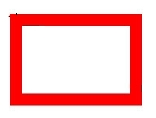
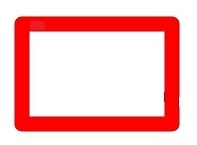
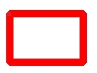

# Basic Drawing Effects (ArkTS)


## When to Use

During drawing, you can set basic effects, such as the fill color, anti-aliasing, outline, and line connection style.

Set the basic filling effect by using the brush, and set the basic stroke effect by using the pen.


## Filling Effects

You can use the brush to set the basic fill color, or use the blending mode, shader effect, and filter effect to implement more complex drawing effects. For details, see [Complex Drawing Effects](complex-drawing-effect-arkts.md).


### Available APIs

The following table lists the common APIs for setting the drawing effect by using the brush. For details about the usage and parameters, see [drawing.Brush](../reference/apis-arkgraphics2d/js-apis-graphics-drawing.md#brush).

| Interface| Description|
| -------- | -------- |
| attachBrush(brush: Brush): void | Attaches a brush to a canvas so that the canvas can use the style and color of the brush to fill in a shape.|
| setColor(alpha: number, red: number, green: number, blue: number): void | Sets the color attribute of the brush. The color attribute describes the color used by the brush to fill the image.|
| setAntiAlias(aa: boolean) : void | Sets the anti-aliasing attribute of the brush. If this attribute is set to true, the brush performs translucent blur processing on the edge pixels of the image when drawing the image to make the image edges smoother.|
| detachBrush(): void | Removes the brush from the canvas. After this operation is performed, the canvas does not use the previously set brush and the default filling effect is restored.|


### How to Develop

1. Creates a Brush object.

   ```ts
   const brush = new drawing.Brush();
   ```

2. Use the brush to set the basic drawing effect, for example, setting the fill color and enabling the anti-aliasing effect.
   You can use the setColor() interface to set the fill color.

   ```ts
   brush.setColor(0xFF, 0xFF, 0x00, 0x00);
   ```

   You can use the setAntiAlias() interface to enable the anti-aliasing effect to smooth the image edges.

   ```ts
   brush.setAntiAlias(true);
   ```

3. Use the attachBrush() API to set the brush for the canvas.

   ```ts
   canvas.attachBrush(brush);
   ```

4. Draw diagram elements as required. For details, see [Primitive Drawing](primitive-drawing-overview.md).

5. If the filling effect is not required, you can call detachBrush() to remove the brush from the canvas.

   ```ts
   canvas.detachBrush();
   ```


## Stroke Effects

You can use the pen to set the basic stroke color, or use the blending mode, path effect, shader effect, and filter effect to implement more complex drawing effects. For details, see [Complex Drawing Effects](complex-drawing-effect-arkts.md).


### Available APIs

The following table lists the common APIs for setting the drawing effect using the pen. For details about the usage and parameters, see [drawing.Pen](../reference/apis-arkgraphics2d/js-apis-graphics-drawing.md#pen).


| Interface| Description|
| -------- | -------- |
| attachPen(pen: Pen): void | Attaches a pen to a canvas so that the canvas can use the style and color of the pen to outline a shape.|
| setColor(alpha: number, red: number, green: number, blue: number): void | Sets the color attribute of the pen. The color attribute describes the color used by the pen to draw the outline of a graph.|
| setStrokeWidth(width: number) : void | Sets the width for a pen. The value **0** is treated as an unusually thin width. During drawing, the width of 0 is always drawn as 1 pixel wide, regardless of any scaling applied to the canvas. Negative values are also regarded as the value **0** during the drawing process.|
| setAntiAlias(aa: boolean) : void | Enables or disables anti-aliasing for a pen. Anti-aliasing makes the pixels around the shape edges semi-transparent.|
| setCapStyle(style: CapStyle): void | Sets the line cap style for a pen.|
| setJoinStyle(style: JoinStyle): void | Sets the line join style for a pen.|
| detachPen(): void | Removes the pen from the canvas. After this method is executed, the canvas does not draw the outline of the shape and restores the default filling effect.|


### How to Develop

1. Creates a pen object.

   ```ts
   let pen = new drawing.Pen();
   ```

2. Use the attachPen() API to set a pen for the Canvas. The canvas will use the configured pen style and color to draw the outline of the graph.

   ```ts
   canvas.attachPen(pen);
   ```

3. Use the pen to set one or more of the following stroke effects.

   - You can use the setColor() interface to set the pen color, which is used for drawing the outline of a graph.

      ```ts
      // Set the color to red.
      pen.setColor(0xFF, 0xFF, 0x00, 0x00);
      ```

   - You can use the setStrokeWidth() interface to set the stroke width.

      ```ts
      pen.setStrokeWidth(15);
      ```

   - You can use the setAntiAlias() interface to set the anti-aliasing function of the pen to make the drawing edges smoother.

      ```ts
      pen.setAntiAlias(true);
      ```

   - You can use the setCapStyle() interface to set the line cap style of the pen.

      ```ts
      pen.setCapStyle(drawing.CapStyle.SQUARE_CAP);
      ```

      CapStyle can be classified into the following types:

      | Wire cap style| Description| Diagram|
      | -------- | -------- | -------- |
      | FLAT_CAP | There is no cap style. Both ends of the line segment are cut off square.|  |
      | SQUARE_CAP | Square cap style. Both ends have a square, the height of which is half of the width of the line segment, with the same width.|  |
      | ROUND_CAP | Round cap style. Both ends have a semicircle centered, the diameter of which is the same as the width of the line segment.|  |

   - You can use the setJoinStyle() interface to set the pen corner style.

      ```ts
      pen.setJoinStyle(drawing.JoinStyle.ROUND_JOIN);
      ```

      The options of JoinStyle are as follows:

      | Corner style| Description| Diagram|
      | -------- | -------- | -------- |
      | MITER_JOIN | The corner type is sharp corner.|  |
      | ROUND_JOIN | Round corner.|  |
      | BEVEL_JOIN | Beveled corner.|  |

4. Draw diagram elements as required. For details, see [Primitive Drawing](primitive-drawing-overview.md).

5. If the stroke effect is not required, you can call detachPen() to remove the pen from the canvas.

   ```ts
   canvas.detachPen();
   ```
