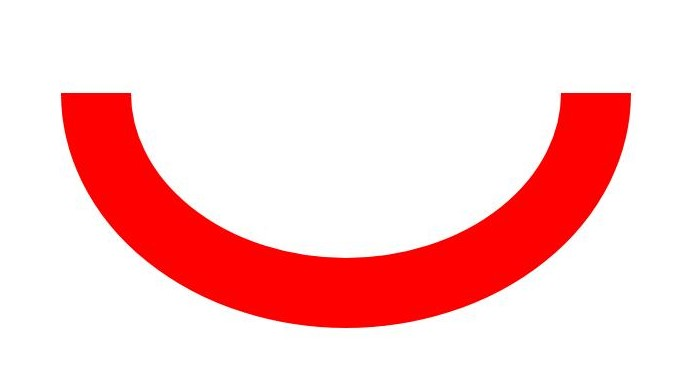

# Basic Drawing Effects (C/C++)


## When to Use

During drawing, you can set basic effects, such as the fill color, anti-aliasing, outline, and line connection style.

Set the basic filling effect by using the brush, and set the basic stroke effect by using the pen.


## Filling Effects

You can use the brush to set the basic fill color, or use the blending mode, shader effect, and filter effect to implement more complex drawing effects. For details, see [Complex Drawing Effects](complex-drawing-effect-c.md).


### Available APIs

The following table lists the common APIs for setting the drawing effect by using the brush. For details about the usage and parameters, see [drawing_brush](../reference/apis-arkgraphics2d/drawing__brush_8h.md).

| Interface| Description|
| -------- | -------- |
| OH_Drawing_Brush\* OH_Drawing_BrushCreate (void) | Creates an **OH_Drawing_Brush** object.|
| void OH_Drawing_CanvasAttachBrush (OH_Drawing_Canvas\*, const OH_Drawing_Brush\*) | Attaches a brush to a canvas so that the canvas can use the style and color of the brush to fill in a shape.|
| void OH_Drawing_BrushSetColor (OH_Drawing_Brush\* , uint32_t color) | Sets the color for a brush. The color is used by the brush to fill in a shape.|
| void OH_Drawing_BrushSetAntiAlias (OH_Drawing_Brush\* , bool) | Sets the anti-aliasing attribute of the brush. If this attribute is set to true, the brush performs translucent blur processing on the edge pixels of the image when drawing the image to make the image edges smoother.|
| void OH_Drawing_CanvasDetachBrush (OH_Drawing_Canvas\*) | Removes the brush from the canvas. After this operation is performed, the canvas does not use the previously set brush and restores the default filling effect.|
| void OH_Drawing_BrushDestroy (OH_Drawing_Brush\*) | Destroys an **OH_Drawing_Brush** object and reclaims the memory occupied by the object.|


### How to Develop

1. Use the OH_Drawing_BrushCreate() API to create a brush object.

   ```c++
   OH_Drawing_Brush* brush = OH_Drawing_BrushCreate(); 
   ```

2. Use the brush to set the basic drawing effect. (You can select one or more of the following effects.)

   - You can use the OH_Drawing_BrushSetColor() interface to set the fill color.

      ```c++
      uint32_t color = 0xffff0000;
      OH_Drawing_BrushSetColor(brush, color); 
      ```

      color is a 32-bit (ARGB) variable, for example, 0xffff0000.

   - You can call OH_Drawing_BrushSetAntiAlias() to enable the anti-aliasing effect to smooth the image edges.
      ```c++
      OH_Drawing_BrushSetAntiAlias(brush, true);
      ```

3. Use the OH_Drawing_CanvasAttachBrush() interface to set the brush for the canvas. The interface accepts two parameters. One is the canvas object Canvas. Ensure that the canvas has been created or obtained. For details, see [Obtaining a Canvas and Displaying Drawing Results (C/C++)](canvas-get-result-draw-c.md). The other is the brush object to be set. The canvas will be filled with the configured brush style and color.

   ```c++
   OH_Drawing_CanvasAttachBrush(canvas, brush); 
   ```

4. Draw diagram elements as required. For details, see [Primitive Drawing](primitive-drawing-overview.md).

5. If the padding effect is not required, you can use OH_Drawing_CanvasDetachBrush() to remove it. The input parameter is the canvas object Canvas.

   ```c++
   OH_Drawing_CanvasDetachBrush(canvas); 
   ```

6. If the brush is not required for effect filling, call OH_Drawing_BrushDestroy() to destroy the Brush object in a timely manner.

   ```c++
   OH_Drawing_BrushDestroy(brush);
   ```


## Stroke Effects

You can use the pen to set the basic stroke color, or use the blending mode, path effect, shader effect, and filter effect to implement more complex drawing effects. For details, see [Complex Drawing Effects](complex-drawing-effect-c.md).


### Available APIs

The following table lists the common APIs for setting the drawing effect using the pen. For details about the usage and parameters, see [drawing_pen](../reference/apis-arkgraphics2d/drawing__pen_8h.md).

| Interface| Description|
| -------- | -------- |
| OH_Drawing_Pen\* OH_Drawing_PenCreate (void) | Creates an **OH_Drawing_Pen** object.|
| void OH_Drawing_CanvasAttachPen (OH_Drawing_Canvas\* , const OH_Drawing_Pen\* ) | Attaches a pen to a canvas so that the canvas can use the style and color of the pen to outline a shape.|
| void OH_Drawing_PenSetColor (OH_Drawing_Pen\* , uint32_t color) | Sets the color for a pen. The color is used by the pen to outline a shape.|
| void OH_Drawing_PenSetWidth (OH_Drawing_Pen\* , float width) | Sets the width for a pen. The value **0** is treated as an unusually thin width. During drawing, the width of 0 is always drawn as 1 pixel wide, regardless of any scaling applied to the canvas. Negative values are also regarded as the value **0** during the drawing process.|
| void OH_Drawing_PenSetAntiAlias (OH_Drawing_Pen\* , bool ) | Enables or disables anti-aliasing for a pen. Anti-aliasing makes the pixels around the shape edges semi-transparent.|
| void OH_Drawing_PenSetCap (OH_Drawing_Pen\* , OH_Drawing_PenLineCapStyle) | Sets the line cap style for a pen.|
| void OH_Drawing_PenSetJoin (OH_Drawing_Pen\* , OH_Drawing_PenLineJoinStyle) | Sets the line join style for a pen.|
| void OH_Drawing_CanvasDetachPen (OH_Drawing_Canvas\*) | Removes the pen from the canvas. After this operation is performed, the canvas does not draw the outline of the shape and restores the default filling effect.|
| void OH_Drawing_PenDestroy (OH_Drawing_Pen\*) | Destroys an **OH_Drawing_Pen** object and reclaims the memory occupied by the object.|


### How to Develop

1. Use the OH_Drawing_PenCreate() interface to create a pen object.

   ```c++
   OH_Drawing_Pen* pen = OH_Drawing_PenCreate(); 
   ```

2. Use the OH_Drawing_CanvasAttachPen() interface to set the pen for the Canvas. The interface accepts two parameters. One is the canvas object Canvas. Ensure that the canvas has been created or obtained. For details, see [Obtaining a Canvas and Displaying Drawing Results (C/C++)](canvas-get-result-draw-c.md). The other is the pen object to be set. The canvas will use the configured pen style and color to draw the outline of the graph.

   ```c++
   OH_Drawing_CanvasAttachPen(canvas, pen); 
   ```

3. Use the pen to set one or more of the following stroke effects.

   - You can use the OH_Drawing_PenSetColor() interface to set the pen color, which is used for drawing the outline of a graph.
      ```c++
      uint32_t color = 0xffff0000;
      OH_Drawing_PenSetColor(pen, color); 
      ```

      color is a 32-bit (ARGB) variable, for example, 0xffff0000.

   - You can call the OH_Drawing_PenSetWidth() interface to set the line width of the pen.

      ```c++
      OH_Drawing_PenSetWidth(pen, width);
      ```

      width indicates the pixel value of the line width.

   - You can call OH_Drawing_PenSetAntiAlias() to set the anti-aliasing function of the pen to make the drawing edges smoother.
      ```c++
      OH_Drawing_PenSetAntiAlias(pen, true);
      ```

   - You can use the OH_Drawing_PenSetCap() interface to set the style of the pen line cap.

      ```c++
      OH_Drawing_PenSetCap(pen, OH_Drawing_PenLineCapStyle);
      ```

      OH_Drawing_PenLineCapStyle: The following lists the available cap styles.

      | Wire cap style| Description| Diagram|
      | -------- | -------- | -------- |
      | FLAT_CAP | There is no cap style. Both ends of the line segment are cut off square.|  |
      | SQUARE_CAP | Square cap style. Both ends have a square, the height of which is half of the width of the line segment, with the same width.|  |
      | ROUND_CAP | Round cap style. Both ends have a semicircle centered, the diameter of which is the same as the width of the line segment.|  |

   - You can call the OH_Drawing_PenSetJoin() API to set the pen corner style.

      ```c++
      OH_Drawing_PenSetJoin(pen, OH_Drawing_PenLineJoinStyle);
      ```

      The options of OH_Drawing_PenLineJoinStyle are as follows:
      | Corner style| Description| Diagram|
      | -------- | -------- | -------- |
      | MITER_JOIN | The corner type is sharp corner.|  |
      | ROUND_JOIN | Round corner.|  |
      | BEVEL_JOIN | Beveled corner.|  |

4. Draw diagram elements as required. For details, see [Primitive Drawing](primitive-drawing-overview.md).

5. If the stroke effect is not required, you can use OH_Drawing_CanvasDetachPen() to remove it. The input parameter is the canvas object. Ensure that the canvas has been created or obtained. For details, see [Obtaining a Canvas and Displaying Drawing Results (C/C++)](canvas-get-result-draw-c.md).

   ```c++
   OH_Drawing_CanvasDetachPen(canvas); 
   ```

6. If the stroke is not required, call OH_Drawing_PenDestroy() to destroy the Pen object in a timely manner.

   ```c++
   OH_Drawing_PenDestroy(pen); 
   ```
