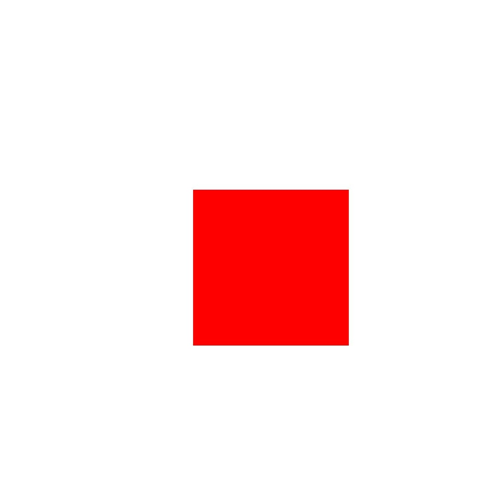
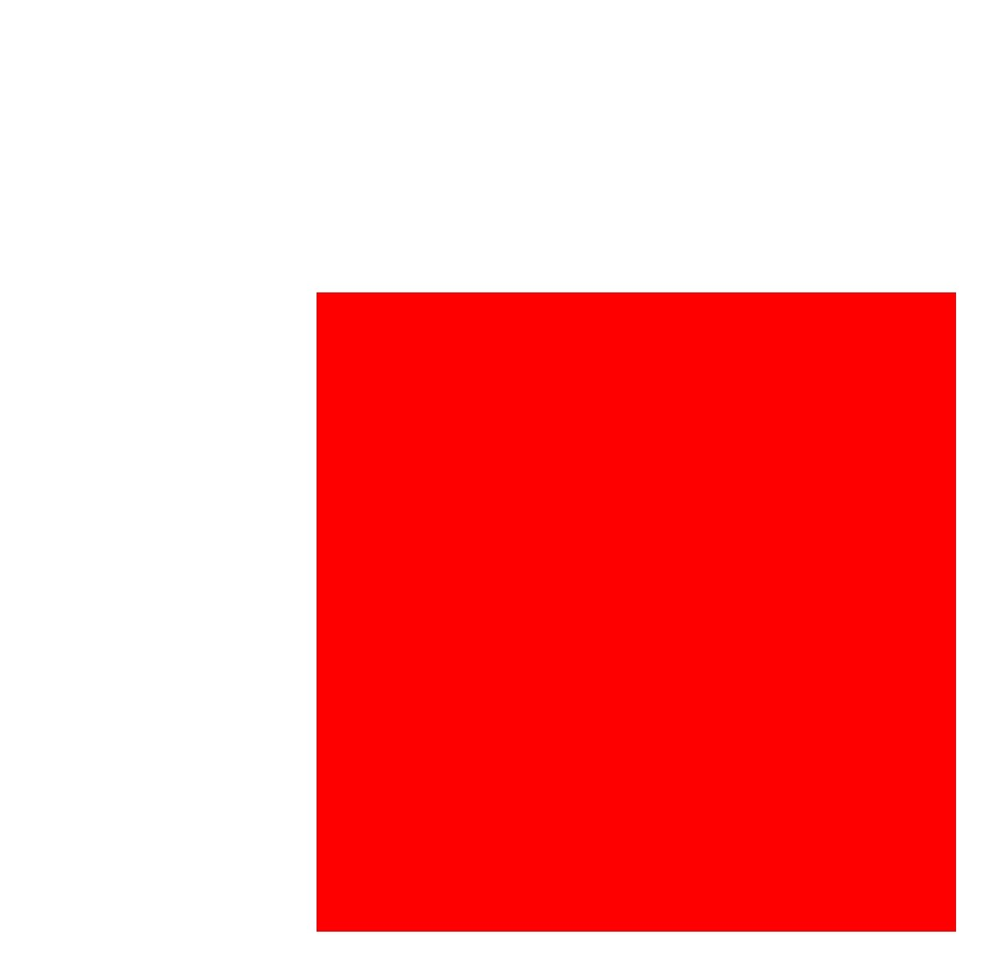

# Canvas Operations and State Processing (ArkTS)


## When to Use

After the canvas is created or obtained, a graphics operation and state processing may be further performed based on the canvas. Canvas operations are optional. You can perform these operations based on the scenario requirements. You need to perform operations on the canvas before drawing the canvas. Only in this way can the canvas operations take effect.

Common canvas operations are as follows:

- Cropping

- Matrix transformation, such as translation, scaling, and rotation.

- Status saving and restoration

For details about canvas operations and API parameters, see [drawing.Canvas](../reference/apis-arkgraphics2d/js-apis-graphics-drawing.md#canvas).


## Cropping

Cropping is a common operation in graphics processing. Cropping is performed on the canvas itself and can be used to limit the drawing area and draw only the specified area. You need to perform the cropping operation and then draw the image to obtain the corresponding effect.

Currently, the following tailoring operations are supported:

- Crops a rectangle.

- Crops a rounded rectangle.

- Crops the user-defined path.

- Crops a region.


### Available APIs

The following table lists the common tailoring APIs. For details about the usage and parameters, see [drawing.Canvas](../reference/apis-arkgraphics2d/js-apis-graphics-drawing.md#canvas).


| Interface| Description|
| -------- | -------- |
| clipRect(rect: common2D.Rect, clipOp?: ClipOp, doAntiAlias?: boolean): void | Clips a rectangle.|
| clipRoundRect(roundRect: RoundRect, clipOp?: ClipOp, doAntiAlias?: boolean): void | Clips a rounded rectangle.|
| clipPath(path: Path, clipOp?: ClipOp, doAntiAlias?: boolean): void | Clips a path.|
| clipRegion(region: Region, clipOp?: ClipOp): void | Clips a region.|


### How to Develop

The following describes how to crop a rectangle on the canvas. The logic of other cropping operations is similar. Call the corresponding APIs and ensure that the data type to be cropped is correct. For details about the usage and parameters, see [drawing.Canvas](../reference/apis-arkgraphics2d/js-apis-graphics-drawing.md#canvas).

Call clipRect() to crop a rectangle. There are three input parameters:


- rect is the rectangular area to be cropped.

- clipOp indicates the clipping mode, including INTERSECT and DIFFERENCE. For details, see [ClipOp](../reference/apis-arkgraphics2d/js-apis-graphics-drawing.md#clipop12).

- doAntiAlias indicates whether anti-aliasing is required. If the value is true, the anti-aliasing function is enabled, and the edge pixels of the image are blurred semi-transparently when the image is drawn. If the value is false, the anti-aliasing function is disabled.


```ts
// Create a brush.
let brush = new drawing.Brush();
// Set the color to blue.
brush.setColor(0xFF, 0x00,  0x00, 0xFF);
// Set the brush filling effect.
canvas.attachBrush(brush);
// Create a rectangle object.
let rect: common2D.Rect = { left: 200, top: 200, right: 600, bottom: 600 };
// Crop a rectangular area.
canvas.clipRect(rect); 
// Draw a circle on the canvas.
canvas.drawCircle(300, 300, 300);
// Remove the filling effect.
canvas.detachBrush();
```


| Original image| Image after cropping|
| -------- | -------- |
|  |  |


## Matrix Transformation

Matrix transformation is also a common canvas operation, is a coordinate system transformation, and is used to change a graph.

Currently, the following matrix transformations are supported:

- Translation

- Scaling

- Rotation


### Available APIs

The following table lists the common APIs for matrix transformation. For details about the usage and parameters, see [drawing.Canvas](../reference/apis-arkgraphics2d/js-apis-graphics-drawing.md#canvas).

| Interface| Description|
| -------- | -------- |
| translate(dx: number, dy: number): void | Translates a canvas by a given distance.|
| scale(sx: number, sy: number): void | Scales a canvas.|
| rotate(degrees: number, sx: number, sy: number): void | Rotates a canvas by a given angle. A positive value indicates a clockwise rotation, and a negative value indicates a counterclockwise rotation.|
| skew(sx: number, sy: number) : void | Skews a canvas in both the horizontal and vertical directions.|


### Translation

Use the translate() API to translate the canvas. The interface accepts two parameters, that is, the horizontal translation amount and vertical translation amount. The unit is pixel.

The following figure shows a simple example.


```ts
// Create a brush.
let brush = new drawing.Brush();
// Set the color to red.
brush.setColor(0xFF, 0xFF, 0x00, 0x00);
// Set the brush filling effect.
canvas.attachBrush(brush);
// Perform the translation operation.
canvas.translate(300, 300); 
// Draw a rectangle.
canvas.drawRect({ left: 200, top: 200, right: 600, bottom: 600 }); 
// Remove the filling effect.
canvas.detachBrush();
```


| Original image| Effect after translation|
| -------- | -------- |
|  |  |


### Rotation

Use the rotate() API to rotate the canvas. The API accepts three parameters: rotation angle, X coordinate of the rotation center, and Y coordinate of the rotation center.


The following figure shows a simple example.


```ts
// Create a brush.
let brush = new drawing.Brush();
// Set the color to red.
brush.setColor(0xFF, 0xFF, 0x00, 0x00);
// Set the brush filling effect.
canvas.attachBrush(brush);
// Rotate the image clockwise by 45 degrees.
canvas.rotate(45, 200, 200);
// Draw a rectangle.
canvas.drawRect({ left: 200, top: 200, right: 600, bottom: 600 });
// Remove the filling effect.
canvas.detachBrush();
```


| Original image| Rotated effect|
| -------- | -------- |
|  |  |


### Scaling

Use the scale() API to scale the canvas. The API accepts two parameters: scaling factor along the x-axis and scaling factor along the y-axis.


The following figure shows a simple example.


```ts
// Create a brush.
let brush = new drawing.Brush();
// Set the color to red.
brush.setColor({ alpha: 0xFF, red: 0xFF, green: 0x00, blue: 0x00 });
// Set the brush filling effect.
canvas.attachBrush(brush);
// Perform the scaling operation.
canvas.scale(2, 2);
// Draw a rectangle.
canvas.drawRect({ left: 200, top: 200, right: 600, bottom: 600 });
// Remove the filling effect.
canvas.detachBrush();
```


| Original image| Effect After Scaling|
| -------- | -------- |
|  |  |


## Saving and Restoring the Canvas State


The save operation is used to save the current canvas status to the top of a stack. The restore operation is used to restore the canvas status saved at the top of the stack. Once the restore operation is performed, a series of operations such as translation, scaling, and cropping between the save and restore operations are cleared.


### Available APIs

The following table lists the APIs for saving and restoring the canvas status. For details about the usage and parameters, see [canvas](../reference/apis-arkgraphics2d/js-apis-graphics-drawing.md#canvas).

| Interface| Description|
| -------- | -------- |
| save(): void; | Saves the current canvas status (canvas matrix) to the top of the stack.|
| restore(): void; | Restores the canvas status (canvas matrix) saved on the top of the stack.|
| restoreToCount(count: number): void; | Restores to a given number of canvas statuses (canvas matrices).|

The following figure shows a simple example.


```ts
// Create a pen.
let pen = new drawing.Pen();
// Set the color to red.
pen.setColor({ alpha: 0xFF, red: 0xFF, green: 0x00, blue: 0x00 });
// Set the stroke width to 20 px.
pen.setStrokeWidth(20);
// Set the stroke effect.
canvas.attachPen(pen);
// Save operation. Currently, no zoom-in operation is performed. The original status is saved.
canvas.save();
// Zoom in twice on the x-axis and y-axis respectively.
canvas.scale(2, 2);
// Draw a circle. Because the zoom-in operation has been performed, a large circle is drawn.
canvas.drawCircle(300, 300, 200);
// Restore to the original state without zooming in.
canvas.restore();
// Draw a circle. Because the circle has been restored to the original state without being zoomed in, a small circle is drawn.
canvas.drawCircle(300, 300, 200);
// Remove the stroke effect.
canvas.detachPen();
```


