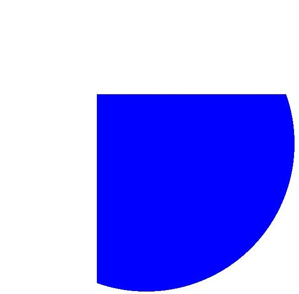
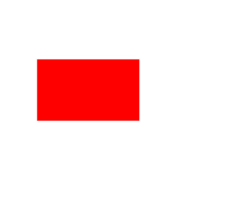

# Canvas Operations and State Processing (C/C++)


## When to Use

After the canvas is created or obtained, a graphics operation and state processing may be further performed based on the canvas. Canvas operations are optional. You can perform these operations based on the scenario requirements. You need to perform operations on the canvas before drawing the canvas. Only in this way can the canvas operations take effect.

Common canvas operations are as follows:

- Cropping

- Matrix transformation, such as translation, scaling, and rotation.

- Status saving and restoration


## Cropping

Cropping is a common operation in graphics processing. Cropping is performed on the canvas itself and can be used to limit the drawing area and draw only the specified area. You need to perform the cropping operation and then draw the image to obtain the corresponding effect.

Currently, the following tailoring operations are supported:

- Crops a rectangle.

- Crops a rounded rectangle.

- Crops the user-defined path.

- Crops a region.


### Available APIs

The following table lists the common tailoring APIs. For details about the usage and parameters, see [drawing_canvas.h](../reference/apis-arkgraphics2d/drawing__canvas_8h.md).

| Interface| Description|
| -------- | -------- |
| void OH_Drawing_CanvasClipRect (OH_Drawing_Canvas \*, const OH_Drawing_Rect \*, OH_Drawing_CanvasClipOp clipOp, bool doAntiAlias) | Clips a rectangle.|
| void OH_Drawing_CanvasClipRoundRect (OH_Drawing_Canvas \*, const OH_Drawing_RoundRect \*, OH_Drawing_CanvasClipOp clipOp, bool doAntiAlias) | Clips a rounded rectangle.|
| void OH_Drawing_CanvasClipPath (OH_Drawing_Canvas \*, const OH_Drawing_Path \*, OH_Drawing_CanvasClipOp clipOp, bool doAntiAlias) | Clips a path.|
| OH_Drawing_ErrorCode OH_Drawing_CanvasClipRegion (OH_Drawing_Canvas \*canvas, const OH_Drawing_Region \*region, OH_Drawing_CanvasClipOp clipOp) | Clips a region.|


### How to Develop

The following describes how to crop a rectangle on the canvas. The logic of other cropping operations is similar. Call the corresponding APIs and ensure that the data type to be cropped is correct. For details about the usage and parameters, see [drawing_canvas.h](../reference/apis-arkgraphics2d/drawing__canvas_8h.md).

Crop a rectangle by calling OH_Drawing_CanvasClipRect. There are four input parameters:
- The first parameter is the canvas. The cropping operation is performed on the canvas. Ensure that the canvas has been created or obtained. For details, see [Obtaining a Canvas and Displaying Drawing Results (C/C++)](canvas-get-result-draw-c.md).

- The second parameter is the rectangular area to be cropped.

- The third parameter is the cropping operation type, including INTERSECT and DIFFERENCE.

- The fourth parameter indicates whether anti-aliasing is required.

```c++
// Create a brush object.
OH_Drawing_Brush *brush = OH_Drawing_BrushCreate();
// Set the brush fill color to blue.
OH_Drawing_BrushSetColor(brush, 0xff0000ff);
// Set the brush in the canvas.
OH_Drawing_CanvasAttachBrush(canvas, brush); 
OH_Drawing_Rect *rect = OH_Drawing_RectCreate(400, 400, 1200, 1200);
// Crop a rectangular area.
OH_Drawing_CanvasClipRect(canvas, rect, OH_Drawing_CanvasClipOp::INTERSECT, true); 
OH_Drawing_Point *point = OH_Drawing_PointCreate(600, 600);
// Draw a circle on the canvas.
OH_Drawing_CanvasDrawCircle(canvas, point, 600); 
// Remove the brush from the canvas.
OH_Drawing_CanvasDetachBrush(canvas);
// Destroy the brush object and reclaim the memory occupied by the brush object.
OH_Drawing_BrushDestroy(brush);
```

| Original image| Image after cropping|
| -------- | -------- |
|  |  |


## Matrix Transformation

Matrix transformation is also a common canvas operation, is a coordinate system transformation, and is used to change a graph.

Currently, the following matrix transformations are supported:

- Translation

- Scaling

- Rotation


### Available APIs

The following table lists the common APIs for matrix transformation. For details about the usage and parameters, see [drawing_matrix.h](../reference/apis-arkgraphics2d/drawing__matrix_8h.md).

| Interface| Description|
| -------- | -------- |
| void OH_Drawing_CanvasTranslate (OH_Drawing_Canvas \*, float dx, float dy) | Translates a canvas by a given distance.|
| void OH_Drawing_CanvasScale (OH_Drawing_Canvas \*, float sx, float sy) | Scales a canvas.|
| void OH_Drawing_CanvasRotate (OH_Drawing_Canvas \*, float degrees, float px, float py) | Rotates a canvas by a given angle. A positive value indicates a clockwise rotation, and a negative value indicates a counterclockwise rotation.|
| void OH_Drawing_CanvasSkew (OH_Drawing_Canvas \*, float sx, float sy) | Skews a canvas. This function premultiplies the current canvas matrix by a skew transformation matrix and applies the resulting matrix to the canvas. The skew transformation matrix is as follows: \|1 sx 0\| \|sy 1 0\| \|0 0 1\|.|


### Translation

Use the OH_Drawing_MatrixCreateTranslation() API to translate the canvas. The interface accepts two parameters, that is, the horizontal translation amount and vertical translation amount. The unit is pixel.

The following figure shows a simple example.

```c++
// Create a brush object.
OH_Drawing_Brush* brush = OH_Drawing_BrushCreate();
// Set the fill color to be superimposed on the image.
OH_Drawing_BrushSetColor(brush, OH_Drawing_ColorSetArgb(0xFF, 0xFF, 0x00, 0x00));
// Set the brush in the canvas.
OH_Drawing_CanvasAttachBrush(canvas, brush); 
// Create a matrix object that is translated by 300 px in the horizontal and vertical directions.
OH_Drawing_Matrix *matrix = OH_Drawing_MatrixCreateTranslation(300, 300); 
// Perform matrix transformation on Canvas.
OH_Drawing_CanvasConcatMatrix(canvas, matrix);
// Draw a rectangle.
OH_Drawing_Rect *rect = OH_Drawing_RectCreate(200, 300, 700, 600); 
OH_Drawing_CanvasDrawRect(canvas, rect);
// Remove the brush from the canvas.
OH_Drawing_CanvasDetachBrush(canvas);
OH_Drawing_RectDestroy(rect);
OH_Drawing_MatrixDestroy(matrix);
```

| Original image| Effect after translation|
| -------- | -------- |
|  |  |


### Rotation

Call the OH_Drawing_MatrixCreateRotation() API to rotate the canvas. The API accepts three parameters: rotation angle, X coordinate of the rotation center, and Y coordinate of the rotation center.

The following figure shows a simple example.

```c++
// Create a brush object.
OH_Drawing_Brush* brush = OH_Drawing_BrushCreate();
// Set the fill color to be superimposed on the image.
OH_Drawing_BrushSetColor(brush, OH_Drawing_ColorSetArgb(0xFF, 0xFF, 0x00, 0x00));
// Set the brush in the canvas.
OH_Drawing_CanvasAttachBrush(canvas, brush); 
// Create a rotation matrix object. The three parameters are the rotation angle and rotation center coordinates.
OH_Drawing_Matrix* matrix = OH_Drawing_MatrixCreateRotation(45, 200, 300);
// Perform matrix transformation on Canvas.
OH_Drawing_CanvasConcatMatrix(canvas, matrix);
// Draw a rectangle.
OH_Drawing_Rect *rect = OH_Drawing_RectCreate(200, 300, 700, 600); 
OH_Drawing_CanvasDrawRect(canvas, rect);
// Remove the brush from the canvas.
OH_Drawing_CanvasDetachBrush(canvas);
OH_Drawing_RectDestroy(rect);
OH_Drawing_MatrixDestroy(matrix);
```

| Original image| Rotated effect|
| -------- | -------- |
|  |  |


### Scaling

Use the OH_Drawing_MatrixCreateScale() API to scale the canvas. The API accepts four parameters: scaling factor along the x-axis and y-axis, and the x-axis and y-axis coordinates of the rotation center.

The following figure shows a simple example.

```c++
// Create a brush object.
OH_Drawing_Brush* brush = OH_Drawing_BrushCreate();
// Fill the color superimposed on the image.
OH_Drawing_BrushSetColor(brush, OH_Drawing_ColorSetArgb(0xFF, 0xFF, 0x00, 0x00));
// Set the brush in the canvas.
OH_Drawing_CanvasAttachBrush(canvas, brush); 
// Create a scaling matrix object. The four parameters are the rotation center coordinates and horizontal and vertical scaling factors.
OH_Drawing_Matrix* matrix = OH_Drawing_MatrixCreateScale(2, 2, 200, 300);
// Perform matrix transformation on Canvas.
OH_Drawing_CanvasConcatMatrix(canvas, matrix);
// Draw a rectangle.
OH_Drawing_Rect *rect = OH_Drawing_RectCreate(200, 300, 700, 600); 
OH_Drawing_CanvasDrawRect(canvas, rect);
// Remove the brush from the canvas.
OH_Drawing_CanvasDetachBrush(canvas);
OH_Drawing_RectDestroy(rect);
```

| Original image| Zoomed-in effect|
| -------- | -------- |
|  |  |


## Saving and Restoring the Canvas State

The save operation is used to save the current canvas status to the top of a stack. The restore operation is used to restore the canvas status saved at the top of the stack. Once the restore operation is performed, a series of operations such as translation, scaling, and cropping between the save and restore operations are cleared.


### Available APIs

The following table lists the APIs for saving and restoring the canvas status. For details about the usage and parameters, see [drawing_canvas.h](../reference/apis-arkgraphics2d/drawing__canvas_8h.md).

| Interface| Description|
| -------- | -------- |
| void OH_Drawing_CanvasSave (OH_Drawing_Canvas \*) | Saves the current canvas status (canvas matrix) to the top of the stack.|
| void OH_Drawing_CanvasRestore (OH_Drawing_Canvas \*) | Restores the canvas status (canvas matrix) saved on the top of the stack.|
| void OH_Drawing_CanvasRestoreToCount (OH_Drawing_Canvas \*, uint32_t saveCount) | Restores to a given number of canvas statuses (canvas matrices).|


### How to Develop

```c++
// Create a pen object.
OH_Drawing_Pen* pen = OH_Drawing_PenCreate();
// Set the stroke color.
OH_Drawing_PenSetColor(pen, OH_Drawing_ColorSetArgb(0xFF, 0xFF, 0x00, 0x00));
// Set the line width of the pen.
OH_Drawing_PenSetWidth(pen, 20);
// Set the pen in the canvas.
OH_Drawing_CanvasAttachPen(canvas, pen);
// Save the current canvas status. Currently, operations such as zoom-in are not performed. The original status is saved.
OH_Drawing_CanvasSave(canvas); 
OH_Drawing_Matrix *matrix = OH_Drawing_MatrixCreateScale(2, 2, 2, 2);
// Zoom In
OH_Drawing_CanvasConcatMatrix(canvas, matrix); 
OH_Drawing_Point* point = OH_Drawing_PointCreate(300, 300);
// Draw a circle. Because the zoom-in operation has been performed, a large circle is drawn.
OH_Drawing_CanvasDrawCircle(canvas, point, 200); 
// Restore the image to the original state without zooming in.
OH_Drawing_CanvasRestore(canvas); 
// Draw a circle. The circle is drawn because it has been restored to the original state without being zoomed in.
OH_Drawing_CanvasDrawCircle(canvas, point, 200); 
// Remove the pen from the canvas.
OH_Drawing_CanvasDetachPen(canvas);
// Destroy the pen object and reclaim the memory occupied by the object.
OH_Drawing_PenDestroy(pen);
OH_Drawing_PointDestroy(point);
OH_Drawing_MatrixDestroy(matrix);
```


