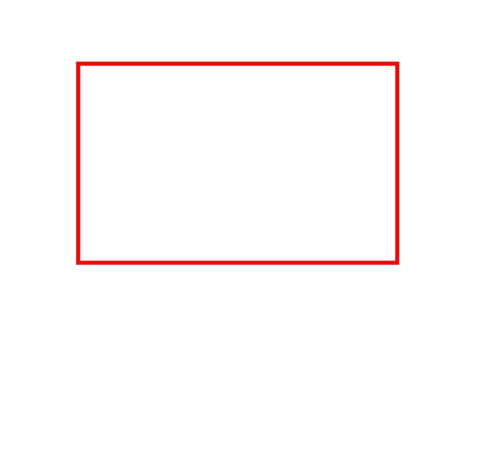
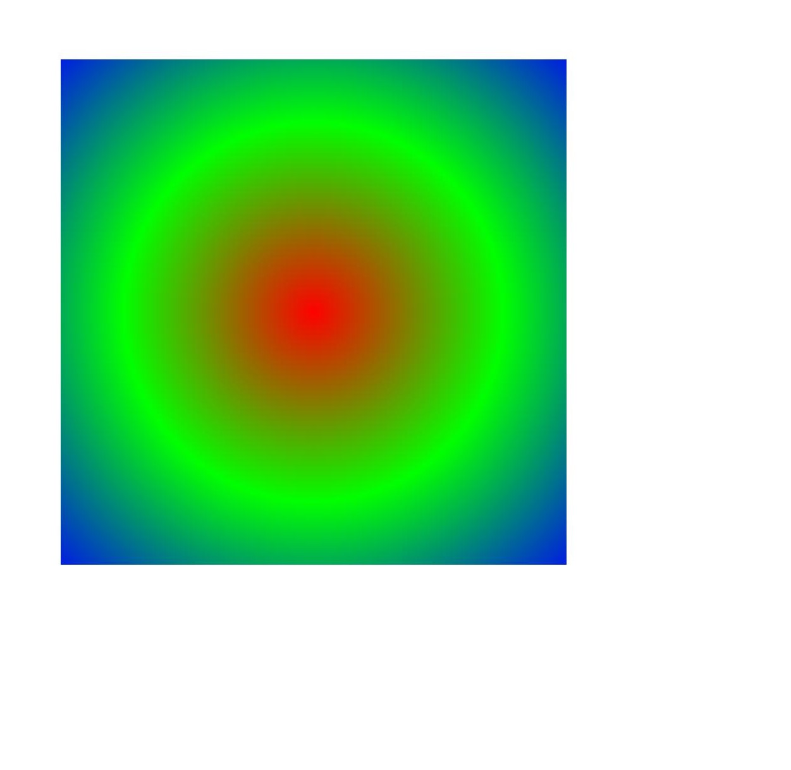
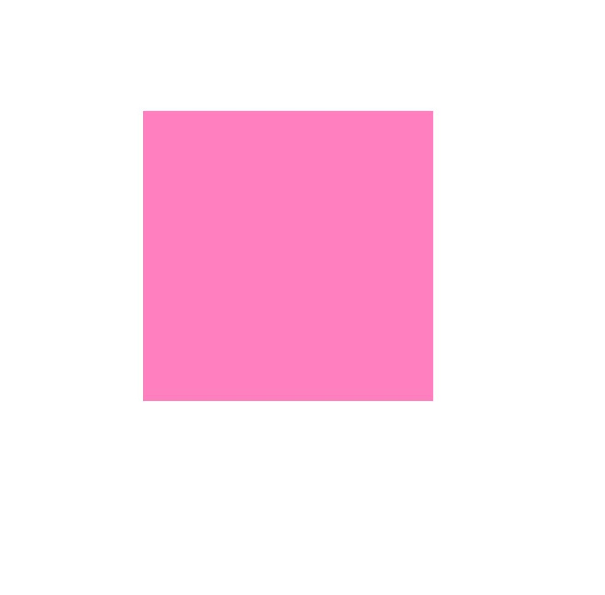
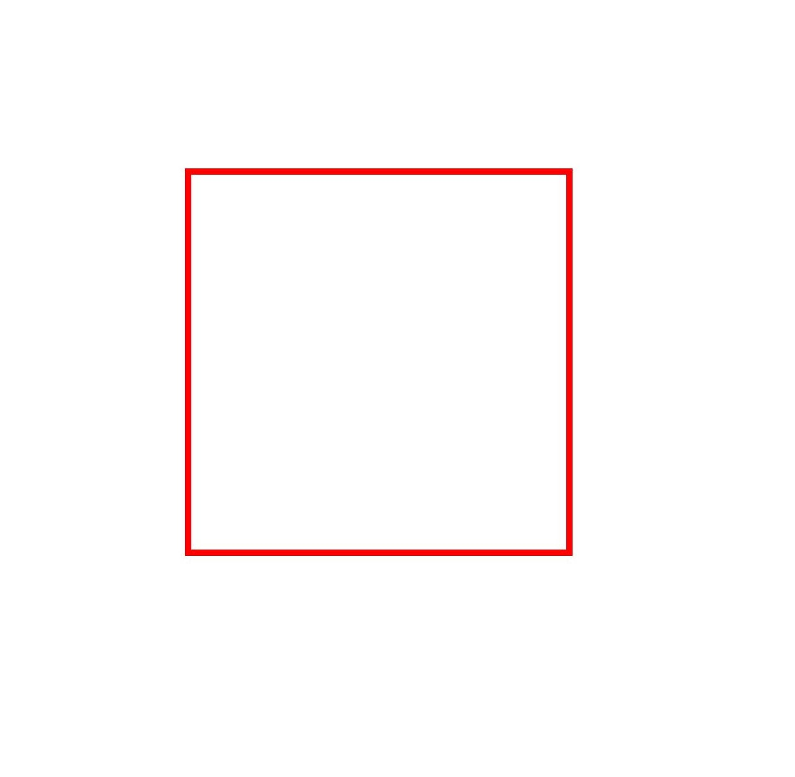

# Complex Drawing Effects (ArkTS)


In addition to the basic fill color, stroke color, and some style settings, you can also use pens and brushes to implement more complex drawing effects. For example,


- Blend mode.

- Path effect, such as the dotted line effect.

- Shader effect, such as linear gradient and radial gradient.

- Filter effect, such as the blur effect.


## Blend Mode

The blend mode can be used for pens or brushes. It defines how to combine the source pixel (content to be drawn) with the target pixel (content that already exists on the canvas).

You can use the setBlendMode() API to apply the blend mode to a pen or brush. This API needs to accept the BlendMode parameter, that is, the blend mode type. For details, see [BlendMode](../reference/apis-arkgraphics2d/js-apis-graphics-drawing.md#blendmode).

The following uses the brush as an example to describe how to set the blending mode. (To prevent the blending mode from being interfered by the background color, the background color is not set for the canvas in the example, and the default black background is used.) The following figure shows the key example and effect.

```ts
// Create a brush.
let brush = new drawing.Brush();
// Set the color of the target pixel, that is, the color of the rectangle.
brush.setColor(0xFF, 0xFF,  0x00, 0x00);
// Set the brush effect of the target pixel in Canvas.
canvas.attachBrush(brush);
// Create a rectangle object.
let rect: common2D.Rect = { left: 100, top: 100, right: 600, bottom: 600 };
// Draw a rectangle (target pixel).
canvas.drawRect(rect);
// Set the color of the source pixel, that is, the color of the circle.
brush.setColor(0xFF, 0x00,  0x00, 0xFF);
// Set the blending mode to overlay.
brush.setBlendMode(drawing.BlendMode.PLUS);
// Set the brush effect of the source pixel to Canvas.
canvas.attachBrush(brush);
// Draw a circle (source pixel).
canvas.drawCircle(600, 600, 300);
// Remove the filling effect.
canvas.detachBrush();
```


## Path Effects

The path effect is similar to the dotted line effect, which is used only for pens.

You can use the createDashPathEffect() interface to set the path effect. The interface accepts the following two parameters:

- Floating-point array intervals: indicates the interval between dotted lines or dots.

- Floating-point number phase: indicates the offset in the intervals array, that is, the position from which the dotted line or dot line effect is applied.

The following uses the drawing of a rectangular dotted line as an example. The following figure shows the key example and effect.

```ts
// Create a pen.
let pen = new drawing.Pen();
// Set the line width.
pen.setStrokeWidth(10.0);
// Set the color.
pen.setColor(0xFF, 0xFF, 0x00, 0x00);
// 10px solid line, 5px interval, 2px solid line, 5px interval, and so on
let intervals = [10, 5, 2, 5];
// Set the dotted line path effect.
let effect = drawing.PathEffect.createDashPathEffect(intervals, 0);
pen.setPathEffect(effect);
// Set the stroke effect.
canvas.attachPen(pen);
// Create a rectangle.
let rect: common2D.Rect = { left: 200, top: 200, right: 1000, bottom: 700 };
// Draw a rectangle.
canvas.drawRect(rect);
// Remove the stroke effect.
canvas.detachPen();
```

| Original image| Effect after the dotted line effect is set|
| -------- | -------- |
|  |  |


## Shader Effects

The shader effect is implemented based on the pen or brush. You can call the setShaderEffect() API to set the shader effect of the pen or brush. Currently, different shader effects are supported, such as linear gradient shader, radial gradient shader, and sector gradient shader.


For details about shader APIs and parameters, see [ShaderEffect](../reference/apis-arkgraphics2d/js-apis-graphics-drawing.md#shadereffect12).


### Linear Gradient Shader Effects

You can use the createLinearGradient() interface to create the linear gradient shader effect to be set. The interface accepts six parameters: start point, end point, color array, tile mode, relative position array, and matrix object.

- The start point and the end point are used to determine a gradient direction.

- The color array is used to store colors used for gradient.

- The relative position array is used to determine a relative position of each color in the gradient. If the relative position is empty, the colors are evenly distributed between the start point and the end point.

- Matrix object, which is used to perform matrix transformation on the shader. The default value is null, indicating the identity matrix.

- The tile mode is used to determine how to continue the gradient effect outside the gradient area. The tile mode is classified into the following four types:
  - CLAMP: When the image exceeds its original boundary, the edge color is copied.
  - REPEAT: repeats the image in the horizontal and vertical directions.
  - MIRROR: Images are repeated in the horizontal and vertical directions, and mirror images are used alternately between adjacent images.
  - DECAL: Draws only in the original domain and returns the transparent black color in other places.

The following describes how to draw a rectangle and use the brush to set the linear gradient shader effect. The following figure shows the key example and effect.

```ts
let startPt: common2D.Point = { x: 100, y: 100 };
let endPt: common2D.Point = { x: 900, y: 900 };
let colors = [0xFFFFFF00, 0xFFFF0000, 0xFF0000FF];
// Create a linear gradient shader.
let shaderEffect = drawing.ShaderEffect.createLinearGradient(startPt, endPt, colors, drawing.TileMode.CLAMP);
// Create a brush.
let brush = new drawing.Brush();
// Set the linear shader.
brush.setShaderEffect(shaderEffect);
// Set the brush filling effect.
canvas.attachBrush(brush);
let rect: common2D.Rect = { left: 100, top: 100, right: 900, bottom: 900 };
// Draw a rectangle.
canvas.drawRect(rect);
// Remove the filling effect.
canvas.detachBrush();
```


### Radial Gradient Shader Effects

You can use the createRadialGradient() interface to create a radial gradient shader effect. The interface accepts six parameters: centerPt, radius, colors, tileMode, pos, and matrix.

An implementation of the radial gradient shader is similar to that of the linear gradient shader, and a difference is that the radial gradient is radially changed outward from the center of the circle.

The following describes how to draw a rectangle and use the brush to set the radial gradient shader effect. The following figure shows the key example and effect.

```ts
let centerPt: common2D.Point = { x: 500, y: 500 };
let colors = [0xFFFF0000, 0xFF00FF00, 0xFF0000FF];
// Create a radial gradient shader.
let shaderEffect = drawing.ShaderEffect.createRadialGradient(centerPt, 600, colors, drawing.TileMode.CLAMP);
// Create a brush.
let brush = new drawing.Brush();
// Set the radial gradient shader.
brush.setShaderEffect(shaderEffect);
// Set the brush filling effect.
canvas.attachBrush(brush);
let rect: common2D.Rect = { left: 100, top: 100, right: 900, bottom: 900 };
// Draw a rectangle.
canvas.drawRect(rect);
// Remove the filling effect.
canvas.detachBrush();
```




### Sector Gradient Shader Effects

You can use the createSweepGradient API to create the desired sector gradient shader effect. The interface accepts seven parameters: centerPt, colors, TileMode, startAngle, and endAngle, a relative position array (pos), and a matrix object (matrix).

The implementation is similar to that of the linear gradient shader. The difference is that the sector gradient changes in the process of rotating around the center point.

The following describes how to draw a rectangle and use the brush to set the sector gradient shader effect. The following figure shows the key example and effect.

```ts
let centerPt: common2D.Point = { x: 500, y: 500 };
let colors = [0xFF00FFFF, 0xFFFF00FF, 0xFFFFFF00];
// Create a sector gradient shader.
let shaderEffect = drawing.ShaderEffect.createSweepGradient(centerPt, colors, drawing.TileMode.CLAMP, 0, 360);
// Create a brush.
let brush = new drawing.Brush();
// Set the sector gradient shader.
brush.setShaderEffect(shaderEffect);
// Set the brush filling effect.
canvas.attachBrush(brush);
let rect: common2D.Rect = { left: 100, top: 100, right: 900, bottom: 900 };
// Draw a rectangle.
canvas.drawRect(rect);
// Remove the filling effect.
canvas.detachBrush();
```


## Filter Effects

The filter effect may be implemented based on a pen or brush. Currently, different filter effects are supported, such as the image filter, color filter, and mask filter.

For details about the filter APIs and parameters, see [ImageFilter](../reference/apis-arkgraphics2d/js-apis-graphics-drawing.md#imagefilter12).


### Color Filter Effects

The color filter can be implemented based on the pen or brush. For details about the color filter APIs and parameters, see [ColorFilter](../reference/apis-arkgraphics2d/js-apis-graphics-drawing.md#colorfilter).

Currently, multiple color filters can be implemented, including:

- Creates an **OH_Drawing_ColorFilter** object with a given blend mode.

- Creates an **OH_Drawing_ColorFilter** object with a given 5x4 color matrix.

- Apply the gamma curve of SRGB to the color filter of the RGB color channel.

- A color filter that applies the RGB color channel to the gamma curve of SRGB.

- A color filter that multiplies its input luminance value by the alpha channel and sets the red, green, and blue channels to zero.

- A color filter that consists of two color filters.

Here, a color filter with a 5x4 color matrix is used as an example.

You can use the createMatrixColorFilter() interface to create a color filter with a 5x4 color matrix. The interface takes one parameter, which is represented as a color matrix. It is an array of floating point numbers with a length of 20. The array format is as follows:

[ a0, a1, a2, a3, a4 ]

[ b0, b1, b2, b3, b4 ]

[ c0, c1, c2, c3, c4 ]

[ d0, d1, d2, d3, d4 ]

For each original pixel color value (R, G, B, A), a transformed color value (R', G', B', A') is calculated as follows:

R' = a0\*R + a1\*G + a2\*B + a3\*A + a4

G' = b0\*R + b1\*G + b2\*B + b3\*A + b4

B' = c0\*R + c1\*G + c2\*B + c3\*A + c4

A' = d0\*R + d1\*G + d2\*B + d3\*A + d4

The following describes how to draw a rectangle and use the brush to set the color filter effect with a 5 x 4 color matrix. The following figure shows the key example and effect.

```ts
// Create a brush.
let brush = new drawing.Brush();
// Set the color.
brush.setColor(0xFF, 0xFF, 0x00, 0x00);
// Set the color matrix.
let matrix: Array<number> = [
  1, 0, 0, 0, 0,
  0, 1, 0, 0, 0,
  0, 0, 0.5, 0.5, 0,
  0, 0, 0.5, 0.5, 0
];
// Create a color filter for the 5x4 color matrix.
let filter = drawing.ColorFilter.createMatrixColorFilter(matrix);
// Set the color filter.
brush.setColorFilter(filter);
// Set the brush filling effect.
canvas.attachBrush(brush);
let rect: common2D.Rect = { left: 300, top: 300, right: 900, bottom: 900 };
// Draw a rectangle.
canvas.drawRect(rect);
// Remove the filling effect.
canvas.detachBrush();
```

| Original image| Effect after the color filter of the 5x4 color matrix is set|
| -------- | -------- |
|  |  |


### Image Filter Effects

The image filter can be implemented based on the pen or brush. For details about the image filter APIs and parameters, see [ImageFilter](../reference/apis-arkgraphics2d/js-apis-graphics-drawing.md#imagefilter12).

Currently, only two types of image filters are supported:

- Image filter based on the color filter.
  You can implement this function by calling createFromColorFilter(). The interface accepts two parameters: colorFilter and imageFilter. That is, the effect of the color filter is superimposed on the imageFilter. The imageFilter can be null. If the imageFilter is null, only the effect of the color filter is added.

- Creates an image filter with a given blur effect.
  You can use the createBlurImageFilter() interface to implement this function. The interface accepts four parameters: sigmaX, sigmaY, cTileMode, and imageFilter. sigmaX and sigmaY are the standard deviation of blur, cTileMode is the tile mode, and imageFilter is the input image filter.

  The final effect is to perform blurring processing based on the input image filter imageFilter. That is, the filter effect can be overlaid. imageFilter can be empty. If imageFilter is empty, only the blur effect is added.

The following uses drawing a rectangle and using a pen to add the blur effect to the image filter as an example. The following figure shows the key example and effect.

```ts
// Set the pen.
let pen = new drawing.Pen();
// Set the line width.
pen.setStrokeWidth(10.0);
// Set the color.
pen.setColor(0xFF, 0xFF, 0x00, 0x00);
// Create a blurry image filter.
let filter = drawing.ImageFilter.createBlurImageFilter(20, 20, drawing.TileMode.CLAMP);
// Set the image filter.
pen.setImageFilter(filter);
// Set the stroke effect.
canvas.attachPen(pen);
let rect: common2D.Rect = { left: 300, top: 300, right: 900, bottom: 900 };
// Draw a rectangle.
canvas.drawRect(rect);
// Remove the stroke effect.
canvas.detachPen();
```

| Original image| Effect after the blur effect is set|
| -------- | -------- |
|  |  |


### Mask Filter Effects

The blur effect of the mask filter blurs only the transparency and shape edges. Compared with the blur effect of the image filter, the calculation cost of the mask filter is lower.

The mask filter can be implemented based on the pen or brush. For details about the mask filter APIs and parameters, see [MaskFilter](../reference/apis-arkgraphics2d/js-apis-graphics-drawing.md#maskfilter12).

You can use the createBlurMaskFilter() interface to create a mask filter with the blur effect. The interface accepts the following two parameters:

- blurType: fuzzy type to be applied. For details, see [BlurType](../reference/apis-arkgraphics2d/js-apis-graphics-drawing.md#blurtype12).

- sigma: specifies the standard deviation of the Gaussian blur to be applied. The standard deviation must be greater than 0.

The following describes how to draw a rectangle and use a pen to set the mask filter effect. The following figure shows the key example and effect.

```ts
// Create a pen.
let pen = new drawing.Pen();
// Set the line width.
pen.setStrokeWidth(10.0);
// Set the color.
pen.setColor(0xFF, 0xFF, 0x00, 0x00);
// Create a mask filter for the blur effect.
let filter = drawing.MaskFilter.createBlurMaskFilter(drawing.BlurType.NORMAL, 20);
// Set the blur effect.
pen.setMaskFilter(filter);
// Set the stroke effect.
canvas.attachPen(pen);
let rect: common2D.Rect = { left: 300, top: 300, right: 900, bottom: 900 };
// Draw a rectangle.
canvas.drawRect(rect);
// Remove the stroke effect.
canvas.detachPen();
```

| Original image| Effect after the blur effect is set|
| -------- | -------- |
|  |  |
