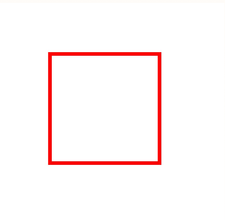
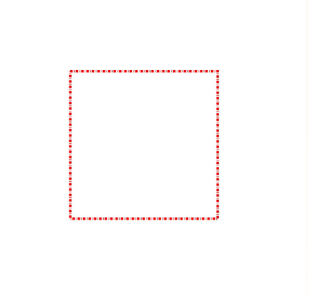
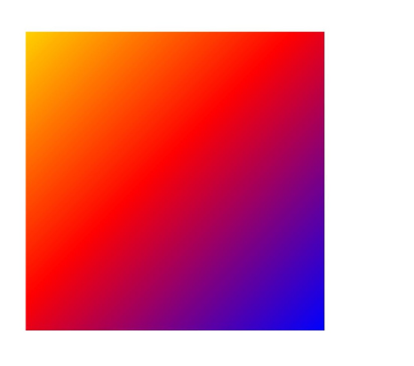
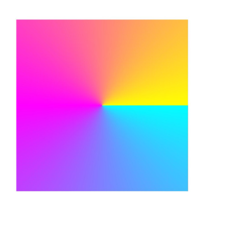
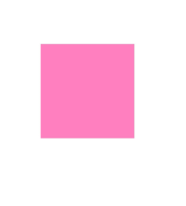

# Complex Drawing Effects (C/C++)


In addition to the basic fill color, stroke color, and some style settings, you can also use penes and penes to implement more complex drawing effects. For example,


- Blend mode.

- Path effect, such as the dotted line effect.

- Shader effect, such as linear gradient and radial gradient.

- Filtering effect, such as the blur effect.


## Blend Mode

The blend mode can be used for penes or penes. It defines how to combine the source pixel (content to be drawn) with the target pixel (content that already exists on the canvas).

You can use the OH_Drawing_penSetBlendMode() interface to apply the blending mode to the pen, and use the OH_Drawing_PenSetBlendMode interface to apply the blending mode to the pen. Both APIs need to accept the OH_Drawing_BlendMode parameter, that is, the blending mode type. For details, see [BlendMode](../reference/apis-arkgraphics2d/js-apis-graphics-drawing.md#blendmode).

The following uses the brush as an example to describe how to set the blending mode. (To prevent the blending mode from being interfered by the background color, the background color is not set for the canvas in the example, and the default black background is used.) The following figure shows the key example and effect.

```c++
// Create a brush object.
OH_Drawing_Brush* brush = OH_Drawing_BrushCreate();
// Set the target pixel color.
OH_Drawing_BrushSetColor(brush, OH_Drawing_ColorSetArgb(0xFF, 0xFF, 0x00, 0x00));
// Set the brush effect of the target pixel in Canvas.
OH_Drawing_CanvasAttachBrush(canvas, brush);
// Create a rectangle object.
OH_Drawing_Rect *rect = OH_Drawing_RectCreate(100, 100, 600, 600);
// Draw a rectangle (target pixel).
OH_Drawing_CanvasDrawRect(canvas, rect);
// Set the source pixel color.
OH_Drawing_BrushSetColor(brush, OH_Drawing_ColorSetArgb(0xFF, 0x00, 0x00, 0xFF));
// Set the blending mode to overlay.
OH_Drawing_BrushSetBlendMode(brush, OH_Drawing_BlendMode::BLEND_MODE_PLUS);
// Set the brush effect of the source pixel to Canvas.
OH_Drawing_CanvasAttachBrush(canvas, brush);
// Create a point object for the center of a circle.
OH_Drawing_Point *point = OH_Drawing_PointCreate(600, 600);
// Draw a circle (source pixel).
OH_Drawing_CanvasDrawCircle(canvas, point, 300);
// Remove the brush from the canvas.
OH_Drawing_CanvasDetachBrush(canvas);
// Destroy various objects.
OH_Drawing_RectDestroy(rect);
OH_Drawing_BrushDestroy(brush);
OH_Drawing_PointDestroy(point);
```


## Path Effects

The path effect is similar to the dotted line effect, which is used only for penes.

You can set the path effect by calling OH_Drawing_CreateDashPathEffect(). The interface accepts the following parameters:

- Floating-point array intervals: indicates the interval between dotted lines or dots.

- Integer count: indicates the number of elements in the intervals array.

- Floating-point number phase: indicates the offset in the intervals array, that is, the position from which the dotted line or dot line effect is applied.

The following uses the drawing of a rectangular dotted line as an example. The following figure shows the key example and effect.

```c++
// Create a pen.
OH_Drawing_Pen *pen = OH_Drawing_PenCreate();
// Set the stroke color.
OH_Drawing_PenSetColor(pen, 0xffff0000);
// Set the line width of the pen.
OH_Drawing_PenSetWidth(pen, 10);
// 10px solid line, 5px interval, 2px solid line, 5px interval, and so on
float intervals[] = {10, 5, 2, 5};
// Set the dotted line path effect.
OH_Drawing_PathEffect *pathEffect = OH_Drawing_CreateDashPathEffect(intervals, 4, 0.0); 
OH_Drawing_PenSetPathEffect(pen, pathEffect);
// Set the pen on the canvas. Ensure that the canvas object has been obtained.
OH_Drawing_CanvasAttachPen(canvas, pen); 
// Create a rectangle.
OH_Drawing_Rect *rect = OH_Drawing_RectCreate(300, 300, 900, 900);
// Draw a rectangle.
OH_Drawing_CanvasDrawRect(canvas, rect); 
// Remove the pen from the canvas.
OH_Drawing_CanvasDetachPen(canvas);
// Destroy various objects.
OH_Drawing_PenDestroy(pen);
OH_Drawing_RectDestroy(rect);
OH_Drawing_PathEffectDestroy(pathEffect);
```

| Effect of not setting a dotted line path| Setting the dotted line effect|
| -------- | -------- |
|  |  |


## Shader Effects

The shader effect is implemented based on the pen or pen. You can call OH_Drawing_penSetShaderEffect() to set the shader effect of the pen, you can also call the OH_Drawing_PenSetShaderEffect API to set the shader effect of the pen. Currently, different shader effects are supported, such as linear gradient shader, radial gradient shader, and sector gradient shader.

For details about shader APIs and parameters, see [drawing_shader_effect](../reference/apis-arkgraphics2d/drawing__shader__effect_8h.md).


### Linear Gradient Shader Effects

You can call OH_Drawing_ShaderEffectCreateLinearGradient() to create the linear gradient shader effect to be set. The interface accepts six parameters: start point, end point, color array, relative position array, color array size, and tile mode.

- The start point and the end point are used to determine a gradient direction.

- The color array is used to store colors used for gradient.

- The relative position array is used to determine a relative position of each color in the gradient. If the relative position is empty, the colors are evenly distributed between the start point and the end point.

- The tile mode is used to determine how to continue the gradient effect outside the gradient area. The tile mode is classified into the following four types:
  - CLAMP: When the image exceeds its original boundary, the edge color is copied.
  - REPEAT: repeats the image in the horizontal and vertical directions.
  - MIRROR: Images are repeated in the horizontal and vertical directions, and mirror images are used alternately between adjacent images.
  - DECAL: Draws only in the original domain and returns the transparent black color in other places.

The following describes how to draw a rectangle and use the brush to set the linear gradient shader effect. The following figure shows the key example and effect.

```c++
// Start point
OH_Drawing_Point *startPt = OH_Drawing_PointCreate(20, 20);
To
OH_Drawing_Point *endPt = OH_Drawing_PointCreate(900, 900);
Color array.
uint32_t colors[] = {0xFFFFFF00, 0xFFFF0000, 0xFF0000FF};
// Relative position array
float pos[] = {0.0f, 0.5f, 1.0f};
// Create a linear gradient shader effect.
OH_Drawing_ShaderEffect *colorShaderEffect =
    OH_Drawing_ShaderEffectCreateLinearGradient(startPt, endPt, colors, pos, 3, OH_Drawing_TileMode::CLAMP);
// Create a brush object.
OH_Drawing_Brush* brush = OH_Drawing_BrushCreate();
// Set the shader effect based on the brush.
OH_Drawing_BrushSetShaderEffect(brush, colorShaderEffect); 
// Set the brush on the canvas. Ensure that the canvas object has been obtained.
OH_Drawing_CanvasAttachBrush(canvas, brush); 
OH_Drawing_Rect *rect = OH_Drawing_RectCreate(100, 100, 900, 900);
 // Draw a rectangle.
OH_Drawing_CanvasDrawRect(canvas, rect);
// Remove the brush from the canvas.
OH_Drawing_CanvasDetachBrush(canvas);
// Destroy various objects.
OH_Drawing_BrushDestroy(brush);
OH_Drawing_RectDestroy(rect);
OH_Drawing_ShaderEffectDestroy(colorShaderEffect);
OH_Drawing_PointDestroy(startPt);
OH_Drawing_PointDestroy(endPt);
```

The rectangle with the linear gradient shader effect drawn in this example is as follows:




### Radial Gradient Shader Effects

You can call the OH_Drawing_ShaderEffectCreateRadialGradient() API to create a radial gradient shader effect. The interface accepts six parameters: centerPt, radius, colors, pos, size, and OH_Drawing_TileMode.

An implementation of the radial gradient shader is similar to that of the linear gradient shader, and a difference is that the radial gradient is radially changed outward from the center of the circle.

The following describes how to draw a rectangle and use the brush to set the radial gradient shader effect. The following figure shows the key example and effect.

```c++
// Coordinates of the circle center
OH_Drawing_Point *centerPt = OH_Drawing_PointCreate(500, 500);
radius
float radius = 600;
Color array.
uint32_t gColors[] = {0xFFFF0000, 0xFF00FF00, 0xFF0000FF};
// Relative position array
float_t gPos[] = {0.0f, 0.25f, 0.75f};
// Create a radial gradient shader effect.
OH_Drawing_ShaderEffect *colorShaderEffect =
    OH_Drawing_ShaderEffectCreateRadialGradient(centerPt, radius, gColors, gPos, 3, OH_Drawing_TileMode::REPEAT);
// Create a brush object.
OH_Drawing_Brush* brush = OH_Drawing_BrushCreate();
// Set the shader effect based on the brush.
OH_Drawing_BrushSetShaderEffect(brush, colorShaderEffect); 
// Set the brush on the canvas. Ensure that the canvas object has been obtained.
OH_Drawing_CanvasAttachBrush(canvas, brush); 
OH_Drawing_Rect *rect = OH_Drawing_RectCreate(100, 100, 900, 900);
 // Draw a rectangle.
OH_Drawing_CanvasDrawRect(canvas, rect);
// Remove the brush from the canvas.
OH_Drawing_CanvasDetachBrush(canvas);
// Destroy various objects.
OH_Drawing_BrushDestroy(brush);
OH_Drawing_RectDestroy(rect);
OH_Drawing_ShaderEffectDestroy(colorShaderEffect);
OH_Drawing_PointDestroy(centerPt);
```

In this example, the rectangle with the radial gradient shader effect is as follows:


### Sector Gradient Shader Effects

You can call the OH_Drawing_ShaderEffectCreateSweepGradient() API to create the desired sector gradient shader effect. The interface accepts five parameters: center point, color array, relative position array, number of colors and relative positions, and tile mode.

The implementation is similar to that of the linear gradient shader. The difference is that the sector gradient changes in the process of rotating around the center point.

The following describes how to draw a rectangle and use the brush to set the sector gradient shader effect. The following figure shows the key example and effect.

```c++
Center
OH_Drawing_Point *centerPt = OH_Drawing_PointCreate(500, 500);
Color array.
uint32_t colors[3] = {0xFF00FFFF, 0xFFFF00FF, 0xFFFFFF00};
// Relative position array
float pos[3] = {0.0f, 0.5f, 1.0f};
// Create a sector gradient shader effect.
OH_Drawing_ShaderEffect* colorShaderEffect =
    OH_Drawing_ShaderEffectCreateSweepGradient(centerPt, colors, pos, 3, OH_Drawing_TileMode::CLAMP);
// Create a brush object.
OH_Drawing_Brush* brush = OH_Drawing_BrushCreate();
// Set the shader effect based on the brush.
OH_Drawing_BrushSetShaderEffect(brush, colorShaderEffect); 
// Set the brush on the canvas. Ensure that the canvas object has been obtained.
OH_Drawing_CanvasAttachBrush(canvas, brush); 
OH_Drawing_Rect *rect = OH_Drawing_RectCreate(100, 100, 900, 900);
 // Draw a rectangle.
OH_Drawing_CanvasDrawRect(canvas, rect);
// Remove the brush from the canvas.
OH_Drawing_CanvasDetachBrush(canvas);
// Destroy various objects.
OH_Drawing_BrushDestroy(brush);
OH_Drawing_RectDestroy(rect);
OH_Drawing_ShaderEffectDestroy(colorShaderEffect);
OH_Drawing_PointDestroy(centerPt);
```

In this example, the rectangle with the sector gradient shader effect is as follows:




## Filter Effects

The filter effect may be implemented based on a pen or a pen. You can call the OH_Drawing_PenSetFilter() interface to set the filter effect of the pen or call the OH_Drawing_penSetFilter() interface to set the filter effect of the pen. Currently, different filter effects are supported, such as the image filter, color filter, and mask filter.

For details about the filter APIs and parameters, see [drawing_filter.h](../reference/apis-arkgraphics2d/drawing__filter_8h.md).


### Color Filter Effects

The color filter can be implemented based on the pen or pen. For details about the color filter APIs and parameters, see [drawing_color_filter.h](../reference/apis-arkgraphics2d/drawing__color__filter_8h.md).

Currently, multiple color filters can be implemented, including:

- Creates an **OH_Drawing_ColorFilter** object with a given blend mode.

- Creates an **OH_Drawing_ColorFilter** object with a given 5x4 color matrix.

- Apply the gamma curve of SRGB to the color filter of the RGB color channel.

- A color filter that applies the RGB color channel to the gamma curve of SRGB.

- A color filter that multiplies its input luminance value by the alpha channel and sets the red, green, and blue channels to zero.

- A color filter that consists of two color filters.

Here, a color filter with a 5x4 color matrix is used as an example.

You can create a color filter with a 5x4 color matrix by calling OH_Drawing_ColorFilterCreateMatrix(). The interface takes one parameter, which is represented as a color matrix. It is an array of floating point numbers with a length of 20. The array format is as follows:

[ a0, a1, a2, a3, a4 ]

[ b0, b1, b2, b3, b4 ]

[ c0, c1, c2, c3, c4 ]

[ d0, d1, d2, d3, d4 ]

For each original pixel color value (R, G, B, A), a transformed color value (R', G', B', A') is calculated as follows:

R' = a0\*R + a1\*G + a2\*B + a3\*A + a4

G' = b0\*R + b1\*G + b2\*B + b3\*A + b4

B' = c0\*R + c1\*G + c2\*B + c3\*A + c4

A' = d0\*R + d1\*G + d2\*B + d3\*A + d4

The following describes how to draw a rectangle and use the brush to set the color filter effect with a 5 x 4 color matrix. The following figure shows the key example and effect.

```c++
// Create a brush.
OH_Drawing_Brush *brush = OH_Drawing_BrushCreate();
// Set the brush anti-aliasing.
OH_Drawing_BrushSetAntiAlias(brush, true);
// Set the brush fill color.
OH_Drawing_BrushSetColor(brush, 0xffff0000);
// Set the color matrix.
const float matrix[20] = {
    1, 0, 0, 0, 0,
    0, 1, 0, 0, 0,
    0, 0, 0.5f, 0.5f, 0,
    0, 0, 0.5f, 0.5f, 0
}; 

// Create a filter color.
OH_Drawing_ColorFilter* colorFilter = OH_Drawing_ColorFilterCreateMatrix(matrix); 
Creates an **OH_Drawing_Filter** object.
OH_Drawing_Filter *filter = OH_Drawing_FilterCreate();
// Set the color filter for the filter object.
OH_Drawing_FilterSetColorFilter(filter, colorFilter);
// Set the filter effect of the brush.
OH_Drawing_BrushSetFilter(brush, filter);
// Set the brush on the canvas. Ensure that the canvas object has been obtained.
OH_Drawing_CanvasAttachBrush(canvas, brush);
// Create a rectangle.
OH_Drawing_Rect *rect = OH_Drawing_RectCreate(300, 300, 900, 900);
// Draw a rectangle.
OH_Drawing_CanvasDrawRect(canvas, rect); 
// Remove the brush from the canvas.
OH_Drawing_CanvasDetachBrush(canvas);
// Destroy various objects.
OH_Drawing_BrushDestroy(brush);
OH_Drawing_ColorFilterDestroy(colorFilter);
OH_Drawing_RectDestroy(rect);
OH_Drawing_FilterDestroy(filter);
```

| Effect when the color filter is not set| Setting the color filter effect of the 5x4 color matrix|
| -------- | -------- |
|  |  |


### Image Filter Effects

The image filter can be implemented based on the pen or pen. For details about the image filter APIs and parameters, see [drawing_image_filter.h](../reference/apis-arkgraphics2d/drawing__image__filter_8h.md).

Currently, only two types of image filters are supported:

- Image filter based on the color filter.
  This function can be implemented by calling OH_Drawing_ImageFilterCreateFromColorFilter(). The interface accepts two parameters: colorFilter and input. That is, the effect of the color filter is superimposed on the input of the image filter. The input can be null, if input is empty, only the color filter effect is added.

- Creates an image filter with a given blur effect.
  This function can be implemented by calling OH_Drawing_ImageFilterCreateBlur(). The interface accepts four parameters: blur standard deviation on the X axis, blur standard deviation on the Y axis, tile mode, and image filter (input).

  The final effect is to perform blurring processing based on the input image filter (input). That is, the filter effect can be superimposed. The input can be empty. If the input is empty, only the blur effect is added.

The following uses drawing a rectangle and using a pen to add the blur effect to the image filter as an example. The following figure shows the key example and effect.

```c++
// Create a pen.
OH_Drawing_Pen *pen = OH_Drawing_PenCreate();
// Set the pen anti-aliasing.
OH_Drawing_PenSetAntiAlias(pen, true);
// Set the stroke color.
OH_Drawing_PenSetColor(pen, 0xffff0000);
// Set the line width of the pen.
OH_Drawing_PenSetWidth(pen, 20);
// Create an image filter to implement the blur effect.
OH_Drawing_ImageFilter *imageFilter =
    OH_Drawing_ImageFilterCreateBlur(20.0f, 20.0f, OH_Drawing_TileMode::CLAMP, nullptr); 
Creates an **OH_Drawing_Filter** object.
OH_Drawing_Filter *filter = OH_Drawing_FilterCreate();
// Set the image filter for the filter object.
OH_Drawing_FilterSetImageFilter(filter, imageFilter);
// Set the filter effect of the pen.
OH_Drawing_PenSetFilter(pen, filter);
// Set the pen on the canvas. Ensure that the canvas object has been obtained.
OH_Drawing_CanvasAttachPen(canvas, pen); 
// Create a rectangle.
OH_Drawing_Rect *rect = OH_Drawing_RectCreate(300, 300, 900, 900);
// Draw a rectangle.
OH_Drawing_CanvasDrawRect(canvas, rect); 
// Remove the pen from the canvas.
OH_Drawing_CanvasDetachPen(canvas);
// Destroy various objects.
OH_Drawing_PenDestroy(pen);
OH_Drawing_ImageFilterDestroy(imageFilter);
OH_Drawing_RectDestroy(rect);
OH_Drawing_FilterDestroy(filter);
```

| Effect when no image filter is set| Setting the image filter effect|
| -------- | -------- |
|  |  |


### Mask Filter Effects

The blur effect of the mask filter blurs only the transparency and shape edges. Compared with the blur effect of the image filter, the calculation cost of the mask filter is lower.

The mask filter can be implemented based on the pen or pen. For details about the mask filter APIs and parameters, see [drawing_mask_filter.h](../reference/apis-arkgraphics2d/drawing__mask__filter_8h.md).

You can call H_Drawing_MaskFilterCreateBlur() to create a mask filter with the blur effect. The interface accepts the following parameters:

- blurType: fuzzy type to be applied. For details, see [BlurType](../reference/apis-arkgraphics2d/js-apis-graphics-drawing.md#blurtype12).

- sigma: specifies the standard deviation of the Gaussian blur to be applied. The standard deviation must be greater than 0.

- respectCTM: whether the standard deviation of the blur is modified by the coordinate transformation matrix (CTM). The default value is true, indicating that the standard deviation is modified accordingly.

The following describes how to draw a rectangle and use a pen to set the mask filter effect. The following figure shows the key example and effect.

```c++
// Create a pen.
OH_Drawing_Pen *pen = OH_Drawing_PenCreate();
// Set the pen anti-aliasing.
OH_Drawing_PenSetAntiAlias(pen, true);
// Set the stroke color.
OH_Drawing_PenSetColor(pen, 0xffff0000);
// Set the line width of the pen.
OH_Drawing_PenSetWidth(pen, 20);
// Create a mask filter.
OH_Drawing_MaskFilter *maskFilter = OH_Drawing_MaskFilterCreateBlur(OH_Drawing_BlurType::NORMAL, 20, true); 
Creates an **OH_Drawing_Filter** object.
OH_Drawing_Filter *filter = OH_Drawing_FilterCreate();
// Set a mask filter for the filter object.
OH_Drawing_FilterSetMaskFilter(filter, maskFilter);
// Set the filter effect of the pen.
OH_Drawing_PenSetFilter(pen, filter);
// Set the pen on the canvas. Ensure that the canvas object has been obtained.
OH_Drawing_CanvasAttachPen(canvas, pen); 
// Create a rectangle.
OH_Drawing_Rect *rect = OH_Drawing_RectCreate(300, 300, 900, 900);
// Draw a rectangle.
OH_Drawing_CanvasDrawRect(canvas, rect); 
// Remove the pen from the canvas.
OH_Drawing_CanvasDetachPen(canvas);
// Destroy various objects.
OH_Drawing_PenDestroy(pen);
OH_Drawing_MaskFilterDestroy(maskFilter);
OH_Drawing_RectDestroy(rect);
OH_Drawing_FilterDestroy(filter);
```

| Effect when no mask filter is set| Setting the mask filter effect|
| -------- | -------- |
|  |  |
