# Drawing and Displaying Complex Text (ArkTS)

<!--Kit: ArkGraphics 2D-->
<!--Subsystem: Graphics-->
<!--Owner: @gmiao522-->
<!--Designer: @liumingxiang-->
<!--Tester: @yhl0101-->
<!--Adviser: @ge-yafang-->
<!-- md-trans-meta sourceCommit=cc9ab098c82a97707ffdb5b7d7053b861bc0839c translatedAt=2026-08-03T11:20:09.448Z pushedAt=2026-08-04T03:22:17.422Z -->

Simple text can be drawn and displayed with appropriate fonts, sizes, and colors selected. Additionally, complex text drawing is supported by setting other styles, languages, paragraphs, etc.

Complex text drawing involves the following scenarios:

- Multi-language text drawing and display

- Multi-line text drawing and display

- Multi-style text drawing and display

## Multi-language Text Drawing and Display

Multi-language support is the foundation of globalized applications. Multi-language text drawing needs to support the character sets of different languages and their unique display requirements, such as right-to-left languages (like Arabic) or vertical text (like Chinese). You need to understand the rendering features of different languages to ensure correct text display.

When multi-language text is used, you can specify the **locale** field in [TextStyle](../reference/apis-arkgraphics2d/js-apis-graphics-text.md#textstyle) to match the corresponding font, skipping the process of traversing the font list to save time and memory.

### How to Develop

1. Obtain the canvas object through **context**.

   <!-- @[arkts_multi_language_text_drawing_step1](https://gitcode.com/openharmony/applications_app_samples/blob/master/code/DocsSample/ArkGraphics2D/TextEngine/ComplexTextDrawing/entry/src/main/ets/pages/multilanguage/MultilanguageText.ets) -->

   ``` TypeScript
   // Here is the drawing code logic.
   let canvas = context.canvas;
   ```

   <!-- -->

2. Initialize the text style.

   <!-- @[arkts_multi_language_text_drawing_step2](https://gitcode.com/openharmony/applications_app_samples/blob/master/code/DocsSample/ArkGraphics2D/TextEngine/ComplexTextDrawing/entry/src/main/ets/pages/multilanguage/MultilanguageText.ets) -->

   ``` TypeScript
   let myTextStyle: text.TextStyle = {
     color: {
       alpha: 255,
       red: 255,
       green: 0,
       blue: 0
     },
     fontSize: 50,
     // Set the preferred language to Simplified Chinese.
     locale: 'zh-Hans'
   };
   ```

   <!-- -->

3. Initialize the paragraph style.

   <!-- @[arkts_multi_language_text_drawing_step3](https://gitcode.com/openharmony/applications_app_samples/blob/master/code/DocsSample/ArkGraphics2D/TextEngine/ComplexTextDrawing/entry/src/main/ets/pages/multilanguage/MultilanguageText.ets) -->

   ``` TypeScript
   let myParagraphStyle: text.ParagraphStyle = {
     textStyle: myTextStyle,
   };
   ```

   <!-- -->

4. Initialize the paragraph object and add text.

   <!-- @[arkts_multi_language_text_drawing_step4](https://gitcode.com/openharmony/applications_app_samples/blob/master/code/DocsSample/ArkGraphics2D/TextEngine/ComplexTextDrawing/entry/src/main/ets/pages/multilanguage/MultilanguageText.ets) -->

   ``` TypeScript
   let fontCollection = text.FontCollection.getGlobalInstance();
   let paragraphBuilder = new text.ParagraphBuilder(myParagraphStyle, fontCollection);
   // Push the text style.
   paragraphBuilder.pushStyle(myTextStyle);
   // Add text.
   paragraphBuilder.addText('你好，世界');
   ```

   <!-- -->

5. Layout the paragraph and draw the text.

   <!-- @[arkts_multi_language_text_drawing_step5](https://gitcode.com/openharmony/applications_app_samples/blob/master/code/DocsSample/ArkGraphics2D/TextEngine/ComplexTextDrawing/entry/src/main/ets/pages/multilanguage/MultilanguageText.ets) -->

   ``` TypeScript
   // Generate a paragraph.
   let paragraph = paragraphBuilder.build();
   // Layout.
   paragraph.layoutSync(1250);
   // Draw the text.
   paragraph.paint(canvas, 10, 0);
   ```

   <!-- -->

### Effect


## Multi-line Text Drawing and Display

Multi-line text is more complex than single-line text. Generally, text typography, word break, text alignment, line limit, etc., are required for multi-line text, mainly achieved by setting paragraph styles.

### How to Implement

[ParagraphStyle](../reference/apis-arkgraphics2d/js-apis-graphics-text.md#paragraphstyle) is used to set the style of each paragraph in the multi-line text, including the word break, text alignment, and line limit. You can style different paragraphs to improve text readability and aesthetics.

### How to Develop

1. Obtain the canvas object through **context**.

   <!-- @[arkts_multi_line_text_drawing_step1](https://gitcode.com/openharmony/applications_app_samples/blob/master/code/DocsSample/ArkGraphics2D/TextEngine/ComplexTextDrawing/entry/src/main/ets/pages/multiline/MultilineText.ets) -->

   ``` TypeScript
   // Here is the drawing code logic.
   let canvas = context.canvas;
   ```

   <!-- -->

2. Initialize the text style.

   <!-- @[arkts_multi_line_text_drawing_step2](https://gitcode.com/openharmony/applications_app_samples/blob/master/code/DocsSample/ArkGraphics2D/TextEngine/ComplexTextDrawing/entry/src/main/ets/pages/multiline/MultilineText.ets) -->

   ``` TypeScript
   let myTextStyle: text.TextStyle = {
     color: {
       alpha: 255,
       red: 255,
       green: 0,
       blue: 0
     },
     fontSize: 50,
     // When wordBreak is set to text.WordBreak.BREAK_HYPHEN, you need to set the preferred language so that the paragraph can be displayed with the respective word break effect.
     locale: 'en-gb'
   };
   ```

   <!-- -->

3. Initialize the paragraph style.

   <!-- @[arkts_multi_line_text_drawing_step3](https://gitcode.com/openharmony/applications_app_samples/blob/master/code/DocsSample/ArkGraphics2D/TextEngine/ComplexTextDrawing/entry/src/main/ets/pages/multiline/MultilineText.ets) -->

   ``` TypeScript
   let myParagraphStyle: text.ParagraphStyle = {
     textStyle: myTextStyle,
     // Text alignment mode
     align: text.TextAlign.LEFT,
     // Maximum number of lines
     maxLines: 3,
     // Word break policy
     wordBreak: text.WordBreak.BREAK_WORD
   };
   ```

   <!-- -->

4. Initialize the paragraph object and add text.

   <!-- @[arkts_multi_line_text_drawing_step4](https://gitcode.com/openharmony/applications_app_samples/blob/master/code/DocsSample/ArkGraphics2D/TextEngine/ComplexTextDrawing/entry/src/main/ets/pages/multiline/MultilineText.ets) -->

   ``` TypeScript
   let fontCollection = text.FontCollection.getGlobalInstance();
   let paragraphBuilder = new text.ParagraphBuilder(myParagraphStyle, fontCollection);
   // Push the text style.
   paragraphBuilder.pushStyle(myTextStyle);
   // Add text.
   paragraphBuilder.addText('Hello World Hello World Hello World Hello World Hello World Hello World ' +
     'Hello World Hello World Hello World Hello World Hello World Hello World Hello World Hello World ' +
     'Hello World Hello World Hello World Hello World Hello World ');
   ```

   <!-- -->

5. Layout the paragraph and draw the text.

   <!-- @[arkts_multi_line_text_drawing_step5](https://gitcode.com/openharmony/applications_app_samples/blob/master/code/DocsSample/ArkGraphics2D/TextEngine/ComplexTextDrawing/entry/src/main/ets/pages/multiline/MultilineText.ets) -->

   ``` TypeScript
   // Generate a paragraph.
   let paragraph = paragraphBuilder.build();
   // Layout.
   paragraph.layoutSync(1250);
   // Draw the text.
   paragraph.paint(canvas, 10, 0);
   ```

   <!-- -->

### Effect

| Paragraph Style Settings (Word Break, Text Alignment, and Line Limit)| Effect|
| -------- | -------- |
| Text alignment is `text.TextAlign.LEFT`, maximum number of lines is `3`, and word break strategy is `text.WordBreak.BREAK_WORD`. |  |
| Text alignment is `text.TextAlign.RIGHT`, maximum number of lines is `3`, and word break strategy is `text.WordBreak.BREAK_WORD`. |  |
| Text alignment is `text.TextAlign.JUSTIFY`, maximum number of lines is `10`, and word break strategy is `text.WordBreak.BREAK_WORD`. |  |
| Text alignment is `text.TextAlign.LEFT`, maximum number of lines is `3`, and word break strategy is `text.WordBreak.BREAK_ALL`. |  |
| Text alignment is `text.TextAlign.LEFT`, maximum number of lines is `10`, and word break strategy is `text.WordBreak.BREAK_ALL`. |  |
| Text alignment is `text.TextAlign.LEFT`, maximum number of lines is `10`, and word break strategy is `text.WordBreak.BREAK_HYPHEN`,<br/>without setting a language preference. The paragraph does not produce a hyphen "-" word break effect. |  |
| Text alignment is `text.TextAlign.LEFT`, maximum number of lines is `10`, and word break strategy is `text.WordBreak.BREAK_HYPHEN`,<br/>with the language preference set to en-gb (British English). The paragraph produces a hyphen "-" word break effect, and the hyphenation follows the British English locale. |  |
| Text alignment is `text.TextAlign.LEFT`, maximum number of lines is `10`, and word break strategy is `text.WordBreak.BREAK_HYPHEN`,<br/>with the language preference set to en-us (American English). The paragraph produces a hyphen "-" word break effect, and the hyphenation follows the American English locale. |  |

## Multi-style Text Drawing and Display

In addition to the basic text and typography attributes, you may need to set different drawing styles or capabilities for different text designs in applications to highlight the unique performance or style of the corresponding text. In this case, you can use multiple drawing styles to render the text.

The following lists the multi-style drawing supported by the current version and the effects of each drawing style:

- **Decoration**: decorates the text with different line styles, which can make the text more prominent and expressive.

- **Font feature**: alters the appearance of the text through font changes, including thickness, italics and other features, to enhance the readability and aesthetics of the text.

- **Font variation**: flexibly adjusts the text in different display environments and devices for more refined visual effects.

- **Text shadow**: adds shadow effects around the text to enhance the text's sense of depth and three-dimensionality, making the text more attractive.

- **Placeholder**: maintains the stability of the text layout when the text content is uncertain, making text display smoother and more natural.

- **Automatic spacing**: adds extra spacing in places where characters are mixed and switched, improving the reading experience.

- **Vertical alignment**: adjusts the typography position of text in the vertical direction to improve typography quality.

- **Superscript/Subscript**: processes any character into superscript or subscript.

- **High-contrast text**: turns dark text black and light text white to enhance the contrast effect of the text.

- **Line height adjustment**: adjusts the line height to change the vertical spacing of text lines, making the line spacing looser or tighter, significantly addressing the problem of vertical truncation of text and improving readability.

- **Line spacing adjustment**: adjusts the line spacing to achieve the same effect as line height adjustment, optimizing the reading experience.

- **Ellipsis style setting**: truncates text with an ellipsis when the content exceeds the display area, supporting beginning, middle, and end ellipsis modes as well as multi-line ellipsis.

- **Text wrapping mode setting**: supports different break strategies during text layout, allowing you to select an appropriate wrapping mode based on the scenario.

- **Line-start punctuation compression**: squeezes punctuation marks at the beginning of a line during typesetting, preventing them from occupying line-start space and improving layout compactness.

### Decoration

[Decoration](../reference/apis-arkgraphics2d/js-apis-graphics-text.md#decoration) is a decorative line added above, below, or in the middle of the text. Currently, the overline, underline, and strikethrough are supported.

You can add text decoration to enhance the visual effect and readability of the text.

To use decoration, you need to initialize the decoration style object and add it to the text style so that the decoration takes effect when the text is drawn.

For details, see [Example 1](#example-1-decoration-and-font-feature).

### Font Feature

**Font feature** ([FontFeature](../reference/apis-arkgraphics2d/js-apis-graphics-text.md#fontfeature)) drawing focuses on processing font characteristics (such as bold, italic, and font variants) during text rendering. It allows fonts to exhibit different effects in various typesetting scenarios, enhancing text expressiveness to better meet design and reading requirements.

Common **FontFeature** includes liga, frac, and case, which can be enabled only when the corresponding TTF file is supported.

For details, see [Example 1](#example-1-decoration-and-font-feature).

### Font Variation

[FontVariation](../reference/apis-arkgraphics2d/js-apis-graphics-text.md#fontvariation) is a font format that contains multiple glyph variants in a single font file. It allows you to flexibly adjust various font attributes (such as font weight, font width, and italic) in a single font file.

Unlike regular font files (each variant requires an independent file), font variation contains multiple variant axes in a single font file to implement smooth transition during text rendering and drawing.

For details, see [Example 2](#example-2-font-variation-text-shadow-and-placeholder).

### Text Shadow

[TextShadow](../reference/apis-arkgraphics2d/js-apis-graphics-text.md#textshadow) creates a 3D effect for text by adding depth against the background. It is usually used to improve the visual appeal or readability of text, especially in scenarios with low color contrast.

**TextShadow** has three attributes: **color** (shadow color), **point** (shadow offset from the text), and **blurRadius** (shadow radius).

To use the shadow effect, you need to set the shadow effect array in the text style so that the shadow effect takes effect when the text is drawn.

For details, see [Example 2](#example-2-font-variation-text-shadow-and-placeholder).

### Placeholder

Placeholder drawing is used to render placeholder symbols in the text.

Placeholder drawing is also used to implement image and text layout. It is a visual element used to provide or replace a position before the actual image or content is registered.

For details, see [Example 2](#example-2-font-variation-text-shadow-and-placeholder).

### Automatic Spacing

When automatic spacing is enabled, it applies between CJK (Chinese, Japanese, and Korean) and Western characters (Latin, Cyrillic, and Greek), between CJK and digits, between CJK and copyright symbols, between copyright symbols and digits, and between copyright symbols and Western characters. For example, in an English-Chinese mixed layout scenario, automatic spacing adds extra spacing in places where English and Chinese are switched, improving the reading experience.

The key example is as follows:

```ts
let myParagraphStyle: text.ParagraphStyle = {
  autoSpace: true
};
```

### Vertical Alignment

Vertical alignment is used to adjust the vertical layout position of text in a line. Vertical alignment aligns the text to the top, center, bottom, or baseline (default) when line height scaling is enabled or when text in different font sizes is mixed in a line. Sample code:

```ts
let myParagraphStyle: text.ParagraphStyle = {
  verticalAlign: text.TextVerticalAlign.CENTER
};
```

For details, see [Example 3](#example-3-vertical-alignment).

### Superscript and Subscript

Superscript or subscript text can be enabled in cases such as mathematical and chemical formulas. Sample code:

```ts
let superScriptStyle: text.TextStyle = {
    badgeType: text.TextBadgeType.TEXT_SUPERSCRIPT
};
```

For details, see [Example 4](#example-4-superscript-and-subscript).

### High Contrast

High contrast can change dark text to black and light text to white. You can enable or disable high contrast text rendering in your application, or follow the system settings.

There are three high contrast modes. For details, see [TextHighContrast](../reference/apis-arkgraphics2d/js-apis-graphics-text.md#texthighcontrast20).

For details, see [Example 5](#example-5-high-contrast).

### Line Height Adjustment

You can adjust the line height either by setting the maximum and minimum line heights or using a line height scaling coefficient.

**Method 1**

Starting from API version 21, you can adjust the line height by setting the maximum and minimum line heights. The sample code is as follows:

```ts
let myTextStyle: text.TextStyle = {
    // Set the maximum line height.
    lineHeightMaximum: 65,
    // Set the minimum line height.
    lineHeightMinimum: 65
};
```

For details, see [Example 6](#example-6-line-height-adjustment-method-1).

**Method 2**

You can adjust the line height by setting the line height scaling coefficient. The sample code is as follows:

```ts
let myTextStyle: text.TextStyle = {
    // Enable line height scaling.
    heightOnly: true,
    // Set the line height scaling coefficient.
    heightScale: 1.5,
    // Set the line height scaling style.
    lineHeightStyle: text.LineHeightStyle.FONT_HEIGHT
};
```

For details, see [Example 7](#example-7-line-height-adjustment-method-2).

### Line Spacing Adjustment

Starting from API version 21, you can adjust the line spacing to improve the reading experience. The sample code is as follows:

```ts
let myParagraphStyle: text.ParagraphStyle = {
  // Set the line spacing.
  lineSpacing: 100,
  // Disable the ascent and descent of the paragraph.
  textHeightBehavior: text.TextHeightBehavior.DISABLE_ALL,
};
```

For details, see [Example 8](#example-8-line-spacing-adjustment).

### Ellipsis Style Setting

Starting from API version 22, you can set the ellipsis style to truncate text when the content exceeds the display area. Starting from API version 24, multi-line ellipsis mode is supported.

Set the ellipsis mode through the `textStyle` attribute in [ParagraphStyle](../reference/apis-arkgraphics2d/js-apis-graphics-text.md#paragraphstyle). For available ellipsis modes, see [EllipsisMode](../reference/apis-arkgraphics2d/js-apis-graphics-text.md#ellipsismode).

Note that ellipsis-related properties take effect only when set in `textStyle` of `ParagraphStyle`. Ellipsis properties set through `pushStyle` do not take effect.

For the specific effect, see [Example 9](#example-9-ellipsis-style) below.

### Text Wrapping Mode Setting

Starting from API version 22, you can set a break strategy during text layout. The break strategy determines how text is wrapped at the end of a line.

Control the break strategy by setting the `breakStrategy` attribute in [ParagraphStyle](../reference/apis-arkgraphics2d/js-apis-graphics-text.md#paragraphstyle). For available break strategies, see [BreakStrategy](../reference/apis-arkgraphics2d/js-apis-graphics-text.md#breakstrategy).

For the specific effect, see [Example 10](#example-10-text-wrapping-mode) below.

### Line-Start Punctuation Compression

Starting from API version 23, line-start punctuation compression is supported during text layout. By enabling this feature, you can squeeze punctuation marks at the beginning of a line to improve layout compactness.

Set the `compressHeadPunctuation` attribute in [ParagraphStyle](../reference/apis-arkgraphics2d/js-apis-graphics-text.md#paragraphstyle) to specify whether to enable line-start punctuation compression.

For the specific effect, see [Example 11](#example-11-line-start-punctuation-compression) below.

### Example 1 (Decoration and Font Feature)

<!-- @[arkts_complex_style_example1_text](https://gitcode.com/openharmony/applications_app_samples/blob/master/code/DocsSample/ArkGraphics2D/TextEngine/ComplexTextDrawing/entry/src/main/ets/pages/complexStyle/ComplexStyleExample1.ets) -->

``` TypeScript
import { NodeController, FrameNode, RenderNode, DrawContext } from '@kit.ArkUI'
import { UIContext } from '@kit.ArkUI'
import { text } from '@kit.ArkGraphics2D'

// Create a MyRenderNode class and draw the text.
class MyRenderNode extends RenderNode {
  async draw(context: DrawContext) {
    let canvas = context.canvas;

    // Initialize the decoration object.
    let decorations: text.Decoration =
      {
        // Decoration type, which can be overline, underline, or strikethrough.
        textDecoration: text.TextDecorationType.UNDERLINE,
        // Decoration color.
        color: {
          alpha: 255,
          red: 255,
          green: 0,
          blue: 0
        },
        // Decoration style, which can be wave, dashed line, or straight line.
        decorationStyle:text.TextDecorationStyle.SOLID,
        // Decoration line thickness scaling ratio
        decorationThicknessScale: 1
      };

    let myTextStyle: text.TextStyle = {
      color: {
        alpha: 255,
        red: 255,
        green: 0,
        blue: 0
      },
      fontSize: 200,
      // Set the decoration.
      decoration: decorations,
      // Enable the font feature.
      fontFeatures: [{name: 'frac', value: 1}]
    };

    let myParagraphStyle: text.ParagraphStyle = {
      textStyle: myTextStyle,
    };

    let fontCollection = text.FontCollection.getGlobalInstance();
    let paragraphBuilder = new text.ParagraphBuilder(myParagraphStyle, fontCollection);

    // Push the text style.
    paragraphBuilder.pushStyle(myTextStyle);
    // Add text.
    paragraphBuilder.addText('1/2 1/3 1/4 ');

    // Generate a paragraph.
    let paragraph = paragraphBuilder.build();
    // Layout.
    paragraph.layoutSync(1250);
    // Draw the text.
    paragraph.paint(canvas, 0, 0);
  }
}

// Create a MyRenderNode object.
const textNode = new MyRenderNode();
// Define the pixel format of MyRenderNode.
textNode.frame = {
  x: 0,
  y: 0,
  width: 400,
  height: 600
};
textNode.pivot = { x: 0.2, y: 0.8 };
textNode.scale = { x: 1, y: 1 };

class MyNodeController extends NodeController {
  private rootNode: FrameNode | null = null;

  makeNode(uiContext: UIContext): FrameNode {
    this.rootNode = new FrameNode(uiContext);
    if (this.rootNode == null) {
      return this.rootNode;
    }
    const renderNode = this.rootNode.getRenderNode();
    if (renderNode != null) {
      renderNode.frame = {
        x: 0,
        y: 0,
        width: 10,
        height: 500
      }
    }
    return this.rootNode;
  }

  addNode(node: RenderNode): void {
    if (this.rootNode == null) {
      return;
    }
    const renderNode = this.rootNode.getRenderNode();
    if (renderNode != null) {
      renderNode.appendChild(node);
    }
  }

  clearNodes(): void {
    if (this.rootNode == null) {
      return;
    }
    const renderNode = this.rootNode.getRenderNode();
    if (renderNode != null) {
      renderNode.clearChildren();
    }
  }
}

let myNodeController: MyNodeController = new MyNodeController();

async function performTask() {
  myNodeController.clearNodes();
  myNodeController.addNode(textNode);
}

@Entry
@Component
struct Font08 {
  @State src: Resource = $r('app.media.startIcon');
  build() {
    Column() {
      Row() {
        NodeContainer(myNodeController)
          .height('100%')
          .width('100%')
        Image(this.src)
          .width('0%').height('0%')
          .onComplete(
            () => {
              performTask();
            })
      }
      .width('100%')
    }
  }
}
```

The following figures show the effect.

| Style Settings (Decoration Style and Font Feature)| Effect|
| -------- | -------- |
| Without decoration lines and font features |  |
| With decoration lines and font features |  |

### Example 2 (Font Variation, Text Shadow, and Placeholder)

The following uses the font variation, text shadow, and placeholder features as an example to describe how to draw and display multi-style text.

<!-- @[arkts_complex_style_example2_text](https://gitcode.com/openharmony/applications_app_samples/blob/master/code/DocsSample/ArkGraphics2D/TextEngine/ComplexTextDrawing/entry/src/main/ets/pages/complexStyle/ComplexStyleExample2.ets) -->

``` TypeScript
import { NodeController, FrameNode, RenderNode, DrawContext } from '@kit.ArkUI'
import { UIContext } from '@kit.ArkUI'
import { drawing } from '@kit.ArkGraphics2D'
import { text } from '@kit.ArkGraphics2D'
import { common2D } from '@kit.ArkGraphics2D'

// Create a MyRenderNode class and draw the text.
class MyRenderNode extends RenderNode {
  async draw(context: DrawContext) {
    let canvas = context.canvas;

    let myTextStyle: text.TextStyle = {
      color: {
        alpha: 255,
        red: 255,
        green: 0,
        blue: 0
      },
      fontSize: 120,
      // Font variation.
      fontVariations: [{axis: 'wght', value: 555}],
      // Text shadow.
      textShadows: [{color: { alpha: 0xFF, red: 0xFF, green: 0x00, blue: 0x00 }, point: {x:10,y:10}, blurRadius: 10}],
    };

    let myParagraphStyle: text.ParagraphStyle = {
      textStyle: myTextStyle,
    };

    let fontCollection = text.FontCollection.getGlobalInstance();
    let paragraphBuilder = new text.ParagraphBuilder(myParagraphStyle, fontCollection);

    // Initialize the placeholder object.
    let myPlaceholderSpan: text.PlaceholderSpan = {
      // Width.
      width: 300,
      // Height.
      height: 300,
      // Baseline alignment policy.
      align: text.PlaceholderAlignment.BOTTOM_OF_ROW_BOX,
      // Text baseline type.
      baseline: text.TextBaseline.ALPHABETIC,
      // Offset relative to the baseline. This parameter is valid only when the alignment policy is OFFSET_AT_BASELINE.
      baselineOffset: 100
    };
    // Add a placeholder.
    paragraphBuilder.addPlaceholder(myPlaceholderSpan);

    // Push the text style.
    paragraphBuilder.pushStyle(myTextStyle);
    // Add text.
    paragraphBuilder.addText('Hello Test');

    // Generate a paragraph.
    let paragraph = paragraphBuilder.build();
    // Layout.
    paragraph.layoutSync(1250);
    // Draw the text.
    paragraph.paint(canvas, 0, 0);

    // Obtain the array of all placeholders.
    let placeholderRects = paragraph.getRectsForPlaceholders();
    // Obtain the left bound of the first placeholder.
    let left = placeholderRects[0].rect.left;
    // Obtain the top bound of the first placeholder.
    let top = placeholderRects[0].rect.top;
    // Obtain the right bound of the first placeholder.
    let right = placeholderRects[0].rect.right;
    // Obtain the bottom bound of the first placeholder.
    let bottom = placeholderRects[0].rect.bottom;
    let pen: drawing.Pen =  new drawing.Pen();
    let penColor : common2D.Color = { alpha: 0xFF, red: 0xFF, green: 0x00, blue: 0x00 };
    pen.setColor(penColor);
    canvas.attachPen(pen);
    // Use the draw method to draw the placeholder rectangle.
    canvas.drawRect(left,top,right,bottom);
  }
}

// Create a MyRenderNode object.
const textNode = new MyRenderNode();
// Define the pixel format of MyRenderNode.
textNode.frame = {
  x: 0,
  y: 0,
  width: 400,
  height: 600,
};
textNode.pivot = { x: 0.2, y: 0.8 };
textNode.scale = { x: 1, y: 1 };

class MyNodeController extends NodeController {
  private rootNode: FrameNode | null = null;

  makeNode(uiContext: UIContext): FrameNode {
    this.rootNode = new FrameNode(uiContext);
    if (this.rootNode == null) {
      return this.rootNode;
    }
    const renderNode = this.rootNode.getRenderNode();
    if (renderNode != null) {
      renderNode.frame = {
        x: 0,
        y: 0,
        width: 10,
        height: 500
      };
    }
    return this.rootNode;
  }

  addNode(node: RenderNode): void {
    if (this.rootNode == null) {
      return;
    }
    const renderNode = this.rootNode.getRenderNode();
    if (renderNode != null) {
      renderNode.appendChild(node);
    }
  }

  clearNodes(): void {
    if (this.rootNode == null) {
      return;
    }
    const renderNode = this.rootNode.getRenderNode();
    if (renderNode != null) {
      renderNode.clearChildren();
    }
  }
}

let myNodeController: MyNodeController = new MyNodeController();

async function performTask() {
  myNodeController.clearNodes();
  myNodeController.addNode(textNode);
}

@Entry
@Component
struct Font08 {
  @State src: Resource = $r('app.media.startIcon');
  build() {
    Column() {
      Row() {
        NodeContainer(myNodeController)
          .height('100%')
          .width('100%')
        Image(this.src)
          .width('0%').height('0%')
          .onComplete(
            () => {
              performTask();
            })
      }
      .width('100%')
    }
  }
}
```

The following figures show the effect.

| Style (Font Variation, Text Shadow, and Placeholder)| Effect|
| -------- | -------- |
| Variable font and text shadow disabled, placeholder not used |  |
| Variable font and text shadow enabled, placeholder used |  |

### Example 3 (Vertical Alignment)

The following uses vertical alignment - center alignment as an example to describe the vertical typography feature.

<!-- @[arkts_complex_style_example3_text](https://gitcode.com/openharmony/applications_app_samples/blob/master/code/DocsSample/ArkGraphics2D/TextEngine/ComplexTextDrawing/entry/src/main/ets/pages/complexStyle/ComplexStyleExample3.ets) -->

``` TypeScript
import { NodeController, FrameNode, RenderNode, DrawContext, UIContext } from '@kit.ArkUI'
import { text } from '@kit.ArkGraphics2D'

// Create a MyRenderNode class and draw the text.
class MyRenderNode extends RenderNode {
  async draw(context: DrawContext) {
    let canvas = context.canvas;

    let myTextStyle: text.TextStyle = {
      color: {
        alpha: 255,
        red: 255,
        green: 0,
        blue: 0
      },
      fontSize: 30,
      // Enable line height scaling.
      heightOnly: true,
      // Set the line height scaling coefficient to twice the font size.
      heightScale: 2
    };

    let myParagraphStyle: text.ParagraphStyle = {
      textStyle: myTextStyle,
      // Set the vertical alignment mode to center alignment.
      verticalAlign: text.TextVerticalAlign.CENTER,
    };

    let fontCollection = text.FontCollection.getGlobalInstance();
    let paragraphBuilder = new text.ParagraphBuilder(myParagraphStyle, fontCollection);

    // Set the style to be applied to the typography text.
    paragraphBuilder.pushStyle(myTextStyle);
    // Add text.
    paragraphBuilder.addText('VerticalAlignment-center');

    // Generate a paragraph.
    let paragraph = paragraphBuilder.build();
    // Layout.
    paragraph.layoutSync(1000);
    // Draw the text.
    paragraph.paint(canvas, 0, 0);
  }
}

// Create a MyRenderNode object.
const textNode = new MyRenderNode();
// Define the pixel format of MyRenderNode.
textNode.frame = {
  x: 0,
  y: 0,
  width: 400,
  height: 600
};
textNode.pivot = { x: 0.2, y: 0.8 };
textNode.scale = { x: 1, y: 1 };

class MyNodeController extends NodeController {
  private rootNode: FrameNode | null = null;

  makeNode(uiContext: UIContext): FrameNode {
    this.rootNode = new FrameNode(uiContext);
    if (this.rootNode == null) {
      return this.rootNode;
    }
    const renderNode = this.rootNode.getRenderNode();
    if (renderNode != null) {
      renderNode.frame = {
        x: 0,
        y: 0,
        width: 10,
        height: 500
      }
      renderNode.pivot = { x: 50, y: 50 };
    }
    return this.rootNode;
  }

  addNode(node: RenderNode): void {
    if (this.rootNode == null) {
      return;
    }
    const renderNode = this.rootNode.getRenderNode();
    if (renderNode != null) {
      renderNode.appendChild(node);
    }
  }

  clearNodes(): void {
    if (this.rootNode == null) {
      return;
    }
    const renderNode = this.rootNode.getRenderNode();
    if (renderNode != null) {
      renderNode.clearChildren();
    }
  }
}

let myNodeController: MyNodeController = new MyNodeController();

async function performTask() {
  myNodeController.clearNodes();
  myNodeController.addNode(textNode);
}

@Entry
@Component
struct Font08 {
  @State src: Resource = $r('app.media.startIcon');
  build() {
    Column() {
      Row() {
        NodeContainer(myNodeController)
          .height('100%')
          .width('100%')
        Text('Test for vertical alignment')
          .onAppear(() => {
            performTask();
          })
      }
      .width('100%')
    }
  }
}
```

The following figures show the effect.

| Style (Vertical Alignment)| Effect (The black box only shows the text drawing area and is not drawn actually.)|
| -------- | -------- |
| Baseline alignment (default) |  |
| Top alignment |  |
| Center alignment |  |
| Bottom alignment |  |

### Example 4 (Superscript and Subscript)

The following uses the subscript style as an example to describe the superscript and subscript typography feature.

<!-- @[arkts_complex_style_example4_text](https://gitcode.com/openharmony/applications_app_samples/blob/master/code/DocsSample/ArkGraphics2D/TextEngine/ComplexTextDrawing/entry/src/main/ets/pages/complexStyle/ComplexStyleExample4.ets) -->

``` TypeScript
import { NodeController, FrameNode, RenderNode, DrawContext, UIContext } from '@kit.ArkUI'
import { text } from '@kit.ArkGraphics2D'

// Create a MyRenderNode class and draw the text.
class MyRenderNode extends RenderNode {
  async draw(context: DrawContext) {
    let canvas = context.canvas;

    let myTextStyle: text.TextStyle = {
      color: {
        alpha: 255,
        red: 255,
        green: 0,
        blue: 0
      },
      fontSize: 30,
    };

    let subScriptStyle: text.TextStyle = {
      color: {
        alpha: 255,
        red: 255,
        green: 0,
        blue: 0
      },
      fontSize: 30,
      // Set the subscript style.
      badgeType: text.TextBadgeType.TEXT_SUBSCRIPT
    };

    let myParagraphStyle: text.ParagraphStyle = {
      textStyle: myTextStyle,
    };

    let fontCollection = text.FontCollection.getGlobalInstance();
    let paragraphBuilder = new text.ParagraphBuilder(myParagraphStyle, fontCollection);

    // Set the style to be applied to the typography text.
    paragraphBuilder.pushStyle(myTextStyle);
    // Add text.
    paragraphBuilder.addText('The chemical formula for water: H');
    paragraphBuilder.pushStyle(subScriptStyle);
    paragraphBuilder.addText('2');
    paragraphBuilder.pushStyle(myTextStyle);
    paragraphBuilder.addText('o');

    // Generate a paragraph.
    let paragraph = paragraphBuilder.build();
    // Layout.
    paragraph.layoutSync(1000);
    // Draw the text.
    paragraph.paint(canvas, 0, 0);
  }
}

// Create a MyRenderNode object.
const textNode = new MyRenderNode();
// Define the pixel format of MyRenderNode.
textNode.frame = {
  x: 0,
  y: 0,
  width: 400,
  height: 600
};
textNode.pivot = { x: 0.2, y: 0.8 };
textNode.scale = { x: 1, y: 1 };

class MyNodeController extends NodeController {
  private rootNode: FrameNode | null = null;

  makeNode(uiContext: UIContext): FrameNode {
    this.rootNode = new FrameNode(uiContext);
    if (this.rootNode == null) {
      return this.rootNode;
    }
    const renderNode = this.rootNode.getRenderNode();
    if (renderNode != null) {
      renderNode.frame = {
        x: 0,
        y: 0,
        width: 10,
        height: 500
      }
      renderNode.pivot = { x: 50, y: 50 };
    }
    return this.rootNode;
  }

  addNode(node: RenderNode): void {
    if (this.rootNode == null) {
      return;
    }
    const renderNode = this.rootNode.getRenderNode();
    if (renderNode != null) {
      renderNode.appendChild(node);
    }
  }

  clearNodes(): void {
    if (this.rootNode == null) {
      return;
    }
    const renderNode = this.rootNode.getRenderNode();
    if (renderNode != null) {
      renderNode.clearChildren();
    }
  }
}

let myNodeController: MyNodeController = new MyNodeController();

async function performTask() {
  myNodeController.clearNodes();
  myNodeController.addNode(textNode);
}

@Entry
@Component
struct Font08 {
  @State src: Resource = $r('app.media.startIcon');
  build() {
    Column() {
      Row() {
        NodeContainer(myNodeController)
          .height('100%')
          .width('100%')
        Text('Test for superscript and subscript')
          .onAppear(() => {
            performTask();
          })
      }
    }
    .width('100%')
  }
}
```

The following figures show the effect.

| Style (Superscript and Subscript)| Effect|
| -------- | -------- |
| Superscript text |  |
| Subscript text |  |

### Example 5 (High Contrast)

The following uses high contrast as an example to describe how to draw and display high-contrast text.

<!-- @[arkts_complex_style_example5_text](https://gitcode.com/openharmony/applications_app_samples/blob/master/code/DocsSample/ArkGraphics2D/TextEngine/ComplexTextDrawing/entry/src/main/ets/pages/complexStyle/ComplexStyleExample5.ets) -->

``` TypeScript
import { NodeController, FrameNode, RenderNode, DrawContext, UIContext} from '@kit.ArkUI'
import { text } from '@kit.ArkGraphics2D'

// Create a MyRenderNode class and draw the text.
class MyRenderNode extends RenderNode {
  async draw(context: DrawContext) {
    let canvas = context.canvas;

    // Enable high contrast for text rendering of your application.
    text.setTextHighContrast(text.TextHighContrast.TEXT_APP_ENABLE_HIGH_CONTRAST);

    let myTextStyle: text.TextStyle = {
      color: {
        alpha: 255,
        red: 111,
        green: 255,
        blue: 255
      },
      fontSize: 100,
    };

    let myParagraphStyle: text.ParagraphStyle = {
      textStyle: myTextStyle,
    };

    let fontCollection = text.FontCollection.getGlobalInstance();
    let paragraphBuilder = new text.ParagraphBuilder(myParagraphStyle, fontCollection);

    // Push the text style.
    paragraphBuilder.pushStyle(myTextStyle);
    // Add text.
    paragraphBuilder.addText('Hello World');

    // Generate a paragraph.
    let paragraph = paragraphBuilder.build();
    // Layout.
    paragraph.layoutSync(1250);
    // Draw the text.
    paragraph.paint(canvas, 10, 800);
  }
}

// Create a MyRenderNode object.
const textNode = new MyRenderNode();
// Define the pixel format of MyRenderNode.
textNode.frame = {
  x: 0,
  y: 0,
  width: 400,
  height: 600
};
textNode.pivot = { x: 0.2, y: 0.8 };
textNode.scale = { x: 1, y: 1 };

class MyNodeController extends NodeController {
  private rootNode: FrameNode | null = null;

  makeNode(uiContext: UIContext): FrameNode {
    this.rootNode = new FrameNode(uiContext);
    if (this.rootNode == null) {
      return this.rootNode;
    }
    const renderNode = this.rootNode.getRenderNode();
    if (renderNode != null) {
      renderNode.frame = {
        x: 0,
        y: 0,
        width: 10,
        height: 500
      };
      renderNode.pivot = { x: 0.2, y: 0.8 };
    }
    return this.rootNode;
  }

  addNode(node: RenderNode): void {
    if (this.rootNode == null) {
      return;
    }
    const renderNode = this.rootNode.getRenderNode();
    if (renderNode != null) {
      renderNode.appendChild(node);
    }
  }

  clearNodes(): void {
    if (this.rootNode == null) {
      return;
    }
    const renderNode = this.rootNode.getRenderNode();
    if (renderNode != null) {
      renderNode.clearChildren();
    }
  }
}

let myNodeController: MyNodeController = new MyNodeController();

async function performTask() {
  myNodeController.clearNodes();
  myNodeController.addNode(textNode);
}

@Entry
@Component
struct Font08 {
  build() {
    Column() {
      Row() {
        NodeContainer(myNodeController)
          .height('100%')
          .width('100%')
        Text('Test high contrast')
          .onAppear(() => {
            performTask();
          })
      }
      .width('100%')
    }
  }
}
```

The following figures show the effect.

| High Contrast| Effect|
| -------- | -------- |
| High contrast disabled |  |
| High contrast enabled |  |

### Example 6 (Line Height Adjustment: Method 1)

In this example, the maximum and minimum line heights are set to the same value to show the drawing effect when the line height is fixed.

  <!-- @[arkts_complex_style_example6_text](https://gitcode.com/openharmony/applications_app_samples/blob/master/code/DocsSample/ArkGraphics2D/TextEngine/ComplexTextDrawing/entry/src/main/ets/pages/complexStyle/ComplexStyleExample6.ets) -->

  ``` TypeScript
  import { NodeController, FrameNode, RenderNode, DrawContext, UIContext } from '@kit.ArkUI'
  import { text } from '@kit.ArkGraphics2D'

  // Create a MyRenderNode class and draw the text.
  class MyRenderNode extends RenderNode {
    async draw(context: DrawContext) {
      let canvas = context.canvas;

      let myTextStyle: text.TextStyle = {
        color: {
          alpha: 255,
          red: 255,
          green: 0,
          blue: 0
        },
        fontSize: 50,
        // Set the maximum line height.
        lineHeightMaximum: 65,
        // Set the minimum line height.
        lineHeightMinimum: 65,
      };

      let myParagraphStyle: text.ParagraphStyle = {
        textStyle: myTextStyle,
      };

      let fontCollection = text.FontCollection.getGlobalInstance();
      let paragraphBuilder = new text.ParagraphBuilder(myParagraphStyle, fontCollection);

      // Set the style to be applied to the typography text.
      paragraphBuilder.pushStyle(myTextStyle);
      // Add text.
      paragraphBuilder.addText('Hello World!');

      // Generate a paragraph.
      let paragraph = paragraphBuilder.build();
      // Layout.
      paragraph.layoutSync(1000);
      // Draw the text.
      paragraph.paint(canvas, 0, 0);
    }
  }

  // Create a MyRenderNode object.
  const textNode = new MyRenderNode()
  // Define the pixel format of MyRenderNode.
  textNode.frame = {
    x: 0,
    y: 0,
    width: 400,
    height: 600
  }
  textNode.pivot = { x: 0.2, y: 0.8 };
  textNode.scale = { x: 1, y: 1 };

  class MyNodeController extends NodeController {
    private rootNode: FrameNode | null = null;

    makeNode(uiContext: UIContext): FrameNode {
      this.rootNode = new FrameNode(uiContext)
      if (this.rootNode == null) {
        return this.rootNode;
      }
      const renderNode = this.rootNode.getRenderNode();
      if (renderNode != null) {
        renderNode.frame = {
          x: 0,
          y: 0,
          width: 10,
          height: 500
        }
        renderNode.pivot = { x: 50, y: 50 };
      }
      return this.rootNode;
    }

    addNode(node: RenderNode): void {
      if (this.rootNode == null) {
        return;
      }
      const renderNode = this.rootNode.getRenderNode();
      if (renderNode != null) {
        renderNode.appendChild(node);
      }
    }

    clearNodes(): void {
      if (this.rootNode == null) {
        return;
      }
      const renderNode = this.rootNode.getRenderNode()
      if (renderNode != null) {
        renderNode.clearChildren();
      }
    }
  }

  let myNodeController: MyNodeController = new MyNodeController();

  async function performTask() {
    myNodeController.clearNodes();
    myNodeController.addNode(textNode);
  }

  @Entry
  @Component
  struct Font08 {
    @State src: Resource = $r('app.media.startIcon')
    build() {
      Column() {
        Row() {
          NodeContainer(myNodeController)
            .height('100%')
            .width('100%')
          Text('Test for line height limit')
            .onAppear(() => {
              performTask();
            })
        }
      }
      .width('100%')
    }
  }
  ```

The following figures show the effect.

| Maximum Line Height| Minimum Line Height| Effect (The black box only shows the text drawing area and is not drawn in actual.)|
| -------- | -------- | -------- |
| 65 | 65 |  |
| 200 | 200 |  |

### Example 7 (Line Height Adjustment: Method 2)

The following uses line height scaling (**FontHeight**) as an example to describe how to draw and display text after the line height is adjusted.

  <!-- @[arkts_complex_style_example7_text](https://gitcode.com/openharmony/applications_app_samples/blob/master/code/DocsSample/ArkGraphics2D/TextEngine/ComplexTextDrawing/entry/src/main/ets/pages/complexStyle/ComplexStyleExample7.ets) -->

  ``` TypeScript
  import { NodeController, FrameNode, RenderNode, DrawContext, UIContext } from '@kit.ArkUI'
  import { text } from '@kit.ArkGraphics2D'

  // Create a MyRenderNode class and draw the text.
  class MyRenderNode extends RenderNode {
    async draw(context: DrawContext) {
      let canvas = context.canvas;

      let myTextStyle: text.TextStyle = {
        color: {
          alpha: 255,
          red: 255,
          green: 0,
          blue: 0
        },
        fontSize: 50,
        // Enable line height scaling.
        heightOnly: true,
        // Set the line height scaling coefficient.
        heightScale: 1.5,
        // Set the line height scaling style.
        lineHeightStyle: text.LineHeightStyle.FONT_HEIGHT,
      };

      let myParagraphStyle: text.ParagraphStyle = {
        textStyle: myTextStyle,
      };

      let fontCollection = text.FontCollection.getGlobalInstance();
      let paragraphBuilder = new text.ParagraphBuilder(myParagraphStyle, fontCollection);

      // Set the style to be applied to the typography text.
      paragraphBuilder.pushStyle(myTextStyle);
      // Add text.
      paragraphBuilder.addText('Hello World!');

      // Generate a paragraph.
      let paragraph = paragraphBuilder.build();
      // Layout.
      paragraph.layoutSync(1000);
      // Draw the text.
      paragraph.paint(canvas, 0, 0);
    }
  }

  // Create a MyRenderNode object.
  const textNode = new MyRenderNode();
  // Define the pixel format of MyRenderNode.
  textNode.frame = {
    x: 0,
    y: 0,
    width: 400,
    height: 600
  }
  textNode.pivot = { x: 0.2, y: 0.8 };
  textNode.scale = { x: 1, y: 1 };

  class MyNodeController extends NodeController {
    private rootNode: FrameNode | null = null;

    makeNode(uiContext: UIContext): FrameNode {
      this.rootNode = new FrameNode(uiContext)
      if (this.rootNode == null) {
        return this.rootNode;
      }
      const renderNode = this.rootNode.getRenderNode();
      if (renderNode != null) {
        renderNode.frame = {
          x: 0,
          y: 0,
          width: 10,
          height: 500
        };
        renderNode.pivot = { x: 50, y: 50 };
      }
      return this.rootNode;
    }

    addNode(node: RenderNode): void {
      if (this.rootNode == null) {
        return
      }
      const renderNode = this.rootNode.getRenderNode();
      if (renderNode != null) {
        renderNode.appendChild(node);
      }
    }

    clearNodes(): void {
      if (this.rootNode == null) {
        return;
      }
      const renderNode = this.rootNode.getRenderNode()
      if (renderNode != null) {
        renderNode.clearChildren();
      }
    }
  }

  let myNodeController: MyNodeController = new MyNodeController();

  async function performTask() {
    myNodeController.clearNodes();
    myNodeController.addNode(textNode);
  }

  @Entry
  @Component
  struct Font08 {
    @State src: Resource = $r('app.media.startIcon')
    build() {
      Column() {
        Row() {
          NodeContainer(myNodeController)
            .height('100%')
            .width('100%')
          Text('Test for line height limit')
            .onAppear(() => {
              performTask();
            })
        }
      }
      .width('100%')
    }
  }
  ```

The following figures show the effect.

| Line Height Scaling Style| Effect (The black box only shows the text drawing area and is not drawn in actual.)|
| -------- | -------- |
| FontSize |  |
| FontHeight |  |

### Example 8 (Line Spacing Adjustment)

The following uses the example of disabling the paragraph ascent and descent and setting the line spacing to show how to draw and display text after line spacing is increased.

  <!-- @[arkts_complex_style_example8_text](https://gitcode.com/openharmony/applications_app_samples/blob/master/code/DocsSample/ArkGraphics2D/TextEngine/ComplexTextDrawing/entry/src/main/ets/pages/complexStyle/ComplexStyleExample8.ets) -->

  ``` TypeScript
  import { NodeController, FrameNode, RenderNode, DrawContext, UIContext } from '@kit.ArkUI'
  import { text } from '@kit.ArkGraphics2D'

  // Create a MyRenderNode class and draw the text.
  class MyRenderNode extends RenderNode {
    async draw(context: DrawContext) {
      let canvas = context.canvas;

      let myTextStyle: text.TextStyle = {
        color: {
          alpha: 255,
          red: 255,
          green: 0,
          blue: 0
        },
        fontSize: 50,
      };

      let myParagraphStyle: text.ParagraphStyle = {
        textStyle: myTextStyle,
        // Set the line spacing.
        lineSpacing: 100,
        // Disable the ascent and descent of the paragraph.
        textHeightBehavior: text.TextHeightBehavior.DISABLE_ALL,
      };

      let fontCollection = text.FontCollection.getGlobalInstance();
      let paragraphBuilder = new text.ParagraphBuilder(myParagraphStyle, fontCollection);

      // Set the style to be applied to the typography text.
      paragraphBuilder.pushStyle(myTextStyle);
      // Add text.
      paragraphBuilder.addText('Hello World!');

      // Generate a paragraph.
      let paragraph = paragraphBuilder.build();
      // Layout.
      paragraph.layoutSync(200);
      // Draw the text.
      paragraph.paint(canvas, 0, 0);
    }
  }

  // Create a MyRenderNode object.
  const textNode = new MyRenderNode();
  // Define the pixel format of MyRenderNode.
  textNode.frame = {
    x: 0,
    y: 0,
    width: 400,
    height: 600
  }
  textNode.pivot = { x: 0.2, y: 0.8 };
  textNode.scale = { x: 1, y: 1 };

  class MyNodeController extends NodeController {
    private rootNode: FrameNode | null = null;

    makeNode(uiContext: UIContext): FrameNode {
      this.rootNode = new FrameNode(uiContext);
      if (this.rootNode == null) {
        return this.rootNode
      }
      const renderNode = this.rootNode.getRenderNode();
      if (renderNode != null) {
        renderNode.frame = {
          x: 0,
          y: 0,
          width: 10,
          height: 500
        }
        renderNode.pivot = { x: 50, y: 50 };
      }
      return this.rootNode;
    }

    addNode(node: RenderNode): void {
      if (this.rootNode == null) {
        return;
      }
      const renderNode = this.rootNode.getRenderNode();
      if (renderNode != null) {
        renderNode.appendChild(node);
      }
    }

    clearNodes(): void {
      if (this.rootNode == null) {
        return;
      }
      const renderNode = this.rootNode.getRenderNode();
      if (renderNode != null) {
        renderNode.clearChildren();
      }
    }
  }

  let myNodeController: MyNodeController = new MyNodeController();

  async function performTask() {
    myNodeController.clearNodes();
    myNodeController.addNode(textNode);
  }

  @Entry
  @Component
  struct Font08 {
    @State src: Resource = $r('app.media.startIcon')
    build() {
      Column() {
        Row() {
          NodeContainer(myNodeController)
            .height('100%')
            .width('100%')
          Text('Test for lineSpacing and height behavior')
            .onAppear(() => {
              performTask();
            })
        }
      }
      .width('100%')
    }
  }
  ```

The following figures show the effect.

| Ascent and Descent| Effect (The black box only shows the text drawing area and is not drawn in actual.)|
| -------- | -------- |
| DISABLE_ALL |  |
| ALL |  |

### Example 9 (Ellipsis Style)

The following example demonstrates the text truncation effect with the trailing ellipsis mode enabled.

<!-- @[arkts_ellipsis_example_text](https://gitcode.com/openharmony/applications_app_samples/blob/master/code/DocsSample/ArkGraphics2D/TextEngine/ComplexTextDrawing/entry/src/main/ets/pages/complexStyle/ComplexStyleExample9.ets) -->

``` TypeScript
// Set the text style, including the ellipsis string and ellipsis mode.
let myTextStyle: text.TextStyle = {
  color: {
    alpha: 255,
    red: 0,
    green: 0,
    blue: 0
  },
  fontSize: 40,
  // Set the ellipsis string.
  ellipsis: '...',
  // Set the ellipsis mode to end ellipsis.
  ellipsisMode: text.EllipsisMode.END
};
// Set the paragraph style, including the maximum number of lines.
let myParagraphStyle: text.ParagraphStyle = {
  textStyle: myTextStyle,
  // Set the maximum number of displayed lines to 2.
  maxLines: 2
};
```

The following shows the effect:

| Ellipsis Mode | Effect |
| -------- | -------- |
| Ellipsis disabled | 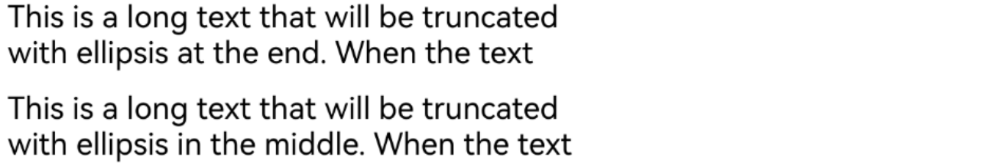 |
| Leading ellipsis enabled | 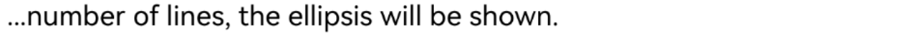 |
| Middle ellipsis enabled | 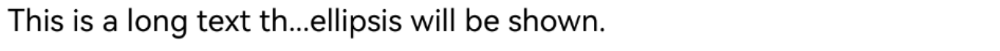 |
| Trailing ellipsis enabled | 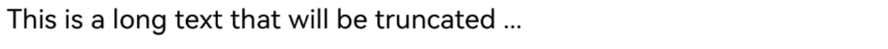 |
| Multi-line leading ellipsis enabled | 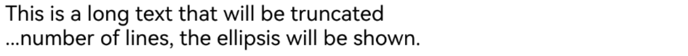 |
| Multi-line middle ellipsis enabled | 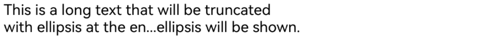 |

### Example 10 (Text Wrapping Mode)

The following example demonstrates the impact of the `BALANCED` break strategy on text layout.

<!-- @[arkts_break_strategy_example_text](https://gitcode.com/openharmony/applications_app_samples/blob/master/code/DocsSample/ArkGraphics2D/TextEngine/ComplexTextDrawing/entry/src/main/ets/pages/complexStyle/ComplexStyleExample10.ets) -->

``` TypeScript
// Set the line break strategy to BALANCED.
let myParagraphStyle: text.ParagraphStyle = {
  textStyle: myTextStyle,
  // Set the line break strategy to BALANCED, so that line widths are as balanced as possible.
  breakStrategy: text.BreakStrategy.BALANCED
};
```

The following shows the effect:

| Break Strategy | Effect |
| -------- | -------- |
| GREEDY | 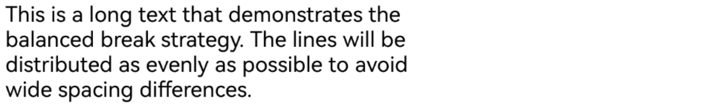 |
| BALANCED | 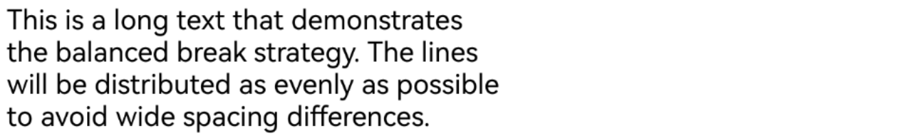 |
| HIGH_QUALITY | 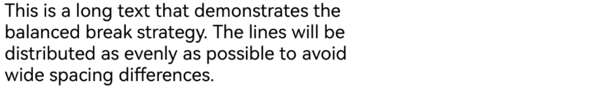 |

### Example 11 (Line-Start Punctuation Compression)

The following example demonstrates the typesetting comparison effect with line-start punctuation compression enabled.

<!-- @[arkts_punctuation_compress_example_text](https://gitcode.com/openharmony/applications_app_samples/blob/master/code/DocsSample/ArkGraphics2D/TextEngine/ComplexTextDrawing/entry/src/main/ets/pages/complexStyle/ComplexStyleExample11.ets) -->

``` TypeScript
// Enable line-start punctuation compression.
let myParagraphStyle: text.ParagraphStyle = {
  textStyle: myTextStyle,
  compressHeadPunctuation: true
};
```

The following shows the effect:

| Punctuation Compression Setting | Effect |
| -------- | -------- |
| Punctuation compression disabled | 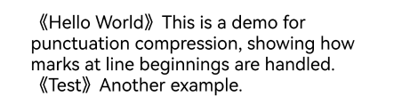 |
| Punctuation compression enabled | 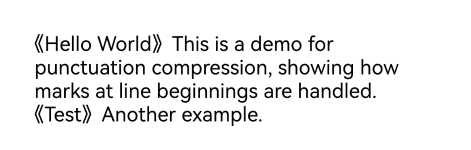 |

<!--no_check-->