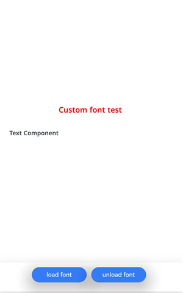
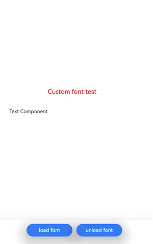

# Registering and Using Custom Fonts (ArkTS)

<!--Kit: ArkGraphics 2D-->
<!--Subsystem: Graphics-->
<!--Owner: @oh_wangxk; @gmiao522; @Lem0nC-->
<!--Designer: @liumingxiang-->
<!--Tester: @yhl0101-->
<!--Adviser: @ge-yafang-->
<!-- md-trans-meta sourceCommit=0e0cd691ac1d5f7a6d2136e199b2bf5082d665f6 translatedAt=2026-08-03T11:17:27.914Z pushedAt=2026-08-04T10:30:46.668Z -->

## When to Use

A custom font is a font that you create or select based on app requirements, typically used to achieve a specific text style or meet unique design requirements. When an app needs to use specific text styles and character sets, you can register and use a custom font for text rendering.

## Implementation Process

**Custom font registration** refers to the process of registering font files (such as .ttf and .otf files) from app resources with the system, so that the app can use these fonts for text rendering. During registration, the font files are registered with the system font library through font management APIs for subsequent use in the app.

**Custom font usage** refers to explicitly specifying a registered custom font for text rendering in the app. You can select a specific text style (such as regular, bold, or italic) as needed and apply it to UI elements, text controls, or other text display areas to meet design requirements and provide visual consistency.

## Available APIs

The following table lists the commonly used APIs for custom font registration and usage. For detailed API descriptions, see [@ohos.graphics.text (Text Module)](../reference/apis-arkgraphics2d/js-apis-graphics-text.md).

| Name | Description |
| -------- | -------- |
| loadFontSync(name: string, path: string \| Resource): void | Synchronous API. Registers a custom font by using the file corresponding to the path, with **name** as the alias for subsequent use.<br/>**Note:** Ensure that the custom font has been registered before it is used. In scenarios where strict performance is not required, using the synchronous API is recommended. |
| loadFont(name: string, path: string \| Resource): Promise&lt;void&gt; | Registers the corresponding font using the specified alias and file path. This API uses a promise to return the result. This API is supported since API version 14. |
| unloadFontSync(name: string): void | Synchronous API. Unregisters the font with the specified alias. This API is supported since API version 20. |
| unloadFont(name: string): Promise\<void\> | Unregisters the corresponding font using the specified alias. This API uses a promise to return the result. This API is supported since API version 20. |

## How to Develop

1. Import the dependent modules.

   <!-- @[arkts_custom_font_include](https://gitcode.com/openharmony/applications_app_samples/blob/master/code/DocsSample/ArkGraphics2D/TextEngine/CustomFont/entry/src/main/ets/pages/Index.ets) -->

   ``` TypeScript
   import { NodeController, FrameNode, RenderNode, DrawContext } from '@kit.ArkUI'
   import { UIContext } from '@kit.ArkUI'
   import { text } from '@kit.ArkGraphics2D'
   ```

2. Register the custom font. There are two methods:

   <!-- @[arkts_custom_font_step2](https://gitcode.com/openharmony/applications_app_samples/blob/master/code/DocsSample/ArkGraphics2D/TextEngine/CustomFont/entry/src/main/ets/pages/Index.ets) -->

   ``` TypeScript
   // Register the custom font.
   // Method 1: The /system/fonts/NotoSansMalayalamUI-SemiBold.ttf file is only an example path. Use the actual file path based on your application.
   fontCollection.loadFontSync(familyName, 'file:///system/fonts/NotoSansMalayalamUI-SemiBold.ttf')
   // Method 2: Ensure that the custom font file myFontFile.ttf has been placed in the entry/src/main/resources/rawfile directory of the application project.
   // fontCollection.loadFontSync(familyName, $rawfile('myFontFile.ttf'))
   ```

3. Use the custom font.

   <!-- @[arkts_custom_font_step3](https://gitcode.com/openharmony/applications_app_samples/blob/master/code/DocsSample/ArkGraphics2D/TextEngine/CustomFont/entry/src/main/ets/pages/Index.ets) -->

   ``` TypeScript
   // Use the custom font.
   let myFontFamily: Array<string> = [familyName] // If a custom font has been registered, enter the font family name of the custom font.
   // Set the text style.
   let myTextStyle: text.TextStyle = {
     color: {
       alpha: 255,
       red: 255,
       green: 0,
       blue: 0
     },
     fontSize: 30,
     // Add the available custom font to the text style.
     fontFamilies: myFontFamily
   };
   ```

4. Create a paragraph style, and use the font manager instance to construct a ParagraphBuilder instance.

   <!-- @[arkts_custom_font_step4](https://gitcode.com/openharmony/applications_app_samples/blob/master/code/DocsSample/ArkGraphics2D/TextEngine/CustomFont/entry/src/main/ets/pages/Index.ets) -->

   ``` TypeScript
   // Create a paragraph style object to set the typographic style.
   let myParagraphStyle: text.ParagraphStyle = {
     textStyle: myTextStyle,
     align: 3,
     wordBreak: text.WordBreak.NORMAL
   };
   // Create a paragraph builder.
   let paragraphBuilder = new text.ParagraphBuilder(myParagraphStyle, fontCollection)
   ```

5. Generate the paragraph.

   <!-- @[arkts_custom_font_step5](https://gitcode.com/openharmony/applications_app_samples/blob/master/code/DocsSample/ArkGraphics2D/TextEngine/CustomFont/entry/src/main/ets/pages/Index.ets) -->

   ``` TypeScript
   // Set the text style in the paragraph builder.
   paragraphBuilder.pushStyle(myTextStyle);
   // Set the text content in the paragraph builder.
   paragraphBuilder.addText("Custom font test");
   // Generate a paragraph using the paragraph builder.
   let paragraph = paragraphBuilder.build();
   ```

6. If you need to release a custom font, call the `unloadFontSync` API.

   <!-- @[arkts_custom_font_step6](https://gitcode.com/openharmony/applications_app_samples/blob/master/code/DocsSample/ArkGraphics2D/TextEngine/CustomFont/entry/src/main/ets/pages/Index.ets) -->

   ``` TypeScript
   // Unregister the custom font.
   fontCollection.unloadFontSync(familyName)
   // After unregistration, refresh the node that uses this fontCollection.
   newNode.invalidate()
   ```

## Effect Demonstration



