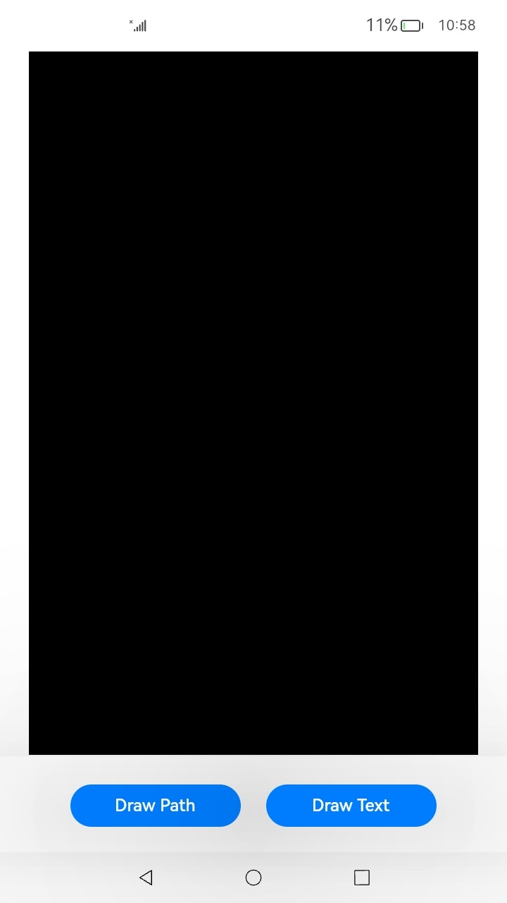
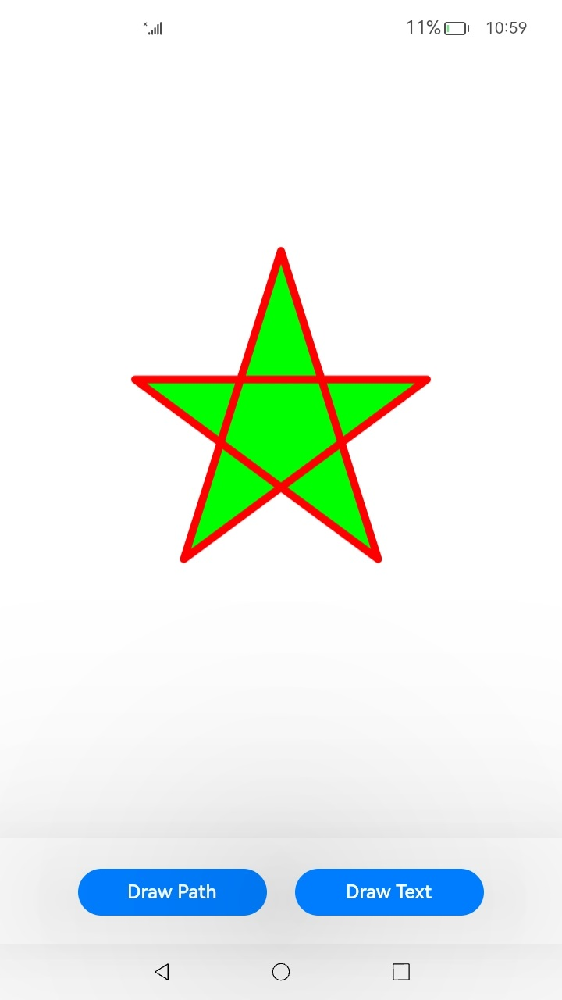
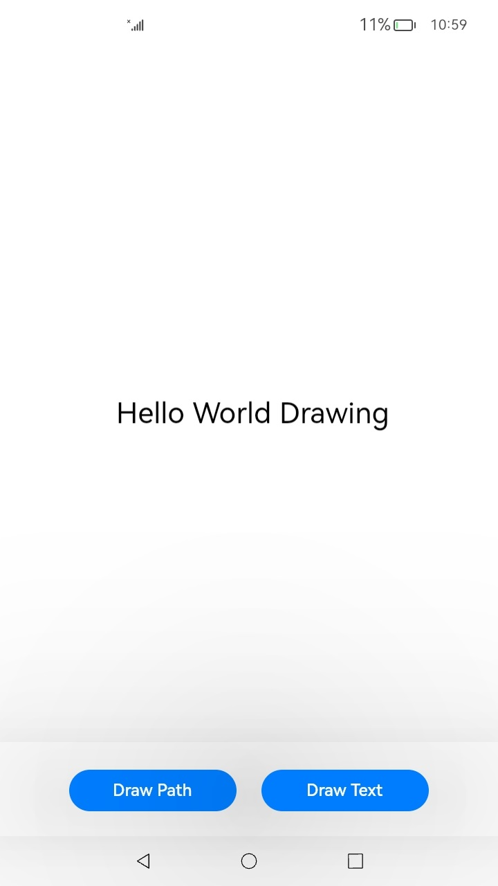

# Using Drawing to Draw and Display Graphics (C/C++)

## When to Use

The native drawing module provides APIs for drawing 2D graphics and text.

The graphics and text drawn by using the APIs cannot be directly displayed on the screen. To display the drawn graphics and text, you'll need the capabilities provided by the **XComponent** and native window module.

## Available APIs

The table below lists the common native drawing APIs. For details about all the APIs, see [Drawing](../reference/apis-arkgraphics2d/_drawing.md).

| API| Description|
| -------- | -------- |
| OH_Drawing_BitmapCreate (void) | Creates a bitmap object.|
| OH_Drawing_BitmapBuild (OH_Drawing_Bitmap *, const uint32_t width, const uint32_t height, const OH_Drawing_BitmapFormat *) | Initializes the width and height of a bitmap and sets the pixel format for the bitmap.|
| OH_Drawing_CanvasCreate (void) | Creates a canvas object.|
| OH_Drawing_CanvasBind (OH_Drawing_Canvas *, OH_Drawing_Bitmap *) | Binds a bitmap to a canvas so that the content drawn on the canvas is output to the bitmap. (This process is called CPU rendering.)|
| OH_Drawing_CanvasAttachBrush (OH_Drawing_Canvas *, const OH_Drawing_Brush *) | Attaches a brush to a canvas so that the canvas can use the style and color of the brush to fill in a shape.|
| OH_Drawing_CanvasAttachPen (OH_Drawing_Canvas *, const OH_Drawing_Pen *) | Attaches a pen to a canvas so that the canvas can use the style and color of the pen to outline a shape.|
| OH_Drawing_CanvasDrawPath (OH_Drawing_Canvas *, const OH_Drawing_Path *) | Draws a path.|
| OH_Drawing_PathCreate (void) | Creates a path object.|
| OH_Drawing_PathMoveTo (OH_Drawing_Path *, float x, float y) | Sets the start point of a path.|
| OH_Drawing_PathLineTo (OH_Drawing_Path *, float x, float y) | Draws a line segment from the last point of a path to the target point.|
| OH_Drawing_PathClose (OH_Drawing_Path *) | Draws a line segment from the current point to the start point of a path.|
| OH_Drawing_PenCreate (void) | Creates a pen object.|
| OH_Drawing_PenSetAntiAlias (OH_Drawing_Pen *, bool) | Checks whether anti-aliasing is enabled for a pen. If anti-aliasing is enabled, edges will be drawn with partial transparency.|
| OH_Drawing_PenSetWidth (OH_Drawing_Pen *, float width) | Sets the thickness for a pen. This thickness determines the width of the outline of a shape.|
| OH_Drawing_BrushCreate (void) | Creates a brush object.|
| OH_Drawing_BrushSetColor (OH_Drawing_Brush *, uint32_t color) | Sets the color for a brush. The color will be used by the brush to fill in a shape.|
| OH_Drawing_CreateTypographyStyle (void) | Creates a **TypographyStyle** object.|
| OH_Drawing_CreateTextStyle (void) | Creates a **TextStyle** object.|
| OH_Drawing_TypographyHandlerAddText (OH_Drawing_TypographyCreate *, const char *) | Adds text to the canvas.|
| OH_Drawing_TypographyPaint (OH_Drawing_Typography *, OH_Drawing_Canvas *, double, double) | Paints text on the canvas.|

## How to Develop

### Development Process

First, use the canvas and pen of the native drawing module to draw a basic 2D graphic, write the graphics content to the buffer provided by the native window module, and flush the buffer to the graphics queue. Then use the **XComponent** to connect the C++ code layer to the ArkTS layer. In this way, the drawing and display logic of the C++ code is called at the ArkTS layer, and the graphic is displayed on the screen.

The following walks you through on how to draw and display 2D graphics and text.
### Adding Dependencies

**Adding Dynamic Link Libraries**

Add the following libraries to **CMakeLists.txt**.

```txt
libace_napi.z.so
libace_ndk.z.so
libnative_window.so
libnative_drawing.so
```

**Including Header Files**
```c++
#include <ace/xcomponent/native_interface_xcomponent.h>
#include "napi/native_api.h"
#include <native_window/external_window.h>
#include <native_drawing/drawing_bitmap.h>
#include <native_drawing/drawing_color.h>
#include <native_drawing/drawing_canvas.h>
#include <native_drawing/drawing_pen.h>
#include <native_drawing/drawing_brush.h>
#include <native_drawing/drawing_path.h>
#include <cmath>
#include <algorithm>
#include <stdint.h>
#include <sys/mman.h>
```

### Building a Drawing Environment Using XComponent

1. Add the **XComponent** to the **Index.ets** file.
    ```ts
    import XComponentContext from "../interface/XComponentContext";

    const TAG = '[Sample_DrawingAPI]';

    @Entry
    @Component
    struct Index {
      private xComponentContext: XComponentContext | undefined = undefined;

      build() {
          Column() {
          Row() {
              XComponent({ id: 'xcomponentId', type: 'surface', libraryname: 'entry' })
              .onLoad((xComponentContext) => {
                  this.xComponentContext = xComponentContext as XComponentContext;
              }).width('640px') // Multiple of 64
          }.height('88%')
        }
      }
    }
    ```
    The width of the **XComponent** must be a multiple of 64, for example, 640 px.
2. Obtain the native **XComponent** at the C++ layer. You are advised to save the **XComponent** in a singleton. This step must be performed during napi_init.

    Create a **PluginManger** singleton to manage the native **XComponent**.
    ```c++
    class PluginManager {
    public:
        ~PluginManager();

        static PluginManager *GetInstance();

        void SetNativeXComponent(std::string &id, OH_NativeXComponent *nativeXComponent);
        SampleBitMap *GetRender(std::string &id);
        void Export(napi_env env, napi_value exports);
    private:

        std::unordered_map<std::string, OH_NativeXComponent *> nativeXComponentMap_;
        std::unordered_map<std::string, SampleBitMap *> pluginRenderMap_;
    };
    ```
    The **SampleBitMap** class will be created in the step of drawing a 2D graphic.
    ```c++
    void PluginManager::Export(napi_env env, napi_value exports) {
        if ((env == nullptr) || (exports == nullptr)) {
            DRAWING_LOGE("Export: env or exports is null");
            return;
        }

        napi_value exportInstance = nullptr;
        if (napi_get_named_property(env, exports, OH_NATIVE_XCOMPONENT_OBJ, &exportInstance) != napi_ok) {
            DRAWING_LOGE("Export: napi_get_named_property fail");
            return;
        }

        OH_NativeXComponent *nativeXComponent = nullptr;
        if (napi_unwrap(env, exportInstance, reinterpret_cast<void **>(&nativeXComponent)) != napi_ok) {
            DRAWING_LOGE("Export: napi_unwrap fail");
            return;
        }

        char idStr[OH_XCOMPONENT_ID_LEN_MAX + 1] = {'\0'};
        uint64_t idSize = OH_XCOMPONENT_ID_LEN_MAX + 1;
        if (OH_NativeXComponent_GetXComponentId(nativeXComponent, idStr, &idSize) != OH_NATIVEXCOMPONENT_RESULT_SUCCESS) {
            DRAWING_LOGE("Export: OH_NativeXComponent_GetXComponentId fail");
            return;
        }

        std::string id(idStr);
        auto context = PluginManager::GetInstance();
        if ((context != nullptr) && (nativeXComponent != nullptr)) {
            context->SetNativeXComponent(id, nativeXComponent);
            auto render = context->GetRender(id);
            if (render != nullptr) {
                render->RegisterCallback(nativeXComponent);
                render->Export(env, exports);
            } else {
                DRAWING_LOGE("render is nullptr");
            }
        }
    }
    ```
3. Register a callback, named **OnSurfaceCreated**, and obtain an **OHNativeWindow** instance through the callback. You are advised to save the **OHNativeWindow** instance in a singleton.
    ```c++
    // Define a callback.
    void OnSurfaceCreatedCB(OH_NativeXComponent* component, void* window)
    {
        // Obtain an OHNativeWindow instance.
        OHNativeWindow* nativeWindow = static_cast<OHNativeWindow*>(window);
        char idStr[OH_XCOMPONENT_ID_LEN_MAX + 1] = {'\0'};
        uint64_t idSize = OH_XCOMPONENT_ID_LEN_MAX + 1;
        if (OH_NativeXComponent_GetXComponentId(component, idStr, &idSize) != OH_NATIVEXCOMPONENT_RESULT_SUCCESS) {
            DRAWING_LOGE("OnSurfaceCreatedCB: Unable to get XComponent id");
            return;
        }
        std::string id(idStr);
        auto render = SampleBitMap::GetInstance(id);
        render->SetNativeWindow(nativeWindow);

        uint64_t width;
        uint64_t height;
        int32_t xSize = OH_NativeXComponent_GetXComponentSize(component, window, &width, &height);
        if ((xSize == OH_NATIVEXCOMPONENT_RESULT_SUCCESS) && (render != nullptr)) {
            render->SetHeight(height);
            render->SetWidth(width);
            DRAWING_LOGI("xComponent width = %{public}llu, height = %{public}llu", width, height);
        }
    }
    void OnSurfaceChangedCB(OH_NativeXComponent* component, void* window)
    {
        // Obtain an OHNativeWindow instance.
        OHNativeWindow* nativeWindow = static_cast<OHNativeWindow*>(window);
        char idStr[OH_XCOMPONENT_ID_LEN_MAX + 1] = {'\0'};
        uint64_t idSize = OH_XCOMPONENT_ID_LEN_MAX + 1;
        if (OH_NativeXComponent_GetXComponentId(component, idStr, &idSize) != OH_NATIVEXCOMPONENT_RESULT_SUCCESS) {
            DRAWING_LOGE("OnSurfaceChangedCB: Unable to get XComponent id");
            return;
        }
        std::string id(idStr);
        auto render = SampleBitMap::GetInstance(id);

        uint64_t width;
        uint64_t height;
        int32_t xSize = OH_NativeXComponent_GetXComponentSize(component, window, &width, &height);
        if ((xSize == OH_NATIVEXCOMPONENT_RESULT_SUCCESS) && (render != nullptr)) {
            render->SetHeight(height);
            render->SetWidth(width);
            DRAWING_LOGI("Surface Changed : xComponent width = %{public}llu, height = %{public}llu", width, height);
        }
    }
    void OnSurfaceDestroyedCB(OH_NativeXComponent* component, void* window)
    {
        // Obtain an OHNativeWindow instance.
        OHNativeWindow* nativeWindow = static_cast<OHNativeWindow*>(window);
        // ...
    }
    void DispatchTouchEventCB(OH_NativeXComponent* component, void* window)
    {
        // Obtain an OHNativeWindow instance.
        OHNativeWindow* nativeWindow = static_cast<OHNativeWindow*>(window);
        // ...
    }
    ```
    All callbacks of the **XComponent** must be initialized. You can define unnecessary callbacks as null pointers.
    ```c++
    // OH_NativeXComponent_Callback is a struct.
    OH_NativeXComponent_Callback callback;
    callback.OnSurfaceCreated = OnSurfaceCreatedCB;
    callback.OnSurfaceChanged = OnSurfaceChangedCB;
    callback.OnSurfaceDestroyed = OnSurfaceDestroyedCB;
    callback.DispatchTouchEvent = DispatchTouchEventCB;
    ```
4. Register **OH_NativeXComponent_Callback** with a **NativeXComponent** instance.
    ```c++
    // Register the callback.
    OH_NativeXComponent_RegisterCallback(nativeXComponent, &callback);
    ```

Now, the drawing environment is set up. You can use the native drawing APIs to draw graphics.

### Drawing a 2D Graphic

Follow the steps below to draw a 2D graphic by using the canvas and pen of the native drawing module.

1. **Create a bitmap object.**

    Use **OH_Drawing_BitmapCreate** in **drawing_bitmap.h** to create a bitmap object (named **cBitmap** in this example), and use **OH_Drawing_BitmapBuild** to specify its length, width, and pixel format.

    Create a **SampleBitMap** class and declare the required private member variables.
    ```c++
    class SampleBitMap {
    public:
        // member functions
    private:
        OH_NativeXComponent_Callback renderCallback_;

        uint64_t width_ = 0;
        uint64_t height_ = 0;
        OH_Drawing_Bitmap *cBitmap_ = nullptr;
        OH_Drawing_Canvas *cCanvas_ = nullptr;
        OH_Drawing_Path *cPath_ = nullptr;
        OH_Drawing_Brush *cBrush_ = nullptr;
        OH_Drawing_Pen *cPen_ = nullptr;
        OHNativeWindow *nativeWindow_ = nullptr;
        uint32_t *mappedAddr_ = nullptr;
        BufferHandle *bufferHandle_ = nullptr;
        struct NativeWindowBuffer *buffer_ = nullptr;
        int fenceFd_ = 0;
    };
    ```

    ```c++
    // Create a bitmap object.
    cBitmap_ = OH_Drawing_BitmapCreate();
    // Define the pixel format of the bitmap.
    OH_Drawing_BitmapFormat cFormat {COLOR_FORMAT_RGBA_8888, ALPHA_FORMAT_OPAQUE};
    // Build a bitmap in the corresponding format. The width must be bufferHandle->stride / 4.
    OH_Drawing_BitmapBuild(cBitmap_, width_, height_, &cFormat);
    ```

2. **Create a canvas object.**

    Use **OH_Drawing_CanvasCreate** in **drawing_canvas.h** to create a canvas object (named **cCanvas** in this example), and use **OH_Drawing_CanvasBind** to bind **cBitmap** to this canvas. The content drawn on the canvas will be output to the bound **cBitmap** object.

    ```c++
    // Create a canvas object.
    cCanvas_ = OH_Drawing_CanvasCreate();
    // Bind the bitmap to the canvas. The content drawn on the canvas will be output to the bound bitmap memory.
    OH_Drawing_CanvasBind(cCanvas_, cBitmap_);
    // Use white to clear the canvas.
    OH_Drawing_CanvasClear(cCanvas_, OH_Drawing_ColorSetArgb(0xFF, 0xFF, 0xFF, 0xFF));
    ```

3. **Construct a shape.**

    Use the APIs provided in **drawing_path.h** to construct a pentagram, named **cPath**.

    ```c++
    int len = height_ / 4;
    float aX = width_ / 2;
    float aY = height_ / 4;
    float dX = aX - len * std::sin(18.0f);
    float dY = aY + len * std::cos(18.0f);
    float cX = aX + len * std::sin(18.0f);
    float cY = dY;
    float bX = aX + (len / 2.0);
    float bY = aY + std::sqrt((cX - dX) * (cX - dX) + (len / 2.0) * (len / 2.0));
    float eX = aX - (len / 2.0);
    float eY = bY;

    // Create a path object and use the APIs to construct a pentagram.
    cPath_ = OH_Drawing_PathCreate();
    // Specify the start point of the path.
    OH_Drawing_PathMoveTo(cPath_, aX, aY);
    // Draw a line segment from the last point of a path to the target point.
    OH_Drawing_PathLineTo(cPath_, bX, bY);
    OH_Drawing_PathLineTo(cPath_, cX, cY);
    OH_Drawing_PathLineTo(cPath_, dX, dY);
    OH_Drawing_PathLineTo(cPath_, eX, eY);
    // Close the path. Now the path is drawn.
    OH_Drawing_PathClose(cPath_);
    ```

4. **Set the pen and brush styles.**

    Use **OH_Drawing_PenCreate** in **drawing_pen.h** to create a pen object (named **cPen** in this example), and set the attributes such as anti-aliasing, color, and thickness. The pen is used to outline a shape.

    Use **OH_Drawing_BrushCreate** in **drawing_brush.h** to create a brush object (named **cBrush** in this example), and set the brush color. The brush is used to fill in a shape.

    Use **OH_Drawing_CanvasAttachPen** and **OH_Drawing_CanvasAttachBrush** in **drawing_canvas.h** to attach the pen and brush to the canvas.

    ```c++
    // Create a pen object and set the anti-aliasing, color, and thickness attributes.
    cPen_ = OH_Drawing_PenCreate();
    OH_Drawing_PenSetAntiAlias(cPen_, true);
    OH_Drawing_PenSetColor(cPen_, OH_Drawing_ColorSetArgb(0xFF, 0xFF, 0x00, 0x00));
    OH_Drawing_PenSetWidth(cPen_, 10.0);
    OH_Drawing_PenSetJoin(cPen_, LINE_ROUND_JOIN);
    // Attach the pen to the canvas.
    OH_Drawing_CanvasAttachPen(cCanvas_, cPen_);

    // Create a brush object and set the color.
    cBrush_ = OH_Drawing_BrushCreate();
    OH_Drawing_BrushSetColor(cBrush_, OH_Drawing_ColorSetArgb(0xFF, 0x00, 0xFF, 0x00));

    // Attach the brush to the canvas.
    OH_Drawing_CanvasAttachBrush(cCanvas_, cBrush_);
    ```

5. **Draw the pentagram.**

    Use **OH_Drawing_CanvasDrawPath** in **drawing_canvas.h** to draw the pentagram on the canvas.

    ```c++
    // Draw a pentagram on the canvas. The outline of the pentagram is drawn by the pen, and the color is filled in by the brush.
    OH_Drawing_CanvasDrawPath(cCanvas_, cPath_);
    ```

### Drawing Text

The native drawing module provides two types of APIs for text drawing:

- APIs with the typography customization capability. Example APIs are **OH_Drawing_Typography**, **OH_Drawing_TypographyStyle**, and **OH_Drawing_TextStyle**. This type of API allows you to set the typography style and text style. You can call **OH_Drawing_TypographyHandlerAddText** to add text, and call **OH_Drawing_TypographyLayout** and **OH_Drawing_TypographyPaint** to typeset and draw the text.
- APIs that do not support typography customization. Example APIs are **OH_Drawing_Font**, **OH_Drawing_TextBlob**, and **OH_Drawing_RunBuffer**. If an application has its own typography capability, it can construct the typography result as an **OH_Drawing_TextBlob**. If an application uses the default typography capability, it can directly call **OH_Drawing_TextBlobCreateFromText** to construct an **OH_Drawing_TextBlob**. Finally, the application calls **OH_Drawing_CanvasDrawTextBlob** to draw the text block described in the **OH_Drawing_TextBlob**.

The following describes how to use the two types of APIs to implement text drawing.

#### Using APIs with Typography Customization to Draw Text

1. **Create a bitmap and a canvas.**

    ```c++
    // Create a bitmap.
    cBitmap_ = OH_Drawing_BitmapCreate();
    OH_Drawing_BitmapFormat cFormat {COLOR_FORMAT_RGBA_8888, ALPHA_FORMAT_OPAQUE};
    // The width must be bufferHandle->stride / 4.
    OH_Drawing_BitmapBuild(cBitmap_, width_, height_, &cFormat);
    // Create a canvas.
    cCanvas_ = OH_Drawing_CanvasCreate();
    OH_Drawing_CanvasBind(cCanvas_, cBitmap_);
    OH_Drawing_CanvasClear(cCanvas_, OH_Drawing_ColorSetArgb(0xFF, 0xFF, 0xFF, 0xFF));
    ```
  
2. **Set the typography style.**

    ```c++
    // Set the typography attributes such as left to right (LTR) for the text direction and left-aligned for the text alignment mode.
    OH_Drawing_TypographyStyle* typoStyle = OH_Drawing_CreateTypographyStyle();
    OH_Drawing_SetTypographyTextDirection(typoStyle, TEXT_DIRECTION_LTR);
    OH_Drawing_SetTypographyTextAlign(typoStyle, TEXT_ALIGN_LEFT);
    ```

3. **Set the text style.**

    ```c++
    // Set the text color, for example, black.
    OH_Drawing_TextStyle* txtStyle = OH_Drawing_CreateTextStyle();
    OH_Drawing_SetTextStyleColor(txtStyle, OH_Drawing_ColorSetArgb(0xFF, 0x00, 0x00, 0x00));
    // Set other text attributes such as the font size and weight.
    double fontSize = width_ / 15;
    OH_Drawing_SetTextStyleFontSize(txtStyle, fontSize);
    OH_Drawing_SetTextStyleFontWeight(txtStyle, FONT_WEIGHT_400);
    OH_Drawing_SetTextStyleBaseLine(txtStyle, TEXT_BASELINE_ALPHABETIC);
    OH_Drawing_SetTextStyleFontHeight(txtStyle, 1);
    // If multiple measurements are required, it is recommended that fontCollection be used as a global variable to significantly reduce memory usage.
    OH_Drawing_FontCollection* fontCollection = OH_Drawing_CreateSharedFontCollection();
    // Register the customized font.
    const char* fontFamily = "myFamilyName"; // myFamilyName is the family name of the customized font.
    const char* fontPath = "/data/storage/el2/base/haps/entry/files/myFontFile.ttf"; // Set the sandbox path where the customized font is located.
    OH_Drawing_RegisterFont(fontCollection, fontFamily, fontPath);
    // Set the system font type.
    const char* systemFontFamilies[] = {"Roboto"};
    OH_Drawing_SetTextStyleFontFamilies(txtStyle, 1, systemFontFamilies);
    OH_Drawing_SetTextStyleFontStyle(txtStyle, FONT_STYLE_NORMAL);
    OH_Drawing_SetTextStyleLocale(txtStyle, "en");
    // Set the customized font type.
    auto txtStyle2 = OH_Drawing_CreateTextStyle();
    OH_Drawing_SetTextStyleFontSize(txtStyle2, fontSize);
    const char* myFontFamilies[] = {"myFamilyName"}; // If a customized font has been registered, enter the family name of the customized font to use the customized font.
    OH_Drawing_SetTextStyleFontFamilies(txtStyle2, 1, myFontFamilies);
    ```

4. **Generate the final text display effect.**

    ```c++
    OH_Drawing_TypographyCreate* handler = OH_Drawing_CreateTypographyHandler(typoStyle,
        fontCollection);
    OH_Drawing_TypographyHandlerPushTextStyle(handler, txtStyle);
    OH_Drawing_TypographyHandlerPushTextStyle(handler, txtStyle2);
    // Set the text content.
    const char* text = "Hello World Drawing\n";
    OH_Drawing_TypographyHandlerAddText(handler, text);
    OH_Drawing_TypographyHandlerPopTextStyle(handler);
    OH_Drawing_Typography* typography = OH_Drawing_CreateTypography(handler);
    // Set the maximum width.
    double maxWidth = width_;
    OH_Drawing_TypographyLayout(typography, maxWidth);
    // Set the start position for drawing the text on the canvas.
    double position[2] = {width_ / 5.0, height_ / 2.0};
    // Draw the text on the canvas.
    OH_Drawing_TypographyPaint(typography, cCanvas_, position[0], position[1]);
    ```
5. **Release the variables.**

    ```c++
    // Destroy the typography when it is no longer needed.
    OH_Drawing_DestroyTypography(typography);
    // Destroy the layout when it is no longer needed.
    OH_Drawing_DestroyTypographyHandler(handler);
    // Destroy the font collection when it is no longer needed.
    OH_Drawing_DestroyFontCollection(fontCollection);
    // Destroy the layout when it is no longer needed.
    OH_Drawing_DestroyTextStyle(txtStyle);
    OH_Drawing_DestroyTextStyle(txtStyle2);
    // Destroy the layout when it is no longer needed.
    OH_Drawing_DestroyTypographyStyle(typoStyle);
    ```

#### Using APIs Without Typography Customization to Draw Text

1. **Create a bitmap and a canvas.**

    ```c++
    // Create a bitmap.
    cBitmap_ = OH_Drawing_BitmapCreate();
    OH_Drawing_BitmapFormat cFormat {COLOR_FORMAT_RGBA_8888, ALPHA_FORMAT_OPAQUE};
    // The width must be bufferHandle->stride / 4.
    OH_Drawing_BitmapBuild(cBitmap_, width_, height_, &cFormat);
    // Create a canvas.
    cCanvas_ = OH_Drawing_CanvasCreate();
    OH_Drawing_CanvasBind(cCanvas_, cBitmap_);
    OH_Drawing_CanvasClear(cCanvas_, OH_Drawing_ColorSetArgb(0xFF, 0xFF, 0xFF, 0xFF));
    ```

2. **Refer to the code snippet below for the application that has its own typography capability.**

    ```c++
    // Create a font and set the font size.
    OH_Drawing_Font* font = OH_Drawing_FontCreate();
    OH_Drawing_FontSetTextSize(font, 40);
    // Create a text blob builder.
    OH_Drawing_TextBlobBuilder* builder = OH_Drawing_TextBlobBuilderCreate();
    // Apply for a memory block.
    const OH_Drawing_RunBuffer* runBuffer = OH_Drawing_TextBlobBuilderAllocRunPos(builder, font, count, nullptr);
    // glyphs, posX, and posY are data generated during typography. The data is used to fill in the memory.
    for (int idx = 0; idx < count; idx++) {
        runBuffer->glyphs[idx] = glyphs[idx];
        runBuffer->pos[idx * 2] = posX[idx];
        runBuffer->pos[idx * 2 + 1] = posY[idx];
    }
    // Create the text blob using the text blob builder.
    OH_Drawing_TextBlob* textBlob = OH_Drawing_TextBlobBuilderMake(builder);
    // Release the memory.
    OH_Drawing_TextBlobBuilderDestroy(builder);
    ```

3. **Refer to the code snippet below for the application that uses the default typography capability.**

    ```c++
    // Create a font and set the font size.
    OH_Drawing_Font* font = OH_Drawing_FontCreate();
    OH_Drawing_FontSetTextSize(font, 40);
    // Create the characters to be displayed.
    size_t size = 19;
    const char16_t* buffer = u"Hello World Drawing";
    // Create the text blob based on the characters and corresponding encoding format.
    OH_Drawing_TextBlob* textBlob = OH_Drawing_TextBlobCreateFromText(buffer, size * sizeof(char16_t), font, OH_Drawing_TextEncoding::TEXT_ENCODING_UTF16);
    ```

4. **Set the pen and brush styles.**

    ```c++
    // Create a brush object and set the color.
    cBrush_ = OH_Drawing_BrushCreate();
    OH_Drawing_BrushSetColor(cBrush_, OH_Drawing_ColorSetArgb(0xFF, 0x00, 0x00, 0x00));

    // Attach the brush to the canvas.
    OH_Drawing_CanvasAttachBrush(cCanvas_, cBrush_);
    ```

5. **Generate the final text display effect.**

    ```c++
    // Set the start position for drawing the text on the canvas.
    double position[2] = {width_ / 5.0, height_ / 2.0};
    // Draw the text on the canvas.
    OH_Drawing_CanvasDrawTextBlob(canvas_, textBlob, position[0], position[1]);
    // Release the memory.
    OH_Drawing_TextBlobDestroy(textBlob);
    OH_Drawing_FontDestroy(font);
    ```

### Displaying the Graphics and Text Drawn

You have drawn a pentagon and text by using the native drawing APIs. Now you need to display them on the screen by using the native Window APIs.

1. Request a native window buffer by using the native window pointer saved in the **OnSurfaceCreatedCB** callback.
    ```c++
    // Obtain an OHNativeWindowBuffer instance by calling OH_NativeWindow_NativeWindowRequestBuffer.
    int32_t ret = OH_NativeWindow_NativeWindowRequestBuffer(nativeWindow_, &buffer_, &fenceFd_);
    ```
2. Call **OH_NativeWindow_GetBufferHandleFromNative** to obtain the buffer handle.
    ```c++
    bufferHandle_ = OH_NativeWindow_GetBufferHandleFromNative(buffer_);
    ```
3. Call **mmap()** to obtain the memory virtual address of the buffer handle.
    ```c++
    mappedAddr_ = static_cast<uint32_t *>(
        // Use mmap() to map the shared memory corresponding to the buffer handle to the user space. Image data can be written to the buffer handle by using the obtained virtual address.
        // bufferHandle->virAddr indicates the start address of the buffer handle in the shared memory, and bufferHandle->size indicates the memory usage of the buffer handle in the shared memory.
        mmap(bufferHandle_->virAddr, bufferHandle_->size, PROT_READ | PROT_WRITE, MAP_SHARED, bufferHandle_->fd, 0));
    if (mappedAddr_ == MAP_FAILED) {
        DRAWING_LOGE("mmap failed");
    }
    ```
4. Use **OH_Drawing_BitmapGetPixels** in **drawing_bitmap.h** to obtain the pixel address of the bitmap bound to the canvas. The memory to which the address points contains the pixel data of the drawing on the canvas. Fill the drawn content to the native window buffer.
    ```c++
    // Obtain the pixel address after drawing. The memory to which the address points contains the pixel data of the drawing on the canvas.
    void *bitmapAddr = OH_Drawing_BitmapGetPixels(cBitmap_);
    uint32_t *value = static_cast<uint32_t *>(bitmapAddr);

    // Use the address obtained by mmap() to access the memory.
    uint32_t *pixel = static_cast<uint32_t *>(mappedAddr_); 
    for (uint32_t x = 0; x < width_; x++) {
        for (uint32_t y = 0; y < height_; y++) {
            *pixel++ = *value++;
        }
    }
    ```
5. Set the refresh region and display the content on the screen.
    ```c++
    // If Rect in Region is a null pointer or rectNumber is 0, all contents in the OHNativeWindowBuffer are changed.
    Region region {nullptr, 0};
    // Flush the buffer to the consumer through OH_NativeWindow_NativeWindowFlushBuffer, for example, by displaying it on the screen.
    OH_NativeWindow_NativeWindowFlushBuffer(nativeWindow_, buffer_, fenceFd_, region);
    ```
6. Release the memory.

    Release the memory used by the native drawing module.

    ```c++
    // Unmap the memory.
    int result = munmap(mappedAddr_, bufferHandle_->size);
    if (result == -1) {
        DRAWING_LOGE("munmap failed!");
    }
    // Destroy the created objects when they are no longer needed.
    OH_Drawing_BrushDestroy(cBrush_);
    cBrush_ = nullptr;
    OH_Drawing_PenDestroy(cPen_);
    cPen_ = nullptr;
    OH_Drawing_PathDestroy(cPath_);
    cPath_ = nullptr;
    OH_Drawing_CanvasDestroy(cCanvas_);
    cCanvas_ = nullptr;
    OH_Drawing_BitmapDestroy(cBitmap_);
    cBitmap_ = nullptr;
    ```
    Release the surface memory.

    ```c++
    void OnSurfaceDestroyedCB(OH_NativeXComponent *component, void *window) {
        DRAWING_LOGI("OnSurfaceDestroyedCB");
        if ((component == nullptr) || (window == nullptr)) {
            DRAWING_LOGE("OnSurfaceDestroyedCB: component or window is null");
            return;
        }
        char idStr[OH_XCOMPONENT_ID_LEN_MAX + 1] = {'\0'};
        uint64_t idSize = OH_XCOMPONENT_ID_LEN_MAX + 1;
        if (OH_NativeXComponent_GetXComponentId(component, idStr, &idSize) != OH_NATIVEXCOMPONENT_RESULT_SUCCESS) {
            DRAWING_LOGE("OnSurfaceDestroyedCB: Unable to get XComponent id");
            return;
        }
        std::string id(idStr);
        SampleBitMap::Release(id);
    }
    ```
### Calling Code

The preceding code is the C++ code at the native layer. To call the code, use the ArkTS layer code for interconnection.
1. Define an ArkTS API file and name it **XComponentContext.ts**, which is used to connect to the C++ code.
    ```ts
    export default interface XComponentContext {
      drawPattern(): void;
      drawText(): void;
    };
    ```
    Add the initialization function and code to the **SampleBitMap** class.
    ```c++
    void SampleBitMap::Export(napi_env env, napi_value exports) {
        if ((env == nullptr) || (exports == nullptr)) {
            DRAWING_LOGE("Export: env or exports is null");
            return;
        }
        napi_property_descriptor desc[] = {
            {"drawPattern", nullptr, SampleBitMap::NapiDrawPattern, nullptr, nullptr, nullptr, napi_default, nullptr},
            {"drawText", nullptr, SampleBitMap::NapiDrawText, nullptr, nullptr, nullptr, napi_default, nullptr}};
        napi_define_properties(env, exports, sizeof(desc) / sizeof(desc[0]), desc);
        if (napi_define_properties(env, exports, sizeof(desc) / sizeof(desc[0]), desc) != napi_ok) {
            DRAWING_LOGE("Export: napi_define_properties failed");
        }
    }
    ```
2. Add buttons for users to click and call the defined APIs.
    ```ts
    build() {
      Column() {
        Row() {
          XComponent({ id: 'xcomponentId', type: 'surface', libraryname: 'entry' })
            .onLoad((xComponentContext) => {
              this.xComponentContext = xComponentContext as XComponentContext;
            }).width('640px') // Multiples of 64
          }.height('88%')
          Row() {
            Button('Draw Path')
              .fontSize('16fp')
              .fontWeight(500)
              .margin({ bottom: 24, right: 12 })
              .onClick(() => {
                console.log(TAG, "Draw Path click");
                if (this.xComponentContext) {
                  console.log(TAG, "Draw Path");
                  this.xComponentContext.drawPattern();
                  }
              })
              .width('33.6%')
              .height(40)
              .shadow(ShadowStyle.OUTER_DEFAULT_LG)
            Button('Draw Text')
              .fontSize('16fp')
              .fontWeight(500)
              .margin({ bottom: 24, left: 12 })
              .onClick(() => {
                  console.log(TAG, "draw text click");
                  if (this.xComponentContext) {
                    console.log(TAG, "draw text");
                    this.xComponentContext.drawText();
                  }
              })
              .width('33.6%')
              .height(40)
              .shadow(ShadowStyle.OUTER_DEFAULT_LG)
          }
          .width('100%')
          .justifyContent(FlexAlign.Center)
          .shadow(ShadowStyle.OUTER_DEFAULT_SM)
          .alignItems(VerticalAlign.Bottom)
          .layoutWeight(1)
        }
    }
    ```
    The following figure shows the drawing and display effect.

    | Home page                                | Pentagon drawn                                        | Text drawn                                           |
    | ------------------------------------ |-----------------------------------------------| --------------------------------------------------- |
    |  |  |  |

