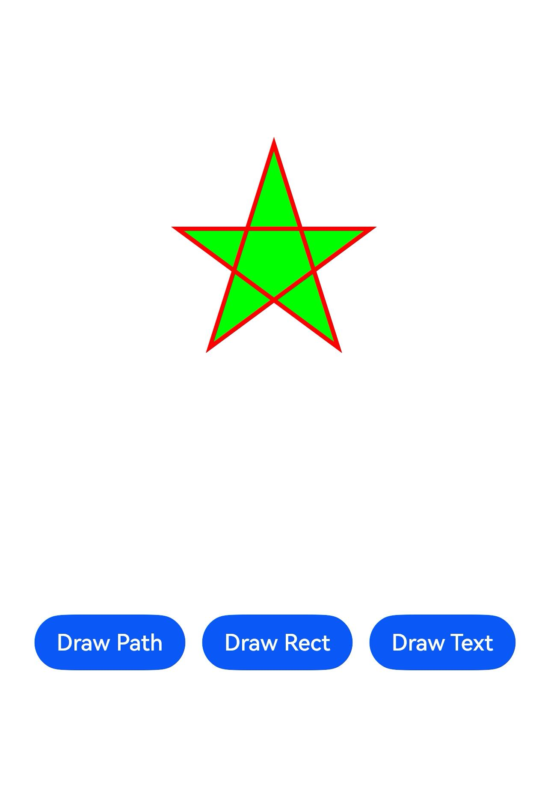
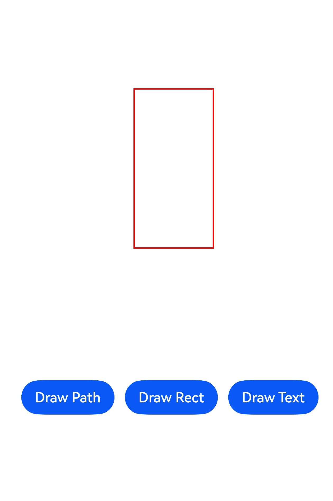

# Using Drawing to Draw and Display Graphics

## When to Use

The @ohos.graphics.drawing module provides basic drawing capabilities, such as drawing rectangles, circles, points, line segments, custom paths, and fonts.

## Available APIs

The table below lists the common APIs provided by the @ohos.graphics.drawing module. For details about all the APIs, see [@ohos.graphics.drawing](../reference/apis-arkgraphics2d/js-apis-graphics-drawing.md).

| API| Description| 
| -------- | -------- |
| drawPath(path: Path) : void | Draws a custom path.|
| drawRect(rect: common2D.Rect): void | Draws a rectangle. By default, black is used for filling.|
| drawTextBlob(blob: TextBlob, x: number, y: number): void | Draws a text blob.|
| moveTo(x: number, y: number) : void | Sets the start point of a path.|
| lineTo(x: number, y: number) : void | Draws a line segment from the last point of a path to the target point.|
| close(): void | Draws a line segment from the current point to the start point of a path.|
| setAntiAlias(aa: boolean) : void | Enables anti-aliasing for this pen or brush. Anti-aliasing makes the edges of the content smoother.|
| setColor(color: common2D.Color) : void | Sets a color for this pen or brush.|
| setStrokeWidth(width: number) : void | Sets a stroke width for this pen.|
| attachPen(pen: Pen): void | Attaches a pen to a canvas so that the canvas can use the style and color of the pen to outline a shape.|
| attachBrush(brush: Brush): void | Attaches a brush to a canvas so that the canvas can use the style and color of the brush to fill in a shape.|

## How to Develop

Use the canvas and pen of the @ohos.graphics.drawing module to draw basic 2D graphics and text blobs, and call the drawing and display logic to display them on the screen.

The following walks you through on how to draw and display 2D graphics and text blobs.
### Adding Dependencies

**Importing Dependency Files**
```js
import { FrameNode, NodeController, RenderNode } from '@kit.ArkUI'
import { common2D, drawing } from '@kit.ArkGraphics2D'
```

Now you can use the APIs for drawing.

### Drawing 2D Graphics

Follow the steps below to draw 2D graphics and text blobs by using the canvas and pen of the @ohos.graphics.drawing module.

1. **Create a child class of RenderNode.**

    Create the child class **MyRenderNode** and define drawing functions in it. RenderNode contains operations on the tree structure and drawing attributes. The **draw** method called when the RenderNode performs drawing. For details, see [RenderNode](../reference/apis-arkui/js-apis-arkui-renderNode.md).

    ```js
    // Create the MyRenderNode class.
    class MyRenderNode extends RenderNode {

        async draw(context: DrawContext) {
            // ...
        }
    }
    ```

2. **Construct a path shape.**

    Use **moveTo**, **lineTo**, and **close** of the path to construct a pentagram.

    ```js
    const canvas = context.canvas
    let height_ = 1200
    let width_ = 600
    let len = height_ / 4
    let aX = width_ / 2
    let aY = height_ / 4
    let dX = aX - len * Math.sin(18.0)
    let dY = aY + len * Math.cos(18.0)
    let cX = aX + len * Math.sin(18.0)
    let cY = dY
    let bX = aX + (len / 2.0)
    let bY = aY + Math.sqrt((cX - dX) * (cX - dX) + (len / 2.0) * (len / 2.0))
    let eX = aX - (len / 2.0)
    let eY = bY;

    // Create a path object and use the APIs to construct a pentagram.
    let path = new drawing.Path()
    
    // Specify the start point of the path.
    path.moveTo(aX, aY)
    
    // Draw a line segment from the last point of a path to the target point.
    path.lineTo(bX, bY)
    path.lineTo(cX, cY)
    path.lineTo(dX, dY)
    path.lineTo(eX, eY)
    
    // Close the path. Now the path is drawn.
    path.close()
    ```

3. **Set the pen and brush styles.**

    Use **Pen** to create a pen object, and set the attributes such as anti-aliasing, color, and thickness. The pen is used to outline a shape.

    Use **Brush** to create a brush object, and set the brush color. The brush is used to fill in a shape.

    Use **attachPen** and **attachBrush** in canvas to attach the pen and brush to the canvas.

    ```js
    // Create a pen object and set the anti-aliasing, color, and thickness attributes.
    let pen = new drawing.Pen()
    pen.setAntiAlias(true)
    let pen_color : common2D.Color = { alpha: 0xFF, red: 0xFF, green: 0x00, blue: 0x00 }
    pen.setColor(pen_color)
    pen.setStrokeWidth(10.0)
    
    // Attach the pen to the canvas.
    canvas.attachPen(pen)

    // Create a brush object and set the color.
    let brush = new drawing.Brush()
    let brush_color : common2D.Color = { alpha: 0xFF, red: 0x00, green: 0xFF, blue: 0x00 }
    brush.setColor(brush_color)

    // Attach the brush to the canvas.
    canvas.attachBrush(brush)
    ```

4. **Draw the pentagram.**

    Use **drawPath** in canvas to draw the pentagram on the canvas.

    ```js
    // Draw the path.
    canvas.drawPath(path)
    ```

5. **Create a MyRenderNode object.**

    Steps 1 to 4 build the **MyRenderNode** class and define the main drawing functions in it. Next, create a **MyRenderNode** object and set its pixel format.

    ```js
    // Create a MyRenderNode object.
    const newNode = new MyRenderNode()
    // Define the pixel format of MyRenderNode.
    newNode.frame = { x: 100, y: 100, width: 200, height: 800 }
    newNode.pivot = { x: 0.2, y: 0.8 }
    newNode.scale = { x: 1, y: 1 }
    ```

6. **Draw a rectangle.**

    Use **drawRect** in canvas to draw a rectangle.

    ```js
    class RectRenderNode extends RenderNode {
        async draw(context: DrawContext) {
            const canvas = context.canvas
            const pen = new drawing.Pen()
            pen.setStrokeWidth(5)
            pen.setColor({alpha: 255, red: 255, green: 0, blue: 0})
            canvas.attachPen(pen)
            canvas.drawRect({ left : 200, right : 500, top : 300, bottom : 900})
        }
    }
    // Create a RectRenderNode object.
    const rectNode = new RectRenderNode()
    // Define the pixel format of RectRenderNode.
    rectNode.frame = { x: 90, y: 100, width: 200, height: 800 }
    rectNode.pivot = { x: 0.2, y: 0.8 }
    rectNode.scale = { x: 1, y: 1 }
    ```

7. **Draw a text blob.**

    Use **drawTextBlob** in canvas to draw a text blob.

    ```js
    class TextRenderNode extends RenderNode {
        async draw(context: DrawContext) {
            const canvas = context.canvas
            const brush = new drawing.Brush()
            brush.setColor({alpha: 255, red: 255, green: 0, blue: 0})
            const font = new drawing.Font()
            font.setSize(100)
            const textBlob = drawing.TextBlob.makeFromString("Hello World", font, drawing.TextEncoding.TEXT_ENCODING_UTF8)
            canvas.attachBrush(brush)
            canvas.drawTextBlob(textBlob, 90, 500)
        }
    }
    // Create a TextRenderNode object.
    const textNode = new TextRenderNode()
    // Define the pixel format of TextRenderNode.
    textNode.frame = { x: 90, y: 100, width: 200, height: 800 }
    textNode.pivot = { x: 0.2, y: 0.8 }
    textNode.scale = { x: 1, y: 1 }
    ```

8. **Create a child class of NodeController.**

    Create the child class **MyNodeController**, and define the functions for creating FrameNode in it. **NodeController** defines the controller of a node container and controls the nodes in the lifecycle of the container. FrameNode defines the basic type of a node and contains a RenderNode.

    ```js
    class MyNodeController extends NodeController {
        private rootNode: FrameNode | null = null;
    
        makeNode(uiContext: UIContext): FrameNode {
            this.rootNode = new FrameNode(uiContext)
            if (this.rootNode == null) {
                return this.rootNode
            }
            const renderNode = this.rootNode.getRenderNode()
            if (renderNode != null) {
                renderNode.frame = { x: 0, y: 0, width: 10, height: 500 }
                renderNode.pivot = { x: 50, y: 50 }
            }
            return this.rootNode
        }
    }
    ```

9. **Define an interface for adding a node.**

    Define an interface for adding a RenderNode in the **MyNodeController** class created in step 8.

    ```js
    addNode(node: RenderNode): void {
        if (this.rootNode == null) {
            return
        }
        const renderNode = this.rootNode.getRenderNode()
        if (renderNode != null) {
            renderNode.appendChild(node)
        }
    }
    ```

10. **Define an interface for deleting a node.**

    Define an interface for deleting a RenderNode in the **MyNodeController** class created in step 8.

    ```js
    clearNodes(): void {
        if (this.rootNode == null) {
            return
        }
        const renderNode = this.rootNode.getRenderNode()
        if (renderNode != null) {
            renderNode.clearChildren()
        }
    }
    ```

11. **Draw the graphics and text blob.**

    Create a **MyNodeController** instance and save it to the NodeContainer, add a **Button** component, and call the defined interfaces.

    ```js
    @Entry
    @Component
    struct RenderTest {
        private myNodeController: MyNodeController = new MyNodeController()
        build() {
            Column() {
                Row() {
                    NodeContainer(this.myNodeController)
                        .height('100%')
                    Button("Draw Path")
                        .margin({ bottom: 200, right: 12 })
                        .onClick(() => {
                            this.myNodeController.clearNodes()
                            this.myNodeController.addNode(newNode)
                        })
                    Button("Draw Rect")
                        .margin({ bottom: 200, right: 12 })
                        .onClick(() => {
                            this.myNodeController.clearNodes()
                            this.myNodeController.addNode(rectNode)
                        })
                    Button("Draw Text")
                        .margin({ bottom: 200, right: 12 })
                        .onClick(() => {
                            this.myNodeController.clearNodes()
                            this.myNodeController.addNode(textNode)
                        })
                }
                .width('100%')
                .justifyContent(FlexAlign.Center)
                .shadow(ShadowStyle.OUTER_DEFAULT_SM)
                .alignItems(VerticalAlign.Bottom)
                .layoutWeight(1)
            }
        }
    }
    ```

     The following figure shows the drawing and display effect.

    | Home page                                | Pentagram drawn                                           | Rectangle drawn                                           | Text blob drawn                                           |
    | ------------------------------------ | ----------------------------------------------- | ------------------------------------ | ------------------------------------ |
    |  |  |  |  |
