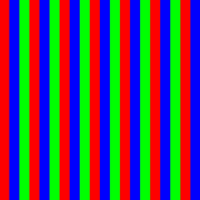
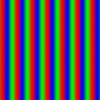
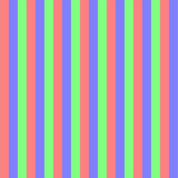
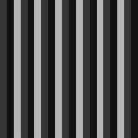
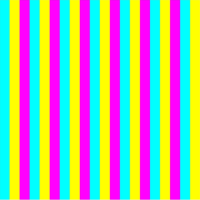

# Adding Image Effects (C/C++)

<!--Kit: ArkGraphics 2D-->
<!--Subsystem: Multimedia-->
<!--Owner: @hanamaru-->
<!--Designer: @chensiyi_CE-->
<!--Tester: @zhaoxiaoguang2-->
<!--Adviser: @ge-yafang-->
<!-- md-trans-meta sourceCommit=05b6c240e981a77318190f74915b3427d158ac77 translatedAt=2026-08-03T11:19:39.963Z pushedAt=2026-08-04T06:17:10.310Z -->

## When to Use

When processing images offline, you can apply various image effects to achieve different visual presentations, such as setting the blur level, adjusting brightness and grayscale, and inverting colors.

Image effects are primarily applied through filters.

## Available APIs

The common APIs for setting image effects using filters are listed in the following table. For details about their usage and parameters, see [effect_filter](../reference/apis-arkgraphics2d/capi-effect-filter-h.md).

| API | Description |
| -------- | -------- |
| EffectErrorCode OH_Filter_CreateEffect(OH_PixelmapNative\* pixelmap, OH_Filter\*\* filter)| Creates a filter object based on a pixel map object. |
| EffectErrorCode OH_Filter_Blur(OH_Filter\* filter, float radius)| Creates a blur effect and adds it to the filter. |
| EffectErrorCode OH_Filter_Brighten(OH_Filter\* filter, float brightness) | Creates a brighten effect and adds it to the filter. |
| EffectErrorCode OH_Filter_GrayScale(OH_Filter\* filter) | Creates a grayscale effect and adds it to the filter. |
| EffectErrorCode OH_Filter_Invert(OH_Filter\* filter) | Creates an invert effect and adds it to the filter. |
| EffectErrorCode OH_Filter_GetEffectPixelMap(OH_Filter\* filter, OH_PixelmapNative\*\* pixelmap) | Obtains the pixel map object generated after filter processing. |
| EffectErrorCode OH_Filter_Release(OH_Filter\* filter) | Releases the filter object. |

## How to Develop

1. Add the following link libraries to **src/main/cpp/CMakeLists.txt** in the native project.

   ``` C++
   target_link_libraries(entry PUBLIC libnative_drawing.so)
   target_link_libraries(entry PUBLIC libhilog_ndk.z.so)
   target_link_libraries(entry PUBLIC libnative_effect.so)
   target_link_libraries(entry PUBLIC libpixelmap.so)
   ```

2. Include the required header files.

   ``` C++
   #include "multimedia/image_framework/image/pixelmap_native.h"
   #include "native_effect/effect_filter.h"
   ```

3. Create an **OH_PixelmapNative** pixel map object.

   Creating a filter requires a pixel map object (**OH_PixelmapNative**) defined by the image framework. You can create a custom pixel map using **OH_PixelmapNative_CreatePixelmap()**, or import a pixel map from an external source using **OH_PixelmapNative_ConvertPixelmapNativeFromNapi()**.

   This section uses **OH_PixelmapNative_CreatePixelmap()** as an example to create an **OH_PixelmapNative** object. This function accepts four parameters: the first parameter is the buffer of image pixel data, used to initialize the pixels of the pixel map; the second parameter is the buffer length; the third parameter is the pixel map format (including width, height, color type, alpha type, etc.); and the fourth parameter is the **OH_PixelmapNative** object, which serves as an output parameter.

   ``` C++
   // The image width and height are 600 * 400 respectively.
   uint32_t width = 600;
   uint32_t height = 400;
   const uint16_t RGBA_MIN = 0x00;
   const uint16_t RGBA_MAX = 0xFF;
   const uint16_t RGBA_SIZE = 4;
   // Byte length. Each pixel in RGBA_8888 occupies 4 bytes.
   size_t bufferSize = width * height * RGBA_SIZE;
   uint8_t *pixels = new uint8_t[bufferSize];
   for (uint32_t i = 0; i < width * height; ++i) {
        // Iterate over and edit each pixel to form alternating red, green, and blue stripes.
        uint32_t n = i / 20 % 3;
        pixels[i * RGBA_SIZE] = RGBA_MIN; // Red channel.
        pixels[i * RGBA_SIZE + 1] = RGBA_MIN; // +1 indicates the green channel.
        pixels[i * RGBA_SIZE + 2] = RGBA_MIN; // +2 indicates the blue channel.
        pixels[i * RGBA_SIZE + 3] = RGBA_MAX; // +3 indicates the opacity channel.
        if (n == 0) {
            pixels[i * RGBA_SIZE] = RGBA_MAX; // Assigns the red channel, making the color appear red.
        } else if (n == 1) {
            pixels[i * RGBA_SIZE + 1] = RGBA_MAX; // +1 assigns the green channel; other channels are 0, producing green.
        } else {
            pixels[i * RGBA_SIZE + 2] = RGBA_MAX; // +2 assigns the blue channel; other channels are 0, producing blue.
        }
   }
   // Set the bitmap format (width, height, color type, alpha type).
   OH_Pixelmap_InitializationOptions *createOps = nullptr;
   OH_PixelmapInitializationOptions_Create(&createOps);
   OH_PixelmapInitializationOptions_SetWidth(createOps, width);
   OH_PixelmapInitializationOptions_SetHeight(createOps, height);
   OH_PixelmapInitializationOptions_SetPixelFormat(createOps, PIXEL_FORMAT_RGBA_8888);
   OH_PixelmapInitializationOptions_SetAlphaType(createOps, PIXELMAP_ALPHA_TYPE_UNKNOWN);
   // Create the OH_PixelmapNative object.
   OH_PixelmapNative *pixelMapNative = nullptr;
   OH_PixelmapNative_CreatePixelmap(pixels, bufferSize, createOps, &pixelMapNative);
   ```

4. Based on the **OH_PixelmapNative** object generated above, initialize an **OH_Filter** object using the **OH_Filter_CreateEffect()** API.

   ``` C++
   OH_Filter *filter = nullptr;
   EffectErrorCode errCodeCreate = OH_Filter_CreateEffect(pixelMapNative, &filter);
   ```

5. Add different image effects to the filter as needed.

    - You can use the **OH_Filter_Blur()** API to add a blur effect to the filter.

      ``` C++
      float radius = 20.0; // Blur radius.
      EffectErrorCode errCodeEffect = OH_Filter_Blur(filter, radius);
      ```

    - You can use the **OH_Filter_Brighten()** API to add a brightening effect to the filter.

      ``` C++
      float brightness = 0.5; // Brightness level (0 to 1).
      EffectErrorCode errCodeEffect = OH_Filter_Brighten(filter, brightness);
      ```

    - You can use the **OH_Filter_GrayScale()** API to add a grayscale effect to the filter.

      ``` C++
      EffectErrorCode errCodeEffect = OH_Filter_GrayScale(filter);
      ```

    - You can use the **OH_Filter_Invert()** API to add an invert effect to the filter.

      ``` C++
      EffectErrorCode errCodeEffect = OH_Filter_Invert(filter);
      ```

6. Obtain the **OH_PixelmapNative** object processed by the filter.

   ``` C++
   OH_PixelmapNative* filterResult = nullptr;
   EffectErrorCode errCodeResult = OH_Filter_GetEffectPixelMap(filter, &filterResult);
   ```

7. When the filter is no longer needed for generating image effects, use **OH_Filter_Release()** to destroy the **OH_Filter** object in a timely manner.

   ``` C++
   EffectErrorCode errCodeRelease = OH_Filter_Release(filter);
   ```

   The following table lists the rendering effects.

   | Image Processing | Rendering Effect |
   | -------- | -------- |
   | Original Image |  |
   | With Blur Effect | |
   | With Brighten Effect | |
   | With Grayscale Effect |  |
   | With Invert Effect |  |