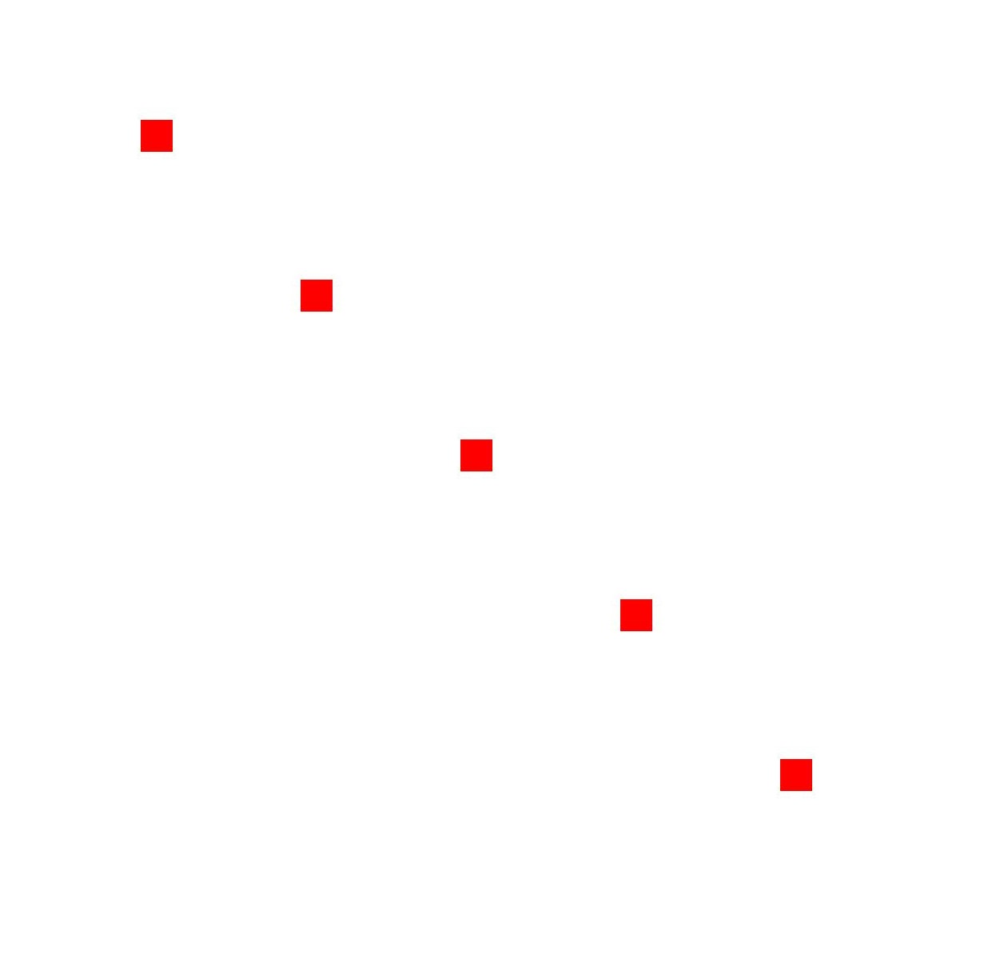
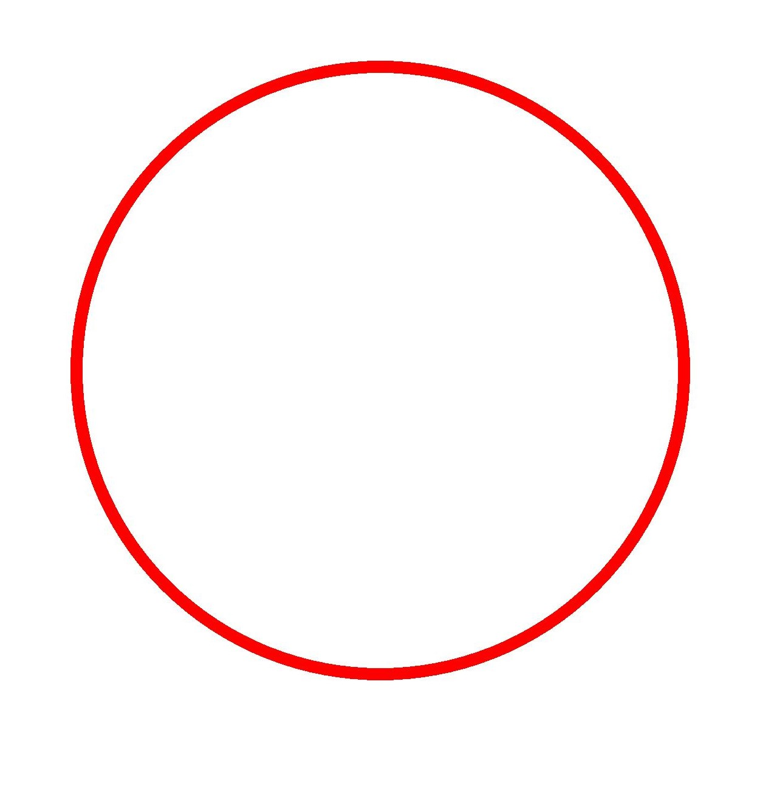
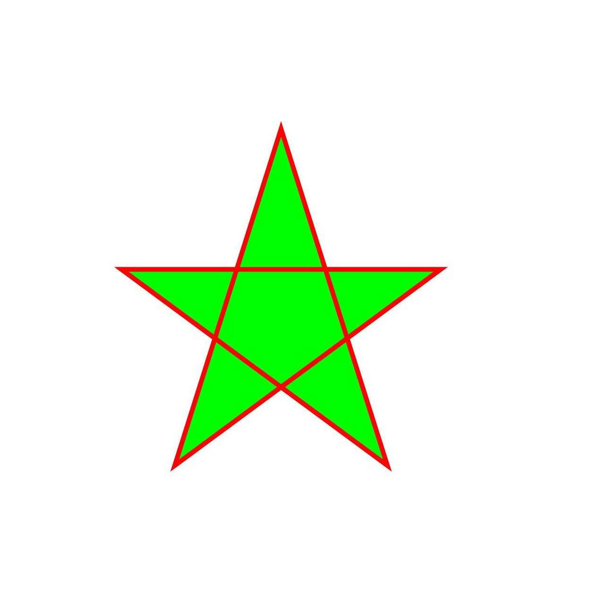
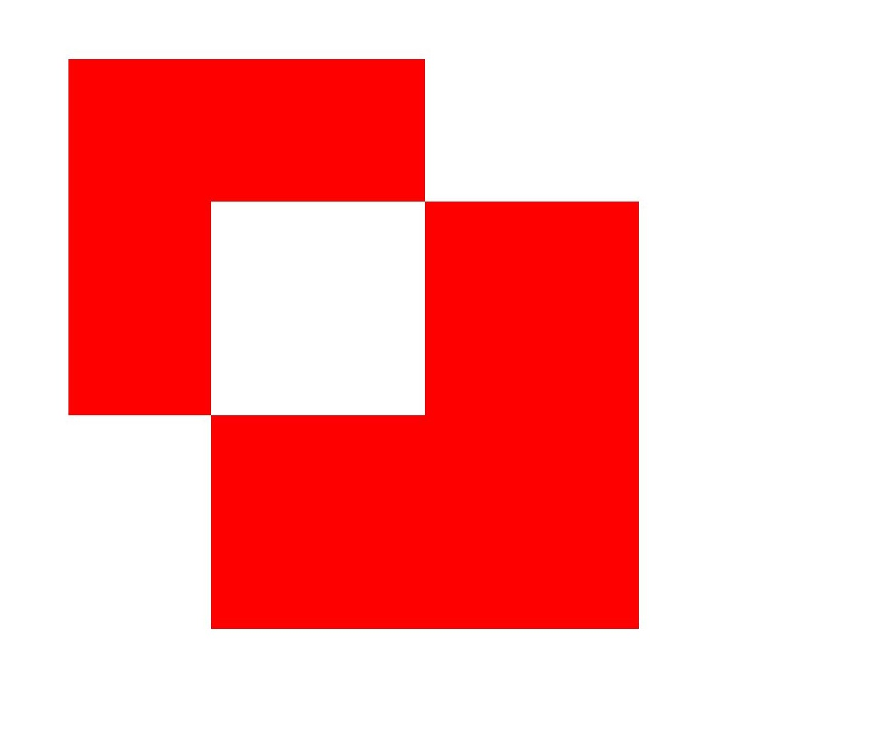

# Drawing Geometric Shapes (ArkTS)


## When to Use

Currently, the following geometric shapes can be drawn:

- Point

- Arc

- Circle

- Path

- Region

- Rectangle

- Rounded rectangle

Most geometric shapes can be drawn by using a pen or brush. Only a pen can be used to draw a point.


## Available APIs

The following table lists the common APIs for drawing geometric shapes. For details about the usage and parameters, see [drawing.Canvas](../reference/apis-arkgraphics2d/js-apis-graphics-drawing.md#canvas).

| Interface| Description|
| -------- | -------- |
| drawPoint(x: number, y: number): void | Draws a point.|
| drawArc(arc: common2D.Rect, startAngle: number, sweepAngle: number): void | Draws an arc.|
| drawCircle(x: number, y: number, radius: number): void | Draws a circle.|
| drawPath(path: Path): void | Draws a path.|
| drawRegion(region: Region): void | Draws a region.|
| drawRect(left: number, top: number, right: number, bottom: number): void | Draws a rectangle.|
| drawRoundRect(roundRect: RoundRect): void | Draws a rounded rectangle.|


## Drawing Points

Points can be drawn only on the canvas based on the pen. You can draw points by calling drawPoint(). Two parameters are required for drawing a point, that is, the x-coordinate and y-coordinate of the point to be drawn.

A simple example is as follows:

```ts
// Set the pen.
let pen = new drawing.Pen();
// Set the color.
pen.setColor(0xFF, 0xFF, 0x00, 0x00);
// Set the line width.
pen.setStrokeWidth(40);
// Set the stroke effect.
canvas.attachPen(pen);
// Draw five points.
canvas.drawPoint(200, 200);
canvas.drawPoint(400, 400);
canvas.drawPoint(600, 600);
canvas.drawPoint(800, 800);
canvas.drawPoint(1000, 1000);
// Remove the stroke effect.
canvas.detachPen();
```




## Drawing Arcs

You can use a pen or brush to draw an arc on the canvas by calling drawArc().

A rectangle ([common2D.Rect](../reference/apis-arkgraphics2d/js-apis-graphics-common2D.md#rect)) is required for drawing an arc. Drawing is performed by using a side of the rectangle as a contour, and two parameters are further required to respectively indicate a start angle (startAngle) and a sweep angle (sweepAngle) of the arc.

The following is an example of drawing an arc using a pen:
```ts
// Create a pen.
let pen = new drawing.Pen();
// Set the color.
pen.setColor({ alpha: 0xFF, red: 0xFF, green: 0x00, blue: 0x00 });
// Set the line width.
pen.setStrokeWidth(20);
// Set the stroke effect.
canvas.attachPen(pen);
// Create a rectangle object.
const rect: common2D.Rect = {left:100, top:200, right:1000, bottom:600};
// Draw a rectangle.
canvas.drawArc(rect, 0, 180);
// Remove the stroke effect.
canvas.detachPen();
```


## Drawing Circles

You can use a pen or brush to draw a circle on the canvas by calling drawCircle().

To draw a circle, you need to obtain the x-coordinate and y-coordinate of the center point of the circle and the radius of the circle.

The following is an example of drawing a circle using a pen:
```ts
// Create a pen.
let pen = new drawing.Pen();
// Set the color.
pen.setColor({ alpha: 0xFF, red: 0xFF, green: 0x00, blue: 0x00 });
// Set the line width.
pen.setStrokeWidth(20);
// Set the stroke effect.
canvas.attachPen(pen);
// Draw a circle.
canvas.drawCircle(630, 630, 500);
// Remove the stroke effect.
canvas.detachPen();
```




## Drawing Paths

A path may be drawn on the canvas by using a pen or a brush. The path may be specifically used to draw a straight line, an arc, a Bezier curve, or the like, or may form another complex shape in a path combination manner.

The following describes the APIs and implementation for drawing a path. For details about the usage and parameters, see [Path](../reference/apis-arkgraphics2d/js-apis-graphics-drawing.md#path). The common interfaces are as follows:

1. You can use new drawing.Path() to create a path object.

2. You can use the moveTo() API to set the start point of a custom path.

3. You can use the lineTo() API to add a line segment from the start point or the last point of the path (if the path does not contain any content, the default value is (0,0)) to the target point.

The following is a simple example of drawing a five-pointed star using a pen and brush:

```ts
let height_ = 1800;
let width_ = 1800;
let len = height_ / 4;
let aX = width_ / 3;
let aY = height_ / 6;
let dX = aX - len * Math.sin(18.0);
let dY = aY + len * Math.cos(18.0);
let cX = aX + len * Math.sin(18.0);
let cY = dY;
let bX = aX + (len / 2.0);
let bY = aY + Math.sqrt((cX - dX) * (cX - dX) + (len / 2.0) * (len / 2.0));
let eX = aX - (len / 2.0);
let eY = bY;

// Create a path object and use the APIs to construct a pentagram.
let path = new drawing.Path();
// Specify the start point of the path.
path.moveTo(aX, aY);
// Draw a line segment from the last point of a path to the target point.
path.lineTo(bX, bY);
path.lineTo(cX, cY);
path.lineTo(dX, dY);
path.lineTo(eX, eY);
// Close the path. Now the path is drawn.
path.close()

// Create a pen object.
let pen = new drawing.Pen();
// Set the anti-aliasing function.
pen.setAntiAlias(true);
// Set the stroke color.
pen.setColor(0xFF, 0xFF, 0x00, 0x00);
// Set the line width.
pen.setStrokeWidth(10.0);
// Set the stroke effect.
canvas.attachPen(pen);
// Create a brush.
let brush = new drawing.Brush();
// Set the fill color to be superimposed on the image.
brush.setColor(0xFF, 0x00, 0xFF, 0x00);
// Set the brush filling effect.
canvas.attachBrush(brush);
Draw a path.
canvas.drawPath(path);
// Remove the filling effect.
canvas.detachBrush();
// Remove the stroke effect.
canvas.detachPen();
```




## Drawing Regions

A region is not a specific shape. You can set it to a specified rectangle or path, or combine two regions. You can use a pen or brush to draw an area. For details about the APIs, see [Region](../reference/apis-arkgraphics2d/js-apis-graphics-drawing.md#region12).

Currently, the rectangular area and path area can be set by calling setRect() and setPath() respectively.

The following is an example of drawing a rectangular combined area using a brush:

```ts
// Create a brush.
let brush = new drawing.Brush();
// Set the color.
brush.setColor(0xFF, 0xFF,  0x00, 0x00);
// Set the brush filling effect.
canvas.attachBrush(brush);
// Create region1 in the upper left corner.
let region1 = new drawing.Region();
region1.setRect(100, 100, 600, 600);
// Create region2 in the lower right corner.
let region2 = new drawing.Region();
region2.setRect(300, 300, 900, 900);
// Combine the two regions in XOR mode.
region1.op(region2, drawing.RegionOp.XOR);
Draw a region.
canvas.drawRegion(region1);
// Remove the filling effect.
canvas.detachBrush();
```




## Drawing Rectangles

You can use a pen or brush to draw a rectangle on the canvas. Use the drawRect() interface to draw a rectangle. The interface needs to transfer four floating point numbers, which indicate the coordinates of the left, top, right, and bottom positions of the rectangle respectively. The four coordinates are connected to form a rectangle.

The following is an example of drawing a rectangle using a brush:

```ts
// Create a brush.
let brush = new drawing.Brush();
// Set the color.
brush.setColor(0xFF, 0xFF,  0x00, 0x00);
// Set the brush filling effect.
canvas.attachBrush(brush);
// Draw a rectangle.
canvas.drawRect(200, 200, 1000, 700);
// Remove the filling effect.
canvas.detachBrush();
```


## Drawing Rounded Rectangles

You can use a pen or brush to draw a rounded rectangle on the canvas. Use the drawRoundRect() interface to draw a rounded rectangle. The API accepts one input parameter roundRect, which corresponds to a rounded rectangle object.

The rounded rectangle object is constructed using the new drawing.RoundRect() interface. The constructor function takes the following three parameters:

- common2D.Rect (rectangle object). A rounded rectangle is formed by cutting rounded corners on the basis of the rectangle.

- Radius of the rounded corner on the X axis.

- Radius of the rounded corner on the Y axis.

The following is an example of using a brush to draw a rounded rectangle:

```ts
// Create a brush.
let brush = new drawing.Brush();
// Set the color.
brush.setColor(0xFF, 0xFF, 0x00, 0x00);
// Set the brush filling effect.
canvas.attachBrush(brush);
// Create a rectangle object.
let rect: common2D.Rect = { left: 200, top: 200, right: 1000, bottom: 700 };
// Create a rounded rectangle object.
let rrect = new drawing.RoundRect(rect, 30, 30);
// Draw a round rectangle on the canvas.
canvas.drawRoundRect(rrect);
// Remove the filling effect.
canvas.detachBrush();
```


