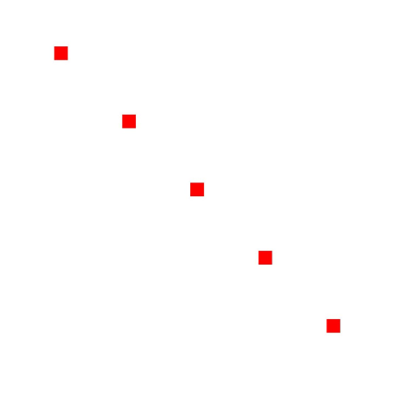
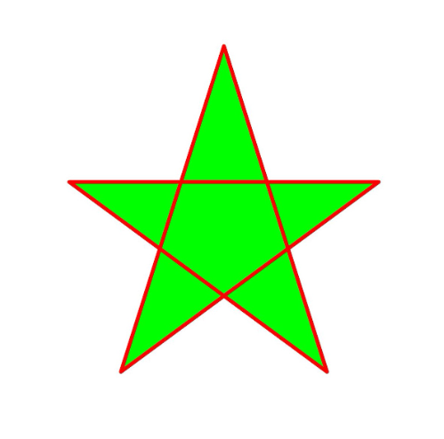
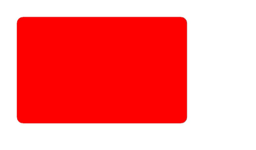

# Drawing Geometric Shapes (C/C++)


## When to Use

Currently, the following geometric shapes can be drawn:

- Point

- Arc

- Circle

- Path

- Region

- Rectangle

- Rounded rectangle

Most geometric shapes can be drawn by using a pen or brush. Only a pen can be used to draw a point.


## Available APIs

The following table lists the common APIs for drawing geometric shapes. For details about the usage and parameters, see [drawing_canvas.h](../reference/apis-arkgraphics2d/drawing__canvas_8h.md).

| Interface| Description|
| -------- | -------- |
| OH_Drawing_Point\* OH_Drawing_PointCreate (float x, float y) | Creates an **OH_Drawing_Point** object.|
| OH_Drawing_ErrorCode OH_Drawing_CanvasDrawPoint (OH_Drawing_Canvas \*canvas, const OH_Drawing_Point2D \*point) | Draws a point.|
| OH_Drawing_Rect\* OH_Drawing_RectCreate (float left, float top, float right, float bottom) | Creates an **OH_Drawing_Rect** object.|
| void OH_Drawing_CanvasDrawArc (OH_Drawing_Canvas\*, const OH_Drawing_Rect\*, float startAngle, float sweepAngle) | Draws an arc.|
| void OH_Drawing_CanvasDrawCircle (OH_Drawing_Canvas\*, const OH_Drawing_Point\*, float radius) | Draws a circle.|
| OH_Drawing_Path\* OH_Drawing_PathCreate (void) | Creates an **OH_Drawing_Path** object.|
| void OH_Drawing_CanvasDrawPath (OH_Drawing_Canvas\*, const OH_Drawing_Path\*) | Draws a path.|
| OH_Drawing_Region\* OH_Drawing_RegionCreate (void) | Creates a region object.|
| void OH_Drawing_CanvasDrawRegion (OH_Drawing_Canvas\*, const OH_Drawing_Region\*) | Draws a region.|
| void OH_Drawing_CanvasDrawRect (OH_Drawing_Canvas\*, const OH_Drawing_Rect\*) | Draws a rectangle.|
| OH_Drawing_RoundRect\* OH_Drawing_RoundRectCreate (const OH_Drawing_Rect\*, float xRad, float yRad) | Creates an **OH_Drawing_RoundRect** object.|
| void OH_Drawing_CanvasDrawRoundRect (OH_Drawing_Canvas\*, const OH_Drawing_RoundRect\*) | Draws a rounded rectangle.|


## Drawing Points

Points can be drawn only on the canvas based on the pen. You can draw points by calling OH_Drawing_CanvasDrawPoint(). The interface accepts two parameters. One is the canvas object. Ensure that the canvas has been created or obtained. For details, see [Obtaining a Canvas and Displaying Drawing Results (C/C++)](canvas-get-result-draw-c.md). The other is the pointer to the point to be drawn.

A simple example is as follows:

```c++
// Create a pen object.
OH_Drawing_Pen* pen = OH_Drawing_PenCreate();
    // Set the stroke color.
OH_Drawing_PenSetColor(pen, OH_Drawing_ColorSetArgb(0xFF, 0xFF, 0x00, 0x00));
// Set the line width of the pen.
OH_Drawing_PenSetWidth(pen, 40);
// Set the pen of the canvas.
OH_Drawing_CanvasAttachPen(canvas, pen);
// Draw five points.
OH_Drawing_Point2D point1 = {200.0f, 200.0f};
OH_Drawing_CanvasDrawPoint(canvas, &point1);
OH_Drawing_Point2D point2 = {400.0f, 400.0f};
OH_Drawing_CanvasDrawPoint(canvas, &point2);
OH_Drawing_Point2D point3 = {600.0f, 600.0f};
OH_Drawing_CanvasDrawPoint(canvas, &point3);
OH_Drawing_Point2D point4 = {800.0f, 800.0f};
OH_Drawing_CanvasDrawPoint(canvas, &point4);
OH_Drawing_Point2D point5 = {1000.0f, 1000.0f};
OH_Drawing_CanvasDrawPoint(canvas, &point5);
// Remove the pen from the canvas.
OH_Drawing_CanvasDetachPen(canvas);
// Destroy various objects.
OH_Drawing_PenDestroy(pen);
```


The effect is as follows:





## Drawing Arcs

You can draw an arc on the canvas by using the OH_Drawing_CanvasDrawArc() interface. The following four parameters need to be transferred when the interface is used:

- The canvas object is required. Ensure that the canvas has been created or obtained. For details, see [Obtaining a Canvas and Displaying Drawing Results (C/C++)](canvas-get-result-draw-c.md).

- Drawing an arc also requires a rectangle, which is drawn with the edges of the rectangle as the outline.

- A floating-point parameter is required to indicate the start angle of the arc.

- Another floating-point parameter is required to indicate the scanning angle of the arc.

The following is an example of drawing an arc using a pen:

```c++
// Create a pen object.
OH_Drawing_Pen* pen = OH_Drawing_PenCreate();
// Set the stroke color.
OH_Drawing_PenSetColor(pen, OH_Drawing_ColorSetArgb(0xFF, 0xFF, 0x00, 0x00));
// Set the line width of the pen.
OH_Drawing_PenSetWidth(pen, 20);
// Set the pen of the canvas.
OH_Drawing_CanvasAttachPen(canvas, pen);
// Create a rectangle object.
OH_Drawing_Rect* rect = OH_Drawing_RectCreate(100, 200, 500, 300);
// Draw an arc based on a rectangular object.
OH_Drawing_CanvasDrawArc(canvas, rect, 10, 200);
// Remove the pen from the canvas.
OH_Drawing_CanvasDetachPen(canvas);
// Destroy various objects.
OH_Drawing_PenDestroy(pen);
OH_Drawing_RectDestroy(rect);
```

The effect is as follows:


## Drawing Circles

You can draw a circle on the canvas by using the OH_Drawing_CanvasDrawCircle() interface. The following three parameters need to be transferred when the interface is used:

- The canvas object is required. Ensure that the canvas has been created or obtained. For details, see [Obtaining a Canvas and Displaying Drawing Results (C/C++)](canvas-get-result-draw-c.md).

- Drawing a circle also requires a pointer pointing to the circle center object, which is used as the circle center for drawing.

- Finally, a floating-point parameter is required to indicate the radius of the circle.

The following is an example of drawing a circle using a pen:

```c++
// Create a pen object.
OH_Drawing_Pen* pen = OH_Drawing_PenCreate();
// Set the stroke color.
OH_Drawing_PenSetColor(pen, OH_Drawing_ColorSetArgb(0xFF, 0xFF, 0x00, 0x00));
// Set the line width of the pen.
OH_Drawing_PenSetWidth(pen, 20);
// Set the pen of the canvas.
OH_Drawing_CanvasAttachPen(canvas, pen);
// Create a circle center point.
OH_Drawing_Point *point = OH_Drawing_PointCreate(700, 700);
// Draw a circle on the canvas based on the center point and radius.
OH_Drawing_CanvasDrawCircle(canvas, point, 600);
// Remove the pen from the canvas.
OH_Drawing_CanvasDetachPen(canvas);
// Destroy various objects.
OH_Drawing_PenDestroy(pen);
OH_Drawing_PointDestroy(point);
```

The effect is as follows:


## Drawing Paths

A path may be drawn on the canvas by using a pen or brush. The path may be specifically used to draw a straight line, an arc, a Bezier curve, or the like, or may form another complex shape in a path combination manner.

The following describes the APIs and implementation for drawing a path. For details about the usage and parameters, see [drawing_path](../reference/apis-arkgraphics2d/drawing__path_8h.md). The common interfaces are as follows:

1. You can use the OH_Drawing_PathCreate() interface to create a path object.

2. You can call the OH_Drawing_PathMoveTo() API to set the start point of a custom path.

3. You can use the OH_Drawing_PathLineTo() API to add a line segment from the start point or the last point of the path (if the path does not contain any content, the default value is (0,0)) to the target point.

The following is an example of drawing a five-pointed star using a pen and brush:

```c++
// Create a pen object.
OH_Drawing_Pen* pen = OH_Drawing_PenCreate();
// Set the stroke color.
OH_Drawing_PenSetColor(pen, OH_Drawing_ColorSetArgb(0xFF, 0xFF, 0x00, 0x00));
// Set the line width of the pen.
OH_Drawing_PenSetWidth(pen, 10);
// Set the pen corner style.
OH_Drawing_PenSetJoin(pen, LINE_ROUND_JOIN);
// Set the pen in the canvas.
OH_Drawing_CanvasAttachPen(canvas, pen); 
// Create a brush. In this example, the closed path is filled with colors. Therefore, a brush is required.
OH_Drawing_Brush *brush = OH_Drawing_BrushCreate();
OH_Drawing_BrushSetColor(brush , OH_Drawing_ColorSetArgb(0xFF, 0x00, 0xFF, 0x00));
// Set the brush in the canvas.
OH_Drawing_CanvasAttachBrush(canvas, brush ); 
int len = 551;
float aX = 630;
float aY = 551;
float dX = aX - len * std::sin(18.0f);
float dY = aY + len * std::cos(18.0f);
float cX = aX + len * std::sin(18.0f);
float cY = dY;
float bX = aX + (len / 2.0);
float bY = aY + std::sqrt((cX - dX) * (cX - dX) + (len / 2.0) * (len / 2.0));
float eX = aX - (len / 2.0);
float eY = bY;
Paths
OH_Drawing_Path* path = OH_Drawing_PathCreate();
// To the start point
OH_Drawing_PathMoveTo(path, aX, aY); 
// Draw a straight line on the canvas.
OH_Drawing_PathLineTo(path, bX, bY); 
OH_Drawing_PathLineTo(path, cX, cY);
OH_Drawing_PathLineTo(path, dX, dY);
OH_Drawing_PathLineTo(path, eX, eY);
// The straight line is closed to form a pentagon.
OH_Drawing_PathClose(path); 
// Draw a closed path.
OH_Drawing_CanvasDrawPath(canvas, path);
// Remove the pen and brush from the canvas.
OH_Drawing_CanvasDetachPen(canvas);
OH_Drawing_CanvasDetachBrush(canvas);
// Destroy various objects.
OH_Drawing_PenDestroy(pen);
OH_Drawing_BrushDestroy(brush);
OH_Drawing_PathDestroy(path);
```

The effect is as follows:




## Drawing Regions

A region is not a specific shape. You can set it to a specified rectangle or path, or combine two regions. You can use a pen or brush to draw a region on the canvas. For details about the APIs, see [drawing_region.h](../reference/apis-arkgraphics2d/drawing__region_8h.md).

Currently, the rectangular region and path region can be set by calling OH_Drawing_RegionSetRect() and OH_Drawing_RegionSetPath() respectively.

The following is an example of drawing a rectangular combined area using a brush:

```c++
// Create a brush object.
OH_Drawing_Brush* brush = OH_Drawing_BrushCreate();
// Set the brush fill color.
OH_Drawing_BrushSetColor(brush, OH_Drawing_ColorSetArgb(0xFF, 0xFF, 0x00, 0x00));
// Set the brush of the canvas.
OH_Drawing_CanvasAttachBrush(canvas, brush); 
// Rectangular area 1
OH_Drawing_Region *region1 = OH_Drawing_RegionCreate();
OH_Drawing_Rect *rect1 = OH_Drawing_RectCreate(100.0f, 100.0f, 600.f, 600.f);
OH_Drawing_RegionSetRect(region1, rect1); 
// Rectangular area 2
OH_Drawing_Region *region2 = OH_Drawing_RegionCreate();
OH_Drawing_Rect *rect2 = OH_Drawing_RectCreate(300.0f, 300.0f, 900.f, 900.f);
OH_Drawing_RegionSetRect(region2, rect2);
// Combination of two rectangular areas
OH_Drawing_RegionOp(region1, region2, OH_Drawing_RegionOpMode::REGION_OP_MODE_XOR); 
OH_Drawing_CanvasDrawRegion(canvas, region1);
// Remove the brush from the canvas.
OH_Drawing_CanvasDetachBrush(canvas);
// Destroy various objects.
OH_Drawing_BrushDestroy(brush);
OH_Drawing_RegionDestroy(region1);
OH_Drawing_RegionDestroy(region2);
OH_Drawing_RectDestroy(rect1);
OH_Drawing_RectDestroy(rect2);
```

The effect is as follows:


## Drawing Rectangles

You can use a pen or brush to draw a rectangle on the canvas. Create a rectangle by calling OH_Drawing_RectCreate(). The interface needs to transfer four floating point numbers, which indicate the coordinates of the left, top, right, and bottom positions of the rectangle respectively. The four coordinates are connected to form a rectangle.

A simple example is as follows:

```c++
// Create a brush object.
OH_Drawing_Brush *brush = OH_Drawing_BrushCreate();
// Set the fill color of the brush.
OH_Drawing_BrushSetColor(brush, 0xffff0000);
// Set the brush of the canvas.
OH_Drawing_CanvasAttachBrush(canvas, brush); 
OH_Drawing_Rect* rect = OH_Drawing_RectCreate(0, 0, 800, 800);
// Draw a rectangle.
OH_Drawing_CanvasDrawRect(canvas, rect); 
// Remove the brush from the canvas.
OH_Drawing_CanvasDetachBrush(canvas);
// Destroy various objects.
OH_Drawing_BrushDestroy(brush);
OH_Drawing_RectDestroy(rect);
```

The effect is as follows:


## Drawing Rounded Rectangles

You can use a pen or brush to draw a rounded rectangle on the canvas. Call the OH_Drawing_RoundRectCreate() API to create a rounded rectangle. The interface needs to transfer the following parameters:

- The pointer pointing to the OH_Drawing_Rect rectangle object needs to be transferred to draw a rounded rectangle based on the rectangle.

- A floating-point parameter is required to indicate the radius of a rounded corner on the x-axis.

- A floating-point parameter is required to indicate the radius of the rounded corner on the y-axis.

A simple example is as follows:

```c++
// Create a brush object.
OH_Drawing_Brush *brush = OH_Drawing_BrushCreate();
// Set the fill color of the brush.
OH_Drawing_BrushSetColor(brush, 0xffff0000);
// Set the brush of the canvas.
OH_Drawing_CanvasAttachBrush(canvas, brush); 
// Create a rectangle.
OH_Drawing_Rect* rect = OH_Drawing_RectCreate(100, 100, 900, 600);
// Create a rounded rectangle.
OH_Drawing_RoundRect* roundRect = OH_Drawing_RoundRectCreate(rect, 30, 30);
// Draw a round rectangle on the canvas.
OH_Drawing_CanvasDrawRoundRect(canvas, roundRect);
// Remove the brush from the canvas.
OH_Drawing_CanvasDetachBrush(canvas);
// Destroy various objects.
OH_Drawing_BrushDestroy(brush);
OH_Drawing_RectDestroy(rect);
OH_Drawing_RoundRectDestroy(roundRect);
```


The effect is as follows:



