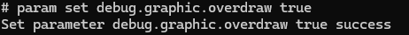
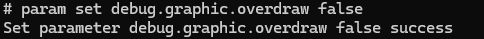
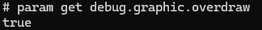

# Overdraw Debugging

Deeply nested layouts of an application can lead to performance issues such as redundant use of CPU, GPU, and other computing resources. For example, in a deeply nested layout, drawing instructions of some components are partially or completely covered by drawing instructions of others during rendering. When an application draws a pixel on the screen multiple times within a single frame of rendering, this is called overdraw. To help you reduce overdraw, the system introduces the overdraw debugging feature. With this feature, you can view the location and level of the component that causes overdraw.

This topic describes how to use the overdraw debugging feature and how to reduce overdraw.

## Enabling or Disabling Overdraw Debugging

You can use the shell commands to enable or disable the overdraw debugging feature.

- Prerequisites: Developer mode is enabled.

- Enable overdraw debugging.

  ```
  param set debug.graphic.overdraw true
  ```

  

- Disable overdraw debugging.

  ```
  param set debug.graphic.overdraw false
  ```

  

- Check whether overdraw debugging is enabled.

  The value **true** means that the feature is enabled, and **false** means the opposite.

  ```
  param get debug.graphic.overdraw
  ```

  


## Analyzing Overdrawn Components

After you enable overdraw debugging and open an application UI, overdrawn pixels are highlighted by boxes with different colors. A deeper color represents a higher level of overdraw. The mapping is as follows:

- Original color: no overdraw.
- Blue-purple: Overdraw occurs once.
- Green: Overdraw occurs twice.
- Light red: Overdraw occurs for three times.
- Dark red: Overdraw occurs for four times or more.


The following is a sample application with redundant background color nesting.

```ts
@Entry
@Component
struct Index {
  @State message: string = 'Hello World'

  build() {
    Row() {
      Column() {
        Column() {
          Column() {
            Column() {
              Column() {
                Text("Hello World")
              }
              .width('80%')
              .height('80%')
              .backgroundColor(Color.White)
            }
            .width('80%')
            .height('80%')
            .backgroundColor(Color.White)
          }
          .width('80%')
          .height('80%')
          .backgroundColor(Color.White)
        }
        .width('80%')
        .height('80%')
        .backgroundColor(Color.White)
      }
      .width('80%')
    }
    .height('80%')
  }
}
```


The figure above shows the UI when the overdraw debugging feature is enabled.

From the **Text** component **Hello World**, the **Column** components from inside to outside are displayed in dark red, light red, green, blue-purple, and original color. This indicates that the background of each **Column** component is rendered multiple times as the nesting depth increases.

The system UI (such as the status bar and sidebar) is also displayed in a different color. This is a normal phenomenon.

## Reducing Overdraw

The debugging feature helps you find overdraw problems on the application UI. To reduce overdraw, you are advised to use the following methods:

- Use the visibility control or the if-else statement to reduce redundant components.

- Reduce drawing instructions on components that are completely blocked, such as the background color and component content.

- Use the flattened layout to reduce the nesting depth. For example, combine layout components with similar sizes and functions into one component.
