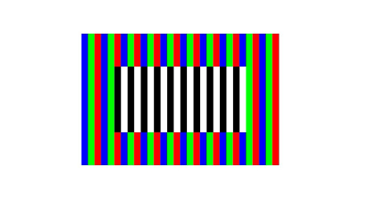

# Drawing Images (ArkTS)


A PixelMap is a data structure used to store and represent images in the memory. It is a set of uncompressed pixels. However, images in formats such as JPEG and PNG are compressed. To draw a JPEG or PNG image on the screen, decode the image into a PixelMap. For details, see [Introduction to Image Kit](../media/image/image-overview.md).


Currently, drawing (ArkTS) depends on PixelMap, which can be used to read or write image data and obtain image information. For details about the APIs, see [PixelMap](../reference/apis-image-kit/js-apis-image.md#pixelmap7).


1. Create a **PixelMap** instance.

   There are multiple APIs for creating a pixel map. The following uses createPixelMapSync() as an example. For details about the creation methods and APIs, see [@ohos.multimedia.image (Image Processing)](../reference/apis-image-kit/js-apis-image.md).

   The createPixelMapSync() function takes two parameters. The first parameter is the buffer of the image pixel data, which is used to initialize the pixels of the PixelMap. The second parameter is the attributes of the created pixel, including the transparency, size, thumbnail value, pixel format, and whether the pixel is editable.

   ```ts
   // Image width and height
   let width = 600;
   let height = 400;
   // Byte length. Each RGBA_8888 pixel occupies 4 bytes.
   let bytelength = width * height * 4;
   const color: ArrayBuffer = new ArrayBuffer(bytelength);
   let bufferArr = new Uint8Array(color);
   for (let i = 0; i < bufferArr.length; i += 4) {
     // Traverse and edit each pixel to form a stripe between red, green, and blue.
     bufferArr[i] = 0x00;
     bufferArr[i+1] = 0x00;
     bufferArr[i+2] = 0x00;
     bufferArr[i+3] = 0xFF;
     let n = Math.floor(i / 80) % 3;
     if (n == 0) {
       bufferArr[i] = 0xFF;
     } else if (n == 1) {
       bufferArr[i+1] = 0xFF;
     } else {
       bufferArr[i+2] = 0xFF;
     }
   }
   // Set pixel attributes.
   let opts: image.InitializationOptions = { editable: true, pixelFormat: image.PixelMapFormat.RGBA_8888, size: { height: height, width: width }}
   // Create a PixelMap instance.
   let pixelMap : image.PixelMap = image.createPixelMapSync(color, opts);
   ```

2. (Optional) Edit the pixels in the pixel map. If you do not need to edit pixels, skip this step.

   There are multiple APIs for editing pixels in a pixel map. The following uses writePixelsSync() as an example. For more methods and interfaces, see [PixelMap](../reference/apis-image-kit/js-apis-image.md#pixelmap7).

   ```ts
   // Set the width and height of the editing area.
   let inner_width = 400;
   let inner_height = 200;
   // Length of the editing area. Each pixel of RGBA_8888 occupies 4 bytes.
   let inner_bytelength = inner_width * inner_height * 4;
   const inner_color: ArrayBuffer = new ArrayBuffer(inner_bytelength);
   let inner_bufferArr = new Uint8Array(inner_color);
   for (let i = 0; i < inner_bufferArr.length; i += 4) {
     // Set the pixels of the editing area to black and white stripes.
     let n = Math.floor(i / 80) % 2;
     if (n == 0) {
       inner_bufferArr[i] = 0x00;
       inner_bufferArr[i+1] = 0x00;
       inner_bufferArr[i+2] = 0x00;
     } else {
       inner_bufferArr[i] = 0xFF;
       inner_bufferArr[i+1] = 0xFF;
       inner_bufferArr[i+2] = 0xFF;
     }
     inner_bufferArr[i+3] = 0xFF;
   }
   // Set the pixel, width, height, and offset of the editing area.
   const area: image.PositionArea = {
     pixels: inner_color,
     offset: 0,
     stride: inner_width * 4,
     region: { size: { height: inner_height, width: inner_width }, x: 100, y: 100 }
   };
   // Edit the PixelMap to form black and white stripes in the middle.
   pixelMap.writePixelsSync(area);
   ```

3. Draws a pixel map.

   When drawing a pixel map, you need to draw a PixelMap by using the Canva APIs. The following uses drawImage() as an example. For details about more methods and APIs, see [drawing.Canvas](../reference/apis-arkgraphics2d/js-apis-graphics-drawing.md#canvas).

   The drawImage() function takes four parameters. The first one is the pixel map created in the preceding step, the second one is the x-axis coordinate of the upper left corner of the drawn image, the third one is the y-axis coordinate of the upper left corner, and the fourth one is the sampling option object. By default, the original sampling option object is constructed without any parameter.

   ```ts
   canvas.drawImage(pixelMap, 300, 300);
   ```

   The drawing effect is as follows:

   
