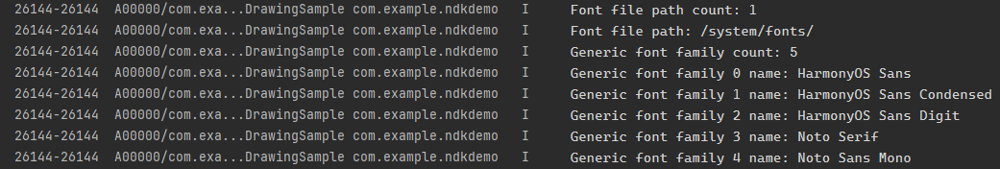

# Obtaining and Using System Fonts (C/C++)

<!--Kit: ArkGraphics 2D-->
<!--Subsystem: Graphics-->
<!--Owner: @gmiao522-->
<!--Designer: @liumingxiang-->
<!--Tester: @yhl0101-->
<!--Adviser: @ge-yafang-->
<!-- md-trans-meta sourceCommit=8e9d3b746529fedba672cd46a96d4746984bcb6c translatedAt=2026-08-15T01:51:48.027Z pushedAt=2026-08-15T08:33:42.996Z -->

## Overview

System fonts are built-in fonts of the operating system. They show text when no other font is chosen, maintaining clear and uniform text presentation. The default system font is "HarmonyOS Sans".

System fonts can be enabled when an application does not register custom fonts or does not explicitly specify the text style. There are multiple system fonts. You can obtain the configuration information about system fonts and switch and use system fonts based on the font family name in the information.

System fonts can be disabled when you want to ensure that only custom fonts are used in your application, without being affected by the default fonts of the operating system. If the system font is enabled when there is no custom font, the system uses the default font. You can disable system fonts to ensure that the text rendering conforms to the design expectation and the visual style of the application is consistent.

## Available APIs

The following table lists the common APIs and structs related to system fonts. For details about the APIs, see [Drawing](../reference/apis-arkgraphics2d/capi-drawing.md).

| Name| Description|
| -------- | -------- |
| OH_Drawing_FontConfigInfo\* OH_Drawing_GetSystemFontConfigInfo(OH_Drawing_FontConfigInfoErrorCode\* errorCode) | Obtains the configuration about system fonts and returns the **OH_Drawing_FontConfigInfo** struct. |
| void OH_Drawing_DestroySystemFontConfigInfo(OH_Drawing_FontConfigInfo\* drawFontCfgInfo) | Reclaims the memory occupied by the system font configuration. |
| OH_Drawing_FontCollection\* OH_Drawing_CreateSharedFontCollection(void) | Creates an **OH_Drawing_FontCollection** object that is shareable.|
| OH_Drawing_TextStyle\* OH_Drawing_CreateTextStyle(void) | Creates a pointer to an **OH_Drawing_TextStyle** object to set the text style.|
| OH_Drawing_SetTextStyleFontFamilies(OH_Drawing_TextStyle\* style, int fontFamiliesNumber, const char \*fontFamilies[]) | Sets the font families for a text style. |
| void OH_Drawing_DisableFontCollectionSystemFont(OH_Drawing_FontCollection\* fontCollection) | Disables the system fonts.|

| Struct| Description| 
| -------- | -------- |
| OH_Drawing_FontConfigInfo | Describes the information about a system font configuration.| 
| OH_Drawing_FontGenericInfo | Describes the information about generic fonts supported by the system.| 
| OH_Drawing_FontFallbackGroup | Describes the information about a font fallback group.| 

## Obtaining System Font Information

1. Add the following library to the `src/main/cpp/CMakeLists.txt` file of the project.

   ```c++
   libnative_drawing.so
   ```

2. Import the required header files.

   ```c++
   #include <native_drawing/drawing_font_collection.h>
   #include <native_drawing/drawing_text_typography.h>
   #include <native_drawing/drawing_register_font.h>
   #include <hilog/log.h>
   ```

3. Obtain the system font configuration information. You can determine whether the information is obtained successfully based on the returned status code. For details about the status codes and their meanings, see [OH_Drawing_FontConfigInfoErrorCode](../reference/apis-arkgraphics2d/capi-drawing-text-typography-h.md#oh_drawing_fontconfiginfoerrorcode).

   <!-- @[custom_font_c_print_system_font_metrics_step1](https://gitcode.com/openharmony/applications_app_samples/blob/master/code/DocsSample/ArkGraphics2D/TextEngine/NDKThemFontAndCustomFontText/entry/src/main/cpp/samples/sample_bitmap.cpp) -->

   ``` C++
   OH_Drawing_FontConfigInfoErrorCode fontConfigInfoErrorCode;  // Used to receive the error code.
   OH_Drawing_FontConfigInfo* fontConfigInfo = OH_Drawing_GetSystemFontConfigInfo(&fontConfigInfoErrorCode);
   if(fontConfigInfoErrorCode != SUCCESS_FONT_CONFIG_INFO) {
       OH_LOG_Print(LOG_APP, LOG_ERROR, LOG_DOMAIN, "PrintSysFontMetrics", "Failed to obtain the system information. The error code is %{public}d", fontConfigInfoErrorCode);
   }
   ```

4. Obtain the following information from [OH_Drawing_FontConfigInfo](../reference/apis-arkgraphics2d/capi-drawing-oh-drawing-fontconfiginfo.md):

   - Number of system font file paths.

   - Number of generic font sets.

   - Number of font fallbacks.

   - Double pointer to the system font file paths.

   - List of generic font sets. For details, see [OH_Drawing_FontGenericInfo](../reference/apis-arkgraphics2d/capi-drawing-oh-drawing-fontgenericinfo.md).

   - List of font fallbacks. For details, see [OH_Drawing_FontFallbackGroup](../reference/apis-arkgraphics2d/capi-drawing-oh-drawing-fontfallbackgroup.md).

   The following example shows how to obtain certain configuration information about system fonts:

   <!-- @[custom_font_c_print_system_font_metrics_step2](https://gitcode.com/openharmony/applications_app_samples/blob/master/code/DocsSample/ArkGraphics2D/TextEngine/NDKThemFontAndCustomFontText/entry/src/main/cpp/samples/sample_bitmap.cpp) -->

   ``` C++
   // Obtaining system font configuration
   if (fontConfigInfo != nullptr) {
       // Obtain the number of font file paths and print logs.
       size_t fontDirCount = fontConfigInfo->fontDirSize;
       OH_LOG_Print(LOG_APP, LOG_INFO, LOG_DOMAIN, "PrintSysFontMetrics", "Font file path count: %{public}zu\n", fontDirCount);
       // Iterate through the font file path list and print logs.
       for (size_t i = 0; i < fontDirCount; ++i) {
           OH_LOG_Print(LOG_APP, LOG_INFO, LOG_DOMAIN, "PrintSysFontMetrics", "Font file path: %{public}s\n",
                        fontConfigInfo->fontDirSet[i]);
       }
       // Obtain the number of generic font sets and print logs.
       size_t genericCount = fontConfigInfo->fontGenericInfoSize;
       OH_LOG_Print(LOG_APP, LOG_INFO, LOG_DOMAIN, "PrintSysFontMetrics", "Generic font set count: %{public}zu\n", genericCount);
       // Obtain the font family name (for example, HarmonyOS Sans) in each generic font set and print logs.
       for (size_t i = 0; i < genericCount; ++i) {
           OH_Drawing_FontGenericInfo &genericInfo = fontConfigInfo->fontGenericInfoSet[i];
           OH_LOG_Print(LOG_APP, LOG_INFO, LOG_DOMAIN, "PrintSysFontMetrics",
                        "Obtain the font family name %{public}s", i, genericInfo.familyName in the No.%{public}zu generic font set);
       }
   }
   ```

   The following figure shows some system font configuration information of the application device system. The configuration information varies according to devices.

   

5. Release the memory occupied by the configuration information if it is no longer needed.

   ```c++
   OH_Drawing_DestroySystemFontConfigInfo(fontConfigInfo);
   ```

## Using or Switching System Fonts

There are multiple system fonts. You can obtain the configuration information about system fonts and switch and use system fonts based on the font family name.

If no font is specified, the default system font "HarmonyOS Sans" is used to display text.

1. Add the following library to the `src/main/cpp/CMakeLists.txt` file of the project.

   ```c++
   libnative_drawing.so
   ```

2. Import the required header files.

   ```c++
   #include <native_drawing/drawing_font_collection.h>
   #include <native_drawing/drawing_text_typography.h>
   #include <native_drawing/drawing_register_font.h>
   #include <hilog/log.h>
   ```

3. Create a font collection object. It is recommended to preferentially use **OH_Drawing_CreateSharedFontCollection** to create a shareable font collection object.

   > **NOTE**
   >
   > **OH_Drawing_CreateFontCollection** and **OH_Drawing_CreateSharedFontCollection** both create an **OH_Drawing_FontCollection** object. However, **OH_Drawing_CreateFontCollection** creates font set pointers that cannot be shared across **OH_Drawing_TypographyCreate** objects. Therefore, you are advised to use **OH_Drawing_CreateSharedFontCollection** to create a sharable font set object.

   <!-- @[custom_font_c_create_shared_font_collection](https://gitcode.com/openharmony/applications_app_samples/blob/master/code/DocsSample/ArkGraphics2D/TextEngine/NDKThemFontAndCustomFontText/entry/src/main/cpp/samples/sample_bitmap.cpp) -->

   ``` C++
   OH_Drawing_FontCollection *fontCollection = OH_Drawing_CreateSharedFontCollection();
   ```

4. Create an **OH_Drawing_TextStyle** object to set the text style.

   <!-- @[custom_font_c_create_text_style](https://gitcode.com/openharmony/applications_app_samples/blob/master/code/DocsSample/ArkGraphics2D/TextEngine/NDKThemFontAndCustomFontText/entry/src/main/cpp/samples/sample_bitmap.cpp) -->

   ``` C++
   OH_Drawing_TextStyle *textStyle = OH_Drawing_CreateTextStyle();
   ```

5. [Obtaining system font information](#obtaining-system-font-information): Obtain the font family name and set the system font in the text style.

   <!-- @[custom_font_c_print_system_font_metrics_step3](https://gitcode.com/openharmony/applications_app_samples/blob/master/code/DocsSample/ArkGraphics2D/TextEngine/NDKThemFontAndCustomFontText/entry/src/main/cpp/samples/sample_bitmap.cpp) -->

   ``` C++
   // Case 1: Set the system font to "HarmonyOS Sans Condensed".
   const char *myFontFamilies[] = {"HarmonyOS Sans Condensed"};
   OH_Drawing_SetTextStyleFontFamilies(textStyle, 1, myFontFamilies);
   
   // Case 2: Use the default system font "HarmonyOS Sans".
   // const char* myFontFamilies[] = {"HarmonyOS Sans Condensed"};
   // OH_Drawing_SetTextStyleFontFamilies(textStyle, 1, myFontFamilies);
   ```

6. Generate the final paragraph to implement text drawing and display.

   <!-- @[custom_font_c_print_system_font_metrics_step4](https://gitcode.com/openharmony/applications_app_samples/blob/master/code/DocsSample/ArkGraphics2D/TextEngine/NDKThemFontAndCustomFontText/entry/src/main/cpp/samples/sample_bitmap.cpp) -->

   ``` C++
   // Set other text styles.
   OH_Drawing_SetTextStyleColor(textStyle, OH_Drawing_ColorSetArgb(0xFF, 0x00, 0x00, 0x00));
   // Set the font size to 70.0.
   OH_Drawing_SetTextStyleFontSize(textStyle, 70.0);
   // Create a paragraph style object to set the typography style.
   OH_Drawing_TypographyStyle *typographyStyle = OH_Drawing_CreateTypographyStyle();
   OH_Drawing_SetTypographyTextAlign(typographyStyle, TEXT_ALIGN_LEFT); // Set the typography to left alignment.
   // Create a paragraph generator.
   OH_Drawing_TypographyCreate *handler = OH_Drawing_CreateTypographyHandler(typographyStyle, fontCollection);
   // Set the text style in the paragraph generator.
   OH_Drawing_TypographyHandlerPushTextStyle(handler, textStyle);
   // Set the text content in the paragraph generator.
   const char *text = "Hello World. \nThe preceding text uses the system font.";
   OH_Drawing_TypographyHandlerAddText(handler, text);
   // Generate a paragraph using the paragraph generator.
   OH_Drawing_Typography *typography = OH_Drawing_CreateTypography(handler);
   // Set the maximum width.
   double maxWidth = width_;
   OH_Drawing_TypographyLayout(typography, maxWidth);
   // Draw the text on the canvas (0,height_/2.0).
   OH_Drawing_TypographyPaint(typography, cCanvas_, 0, height_ / 2.0);
   ```

## Disabling System Fonts

If the system font is enabled when there is no custom font, the system uses the default font. You can disable system fonts to ensure that the text rendering conforms to the design expectation and the visual style of the application is consistent.

In some use cases, you may want to use only custom fonts to ensure font consistency or provide a more personalized user experience. In this case, you can disable the system fonts.

> **NOTE**
>
> After disabling the system fonts, ensure that the custom font is registered. Otherwise, the text cannot be properly displayed.

1. Register a custom font. For details, see [Registering and Using Custom Fonts](custom-font-c.md).

2. Add the following library to the `src/main/cpp/CMakeLists.txt` file of the project.

   ```c++
   libnative_drawing.so
   ```

3. Import the required header files.

   ```c++
   #include <native_drawing/drawing_font_collection.h>
   #include <native_drawing/drawing_text_typography.h>
   #include <native_drawing/drawing_register_font.h>
   #include <hilog/log.h>
   ```

4. Create a font collection object. It is recommended to preferentially use **OH_Drawing_CreateSharedFontCollection** to create a shareable font collection object.

   <!-- @[custom_font_c_disable_system_font_text_step_create](https://gitcode.com/openharmony/applications_app_samples/blob/master/code/DocsSample/ArkGraphics2D/TextEngine/NDKThemFontAndCustomFontText/entry/src/main/cpp/samples/sample_bitmap.cpp) -->

   ``` C++
   OH_Drawing_FontCollection *fontCollection = OH_Drawing_CreateSharedFontCollection();
   ```

5. Disable the system fonts.

   <!-- @[custom_font_c_disable_system_font_text](https://gitcode.com/openharmony/applications_app_samples/blob/master/code/DocsSample/ArkGraphics2D/TextEngine/NDKThemFontAndCustomFontText/entry/src/main/cpp/samples/sample_bitmap.cpp) -->

   ``` C++
   OH_Drawing_DisableFontCollectionSystemFont(fontCollection);
   ```

6. Create a text style object and use the registered custom font.

   > **NOTE**
   >
   > If no font is set, the system font is used by default. If the system font is disabled and no custom font is set, the text cannot be displayed properly.

   <!-- @[custom_font_c_disable_system_font_text_step1](https://gitcode.com/openharmony/applications_app_samples/blob/master/code/DocsSample/ArkGraphics2D/TextEngine/NDKThemFontAndCustomFontText/entry/src/main/cpp/samples/sample_bitmap.cpp) -->

   ``` C++
   OH_Drawing_TextStyle *textStyle = OH_Drawing_CreateTextStyle();
   // Possible cases when the system fonts are disabled:
   // Case 1: If the custom font is used, the text is displayed properly.
   // This path is the path of the custom font file to be registered on the application device. Ensure that the custom font file is properly placed in this path.
   // The font family name is required when the custom font is used.
   // Case 2: If OH_Drawing_SetTextStyleFontFamilies is not called or empty parameters are passed, the text uses the system default font by default. However, since the system font is disabled at this point, the text cannot be displayed.
   const char* fontFamily = "HarmonyOS_Sans"; 
   const char* fontPath = "/system/fonts/HarmonyOS_Sans.ttf"; 
   // Returns **0** if the font is registered; returns **1** if the file does not exist; returns **2** if opening the file fails; returns **3** if reading the file fails; returns **4** if the file is not found; returns **5** if the file size is not obtained; returns **9** if the file is damaged.
   int errorCode = OH_Drawing_RegisterFont(fontCollection, fontFamily, fontPath);
   DRAWING_LOGI("errorCode = %{public}d", errorCode);
   const char *myFontFamilies[] = {"HarmonyOS_Sans"}; // Ensure that the custom font has been successfully registered and enter the family name of the custom font.
   OH_Drawing_SetTextStyleFontFamilies(textStyle, 1, myFontFamilies);
   ```

7. Generate the final paragraph to implement text drawing and display.

   <!-- @[custom_font_c_disable_system_font_text_step2](https://gitcode.com/openharmony/applications_app_samples/blob/master/code/DocsSample/ArkGraphics2D/TextEngine/NDKThemFontAndCustomFontText/entry/src/main/cpp/samples/sample_bitmap.cpp) -->

   ``` C++
   // Set other text styles.
   OH_Drawing_SetTextStyleColor(textStyle, OH_Drawing_ColorSetArgb(0xFF, 0x00, 0x00, 0x00));
   // Set the font size to 30.0.
   OH_Drawing_SetTextStyleFontSize(textStyle, 30.0);
   // Create a paragraph style object to set the typography style.
   OH_Drawing_TypographyStyle *typographyStyle = OH_Drawing_CreateTypographyStyle();
   OH_Drawing_SetTypographyTextAlign(typographyStyle, TEXT_ALIGN_LEFT); // Set the typography to left alignment.
   // Create a paragraph generator.
   OH_Drawing_TypographyCreate *handler = OH_Drawing_CreateTypographyHandler(typographyStyle, fontCollection);
   // Set the text style in the paragraph generator.
   OH_Drawing_TypographyHandlerPushTextStyle(handler, textStyle);
   // Set the text content in the paragraph generator.
   const char *text = "Hello World.\nThe preceding text uses the custom font.";
   OH_Drawing_TypographyHandlerAddText(handler, text);
   // Generate a paragraph using the paragraph generator.
   OH_Drawing_Typography *typography = OH_Drawing_CreateTypography(handler);
       
   // Set the maximum width.
   double maxWidth = width_;
   OH_Drawing_TypographyLayout(typography, maxWidth);
   // Draw the text on the canvas (width_/5.0,height_/2.0).
   OH_Drawing_TypographyPaint(typography, cCanvas_, width_ / 5.0, height_ / 2.0);
   ```