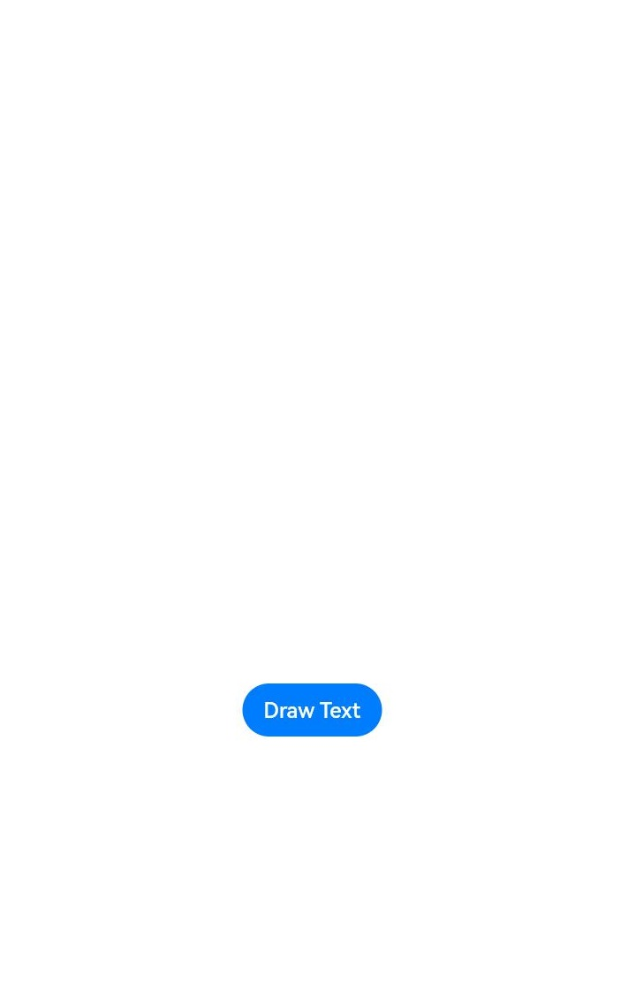
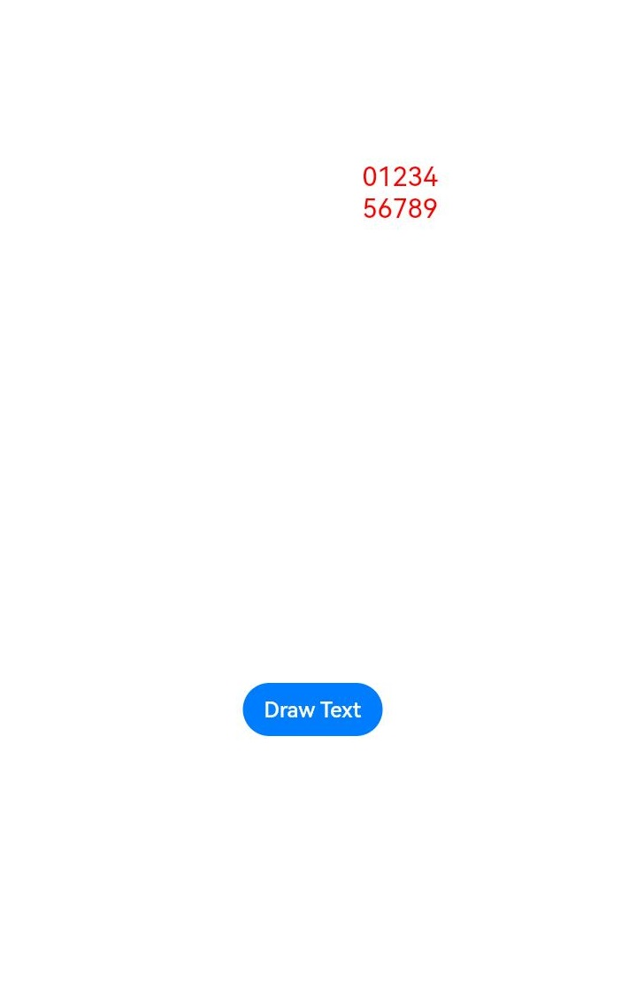
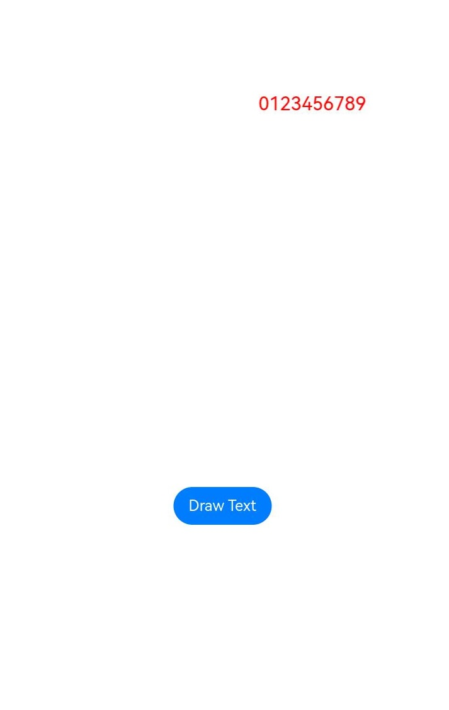

# Using the Text Module for Text Display

## When to Use

The @ohos.graphics.text module provides APIs for creating complex text paragraphs, with various text styles, paragraph styles, and line break rules, and converting the information into layout data that can be efficiently rendered on the screen.

## Available APIs

The table below lists the common APIs provided by the @ohos.graphics.text module. For details about all the APIs, see [@ohos.graphics.text](../reference/apis-arkgraphics2d/js-apis-graphics-text.md).

| API| Description|
| -------- | -------- |
| pushStyle(textStyle: TextStyle): void | Pushes a text style.|
| addText(text: string): void | Inserts a text string into the paragraph being built.|
| addPlaceholder(placeholderSpan: PlaceholderSpan): void | Inserts a placeholder into the paragraph being built.|
| build(): Paragraph | Creates a paragraph object that can be used for subsequent typography and rendering.|
| paint(canvas: drawing.Canvas, x: number, y: number): void | Paints the text on the canvas with the coordinate point (x, y) as the upper left corner.|

## How to Develop

When using the text engine to draw and display the text, you need to use the font manager, paragraph style, and paragraph builder of the @ohos.graphics.text module to create a text paragraph and display the text on the application.

The following walks you through on how to draw and display a paragraph.
### Adding Dependencies

**Importing Dependency Files**
```js
import { NodeController, FrameNode, RenderNode, DrawContext } from '@kit.ArkUI'
import { UIContext } from '@kit.ArkUI'
import { drawing } from '@kit.ArkGraphics2D'
import { text } from '@kit.ArkGraphics2D'
import { image } from '@kit.ImageKit'
import { common2D } from '@kit.ArkGraphics2D'
```

Now you can use the APIs for text drawing.

### Text Drawing

The following steps describe how to create a paragraph object and display the paragraph text using the APIs of the @ohos.graphics.text module.

1. **Create a child class of RenderNode.**

    Create the child class **MyRenderNode** and define drawing functions in it. Steps 2 and 3 describe the implementation of the draw functions. **RenderNode** contains operations on the tree structure and drawing attributes.

    ```js
    // Create a MyRenderNode class and draw the text.
    class MyRenderNode extends RenderNode {

        async draw(context: DrawContext) {
            // ...
        }
    }
    ```

2. **Create a canvas and set the pen and brush styles.** 

    Use **Pen** to create a pen object, and set the attributes such as anti-aliasing, color, and thickness. The pen is used to outline a shape.

    Use **Brush** to create a brush object, and set the brush color. The brush is used to fill in a shape.

    Use **attachPen** and **attachBrush** in **canvas** to attach the pen and brush to the canvas.

    ```js
    // Create a canvas object.
    const canvas = context.canvas
    // Create a pen object and set the anti-aliasing, color, and thickness attributes.
    let pen = new drawing.Pen()
    let pen_color : common2D.Color = { alpha: 0xFF, red: 0xFF, green: 0x00, blue: 0x00 }
    pen.setColor(pen_color)

    // Attach the pen to the canvas.
    canvas.attachPen(pen)

    // Create a brush object and set the color.
    let brush = new drawing.Brush()
    let brush_color : common2D.Color = { alpha: 0xFF, red: 0x00, green: 0xFF, blue: 0x00 }
    brush.setColor(brush_color)

    // Attach the brush to the canvas.
    canvas.attachBrush(brush)
    ```

3. **Draw the text.**

    Use **TextStyle** to create a text style object named **myTextStyle**, and set the text color. Use **ParagraphStyle** to create a paragraph style object named **myParagraphStyle**, and set attributes such as the text style. Use **FontCollection** to create a font manager named **fontCollection**. Use **ParagraphBuilder** to create a paragraph builder named **ParagraphGraphBuilder**, with **myParagraphStyle** and **fontCollection** as input parameters. Call the APIs to push the text style and add the text. Call **build()** to generate a paragraph object named **paragraph**, and call **paint** to paint the paragraph on the screen.

    ```js
    // Set attributes such as the font color, weight, and size.
    let myTextStyle: text.TextStyle = {
        color: { alpha: 255, red: 255, green: 0, blue: 0 },
    };
    // Set the word break type, text break strategy, text direction, and alignment mode.
    let myParagraphStyle: text.ParagraphStyle = {
        textStyle: myTextStyle,
        align: 3,
        // Word break type: wordBreak:text.WordBreak.NORMAL
    };
    let fontCollection = new text.FontCollection();
    let ParagraphGraphBuilder = new text.ParagraphBuilder(myParagraphStyle, fontCollection);
    // Push the text style.
    ParagraphGraphBuilder.pushStyle(myTextStyle);
    // Add the text.
    ParagraphGraphBuilder.addText("0123456789");
    // Build a paragraph.
    let paragraph = ParagraphGraphBuilder.build();
    // Layout
    paragraph.layoutSync(600);
    // Draw the text.
    paragraph.paint(canvas, 0, 0);
    ```

4. **Create a MyRenderNode object.**

    Steps 1 to 3 build the **MyRenderNode** class and define the main drawing functions in it. Next, create a **MyRenderNode** object and set its pixel format.

    ```js
    // Create a MyRenderNode object.
    const textNode = new MyRenderNode()
    // Define the pixel format of MyRenderNode.
    textNode.frame = { x: 100, y: 100, width: 200, height: 800 }
    textNode.pivot = { x: 0.2, y: 0.8 }
    textNode.scale = { x: 1, y: 1 }
    ```

5. **Create a child class of NodeController.**

    Create the child class **MyNodeController**, and define the functions for creating FrameNode in it. **NodeController** defines the controller of a node container and controls the nodes in the lifecycle of the container. FrameNode defines the basic type of a node and contains a RenderNode.

    ```js
    class MyNodeController extends NodeController {
        private rootNode: FrameNode | null = null;
    
        makeNode(uiContext: UIContext): FrameNode {
            this.rootNode = new FrameNode(uiContext)
            if (this.rootNode == null) {
                return this.rootNode
            }
            const renderNode = this.rootNode.getRenderNode()
            if (renderNode != null) {
                renderNode.frame = { x: 0, y: 0, width: 10, height: 500 }
                renderNode.pivot = { x: 50, y: 50 }
            }
            return this.rootNode
        }
    }
    ```

6. **Define an interface for adding a node.**

    Define an interface for adding a RenderNode in the **MyNodeController** class created in step 5.

    ```js
    addNode(node: RenderNode): void {
        if (this.rootNode == null) {
            return
        }
        const renderNode = this.rootNode.getRenderNode()
        if (renderNode != null) {
            renderNode.appendChild(node)
        }
    }
    ```

7. **Define an interface for deleting a node.**

    Define an interface for deleting a RenderNode in the **MyNodeController** class created in step 5.

    ```js
    clearNodes(): void {
        if (this.rootNode == null) {
            return
        }
        const renderNode = this.rootNode.getRenderNode()
        if (renderNode != null) {
            renderNode.clearChildren()
        }
    }
    ```

8. **Draw the graphics and text blob.**

    Create a **MyNodeController** instance and save it to the NodeContainer, add a **Button** component, and call the defined interfaces.

    ```js
    @Entry
    @Component
    struct RenderTest {
        private myNodeController: MyNodeController = new MyNodeController()
        build() {
            Column() {
                Row() {
                    NodeContainer(this.myNodeController)
                        .height('100%')
                    Button("Draw Text")
                        .margin({ bottom: 200, right: 12 })
                        .onClick(() => {
                            this.myNodeController.clearNodes()
                            this.myNodeController.addNode(textNode)
                        })
                }
                .width('100%')
                .justifyContent(FlexAlign.Center)
                .shadow(ShadowStyle.OUTER_DEFAULT_SM)
                .alignItems(VerticalAlign.Bottom)
                .layoutWeight(1)
            }
        }
    }
    ```

    The following figure shows the drawing and display effect.

    | Home page                                | Drawn text (WordBreak not set)                 | Drawn text (WordBreak set)              |
    | ------------------------------------ | ---------------------------------------- | ------------------------------------ |
    |  |     |  |
