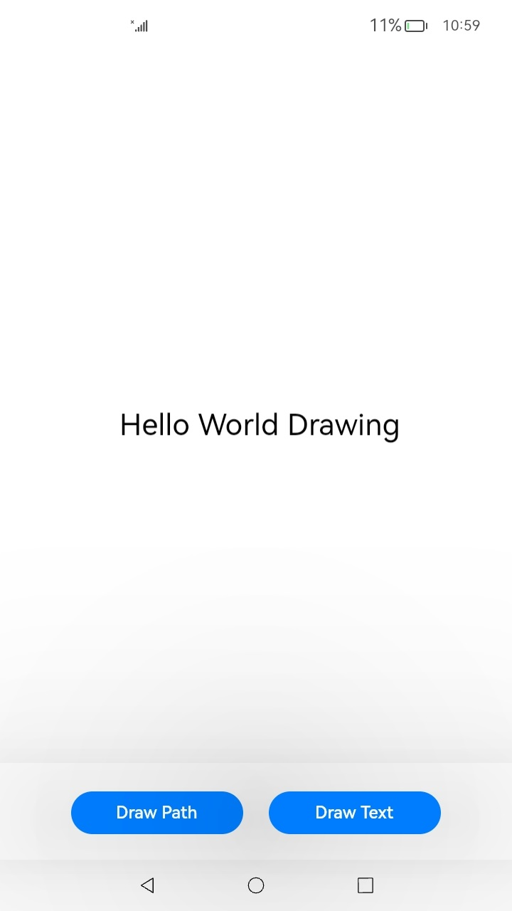

# Introduction to Text Development

<!--Kit: ArkGraphics 2D-->
<!--Subsystem: Graphics-->
<!--Owner: @gmiao522-->
<!--Designer: @liumingxiang-->
<!--Tester: @yhl0101-->
<!--Adviser: @ge-yafang-->
<!-- md-trans-meta sourceCommit=bf8f4e66ff4670425bebf86f62c06d3a07dae9d4 translatedAt=2026-08-03T11:23:37.626Z pushedAt=2026-08-04T07:49:04.352Z -->

During application development and layout, you need to typeset, measure, draw, and display text elements and content. The font engine framework provides a series of APIs for text layout and font management.

## Capabilities

**Figure 1** Font engine capabilities

The font engine framework supports shaping, typography, measurement, drawing, and display of text elements such as text, emoji, and placeholder in applications.

You can implement font engine capabilities either in ArkTS or C/C++.

The text-related capabilities are described as follows:

- **Font management**: registers and uses various font resources to draw and display texts, including theme fonts, custom fonts, and system fonts.

- **Font style**: sets the text styles prior to typography for a better display effect. It allows you to set the paragraph style, such as line breaks, text alignment, and line height, and to set the text style, like color, size, thickness, and decoration.

- **Typography**: shapes, arranges, and layouts the text based on the text styles and content.

- **Text measurement**: accurately measures the text for a proper layout. It supports the measurement of various complex text styles. You can obtain the metrics of the text, such as the length, height, and number of lines of a text paragraph, whether the text is truncated, and the height, width, and number of characters in each line of text.

- **Text drawing**: draws text based on the specified start coordinates or path, and supports underlines, overlines, and strikethroughs.

## Workflow

The following figure shows the workflow of text drawing and measurement. Use the corresponding capability APIs on the ArkTS and Native sides.

**Figure 2** Workflow of text measurement and drawing

