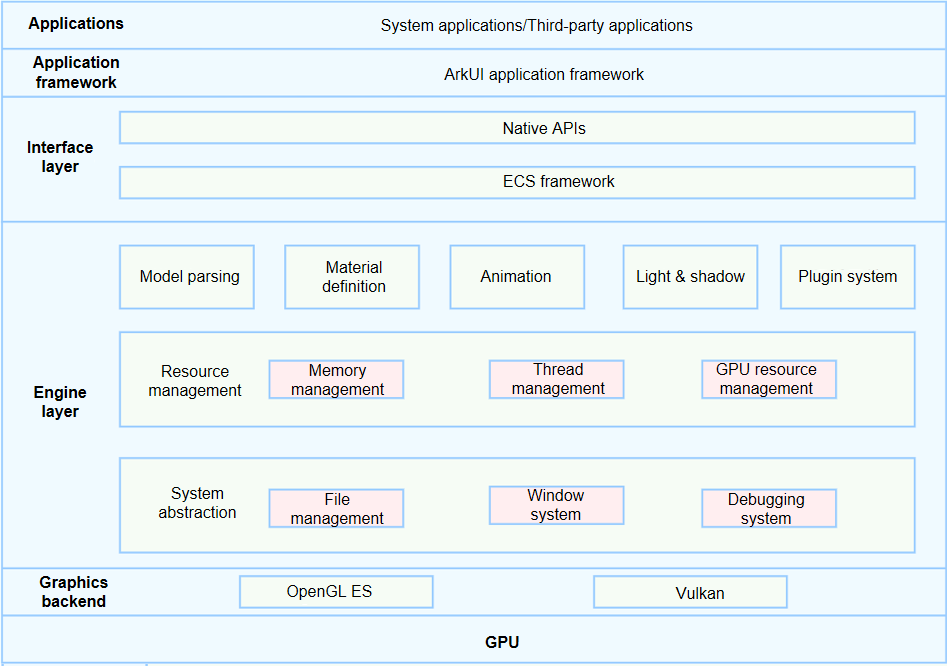

# Introduction to ArkGraphics 3D

ArkGraphics 3D provides basic 3D scene rendering capabilities based on the lightweight 3D engine and render pipelines. With this service, you can efficiently build and render a 3D scene.

## Function Description

- Loads and parses a glTF model. You can place a glTF model file in an application sandbox and use the asynchronous APIs provided by ArkGraphics 3D to load the model and render the scene. For details, see [Scene](../reference/apis-arkgraphics3d/js-apis-inner-scene.md). For details about glTF, see [glTF-Specification](https://registry.khronos.org/glTF/specs/2.0/glTF-2.0.html).
- Provides APIs for customizing light nodes, camera nodes, and common nodes. You can customize scene lights and rendering angles. In additions, users can dynamically adjust the scene tree structure and node attributes to adjust a 3D scene. For details, see [Scene](../reference/apis-arkgraphics3d/js-apis-inner-scene.md) and [SceneNode](../reference/apis-arkgraphics3d/js-apis-inner-scene-nodes.md).
- Provides APIs for creating images, materials, environments, and shaders used in a 3D scene. You can also customize a shader to carry out custom 3D material rendering. For details, see [Scene](../reference/apis-arkgraphics3d/js-apis-inner-scene.md) and [SceneResource](../reference/apis-arkgraphics3d/js-apis-inner-scene-resources.md).
- Provides APIs for controlling the animation status in a 3D scene, such as starting, pausing, and finishing an animation, and playing an animation from a specified position. Callback functions are also provided so that you can perform logic control when an animation starts or ends. For details, see [SceneResource](../reference/apis-arkgraphics3d/js-apis-inner-scene-resources.md).
- Provides APIs for you to carry out post-processing, for example, tone mapping. For details, see [ScenePostProcessSettings](../reference/apis-arkgraphics3d/js-apis-inner-scene-post-process-settings.md).

To sum up, ArkGraphics 3D provides basic 3D scene rendering capabilities to help you carry out 3D scene rendering and logic control development.

For details about the API usage and parameters, see [@ohos.graphics.scene (ArkGraphics 3D)](../reference/apis-arkgraphics3d/js-apis-scene.md).

## Working Principles

The ArkGraphics 3D service consists of three key parts: graphics backend, engine layer, and interface layer.
- Graphics backend: driver interfaces provided by GPU hardware, including OpenGL ES and Vulkan. The engine layer calls these interfaces by delivering GPU instructions to implement scene rendering.
- Engine layer: provides the rendering capability based on the rendering engine component of the Ark Graphics Platform (AGP), which features ease of use, high image quality, and scalability. The engine uses the Entity Component System (ECS) architecture design and modular encapsulation (such as material definition and post-processing), providing a development suite that is easy to use.
- Interface layer: processes data based on the ECS framework through the NAPI layer, and exposes 3D rendering interfaces.

## Constraints

To use the ArkGraphics 3D service, the device must support the GPU driver of OpenGL ES 3.2 or later or Vulkan 1.0 or later.
