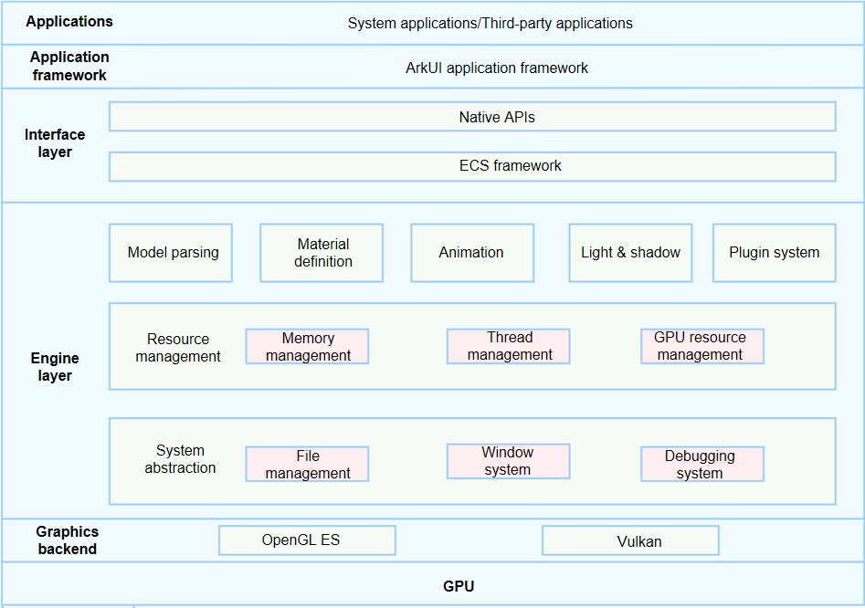

# About This Kit

<!--Kit: ArkGraphics 3D-->
<!--Subsystem: Graphics-->
<!--Owner: @zzhao0-->
<!--Designer: @zdustc-->
<!--Tester: @zhangyue283-->
<!--Adviser: @ge-yafang-->
<!-- md-trans-meta sourceCommit=f8a1f952a2d2677a0016bee0f6737abed3cf3e32 translatedAt=2026-08-04T08:00:22.454Z pushedAt=2026-08-04T08:06:14.235Z -->

ArkGraphics 3D provides basic 3D scene rendering capabilities based on the lightweight 3D engine and render pipelines. With this service, you can efficiently build and render a 3D scene.

ArkGraphics 3D takes the custom scene mode as its core capability, allowing you to independently construct and manage nodes such as Scene, Camera, and Light, thereby achieving full control over the rendering effects and interactive behaviors of the 3D scene. Meanwhile, to facilitate the quick preview and display of models, it also provides an automatic scene mode, which allows you to directly load glTF models (.gltf and .glb files), with the framework automatically creating basic cameras, light sources, and interactive controls.

## Function Description

- Provides APIs for loading and parsing standard [glTF](https://registry.khronos.org/glTF/specs/2.0/glTF-2.0.html) (GL Transmission Format) models (both .gltf and .glb files). It also supports [MeshOpt](https://github.com/KhronosGroup/glTF/blob/main/extensions/2.0/Vendor/EXT_meshopt_compression/README.md) compression, allowing you to import glTF models with the **EXT_meshopt_compression** extension. You can place a glTF model file in the app file sandbox and use the asynchronous APIs provided by ArkGraphics 3D to load and render the model. For details, see [Scene](../reference/apis-arkgraphics3d/js-apis-inner-scene.md).

- Provides APIs for customizing light nodes, camera nodes, and common nodes. You can customize scene lights and rendering angles. In addition, users can dynamically adjust the scene tree structure and node properties to adjust a 3D scene. For details, see [Scene](../reference/apis-arkgraphics3d/js-apis-inner-scene.md) and [SceneNode](../reference/apis-arkgraphics3d/js-apis-inner-scene-nodes.md).

- Provides APIs for creating images, materials, environments, and shaders used in a 3D scene. You can also customize a shader to carry out custom 3D material rendering. For details, see [Scene](../reference/apis-arkgraphics3d/js-apis-inner-scene.md) and [SceneResources](../reference/apis-arkgraphics3d/js-apis-inner-scene-resources.md).

- Provides APIs for controlling the animation status in a 3D scene, such as starting, pausing, and finishing an animation, and playing an animation from a specified position. Callback functions are also provided so that you can perform logic control when an animation starts or ends. For details, see [SceneResources](../reference/apis-arkgraphics3d/js-apis-inner-scene-resources.md).

- Provides APIs for you to carry out post-processing, for example, tone mapping. For details, see [ScenePostProcessSettings](../reference/apis-arkgraphics3d/js-apis-inner-scene-post-process-settings.md).

To sum up, ArkGraphics 3D provides 3D scene rendering capabilities centered on custom scene nodes, while offering a convenient entry for the quick display of models through the automatic scene mode. This satisfies diverse development requirements ranging from simple preview to complex rendering control.

For details about the API usage and parameters, see [@ohos.graphics.scene (ArkGraphics 3D)](../reference/apis-arkgraphics3d/js-apis-scene.md).

## Working Principles

The ArkGraphics 3D service consists of three key parts: graphics backend, engine layer, and interface layer.

- Graphics backend: driver interfaces provided by GPU hardware, including OpenGL ES and Vulkan. The engine layer calls these interfaces by delivering GPU instructions to implement scene rendering.

- Engine layer: provides the rendering capability based on the rendering engine component of the Ark Graphics Platform (AGP), which features ease of use, high image quality, and scalability. The engine uses the Entity Component System (ECS) architecture design and modular encapsulation (such as material definition and post-processing), providing a development suite that is easy to use.

- Interface layer: processes data based on the ECS framework through the NAPI layer, and exposes 3D rendering interfaces.

## Constraints

To use the ArkGraphics 3D service, the device must support the GPU driver of OpenGL ES 3.2 or later or Vulkan 1.0 or later.

<!--RP1-->
<!--RP1End-->