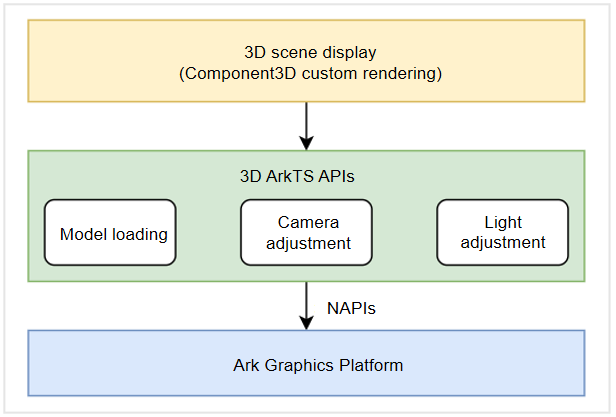

# Building and Managing ArkGraphics 3D Scenes

A 3D scene consists of three essential parts: light, camera, and model.
- Light provides illumination for a 3D scene so that the models in the 3D scene become visible. Without light, the rendering result is all black.
- The camera acts as a viewer of the 3D scene. In essence, 3D rendering is to observe a 3D scene from a perspective and project it to a 2D image. Without a camera, no rendering result is obtained.
- A model in a 3D scene is used to describe a shape, structure, and appearance of an object, and generally has attributes such as meshes, materials, textures, and animations. Popular 3D model formats are OBJ, FBX, and glTF.

After a model is loaded, it can be rendered using the ArkUI component [Component3D](../reference/apis-arkui/arkui-ts/ts-basic-components-component3d.md). You can also call ArkTS APIs to modify the camera and light settings, which will help you achieve the desired perspective and lighting conditions. The ArkTS APIs can use NAPIs to call the capabilities implemented by C++ APIs in AGP.



## Model Loading and Display
Models come in a multitude of formats, but currently, ArkGraphics 3D supports only the loading of glTF models. glTF represents 3D scenes, just like the PNG format that represents a type of image. For details about glTF, see [glTF-2.0](https://registry.khronos.org/glTF/specs/2.0/glTF-2.0.html).

A glTF model can contain key elements of a 3D scene, including the light, camera, and model. If a glTF model contains a camera, you can use the APIs provided by ArkGraphics 3D to load the glTF model to render the 3D scene in the camera view. If the model does not contain a camera, you can use the ArkGraphics 3D APIs to create a camera for rendering. Due to the large size, a 3D model is usually loaded in asynchronous mode. After a model is loaded, a scene object is returned, based on which you can edit the 3D scene.

You can call the [load](../reference/apis-arkgraphics3d/js-apis-inner-scene.md#load) API provided by **Scene** to load a glTF model. The sample code is as follows:
```ts
import { Image, Shader, MaterialType, Material, ShaderMaterial, Animation, Environment, Container, SceneNodeParameters,
  LightType, Light, Camera, SceneResourceParameters, SceneResourceFactory, Scene, Node } from '@kit.ArkGraphics3D';

function loadModel() : void {
  // Load the model.
  let scene: Promise<Scene> = Scene.load($rawfile("gltf/DamagedHelmet/glTF/DamagedHelmet.gltf"));
  scene.then(async (result: Scene) => {});
}
```

Once the model is loaded, you can use the **SceneResourceFactory** instance to create a camera and light source, and modify the camera and light settings to adjust the viewing angle and illumination effect. Finally, you can pass the **Scene** instance and **ModelType** as **SceneOptions** to the **Component3D** component to display them on the screen.

The sample code for displaying a model is as follows:
```ts
import { Image, Shader, MaterialType, Material, ShaderMaterial, Animation, Environment, Container, SceneNodeParameters,
  LightType, Light, Camera, SceneResourceParameters, SceneResourceFactory, Scene, Node } from '@kit.ArkGraphics3D';

@Entry
@Component
struct Model {
  scene: Scene | null = null;
  @State sceneOpt: SceneOptions | null = null;
  cam: Camera | null = null;

  onPageShow(): void {
    this.Init();
  }

  Init(): void {
    if (this.scene == null) {
      // Load the model and place the gltf file in the related path. Use the actual path during loading.
      Scene.load($rawfile('gltf/DamagedHelmet/glTF/DamagedHelmet.gltf'))
      .then(async (result: Scene) => {
        this.scene = result;
        let rf:SceneResourceFactory = this.scene.getResourceFactory();
        // Create a camera.
        this.cam = await rf.createCamera({ "name": "Camera" });
        // Set proper camera parameters.
        this.cam.enabled = true;
        this.cam.position.z = 5;
        this.sceneOpt = { scene: this.scene, modelType: ModelType.SURFACE } as SceneOptions;
      })
      .catch((reason: string) => {
        console.log(reason);
      });
    }
  }

  build() {
    Row() {
      Column() {
        if (this.sceneOpt) {
          // Use Component3D to display the 3D scenario.
          Component3D(this.sceneOpt)
        } else {
          Text("loading ...")
        }
      }.width('100%')
    }.height('60%')
  }
}
```

## Creating and Managing a Camera

As an important part of a 3D scene, a camera determines the projection process from the 3D scene to a 2D image. Key camera parameters, such as the near plane, far plane, and FoV, also pose an important impact on 3D rendering. You can set these camera parameters to control the rendering process, thereby achieving the desired rendering effect.

The sample code for camera-related control is as follows:
```ts
import { Image, Shader, MaterialType, Material, ShaderMaterial, Animation, Environment, Container, SceneNodeParameters,
  LightType, Light, Camera, SceneResourceParameters, SceneResourceFactory, Scene, Node } from '@kit.ArkGraphics3D';

function createCameraPromise() : Promise<Camera> {
  return new Promise(() => {
    let scene: Promise<Scene> = Scene.load($rawfile("gltf/CubeWithFloor/glTF/AnimatedCube.gltf"));
    scene.then(async (result: Scene) => {
      let sceneFactory: SceneResourceFactory = result.getResourceFactory();
      let sceneCameraParameter: SceneNodeParameters = { name: "camera1" };
      // Create a camera.
      let camera: Promise<Camera> = sceneFactory.createCamera(sceneCameraParameter);
      camera.then(async (cameraEntity: Camera) => {
        // Enable the camera node.
        cameraEntity.enabled = true;

        // Set the camera position.
        cameraEntity.position.z = 5;

        // Set the FoV.
        cameraEntity.fov = 60 * Math.PI / 180;

        // Set other camera parameters.
        // ...
      });
      return camera;
    });
  });
}
```


## Creating and Managing Light

Light in a 3D scene is a data model that simulates the impact of the light in the physical world on an object in the 3D scene.

There are many types of lights, for example, directional light and spot light. Directional light, similar to the sunlight, emits parallel light rays with uniform intensity. Spot light is like a flashlight that produces cone-shaped light, which attenuates with distance. The light color also affects the color of the object in the scene. The interaction between the light color and the object color should be consistent with that in the physical world. ArkGraphics 3D provides APIs for creating light and modifying light parameters. You can adjust the 3D scene by setting light attributes to obtain the expected rendering effect.

The sample code for controlling light is as follows:
```ts
import { Image, Shader, MaterialType, Material, ShaderMaterial, Animation, Environment, Container, SceneNodeParameters,
  LightType, Light, Camera, SceneResourceParameters, SceneResourceFactory, Scene, Node } from '@kit.ArkGraphics3D';

function createLightPromise() : Promise<Light> {
  return new Promise(() => {
    let scene: Promise<Scene> = Scene.load($rawfile("gltf/CubeWithFloor/glTF/AnimatedCube.gltf"));
    scene.then(async (result: Scene) => {
      let sceneFactory: SceneResourceFactory = result.getResourceFactory();
      let sceneLightParameter: SceneNodeParameters = { name: "light" };
      // Create directional light.
      let light: Promise<Light> = sceneFactory.createLight(sceneLightParameter, LightType.DIRECTIONAL);
      light.then(async (lightEntity: Light) => {
        // Set the color of the directional light.
        lightEntity.color = { r: 0.8, g: 0.1, b: 0.2, a: 1.0 };

        // Set other light parameters.
        // ...
      });
      return light;
    });
  });
}
```
