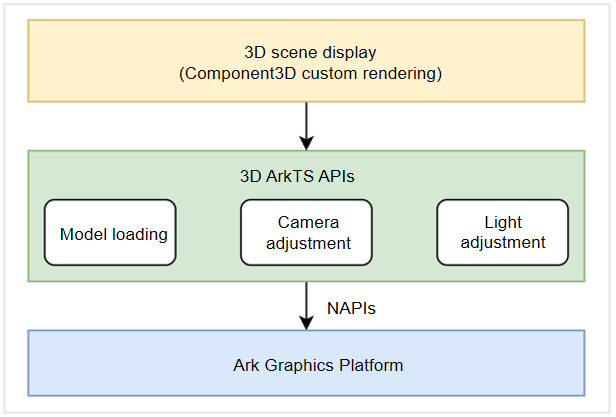

# Building and Managing ArkGraphics 3D Scenes

<!--Kit: ArkGraphics 3D-->
<!--Subsystem: Graphics-->
<!--Owner: @zzhao0-->
<!--Designer: @zdustc-->
<!--Tester: @zhangyue283-->
<!--Adviser: @ge-yafang-->
<!-- md-trans-meta sourceCommit=6d1ae9d89bb67c5cd52bcfa31ee99566b7e7d30f translatedAt=2026-08-04T08:00:08.388Z pushedAt=2026-08-04T08:16:47.259Z -->

A 3D scene consists of three essential parts: light, camera, and model.

- Light provides illumination for a 3D scene so that the models in the 3D scene become visible. Without light, the rendering result is all black.

- The camera acts as a viewer of the 3D scene. In essence, 3D rendering is to observe a 3D scene from a perspective and project it to a 2D image. Without a camera, no rendering result is obtained.

- A model in a 3D scene is used to describe a shape, structure, and appearance of an object, and generally has attributes such as meshes, materials, textures, and animations. Popular 3D model formats are OBJ, FBX, and glTF.

After a model is loaded, it can be presented to users through the [Component3D](../reference/apis-arkui/arkui-ts/ts-basic-components-component3d.md) rendering component of ArkUI. Component3D is responsible for rendering the ArkGraphics 3D scene onto the interface. In the custom scene mode, you can use ArkTS APIs to create and manage camera and light source nodes, thereby setting appropriate viewing angles and lighting effects. In the automatic scene mode, the framework will automatically create basic cameras and lighting based on the model. The ArkTS APIs can use NAPIs to call the capabilities implemented by C++ APIs in AGP.



## Model Loading and Display

Models come in a multitude of formats, but currently, ArkGraphics 3D supports only the loading of glTF models. glTF represents 3D scenes. For details about glTF, see [glTF-2.0](https://registry.khronos.org/glTF/specs/2.0/glTF-2.0.html).

A glTF model can contain key elements of a 3D scene, including the light, camera, and model. If a glTF model contains a camera, you can use the APIs provided by ArkGraphics 3D to load the glTF model to render the 3D scene in the camera view. If the model does not contain a camera, you can use the ArkGraphics 3D APIs to create a camera for rendering. Due to the large size, a 3D model is usually loaded in asynchronous mode. After a model is loaded, a scene object is returned, based on which you can edit the 3D scene.

The texture images referenced in a glTF model support the following formats:

| Format | Support Status |
|------|----------|
| JPEG (.jpg/.jpeg) | Supports JPEG files with JFIF, Exif, and ICC Profile markers in the header.<br>On devices running OpenHarmony 7.0.0 or later, JPEG files with DQT, XMP, MPF, and Adobe markers in the header are also supported. |
| PNG (.png) | Supports standard PNG files. |

1. Import the required modules.

   Import the core types provided by ArkGraphics 3D in the page script to create and manage 3D scenes and cameras.

   <!-- @[model_header](https://gitcode.com/openharmony/applications_app_samples/blob/master/code/DocsSample/ArkGraphics3D/entry/src/main/ets/scene/init.ets) -->

   ``` TypeScript
   import { Camera, Scene, SceneResourceFactory } from '@kit.ArkGraphics3D';
   ```

2. Load scene resources.

   ArkGraphics 3D provides **Scene.load()** to load glTF model files. Upon successful model loading, a scene instance is returned, allowing for the creation of components like cameras and lighting. The API supports model files in .gltf and .glb formats, with .glb being a binary format that is content-equivalent to .gltf but more efficient for loading and usage. It provides two methods for loading models: relative path loading using $rawfile() to read built-in resource files from the **resources/rawfile/** directory of the application, and absolute path loading from the application sandbox directory. The API supports only accessing sandbox files created or written by the application itself. For specific examples, see [load()](../reference/apis-arkgraphics3d/js-apis-inner-scene.md#load).

   The following example demonstrates loading a .glb model using a relative path:

   <!-- @[model_load](https://gitcode.com/openharmony/applications_app_samples/blob/master/code/DocsSample/ArkGraphics3D/entry/src/main/ets/scene/init.ets) -->

   ``` TypeScript
   if (this.scene == null) {
     // Load the model and place the gltf file in the related path. Use the actual path during loading.
     // Switched from .gltf to .glb; same content, different format
     Scene.load($rawfile('gltf/DamagedHelmet/glTF/DamagedHelmet.glb'))
       .then(async (result: Scene) => {
         this.scene = result;
         let rf: SceneResourceFactory = this.scene.getResourceFactory();
         // ...
       })
       .catch((error: string) => {
       console.error('Scene load failed: ' + error);
     });
   }
   ```

3. Create a camera and configure scene rendering parameters.

   Call **SceneResourceFactory.createCamera()** to create a camera, and set its enabled state and viewing position. You can control the viewing distance by adjusting the z-axis position of the camera. Then, wrap the loaded scene into a SceneOptions object and specify the rendering type as **ModelType.SURFACE** to render the scene content via Component3D.

   <!-- @[camera_scene_params](https://gitcode.com/openharmony/applications_app_samples/blob/master/code/DocsSample/ArkGraphics3D/entry/src/main/ets/scene/init.ets) -->

   ``` TypeScript
   // Create a Camera.
   this.cam = await rf.createCamera({ 'name': 'Camera' });
   // Set proper camera parameters.
   this.cam.enabled = true;
   this.cam.position.z = 5;
   
   this.sceneOpt = { scene: this.scene, modelType: ModelType.SURFACE } as SceneOptions;
   ```

4. Render the 3D model.

   Use Component3D to render the loaded 3D scene. If the model is not fully loaded, a prompt message is displayed. Component3D handles the rendering automatically based on the provided SceneOptions object.

   <!-- @[render_model](https://gitcode.com/openharmony/applications_app_samples/blob/master/code/DocsSample/ArkGraphics3D/entry/src/main/ets/scene/init.ets) -->

   ``` TypeScript
   if (this.sceneOpt) {
     // Use Component3D to display the 3D scenario.
     Component3D(this.sceneOpt);
   } else {
     Text('Loading···');
   }
   ```

## Creating and Managing a Camera

As an important part of a 3D scene, a camera determines the projection process from the 3D scene to a 2D image. Key camera parameters, such as the near plane, far plane, and field of view (FoV), also pose an important impact on 3D rendering. You can set these camera parameters to control the rendering process, thereby achieving the desired rendering effect.

ArkGraphics 3D provides flexible camera APIs, which allow you to dynamically create, configure, and control cameras as required.

1. Import the required modules.

   Import the core types provided by ArkGraphics 3D in the page script to load scenes, create cameras, and manage resources.

   <!-- @[cam_header](https://gitcode.com/openharmony/applications_app_samples/blob/master/code/DocsSample/ArkGraphics3D/entry/src/main/ets/scene/camera.ets) -->

   ``` TypeScript
   import { Camera, Scene, SceneNodeParameters, SceneResourceFactory } from '@kit.ArkGraphics3D';
   ```

2. Load scene resources.

   Use **Scene.load()** to load the .glb model file from the **resources/rawfile/** directory of the application. .glb is a binary format that is content-equivalent to .gltf but more efficient for loading and usage. Upon successful model loading, a scene object is returned, from which you can obtain a SceneResourceFactory for subsequent camera creation.

   <!-- @[cam_load_and_factory](https://gitcode.com/openharmony/applications_app_samples/blob/master/code/DocsSample/ArkGraphics3D/entry/src/main/ets/scene/camera.ets) -->

   ``` TypeScript
   let scene: Promise<Scene> = Scene.load($rawfile('gltf/CubeWithFloor/glTF/AnimatedCube.glb'));
   scene.then(async (result: Scene) => {
     // ...
     let sceneFactory: SceneResourceFactory = result.getResourceFactory();
     let sceneCameraParameter: SceneNodeParameters = { name: 'camera' };
     // ...
   }).catch((error: string) => {
     console.error('Scene load failed: ' + error);
     reject(error);
   });
   ```

3. Create a camera and configure camera parameters.

   Call **SceneResourceFactory.createCamera()** to create a camera, and configure its enabled state, position, FoV, and other parameters. The camera position affects the viewing distance of the scene, whereas the FoV determines the range of the scene visible in the view.

   <!-- @[cam_create_and_config](https://gitcode.com/openharmony/applications_app_samples/blob/master/code/DocsSample/ArkGraphics3D/entry/src/main/ets/scene/camera.ets) -->

   ``` TypeScript
   let camera: Promise<Camera> = sceneFactory.createCamera(sceneCameraParameter);
   camera.then(async (cameraEntity: Camera) => {
     // Enable the camera node.
     cameraEntity.enabled = true;
   
     // Set the camera position.
     cameraEntity.position.z = 5;
   
     // Set the FoV.
     cameraEntity.fov = 60 * Math.PI / 180;
   
     // Set other camera parameters.
     // ...
     // ...
   }).catch((error: string) => {
     console.error('Camera create failed: ' + error + '.');
     // ...
   });
   ```

4. Initialize the camera and bind it with the scene.

   After completing the camera initialization, bind the loaded scene and camera together and configure the scene rendering parameters. By constructing a SceneOptions object, you can hand over the scene to Component3D for rendering and display. For specific rendering methods, refer to the model loading example.

   <!-- @[cam_init_bind](https://gitcode.com/openharmony/applications_app_samples/blob/master/code/DocsSample/ArkGraphics3D/entry/src/main/ets/scene/camera.ets) --> 

   ``` TypeScript
   this.camera = await createCameraPromise();
   if (globalScene && this.camera) {
     this.scene = globalScene;
     this.positionX = this.camera.position.x;
     this.positionY = this.camera.position.y;
     this.positionZ = this.camera.position.z;
     this.sceneOpt = { scene: this.scene, modelType: ModelType.SURFACE } as SceneOptions;
   }
   ```

5. Interact with the camera.

   You can achieve interactive view control by setting the camera's position, rotation, scale, FoV, and other parameters. The following uses Z-axis control as an example, with similar logic for the X and Y axes.

   <!-- @[cam_ui_sliders](https://gitcode.com/openharmony/applications_app_samples/blob/master/code/DocsSample/ArkGraphics3D/entry/src/main/ets/scene/camera.ets) -->

   ``` TypeScript
   Slider({
     value: this.positionZ,
     min: 5,
     max: 10,
     step: 0.1,
     style: SliderStyle.OutSet
   })
     .showTips(false)
     .onChange((value: number, mode: SliderChangeMode) => {
       this.positionZ = value;
       if (mode === SliderChangeMode.End) {
         if (!this.scene || !this.camera) {
           return;
         }
         this.camera.position.z = value;
       }
     })
     .width('100%')
   ```

## Creating and Managing Light

Light in a 3D scene is a data model that simulates the impact of the light in the physical world on an object in the 3D scene.

There are many types of lights, for example, directional light and spotlight. Directional light, similar to sunlight, emits parallel light rays with uniform intensity. Spotlight is like a flashlight that produces cone-shaped light, which attenuates with distance. The color of the light impacts how objects are shaded in the scene. When rendering, the system calculates the interaction between the light and the object's surface color based on physical principles, resulting in a more realistic lighting effect.

ArkGraphics 3D provides APIs for creating light and modifying light parameters. You can adjust the 3D scene by setting light properties to obtain the expected rendering effect.

1. Import the required modules.

   Import the core types provided by ArkGraphics 3D in the page script to load scenes and create cameras and lights.

   <!-- @[light_header](https://gitcode.com/openharmony/applications_app_samples/blob/master/code/DocsSample/ArkGraphics3D/entry/src/main/ets/scene/light.ets) -->

   ``` TypeScript
   import { Camera, Light, LightType, Scene, SceneNodeParameters, SceneResourceFactory } from '@kit.ArkGraphics3D';
   ```

2. Load scene resources.

   Use **Scene.load()** to load the .glb model file from the **resources/rawfile/** directory of the application. .glb is a binary format that is content-equivalent to .gltf but more efficient for loading and usage. Upon successful model loading, a scene object is returned, from which you can obtain a SceneResourceFactory for subsequent light creation.

   <!-- @[light_load_and_factory](https://gitcode.com/openharmony/applications_app_samples/blob/master/code/DocsSample/ArkGraphics3D/entry/src/main/ets/scene/light.ets) -->

   ``` TypeScript
   let scene: Promise<Scene> = Scene.load($rawfile('gltf/CubeWithFloor/glTF/AnimatedCube.glb'));
   scene.then(async (result: Scene) => {
     // ...
     let sceneFactory: SceneResourceFactory = result.getResourceFactory();
     let lightParameter: SceneNodeParameters = { name: 'light' };
     // ...
   }).catch((error: string) => {
     console.error('Scene load failed: ' + error);
     // ...
   });
   ```

3. Create a light and configure light parameters.

   Call **SceneResourceFactory.createLight()** to create a light, and configure parameters such as the light type, position, and color.

   <!-- @[light_create_and_config](https://gitcode.com/openharmony/applications_app_samples/blob/master/code/DocsSample/ArkGraphics3D/entry/src/main/ets/scene/light.ets) -->

   ``` TypeScript
   let light: Promise<Light> = sceneFactory.createLight(lightParameter, LightType.DIRECTIONAL);
   light.then(async (lightEntity: Light) => {
     // Set the color of the directional light.
     lightEntity.color = { r: 0.8, g: 0.1, b: 0.2, a: 1.0 };
   
     // Set other light parameters.
     // ...
     // ...
   }).catch((err: string) => {
     console.error('Light create failed: ' + err + '.');
     // ...
   });
   ```

4. Initialize the camera and bind it with the scene.

   After completing the light initialization, bind the loaded scene and light together and configure the scene rendering parameters. By constructing a SceneOptions object, you can hand over the scene to Component3D for rendering and display. Create a camera and set the viewing position to control the scene display effect.

   <!-- @[light_init_bind](https://gitcode.com/openharmony/applications_app_samples/blob/master/code/DocsSample/ArkGraphics3D/entry/src/main/ets/scene/light.ets) -->

   ``` TypeScript
   this.light = await createLightPromise();
   if (globalScene && this.light) {
     this.scene = globalScene;
     this.sceneOpt = { scene: this.scene, modelType: ModelType.SURFACE } as SceneOptions;
     this.rf = this.scene.getResourceFactory();
     this.cam = await this.rf.createCamera({ 'name': 'Camera1' });
     this.cam.enabled = true;
     this.cam.position.z = 5;
     // Initialize color value
     this.red = this.light.color.r;
     this.green = this.light.color.g;
     this.blue = this.light.color.b;
   }
   ```

5. Interact with the light.

   You can achieve interactive light control by adjusting the light's color, position, and direction. The following illustrates interaction logic based on the color components (R/G/B), with similar approaches for other parameters.

   <!-- @[light_ui_sliders](https://gitcode.com/openharmony/applications_app_samples/blob/master/code/DocsSample/ArkGraphics3D/entry/src/main/ets/scene/light.ets) -->

   ``` TypeScript
   Slider({
     value: this.red,
     min: 0,
     max: 1,
     step: 0.01,
     style: SliderStyle.OutSet
   })
     .showTips(false)
     .onChange((value: number, mode: SliderChangeMode) => {
       this.red = value;
       if (mode === SliderChangeMode.End) {
         if (!this.scene || !this.light) {
           return;
         }
         this.light.color = {
           r: this.red,
           g: this.green,
           b: this.blue,
           a: 1.0
         }
       }
     })
     .width('100%')
   ```

<!--RP1-->

## Samples

The following sample is provided to help you better understand how to efficiently use models, cameras, and light:

- [3D Engine Interface Example (ArkTS) (API version 12)](https://gitcode.com/openharmony/applications_app_samples/tree/master/code/BasicFeature/Graphics/Graphics3d)

<!--RP1End-->