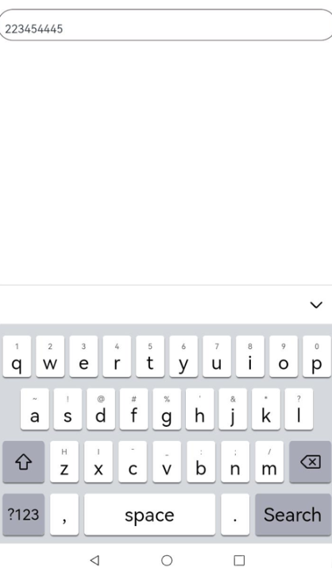

# Using the Input Method in a Custom Edit Box

You can use [getController](../reference/apis-ime-kit/js-apis-inputmethod.md#inputmethodgetcontroller9) to obtain an [InputMethodController](../reference/apis-ime-kit/js-apis-inputmethod.md#inputmethodcontroller) instance, and implement a custom text input box by binding the **InputMethodController** instance to an input method and listen for text input operations, such as text insertion, deletion, selection, and cursor movement.

## How to Develop

1. In your project in DevEco Studio, create an .ets file and name it the name of the target custom component, for example, **CustomInput**. Define a custom component in the file, and import **inputMethod** from @kit.IMEKit.

   ```ets
   import { inputMethod } from '@kit.IMEKit';
   
   @Component
   export struct CustomInput {
     build() {
     }
   }
   ```

2. In the component, use the **Text** component to show text in the text input box, and the **inputText** state variable to specify the text to display in the text input box.

   ```ets
   import { inputMethod } from '@kit.IMEKit';
   
   @Component
   export struct CustomInput {
     @State inputText: string = ''; // Specify the text to display in the text input box.
     
     build() {
       Text(this.inputText) // Use the Text component to show text in the text input box
         .fontSize(16)
         .width('100%')
         .lineHeight(40)
         .id('customInput')
         .height(45)
         .border({ color: '#554455', radius: 30, width: 1 })
         .maxLines(1)
     }
   }
   ```

3. Obtain an **inputMethodController** instance from the component, call the **attach** API of the instance to bind and start the soft keyboard when the text input box is clicked, and register listeners for text input operations, such as listeners for text insertion and removal in this example.

   ```ets
   import { inputMethod } from '@kit.IMEKit';
   
   @Component
   export struct CustomInput {
     @State inputText: string = ''; // Specify the text to display in the text input box.
     private isAttach: boolean = false;
     private inputController: inputMethod.InputMethodController = inputMethod.getController();
   
     build() {
       Text(this.inputText) // Use the Text component to show text in the custom input box
         .fontSize(16)
         .width('100%')
         .lineHeight(40)
         .id('customInput')
         .onBlur(() => {
           this.off();
         })
         .height(45)
         .border({ color: '#554455', radius: 30, width: 1 })
         .maxLines(1)
         .onClick(() => {
           this.attachAndListener(); // Click the component.
         })
     }
   
     async attachAndListener() {// Bind and set a listener.
       focusControl.requestFocus('CustomInput');
       await this.inputController.attach(true, {
         inputAttribute: {
           textInputType: inputMethod.TextInputType.TEXT,
           enterKeyType: inputMethod.EnterKeyType.SEARCH
         }
       });
       if (!this.isAttach) {
         this.inputController.on('insertText', (text) => {
           this.inputText += text;
         })
         this.inputController.on('deleteLeft', (length) => {
           this.inputText = this.inputText.substring(0, this.inputText.length - length);
         })
         this.isAttach = true;
       }
     }

     off() {
       this.isAttach = false;
       this.inputController.off('insertText')
       this.inputController.off('deleteLeft')
     }
   }
   ```

4. Import the component to the application UI layout. In this example, the **Index.ets** and **CustomInput.ets** files are in the same directory.

   ```ets
   import { CustomInput } from './CustomInput'; // Import the component.
   
   @Entry
   @Component
   struct Index {
   
     build() {
       Column() {
         CustomInput() // Use the component.
       }
     }
   }
   ```

   ## Effect
    
  
  
