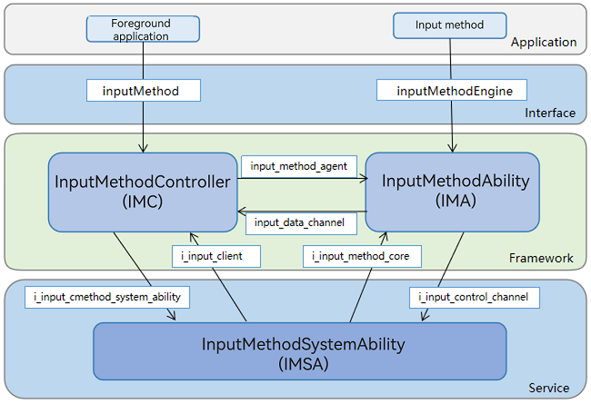

# Introduction to IME Kit
<!--Kit: IME Kit-->
<!--Subsystem: MiscServices-->
<!--Owner: @illybyy-->
<!--Designer: @andeszhang-->
<!--Tester: @murphy1984-->
<!--Adviser: @zhang_yixin13-->

IME Kit is responsible for establishing a communication channel between the application in which the text input box is located and the input method application, to ensure that the two work together to provide text input, and also enables system applications to manage the input method application.

## When to Use

IME Kit provides two types of APIs: input method framework APIs and input method service APIs. With these APIs, you can develop and manage an input method and implement a custom text input box.

## Working Principles

## Features

- Input method:

  Comes with three types of panels: fixed, floating, and status bar. One input method can be deployed across different device types, such as mobile phones and tablets.

- Custom text input box:

  Can be bound to an input method and implement operations such as typing, deleting, selecting text and moving the cursor.

## Available Capabilities

- The APIs related to the input method service are provided for input methods. You can use these APIs to create a soft keyboard window, insert or delete characters, select text, and listen for physical keyboard key events.

- The APIs related to the input method framework are provided for custom text input boxes. You can use these APIs to bind the text input box with an input method and implement operations such as typing, deleting, selecting text and moving the cursor.

- APIs are also provided for system applications to manage input methods. For example, they can be used to display or hide the soft keyboard, switch between input methods, and obtain the list of input methods.

## Relationship with Other Kits

ArkUI: With respect to soft keyboards and custom text input boxes, IME Kit can use some components, events, animations, and state management capabilities provided by ArkUI, for example, the **\<Text>** and **\<Button>** components and the **onClick** event.

## Constraints

For the system API for switching between input method applications, the system permission is required. Some APIs can be called only by the current input method application.

## API Reference

- [inputMethodEngine](../reference/apis-ime-kit/js-apis-inputmethodengine.md)

- [inputMethod](../reference/apis-ime-kit/js-apis-inputmethod.md)

- [InputMethodExtensionAbility](../reference/apis-ime-kit/js-apis-inputmethod-extension-ability.md)

- [InputMethodExtensionContext](../reference/apis-ime-kit/js-apis-inputmethod-extension-context.md)

- [inputMethodList](../reference/apis-ime-kit/js-apis-inputmethodlist.md)

- [InputMethodSubtype](../reference/apis-ime-kit/js-apis-inputmethod-subtype.md)

- [inputMethod.Panel](../reference/apis-ime-kit/js-apis-inputmethod-panel.md)
