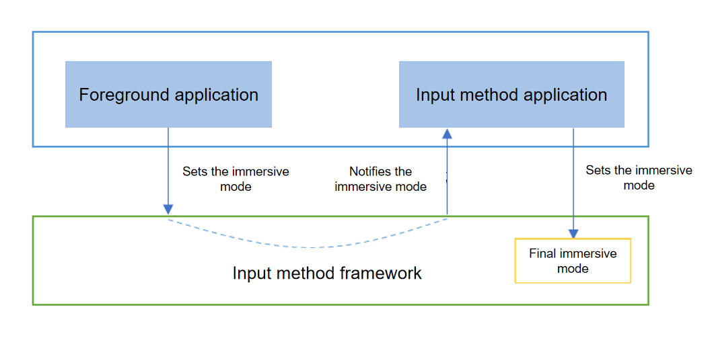

# Immersive Mode of the Input Method Application
<!--Kit: IME Kit-->
<!--Subsystem: MiscServices-->
<!--Owner: @illybyy-->
<!--Designer: @andeszhang-->
<!--Tester: @murphy1984-->
<!--Adviser: @zhang_yixin13-->

## When to Use

To implement consistent immersive experience, a communication mechanism between foreground applications and input method applications is provided. You can set the immersive input mode based on the immersive mode of the foreground application.

## Working Principles

- The foreground application sets the desired immersive mode based on the application scenario.
- The desired immersive mode of the foreground application is then passed to the input method application through the input method framework.
- The input method application determines the final immersive mode for the input method framework based on the immersive mode of the foreground application.

## Access Guide
1. The foreground application [sets the immersive mode for the text box](../reference/apis-arkui/arkui-ts/ts-basic-components-textarea.md#keyboardappearance15). The sample code is as follows:
   ```ts
   TextArea({text: "hello world"})
      .keyboardAppearance(KeyboardAppearance.IMMERSIVE)
   ```

2. The input method application [subscribes to the text box attribute change event](../reference/apis-ime-kit/js-apis-inputmethodengine.md#oneditorattributechanged10) and detects the immersive mode desired by the foreground application through the **immersiveMode** field in the **EditorAttribute** callback. The sample code is as follows:

   ```ts
   import { inputMethodEngine } from '@kit.IMEKit';

   inputMethodEngine.getKeyboardDelegate().on("editorAttributeChanged", (attr : inputMethodEngine.EditorAttribute) => {
      console.info("received editorAttributeChanged, immersiveMode: " + attr.immersiveMode);
   })
   ```

3. The input method application [sets the immersive mode](../reference/apis-ime-kit/js-apis-inputmethodengine.md#setimmersivemode15).
   - The **IMMERSIVE** mode is determined by the input method application.
   - The input method application cannot set the **IMMERSIVE** mode to the input method framework.
   - If the input method application receives **IMMERSIVE** from the foreground application, it is recommended that the input method application set the final immersive mode to **LIGHT_IMMERSIVE** or **DARK_IMMERSIVE** based on the current system color mode.


   The following sample code shows how to set the immersive mode. You must first use [createPanel](../reference/apis-ime-kit/js-apis-inputmethodengine.md#createpanel10) to obtain a panel instance, and then call the **setImmersiveMode** API using the obtained instance.
   ```ts
   panel.setImmersiveMode(inputMethodEngine.ImmersiveMode.LIGHT_IMMERSIVE);
   ```
