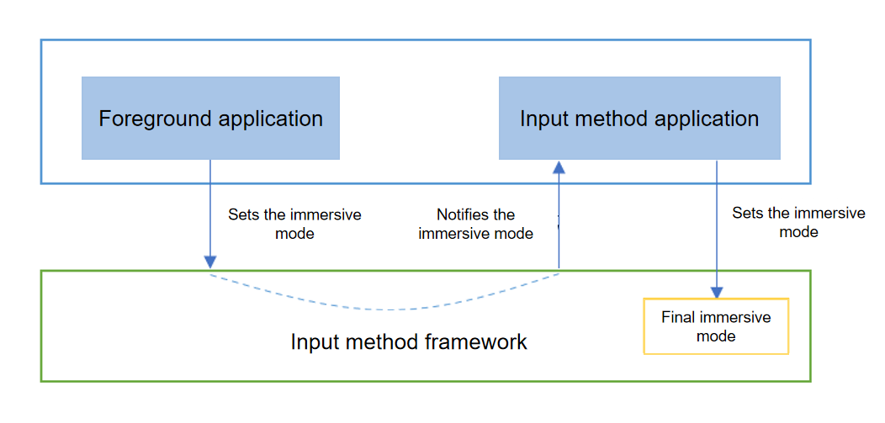

# Immersive Mode of the Input Method Application

<!--Kit: IME Kit-->
<!--Subsystem: MiscServices-->
<!--Owner: @codexu62-->
<!--Designer: @andeszhang-->
<!--Tester: @murphy84-->
<!--Adviser: @zhang_yixin13-->
<!-- md-trans-meta sourceCommit=8e856b06a34a819612cae112a81452d688b21bcf translatedAt=2026-08-15T01:52:26.554Z pushedAt=2026-08-15T08:40:09.020Z -->

## When to Use

To implement consistent immersive experience, a communication mechanism between foreground applications and input method applications is provided. You can set the immersive input mode based on the immersive mode of the foreground application.

## Working Principles



- The foreground application sets the desired immersive mode based on the application scenario.

- The desired immersive mode of the foreground application is then passed to the input method application through the input method framework.

- The input method application determines the final immersive mode for the input method framework based on the immersive mode of the foreground application.

## Access Guide

1. The foreground app sets the immersive mode for the edit box through [keyboardappearance](../reference/apis-arkui/arkui-ts/ts-basic-components-textarea.md#keyboardappearance15). The following is the sample code.

   <!-- @[input_case_input_KeyboardAppearance](https://gitcode.com/openharmony/applications_app_samples/blob/master/code/DocsSample/InputMethod/KikaInputMethod/entry/src/main/ets/pages/PrivatePreview.ets) -->

   ``` TypeScript
   TextArea({placeholder: 'Immersive mode'})
     .keyboardAppearance(KeyboardAppearance.IMMERSIVE)
   
   TextArea({placeholder: 'Non-immersive mode'})
     .keyboardAppearance(KeyboardAppearance.NONE_IMMERSIVE)
   ```

2. The input method app subscribes to the editor attribute change event [editorAttributeChanged](../reference/apis-ime-kit/js-apis-inputmethodengine.md#oneditorattributechanged10), and detects the immersive mode expected by the foreground app through the `immersiveMode` field in the callback parameter `EditorAttribute`. The following is the sample code.

   <!-- @[input_case_input_immersiveMode](https://gitcode.com/openharmony/applications_app_samples/blob/master/code/DocsSample/InputMethod/KikaInputMethod/entry/src/main/ets/InputMethodExtensionAbility/pages/Index.ets) -->

   ``` TypeScript
   // Check whether the immersive mode is used. If the immersive mode is used, select the immersive mode.
   inputMethodEngine.getKeyboardDelegate().on("editorAttributeChanged", (attr : inputMethodEngine.EditorAttribute) => {
     console.info('recv editorAttributeChanged, immersiveMode: ', attr.immersiveMode);
     if (attr.immersiveMode == inputMethodEngine.ImmersiveMode.DARK_IMMERSIVE) {
       this.panel?.setImmersiveMode(inputMethodEngine.ImmersiveMode.DARK_IMMERSIVE);
       console.info('recv editorAttributeChanged, panel:', this.panel?.getImmersiveMode());
     }
   })
   ```

3. The input method app sets the immersive mode through [setimmersivemode](../reference/apis-ime-kit/js-apis-inputmethodengine.md#setimmersivemode15).

   - The **IMMERSIVE** mode is determined by the input method application.

   - The input method application cannot set the **IMMERSIVE** mode to the input method framework.

   - If the input method app receives `IMMERSIVE` as the immersive mode expected by the foreground app, it is recommended that the input method app set the final immersive mode to light immersive mode (`LIGHT_IMMERSIVE`) or dark immersive mode (`DARK_IMMERSIVE`) based on the current system theme mode.

   The following sample code shows how to set the immersive mode. You must first use [createPanel](../reference/apis-ime-kit/js-apis-inputmethodengine.md#createpanel10) to obtain a panel instance, and then call the **setImmersiveMode** API using the obtained instance.

   <!-- @[input_case_input_immersiveMode](https://gitcode.com/openharmony/applications_app_samples/blob/master/code/DocsSample/InputMethod/KikaInputMethod/entry/src/main/ets/InputMethodExtensionAbility/pages/Index.ets) -->

   ``` TypeScript
   // Check whether the immersive mode is used. If the immersive mode is used, select the immersive mode.
   inputMethodEngine.getKeyboardDelegate().on("editorAttributeChanged", (attr : inputMethodEngine.EditorAttribute) => {
     console.info('recv editorAttributeChanged, immersiveMode: ', attr.immersiveMode);
     if (attr.immersiveMode == inputMethodEngine.ImmersiveMode.DARK_IMMERSIVE) {
       this.panel?.setImmersiveMode(inputMethodEngine.ImmersiveMode.DARK_IMMERSIVE);
       console.info('recv editorAttributeChanged, panel:', this.panel?.getImmersiveMode());
     }
   })
   ```