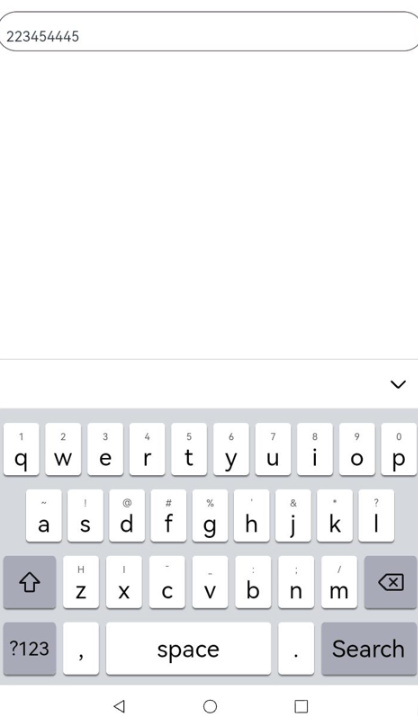

# Using the Input Method in a Custom Edit Box

<!--Kit: IME Kit-->
<!--Subsystem: MiscServices-->
<!--Owner: @codexu62-->
<!--Designer: @andeszhang-->
<!--Tester: @murphy84-->
<!--Adviser: @zhang_yixin13-->
<!-- md-trans-meta sourceCommit=f0e283ec5c4bc528d359a2a2fde61332cedaf473 translatedAt=2026-08-04T08:30:37.965Z pushedAt=2026-08-04T09:02:35.985Z -->

In the inputmethod framework, use [getController](../reference/apis-ime-kit/js-apis-inputmethod.md#inputmethodgetcontroller9) to obtain the [InputMethodController](../reference/apis-ime-kit/js-apis-inputmethod.md#inputmethodcontroller) instance for binding the input method and listening to various events of the input method application, such as insertion, deletion, selection, and cursor movement. In this way, the input method can be used in the custom edit box, implementing more flexible and free editing operations.

## How to Develop

1. In your project in DevEco Studio, create an .ets file and name it the name of the target custom component, for example, **CustomInput**. Define a custom component in the file, and import **inputMethod** from @kit.IMEKit.

   ```ets
   import { inputMethod } from '@kit.IMEKit';
   
   @Component
   export struct CustomInput {
     build() {
     }
   }
   ```

2. In the component, use the **Text** component to show the text in the custom edit box, and the **inputText** state variable to specify the text to display in the text input box.

   <!-- @[input_case_input_CustomInputText](https://gitcode.com/openharmony/applications_app_samples/blob/master/code/DocsSample/InputMethod/KikaInputMethod/entry/src/main/ets/components/CustomInput.ets) -->

   ``` TypeScript
   import { BusinessError } from '@kit.BasicServicesKit';
   import { inputMethod } from '@kit.IMEKit';
   import Log from '../model/Log';
   
   const TAG = '[Submenu]';
   
   @Component
   export struct CustomInput {
     @State inputText: string = ''; // inputText is the content to be displayed by the Text component.
     private isAttach: boolean = false;
     private inputController: inputMethod.InputMethodController = inputMethod.getController();
   
     build() {
       Text(this.inputText) // Use the Text component to show the text in the custom edit box.
         .fontSize(16)
         .width('100%')
         .lineHeight(40)
         .id('customInput')
         .height(45)
         .border({ color: '#554455', radius: 30, width: 1 })
         .maxLines(1)
         .onBlur(() => {
           this.off();
         })
         .onClick(() => {
           this.attachAndListener(); // Click the component.
         })
     }
   ```

3. In the component, obtain an **inputMethodController** instance. When the text is clicked, call the **controller** instance's **attach** method to bind and activate the soft keyboard, and register the input method to listen for text insertion and deletion events. This example only demonstrates insertion and deletion.

   <!-- @[input_case_input_CustomInput](https://gitcode.com/openharmony/applications_app_samples/blob/master/code/DocsSample/InputMethod/KikaInputMethod/entry/src/main/ets/components/CustomInput.ets) -->

   ``` TypeScript
   import { BusinessError } from '@kit.BasicServicesKit';
   import { inputMethod } from '@kit.IMEKit';
   import Log from '../model/Log';
   
   const TAG = '[Submenu]';
   
   @Component
   export struct CustomInput {
     @State inputText: string = ''; // inputText is the content to be displayed by the Text component.
     private isAttach: boolean = false;
     private inputController: inputMethod.InputMethodController = inputMethod.getController();
   
     build() {
       Text(this.inputText) // Use the Text component to show the text in the custom edit box.
         .fontSize(16)
         .width('100%')
         .lineHeight(40)
         .id('customInput')
         .height(45)
         .border({ color: '#554455', radius: 30, width: 1 })
         .maxLines(1)
         .onBlur(() => {
           this.off();
         })
         .onClick(() => {
           this.attachAndListener(); // Click the component.
         })
     }
     async attachAndListener() { // Bind and set a listener.
       focusControl.requestFocus('customInput');
       try {
         await this.inputController.attach(true, {
           inputAttribute: {
             textInputType: inputMethod.TextInputType.TEXT,
             enterKeyType: inputMethod.EnterKeyType.SEARCH
           }
         });
         if (!this.isAttach) {
           this.inputController.on('insertText', (text) => {
             this.inputText += text;
           })
           this.inputController.on('deleteLeft', (length) => {
             this.inputText = this.inputText.substring(0, this.inputText.length - length);
           })
           this.isAttach = true;
         }
       } catch (err) {
         let error = err as BusinessError;
         Log.showError(TAG, `attach catch error: ${error.code} ${error.message}`);
       }
     }
   
     off() {
       this.isAttach = false;
       this.inputController.off('insertText');
       this.inputController.off('deleteLeft');
     }
   }
   ```

4. Import the component to the application UI layout. In this example, the **Index.ets** and **CustomInput.ets** files are in the same directory.

   <!-- @[input_case_input_CustomInput](https://gitcode.com/openharmony/applications_app_samples/blob/master/code/DocsSample/InputMethod/KikaInputMethod/entry/src/main/ets/pages/PrivatePreview.ets) -->

   ``` TypeScript
   CustomInput()
   ```

## Effect

  