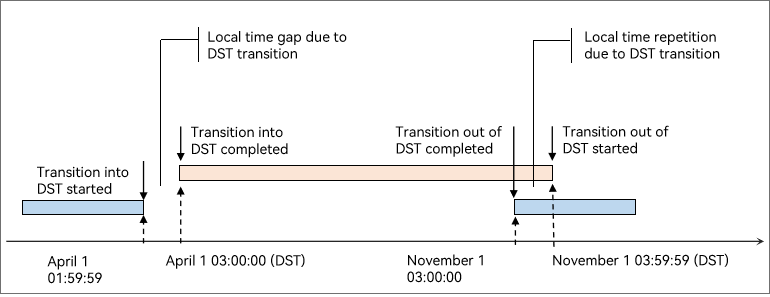

# DST Transition


## Use Cases

DST is a local time system that sees manual adjustment to the time with the aim of saving energy in certain countries/regions. Time in DST is one hour faster than that in GMT.


## How It Works

When the local time reaches the DST transition point, DST transition is automatically implemented based on the DST transition rules configured in the system. If an application uses a common TS API, for example, **Date()**, to obtain and display the time, it also displays the DST time when the DST transition time is reached.

The DST transition rules are as follows:

1. Calculate the number of hours in a day.
   The number of hours in a day changes on the day of DST transition. On the day when DST starts, there are 23 hours. On the day when the DST ends, there are 25 hours.

   Calculate the number of hours between the same clock time before and after the DST transition. The sample code is as follows:
   ```ts
   import { i18n } from '@kit.LocalizationKit';

   let calendar = i18n.getCalendar("zh-Hans");
   calendar.setTimeZone("Europe/London");
   calendar.set(2021, 2, 27, 16, 0, 0); //The day before daylight saving time start
   let time1 = calendar.getTimeInMillis();
   calendar.set(2021, 2, 28, 16, 0, 0); //The day daylight saving time start
   let time2 = calendar.getTimeInMillis();
   let hours = (time2 - time1)/(3600*1000) //The hours between the same wall clock time before and after DST. Should be 23
   ```

2. Store and display time data.
   Store and display time data according to the local DST timing rules. The time gap and repetition caused by DST transition need to be processed.

   When DST starts, one hour is missing, for example, 1:59:59→3:00:00. When DST ends, one hour is repeated, for example, 3:59:59→3:00:00.

   It is recommended that the DST flag be added to the local time when DST is active.

   

3. Store and transmit time data.
   You are advised to use the standard time (UTC or GMT) of time zone 0 for time data storage and transmission. This helps prevent data loss or errors caused by DST transition.
