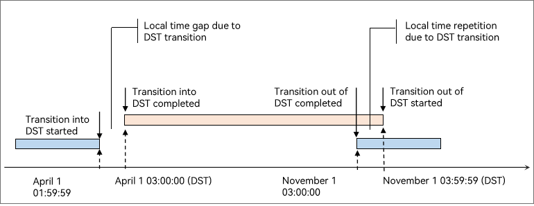

# DST Transition

<!--Kit: Localization Kit-->
<!--Subsystem: Global-->
<!--Owner: @yliupy-->
<!--Designer: @zw_feifei-->
<!--Tester: @lpw_work-->
<!--Adviser: @ningningW-->
<!-- md-trans-meta sourceCommit=1a7fdda7cb0bdacc6b1c367c8fd0def17530cd88 translatedAt=2026-08-15T01:52:59.927Z pushedAt=2026-08-15T08:41:36.277Z -->

## Use Cases

DST is a local time system that sees manual adjustment to the time with the aim of saving energy in certain countries/regions. When DST is enabled, the time is usually advanced by a certain period compared to the standard time.

## How It Works

When the system time reaches the DST transition point, DST transition is automatically implemented based on the DST transition rules configured in the system. If an application uses a standard TS API, for example, `Date()`, to obtain and display the time, it also displays the DST time when the DST transition time is reached.

### DST Transition Calculation

1. Import the required module.

   <!-- @[import_module](https://gitcode.com/openharmony/applications_app_samples/blob/master/code/DocsSample/International/Internationalization/entry/src/main/ets/i18napplication/TimezoneDstSetting.ets) -->

   ``` TypeScript
   import { i18n } from '@kit.LocalizationKit';
   ```

2. Application scenario.

- Calculate the number of hours in a day: The number of hours in a full day may change on the day when daylight saving time shifts, and is not always 24 hours. For example, in most countries, the day when daylight saving time starts has 23 hours, and the day when daylight saving time ends has 25 hours. Calculate the number of hours between wall-clock times before and after a daylight saving time shift. The sample code is as follows:

   <!-- @[handle_dst_transition](https://gitcode.com/openharmony/applications_app_samples/blob/master/code/DocsSample/International/Internationalization/entry/src/main/ets/i18napplication/TimezoneDstSetting.ets) -->

   ``` TypeScript
   let calendar: i18n.Calendar = i18n.getCalendar('zh-Hans');
   calendar.setTimeZone('Europe/London');
   calendar.set (2021, 2, 27, 16, 0, 0); // Time before the DST starts
   let startTime = calendar.getTimeInMillis();
   calendar.set (2021, 2, 28, 16, 0, 0); // Time in the DST period
   let finishTime = calendar.getTimeInMillis();
   let hours = (finishTime - startTime) / (3600 * 1000); // hours = 23
   ```

### Storing and Displaying Time Data

   Store and display time data according to the local DST timing rules. The time gap and repetition caused by DST transition need to be processed.

   The transition into DST will cause a period of time gap, for example, transition from 1:59:59 to 3:00:00. The transition out of DST will cause a period of time overlap, for example, rollback from 3:59:59 to 3:00:00.

   It is recommended that the DST flag be added to the local time when DST is active.

   

### Storing and Transmitting Time Data

   You are advised to use the standard time (UTC or GMT) of time zone 0 for time data storage and transmission. This helps prevent data loss or errors caused by DST transition.