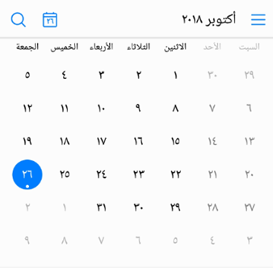

# UI Design for Internationalization

A set of effective internationalization guidelines for UI design can not only establish the tonality of products, but also ensure consistent user experience. Complying with the following guidelines can effectively improve the quality of your products targeted at global markets.

## Space Reservation and Flexible Layout

The length of translations languages varies greatly according to languages. Translation may increase the length of UI texts. To ensure that UI strings are not truncated after being translated into other languages, the best practice is to use flexible dynamic layout. That is, UI controls are dynamically adjusted based on the text length. If flexible layout is not applicable during actual development, reserve sufficient text space. The following table takes English as an example to provide the reference space to be reserved for translation.

**Table 1** Reserved space on the UI for translation

| Number of English Characters| Ratio of Reserved Space| 
| -------- | -------- |
| Less than or equal to 10| 100% to 200% | 
| Greater than or equal to 11 and less than or equal to 20| 80% to 100% | 
| Greater than or equal to 21 and less than or equal to 30| 60% to 80% | 
| Greater than or equal to 31 and less than or equal to 50| 40% to 60% | 
| Greater than or equal to 51 and less than or equal to 70| 30% to 40% | 
| Greater than or equal to 71| 30% | 

## UI Mirroring

Different text alignment modes and reading sequences may be used for different languages. For example, English is read from left-to-right (LTR), and Arabic and Greek are read from right-to-left (RTL). To ensure that the displayed content complies with the local language habits, ensure that the UI element layout supports UI mirroring, as shown in Figure 1 and Figure 2. The key points for UI mirroring design are as follows:

- UI layout mirroring. The UI should allow the content of an RTL language to be displayed in the original layout, meeting the bidirectional reading experience. For example, ABC is read ABC for an LTR language and CBA for an RTL language.

- UI element mirroring.  UI controls and icons with directionality are required to comply with mirroring rules, as shown in Figure 3, Figure 4, and Figure 5. Some icons, for example, the clock face, do not need to be mirrored because they are not directional or related to real objects.

- Touch and operation. The touch or operation on each UI element should comply with the reading sequence of the language in use. For example, if there are multiple tabs, swiping left means to move backward for an LTR language and swiping right means to move backward for an RTL language.

- Support for mixed text. Regarding text direction, the UI should support excellent mixed text rendering (for example, English text is available in bidirectionality, and vice versa).

**Figure 1** Example general layout (English)

**Figure 2** Example mirroring layout (Arabic)

**Figure 3** General icon resources

**Figure 4** Icon resources for RTL languages

**Figure 5** Mirroring controls for RTL languages

