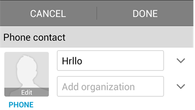
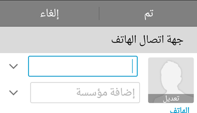
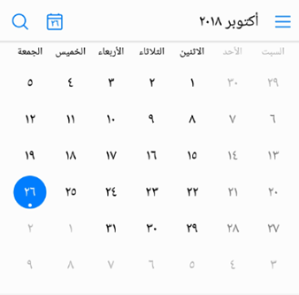

# UI Design for Internationalization

<!--Kit: Localization Kit-->
<!--Subsystem: Global-->
<!--Owner: @yliupy-->
<!--Designer: @zw_feifei-->
<!--Tester: @lpw_work-->
<!--Adviser: @ningningW-->
<!-- md-trans-meta sourceCommit=1a7fdda7cb0bdacc6b1c367c8fd0def17530cd88 translatedAt=2026-08-15T01:53:52.994Z pushedAt=2026-08-15T08:42:32.661Z -->

A set of effective internationalization guidelines for UI design can not only establish the tonality of products, but also ensure consistent user experience. Complying with the following guidelines can effectively improve the quality of your products targeted at global markets.

## Space Reservation and Flexible Layout

The length of translations can vary significantly across languages, which may cause UI text length to increase after translation. To ensure that UI strings are not truncated after being translated into other languages, the best practice is to use flexible dynamic layout. That is, UI controls are dynamically adjusted based on the text length. If flexible layout is not applicable, reserve sufficient text space during development. The following table takes English as an example to provide the reference space to be reserved for translation.

**Table 1** Reserved space on the UI for translation

| Number of English Characters| Ratio of Reserved Space| 
| -------- | -------- |
| Less than or equal to 10| 100% to 200% | 
| Greater than or equal to 11 and less than or equal to 20| 80% to 100% | 
| Greater than or equal to 21 and less than or equal to 30| 60% to 80% | 
| Greater than or equal to 31 and less than or equal to 50| 40% to 60% | 
| Greater than or equal to 51 and less than or equal to 70| 30% to 40% | 
| Greater than or equal to 71| 30% | 

## UI Mirroring

Different countries may have different text alignment modes and reading sequences. For example, English uses a left-to-right (LTR) order, while Arabic uses a right-to-left (RTL) order. To ensure that the UI content conforms to local language conventions, you must ensure that UI element layouts support UI mirroring, as shown in Figure 1 and Figure 2. The key design points for UI element mirroring are as follows:

- UI layout mirroring. The UI layout allows RTL content to be displayed in its original layout, meeting the bidirectional reading experience. For example, "ABC" should be displayed as "ABC" in LTR order and as "CBA" in RTL order.

- UI element mirroring. UI controls and icons with directionality are required to comply with mirroring rules, as shown in Figure 3, Figure 4, and Figure 5. Some icons, for example, the clock face, do not need to be mirrored because they are not directional or related to real objects.

- Touch and operation. The touch or operation on each UI element should comply with the reading sequence of the language in use. For example, if there are multiple tabs, swiping left means to move backward for an LTR language and swiping right means to move backward for an RTL language.

- Support for mixed text. Regarding text direction, the UI should support excellent mixed text rendering (for example, English text is available in bidirectionality, and vice versa).

**Figure 1** Example general layout (English)

**Figure 2** Example mirroring layout (Arabic)

**Figure 3** General icon resources

**Figure 4** Icon resources for RTL languages

**Figure 5** Mirroring controls for RTL languages

