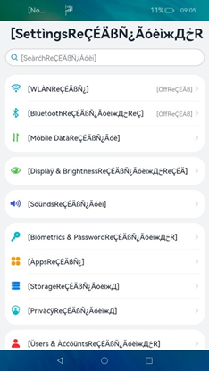

# Pseudo-Localization Testing for Translation

<!--Kit: Localization Kit-->
<!--Subsystem: Global-->
<!--Owner: @yliupy-->
<!--Designer: @zw_feifei-->
<!--Tester: @lpw_work-->
<!--Adviser: @ningningW-->
<!-- md-trans-meta sourceCommit=1a7fdda7cb0bdacc6b1c367c8fd0def17530cd88 translatedAt=2026-08-15T01:54:24.139Z pushedAt=2026-08-15T08:42:58.745Z -->

## Use Cases

Pseudo-localization testing simulates the translation process of an application to identify UI layout and text display issues that may occur during actual translation.

**Text truncation or abnormal UI layout**: For software components such as menus, text areas, keys, and check boxes, the text length is usually adjusted to adapt to the source language (usually English) during UI design, and then the text alignment, position, and line spacing are adjusted on this basis. However, the text length often increases after translation, leading to abnormal UI layout or text truncation in an inappropriate position. For example, Russian or Norwegian words are usually longer than English words. If the reserved space on the UI is small, the text that exceeds the scope is truncated, and consequently the translated text cannot be displayed completely.

**Abnormal text or symbol display**: This is usually due to a lack of fonts or typesetting capabilities of the system. This issue typically stems from an assumption during development that users would not input special characters or text in specific languages. For example, if a user enters Uyghur text on a Chinese UI, the text may not be properly displayed.

## Test Process

1. Switch to the target locale for pseudo-localization testing, for example, **en-XA**.

   >  **NOTE**
   >
   >  The **setSystemLanguage** API is a system API and needs to be called by the system applications. Once the target locale is successfully set, non-system applications can then perform pseudo-localization testing.

   <!--Del-->

   ```ts
   import { i18n } from '@kit.LocalizationKit';

   i18n.System.setSystemLanguage('en-XA');
   ```

   <!--DelEnd-->

2. Traverse the applications to be tested.

## Test Item



1. Check the UI for text truncation or distortion, or abnormal layout. Text truncation can be observed by checking whether the text ends with **]** (a right square bracket). If the text does not end with **]**, it is not completely displayed.

2. Check for hard coding problems. Hard coding of UI text can be observed by checking whether the text is processed in pseudo-translation format.

3. Check for string concatenation problems. String concatenation can be observed by checking whether strings in the pseudo-translation format appear in the same control in a consecutive manner, for example, **[string 1][string 2]**.

4. Check for multilingual text display issues. If the pseudo-translated text fails to display properly, for example, appearing as boxes, blanks, or incomplete text, it indicates an anomaly in multilingual display.