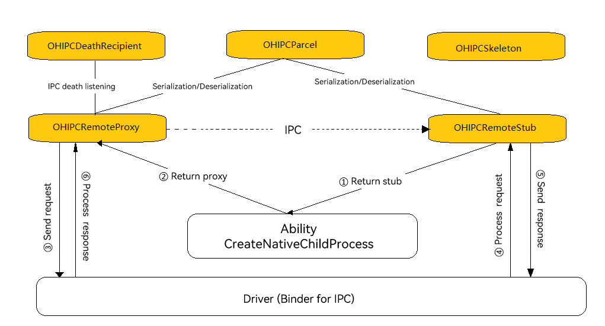

# IPC and RPC Development (C/C++)

<!--Kit: IPC Kit-->
<!--Subsystem: Communication-->
<!--Owner: @xdx19211@luodonghui0157-->
<!--Designer: @zhaopeng_gitee-->
<!--Tester: @Lyuxin-->
<!--Adviser: @zhang_yixin13-->
<!-- md-trans-meta sourceCommit=2f4b89223ea807a0581c60a9a81b8de70ba28fa9 translatedAt=2026-08-18T11:02:12.038Z pushedAt=2026-08-18T11:36:51.984Z -->

## When to Use

Inter-process communication (IPC) allows the proxy and stub running in different processes to communicate with each other using C APIs.  

The IPC C APIs do not provide the capability of obtaining the communication proxy object. This feature depends on [Ability Kit](../application-models/abilitykit-overview.md).



For details about how to establish an IPC channel, see [Creating/Terminating Native Child Processes (C/C++)](../application-models/capi-nativechildprocess-development-guideline.md). This document describes how to use the IPC C APIs.

## Available APIs

**Table 1** Key APIs

| API                              | Description                                                            |
| ------------------------------------ | ---------------------------------------------------------------- |
|typedef int (\*OH_OnRemoteRequestCallback)<br>(uint32_t code, const OHIPCParcel \*data, OHIPCParcel \*reply,<br> void \*userData);|Called to process the peer request at the stub.|
| OHIPCRemoteStub\* OH_IPCRemoteStub_Create<br>(const char \*descriptor, OH_OnRemoteRequestCallback requestCallback,<br>OH_OnRemoteDestroyCallback destroyCallback, void \*userData); | Creates an **OHIPCRemoteStub** object.|
|int OH_IPCRemoteProxy_SendRequest(const OHIPCRemoteProxy \*proxy,<br> uint32_t code, const OHIPCParcel \*data, OHIPCParcel \*reply,<br> const OH_IPC_MessageOption \*option);|Sends an IPC message.|
|struct OHIPCRemoteProxy;|Defines an **OHIPCRemoteProxy** object, which is used to send requests to the peer end. The **OHIPCRemoteProxy** object is returned by an ability API.|
|OHIPCDeathRecipient\* OH_IPCDeathRecipient_Create<br>(OH_OnDeathRecipientCallback deathRecipientCallback,<br> OH_OnDeathRecipientDestroyCallback destroyCallback,<br>void \*userData);|Creates an **OHIPCDeathRecipient** object, which is used to listen for the death of the remote **OHIPCRemoteStub** object.|
|int OH_IPCRemoteProxy_AddDeathRecipient(OHIPCRemoteProxy \*proxy,<br>OHIPCDeathRecipient \*recipient);|Subscribes to the death of an **OHIPCRemoteStub** object for an **OHIPCRemoteProxy** object.|

For details about the APIs, see [IPCKit](../reference/apis-ipc-kit/capi-ipckit.md).

## How to Develop

Create a stub object on the server, obtain the proxy object of the client through ability APIs, and use the proxy object to communicate with the stub object on the server through IPC. Then, register the death notification callback of the remote object to detect the death status of the process hosting the remote stub object.

When reading the following examples, follow this sequence: the child process creates a stub object, the main process starts the child process and obtains the proxy object, the proxy side sends a request, and the stub side processes the request and returns the result. The proxy side and stub side must use the same `code` definitions and interface descriptor.

**Linking Dynamic Libraries**

Add the following libraries to **CMakeLists.txt**.

```txt
# ipc capi
libipc_capi.so
# Ability C/C++ APIs
libchild_process.so
```

**Including Header Files**

<!-- @[child_process_head_file](https://gitcode.com/openharmony/applications_app_samples/blob/master/code/DocsSample/Ability/NativeChildProcessIpc/entry/src/main/cpp/ChildProcessSample.cpp) -->

``` C++
#include <IPCKit/ipc_kit.h>
#include <AbilityKit/native_child_process.h>
```

**Implementing Child Processes**

The child process creates a stub object and returns it through `NativeChildProcess_OnConnect` to receive IPC requests sent by the main process. The `OnRemoteRequest` in the following code only demonstrates the basic form of the callback function. For the specific request processing procedure, see "Implementing the Stub Side" later in this document.

<!-- @[child_process_must_method](https://gitcode.com/openharmony/applications_app_samples/blob/master/code/DocsSample/Ability/NativeChildProcessIpc/entry/src/main/cpp/ChildProcessSample.cpp) -->

``` C++
#include <IPCKit/ipc_kit.h>
// ...
#include <IPCKit/ipc_cremote_object.h>
#include <IPCKit/ipc_cparcel.h>
#include <IPCKit/ipc_error_code.h>

class IpcCapiStubTest {
public:
    explicit IpcCapiStubTest();
    ~IpcCapiStubTest();
    OHIPCRemoteStub *GetRemoteStub();
    static int OnRemoteRequest(uint32_t code, const OHIPCParcel *data, OHIPCParcel *reply, void *userData);

private:
    OHIPCRemoteStub *stub_{nullptr};
};

IpcCapiStubTest::IpcCapiStubTest()
{
    // Create a stub object.
    stub_ = OH_IPCRemoteStub_Create("testIpc", &IpcCapiStubTest::OnRemoteRequest, nullptr, this);
}

IpcCapiStubTest::~IpcCapiStubTest()
{
    if (stub_ != nullptr) {
        OH_IPCRemoteStub_Destroy(stub_);
    }
}

OHIPCRemoteStub *IpcCapiStubTest::GetRemoteStub() { return stub_; }

int IpcCapiStubTest::OnRemoteRequest(uint32_t code, const OHIPCParcel *data, OHIPCParcel *reply, void *userData)
{
    return OH_IPC_SUCCESS;
}

IpcCapiStubTest g_ipcStubObj;

extern "C" {
OHIPCRemoteStub *NativeChildProcess_OnConnect()
{
    // ipcRemoteStub points to the IPC stub object implemented by the child process. The object is used to receive and respond to IPC messages from the main process.
    // The child process controls its lifecycle according to the service logic.
    return g_ipcStubObj.GetRemoteStub();
}

void NativeChildProcess_MainProc()
{
    // Equivalent to the Main function of the child process. It implements the service logic of the child process.
    // ...
    // After the function is returned, the child process exits.
}

} // extern "C"
```

**Implementing the Main Process**

The main process calls `OH_Ability_CreateNativeChildProcess` to start the child process. After the child process is started successfully, the `OnNativeChildProcessStarted` callback provides the `remoteProxy` corresponding to the stub object of the child process, which can then be used to send IPC requests to the child process.

<!-- @[main_processIpc_launch_native_child](https://gitcode.com/openharmony/applications_app_samples/blob/master/code/DocsSample/Ability/NativeChildProcessIpc/entry/src/main/cpp/MainProcessSample.cpp) -->

``` C++
#include <IPCKit/ipc_kit.h>
#include <AbilityKit/native_child_process.h>
// ...
int32_t g_result = -1;
// ...
static void OnNativeChildProcessStarted(int errCode, OHIPCRemoteProxy *remoteProxy)
{
    if (errCode != NCP_NO_ERROR) {
        // Exception handling when the child process is not started normally.
        // ...
        return;
    }

    // Save the remoteProxy object for IPC with the child process based on the APIs provided by IPC Kit.
    // You are advised to transfer time-consuming operations to an independent thread to avoid blocking the callback thread for a long time.
    // When the IPC object is no longer needed, call OH_IPCRemoteProxy_Destroy to release it.
    // ...
}

void CreateNativeChildProcess()
{
    // The first parameter libchildprocesssample.so is the name of the dynamic link library that implements the necessary export functions of the child process.
    int32_t ret = OH_Ability_CreateNativeChildProcess("libchildprocesssample.so", OnNativeChildProcessStarted);
    if (ret != NCP_NO_ERROR) {
        // Exception handling when the child process is not started normally.
        // ...
    }
    g_result = ret;
}
```

**Implementing the Proxy Side**

The proxy side is used to send IPC requests to the remote stub. The following example demonstrates the process of creating an `OHIPCParcel` object, writing the interface descriptor and request data, calling `OH_IPCRemoteProxy_SendRequest` to send the request, and reading the processing result from the reply data object. Different operations are distinguished by different `code` values.

<!-- @[proxy_implement](https://gitcode.com/openharmony/applications_app_samples/blob/master/code/DocsSample/Ability/NativeChildProcessIpc/entry/src/main/cpp/IpcProxy.cpp) -->

``` C++
#include "IpcProxy.h"
#include <IPCKit/ipc_error_code.h>
#include "Ipchelper.h"

IpcProxy::IpcProxy(OHIPCRemoteProxy *ipcProxy)
    : ipcProxy_(ipcProxy)
{
}

IpcProxy::~IpcProxy()
{
    if (ipcProxy_ != nullptr) {
        OH_IPCRemoteProxy_Destroy(ipcProxy_);
    }
}

bool IpcProxy::RequestExitChildProcess(int32_t exitCode)
{
    if (ipcProxy_ == nullptr) {
        return false;
    }
    
    StdUniPtrIpcParcel data(OH_IPCParcel_Create(), OH_IPCParcel_Destroy);
    StdUniPtrIpcParcel reply(OH_IPCParcel_Create(), OH_IPCParcel_Destroy);
    if (data == nullptr || reply == nullptr) {
        return false;
    }
    
    if (!WriteInterfaceToken(data.get()) ||
        OH_IPCParcel_WriteInt32(data.get(), exitCode) != OH_IPC_SUCCESS) {
        return false;
    }
    
    OH_IPC_MessageOption ipcOpt;
    ipcOpt.mode = OH_IPC_REQUEST_MODE_SYNC;
    ipcOpt.timeout = 0;
    ipcOpt.reserved = nullptr;
    int ret = OH_IPCRemoteProxy_SendRequest(ipcProxy_, IPC_ID_REQUEST_EXIT_PROCESS, data.get(), reply.get(), &ipcOpt);
    if (ret != OH_IPC_SUCCESS) {
        return false;
    }
    
    return true;
}

int32_t IpcProxy::Add(int32_t a, int32_t b)
{
    if (ipcProxy_ == nullptr) {
        return INT32_MIN;
    }
    
    int32_t result = INT32_MIN;
    StdUniPtrIpcParcel data(OH_IPCParcel_Create(), OH_IPCParcel_Destroy);
    StdUniPtrIpcParcel reply(OH_IPCParcel_Create(), OH_IPCParcel_Destroy);
    if (data == nullptr || reply == nullptr) {
        return result;
    }
    
    if (!WriteInterfaceToken(data.get()) ||
        OH_IPCParcel_WriteInt32(data.get(), a) != OH_IPC_SUCCESS ||
        OH_IPCParcel_WriteInt32(data.get(), b) != OH_IPC_SUCCESS) {
        return result;
    }
    
    OH_IPC_MessageOption ipcOpt;
    ipcOpt.mode = OH_IPC_REQUEST_MODE_SYNC;
    ipcOpt.timeout = 0;
    ipcOpt.reserved = nullptr;
    int ret = OH_IPCRemoteProxy_SendRequest(ipcProxy_, IPC_ID_ADD, data.get(), reply.get(), &ipcOpt);
    if (ret != OH_IPC_SUCCESS) {
        return result;
    }
    
    OH_IPCParcel_ReadInt32(reply.get(), &result);
    return result;
}

int32_t IpcProxy::StartNativeChildProcess()
{
    if (ipcProxy_ == nullptr) {
        return INT32_MIN;
    }
    
    int32_t result = INT32_MIN;
    StdUniPtrIpcParcel data(OH_IPCParcel_Create(), OH_IPCParcel_Destroy);
    StdUniPtrIpcParcel reply(OH_IPCParcel_Create(), OH_IPCParcel_Destroy);
    if (data == nullptr || reply == nullptr) {
        return result;
    }
    
    if (!WriteInterfaceToken(data.get())) {
        return result;
    }
    
    OH_IPC_MessageOption ipcOpt;
    ipcOpt.mode = OH_IPC_REQUEST_MODE_SYNC;
    ipcOpt.timeout = 0;
    ipcOpt.reserved = nullptr;
    int ret = OH_IPCRemoteProxy_SendRequest(
        ipcProxy_, IPC_ID_START_NATIVE_CHILD_PROCESS, data.get(), reply.get(), &ipcOpt);
    if (ret != OH_IPC_SUCCESS) {
        return result;
    }
    
    OH_IPCParcel_ReadInt32(reply.get(), &result);
    return result;
}

bool IpcProxy::WriteInterfaceToken(OHIPCParcel* data)
{
    return OH_IPCParcel_WriteInterfaceToken(data, interfaceToken_) == OH_IPC_SUCCESS;
}
```

**Implementing the Stub Side**

The stub side receives requests sent by the proxy side through `OnRemoteRequest`. This callback first reads and verifies the interface descriptor, and then calls the corresponding processing method based on the `code`. The processing method reads data from the request data object `data`, writes the processing result to the reply data object `reply`, and returns it to the proxy side.

<!-- @[stub_implement](https://gitcode.com/openharmony/applications_app_samples/blob/master/code/DocsSample/Ability/NativeChildProcessIpc/entry/src/main/cpp/IpcStub.cpp) -->

``` C++
#include "IpcStub.h"
#include <IPCKit/ipc_error_code.h>
#include <cstring>
#include <new>

IpcStub::IpcStub()
{
    ipcStub_ = OH_IPCRemoteStub_Create("NativeChildIPCStubSample",
        IpcStub::OnRemoteRequest, IpcStub::OnRemoteObjectDestroy, this);
}

IpcStub::~IpcStub()
{
    OH_IPCRemoteStub_Destroy(ipcStub_);
}

OHIPCRemoteStub* IpcStub::GetIpcStub()
{
    return ipcStub_;
}

void IpcStub::OnRemoteObjectDestroy(void *userData)
{
}

int IpcStub::OnRemoteRequest(uint32_t code, const OHIPCParcel *data, OHIPCParcel *reply, void *userData)
{
    if (userData == nullptr) {
        return OH_IPC_CHECK_PARAM_ERROR;
    }
    
    if (!CheckInterfaceToken(data)) {
        return OH_IPC_CHECK_PARAM_ERROR;
    }
    
    int ret;
    IpcStub *thiz = reinterpret_cast<IpcStub*>(userData);
    switch (code) {
        case IPC_ID_REQUEST_EXIT_PROCESS:
            ret = thiz->HandleRequestExitChildProcess(data, reply);
            break;
        
        case IPC_ID_ADD:
            ret = thiz->HandleAdd(data, reply);
            break;
        
        case IPC_ID_START_NATIVE_CHILD_PROCESS:
            ret = thiz->HandleStartNativeChildProcess(data, reply);
            break;
        
        default:
            ret = OH_IPC_CODE_OUT_OF_RANGE;
            break;
    }
    
    return ret;
}

void* IpcStub::OnIpcMemAlloc(int32_t len)
{
    // limit ipc memory alloc size to 128 bytes
    if (len > 128) {
        return nullptr;
    }

    return new (std::nothrow) char[len];
}

void IpcStub::ReleaseIpcMem(void* ipcMem)
{
    delete[] reinterpret_cast<char*>(ipcMem);
}

bool IpcStub::CheckInterfaceToken(const OHIPCParcel* data)
{
    char *token;
    int32_t tokenLen;
    int ret = OH_IPCParcel_ReadInterfaceToken(data, &token, &tokenLen, IpcStub::OnIpcMemAlloc);
    if (ret != OH_IPC_SUCCESS) {
        return false;
    }
    
    bool tokenCheckRes = strcmp(token, interfaceToken_) == 0;
    ReleaseIpcMem(token);
    return tokenCheckRes;
}

int IpcStub::HandleRequestExitChildProcess(const OHIPCParcel *data, OHIPCParcel *reply)
{
    int exitCode = 0;
    if (OH_IPCParcel_ReadInt32(data, &exitCode) != OH_IPC_SUCCESS) {
        return OH_IPC_PARCEL_READ_ERROR;
    }
    int32_t ret = RequestExitChildProcess(exitCode) ? 1 : 0;
    return OH_IPCParcel_WriteInt32(reply, ret);
}

int32_t IpcStub::HandleAdd(const OHIPCParcel *data, OHIPCParcel *reply)
{
    int32_t a = 0;
    int32_t b = 0;
    if (OH_IPCParcel_ReadInt32(data, &a) != OH_IPC_SUCCESS ||
        OH_IPCParcel_ReadInt32(data, &b) != OH_IPC_SUCCESS) {
        return OH_IPC_PARCEL_READ_ERROR;
    }
    
    int32_t result = Add(a, b);
    if (OH_IPCParcel_WriteInt32(reply, result) != OH_IPC_SUCCESS) {
        return OH_IPC_PARCEL_WRITE_ERROR;
    }
    
    return OH_IPC_SUCCESS;
}

int IpcStub::HandleStartNativeChildProcess(const OHIPCParcel *data, OHIPCParcel *reply)
{
    int32_t ret = StartNativeChildProcess();
    return OH_IPCParcel_WriteInt32(reply, ret);
}
```