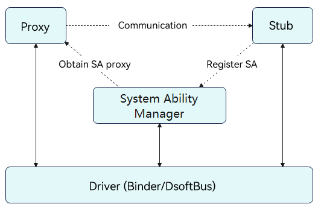

# Introduction to IPC Kit

## Basic Concepts

Both Inter-Process Communication (IPC) and Remote Procedure Call (RPC) implement cross-process communication. The difference is that the former uses the Binder driver to implement cross-process communication in a device, while the latter uses the DSoftBus driver to implement cross-process communication across devices. 

Each process has its own resources and independent memory space, and one process is not allowed to access the resources and memory space of other processes. That is why cross-process communication is required.

> **NOTE**
>
> The IPC and RPC described in this document cannot be directly used in the stage model. Typical use cases of IPC and RPC are as follows:
>
> - IPC is typically used by background services to implement cross-process service calls.
> - RPC is used <!--Del-->[<!--DelEnd-->in multi-device collaboration<!--Del-->](../application-models/hop-multi-device-collaboration.md)<!--DelEnd--> to implement remote API calls and data transfer.

## Working Principles

> **NOTE**
> 
> Client is the service requester, while server is the service provider. In IPC Kit, proxy is the client (the service requester) and stub is the server (service provider).

IPC and RPC use the client-server model, where the client process obtains the proxy of the process where the server is located and uses the proxy to read and write data. Specifically, the client creates a proxy object of the server. The proxy object has the same functions as the server. To access a method on the server, the client only needs to access the corresponding method in the proxy object. The proxy object forwards the request to the server. Then, the server processes the received request and returns the processing result to the proxy object through the driver. Finally, the proxy object forwards the request result to the client.

As shown in the following figure, the stub registers system abilities (SAs) with the system ability manager (SAMgr), which manages the SAs and provides APIs for clients. To communicate with an SA, the client must obtain the proxy object of the SA from SAMgr and communicate with the SA through the proxy object. The IPC depends on the Binder driver, while the RPC depends on the DSoftBus driver.

## Constraints

- A maximum of 1 MB data can be transferred in cross-process communication on a single device. If the amount of data to be transmitted is larger than 1 MB, use [anonymous shared memory](../reference/apis-ipc-kit/js-apis-rpc.md#ashmem8).

- Subscription to death notifications of anonymous stub objects (not registered with SAMgr) is not supported in RPC.

- During cross-process communication, a proxy object cannot be passed back to the device that hosts the stub object pointed to by the proxy object. That is, the proxy object pointing to the stub object of the remote device cannot be passed across processes twice on the local device.
