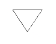

# CanvasRenderingContext2D<a name="EN-US_TOPIC_0000001162414637"></a>

-   [fillRect\(\)](#en-us_topic_0000001058830807_section16678142165920)
-   [fillStyle](#en-us_topic_0000001058830807_section159395553313)
-   [clearRect\(\)](#en-us_topic_0000001058830807_section205940367194)
-   [strokeRect\(\)](#en-us_topic_0000001058830807_section18427819195711)
-   [fillText\(\)](#en-us_topic_0000001058830807_section114524106587)
-   [strokeText\(\)](#en-us_topic_0000001058830807_section4144191355810)
-   [measureText\(\)](#en-us_topic_0000001058830807_section378313153588)
-   [lineWidth](#en-us_topic_0000001058830807_section652391716583)
-   [strokeStyle](#en-us_topic_0000001058830807_section1191517562337)
-   [stroke\(\)](#en-us_topic_0000001058830807_section1071523411019)
-   [beginPath\(\)](#en-us_topic_0000001058830807_section12670134392)
-   [moveTo\(\)](#en-us_topic_0000001058830807_section16813157310)
-   [lineTo\(\)](#en-us_topic_0000001058830807_section4767915838)
-   [closePath\(\)](#en-us_topic_0000001058830807_section86825473917)
-   [lineCap](#en-us_topic_0000001058830807_section6852133718410)
-   [lineJoin](#en-us_topic_0000001058830807_section395812401442)
-   [miterLimit](#en-us_topic_0000001058830807_section429711421945)
-   [font](#en-us_topic_0000001058830807_section17597332121110)
-   [textAlign](#en-us_topic_0000001058830807_section15681153321114)
-   [textBaseline](#en-us_topic_0000001058830807_section77981136141111)
-   [createPattern\(\)](#en-us_topic_0000001058830807_section1034582183919)
-   [bezierCurveTo\(\)](#en-us_topic_0000001058830807_section450521614318)
-   [quadraticCurveTo\(\)](#en-us_topic_0000001058830807_section12938183173)
-   [arc\(\)](#en-us_topic_0000001058830807_section102329511716)
-   [arcTo\(\)](#en-us_topic_0000001058830807_section3172156571)
-   [rect\(\)](#en-us_topic_0000001058830807_section1351519304107)
-   [fill\(\)](#en-us_topic_0000001058830807_section14842031151015)
-   [clip\(\)](#en-us_topic_0000001058830807_section1355171921416)
-   [rotate\(\)](#en-us_topic_0000001058830807_section7682182091419)
-   [scale\(\)](#en-us_topic_0000001058830807_section157714218144)
-   [transform\(\)](#en-us_topic_0000001058830807_section1675964717570)
-   [setTransform\(\)](#en-us_topic_0000001058830807_section1439382216440)
-   [translate\(\)](#en-us_topic_0000001058830807_section931011253449)
-   [globalAlpha](#en-us_topic_0000001058830807_section188252174810)
-   [drawImage\(\)](#en-us_topic_0000001058830807_section1953117410488)
-   [restore\(\)](#en-us_topic_0000001058830807_section64027684817)
-   [save\(\)](#en-us_topic_0000001058830807_section410672635214)
-   [createLinearGradient\(\)6+](#en-us_topic_0000001058830807_section1696310905)
-   [createImageData\(\)](#en-us_topic_0000001058830807_section2021142714524)
-   [getImageData\(\)](#en-us_topic_0000001058830807_section92731528205217)
-   [putImageData\(\)](#en-us_topic_0000001058830807_section15774154925515)
-   [setLineDash\(\)](#en-us_topic_0000001058830807_section1934985155516)
-   [getLineDash\(\)](#en-us_topic_0000001058830807_section522105285519)
-   [lineDashOffset](#en-us_topic_0000001058830807_section8283548889)
-   [globalCompositeOperation](#en-us_topic_0000001058830807_section123871750284)
-   [shadowBlur](#en-us_topic_0000001058830807_section6207051888)
-   [shadowColor](#en-us_topic_0000001058830807_section42724396120)
-   [shadowOffsetX](#en-us_topic_0000001058830807_section1616174021219)
-   [shadowOffsetY](#en-us_topic_0000001058830807_section272013417128)

**CanvasRenderingContext2D**  allows you to draw rectangles, text, images,  and other objects on a canvas.

-   Example

    ```
    <!-- xxx.hml -->
    <canvas ref="canvas1" style="width: 200px; height: 150px; background-color: #ffff00;"></canvas>
    <input type="button" style="width: 180px; height: 60px;" value="fillStyle" onclick="handleClick" />
    ```

    ```
    // xxx.js
    export default {
      handleClick() {
        const el = this.$refs.canvas1;
        const ctx = el.getContext('2d');
        ctx.beginPath();
        ctx.arc(100, 75, 50, 0, 6.28);
        ctx.stroke();
      },
    }
    ```


-   


## fillRect\(\)<a name="en-us_topic_0000001058830807_section16678142165920"></a>

Fills a rectangle on the canvas.

-   Parameter

    <a name="en-us_topic_0000001058830807_table116784429596"></a>
    <table><thead align="left"><tr id="en-us_topic_0000001058830807_row167864213591"><th class="cellrowborder" valign="top" width="33.333333333333336%" id="mcps1.1.4.1.1"><p id="en-us_topic_0000001058830807_p8678134225914"><a name="en-us_topic_0000001058830807_p8678134225914"></a><a name="en-us_topic_0000001058830807_p8678134225914"></a>Name</p>
    </th>
    <th class="cellrowborder" valign="top" width="33.333333333333336%" id="mcps1.1.4.1.2"><p id="en-us_topic_0000001058830807_p567911425597"><a name="en-us_topic_0000001058830807_p567911425597"></a><a name="en-us_topic_0000001058830807_p567911425597"></a>Type</p>
    </th>
    <th class="cellrowborder" valign="top" width="33.333333333333336%" id="mcps1.1.4.1.3"><p id="en-us_topic_0000001058830807_p116798423594"><a name="en-us_topic_0000001058830807_p116798423594"></a><a name="en-us_topic_0000001058830807_p116798423594"></a>Description</p>
    </th>
    </tr>
    </thead>
    <tbody><tr id="en-us_topic_0000001058830807_row46791042125917"><td class="cellrowborder" valign="top" width="33.333333333333336%" headers="mcps1.1.4.1.1 "><p id="en-us_topic_0000001058830807_p1467911422593"><a name="en-us_topic_0000001058830807_p1467911422593"></a><a name="en-us_topic_0000001058830807_p1467911422593"></a>x</p>
    </td>
    <td class="cellrowborder" valign="top" width="33.333333333333336%" headers="mcps1.1.4.1.2 "><p id="en-us_topic_0000001058830807_p1967994235916"><a name="en-us_topic_0000001058830807_p1967994235916"></a><a name="en-us_topic_0000001058830807_p1967994235916"></a>number</p>
    </td>
    <td class="cellrowborder" valign="top" width="33.333333333333336%" headers="mcps1.1.4.1.3 "><p id="en-us_topic_0000001058830807_p1367984295913"><a name="en-us_topic_0000001058830807_p1367984295913"></a><a name="en-us_topic_0000001058830807_p1367984295913"></a>X-coordinate of the upper left corner of the rectangle</p>
    </td>
    </tr>
    <tr id="en-us_topic_0000001058830807_row1667911426594"><td class="cellrowborder" valign="top" width="33.333333333333336%" headers="mcps1.1.4.1.1 "><p id="en-us_topic_0000001058830807_p7679154225917"><a name="en-us_topic_0000001058830807_p7679154225917"></a><a name="en-us_topic_0000001058830807_p7679154225917"></a>y</p>
    </td>
    <td class="cellrowborder" valign="top" width="33.333333333333336%" headers="mcps1.1.4.1.2 "><p id="en-us_topic_0000001058830807_p867984219592"><a name="en-us_topic_0000001058830807_p867984219592"></a><a name="en-us_topic_0000001058830807_p867984219592"></a>number</p>
    </td>
    <td class="cellrowborder" valign="top" width="33.333333333333336%" headers="mcps1.1.4.1.3 "><p id="en-us_topic_0000001058830807_p567964295917"><a name="en-us_topic_0000001058830807_p567964295917"></a><a name="en-us_topic_0000001058830807_p567964295917"></a>Y-coordinate of the upper left corner of the rectangle</p>
    </td>
    </tr>
    <tr id="en-us_topic_0000001058830807_row13679114214590"><td class="cellrowborder" valign="top" width="33.333333333333336%" headers="mcps1.1.4.1.1 "><p id="en-us_topic_0000001058830807_p126791642105910"><a name="en-us_topic_0000001058830807_p126791642105910"></a><a name="en-us_topic_0000001058830807_p126791642105910"></a>width</p>
    </td>
    <td class="cellrowborder" valign="top" width="33.333333333333336%" headers="mcps1.1.4.1.2 "><p id="en-us_topic_0000001058830807_p26792422594"><a name="en-us_topic_0000001058830807_p26792422594"></a><a name="en-us_topic_0000001058830807_p26792422594"></a>number</p>
    </td>
    <td class="cellrowborder" valign="top" width="33.333333333333336%" headers="mcps1.1.4.1.3 "><p id="en-us_topic_0000001058830807_p899913810401"><a name="en-us_topic_0000001058830807_p899913810401"></a><a name="en-us_topic_0000001058830807_p899913810401"></a>Width of the rectangle</p>
    </td>
    </tr>
    <tr id="en-us_topic_0000001058830807_row156796426598"><td class="cellrowborder" valign="top" width="33.333333333333336%" headers="mcps1.1.4.1.1 "><p id="en-us_topic_0000001058830807_p1567944235917"><a name="en-us_topic_0000001058830807_p1567944235917"></a><a name="en-us_topic_0000001058830807_p1567944235917"></a>height</p>
    </td>
    <td class="cellrowborder" valign="top" width="33.333333333333336%" headers="mcps1.1.4.1.2 "><p id="en-us_topic_0000001058830807_p10679642185915"><a name="en-us_topic_0000001058830807_p10679642185915"></a><a name="en-us_topic_0000001058830807_p10679642185915"></a>number</p>
    </td>
    <td class="cellrowborder" valign="top" width="33.333333333333336%" headers="mcps1.1.4.1.3 "><p id="en-us_topic_0000001058830807_p1668013426599"><a name="en-us_topic_0000001058830807_p1668013426599"></a><a name="en-us_topic_0000001058830807_p1668013426599"></a>Height of the rectangle</p>
    </td>
    </tr>
    </tbody>
    </table>

-   Return Value

    N/A

-   Example

    

    ```
    ctx.fillRect(20, 20, 200, 150);
    ```


## fillStyle<a name="en-us_topic_0000001058830807_section159395553313"></a>

Sets the style to fill an area.

-   Parameter

    <a name="en-us_topic_0000001058830807_table11871845480"></a>
    <table><thead align="left"><tr id="en-us_topic_0000001058830807_row8211446487"><th class="cellrowborder" valign="top" width="33.333333333333336%" id="mcps1.1.4.1.1"><p id="en-us_topic_0000001058830807_p172111344482"><a name="en-us_topic_0000001058830807_p172111344482"></a><a name="en-us_topic_0000001058830807_p172111344482"></a>Name</p>
    </th>
    <th class="cellrowborder" valign="top" width="33.333333333333336%" id="mcps1.1.4.1.2"><p id="en-us_topic_0000001058830807_p921110413486"><a name="en-us_topic_0000001058830807_p921110413486"></a><a name="en-us_topic_0000001058830807_p921110413486"></a>Type</p>
    </th>
    <th class="cellrowborder" valign="top" width="33.333333333333336%" id="mcps1.1.4.1.3"><p id="en-us_topic_0000001058830807_p1221111444810"><a name="en-us_topic_0000001058830807_p1221111444810"></a><a name="en-us_topic_0000001058830807_p1221111444810"></a>Description</p>
    </th>
    </tr>
    </thead>
    <tbody><tr id="en-us_topic_0000001058830807_row92116414485"><td class="cellrowborder" valign="top" width="33.333333333333336%" headers="mcps1.1.4.1.1 "><p id="en-us_topic_0000001058830807_p3211242481"><a name="en-us_topic_0000001058830807_p3211242481"></a><a name="en-us_topic_0000001058830807_p3211242481"></a>color</p>
    </td>
    <td class="cellrowborder" valign="top" width="33.333333333333336%" headers="mcps1.1.4.1.2 "><p id="en-us_topic_0000001058830807_p3211164124812"><a name="en-us_topic_0000001058830807_p3211164124812"></a><a name="en-us_topic_0000001058830807_p3211164124812"></a>&lt;color&gt;</p>
    </td>
    <td class="cellrowborder" valign="top" width="33.333333333333336%" headers="mcps1.1.4.1.3 "><p id="en-us_topic_0000001058830807_p42117420487"><a name="en-us_topic_0000001058830807_p42117420487"></a><a name="en-us_topic_0000001058830807_p42117420487"></a>Color used to fill the area</p>
    </td>
    </tr>
    <tr id="en-us_topic_0000001058830807_row19211345485"><td class="cellrowborder" valign="top" width="33.333333333333336%" headers="mcps1.1.4.1.1 "><p id="en-us_topic_0000001058830807_p42124414813"><a name="en-us_topic_0000001058830807_p42124414813"></a><a name="en-us_topic_0000001058830807_p42124414813"></a>gradient</p>
    </td>
    <td class="cellrowborder" valign="top" width="33.333333333333336%" headers="mcps1.1.4.1.2 "><p id="en-us_topic_0000001058830807_p52124494812"><a name="en-us_topic_0000001058830807_p52124494812"></a><a name="en-us_topic_0000001058830807_p52124494812"></a>CanvasGradient</p>
    </td>
    <td class="cellrowborder" valign="top" width="33.333333333333336%" headers="mcps1.1.4.1.3 "><p id="en-us_topic_0000001058830807_p1721217418484"><a name="en-us_topic_0000001058830807_p1721217418484"></a><a name="en-us_topic_0000001058830807_p1721217418484"></a><strong id="en-us_topic_0000001058830807_b889313423010"><a name="en-us_topic_0000001058830807_b889313423010"></a><a name="en-us_topic_0000001058830807_b889313423010"></a>CanvasGradient</strong> object created via <strong id="en-us_topic_0000001058830807_b164385341345"><a name="en-us_topic_0000001058830807_b164385341345"></a><a name="en-us_topic_0000001058830807_b164385341345"></a>createLinearGradient()</strong></p>
    </td>
    </tr>
    <tr id="en-us_topic_0000001058830807_row621218424815"><td class="cellrowborder" valign="top" width="33.333333333333336%" headers="mcps1.1.4.1.1 "><p id="en-us_topic_0000001058830807_p02127464814"><a name="en-us_topic_0000001058830807_p02127464814"></a><a name="en-us_topic_0000001058830807_p02127464814"></a>pattern</p>
    </td>
    <td class="cellrowborder" valign="top" width="33.333333333333336%" headers="mcps1.1.4.1.2 "><p id="en-us_topic_0000001058830807_p1921284174819"><a name="en-us_topic_0000001058830807_p1921284174819"></a><a name="en-us_topic_0000001058830807_p1921284174819"></a>CanvasPattern</p>
    </td>
    <td class="cellrowborder" valign="top" width="33.333333333333336%" headers="mcps1.1.4.1.3 "><p id="en-us_topic_0000001058830807_p1821210414486"><a name="en-us_topic_0000001058830807_p1821210414486"></a><a name="en-us_topic_0000001058830807_p1821210414486"></a><strong id="en-us_topic_0000001058830807_b08763720309"><a name="en-us_topic_0000001058830807_b08763720309"></a><a name="en-us_topic_0000001058830807_b08763720309"></a>CanvasPattern</strong> object created via <strong id="en-us_topic_0000001058830807_b946111864510"><a name="en-us_topic_0000001058830807_b946111864510"></a><a name="en-us_topic_0000001058830807_b946111864510"></a>createPattern()</strong></p>
    </td>
    </tr>
    </tbody>
    </table>

-   Return Value

    N/A

-   Example

    

    ```
    ctx.fillStyle = '#0000ff';
    ctx.fillRect(20, 20, 150, 100);
    ```


## clearRect\(\)<a name="en-us_topic_0000001058830807_section205940367194"></a>

Clears the content in a rectangle on the canvas.

-   Parameter

    <a name="en-us_topic_0000001058830807_table17906135163511"></a>
    <table><thead align="left"><tr id="en-us_topic_0000001058830807_row1293515173513"><th class="cellrowborder" valign="top" width="33.333333333333336%" id="mcps1.1.4.1.1"><p id="en-us_topic_0000001058830807_p9935195111353"><a name="en-us_topic_0000001058830807_p9935195111353"></a><a name="en-us_topic_0000001058830807_p9935195111353"></a>Name</p>
    </th>
    <th class="cellrowborder" valign="top" width="33.333333333333336%" id="mcps1.1.4.1.2"><p id="en-us_topic_0000001058830807_p993516515354"><a name="en-us_topic_0000001058830807_p993516515354"></a><a name="en-us_topic_0000001058830807_p993516515354"></a>Type</p>
    </th>
    <th class="cellrowborder" valign="top" width="33.333333333333336%" id="mcps1.1.4.1.3"><p id="en-us_topic_0000001058830807_p1893510517352"><a name="en-us_topic_0000001058830807_p1893510517352"></a><a name="en-us_topic_0000001058830807_p1893510517352"></a>Description</p>
    </th>
    </tr>
    </thead>
    <tbody><tr id="en-us_topic_0000001058830807_row109351051153516"><td class="cellrowborder" valign="top" width="33.333333333333336%" headers="mcps1.1.4.1.1 "><p id="en-us_topic_0000001058830807_p29357518355"><a name="en-us_topic_0000001058830807_p29357518355"></a><a name="en-us_topic_0000001058830807_p29357518355"></a>x</p>
    </td>
    <td class="cellrowborder" valign="top" width="33.333333333333336%" headers="mcps1.1.4.1.2 "><p id="en-us_topic_0000001058830807_p1093510513353"><a name="en-us_topic_0000001058830807_p1093510513353"></a><a name="en-us_topic_0000001058830807_p1093510513353"></a>number</p>
    </td>
    <td class="cellrowborder" valign="top" width="33.333333333333336%" headers="mcps1.1.4.1.3 "><p id="en-us_topic_0000001058830807_p1893545115356"><a name="en-us_topic_0000001058830807_p1893545115356"></a><a name="en-us_topic_0000001058830807_p1893545115356"></a>X-coordinate of the upper left corner of the rectangle</p>
    </td>
    </tr>
    <tr id="en-us_topic_0000001058830807_row49351651123519"><td class="cellrowborder" valign="top" width="33.333333333333336%" headers="mcps1.1.4.1.1 "><p id="en-us_topic_0000001058830807_p14935145119354"><a name="en-us_topic_0000001058830807_p14935145119354"></a><a name="en-us_topic_0000001058830807_p14935145119354"></a>y</p>
    </td>
    <td class="cellrowborder" valign="top" width="33.333333333333336%" headers="mcps1.1.4.1.2 "><p id="en-us_topic_0000001058830807_p1993595111355"><a name="en-us_topic_0000001058830807_p1993595111355"></a><a name="en-us_topic_0000001058830807_p1993595111355"></a>number</p>
    </td>
    <td class="cellrowborder" valign="top" width="33.333333333333336%" headers="mcps1.1.4.1.3 "><p id="en-us_topic_0000001058830807_p14935135103519"><a name="en-us_topic_0000001058830807_p14935135103519"></a><a name="en-us_topic_0000001058830807_p14935135103519"></a>Y-coordinate of the upper left corner of the rectangle</p>
    </td>
    </tr>
    <tr id="en-us_topic_0000001058830807_row11935551173517"><td class="cellrowborder" valign="top" width="33.333333333333336%" headers="mcps1.1.4.1.1 "><p id="en-us_topic_0000001058830807_p129351251173520"><a name="en-us_topic_0000001058830807_p129351251173520"></a><a name="en-us_topic_0000001058830807_p129351251173520"></a>width</p>
    </td>
    <td class="cellrowborder" valign="top" width="33.333333333333336%" headers="mcps1.1.4.1.2 "><p id="en-us_topic_0000001058830807_p159351516351"><a name="en-us_topic_0000001058830807_p159351516351"></a><a name="en-us_topic_0000001058830807_p159351516351"></a>number</p>
    </td>
    <td class="cellrowborder" valign="top" width="33.333333333333336%" headers="mcps1.1.4.1.3 "><p id="en-us_topic_0000001058830807_p7935195113515"><a name="en-us_topic_0000001058830807_p7935195113515"></a><a name="en-us_topic_0000001058830807_p7935195113515"></a>Width of the rectangle</p>
    </td>
    </tr>
    <tr id="en-us_topic_0000001058830807_row13935145118355"><td class="cellrowborder" valign="top" width="33.333333333333336%" headers="mcps1.1.4.1.1 "><p id="en-us_topic_0000001058830807_p69361451113519"><a name="en-us_topic_0000001058830807_p69361451113519"></a><a name="en-us_topic_0000001058830807_p69361451113519"></a>height</p>
    </td>
    <td class="cellrowborder" valign="top" width="33.333333333333336%" headers="mcps1.1.4.1.2 "><p id="en-us_topic_0000001058830807_p893611511357"><a name="en-us_topic_0000001058830807_p893611511357"></a><a name="en-us_topic_0000001058830807_p893611511357"></a>number</p>
    </td>
    <td class="cellrowborder" valign="top" width="33.333333333333336%" headers="mcps1.1.4.1.3 "><p id="en-us_topic_0000001058830807_p11936155183515"><a name="en-us_topic_0000001058830807_p11936155183515"></a><a name="en-us_topic_0000001058830807_p11936155183515"></a>Height of the rectangle</p>
    </td>
    </tr>
    </tbody>
    </table>

-   Return Value

    N/A

-   Example

    

    ```
    ctx.fillStyle = 'rgb(0,0,255)';
    ctx.fillRect(0, 0, 400, 200);
    ctx.clearRect(20, 20, 150, 100);
    ```


## strokeRect\(\)<a name="en-us_topic_0000001058830807_section18427819195711"></a>

Draws a rectangle stroke on the canvas.

-   Parameter

    <a name="en-us_topic_0000001058830807_table18471143916378"></a>
    <table><thead align="left"><tr id="en-us_topic_0000001058830807_row1849515396371"><th class="cellrowborder" valign="top" width="33.333333333333336%" id="mcps1.1.4.1.1"><p id="en-us_topic_0000001058830807_p5495133918379"><a name="en-us_topic_0000001058830807_p5495133918379"></a><a name="en-us_topic_0000001058830807_p5495133918379"></a>Name</p>
    </th>
    <th class="cellrowborder" valign="top" width="33.333333333333336%" id="mcps1.1.4.1.2"><p id="en-us_topic_0000001058830807_p10495103913717"><a name="en-us_topic_0000001058830807_p10495103913717"></a><a name="en-us_topic_0000001058830807_p10495103913717"></a>Type</p>
    </th>
    <th class="cellrowborder" valign="top" width="33.333333333333336%" id="mcps1.1.4.1.3"><p id="en-us_topic_0000001058830807_p1949515397379"><a name="en-us_topic_0000001058830807_p1949515397379"></a><a name="en-us_topic_0000001058830807_p1949515397379"></a>Description</p>
    </th>
    </tr>
    </thead>
    <tbody><tr id="en-us_topic_0000001058830807_row1449512396370"><td class="cellrowborder" valign="top" width="33.333333333333336%" headers="mcps1.1.4.1.1 "><p id="en-us_topic_0000001058830807_p15495143917372"><a name="en-us_topic_0000001058830807_p15495143917372"></a><a name="en-us_topic_0000001058830807_p15495143917372"></a>x</p>
    </td>
    <td class="cellrowborder" valign="top" width="33.333333333333336%" headers="mcps1.1.4.1.2 "><p id="en-us_topic_0000001058830807_p1949514399373"><a name="en-us_topic_0000001058830807_p1949514399373"></a><a name="en-us_topic_0000001058830807_p1949514399373"></a>number</p>
    </td>
    <td class="cellrowborder" valign="top" width="33.333333333333336%" headers="mcps1.1.4.1.3 "><p id="en-us_topic_0000001058830807_p1149513912372"><a name="en-us_topic_0000001058830807_p1149513912372"></a><a name="en-us_topic_0000001058830807_p1149513912372"></a>X-coordinate of the upper left corner of the rectangle stroke</p>
    </td>
    </tr>
    <tr id="en-us_topic_0000001058830807_row1049543973713"><td class="cellrowborder" valign="top" width="33.333333333333336%" headers="mcps1.1.4.1.1 "><p id="en-us_topic_0000001058830807_p3495193913379"><a name="en-us_topic_0000001058830807_p3495193913379"></a><a name="en-us_topic_0000001058830807_p3495193913379"></a>y</p>
    </td>
    <td class="cellrowborder" valign="top" width="33.333333333333336%" headers="mcps1.1.4.1.2 "><p id="en-us_topic_0000001058830807_p1349513391377"><a name="en-us_topic_0000001058830807_p1349513391377"></a><a name="en-us_topic_0000001058830807_p1349513391377"></a>number</p>
    </td>
    <td class="cellrowborder" valign="top" width="33.333333333333336%" headers="mcps1.1.4.1.3 "><p id="en-us_topic_0000001058830807_p84961139193711"><a name="en-us_topic_0000001058830807_p84961139193711"></a><a name="en-us_topic_0000001058830807_p84961139193711"></a>Y-coordinate of the upper left corner of the rectangle stroke</p>
    </td>
    </tr>
    <tr id="en-us_topic_0000001058830807_row12496139143718"><td class="cellrowborder" valign="top" width="33.333333333333336%" headers="mcps1.1.4.1.1 "><p id="en-us_topic_0000001058830807_p1049633918378"><a name="en-us_topic_0000001058830807_p1049633918378"></a><a name="en-us_topic_0000001058830807_p1049633918378"></a>width</p>
    </td>
    <td class="cellrowborder" valign="top" width="33.333333333333336%" headers="mcps1.1.4.1.2 "><p id="en-us_topic_0000001058830807_p184961039113711"><a name="en-us_topic_0000001058830807_p184961039113711"></a><a name="en-us_topic_0000001058830807_p184961039113711"></a>number</p>
    </td>
    <td class="cellrowborder" valign="top" width="33.333333333333336%" headers="mcps1.1.4.1.3 "><p id="en-us_topic_0000001058830807_p18496183918373"><a name="en-us_topic_0000001058830807_p18496183918373"></a><a name="en-us_topic_0000001058830807_p18496183918373"></a>Width of the rectangle stroke</p>
    </td>
    </tr>
    <tr id="en-us_topic_0000001058830807_row1842894223717"><td class="cellrowborder" valign="top" width="33.333333333333336%" headers="mcps1.1.4.1.1 "><p id="en-us_topic_0000001058830807_p03284623713"><a name="en-us_topic_0000001058830807_p03284623713"></a><a name="en-us_topic_0000001058830807_p03284623713"></a>height</p>
    </td>
    <td class="cellrowborder" valign="top" width="33.333333333333336%" headers="mcps1.1.4.1.2 "><p id="en-us_topic_0000001058830807_p83204615372"><a name="en-us_topic_0000001058830807_p83204615372"></a><a name="en-us_topic_0000001058830807_p83204615372"></a>number</p>
    </td>
    <td class="cellrowborder" valign="top" width="33.333333333333336%" headers="mcps1.1.4.1.3 "><p id="en-us_topic_0000001058830807_p333154663711"><a name="en-us_topic_0000001058830807_p333154663711"></a><a name="en-us_topic_0000001058830807_p333154663711"></a>Height of the rectangle stroke</p>
    </td>
    </tr>
    </tbody>
    </table>

-   Return Value

    N/A

-   Example

    

    ```
    ctx.strokeRect(30, 30, 200, 150);
    ```


## fillText\(\)<a name="en-us_topic_0000001058830807_section114524106587"></a>

Draws filled text on the canvas.

-   Parameter

    <a name="en-us_topic_0000001058830807_table19120835143816"></a>
    <table><thead align="left"><tr id="en-us_topic_0000001058830807_row9150835103813"><th class="cellrowborder" valign="top" width="33.333333333333336%" id="mcps1.1.4.1.1"><p id="en-us_topic_0000001058830807_p915043533812"><a name="en-us_topic_0000001058830807_p915043533812"></a><a name="en-us_topic_0000001058830807_p915043533812"></a>Name</p>
    </th>
    <th class="cellrowborder" valign="top" width="33.333333333333336%" id="mcps1.1.4.1.2"><p id="en-us_topic_0000001058830807_p19150193515381"><a name="en-us_topic_0000001058830807_p19150193515381"></a><a name="en-us_topic_0000001058830807_p19150193515381"></a>Type</p>
    </th>
    <th class="cellrowborder" valign="top" width="33.333333333333336%" id="mcps1.1.4.1.3"><p id="en-us_topic_0000001058830807_p31501935153812"><a name="en-us_topic_0000001058830807_p31501935153812"></a><a name="en-us_topic_0000001058830807_p31501935153812"></a>Description</p>
    </th>
    </tr>
    </thead>
    <tbody><tr id="en-us_topic_0000001058830807_row191502350385"><td class="cellrowborder" valign="top" width="33.333333333333336%" headers="mcps1.1.4.1.1 "><p id="en-us_topic_0000001058830807_p1115017358383"><a name="en-us_topic_0000001058830807_p1115017358383"></a><a name="en-us_topic_0000001058830807_p1115017358383"></a>text</p>
    </td>
    <td class="cellrowborder" valign="top" width="33.333333333333336%" headers="mcps1.1.4.1.2 "><p id="en-us_topic_0000001058830807_p815043517389"><a name="en-us_topic_0000001058830807_p815043517389"></a><a name="en-us_topic_0000001058830807_p815043517389"></a>string</p>
    </td>
    <td class="cellrowborder" valign="top" width="33.333333333333336%" headers="mcps1.1.4.1.3 "><p id="en-us_topic_0000001058830807_p1150193510385"><a name="en-us_topic_0000001058830807_p1150193510385"></a><a name="en-us_topic_0000001058830807_p1150193510385"></a>Text to draw</p>
    </td>
    </tr>
    <tr id="en-us_topic_0000001058830807_row81501835173814"><td class="cellrowborder" valign="top" width="33.333333333333336%" headers="mcps1.1.4.1.1 "><p id="en-us_topic_0000001058830807_p1215093523810"><a name="en-us_topic_0000001058830807_p1215093523810"></a><a name="en-us_topic_0000001058830807_p1215093523810"></a>x</p>
    </td>
    <td class="cellrowborder" valign="top" width="33.333333333333336%" headers="mcps1.1.4.1.2 "><p id="en-us_topic_0000001058830807_p7150173583813"><a name="en-us_topic_0000001058830807_p7150173583813"></a><a name="en-us_topic_0000001058830807_p7150173583813"></a>number</p>
    </td>
    <td class="cellrowborder" valign="top" width="33.333333333333336%" headers="mcps1.1.4.1.3 "><p id="en-us_topic_0000001058830807_p515011352383"><a name="en-us_topic_0000001058830807_p515011352383"></a><a name="en-us_topic_0000001058830807_p515011352383"></a>X-coordinate of the lower left corner of the text</p>
    </td>
    </tr>
    <tr id="en-us_topic_0000001058830807_row11150135183813"><td class="cellrowborder" valign="top" width="33.333333333333336%" headers="mcps1.1.4.1.1 "><p id="en-us_topic_0000001058830807_p61506358386"><a name="en-us_topic_0000001058830807_p61506358386"></a><a name="en-us_topic_0000001058830807_p61506358386"></a>y</p>
    </td>
    <td class="cellrowborder" valign="top" width="33.333333333333336%" headers="mcps1.1.4.1.2 "><p id="en-us_topic_0000001058830807_p1515018356386"><a name="en-us_topic_0000001058830807_p1515018356386"></a><a name="en-us_topic_0000001058830807_p1515018356386"></a>number</p>
    </td>
    <td class="cellrowborder" valign="top" width="33.333333333333336%" headers="mcps1.1.4.1.3 "><p id="en-us_topic_0000001058830807_p51503354387"><a name="en-us_topic_0000001058830807_p51503354387"></a><a name="en-us_topic_0000001058830807_p51503354387"></a>Y-coordinate of the lower left corner of the text</p>
    </td>
    </tr>
    </tbody>
    </table>

-   Return Value

    N/A

-   Example

    

    ```
    ctx.font = '35px sans-serif';
    ctx.fillText("Hello World!", 20, 60);
    ```


## strokeText\(\)<a name="en-us_topic_0000001058830807_section4144191355810"></a>

Draws a text stroke on the canvas.

-   Parameter

    <a name="en-us_topic_0000001058830807_table26917485393"></a>
    <table><thead align="left"><tr id="en-us_topic_0000001058830807_row7719748133917"><th class="cellrowborder" valign="top" width="33.333333333333336%" id="mcps1.1.4.1.1"><p id="en-us_topic_0000001058830807_p19719548153913"><a name="en-us_topic_0000001058830807_p19719548153913"></a><a name="en-us_topic_0000001058830807_p19719548153913"></a>Name</p>
    </th>
    <th class="cellrowborder" valign="top" width="33.333333333333336%" id="mcps1.1.4.1.2"><p id="en-us_topic_0000001058830807_p8719114812395"><a name="en-us_topic_0000001058830807_p8719114812395"></a><a name="en-us_topic_0000001058830807_p8719114812395"></a>Type</p>
    </th>
    <th class="cellrowborder" valign="top" width="33.333333333333336%" id="mcps1.1.4.1.3"><p id="en-us_topic_0000001058830807_p9719648163917"><a name="en-us_topic_0000001058830807_p9719648163917"></a><a name="en-us_topic_0000001058830807_p9719648163917"></a>Description</p>
    </th>
    </tr>
    </thead>
    <tbody><tr id="en-us_topic_0000001058830807_row1571915482398"><td class="cellrowborder" valign="top" width="33.333333333333336%" headers="mcps1.1.4.1.1 "><p id="en-us_topic_0000001058830807_p9719204813392"><a name="en-us_topic_0000001058830807_p9719204813392"></a><a name="en-us_topic_0000001058830807_p9719204813392"></a>text</p>
    </td>
    <td class="cellrowborder" valign="top" width="33.333333333333336%" headers="mcps1.1.4.1.2 "><p id="en-us_topic_0000001058830807_p371924883918"><a name="en-us_topic_0000001058830807_p371924883918"></a><a name="en-us_topic_0000001058830807_p371924883918"></a>string</p>
    </td>
    <td class="cellrowborder" valign="top" width="33.333333333333336%" headers="mcps1.1.4.1.3 "><p id="en-us_topic_0000001058830807_p1345116461512"><a name="en-us_topic_0000001058830807_p1345116461512"></a><a name="en-us_topic_0000001058830807_p1345116461512"></a>Text stroke to draw</p>
    </td>
    </tr>
    <tr id="en-us_topic_0000001058830807_row187191548183919"><td class="cellrowborder" valign="top" width="33.333333333333336%" headers="mcps1.1.4.1.1 "><p id="en-us_topic_0000001058830807_p13719204810398"><a name="en-us_topic_0000001058830807_p13719204810398"></a><a name="en-us_topic_0000001058830807_p13719204810398"></a>x</p>
    </td>
    <td class="cellrowborder" valign="top" width="33.333333333333336%" headers="mcps1.1.4.1.2 "><p id="en-us_topic_0000001058830807_p1371912484399"><a name="en-us_topic_0000001058830807_p1371912484399"></a><a name="en-us_topic_0000001058830807_p1371912484399"></a>number</p>
    </td>
    <td class="cellrowborder" valign="top" width="33.333333333333336%" headers="mcps1.1.4.1.3 "><p id="en-us_topic_0000001058830807_p245110469119"><a name="en-us_topic_0000001058830807_p245110469119"></a><a name="en-us_topic_0000001058830807_p245110469119"></a>X-coordinate of the lower left corner of the text stroke</p>
    </td>
    </tr>
    <tr id="en-us_topic_0000001058830807_row5719114803911"><td class="cellrowborder" valign="top" width="33.333333333333336%" headers="mcps1.1.4.1.1 "><p id="en-us_topic_0000001058830807_p671984814397"><a name="en-us_topic_0000001058830807_p671984814397"></a><a name="en-us_topic_0000001058830807_p671984814397"></a>y</p>
    </td>
    <td class="cellrowborder" valign="top" width="33.333333333333336%" headers="mcps1.1.4.1.2 "><p id="en-us_topic_0000001058830807_p37192048113917"><a name="en-us_topic_0000001058830807_p37192048113917"></a><a name="en-us_topic_0000001058830807_p37192048113917"></a>number</p>
    </td>
    <td class="cellrowborder" valign="top" width="33.333333333333336%" headers="mcps1.1.4.1.3 "><p id="en-us_topic_0000001058830807_p245114610113"><a name="en-us_topic_0000001058830807_p245114610113"></a><a name="en-us_topic_0000001058830807_p245114610113"></a>Y-coordinate of the lower left corner of the text stroke</p>
    </td>
    </tr>
    </tbody>
    </table>

-   Return Value

    N/A

-   Example

    

    ```
    ctx.font = '25px sans-serif';
    ctx.strokeText("Hello World!", 20, 60);
    ```


## measureText\(\)<a name="en-us_topic_0000001058830807_section378313153588"></a>

Returns a  **TextMetrics**  object used to obtain the width of specified text.

-   Parameter

    <a name="en-us_topic_0000001058830807_table9108632184010"></a>
    <table><thead align="left"><tr id="en-us_topic_0000001058830807_row1412483234017"><th class="cellrowborder" valign="top" width="33.333333333333336%" id="mcps1.1.4.1.1"><p id="en-us_topic_0000001058830807_p14124183212408"><a name="en-us_topic_0000001058830807_p14124183212408"></a><a name="en-us_topic_0000001058830807_p14124183212408"></a>Name</p>
    </th>
    <th class="cellrowborder" valign="top" width="33.333333333333336%" id="mcps1.1.4.1.2"><p id="en-us_topic_0000001058830807_p141241328404"><a name="en-us_topic_0000001058830807_p141241328404"></a><a name="en-us_topic_0000001058830807_p141241328404"></a>Type</p>
    </th>
    <th class="cellrowborder" valign="top" width="33.333333333333336%" id="mcps1.1.4.1.3"><p id="en-us_topic_0000001058830807_p15124632194011"><a name="en-us_topic_0000001058830807_p15124632194011"></a><a name="en-us_topic_0000001058830807_p15124632194011"></a>Description</p>
    </th>
    </tr>
    </thead>
    <tbody><tr id="en-us_topic_0000001058830807_row2124153244019"><td class="cellrowborder" valign="top" width="33.333333333333336%" headers="mcps1.1.4.1.1 "><p id="en-us_topic_0000001058830807_p51241332134014"><a name="en-us_topic_0000001058830807_p51241332134014"></a><a name="en-us_topic_0000001058830807_p51241332134014"></a>text</p>
    </td>
    <td class="cellrowborder" valign="top" width="33.333333333333336%" headers="mcps1.1.4.1.2 "><p id="en-us_topic_0000001058830807_p4124232134013"><a name="en-us_topic_0000001058830807_p4124232134013"></a><a name="en-us_topic_0000001058830807_p4124232134013"></a>string</p>
    </td>
    <td class="cellrowborder" valign="top" width="33.333333333333336%" headers="mcps1.1.4.1.3 "><p id="en-us_topic_0000001058830807_p412413244010"><a name="en-us_topic_0000001058830807_p412413244010"></a><a name="en-us_topic_0000001058830807_p412413244010"></a>Text to be measured</p>
    </td>
    </tr>
    </tbody>
    </table>

-   Return Value

    <a name="en-us_topic_0000001058830807_table7220542174013"></a>
    <table><thead align="left"><tr id="en-us_topic_0000001058830807_row423494215402"><th class="cellrowborder" valign="top" width="19.75%" id="mcps1.1.3.1.1"><p id="en-us_topic_0000001058830807_p17234942104015"><a name="en-us_topic_0000001058830807_p17234942104015"></a><a name="en-us_topic_0000001058830807_p17234942104015"></a>Type</p>
    </th>
    <th class="cellrowborder" valign="top" width="80.25%" id="mcps1.1.3.1.2"><p id="en-us_topic_0000001058830807_p523424244012"><a name="en-us_topic_0000001058830807_p523424244012"></a><a name="en-us_topic_0000001058830807_p523424244012"></a>Description</p>
    </th>
    </tr>
    </thead>
    <tbody><tr id="en-us_topic_0000001058830807_row112341042174013"><td class="cellrowborder" valign="top" width="19.75%" headers="mcps1.1.3.1.1 "><p id="en-us_topic_0000001058830807_p82348423405"><a name="en-us_topic_0000001058830807_p82348423405"></a><a name="en-us_topic_0000001058830807_p82348423405"></a>TextMetrics</p>
    </td>
    <td class="cellrowborder" valign="top" width="80.25%" headers="mcps1.1.3.1.2 "><p id="en-us_topic_0000001058830807_p0234134218407"><a name="en-us_topic_0000001058830807_p0234134218407"></a><a name="en-us_topic_0000001058830807_p0234134218407"></a>Object that contains the text width. You can obtain the width by <strong id="en-us_topic_0000001058830807_b149819152715"><a name="en-us_topic_0000001058830807_b149819152715"></a><a name="en-us_topic_0000001058830807_b149819152715"></a>TextMetrics.width</strong>.</p>
    </td>
    </tr>
    </tbody>
    </table>

-   Example

    

    ```
    ctx.font = '25px sans-serif';
    var txt = 'Hello World';
    ctx.fillText("width:" + ctx.measureText(txt).width, 20, 60);
    ctx.fillText(txt, 20, 110);
    ```


## lineWidth<a name="en-us_topic_0000001058830807_section652391716583"></a>

Sets the width of a line.

-   Parameter

    <a name="en-us_topic_0000001058830807_table17891539144119"></a>
    <table><thead align="left"><tr id="en-us_topic_0000001058830807_row1809639144111"><th class="cellrowborder" valign="top" width="33.333333333333336%" id="mcps1.1.4.1.1"><p id="en-us_topic_0000001058830807_p1180913399418"><a name="en-us_topic_0000001058830807_p1180913399418"></a><a name="en-us_topic_0000001058830807_p1180913399418"></a>Name</p>
    </th>
    <th class="cellrowborder" valign="top" width="33.333333333333336%" id="mcps1.1.4.1.2"><p id="en-us_topic_0000001058830807_p480923915415"><a name="en-us_topic_0000001058830807_p480923915415"></a><a name="en-us_topic_0000001058830807_p480923915415"></a>Type</p>
    </th>
    <th class="cellrowborder" valign="top" width="33.333333333333336%" id="mcps1.1.4.1.3"><p id="en-us_topic_0000001058830807_p580983913417"><a name="en-us_topic_0000001058830807_p580983913417"></a><a name="en-us_topic_0000001058830807_p580983913417"></a>Description</p>
    </th>
    </tr>
    </thead>
    <tbody><tr id="en-us_topic_0000001058830807_row380920398414"><td class="cellrowborder" valign="top" width="33.333333333333336%" headers="mcps1.1.4.1.1 "><p id="en-us_topic_0000001058830807_p180913920418"><a name="en-us_topic_0000001058830807_p180913920418"></a><a name="en-us_topic_0000001058830807_p180913920418"></a>lineWidth</p>
    </td>
    <td class="cellrowborder" valign="top" width="33.333333333333336%" headers="mcps1.1.4.1.2 "><p id="en-us_topic_0000001058830807_p19809203918412"><a name="en-us_topic_0000001058830807_p19809203918412"></a><a name="en-us_topic_0000001058830807_p19809203918412"></a>number</p>
    </td>
    <td class="cellrowborder" valign="top" width="33.333333333333336%" headers="mcps1.1.4.1.3 "><p id="en-us_topic_0000001058830807_p10809183919414"><a name="en-us_topic_0000001058830807_p10809183919414"></a><a name="en-us_topic_0000001058830807_p10809183919414"></a>Line width</p>
    </td>
    </tr>
    </tbody>
    </table>

-   Return Value

    N/A

-   Example

    

    ```
    ctx.lineWidth = 5;
    ctx.strokeRect(25, 25, 85, 105);
    ```


## strokeStyle<a name="en-us_topic_0000001058830807_section1191517562337"></a>

Sets the stroke style.

-   Parameter

    <a name="en-us_topic_0000001058830807_table1534725211489"></a>
    <table><thead align="left"><tr id="en-us_topic_0000001058830807_row1536918529482"><th class="cellrowborder" valign="top" width="33.333333333333336%" id="mcps1.1.4.1.1"><p id="en-us_topic_0000001058830807_p18369145254815"><a name="en-us_topic_0000001058830807_p18369145254815"></a><a name="en-us_topic_0000001058830807_p18369145254815"></a>Name</p>
    </th>
    <th class="cellrowborder" valign="top" width="33.333333333333336%" id="mcps1.1.4.1.2"><p id="en-us_topic_0000001058830807_p173696523483"><a name="en-us_topic_0000001058830807_p173696523483"></a><a name="en-us_topic_0000001058830807_p173696523483"></a>Type</p>
    </th>
    <th class="cellrowborder" valign="top" width="33.333333333333336%" id="mcps1.1.4.1.3"><p id="en-us_topic_0000001058830807_p936975274812"><a name="en-us_topic_0000001058830807_p936975274812"></a><a name="en-us_topic_0000001058830807_p936975274812"></a>Description</p>
    </th>
    </tr>
    </thead>
    <tbody><tr id="en-us_topic_0000001058830807_row20369155219485"><td class="cellrowborder" valign="top" width="33.333333333333336%" headers="mcps1.1.4.1.1 "><p id="en-us_topic_0000001058830807_p13369152194810"><a name="en-us_topic_0000001058830807_p13369152194810"></a><a name="en-us_topic_0000001058830807_p13369152194810"></a>color</p>
    </td>
    <td class="cellrowborder" valign="top" width="33.333333333333336%" headers="mcps1.1.4.1.2 "><p id="en-us_topic_0000001058830807_p236911525481"><a name="en-us_topic_0000001058830807_p236911525481"></a><a name="en-us_topic_0000001058830807_p236911525481"></a>&lt;color&gt;</p>
    </td>
    <td class="cellrowborder" valign="top" width="33.333333333333336%" headers="mcps1.1.4.1.3 "><p id="en-us_topic_0000001058830807_p133695524481"><a name="en-us_topic_0000001058830807_p133695524481"></a><a name="en-us_topic_0000001058830807_p133695524481"></a>Color of the stroke.</p>
    </td>
    </tr>
    <tr id="en-us_topic_0000001058830807_row6369175274810"><td class="cellrowborder" valign="top" width="33.333333333333336%" headers="mcps1.1.4.1.1 "><p id="en-us_topic_0000001058830807_p136985218484"><a name="en-us_topic_0000001058830807_p136985218484"></a><a name="en-us_topic_0000001058830807_p136985218484"></a>gradient</p>
    </td>
    <td class="cellrowborder" valign="top" width="33.333333333333336%" headers="mcps1.1.4.1.2 "><p id="en-us_topic_0000001058830807_p43691152174819"><a name="en-us_topic_0000001058830807_p43691152174819"></a><a name="en-us_topic_0000001058830807_p43691152174819"></a>CanvasGradient</p>
    </td>
    <td class="cellrowborder" valign="top" width="33.333333333333336%" headers="mcps1.1.4.1.3 "><p id="en-us_topic_0000001058830807_p143696525482"><a name="en-us_topic_0000001058830807_p143696525482"></a><a name="en-us_topic_0000001058830807_p143696525482"></a>CanvasGradient object created via <strong id="en-us_topic_0000001058830807_b20772224183114"><a name="en-us_topic_0000001058830807_b20772224183114"></a><a name="en-us_topic_0000001058830807_b20772224183114"></a>createLinearGradient()</strong></p>
    </td>
    </tr>
    <tr id="en-us_topic_0000001058830807_row636925214814"><td class="cellrowborder" valign="top" width="33.333333333333336%" headers="mcps1.1.4.1.1 "><p id="en-us_topic_0000001058830807_p936995210482"><a name="en-us_topic_0000001058830807_p936995210482"></a><a name="en-us_topic_0000001058830807_p936995210482"></a>pattern</p>
    </td>
    <td class="cellrowborder" valign="top" width="33.333333333333336%" headers="mcps1.1.4.1.2 "><p id="en-us_topic_0000001058830807_p836945224820"><a name="en-us_topic_0000001058830807_p836945224820"></a><a name="en-us_topic_0000001058830807_p836945224820"></a>CanvasPattern</p>
    </td>
    <td class="cellrowborder" valign="top" width="33.333333333333336%" headers="mcps1.1.4.1.3 "><p id="en-us_topic_0000001058830807_p17369105219485"><a name="en-us_topic_0000001058830807_p17369105219485"></a><a name="en-us_topic_0000001058830807_p17369105219485"></a>CanvasPattern object created via <strong id="en-us_topic_0000001058830807_b19256439494"><a name="en-us_topic_0000001058830807_b19256439494"></a><a name="en-us_topic_0000001058830807_b19256439494"></a>createPattern()</strong></p>
    </td>
    </tr>
    </tbody>
    </table>

-   Return Value

    N/A

-   Example

    

    ```
    ctx.lineWidth = 10;
    ctx.strokeStyle = '#0000ff';
    ctx.strokeRect(25, 25, 155, 105);
    ```


## stroke\(\)<a name="en-us_topic_0000001058830807_section1071523411019"></a>

Draws a stroke.

-   Parameter

    N/A

-   Return Value

    N/A

-   Example

    

    ```
    ctx.moveTo(25, 25);
    ctx.lineTo(25, 105);
    ctx.strokeStyle = 'rgb(0,0,255)';
    ctx.stroke();
    ```


## beginPath\(\)<a name="en-us_topic_0000001058830807_section12670134392"></a>

Creates a drawing path.

-   Parameter

    N/A

-   Return Value

    N/A

-   Example

    

    ```
    ctx.beginPath();              
    ctx.lineWidth = '6';
    ctx.strokeStyle = '#0000ff';
    ctx.moveTo(15, 80); 
    ctx.lineTo(280, 160);
    ctx.stroke();
    ```


## moveTo\(\)<a name="en-us_topic_0000001058830807_section16813157310"></a>

Moves a drawing path to a target position on the canvas.

-   Parameter

    <a name="en-us_topic_0000001058830807_table6168163119523"></a>
    <table><thead align="left"><tr id="en-us_topic_0000001058830807_row718813118525"><th class="cellrowborder" valign="top" width="33.333333333333336%" id="mcps1.1.4.1.1"><p id="en-us_topic_0000001058830807_p1018812317521"><a name="en-us_topic_0000001058830807_p1018812317521"></a><a name="en-us_topic_0000001058830807_p1018812317521"></a>Name</p>
    </th>
    <th class="cellrowborder" valign="top" width="33.333333333333336%" id="mcps1.1.4.1.2"><p id="en-us_topic_0000001058830807_p1718812319522"><a name="en-us_topic_0000001058830807_p1718812319522"></a><a name="en-us_topic_0000001058830807_p1718812319522"></a>Type</p>
    </th>
    <th class="cellrowborder" valign="top" width="33.333333333333336%" id="mcps1.1.4.1.3"><p id="en-us_topic_0000001058830807_p1818893118526"><a name="en-us_topic_0000001058830807_p1818893118526"></a><a name="en-us_topic_0000001058830807_p1818893118526"></a>Description</p>
    </th>
    </tr>
    </thead>
    <tbody><tr id="en-us_topic_0000001058830807_row918893175210"><td class="cellrowborder" valign="top" width="33.333333333333336%" headers="mcps1.1.4.1.1 "><p id="en-us_topic_0000001058830807_p11188231135210"><a name="en-us_topic_0000001058830807_p11188231135210"></a><a name="en-us_topic_0000001058830807_p11188231135210"></a>x</p>
    </td>
    <td class="cellrowborder" valign="top" width="33.333333333333336%" headers="mcps1.1.4.1.2 "><p id="en-us_topic_0000001058830807_p151888317527"><a name="en-us_topic_0000001058830807_p151888317527"></a><a name="en-us_topic_0000001058830807_p151888317527"></a>number</p>
    </td>
    <td class="cellrowborder" valign="top" width="33.333333333333336%" headers="mcps1.1.4.1.3 "><p id="en-us_topic_0000001058830807_p2018811311525"><a name="en-us_topic_0000001058830807_p2018811311525"></a><a name="en-us_topic_0000001058830807_p2018811311525"></a>X-coordinate of the target position</p>
    </td>
    </tr>
    <tr id="en-us_topic_0000001058830807_row7188731185211"><td class="cellrowborder" valign="top" width="33.333333333333336%" headers="mcps1.1.4.1.1 "><p id="en-us_topic_0000001058830807_p161881131155213"><a name="en-us_topic_0000001058830807_p161881131155213"></a><a name="en-us_topic_0000001058830807_p161881131155213"></a>y</p>
    </td>
    <td class="cellrowborder" valign="top" width="33.333333333333336%" headers="mcps1.1.4.1.2 "><p id="en-us_topic_0000001058830807_p1118863119528"><a name="en-us_topic_0000001058830807_p1118863119528"></a><a name="en-us_topic_0000001058830807_p1118863119528"></a>number</p>
    </td>
    <td class="cellrowborder" valign="top" width="33.333333333333336%" headers="mcps1.1.4.1.3 "><p id="en-us_topic_0000001058830807_p121881431135219"><a name="en-us_topic_0000001058830807_p121881431135219"></a><a name="en-us_topic_0000001058830807_p121881431135219"></a>Y-coordinate of the target position</p>
    </td>
    </tr>
    </tbody>
    </table>

-   Return Value

    N/A

-   Example

    

    ```
    ctx.beginPath();
    ctx.moveTo(10, 10);
    ctx.lineTo(280, 160);
    ctx.stroke();
    ```


## lineTo\(\)<a name="en-us_topic_0000001058830807_section4767915838"></a>

Connects the current point to a target position using a straight line.

-   Parameter

    <a name="en-us_topic_0000001058830807_table05782010185317"></a>
    <table><thead align="left"><tr id="en-us_topic_0000001058830807_row115971910155315"><th class="cellrowborder" valign="top" width="33.333333333333336%" id="mcps1.1.4.1.1"><p id="en-us_topic_0000001058830807_p10597310185318"><a name="en-us_topic_0000001058830807_p10597310185318"></a><a name="en-us_topic_0000001058830807_p10597310185318"></a>Name</p>
    </th>
    <th class="cellrowborder" valign="top" width="33.333333333333336%" id="mcps1.1.4.1.2"><p id="en-us_topic_0000001058830807_p659741010538"><a name="en-us_topic_0000001058830807_p659741010538"></a><a name="en-us_topic_0000001058830807_p659741010538"></a>Type</p>
    </th>
    <th class="cellrowborder" valign="top" width="33.333333333333336%" id="mcps1.1.4.1.3"><p id="en-us_topic_0000001058830807_p859731055315"><a name="en-us_topic_0000001058830807_p859731055315"></a><a name="en-us_topic_0000001058830807_p859731055315"></a>Description</p>
    </th>
    </tr>
    </thead>
    <tbody><tr id="en-us_topic_0000001058830807_row65971610135310"><td class="cellrowborder" valign="top" width="33.333333333333336%" headers="mcps1.1.4.1.1 "><p id="en-us_topic_0000001058830807_p135975108534"><a name="en-us_topic_0000001058830807_p135975108534"></a><a name="en-us_topic_0000001058830807_p135975108534"></a>x</p>
    </td>
    <td class="cellrowborder" valign="top" width="33.333333333333336%" headers="mcps1.1.4.1.2 "><p id="en-us_topic_0000001058830807_p1259751035317"><a name="en-us_topic_0000001058830807_p1259751035317"></a><a name="en-us_topic_0000001058830807_p1259751035317"></a>number</p>
    </td>
    <td class="cellrowborder" valign="top" width="33.333333333333336%" headers="mcps1.1.4.1.3 "><p id="en-us_topic_0000001058830807_p6597161085317"><a name="en-us_topic_0000001058830807_p6597161085317"></a><a name="en-us_topic_0000001058830807_p6597161085317"></a>X-coordinate of the target position</p>
    </td>
    </tr>
    <tr id="en-us_topic_0000001058830807_row9597111045310"><td class="cellrowborder" valign="top" width="33.333333333333336%" headers="mcps1.1.4.1.1 "><p id="en-us_topic_0000001058830807_p105977106537"><a name="en-us_topic_0000001058830807_p105977106537"></a><a name="en-us_topic_0000001058830807_p105977106537"></a>y</p>
    </td>
    <td class="cellrowborder" valign="top" width="33.333333333333336%" headers="mcps1.1.4.1.2 "><p id="en-us_topic_0000001058830807_p7597110205313"><a name="en-us_topic_0000001058830807_p7597110205313"></a><a name="en-us_topic_0000001058830807_p7597110205313"></a>number</p>
    </td>
    <td class="cellrowborder" valign="top" width="33.333333333333336%" headers="mcps1.1.4.1.3 "><p id="en-us_topic_0000001058830807_p175971010185313"><a name="en-us_topic_0000001058830807_p175971010185313"></a><a name="en-us_topic_0000001058830807_p175971010185313"></a>Y-coordinate of the target position</p>
    </td>
    </tr>
    </tbody>
    </table>

-   Return Value

    N/A

-   Example

    

    ```
    ctx.beginPath();
    ctx.moveTo(10, 10);
    ctx.lineTo(280, 160);
    ctx.stroke();
    ```


## closePath\(\)<a name="en-us_topic_0000001058830807_section86825473917"></a>

Draws a closed path.

-   Parameter

    N/A

-   Return Value

    N/A

-   Example

    

    ```
    ctx.beginPath();
    ctx.moveTo(30, 30);
    ctx.lineTo(110, 30);
    ctx.lineTo(70, 90);
    ctx.closePath();
    ctx.stroke();
    ```


## lineCap<a name="en-us_topic_0000001058830807_section6852133718410"></a>

Sets the style of line endpoints.

-   Parameter

    <a name="en-us_topic_0000001058830807_table370016264426"></a>
    <table><thead align="left"><tr id="en-us_topic_0000001058830807_row197237269420"><th class="cellrowborder" valign="top" width="33.333333333333336%" id="mcps1.1.4.1.1"><p id="en-us_topic_0000001058830807_p172302664212"><a name="en-us_topic_0000001058830807_p172302664212"></a><a name="en-us_topic_0000001058830807_p172302664212"></a>Name</p>
    </th>
    <th class="cellrowborder" valign="top" width="33.333333333333336%" id="mcps1.1.4.1.2"><p id="en-us_topic_0000001058830807_p672392611421"><a name="en-us_topic_0000001058830807_p672392611421"></a><a name="en-us_topic_0000001058830807_p672392611421"></a>Type</p>
    </th>
    <th class="cellrowborder" valign="top" width="33.333333333333336%" id="mcps1.1.4.1.3"><p id="en-us_topic_0000001058830807_p18723142620426"><a name="en-us_topic_0000001058830807_p18723142620426"></a><a name="en-us_topic_0000001058830807_p18723142620426"></a>Description</p>
    </th>
    </tr>
    </thead>
    <tbody><tr id="en-us_topic_0000001058830807_row4723142619429"><td class="cellrowborder" valign="top" width="33.333333333333336%" headers="mcps1.1.4.1.1 "><p id="en-us_topic_0000001058830807_p172302620422"><a name="en-us_topic_0000001058830807_p172302620422"></a><a name="en-us_topic_0000001058830807_p172302620422"></a>lineCap</p>
    </td>
    <td class="cellrowborder" valign="top" width="33.333333333333336%" headers="mcps1.1.4.1.2 "><p id="en-us_topic_0000001058830807_p572313267429"><a name="en-us_topic_0000001058830807_p572313267429"></a><a name="en-us_topic_0000001058830807_p572313267429"></a>string</p>
    </td>
    <td class="cellrowborder" valign="top" width="33.333333333333336%" headers="mcps1.1.4.1.3 "><p id="en-us_topic_0000001058830807_p1772310269428"><a name="en-us_topic_0000001058830807_p1772310269428"></a><a name="en-us_topic_0000001058830807_p1772310269428"></a>Style of line endpoints. Available values include:</p>
    <a name="en-us_topic_0000001058830807_ul9807121877"></a><a name="en-us_topic_0000001058830807_ul9807121877"></a><ul id="en-us_topic_0000001058830807_ul9807121877"><li><strong id="en-us_topic_0000001058830807_b204249212417"><a name="en-us_topic_0000001058830807_b204249212417"></a><a name="en-us_topic_0000001058830807_b204249212417"></a>butt</strong> (default): The endpoints of the line are squared off.</li><li><strong id="en-us_topic_0000001058830807_b515476436"><a name="en-us_topic_0000001058830807_b515476436"></a><a name="en-us_topic_0000001058830807_b515476436"></a>round</strong>: The endpoints of the line are rounded.</li><li><strong id="en-us_topic_0000001058830807_b102772221517"><a name="en-us_topic_0000001058830807_b102772221517"></a><a name="en-us_topic_0000001058830807_b102772221517"></a>square</strong>: The endpoints of the line are squared off, and each endpoint has added a rectangle whose length is the same as the line thickness and whose width is half of the line thickness.</li></ul>
    </td>
    </tr>
    </tbody>
    </table>

-   Return Value

    N/A

-   Example

    

    ```
    ctx.lineWidth = 8;
    ctx.beginPath();
    ctx.lineCap = 'round';
    ctx.moveTo(30, 50);
    ctx.lineTo(220, 50);
    ctx.stroke();
    ```


## lineJoin<a name="en-us_topic_0000001058830807_section395812401442"></a>

Sets the style for the point where two lines intersect.

-   Parameter

    <a name="en-us_topic_0000001058830807_table32162018433"></a>
    <table><thead align="left"><tr id="en-us_topic_0000001058830807_row1825620104314"><th class="cellrowborder" valign="top" width="33.333333333333336%" id="mcps1.1.4.1.1"><p id="en-us_topic_0000001058830807_p1425122074313"><a name="en-us_topic_0000001058830807_p1425122074313"></a><a name="en-us_topic_0000001058830807_p1425122074313"></a>Name</p>
    </th>
    <th class="cellrowborder" valign="top" width="33.333333333333336%" id="mcps1.1.4.1.2"><p id="en-us_topic_0000001058830807_p425112004316"><a name="en-us_topic_0000001058830807_p425112004316"></a><a name="en-us_topic_0000001058830807_p425112004316"></a>Type</p>
    </th>
    <th class="cellrowborder" valign="top" width="33.333333333333336%" id="mcps1.1.4.1.3"><p id="en-us_topic_0000001058830807_p142515206438"><a name="en-us_topic_0000001058830807_p142515206438"></a><a name="en-us_topic_0000001058830807_p142515206438"></a>Description</p>
    </th>
    </tr>
    </thead>
    <tbody><tr id="en-us_topic_0000001058830807_row1251220154315"><td class="cellrowborder" valign="top" width="33.333333333333336%" headers="mcps1.1.4.1.1 "><p id="en-us_topic_0000001058830807_p1825132016431"><a name="en-us_topic_0000001058830807_p1825132016431"></a><a name="en-us_topic_0000001058830807_p1825132016431"></a>lineJoin</p>
    </td>
    <td class="cellrowborder" valign="top" width="33.333333333333336%" headers="mcps1.1.4.1.2 "><p id="en-us_topic_0000001058830807_p152562012436"><a name="en-us_topic_0000001058830807_p152562012436"></a><a name="en-us_topic_0000001058830807_p152562012436"></a>string</p>
    </td>
    <td class="cellrowborder" valign="top" width="33.333333333333336%" headers="mcps1.1.4.1.3 "><p id="en-us_topic_0000001058830807_p125162019435"><a name="en-us_topic_0000001058830807_p125162019435"></a><a name="en-us_topic_0000001058830807_p125162019435"></a>Intersection style. Available values include:</p>
    <a name="en-us_topic_0000001058830807_ul1717215412215"></a><a name="en-us_topic_0000001058830807_ul1717215412215"></a><ul id="en-us_topic_0000001058830807_ul1717215412215"><li><strong id="en-us_topic_0000001058830807_b575817301664"><a name="en-us_topic_0000001058830807_b575817301664"></a><a name="en-us_topic_0000001058830807_b575817301664"></a>round</strong>: The intersection is a sector, whose radius at the rounded corner is equal to the line width.</li><li><strong id="en-us_topic_0000001058830807_b349904219610"><a name="en-us_topic_0000001058830807_b349904219610"></a><a name="en-us_topic_0000001058830807_b349904219610"></a>bevel</strong>: The intersection is a triangle. The rectangular corner of each line is independent.</li><li><strong id="en-us_topic_0000001058830807_b331175619617"><a name="en-us_topic_0000001058830807_b331175619617"></a><a name="en-us_topic_0000001058830807_b331175619617"></a>miter</strong> (default): The intersection has a miter corner by extending the outside edges of the lines until they meet. You can view the effect of this attribute in <strong id="en-us_topic_0000001058830807_b1817771810523"><a name="en-us_topic_0000001058830807_b1817771810523"></a><a name="en-us_topic_0000001058830807_b1817771810523"></a>miterLimit</strong>.</li></ul>
    </td>
    </tr>
    </tbody>
    </table>

-   Return Value

    N/A

-   Example

    

    ```
    ctx.beginPath();
    ctx.lineWidth = 8;
    ctx.lineJoin = 'miter';
    ctx.moveTo(30, 30);
    ctx.lineTo(120, 60);
    ctx.lineTo(30, 110);
    ctx.stroke();
    ```


## miterLimit<a name="en-us_topic_0000001058830807_section429711421945"></a>

Sets the maximum miter length. The miter length is the distance between the inner corner and the outer corner where two lines meet.

-   Parameter

    <a name="en-us_topic_0000001058830807_table1097514385448"></a>
    <table><thead align="left"><tr id="en-us_topic_0000001058830807_row20997538104419"><th class="cellrowborder" valign="top" width="33.333333333333336%" id="mcps1.1.4.1.1"><p id="en-us_topic_0000001058830807_p699753818446"><a name="en-us_topic_0000001058830807_p699753818446"></a><a name="en-us_topic_0000001058830807_p699753818446"></a>Name</p>
    </th>
    <th class="cellrowborder" valign="top" width="33.333333333333336%" id="mcps1.1.4.1.2"><p id="en-us_topic_0000001058830807_p59971338204410"><a name="en-us_topic_0000001058830807_p59971338204410"></a><a name="en-us_topic_0000001058830807_p59971338204410"></a>Type</p>
    </th>
    <th class="cellrowborder" valign="top" width="33.333333333333336%" id="mcps1.1.4.1.3"><p id="en-us_topic_0000001058830807_p119970385446"><a name="en-us_topic_0000001058830807_p119970385446"></a><a name="en-us_topic_0000001058830807_p119970385446"></a>Description</p>
    </th>
    </tr>
    </thead>
    <tbody><tr id="en-us_topic_0000001058830807_row1599711383441"><td class="cellrowborder" valign="top" width="33.333333333333336%" headers="mcps1.1.4.1.1 "><p id="en-us_topic_0000001058830807_p13997203818448"><a name="en-us_topic_0000001058830807_p13997203818448"></a><a name="en-us_topic_0000001058830807_p13997203818448"></a>miterLimit</p>
    </td>
    <td class="cellrowborder" valign="top" width="33.333333333333336%" headers="mcps1.1.4.1.2 "><p id="en-us_topic_0000001058830807_p1099773884410"><a name="en-us_topic_0000001058830807_p1099773884410"></a><a name="en-us_topic_0000001058830807_p1099773884410"></a>number</p>
    </td>
    <td class="cellrowborder" valign="top" width="33.333333333333336%" headers="mcps1.1.4.1.3 "><p id="en-us_topic_0000001058830807_p1799711382448"><a name="en-us_topic_0000001058830807_p1799711382448"></a><a name="en-us_topic_0000001058830807_p1799711382448"></a>Maximum miter length. The default value is <strong id="en-us_topic_0000001058830807_b145736591563"><a name="en-us_topic_0000001058830807_b145736591563"></a><a name="en-us_topic_0000001058830807_b145736591563"></a>10</strong>.</p>
    </td>
    </tr>
    </tbody>
    </table>

-   Return Value

    N/A

-   Example

    

    ```
    ctx.lineWidth = 8;
    ctx.lineJoin = 'miter';
    ctx.miterLimit = 3;
    ctx.moveTo(30, 30);
    ctx.lineTo(60, 35);
    ctx.lineTo(30, 37);
    ctx.stroke();
    ```


## font<a name="en-us_topic_0000001058830807_section17597332121110"></a>

Sets the font style.

-   Parameter

    <a name="en-us_topic_0000001058830807_table0971429451"></a>
    <table><thead align="left"><tr id="en-us_topic_0000001058830807_row71163425451"><th class="cellrowborder" valign="top" width="33.333333333333336%" id="mcps1.1.4.1.1"><p id="en-us_topic_0000001058830807_p20116144294520"><a name="en-us_topic_0000001058830807_p20116144294520"></a><a name="en-us_topic_0000001058830807_p20116144294520"></a>Name</p>
    </th>
    <th class="cellrowborder" valign="top" width="33.333333333333336%" id="mcps1.1.4.1.2"><p id="en-us_topic_0000001058830807_p6116114214454"><a name="en-us_topic_0000001058830807_p6116114214454"></a><a name="en-us_topic_0000001058830807_p6116114214454"></a>Type</p>
    </th>
    <th class="cellrowborder" valign="top" width="33.333333333333336%" id="mcps1.1.4.1.3"><p id="en-us_topic_0000001058830807_p181162042194519"><a name="en-us_topic_0000001058830807_p181162042194519"></a><a name="en-us_topic_0000001058830807_p181162042194519"></a>Description</p>
    </th>
    </tr>
    </thead>
    <tbody><tr id="en-us_topic_0000001058830807_row21171642124516"><td class="cellrowborder" valign="top" width="33.333333333333336%" headers="mcps1.1.4.1.1 "><p id="en-us_topic_0000001058830807_p15117642164510"><a name="en-us_topic_0000001058830807_p15117642164510"></a><a name="en-us_topic_0000001058830807_p15117642164510"></a>value</p>
    </td>
    <td class="cellrowborder" valign="top" width="33.333333333333336%" headers="mcps1.1.4.1.2 "><p id="en-us_topic_0000001058830807_p8117742114515"><a name="en-us_topic_0000001058830807_p8117742114515"></a><a name="en-us_topic_0000001058830807_p8117742114515"></a>string</p>
    </td>
    <td class="cellrowborder" valign="top" width="33.333333333333336%" headers="mcps1.1.4.1.3 "><p id="en-us_topic_0000001058830807_p1711724219453"><a name="en-us_topic_0000001058830807_p1711724219453"></a><a name="en-us_topic_0000001058830807_p1711724219453"></a>Font style. <strong id="en-us_topic_0000001058830807_b34275463610"><a name="en-us_topic_0000001058830807_b34275463610"></a><a name="en-us_topic_0000001058830807_b34275463610"></a>sans-serif</strong>, <strong id="en-us_topic_0000001058830807_b17997165516366"><a name="en-us_topic_0000001058830807_b17997165516366"></a><a name="en-us_topic_0000001058830807_b17997165516366"></a>serif</strong>, <strong id="en-us_topic_0000001058830807_b82651400379"><a name="en-us_topic_0000001058830807_b82651400379"></a><a name="en-us_topic_0000001058830807_b82651400379"></a>monospace</strong> are supported.<span id="en-us_topic_0000001058830807_ph065925143115"><a name="en-us_topic_0000001058830807_ph065925143115"></a><a name="en-us_topic_0000001058830807_ph065925143115"></a> The default value is <strong id="en-us_topic_0000001058830807_b6187105618597"><a name="en-us_topic_0000001058830807_b6187105618597"></a><a name="en-us_topic_0000001058830807_b6187105618597"></a>14px sans-serif</strong>.</span>.</p>
    <p id="en-us_topic_0000001058830807_p436195718191"><a name="en-us_topic_0000001058830807_p436195718191"></a><a name="en-us_topic_0000001058830807_p436195718191"></a>Syntax: <strong id="en-us_topic_0000001058830807_b1147645412495"><a name="en-us_topic_0000001058830807_b1147645412495"></a><a name="en-us_topic_0000001058830807_b1147645412495"></a>ctx.font="</strong><em id="en-us_topic_0000001058830807_i939019116505"><a name="en-us_topic_0000001058830807_i939019116505"></a><a name="en-us_topic_0000001058830807_i939019116505"></a>font-style font-weight font-size font-family</em><strong id="en-us_topic_0000001058830807_b82870511501"><a name="en-us_topic_0000001058830807_b82870511501"></a><a name="en-us_topic_0000001058830807_b82870511501"></a>"</strong><sup id="en-us_topic_0000001058830807_sup17486202715112"><a name="en-us_topic_0000001058830807_sup17486202715112"></a><a name="en-us_topic_0000001058830807_sup17486202715112"></a>5+</sup></p>
    <p id="en-us_topic_0000001058830807_p152526210221"><a name="en-us_topic_0000001058830807_p152526210221"></a><a name="en-us_topic_0000001058830807_p152526210221"></a>Default value: <strong id="en-us_topic_0000001058830807_b12437613115015"><a name="en-us_topic_0000001058830807_b12437613115015"></a><a name="en-us_topic_0000001058830807_b12437613115015"></a>"normal normal 14px sans-serif"</strong></p>
    <a name="en-us_topic_0000001058830807_ul1984020379012"></a><a name="en-us_topic_0000001058830807_ul1984020379012"></a><ul id="en-us_topic_0000001058830807_ul1984020379012"><li>(Optional) <strong id="en-us_topic_0000001058830807_b9465227135012"><a name="en-us_topic_0000001058830807_b9465227135012"></a><a name="en-us_topic_0000001058830807_b9465227135012"></a>font-style</strong>: specifies the font style. Available values are <strong id="en-us_topic_0000001058830807_b4480133814515"><a name="en-us_topic_0000001058830807_b4480133814515"></a><a name="en-us_topic_0000001058830807_b4480133814515"></a>normal</strong> and <strong id="en-us_topic_0000001058830807_b429212412515"><a name="en-us_topic_0000001058830807_b429212412515"></a><a name="en-us_topic_0000001058830807_b429212412515"></a>italic</strong>.</li><li>(Optional) <strong id="en-us_topic_0000001058830807_b12927144812511"><a name="en-us_topic_0000001058830807_b12927144812511"></a><a name="en-us_topic_0000001058830807_b12927144812511"></a>font-weight</strong>: specifies the font weight. Available values are as follows: <strong id="en-us_topic_0000001058830807_b18569101717521"><a name="en-us_topic_0000001058830807_b18569101717521"></a><a name="en-us_topic_0000001058830807_b18569101717521"></a>normal</strong>, <strong id="en-us_topic_0000001058830807_b65071919175216"><a name="en-us_topic_0000001058830807_b65071919175216"></a><a name="en-us_topic_0000001058830807_b65071919175216"></a>bold</strong>, <strong id="en-us_topic_0000001058830807_b14819112020525"><a name="en-us_topic_0000001058830807_b14819112020525"></a><a name="en-us_topic_0000001058830807_b14819112020525"></a>bolder</strong>, <strong id="en-us_topic_0000001058830807_b182191622115213"><a name="en-us_topic_0000001058830807_b182191622115213"></a><a name="en-us_topic_0000001058830807_b182191622115213"></a>lighter</strong>, <strong id="en-us_topic_0000001058830807_b1558212238522"><a name="en-us_topic_0000001058830807_b1558212238522"></a><a name="en-us_topic_0000001058830807_b1558212238522"></a>100</strong>, <strong id="en-us_topic_0000001058830807_b65166259526"><a name="en-us_topic_0000001058830807_b65166259526"></a><a name="en-us_topic_0000001058830807_b65166259526"></a>200</strong>, <strong id="en-us_topic_0000001058830807_b12269192717527"><a name="en-us_topic_0000001058830807_b12269192717527"></a><a name="en-us_topic_0000001058830807_b12269192717527"></a>300</strong>, <strong id="en-us_topic_0000001058830807_b168501428185220"><a name="en-us_topic_0000001058830807_b168501428185220"></a><a name="en-us_topic_0000001058830807_b168501428185220"></a>400</strong>, <strong id="en-us_topic_0000001058830807_b9180163010520"><a name="en-us_topic_0000001058830807_b9180163010520"></a><a name="en-us_topic_0000001058830807_b9180163010520"></a>500</strong>, <strong id="en-us_topic_0000001058830807_b12712163118529"><a name="en-us_topic_0000001058830807_b12712163118529"></a><a name="en-us_topic_0000001058830807_b12712163118529"></a>600</strong>, <strong id="en-us_topic_0000001058830807_b1346917330525"><a name="en-us_topic_0000001058830807_b1346917330525"></a><a name="en-us_topic_0000001058830807_b1346917330525"></a>700</strong>, <strong id="en-us_topic_0000001058830807_b1986310343529"><a name="en-us_topic_0000001058830807_b1986310343529"></a><a name="en-us_topic_0000001058830807_b1986310343529"></a>800</strong>, <strong id="en-us_topic_0000001058830807_b58371236155219"><a name="en-us_topic_0000001058830807_b58371236155219"></a><a name="en-us_topic_0000001058830807_b58371236155219"></a>900</strong></li><li>(Optional) <strong id="en-us_topic_0000001058830807_b17878599529"><a name="en-us_topic_0000001058830807_b17878599529"></a><a name="en-us_topic_0000001058830807_b17878599529"></a>font-size</strong>: specifies the font size and its row height. The unit can only be pixels. The default value is <strong id="en-us_topic_0000001058830807_b207380101456"><a name="en-us_topic_0000001058830807_b207380101456"></a><a name="en-us_topic_0000001058830807_b207380101456"></a>14px</strong>.</li><li>(Optional) <strong id="en-us_topic_0000001058830807_b209797382419"><a name="en-us_topic_0000001058830807_b209797382419"></a><a name="en-us_topic_0000001058830807_b209797382419"></a>font-family</strong>: specifies the font family. Available values are <strong id="en-us_topic_0000001058830807_b540642917517"><a name="en-us_topic_0000001058830807_b540642917517"></a><a name="en-us_topic_0000001058830807_b540642917517"></a>sans-serif</strong>, <strong id="en-us_topic_0000001058830807_b13125163212510"><a name="en-us_topic_0000001058830807_b13125163212510"></a><a name="en-us_topic_0000001058830807_b13125163212510"></a>serif</strong>, and <strong id="en-us_topic_0000001058830807_b10316334151"><a name="en-us_topic_0000001058830807_b10316334151"></a><a name="en-us_topic_0000001058830807_b10316334151"></a>monospace</strong>.</li></ul>
    </td>
    </tr>
    </tbody>
    </table>

-   Return Value

    N/A

-   Example

    

    ```
    ctx.font = '30px sans-serif';
    ctx.fillText("Hello World", 20, 60);
    ```


## textAlign<a name="en-us_topic_0000001058830807_section15681153321114"></a>

Sets the text alignment mode.

-   Parameter

    <a name="en-us_topic_0000001058830807_table73131824144612"></a>
    <table><thead align="left"><tr id="en-us_topic_0000001058830807_row532818249469"><th class="cellrowborder" valign="top" width="33.333333333333336%" id="mcps1.1.4.1.1"><p id="en-us_topic_0000001058830807_p132816246468"><a name="en-us_topic_0000001058830807_p132816246468"></a><a name="en-us_topic_0000001058830807_p132816246468"></a>Name</p>
    </th>
    <th class="cellrowborder" valign="top" width="33.333333333333336%" id="mcps1.1.4.1.2"><p id="en-us_topic_0000001058830807_p532882424617"><a name="en-us_topic_0000001058830807_p532882424617"></a><a name="en-us_topic_0000001058830807_p532882424617"></a>Type</p>
    </th>
    <th class="cellrowborder" valign="top" width="33.333333333333336%" id="mcps1.1.4.1.3"><p id="en-us_topic_0000001058830807_p15328122415465"><a name="en-us_topic_0000001058830807_p15328122415465"></a><a name="en-us_topic_0000001058830807_p15328122415465"></a>Description</p>
    </th>
    </tr>
    </thead>
    <tbody><tr id="en-us_topic_0000001058830807_row103286247461"><td class="cellrowborder" valign="top" width="33.333333333333336%" headers="mcps1.1.4.1.1 "><p id="en-us_topic_0000001058830807_p132917244468"><a name="en-us_topic_0000001058830807_p132917244468"></a><a name="en-us_topic_0000001058830807_p132917244468"></a>align</p>
    </td>
    <td class="cellrowborder" valign="top" width="33.333333333333336%" headers="mcps1.1.4.1.2 "><p id="en-us_topic_0000001058830807_p123296247468"><a name="en-us_topic_0000001058830807_p123296247468"></a><a name="en-us_topic_0000001058830807_p123296247468"></a>string</p>
    </td>
    <td class="cellrowborder" valign="top" width="33.333333333333336%" headers="mcps1.1.4.1.3 "><p id="en-us_topic_0000001058830807_p6170185410516"><a name="en-us_topic_0000001058830807_p6170185410516"></a><a name="en-us_topic_0000001058830807_p6170185410516"></a>Text alignment mode. Available values include:</p>
    <a name="en-us_topic_0000001058830807_ul12274577810"></a><a name="en-us_topic_0000001058830807_ul12274577810"></a><ul id="en-us_topic_0000001058830807_ul12274577810"><li><strong id="en-us_topic_0000001058830807_b647924541316"><a name="en-us_topic_0000001058830807_b647924541316"></a><a name="en-us_topic_0000001058830807_b647924541316"></a>left</strong> (default): The text is left-aligned.</li><li><strong id="en-us_topic_0000001058830807_b9727182911158"><a name="en-us_topic_0000001058830807_b9727182911158"></a><a name="en-us_topic_0000001058830807_b9727182911158"></a>right</strong>: The text is right-aligned.</li><li><strong id="en-us_topic_0000001058830807_b12166174551511"><a name="en-us_topic_0000001058830807_b12166174551511"></a><a name="en-us_topic_0000001058830807_b12166174551511"></a>center</strong>: The text is center-aligned.</li><li><strong id="en-us_topic_0000001058830807_b34311647161"><a name="en-us_topic_0000001058830807_b34311647161"></a><a name="en-us_topic_0000001058830807_b34311647161"></a>start</strong>: The text is aligned with the start bound.</li><li><strong id="en-us_topic_0000001058830807_b1142411721715"><a name="en-us_topic_0000001058830807_b1142411721715"></a><a name="en-us_topic_0000001058830807_b1142411721715"></a>end</strong>: The text is aligned with the end bound.</li></ul>
    <div class="note" id="en-us_topic_0000001058830807_note1344535811710"><a name="en-us_topic_0000001058830807_note1344535811710"></a><a name="en-us_topic_0000001058830807_note1344535811710"></a><span class="notetitle"> NOTE: </span><div class="notebody"><p id="en-us_topic_0000001058830807_p1854535417539"><a name="en-us_topic_0000001058830807_p1854535417539"></a><a name="en-us_topic_0000001058830807_p1854535417539"></a>In the <strong id="en-us_topic_0000001058830807_b103519137204"><a name="en-us_topic_0000001058830807_b103519137204"></a><a name="en-us_topic_0000001058830807_b103519137204"></a>ltr</strong> layout mode, the value <strong id="en-us_topic_0000001058830807_b138412336203"><a name="en-us_topic_0000001058830807_b138412336203"></a><a name="en-us_topic_0000001058830807_b138412336203"></a>start</strong> is equal to <strong id="en-us_topic_0000001058830807_b1455616432206"><a name="en-us_topic_0000001058830807_b1455616432206"></a><a name="en-us_topic_0000001058830807_b1455616432206"></a>left</strong>. In the <strong id="en-us_topic_0000001058830807_b10994205116207"><a name="en-us_topic_0000001058830807_b10994205116207"></a><a name="en-us_topic_0000001058830807_b10994205116207"></a>rtl</strong> layout mode, the value <strong id="en-us_topic_0000001058830807_b111803022115"><a name="en-us_topic_0000001058830807_b111803022115"></a><a name="en-us_topic_0000001058830807_b111803022115"></a>start</strong> is equal to <strong id="en-us_topic_0000001058830807_b6282158182118"><a name="en-us_topic_0000001058830807_b6282158182118"></a><a name="en-us_topic_0000001058830807_b6282158182118"></a>right</strong>.</p>
    </div></div>
    </td>
    </tr>
    </tbody>
    </table>

-   Return Value

    N/A

-   Example

    

    ```
    ctx.strokeStyle = '#0000ff';
    ctx.moveTo(140, 10);
    ctx.lineTo(140, 160);
    ctx.stroke();
    
    ctx.font = '18px sans-serif';    
    
    // Show the textAlign values.
    ctx.textAlign = 'start';      
    ctx.fillText('textAlign=start', 140, 60);        
    ctx.textAlign = 'end';      
    ctx.fillText('textAlign=end', 140, 80);  
    ctx.textAlign = 'left';      
    ctx.fillText('textAlign=left', 140, 100);
    ctx.textAlign = 'center';     
    ctx.fillText('textAlign=center',140, 120);              
    ctx.textAlign = 'right';      
    ctx.fillText('textAlign=right',140, 140);
    ```


## textBaseline<a name="en-us_topic_0000001058830807_section77981136141111"></a>

Sets a text baseline in the horizontal direction for text alignment.

-   Parameter

    <a name="en-us_topic_0000001058830807_table7291181034711"></a>
    <table><thead align="left"><tr id="en-us_topic_0000001058830807_row20362910144715"><th class="cellrowborder" valign="top" width="33.333333333333336%" id="mcps1.1.4.1.1"><p id="en-us_topic_0000001058830807_p143621010174717"><a name="en-us_topic_0000001058830807_p143621010174717"></a><a name="en-us_topic_0000001058830807_p143621010174717"></a>Name</p>
    </th>
    <th class="cellrowborder" valign="top" width="33.333333333333336%" id="mcps1.1.4.1.2"><p id="en-us_topic_0000001058830807_p1336201014716"><a name="en-us_topic_0000001058830807_p1336201014716"></a><a name="en-us_topic_0000001058830807_p1336201014716"></a>Type</p>
    </th>
    <th class="cellrowborder" valign="top" width="33.333333333333336%" id="mcps1.1.4.1.3"><p id="en-us_topic_0000001058830807_p18362310124718"><a name="en-us_topic_0000001058830807_p18362310124718"></a><a name="en-us_topic_0000001058830807_p18362310124718"></a>Description</p>
    </th>
    </tr>
    </thead>
    <tbody><tr id="en-us_topic_0000001058830807_row11362141010475"><td class="cellrowborder" valign="top" width="33.333333333333336%" headers="mcps1.1.4.1.1 "><p id="en-us_topic_0000001058830807_p163621110144715"><a name="en-us_topic_0000001058830807_p163621110144715"></a><a name="en-us_topic_0000001058830807_p163621110144715"></a>textBaseline</p>
    </td>
    <td class="cellrowborder" valign="top" width="33.333333333333336%" headers="mcps1.1.4.1.2 "><p id="en-us_topic_0000001058830807_p183621610104715"><a name="en-us_topic_0000001058830807_p183621610104715"></a><a name="en-us_topic_0000001058830807_p183621610104715"></a>string</p>
    </td>
    <td class="cellrowborder" valign="top" width="33.333333333333336%" headers="mcps1.1.4.1.3 "><p id="en-us_topic_0000001058830807_p711415819554"><a name="en-us_topic_0000001058830807_p711415819554"></a><a name="en-us_topic_0000001058830807_p711415819554"></a>Text baseline. Available values include:</p>
    <a name="en-us_topic_0000001058830807_ul155261019389"></a><a name="en-us_topic_0000001058830807_ul155261019389"></a><ul id="en-us_topic_0000001058830807_ul155261019389"><li><strong id="en-us_topic_0000001058830807_b7319642182514"><a name="en-us_topic_0000001058830807_b7319642182514"></a><a name="en-us_topic_0000001058830807_b7319642182514"></a>alphabetic</strong> (default): The text baseline is the normal alphabetic baseline.</li><li><strong id="en-us_topic_0000001058830807_b232612514251"><a name="en-us_topic_0000001058830807_b232612514251"></a><a name="en-us_topic_0000001058830807_b232612514251"></a>top</strong>: The text baseline is on the top of the text bounding box.</li><li><strong id="en-us_topic_0000001058830807_b1581815532520"><a name="en-us_topic_0000001058830807_b1581815532520"></a><a name="en-us_topic_0000001058830807_b1581815532520"></a>hanging</strong>: The text baseline is a hanging baseline over the text.</li><li><strong id="en-us_topic_0000001058830807_b199155911255"><a name="en-us_topic_0000001058830807_b199155911255"></a><a name="en-us_topic_0000001058830807_b199155911255"></a>middle</strong>: The text baseline is in the middle of the text bounding box.</li><li><strong id="en-us_topic_0000001058830807_b19375174142615"><a name="en-us_topic_0000001058830807_b19375174142615"></a><a name="en-us_topic_0000001058830807_b19375174142615"></a>ideographic</strong>: The text baseline is the ideographic baseline. If a character exceeds the alphabetic baseline, the ideographic baseline is located at the bottom of the excessive character.</li><li><strong id="en-us_topic_0000001058830807_b1488614923012"><a name="en-us_topic_0000001058830807_b1488614923012"></a><a name="en-us_topic_0000001058830807_b1488614923012"></a>bottom</strong>: The text baseline is at the bottom of the text bounding box. Its difference from the ideographic baseline is that the ideographic baseline does not consider letters in the next line.</li></ul>
    </td>
    </tr>
    </tbody>
    </table>

-   Return Value

    N/A

-   Example

    

    ```
    ctx.strokeStyle = '#0000ff';
    ctx.moveTo(0, 120);
    ctx.lineTo(400, 120);
    ctx.stroke();
    
    ctx.font = '20px sans-serif';
    
    ctx.textBaseline = 'top'; 
    ctx.fillText('Top', 10, 120); 
    ctx.textBaseline = 'bottom'; 
    ctx.fillText('Bottom', 55, 120); 
    ctx.textBaseline = 'middle'; 
    ctx.fillText('Middle', 125, 120); 
    ctx.textBaseline = 'alphabetic'; 
    ctx.fillText('Alphabetic', 195, 120); 
    ctx.textBaseline = 'hanging'; 
    ctx.fillText('Hanging', 295, 120); 
    ```


## createPattern\(\)<a name="en-us_topic_0000001058830807_section1034582183919"></a>

Creates a pattern for image filling based on a specified source image and repetition mode.

-   Parameter

    <a name="en-us_topic_0000001058830807_table10856104714495"></a>
    <table><thead align="left"><tr id="en-us_topic_0000001058830807_row6877547164915"><th class="cellrowborder" valign="top" width="33.333333333333336%" id="mcps1.1.4.1.1"><p id="en-us_topic_0000001058830807_p087713474499"><a name="en-us_topic_0000001058830807_p087713474499"></a><a name="en-us_topic_0000001058830807_p087713474499"></a>Name</p>
    </th>
    <th class="cellrowborder" valign="top" width="33.333333333333336%" id="mcps1.1.4.1.2"><p id="en-us_topic_0000001058830807_p1877147104920"><a name="en-us_topic_0000001058830807_p1877147104920"></a><a name="en-us_topic_0000001058830807_p1877147104920"></a>Type</p>
    </th>
    <th class="cellrowborder" valign="top" width="33.333333333333336%" id="mcps1.1.4.1.3"><p id="en-us_topic_0000001058830807_p17877144714910"><a name="en-us_topic_0000001058830807_p17877144714910"></a><a name="en-us_topic_0000001058830807_p17877144714910"></a>Description</p>
    </th>
    </tr>
    </thead>
    <tbody><tr id="en-us_topic_0000001058830807_row1387716471496"><td class="cellrowborder" valign="top" width="33.333333333333336%" headers="mcps1.1.4.1.1 "><p id="en-us_topic_0000001058830807_p16877134713496"><a name="en-us_topic_0000001058830807_p16877134713496"></a><a name="en-us_topic_0000001058830807_p16877134713496"></a>image</p>
    </td>
    <td class="cellrowborder" valign="top" width="33.333333333333336%" headers="mcps1.1.4.1.2 "><p id="en-us_topic_0000001058830807_p12877174784912"><a name="en-us_topic_0000001058830807_p12877174784912"></a><a name="en-us_topic_0000001058830807_p12877174784912"></a>Image</p>
    </td>
    <td class="cellrowborder" valign="top" width="33.333333333333336%" headers="mcps1.1.4.1.3 "><p id="en-us_topic_0000001058830807_p12877164716490"><a name="en-us_topic_0000001058830807_p12877164716490"></a><a name="en-us_topic_0000001058830807_p12877164716490"></a>Source image. For details, see <a href="image-0.md#EN-US_TOPIC_0000001115974752">Image</a>.</p>
    </td>
    </tr>
    <tr id="en-us_topic_0000001058830807_row1887711479493"><td class="cellrowborder" valign="top" width="33.333333333333336%" headers="mcps1.1.4.1.1 "><p id="en-us_topic_0000001058830807_p787764720494"><a name="en-us_topic_0000001058830807_p787764720494"></a><a name="en-us_topic_0000001058830807_p787764720494"></a>repetition</p>
    </td>
    <td class="cellrowborder" valign="top" width="33.333333333333336%" headers="mcps1.1.4.1.2 "><p id="en-us_topic_0000001058830807_p387724714916"><a name="en-us_topic_0000001058830807_p387724714916"></a><a name="en-us_topic_0000001058830807_p387724714916"></a>string</p>
    </td>
    <td class="cellrowborder" valign="top" width="33.333333333333336%" headers="mcps1.1.4.1.3 "><p id="en-us_topic_0000001058830807_p1787724716495"><a name="en-us_topic_0000001058830807_p1787724716495"></a><a name="en-us_topic_0000001058830807_p1787724716495"></a>Repetition mode. The value can be <strong id="en-us_topic_0000001058830807_b12719173916323"><a name="en-us_topic_0000001058830807_b12719173916323"></a><a name="en-us_topic_0000001058830807_b12719173916323"></a>"repeat"</strong>, <strong id="en-us_topic_0000001058830807_b126162415329"><a name="en-us_topic_0000001058830807_b126162415329"></a><a name="en-us_topic_0000001058830807_b126162415329"></a>"repeat-x"</strong>, <strong id="en-us_topic_0000001058830807_b19838174443218"><a name="en-us_topic_0000001058830807_b19838174443218"></a><a name="en-us_topic_0000001058830807_b19838174443218"></a>"repeat-y"</strong>, or <strong id="en-us_topic_0000001058830807_b216175618325"><a name="en-us_topic_0000001058830807_b216175618325"></a><a name="en-us_topic_0000001058830807_b216175618325"></a>"no-repeat"</strong>.</p>
    </td>
    </tr>
    </tbody>
    </table>

-   Return Value

    <a name="en-us_topic_0000001058830807_table1693355133112"></a>
    <table><thead align="left"><tr id="en-us_topic_0000001058830807_row49339514317"><th class="cellrowborder" valign="top" width="19.77%" id="mcps1.1.3.1.1"><p id="en-us_topic_0000001058830807_p17933145116314"><a name="en-us_topic_0000001058830807_p17933145116314"></a><a name="en-us_topic_0000001058830807_p17933145116314"></a>Type</p>
    </th>
    <th class="cellrowborder" valign="top" width="80.23%" id="mcps1.1.3.1.2"><p id="en-us_topic_0000001058830807_p15933155113310"><a name="en-us_topic_0000001058830807_p15933155113310"></a><a name="en-us_topic_0000001058830807_p15933155113310"></a>Description</p>
    </th>
    </tr>
    </thead>
    <tbody><tr id="en-us_topic_0000001058830807_row10934951103110"><td class="cellrowborder" valign="top" width="19.77%" headers="mcps1.1.3.1.1 "><p id="en-us_topic_0000001058830807_p11934145123116"><a name="en-us_topic_0000001058830807_p11934145123116"></a><a name="en-us_topic_0000001058830807_p11934145123116"></a>Object</p>
    </td>
    <td class="cellrowborder" valign="top" width="80.23%" headers="mcps1.1.3.1.2 "><p id="en-us_topic_0000001058830807_p16934351123117"><a name="en-us_topic_0000001058830807_p16934351123117"></a><a name="en-us_topic_0000001058830807_p16934351123117"></a>Pattern of image filling.</p>
    </td>
    </tr>
    </tbody>
    </table>

-   Example

    

    ```
    var pat = ctx.createPattern(img, 'repeat');
    ctx.fillStyle = pat;
    ctx.fillRect(0, 0, 20, 20);
    ```


## bezierCurveTo\(\)<a name="en-us_topic_0000001058830807_section450521614318"></a>

Draws a cubic bezier curve on the canvas.

-   Parameter

    <a name="en-us_topic_0000001058830807_table20386105825314"></a>
    <table><thead align="left"><tr id="en-us_topic_0000001058830807_row15411458165315"><th class="cellrowborder" valign="top" width="33.333333333333336%" id="mcps1.1.4.1.1"><p id="en-us_topic_0000001058830807_p1411155895315"><a name="en-us_topic_0000001058830807_p1411155895315"></a><a name="en-us_topic_0000001058830807_p1411155895315"></a>Name</p>
    </th>
    <th class="cellrowborder" valign="top" width="33.333333333333336%" id="mcps1.1.4.1.2"><p id="en-us_topic_0000001058830807_p1541119580533"><a name="en-us_topic_0000001058830807_p1541119580533"></a><a name="en-us_topic_0000001058830807_p1541119580533"></a>Type</p>
    </th>
    <th class="cellrowborder" valign="top" width="33.333333333333336%" id="mcps1.1.4.1.3"><p id="en-us_topic_0000001058830807_p84112058145319"><a name="en-us_topic_0000001058830807_p84112058145319"></a><a name="en-us_topic_0000001058830807_p84112058145319"></a>Description</p>
    </th>
    </tr>
    </thead>
    <tbody><tr id="en-us_topic_0000001058830807_row194112586539"><td class="cellrowborder" valign="top" width="33.333333333333336%" headers="mcps1.1.4.1.1 "><p id="en-us_topic_0000001058830807_p23609395194"><a name="en-us_topic_0000001058830807_p23609395194"></a><a name="en-us_topic_0000001058830807_p23609395194"></a>cp1x</p>
    </td>
    <td class="cellrowborder" valign="top" width="33.333333333333336%" headers="mcps1.1.4.1.2 "><p id="en-us_topic_0000001058830807_p173603394190"><a name="en-us_topic_0000001058830807_p173603394190"></a><a name="en-us_topic_0000001058830807_p173603394190"></a>number</p>
    </td>
    <td class="cellrowborder" valign="top" width="33.333333333333336%" headers="mcps1.1.4.1.3 "><p id="en-us_topic_0000001058830807_p18360203981915"><a name="en-us_topic_0000001058830807_p18360203981915"></a><a name="en-us_topic_0000001058830807_p18360203981915"></a>X-coordinate of the first parameter of the bezier curve</p>
    </td>
    </tr>
    <tr id="en-us_topic_0000001058830807_row141135810535"><td class="cellrowborder" valign="top" width="33.333333333333336%" headers="mcps1.1.4.1.1 "><p id="en-us_topic_0000001058830807_p336023910194"><a name="en-us_topic_0000001058830807_p336023910194"></a><a name="en-us_topic_0000001058830807_p336023910194"></a>cp1y</p>
    </td>
    <td class="cellrowborder" valign="top" width="33.333333333333336%" headers="mcps1.1.4.1.2 "><p id="en-us_topic_0000001058830807_p20360173918194"><a name="en-us_topic_0000001058830807_p20360173918194"></a><a name="en-us_topic_0000001058830807_p20360173918194"></a>number</p>
    </td>
    <td class="cellrowborder" valign="top" width="33.333333333333336%" headers="mcps1.1.4.1.3 "><p id="en-us_topic_0000001058830807_p13605397190"><a name="en-us_topic_0000001058830807_p13605397190"></a><a name="en-us_topic_0000001058830807_p13605397190"></a>Y-coordinate of the first parameter of the bezier curve</p>
    </td>
    </tr>
    <tr id="en-us_topic_0000001058830807_row164111358105315"><td class="cellrowborder" valign="top" width="33.333333333333336%" headers="mcps1.1.4.1.1 "><p id="en-us_topic_0000001058830807_p17361123981919"><a name="en-us_topic_0000001058830807_p17361123981919"></a><a name="en-us_topic_0000001058830807_p17361123981919"></a>cp2x</p>
    </td>
    <td class="cellrowborder" valign="top" width="33.333333333333336%" headers="mcps1.1.4.1.2 "><p id="en-us_topic_0000001058830807_p5361173901917"><a name="en-us_topic_0000001058830807_p5361173901917"></a><a name="en-us_topic_0000001058830807_p5361173901917"></a>number</p>
    </td>
    <td class="cellrowborder" valign="top" width="33.333333333333336%" headers="mcps1.1.4.1.3 "><p id="en-us_topic_0000001058830807_p736183918197"><a name="en-us_topic_0000001058830807_p736183918197"></a><a name="en-us_topic_0000001058830807_p736183918197"></a>X-coordinate of the second parameter of the bezier curve</p>
    </td>
    </tr>
    <tr id="en-us_topic_0000001058830807_row185982415541"><td class="cellrowborder" valign="top" width="33.333333333333336%" headers="mcps1.1.4.1.1 "><p id="en-us_topic_0000001058830807_p5361113911199"><a name="en-us_topic_0000001058830807_p5361113911199"></a><a name="en-us_topic_0000001058830807_p5361113911199"></a>cp2y</p>
    </td>
    <td class="cellrowborder" valign="top" width="33.333333333333336%" headers="mcps1.1.4.1.2 "><p id="en-us_topic_0000001058830807_p15361139171916"><a name="en-us_topic_0000001058830807_p15361139171916"></a><a name="en-us_topic_0000001058830807_p15361139171916"></a>number</p>
    </td>
    <td class="cellrowborder" valign="top" width="33.333333333333336%" headers="mcps1.1.4.1.3 "><p id="en-us_topic_0000001058830807_p23611039151912"><a name="en-us_topic_0000001058830807_p23611039151912"></a><a name="en-us_topic_0000001058830807_p23611039151912"></a>Y-coordinate of the second parameter of the bezier curve</p>
    </td>
    </tr>
    <tr id="en-us_topic_0000001058830807_row826242931913"><td class="cellrowborder" valign="top" width="33.333333333333336%" headers="mcps1.1.4.1.1 "><p id="en-us_topic_0000001058830807_p17361143918198"><a name="en-us_topic_0000001058830807_p17361143918198"></a><a name="en-us_topic_0000001058830807_p17361143918198"></a>x</p>
    </td>
    <td class="cellrowborder" valign="top" width="33.333333333333336%" headers="mcps1.1.4.1.2 "><p id="en-us_topic_0000001058830807_p173611539131920"><a name="en-us_topic_0000001058830807_p173611539131920"></a><a name="en-us_topic_0000001058830807_p173611539131920"></a>number</p>
    </td>
    <td class="cellrowborder" valign="top" width="33.333333333333336%" headers="mcps1.1.4.1.3 "><p id="en-us_topic_0000001058830807_p10361339111918"><a name="en-us_topic_0000001058830807_p10361339111918"></a><a name="en-us_topic_0000001058830807_p10361339111918"></a>X-coordinate of the end point on the bezier curve</p>
    </td>
    </tr>
    <tr id="en-us_topic_0000001058830807_row1045602931913"><td class="cellrowborder" valign="top" width="33.333333333333336%" headers="mcps1.1.4.1.1 "><p id="en-us_topic_0000001058830807_p14361193916194"><a name="en-us_topic_0000001058830807_p14361193916194"></a><a name="en-us_topic_0000001058830807_p14361193916194"></a>y</p>
    </td>
    <td class="cellrowborder" valign="top" width="33.333333333333336%" headers="mcps1.1.4.1.2 "><p id="en-us_topic_0000001058830807_p23612039131914"><a name="en-us_topic_0000001058830807_p23612039131914"></a><a name="en-us_topic_0000001058830807_p23612039131914"></a>number</p>
    </td>
    <td class="cellrowborder" valign="top" width="33.333333333333336%" headers="mcps1.1.4.1.3 "><p id="en-us_topic_0000001058830807_p183611739201916"><a name="en-us_topic_0000001058830807_p183611739201916"></a><a name="en-us_topic_0000001058830807_p183611739201916"></a>Y-coordinate of the end point on the bezier curve</p>
    </td>
    </tr>
    </tbody>
    </table>

-   Return Value

    N/A

-   Example

    ```
    ctx.beginPath();
    ctx.moveTo(10, 10);
    ctx.bezierCurveTo(20, 100, 200, 100, 200, 20);
    ctx.stroke();
    ```


## quadraticCurveTo\(\)<a name="en-us_topic_0000001058830807_section12938183173"></a>

Draws a quadratic curve on the canvas.

-   Parameter

    <a name="en-us_topic_0000001058830807_table109941430581"></a>
    <table><thead align="left"><tr id="en-us_topic_0000001058830807_row1499443014812"><th class="cellrowborder" valign="top" width="33.333333333333336%" id="mcps1.1.4.1.1"><p id="en-us_topic_0000001058830807_p179941301485"><a name="en-us_topic_0000001058830807_p179941301485"></a><a name="en-us_topic_0000001058830807_p179941301485"></a>Name</p>
    </th>
    <th class="cellrowborder" valign="top" width="33.333333333333336%" id="mcps1.1.4.1.2"><p id="en-us_topic_0000001058830807_p09941330382"><a name="en-us_topic_0000001058830807_p09941330382"></a><a name="en-us_topic_0000001058830807_p09941330382"></a>Type</p>
    </th>
    <th class="cellrowborder" valign="top" width="33.333333333333336%" id="mcps1.1.4.1.3"><p id="en-us_topic_0000001058830807_p499411309812"><a name="en-us_topic_0000001058830807_p499411309812"></a><a name="en-us_topic_0000001058830807_p499411309812"></a>Description</p>
    </th>
    </tr>
    </thead>
    <tbody><tr id="en-us_topic_0000001058830807_row189942307819"><td class="cellrowborder" valign="top" width="33.333333333333336%" headers="mcps1.1.4.1.1 "><p id="en-us_topic_0000001058830807_p1541115588531"><a name="en-us_topic_0000001058830807_p1541115588531"></a><a name="en-us_topic_0000001058830807_p1541115588531"></a>cpx</p>
    </td>
    <td class="cellrowborder" valign="top" width="33.333333333333336%" headers="mcps1.1.4.1.2 "><p id="en-us_topic_0000001058830807_p5411158115317"><a name="en-us_topic_0000001058830807_p5411158115317"></a><a name="en-us_topic_0000001058830807_p5411158115317"></a>number</p>
    </td>
    <td class="cellrowborder" valign="top" width="33.333333333333336%" headers="mcps1.1.4.1.3 "><p id="en-us_topic_0000001058830807_p14111558175312"><a name="en-us_topic_0000001058830807_p14111558175312"></a><a name="en-us_topic_0000001058830807_p14111558175312"></a>X-coordinate of the bezier curve parameter</p>
    </td>
    </tr>
    <tr id="en-us_topic_0000001058830807_row179951630484"><td class="cellrowborder" valign="top" width="33.333333333333336%" headers="mcps1.1.4.1.1 "><p id="en-us_topic_0000001058830807_p641135820539"><a name="en-us_topic_0000001058830807_p641135820539"></a><a name="en-us_topic_0000001058830807_p641135820539"></a>cpy</p>
    </td>
    <td class="cellrowborder" valign="top" width="33.333333333333336%" headers="mcps1.1.4.1.2 "><p id="en-us_topic_0000001058830807_p1441111584532"><a name="en-us_topic_0000001058830807_p1441111584532"></a><a name="en-us_topic_0000001058830807_p1441111584532"></a>number</p>
    </td>
    <td class="cellrowborder" valign="top" width="33.333333333333336%" headers="mcps1.1.4.1.3 "><p id="en-us_topic_0000001058830807_p44114580539"><a name="en-us_topic_0000001058830807_p44114580539"></a><a name="en-us_topic_0000001058830807_p44114580539"></a>Y-coordinate of the bezier curve parameter</p>
    </td>
    </tr>
    <tr id="en-us_topic_0000001058830807_row13995183015811"><td class="cellrowborder" valign="top" width="33.333333333333336%" headers="mcps1.1.4.1.1 "><p id="en-us_topic_0000001058830807_p44111958135320"><a name="en-us_topic_0000001058830807_p44111958135320"></a><a name="en-us_topic_0000001058830807_p44111958135320"></a>x</p>
    </td>
    <td class="cellrowborder" valign="top" width="33.333333333333336%" headers="mcps1.1.4.1.2 "><p id="en-us_topic_0000001058830807_p14111358115313"><a name="en-us_topic_0000001058830807_p14111358115313"></a><a name="en-us_topic_0000001058830807_p14111358115313"></a>number</p>
    </td>
    <td class="cellrowborder" valign="top" width="33.333333333333336%" headers="mcps1.1.4.1.3 "><p id="en-us_topic_0000001058830807_p2411115835318"><a name="en-us_topic_0000001058830807_p2411115835318"></a><a name="en-us_topic_0000001058830807_p2411115835318"></a>X-coordinate of the end point on the bezier curve</p>
    </td>
    </tr>
    <tr id="en-us_topic_0000001058830807_row149953301482"><td class="cellrowborder" valign="top" width="33.333333333333336%" headers="mcps1.1.4.1.1 "><p id="en-us_topic_0000001058830807_p173571755546"><a name="en-us_topic_0000001058830807_p173571755546"></a><a name="en-us_topic_0000001058830807_p173571755546"></a>y</p>
    </td>
    <td class="cellrowborder" valign="top" width="33.333333333333336%" headers="mcps1.1.4.1.2 "><p id="en-us_topic_0000001058830807_p43588511540"><a name="en-us_topic_0000001058830807_p43588511540"></a><a name="en-us_topic_0000001058830807_p43588511540"></a>number</p>
    </td>
    <td class="cellrowborder" valign="top" width="33.333333333333336%" headers="mcps1.1.4.1.3 "><p id="en-us_topic_0000001058830807_p1635875105417"><a name="en-us_topic_0000001058830807_p1635875105417"></a><a name="en-us_topic_0000001058830807_p1635875105417"></a>Y-coordinate of the end point on the bezier curve</p>
    </td>
    </tr>
    </tbody>
    </table>

-   Return Value

    N/A

-   Example

    

    ```
    ctx.beginPath();
    ctx.moveTo(20, 20);
    ctx.quadraticCurveTo(100, 100, 200, 20);
    ctx.stroke();
    ```


## arc\(\)<a name="en-us_topic_0000001058830807_section102329511716"></a>

Draws an arc on the canvas.

-   Parameter

    <a name="en-us_topic_0000001058830807_table1924242125518"></a>
    <table><thead align="left"><tr id="en-us_topic_0000001058830807_row1127315218557"><th class="cellrowborder" valign="top" width="33.333333333333336%" id="mcps1.1.4.1.1"><p id="en-us_topic_0000001058830807_p227311285518"><a name="en-us_topic_0000001058830807_p227311285518"></a><a name="en-us_topic_0000001058830807_p227311285518"></a>Name</p>
    </th>
    <th class="cellrowborder" valign="top" width="33.333333333333336%" id="mcps1.1.4.1.2"><p id="en-us_topic_0000001058830807_p162737213553"><a name="en-us_topic_0000001058830807_p162737213553"></a><a name="en-us_topic_0000001058830807_p162737213553"></a>Type</p>
    </th>
    <th class="cellrowborder" valign="top" width="33.333333333333336%" id="mcps1.1.4.1.3"><p id="en-us_topic_0000001058830807_p11273123553"><a name="en-us_topic_0000001058830807_p11273123553"></a><a name="en-us_topic_0000001058830807_p11273123553"></a>Description</p>
    </th>
    </tr>
    </thead>
    <tbody><tr id="en-us_topic_0000001058830807_row1527314215554"><td class="cellrowborder" valign="top" width="33.333333333333336%" headers="mcps1.1.4.1.1 "><p id="en-us_topic_0000001058830807_p82737245518"><a name="en-us_topic_0000001058830807_p82737245518"></a><a name="en-us_topic_0000001058830807_p82737245518"></a>x</p>
    </td>
    <td class="cellrowborder" valign="top" width="33.333333333333336%" headers="mcps1.1.4.1.2 "><p id="en-us_topic_0000001058830807_p92733211553"><a name="en-us_topic_0000001058830807_p92733211553"></a><a name="en-us_topic_0000001058830807_p92733211553"></a>number</p>
    </td>
    <td class="cellrowborder" valign="top" width="33.333333333333336%" headers="mcps1.1.4.1.3 "><p id="en-us_topic_0000001058830807_p5273423558"><a name="en-us_topic_0000001058830807_p5273423558"></a><a name="en-us_topic_0000001058830807_p5273423558"></a>X-coordinate of the center point of the arc</p>
    </td>
    </tr>
    <tr id="en-us_topic_0000001058830807_row132733255519"><td class="cellrowborder" valign="top" width="33.333333333333336%" headers="mcps1.1.4.1.1 "><p id="en-us_topic_0000001058830807_p1527352175511"><a name="en-us_topic_0000001058830807_p1527352175511"></a><a name="en-us_topic_0000001058830807_p1527352175511"></a>y</p>
    </td>
    <td class="cellrowborder" valign="top" width="33.333333333333336%" headers="mcps1.1.4.1.2 "><p id="en-us_topic_0000001058830807_p192731220550"><a name="en-us_topic_0000001058830807_p192731220550"></a><a name="en-us_topic_0000001058830807_p192731220550"></a>number</p>
    </td>
    <td class="cellrowborder" valign="top" width="33.333333333333336%" headers="mcps1.1.4.1.3 "><p id="en-us_topic_0000001058830807_p527320245513"><a name="en-us_topic_0000001058830807_p527320245513"></a><a name="en-us_topic_0000001058830807_p527320245513"></a>Y-coordinate of the center point of the arc</p>
    </td>
    </tr>
    <tr id="en-us_topic_0000001058830807_row82734214551"><td class="cellrowborder" valign="top" width="33.333333333333336%" headers="mcps1.1.4.1.1 "><p id="en-us_topic_0000001058830807_p42737218552"><a name="en-us_topic_0000001058830807_p42737218552"></a><a name="en-us_topic_0000001058830807_p42737218552"></a>radius</p>
    </td>
    <td class="cellrowborder" valign="top" width="33.333333333333336%" headers="mcps1.1.4.1.2 "><p id="en-us_topic_0000001058830807_p1827312295511"><a name="en-us_topic_0000001058830807_p1827312295511"></a><a name="en-us_topic_0000001058830807_p1827312295511"></a>number</p>
    </td>
    <td class="cellrowborder" valign="top" width="33.333333333333336%" headers="mcps1.1.4.1.3 "><p id="en-us_topic_0000001058830807_p1827315217559"><a name="en-us_topic_0000001058830807_p1827315217559"></a><a name="en-us_topic_0000001058830807_p1827315217559"></a>Radius of the arc</p>
    </td>
    </tr>
    <tr id="en-us_topic_0000001058830807_row132731724552"><td class="cellrowborder" valign="top" width="33.333333333333336%" headers="mcps1.1.4.1.1 "><p id="en-us_topic_0000001058830807_p1727310213555"><a name="en-us_topic_0000001058830807_p1727310213555"></a><a name="en-us_topic_0000001058830807_p1727310213555"></a>startAngle</p>
    </td>
    <td class="cellrowborder" valign="top" width="33.333333333333336%" headers="mcps1.1.4.1.2 "><p id="en-us_topic_0000001058830807_p112731628552"><a name="en-us_topic_0000001058830807_p112731628552"></a><a name="en-us_topic_0000001058830807_p112731628552"></a>number</p>
    </td>
    <td class="cellrowborder" valign="top" width="33.333333333333336%" headers="mcps1.1.4.1.3 "><p id="en-us_topic_0000001058830807_p13273132135514"><a name="en-us_topic_0000001058830807_p13273132135514"></a><a name="en-us_topic_0000001058830807_p13273132135514"></a>Start radian of the arc</p>
    </td>
    </tr>
    <tr id="en-us_topic_0000001058830807_row4273728559"><td class="cellrowborder" valign="top" width="33.333333333333336%" headers="mcps1.1.4.1.1 "><p id="en-us_topic_0000001058830807_p122730214554"><a name="en-us_topic_0000001058830807_p122730214554"></a><a name="en-us_topic_0000001058830807_p122730214554"></a>endAngle</p>
    </td>
    <td class="cellrowborder" valign="top" width="33.333333333333336%" headers="mcps1.1.4.1.2 "><p id="en-us_topic_0000001058830807_p162747217557"><a name="en-us_topic_0000001058830807_p162747217557"></a><a name="en-us_topic_0000001058830807_p162747217557"></a>number</p>
    </td>
    <td class="cellrowborder" valign="top" width="33.333333333333336%" headers="mcps1.1.4.1.3 "><p id="en-us_topic_0000001058830807_p1274112145513"><a name="en-us_topic_0000001058830807_p1274112145513"></a><a name="en-us_topic_0000001058830807_p1274112145513"></a>End radian of the arc</p>
    </td>
    </tr>
    <tr id="en-us_topic_0000001058830807_row1227416285512"><td class="cellrowborder" valign="top" width="33.333333333333336%" headers="mcps1.1.4.1.1 "><p id="en-us_topic_0000001058830807_p92747265520"><a name="en-us_topic_0000001058830807_p92747265520"></a><a name="en-us_topic_0000001058830807_p92747265520"></a>anticlockwise</p>
    </td>
    <td class="cellrowborder" valign="top" width="33.333333333333336%" headers="mcps1.1.4.1.2 "><p id="en-us_topic_0000001058830807_p327410216554"><a name="en-us_topic_0000001058830807_p327410216554"></a><a name="en-us_topic_0000001058830807_p327410216554"></a>boolean</p>
    </td>
    <td class="cellrowborder" valign="top" width="33.333333333333336%" headers="mcps1.1.4.1.3 "><p id="en-us_topic_0000001058830807_p102742026555"><a name="en-us_topic_0000001058830807_p102742026555"></a><a name="en-us_topic_0000001058830807_p102742026555"></a>Whether to draw the arc counterclockwise</p>
    </td>
    </tr>
    </tbody>
    </table>

-   Return Value

    N/A

-   Example

    

    ```
    ctx.beginPath();
    ctx.arc(100, 75, 50, 0, 6.28);
    ctx.stroke();
    ```


## arcTo\(\)<a name="en-us_topic_0000001058830807_section3172156571"></a>

Draws an arc based on the radius and points on the arc.

-   Parameter

    <a name="en-us_topic_0000001058830807_table1320614135617"></a>
    <table><thead align="left"><tr id="en-us_topic_0000001058830807_row1423481125614"><th class="cellrowborder" valign="top" width="33.333333333333336%" id="mcps1.1.4.1.1"><p id="en-us_topic_0000001058830807_p723412110565"><a name="en-us_topic_0000001058830807_p723412110565"></a><a name="en-us_topic_0000001058830807_p723412110565"></a>Name</p>
    </th>
    <th class="cellrowborder" valign="top" width="33.333333333333336%" id="mcps1.1.4.1.2"><p id="en-us_topic_0000001058830807_p123411135619"><a name="en-us_topic_0000001058830807_p123411135619"></a><a name="en-us_topic_0000001058830807_p123411135619"></a>Type</p>
    </th>
    <th class="cellrowborder" valign="top" width="33.333333333333336%" id="mcps1.1.4.1.3"><p id="en-us_topic_0000001058830807_p82341216569"><a name="en-us_topic_0000001058830807_p82341216569"></a><a name="en-us_topic_0000001058830807_p82341216569"></a>Description</p>
    </th>
    </tr>
    </thead>
    <tbody><tr id="en-us_topic_0000001058830807_row523414155610"><td class="cellrowborder" valign="top" width="33.333333333333336%" headers="mcps1.1.4.1.1 "><p id="en-us_topic_0000001058830807_p1423461105617"><a name="en-us_topic_0000001058830807_p1423461105617"></a><a name="en-us_topic_0000001058830807_p1423461105617"></a>x1</p>
    </td>
    <td class="cellrowborder" valign="top" width="33.333333333333336%" headers="mcps1.1.4.1.2 "><p id="en-us_topic_0000001058830807_p12347118565"><a name="en-us_topic_0000001058830807_p12347118565"></a><a name="en-us_topic_0000001058830807_p12347118565"></a>number</p>
    </td>
    <td class="cellrowborder" valign="top" width="33.333333333333336%" headers="mcps1.1.4.1.3 "><p id="en-us_topic_0000001058830807_p18234618568"><a name="en-us_topic_0000001058830807_p18234618568"></a><a name="en-us_topic_0000001058830807_p18234618568"></a>X-coordinate of the first point on the arc</p>
    </td>
    </tr>
    <tr id="en-us_topic_0000001058830807_row15234515560"><td class="cellrowborder" valign="top" width="33.333333333333336%" headers="mcps1.1.4.1.1 "><p id="en-us_topic_0000001058830807_p0234131195618"><a name="en-us_topic_0000001058830807_p0234131195618"></a><a name="en-us_topic_0000001058830807_p0234131195618"></a>y1</p>
    </td>
    <td class="cellrowborder" valign="top" width="33.333333333333336%" headers="mcps1.1.4.1.2 "><p id="en-us_topic_0000001058830807_p1223418112569"><a name="en-us_topic_0000001058830807_p1223418112569"></a><a name="en-us_topic_0000001058830807_p1223418112569"></a>number</p>
    </td>
    <td class="cellrowborder" valign="top" width="33.333333333333336%" headers="mcps1.1.4.1.3 "><p id="en-us_topic_0000001058830807_p2023411135618"><a name="en-us_topic_0000001058830807_p2023411135618"></a><a name="en-us_topic_0000001058830807_p2023411135618"></a>Y-coordinate of the first point on the arc</p>
    </td>
    </tr>
    <tr id="en-us_topic_0000001058830807_row823411114560"><td class="cellrowborder" valign="top" width="33.333333333333336%" headers="mcps1.1.4.1.1 "><p id="en-us_topic_0000001058830807_p1123513125614"><a name="en-us_topic_0000001058830807_p1123513125614"></a><a name="en-us_topic_0000001058830807_p1123513125614"></a>x2</p>
    </td>
    <td class="cellrowborder" valign="top" width="33.333333333333336%" headers="mcps1.1.4.1.2 "><p id="en-us_topic_0000001058830807_p112351415564"><a name="en-us_topic_0000001058830807_p112351415564"></a><a name="en-us_topic_0000001058830807_p112351415564"></a>number</p>
    </td>
    <td class="cellrowborder" valign="top" width="33.333333333333336%" headers="mcps1.1.4.1.3 "><p id="en-us_topic_0000001058830807_p1923513165616"><a name="en-us_topic_0000001058830807_p1923513165616"></a><a name="en-us_topic_0000001058830807_p1923513165616"></a>X-coordinate of the second point on the arc</p>
    </td>
    </tr>
    <tr id="en-us_topic_0000001058830807_row1923518155616"><td class="cellrowborder" valign="top" width="33.333333333333336%" headers="mcps1.1.4.1.1 "><p id="en-us_topic_0000001058830807_p1623511155613"><a name="en-us_topic_0000001058830807_p1623511155613"></a><a name="en-us_topic_0000001058830807_p1623511155613"></a>y2</p>
    </td>
    <td class="cellrowborder" valign="top" width="33.333333333333336%" headers="mcps1.1.4.1.2 "><p id="en-us_topic_0000001058830807_p13235113569"><a name="en-us_topic_0000001058830807_p13235113569"></a><a name="en-us_topic_0000001058830807_p13235113569"></a>number</p>
    </td>
    <td class="cellrowborder" valign="top" width="33.333333333333336%" headers="mcps1.1.4.1.3 "><p id="en-us_topic_0000001058830807_p32351913568"><a name="en-us_topic_0000001058830807_p32351913568"></a><a name="en-us_topic_0000001058830807_p32351913568"></a>Y-coordinate of the second point on the arc</p>
    </td>
    </tr>
    <tr id="en-us_topic_0000001058830807_row122350195613"><td class="cellrowborder" valign="top" width="33.333333333333336%" headers="mcps1.1.4.1.1 "><p id="en-us_topic_0000001058830807_p32354116565"><a name="en-us_topic_0000001058830807_p32354116565"></a><a name="en-us_topic_0000001058830807_p32354116565"></a>radius</p>
    </td>
    <td class="cellrowborder" valign="top" width="33.333333333333336%" headers="mcps1.1.4.1.2 "><p id="en-us_topic_0000001058830807_p623561195612"><a name="en-us_topic_0000001058830807_p623561195612"></a><a name="en-us_topic_0000001058830807_p623561195612"></a>number</p>
    </td>
    <td class="cellrowborder" valign="top" width="33.333333333333336%" headers="mcps1.1.4.1.3 "><p id="en-us_topic_0000001058830807_p42356185615"><a name="en-us_topic_0000001058830807_p42356185615"></a><a name="en-us_topic_0000001058830807_p42356185615"></a>Radius of the arc</p>
    </td>
    </tr>
    </tbody>
    </table>

-   Return Value

    N/A

-   Example

    

    ```
    ctx.moveTo(100, 20);
    ctx.arcTo(150, 20, 150, 70, 50); // Create an arc.
    ctx.stroke();
    ```


## rect\(\)<a name="en-us_topic_0000001058830807_section1351519304107"></a>

Creates a rectangle.

-   Parameter

    <a name="en-us_topic_0000001058830807_table92131548185610"></a>
    <table><thead align="left"><tr id="en-us_topic_0000001058830807_row9238348185613"><th class="cellrowborder" valign="top" width="33.333333333333336%" id="mcps1.1.4.1.1"><p id="en-us_topic_0000001058830807_p723854810561"><a name="en-us_topic_0000001058830807_p723854810561"></a><a name="en-us_topic_0000001058830807_p723854810561"></a>Name</p>
    </th>
    <th class="cellrowborder" valign="top" width="33.333333333333336%" id="mcps1.1.4.1.2"><p id="en-us_topic_0000001058830807_p2238144885615"><a name="en-us_topic_0000001058830807_p2238144885615"></a><a name="en-us_topic_0000001058830807_p2238144885615"></a>Type</p>
    </th>
    <th class="cellrowborder" valign="top" width="33.333333333333336%" id="mcps1.1.4.1.3"><p id="en-us_topic_0000001058830807_p223814486561"><a name="en-us_topic_0000001058830807_p223814486561"></a><a name="en-us_topic_0000001058830807_p223814486561"></a>Description</p>
    </th>
    </tr>
    </thead>
    <tbody><tr id="en-us_topic_0000001058830807_row5238104813569"><td class="cellrowborder" valign="top" width="33.333333333333336%" headers="mcps1.1.4.1.1 "><p id="en-us_topic_0000001058830807_p1423864816566"><a name="en-us_topic_0000001058830807_p1423864816566"></a><a name="en-us_topic_0000001058830807_p1423864816566"></a>x</p>
    </td>
    <td class="cellrowborder" valign="top" width="33.333333333333336%" headers="mcps1.1.4.1.2 "><p id="en-us_topic_0000001058830807_p3238194814560"><a name="en-us_topic_0000001058830807_p3238194814560"></a><a name="en-us_topic_0000001058830807_p3238194814560"></a>number</p>
    </td>
    <td class="cellrowborder" valign="top" width="33.333333333333336%" headers="mcps1.1.4.1.3 "><p id="en-us_topic_0000001058830807_p9238204818566"><a name="en-us_topic_0000001058830807_p9238204818566"></a><a name="en-us_topic_0000001058830807_p9238204818566"></a>X-coordinate of the upper left corner of the rectangle</p>
    </td>
    </tr>
    <tr id="en-us_topic_0000001058830807_row1423884816562"><td class="cellrowborder" valign="top" width="33.333333333333336%" headers="mcps1.1.4.1.1 "><p id="en-us_topic_0000001058830807_p132383488563"><a name="en-us_topic_0000001058830807_p132383488563"></a><a name="en-us_topic_0000001058830807_p132383488563"></a>y</p>
    </td>
    <td class="cellrowborder" valign="top" width="33.333333333333336%" headers="mcps1.1.4.1.2 "><p id="en-us_topic_0000001058830807_p02395487560"><a name="en-us_topic_0000001058830807_p02395487560"></a><a name="en-us_topic_0000001058830807_p02395487560"></a>number</p>
    </td>
    <td class="cellrowborder" valign="top" width="33.333333333333336%" headers="mcps1.1.4.1.3 "><p id="en-us_topic_0000001058830807_p523934819568"><a name="en-us_topic_0000001058830807_p523934819568"></a><a name="en-us_topic_0000001058830807_p523934819568"></a>Y-coordinate of the upper left corner of the rectangle</p>
    </td>
    </tr>
    <tr id="en-us_topic_0000001058830807_row723954815563"><td class="cellrowborder" valign="top" width="33.333333333333336%" headers="mcps1.1.4.1.1 "><p id="en-us_topic_0000001058830807_p182391481565"><a name="en-us_topic_0000001058830807_p182391481565"></a><a name="en-us_topic_0000001058830807_p182391481565"></a>width</p>
    </td>
    <td class="cellrowborder" valign="top" width="33.333333333333336%" headers="mcps1.1.4.1.2 "><p id="en-us_topic_0000001058830807_p142391648145610"><a name="en-us_topic_0000001058830807_p142391648145610"></a><a name="en-us_topic_0000001058830807_p142391648145610"></a>number</p>
    </td>
    <td class="cellrowborder" valign="top" width="33.333333333333336%" headers="mcps1.1.4.1.3 "><p id="en-us_topic_0000001058830807_p523919486569"><a name="en-us_topic_0000001058830807_p523919486569"></a><a name="en-us_topic_0000001058830807_p523919486569"></a>Width of the rectangle</p>
    </td>
    </tr>
    <tr id="en-us_topic_0000001058830807_row1723924885618"><td class="cellrowborder" valign="top" width="33.333333333333336%" headers="mcps1.1.4.1.1 "><p id="en-us_topic_0000001058830807_p1923934820561"><a name="en-us_topic_0000001058830807_p1923934820561"></a><a name="en-us_topic_0000001058830807_p1923934820561"></a>height</p>
    </td>
    <td class="cellrowborder" valign="top" width="33.333333333333336%" headers="mcps1.1.4.1.2 "><p id="en-us_topic_0000001058830807_p13239448135615"><a name="en-us_topic_0000001058830807_p13239448135615"></a><a name="en-us_topic_0000001058830807_p13239448135615"></a>number</p>
    </td>
    <td class="cellrowborder" valign="top" width="33.333333333333336%" headers="mcps1.1.4.1.3 "><p id="en-us_topic_0000001058830807_p523924819568"><a name="en-us_topic_0000001058830807_p523924819568"></a><a name="en-us_topic_0000001058830807_p523924819568"></a>Height of the rectangle</p>
    </td>
    </tr>
    </tbody>
    </table>

-   Return Value

    N/A

-   Example

    

    ```
    ctx.rect(20, 20, 100, 100); // Create a 100*100 rectangle at (20, 20)
    ctx.stroke(); // Draw it
    ```


## fill\(\)<a name="en-us_topic_0000001058830807_section14842031151015"></a>

Fills the area inside a closed path.

-   Parameter

    N/A

-   Return Value

    N/A

-   Example

    

    ```
    ctx.rect(20, 20, 100, 100); // Create a 100 x 100 rectangle at (20, 20).
    ctx.fill(); // Fill the rectangle using default settings.
    ```


## clip\(\)<a name="en-us_topic_0000001058830807_section1355171921416"></a>

Sets the current path to a clipping path.

-   Parameter

    N/A

-   Return Value

    N/A

-   Example

    

    ```
    ctx.rect(0, 0, 200, 200);
    ctx.stroke();
    ctx.clip();
    // Clip a rectangle and fill it with red paint.
    ctx.fillStyle = "rgb(255,0,0)";
    ctx.fillRect(0, 0, 150, 150);
    ```


## rotate\(\)<a name="en-us_topic_0000001058830807_section7682182091419"></a>

Rotates a canvas clockwise around its coordinate axes.

-   Parameter

    <a name="en-us_topic_0000001058830807_table1670853610595"></a>
    <table><thead align="left"><tr id="en-us_topic_0000001058830807_row572823665918"><th class="cellrowborder" valign="top" width="17.22172217221722%" id="mcps1.1.4.1.1"><p id="en-us_topic_0000001058830807_p57281836155917"><a name="en-us_topic_0000001058830807_p57281836155917"></a><a name="en-us_topic_0000001058830807_p57281836155917"></a>Name</p>
    </th>
    <th class="cellrowborder" valign="top" width="15.5015501550155%" id="mcps1.1.4.1.2"><p id="en-us_topic_0000001058830807_p207281636145914"><a name="en-us_topic_0000001058830807_p207281636145914"></a><a name="en-us_topic_0000001058830807_p207281636145914"></a>Type</p>
    </th>
    <th class="cellrowborder" valign="top" width="67.27672767276727%" id="mcps1.1.4.1.3"><p id="en-us_topic_0000001058830807_p1472873645916"><a name="en-us_topic_0000001058830807_p1472873645916"></a><a name="en-us_topic_0000001058830807_p1472873645916"></a>Description</p>
    </th>
    </tr>
    </thead>
    <tbody><tr id="en-us_topic_0000001058830807_row272813675911"><td class="cellrowborder" valign="top" width="17.22172217221722%" headers="mcps1.1.4.1.1 "><p id="en-us_topic_0000001058830807_p7728113655914"><a name="en-us_topic_0000001058830807_p7728113655914"></a><a name="en-us_topic_0000001058830807_p7728113655914"></a>rotate</p>
    </td>
    <td class="cellrowborder" valign="top" width="15.5015501550155%" headers="mcps1.1.4.1.2 "><p id="en-us_topic_0000001058830807_p1372863618596"><a name="en-us_topic_0000001058830807_p1372863618596"></a><a name="en-us_topic_0000001058830807_p1372863618596"></a>number</p>
    </td>
    <td class="cellrowborder" valign="top" width="67.27672767276727%" headers="mcps1.1.4.1.3 "><p id="en-us_topic_0000001058830807_p47285363596"><a name="en-us_topic_0000001058830807_p47285363596"></a><a name="en-us_topic_0000001058830807_p47285363596"></a>Clockwise rotation angle. You can use <strong id="en-us_topic_0000001058830807_b2661315312"><a name="en-us_topic_0000001058830807_b2661315312"></a><a name="en-us_topic_0000001058830807_b2661315312"></a>Math.PI / 180</strong> to convert the angle to a radian.</p>
    </td>
    </tr>
    </tbody>
    </table>

-   Return Value

    N/A

-   Example

    

    ```
    ctx.rotate(45 * Math.PI / 180); // Rotate the rectangle 45 degrees.
    ctx.fillRect(70, 20, 50, 50);
    ```


## scale\(\)<a name="en-us_topic_0000001058830807_section157714218144"></a>

Scales a canvas based on scaling factors.

-   Parameter

    <a name="en-us_topic_0000001058830807_table23481973415"></a>
    <table><thead align="left"><tr id="en-us_topic_0000001058830807_row9366771547"><th class="cellrowborder" valign="top" width="33.333333333333336%" id="mcps1.1.4.1.1"><p id="en-us_topic_0000001058830807_p43665716410"><a name="en-us_topic_0000001058830807_p43665716410"></a><a name="en-us_topic_0000001058830807_p43665716410"></a>Name</p>
    </th>
    <th class="cellrowborder" valign="top" width="33.333333333333336%" id="mcps1.1.4.1.2"><p id="en-us_topic_0000001058830807_p173667718418"><a name="en-us_topic_0000001058830807_p173667718418"></a><a name="en-us_topic_0000001058830807_p173667718418"></a>Type</p>
    </th>
    <th class="cellrowborder" valign="top" width="33.333333333333336%" id="mcps1.1.4.1.3"><p id="en-us_topic_0000001058830807_p183661172419"><a name="en-us_topic_0000001058830807_p183661172419"></a><a name="en-us_topic_0000001058830807_p183661172419"></a>Description</p>
    </th>
    </tr>
    </thead>
    <tbody><tr id="en-us_topic_0000001058830807_row33666717414"><td class="cellrowborder" valign="top" width="33.333333333333336%" headers="mcps1.1.4.1.1 "><p id="en-us_topic_0000001058830807_p113661711419"><a name="en-us_topic_0000001058830807_p113661711419"></a><a name="en-us_topic_0000001058830807_p113661711419"></a>x</p>
    </td>
    <td class="cellrowborder" valign="top" width="33.333333333333336%" headers="mcps1.1.4.1.2 "><p id="en-us_topic_0000001058830807_p33671879413"><a name="en-us_topic_0000001058830807_p33671879413"></a><a name="en-us_topic_0000001058830807_p33671879413"></a>number</p>
    </td>
    <td class="cellrowborder" valign="top" width="33.333333333333336%" headers="mcps1.1.4.1.3 "><p id="en-us_topic_0000001058830807_p5367870415"><a name="en-us_topic_0000001058830807_p5367870415"></a><a name="en-us_topic_0000001058830807_p5367870415"></a>Horizontal scale factor</p>
    </td>
    </tr>
    <tr id="en-us_topic_0000001058830807_row13367271645"><td class="cellrowborder" valign="top" width="33.333333333333336%" headers="mcps1.1.4.1.1 "><p id="en-us_topic_0000001058830807_p1836717943"><a name="en-us_topic_0000001058830807_p1836717943"></a><a name="en-us_topic_0000001058830807_p1836717943"></a>y</p>
    </td>
    <td class="cellrowborder" valign="top" width="33.333333333333336%" headers="mcps1.1.4.1.2 "><p id="en-us_topic_0000001058830807_p33671371347"><a name="en-us_topic_0000001058830807_p33671371347"></a><a name="en-us_topic_0000001058830807_p33671371347"></a>number</p>
    </td>
    <td class="cellrowborder" valign="top" width="33.333333333333336%" headers="mcps1.1.4.1.3 "><p id="en-us_topic_0000001058830807_p203671878419"><a name="en-us_topic_0000001058830807_p203671878419"></a><a name="en-us_topic_0000001058830807_p203671878419"></a>Vertical scale factor</p>
    </td>
    </tr>
    </tbody>
    </table>

-   Return Value

    N/A

-   Example

    

    ```
    ctx.strokeRect(10, 10, 25, 25);
    ctx.scale(2, 2);// Set a 200% scale factor for the rectangle.
    ctx.strokeRect(10, 10, 25, 25);
    ```


## transform\(\)<a name="en-us_topic_0000001058830807_section1675964717570"></a>

Defines a transformation matrix. To transform a graph, you only need to set parameters of the matrix. The coordinates of the graph are multiplied by the matrix values to obtain new coordinates of the transformed graph. You can use the matrix to implement multiple transform effects.

> **NOTE:** 
>The following formulas calculate coordinates of the transformed graph.  **x**  and  **y**  represent coordinates before transformation, and  **x'**  and  **y'**  represent coordinates after transformation.
>-   x' = scaleX \* x + skewY \* y + translateX
>-   y' = skewX \* x + scaleY \* y + translateY

-   Parameter

    <a name="en-us_topic_0000001058830807_table2760124718578"></a>
    <table><thead align="left"><tr id="en-us_topic_0000001058830807_row676054716572"><th class="cellrowborder" valign="top" width="33.333333333333336%" id="mcps1.1.4.1.1"><p id="en-us_topic_0000001058830807_p47602476571"><a name="en-us_topic_0000001058830807_p47602476571"></a><a name="en-us_topic_0000001058830807_p47602476571"></a>Name</p>
    </th>
    <th class="cellrowborder" valign="top" width="33.333333333333336%" id="mcps1.1.4.1.2"><p id="en-us_topic_0000001058830807_p5760164710579"><a name="en-us_topic_0000001058830807_p5760164710579"></a><a name="en-us_topic_0000001058830807_p5760164710579"></a>Type</p>
    </th>
    <th class="cellrowborder" valign="top" width="33.333333333333336%" id="mcps1.1.4.1.3"><p id="en-us_topic_0000001058830807_p97601147105711"><a name="en-us_topic_0000001058830807_p97601147105711"></a><a name="en-us_topic_0000001058830807_p97601147105711"></a>Description</p>
    </th>
    </tr>
    </thead>
    <tbody><tr id="en-us_topic_0000001058830807_row57601477578"><td class="cellrowborder" valign="top" width="33.333333333333336%" headers="mcps1.1.4.1.1 "><p id="en-us_topic_0000001058830807_p197611471576"><a name="en-us_topic_0000001058830807_p197611471576"></a><a name="en-us_topic_0000001058830807_p197611471576"></a>scaleX</p>
    </td>
    <td class="cellrowborder" valign="top" width="33.333333333333336%" headers="mcps1.1.4.1.2 "><p id="en-us_topic_0000001058830807_p1576144725710"><a name="en-us_topic_0000001058830807_p1576144725710"></a><a name="en-us_topic_0000001058830807_p1576144725710"></a>number</p>
    </td>
    <td class="cellrowborder" valign="top" width="33.333333333333336%" headers="mcps1.1.4.1.3 "><p id="en-us_topic_0000001058830807_p17761647135713"><a name="en-us_topic_0000001058830807_p17761647135713"></a><a name="en-us_topic_0000001058830807_p17761647135713"></a>X-axis scale</p>
    </td>
    </tr>
    <tr id="en-us_topic_0000001058830807_row976184735711"><td class="cellrowborder" valign="top" width="33.333333333333336%" headers="mcps1.1.4.1.1 "><p id="en-us_topic_0000001058830807_p1761947175714"><a name="en-us_topic_0000001058830807_p1761947175714"></a><a name="en-us_topic_0000001058830807_p1761947175714"></a>skewX</p>
    </td>
    <td class="cellrowborder" valign="top" width="33.333333333333336%" headers="mcps1.1.4.1.2 "><p id="en-us_topic_0000001058830807_p177611647125715"><a name="en-us_topic_0000001058830807_p177611647125715"></a><a name="en-us_topic_0000001058830807_p177611647125715"></a>number</p>
    </td>
    <td class="cellrowborder" valign="top" width="33.333333333333336%" headers="mcps1.1.4.1.3 "><p id="en-us_topic_0000001058830807_p876244725717"><a name="en-us_topic_0000001058830807_p876244725717"></a><a name="en-us_topic_0000001058830807_p876244725717"></a>X-axis skew</p>
    </td>
    </tr>
    <tr id="en-us_topic_0000001058830807_row5762847175716"><td class="cellrowborder" valign="top" width="33.333333333333336%" headers="mcps1.1.4.1.1 "><p id="en-us_topic_0000001058830807_p1776215478578"><a name="en-us_topic_0000001058830807_p1776215478578"></a><a name="en-us_topic_0000001058830807_p1776215478578"></a>skewY</p>
    </td>
    <td class="cellrowborder" valign="top" width="33.333333333333336%" headers="mcps1.1.4.1.2 "><p id="en-us_topic_0000001058830807_p2762154745716"><a name="en-us_topic_0000001058830807_p2762154745716"></a><a name="en-us_topic_0000001058830807_p2762154745716"></a>number</p>
    </td>
    <td class="cellrowborder" valign="top" width="33.333333333333336%" headers="mcps1.1.4.1.3 "><p id="en-us_topic_0000001058830807_p13762164795712"><a name="en-us_topic_0000001058830807_p13762164795712"></a><a name="en-us_topic_0000001058830807_p13762164795712"></a>Y-axis skew</p>
    </td>
    </tr>
    <tr id="en-us_topic_0000001058830807_row876284716577"><td class="cellrowborder" valign="top" width="33.333333333333336%" headers="mcps1.1.4.1.1 "><p id="en-us_topic_0000001058830807_p1076254775718"><a name="en-us_topic_0000001058830807_p1076254775718"></a><a name="en-us_topic_0000001058830807_p1076254775718"></a>scaleY</p>
    </td>
    <td class="cellrowborder" valign="top" width="33.333333333333336%" headers="mcps1.1.4.1.2 "><p id="en-us_topic_0000001058830807_p276210474575"><a name="en-us_topic_0000001058830807_p276210474575"></a><a name="en-us_topic_0000001058830807_p276210474575"></a>number</p>
    </td>
    <td class="cellrowborder" valign="top" width="33.333333333333336%" headers="mcps1.1.4.1.3 "><p id="en-us_topic_0000001058830807_p776234716577"><a name="en-us_topic_0000001058830807_p776234716577"></a><a name="en-us_topic_0000001058830807_p776234716577"></a>Y-axis scale</p>
    </td>
    </tr>
    <tr id="en-us_topic_0000001058830807_row07621847165720"><td class="cellrowborder" valign="top" width="33.333333333333336%" headers="mcps1.1.4.1.1 "><p id="en-us_topic_0000001058830807_p6762154795717"><a name="en-us_topic_0000001058830807_p6762154795717"></a><a name="en-us_topic_0000001058830807_p6762154795717"></a>translateX</p>
    </td>
    <td class="cellrowborder" valign="top" width="33.333333333333336%" headers="mcps1.1.4.1.2 "><p id="en-us_topic_0000001058830807_p376234720578"><a name="en-us_topic_0000001058830807_p376234720578"></a><a name="en-us_topic_0000001058830807_p376234720578"></a>number</p>
    </td>
    <td class="cellrowborder" valign="top" width="33.333333333333336%" headers="mcps1.1.4.1.3 "><p id="en-us_topic_0000001058830807_p3763114705715"><a name="en-us_topic_0000001058830807_p3763114705715"></a><a name="en-us_topic_0000001058830807_p3763114705715"></a>X-axis translation</p>
    </td>
    </tr>
    <tr id="en-us_topic_0000001058830807_row8763104718572"><td class="cellrowborder" valign="top" width="33.333333333333336%" headers="mcps1.1.4.1.1 "><p id="en-us_topic_0000001058830807_p97631647185712"><a name="en-us_topic_0000001058830807_p97631647185712"></a><a name="en-us_topic_0000001058830807_p97631647185712"></a>translateY</p>
    </td>
    <td class="cellrowborder" valign="top" width="33.333333333333336%" headers="mcps1.1.4.1.2 "><p id="en-us_topic_0000001058830807_p18763194716579"><a name="en-us_topic_0000001058830807_p18763194716579"></a><a name="en-us_topic_0000001058830807_p18763194716579"></a>number</p>
    </td>
    <td class="cellrowborder" valign="top" width="33.333333333333336%" headers="mcps1.1.4.1.3 "><p id="en-us_topic_0000001058830807_p15763847155713"><a name="en-us_topic_0000001058830807_p15763847155713"></a><a name="en-us_topic_0000001058830807_p15763847155713"></a>Y-axis translation</p>
    </td>
    </tr>
    </tbody>
    </table>

-   Return Value

    N/A

-   Example

    

    ```
    ctx.fillStyle = 'rgb(0,0,0)';
    ctx.fillRect(0, 0, 100, 100)
    ctx.transform(1, 0.5, -0.5, 1, 10, 10);
    ctx.fillStyle = 'rgb(255,0,0)';
    ctx.fillRect(0, 0, 100, 100);
    ctx.transform(1, 0.5, -0.5, 1, 10, 10);
    ctx.fillStyle = 'rgb(0,0,255)';
    ctx.fillRect(0, 0, 100, 100);
    ```


## setTransform\(\)<a name="en-us_topic_0000001058830807_section1439382216440"></a>

Resets the existing transformation matrix and creates a new transformation matrix by using the same parameters as the  **transform\(\)**  function.

-   Parameter

    <a name="en-us_topic_0000001058830807_table13369145118412"></a>
    <table><thead align="left"><tr id="en-us_topic_0000001058830807_row133954517420"><th class="cellrowborder" valign="top" width="33.333333333333336%" id="mcps1.1.4.1.1"><p id="en-us_topic_0000001058830807_p1039545113413"><a name="en-us_topic_0000001058830807_p1039545113413"></a><a name="en-us_topic_0000001058830807_p1039545113413"></a>Name</p>
    </th>
    <th class="cellrowborder" valign="top" width="33.333333333333336%" id="mcps1.1.4.1.2"><p id="en-us_topic_0000001058830807_p1439516511649"><a name="en-us_topic_0000001058830807_p1439516511649"></a><a name="en-us_topic_0000001058830807_p1439516511649"></a>Type</p>
    </th>
    <th class="cellrowborder" valign="top" width="33.333333333333336%" id="mcps1.1.4.1.3"><p id="en-us_topic_0000001058830807_p1639517511547"><a name="en-us_topic_0000001058830807_p1639517511547"></a><a name="en-us_topic_0000001058830807_p1639517511547"></a>Description</p>
    </th>
    </tr>
    </thead>
    <tbody><tr id="en-us_topic_0000001058830807_row339510515415"><td class="cellrowborder" valign="top" width="33.333333333333336%" headers="mcps1.1.4.1.1 "><p id="en-us_topic_0000001058830807_p43951951246"><a name="en-us_topic_0000001058830807_p43951951246"></a><a name="en-us_topic_0000001058830807_p43951951246"></a>scaleX</p>
    </td>
    <td class="cellrowborder" valign="top" width="33.333333333333336%" headers="mcps1.1.4.1.2 "><p id="en-us_topic_0000001058830807_p93952511042"><a name="en-us_topic_0000001058830807_p93952511042"></a><a name="en-us_topic_0000001058830807_p93952511042"></a>number</p>
    </td>
    <td class="cellrowborder" valign="top" width="33.333333333333336%" headers="mcps1.1.4.1.3 "><p id="en-us_topic_0000001058830807_p17552452132316"><a name="en-us_topic_0000001058830807_p17552452132316"></a><a name="en-us_topic_0000001058830807_p17552452132316"></a>X-axis scale</p>
    </td>
    </tr>
    <tr id="en-us_topic_0000001058830807_row63951511948"><td class="cellrowborder" valign="top" width="33.333333333333336%" headers="mcps1.1.4.1.1 "><p id="en-us_topic_0000001058830807_p63957511243"><a name="en-us_topic_0000001058830807_p63957511243"></a><a name="en-us_topic_0000001058830807_p63957511243"></a>skewX</p>
    </td>
    <td class="cellrowborder" valign="top" width="33.333333333333336%" headers="mcps1.1.4.1.2 "><p id="en-us_topic_0000001058830807_p93959515413"><a name="en-us_topic_0000001058830807_p93959515413"></a><a name="en-us_topic_0000001058830807_p93959515413"></a>number</p>
    </td>
    <td class="cellrowborder" valign="top" width="33.333333333333336%" headers="mcps1.1.4.1.3 "><p id="en-us_topic_0000001058830807_p855205232313"><a name="en-us_topic_0000001058830807_p855205232313"></a><a name="en-us_topic_0000001058830807_p855205232313"></a>X-axis skew</p>
    </td>
    </tr>
    <tr id="en-us_topic_0000001058830807_row16395351149"><td class="cellrowborder" valign="top" width="33.333333333333336%" headers="mcps1.1.4.1.1 "><p id="en-us_topic_0000001058830807_p12395751249"><a name="en-us_topic_0000001058830807_p12395751249"></a><a name="en-us_topic_0000001058830807_p12395751249"></a>skewY</p>
    </td>
    <td class="cellrowborder" valign="top" width="33.333333333333336%" headers="mcps1.1.4.1.2 "><p id="en-us_topic_0000001058830807_p20396165115411"><a name="en-us_topic_0000001058830807_p20396165115411"></a><a name="en-us_topic_0000001058830807_p20396165115411"></a>number</p>
    </td>
    <td class="cellrowborder" valign="top" width="33.333333333333336%" headers="mcps1.1.4.1.3 "><p id="en-us_topic_0000001058830807_p3552852152318"><a name="en-us_topic_0000001058830807_p3552852152318"></a><a name="en-us_topic_0000001058830807_p3552852152318"></a>Y-axis skew</p>
    </td>
    </tr>
    <tr id="en-us_topic_0000001058830807_row0396125117417"><td class="cellrowborder" valign="top" width="33.333333333333336%" headers="mcps1.1.4.1.1 "><p id="en-us_topic_0000001058830807_p8396145114418"><a name="en-us_topic_0000001058830807_p8396145114418"></a><a name="en-us_topic_0000001058830807_p8396145114418"></a>scaleY</p>
    </td>
    <td class="cellrowborder" valign="top" width="33.333333333333336%" headers="mcps1.1.4.1.2 "><p id="en-us_topic_0000001058830807_p1239605116410"><a name="en-us_topic_0000001058830807_p1239605116410"></a><a name="en-us_topic_0000001058830807_p1239605116410"></a>number</p>
    </td>
    <td class="cellrowborder" valign="top" width="33.333333333333336%" headers="mcps1.1.4.1.3 "><p id="en-us_topic_0000001058830807_p6552205292319"><a name="en-us_topic_0000001058830807_p6552205292319"></a><a name="en-us_topic_0000001058830807_p6552205292319"></a>Y-axis scale</p>
    </td>
    </tr>
    <tr id="en-us_topic_0000001058830807_row71371555047"><td class="cellrowborder" valign="top" width="33.333333333333336%" headers="mcps1.1.4.1.1 "><p id="en-us_topic_0000001058830807_p51681035892"><a name="en-us_topic_0000001058830807_p51681035892"></a><a name="en-us_topic_0000001058830807_p51681035892"></a>translateX</p>
    </td>
    <td class="cellrowborder" valign="top" width="33.333333333333336%" headers="mcps1.1.4.1.2 "><p id="en-us_topic_0000001058830807_p816815351895"><a name="en-us_topic_0000001058830807_p816815351895"></a><a name="en-us_topic_0000001058830807_p816815351895"></a>number</p>
    </td>
    <td class="cellrowborder" valign="top" width="33.333333333333336%" headers="mcps1.1.4.1.3 "><p id="en-us_topic_0000001058830807_p16552135220230"><a name="en-us_topic_0000001058830807_p16552135220230"></a><a name="en-us_topic_0000001058830807_p16552135220230"></a>X-axis translation</p>
    </td>
    </tr>
    <tr id="en-us_topic_0000001058830807_row23751855744"><td class="cellrowborder" valign="top" width="33.333333333333336%" headers="mcps1.1.4.1.1 "><p id="en-us_topic_0000001058830807_p1216810351597"><a name="en-us_topic_0000001058830807_p1216810351597"></a><a name="en-us_topic_0000001058830807_p1216810351597"></a>translateY</p>
    </td>
    <td class="cellrowborder" valign="top" width="33.333333333333336%" headers="mcps1.1.4.1.2 "><p id="en-us_topic_0000001058830807_p1916813355910"><a name="en-us_topic_0000001058830807_p1916813355910"></a><a name="en-us_topic_0000001058830807_p1916813355910"></a>number</p>
    </td>
    <td class="cellrowborder" valign="top" width="33.333333333333336%" headers="mcps1.1.4.1.3 "><p id="en-us_topic_0000001058830807_p15553352102320"><a name="en-us_topic_0000001058830807_p15553352102320"></a><a name="en-us_topic_0000001058830807_p15553352102320"></a>Y-axis translation</p>
    </td>
    </tr>
    </tbody>
    </table>

-   Return Value

    N/A

-   Example

    

    ```
    ctx.fillStyle = 'rgb(255,0,0)';
    ctx.fillRect(0, 0, 100, 100)
    ctx.setTransform(1,0.5, -0.5, 1, 10, 10);
    ctx.fillStyle = 'rgb(0,0,255)';
    ctx.fillRect(0, 0, 100, 100);
    ```


## translate\(\)<a name="en-us_topic_0000001058830807_section931011253449"></a>

Moves the origin of the coordinate system.

-   Parameter

    <a name="en-us_topic_0000001058830807_table256392291115"></a>
    <table><thead align="left"><tr id="en-us_topic_0000001058830807_row5585122161117"><th class="cellrowborder" valign="top" width="33.333333333333336%" id="mcps1.1.4.1.1"><p id="en-us_topic_0000001058830807_p1458552217113"><a name="en-us_topic_0000001058830807_p1458552217113"></a><a name="en-us_topic_0000001058830807_p1458552217113"></a>Name</p>
    </th>
    <th class="cellrowborder" valign="top" width="33.333333333333336%" id="mcps1.1.4.1.2"><p id="en-us_topic_0000001058830807_p17585112213118"><a name="en-us_topic_0000001058830807_p17585112213118"></a><a name="en-us_topic_0000001058830807_p17585112213118"></a>Type</p>
    </th>
    <th class="cellrowborder" valign="top" width="33.333333333333336%" id="mcps1.1.4.1.3"><p id="en-us_topic_0000001058830807_p758592281116"><a name="en-us_topic_0000001058830807_p758592281116"></a><a name="en-us_topic_0000001058830807_p758592281116"></a>Description</p>
    </th>
    </tr>
    </thead>
    <tbody><tr id="en-us_topic_0000001058830807_row358510226116"><td class="cellrowborder" valign="top" width="33.333333333333336%" headers="mcps1.1.4.1.1 "><p id="en-us_topic_0000001058830807_p4585162231115"><a name="en-us_topic_0000001058830807_p4585162231115"></a><a name="en-us_topic_0000001058830807_p4585162231115"></a>x</p>
    </td>
    <td class="cellrowborder" valign="top" width="33.333333333333336%" headers="mcps1.1.4.1.2 "><p id="en-us_topic_0000001058830807_p13585152221111"><a name="en-us_topic_0000001058830807_p13585152221111"></a><a name="en-us_topic_0000001058830807_p13585152221111"></a>number</p>
    </td>
    <td class="cellrowborder" valign="top" width="33.333333333333336%" headers="mcps1.1.4.1.3 "><p id="en-us_topic_0000001058830807_p11585102251118"><a name="en-us_topic_0000001058830807_p11585102251118"></a><a name="en-us_topic_0000001058830807_p11585102251118"></a>X-axis translation</p>
    </td>
    </tr>
    <tr id="en-us_topic_0000001058830807_row205858225118"><td class="cellrowborder" valign="top" width="33.333333333333336%" headers="mcps1.1.4.1.1 "><p id="en-us_topic_0000001058830807_p1058532211120"><a name="en-us_topic_0000001058830807_p1058532211120"></a><a name="en-us_topic_0000001058830807_p1058532211120"></a>y</p>
    </td>
    <td class="cellrowborder" valign="top" width="33.333333333333336%" headers="mcps1.1.4.1.2 "><p id="en-us_topic_0000001058830807_p1858582281116"><a name="en-us_topic_0000001058830807_p1858582281116"></a><a name="en-us_topic_0000001058830807_p1858582281116"></a>number</p>
    </td>
    <td class="cellrowborder" valign="top" width="33.333333333333336%" headers="mcps1.1.4.1.3 "><p id="en-us_topic_0000001058830807_p1058572221115"><a name="en-us_topic_0000001058830807_p1058572221115"></a><a name="en-us_topic_0000001058830807_p1058572221115"></a>Y-axis translation</p>
    </td>
    </tr>
    </tbody>
    </table>

-   Return Value

    N/A

-   Example

    

    ```
    ctx.fillRect(10, 10, 50, 50);
    ctx.translate(70, 70);
    ctx.fillRect(10, 10, 50, 50);
    ```


## globalAlpha<a name="en-us_topic_0000001058830807_section188252174810"></a>

Sets the alpha value.

-   Parameter

    <a name="en-us_topic_0000001058830807_table93426123121"></a>
    <table><thead align="left"><tr id="en-us_topic_0000001058830807_row123641312141218"><th class="cellrowborder" valign="top" width="33.333333333333336%" id="mcps1.1.4.1.1"><p id="en-us_topic_0000001058830807_p15364121218129"><a name="en-us_topic_0000001058830807_p15364121218129"></a><a name="en-us_topic_0000001058830807_p15364121218129"></a>Name</p>
    </th>
    <th class="cellrowborder" valign="top" width="33.333333333333336%" id="mcps1.1.4.1.2"><p id="en-us_topic_0000001058830807_p1136401214122"><a name="en-us_topic_0000001058830807_p1136401214122"></a><a name="en-us_topic_0000001058830807_p1136401214122"></a>Type</p>
    </th>
    <th class="cellrowborder" valign="top" width="33.333333333333336%" id="mcps1.1.4.1.3"><p id="en-us_topic_0000001058830807_p19364121291215"><a name="en-us_topic_0000001058830807_p19364121291215"></a><a name="en-us_topic_0000001058830807_p19364121291215"></a>Description</p>
    </th>
    </tr>
    </thead>
    <tbody><tr id="en-us_topic_0000001058830807_row236412121129"><td class="cellrowborder" valign="top" width="33.333333333333336%" headers="mcps1.1.4.1.1 "><p id="en-us_topic_0000001058830807_p43641512121219"><a name="en-us_topic_0000001058830807_p43641512121219"></a><a name="en-us_topic_0000001058830807_p43641512121219"></a>value</p>
    </td>
    <td class="cellrowborder" valign="top" width="33.333333333333336%" headers="mcps1.1.4.1.2 "><p id="en-us_topic_0000001058830807_p236416122128"><a name="en-us_topic_0000001058830807_p236416122128"></a><a name="en-us_topic_0000001058830807_p236416122128"></a>number</p>
    </td>
    <td class="cellrowborder" valign="top" width="33.333333333333336%" headers="mcps1.1.4.1.3 "><p id="en-us_topic_0000001058830807_p1254548152511"><a name="en-us_topic_0000001058830807_p1254548152511"></a><a name="en-us_topic_0000001058830807_p1254548152511"></a>Global alpha value to set. The value ranges from <strong id="en-us_topic_0000001058830807_b1799721125213"><a name="en-us_topic_0000001058830807_b1799721125213"></a><a name="en-us_topic_0000001058830807_b1799721125213"></a>0.0</strong> (completely transparent) to <strong id="en-us_topic_0000001058830807_b11116224105217"><a name="en-us_topic_0000001058830807_b11116224105217"></a><a name="en-us_topic_0000001058830807_b11116224105217"></a>1.0</strong> (completely opaque).</p>
    </td>
    </tr>
    </tbody>
    </table>

-   Return Value

    N/A

-   Example

    

    ```
    ctx.fillStyle = 'rgb(255,0,0)';
    ctx.fillRect(0, 0, 50, 50);
    ctx.globalAlpha = 0.4;
    ctx.fillStyle = 'rgb(0,0,255)'; 
    ctx.fillRect(50, 50, 50, 50); 
    ```


## drawImage\(\)<a name="en-us_topic_0000001058830807_section1953117410488"></a>

Draws an image.

-   Parameter

    <a name="en-us_topic_0000001058830807_table32431032122019"></a>
    <table><thead align="left"><tr id="en-us_topic_0000001058830807_row32931532152016"><th class="cellrowborder" valign="top" width="33.333333333333336%" id="mcps1.1.4.1.1"><p id="en-us_topic_0000001058830807_p12931532192013"><a name="en-us_topic_0000001058830807_p12931532192013"></a><a name="en-us_topic_0000001058830807_p12931532192013"></a>Name</p>
    </th>
    <th class="cellrowborder" valign="top" width="33.333333333333336%" id="mcps1.1.4.1.2"><p id="en-us_topic_0000001058830807_p18293153216204"><a name="en-us_topic_0000001058830807_p18293153216204"></a><a name="en-us_topic_0000001058830807_p18293153216204"></a>Type</p>
    </th>
    <th class="cellrowborder" valign="top" width="33.333333333333336%" id="mcps1.1.4.1.3"><p id="en-us_topic_0000001058830807_p1529333214208"><a name="en-us_topic_0000001058830807_p1529333214208"></a><a name="en-us_topic_0000001058830807_p1529333214208"></a>Description</p>
    </th>
    </tr>
    </thead>
    <tbody><tr id="en-us_topic_0000001058830807_row14293732192019"><td class="cellrowborder" valign="top" width="33.333333333333336%" headers="mcps1.1.4.1.1 "><p id="en-us_topic_0000001058830807_p32933328202"><a name="en-us_topic_0000001058830807_p32933328202"></a><a name="en-us_topic_0000001058830807_p32933328202"></a>image</p>
    </td>
    <td class="cellrowborder" valign="top" width="33.333333333333336%" headers="mcps1.1.4.1.2 "><p id="en-us_topic_0000001058830807_p14293163232017"><a name="en-us_topic_0000001058830807_p14293163232017"></a><a name="en-us_topic_0000001058830807_p14293163232017"></a>Image</p>
    </td>
    <td class="cellrowborder" valign="top" width="33.333333333333336%" headers="mcps1.1.4.1.3 "><p id="en-us_topic_0000001058830807_p8293193262017"><a name="en-us_topic_0000001058830807_p8293193262017"></a><a name="en-us_topic_0000001058830807_p8293193262017"></a>Image resource. For details, see <a href="image-0.md#EN-US_TOPIC_0000001115974752">Image</a>.</p>
    </td>
    </tr>
    <tr id="en-us_topic_0000001058830807_row3301829154419"><td class="cellrowborder" valign="top" width="33.333333333333336%" headers="mcps1.1.4.1.1 "><p id="en-us_topic_0000001058830807_p183191137184416"><a name="en-us_topic_0000001058830807_p183191137184416"></a><a name="en-us_topic_0000001058830807_p183191137184416"></a>sx</p>
    </td>
    <td class="cellrowborder" valign="top" width="33.333333333333336%" headers="mcps1.1.4.1.2 "><p id="en-us_topic_0000001058830807_p16319103734413"><a name="en-us_topic_0000001058830807_p16319103734413"></a><a name="en-us_topic_0000001058830807_p16319103734413"></a>number</p>
    </td>
    <td class="cellrowborder" valign="top" width="33.333333333333336%" headers="mcps1.1.4.1.3 "><p id="en-us_topic_0000001058830807_p123191537154414"><a name="en-us_topic_0000001058830807_p123191537154414"></a><a name="en-us_topic_0000001058830807_p123191537154414"></a>X-coordinate of the upper left corner of the rectangle used to crop the source image.</p>
    </td>
    </tr>
    <tr id="en-us_topic_0000001058830807_row12670183194416"><td class="cellrowborder" valign="top" width="33.333333333333336%" headers="mcps1.1.4.1.1 "><p id="en-us_topic_0000001058830807_p173195371449"><a name="en-us_topic_0000001058830807_p173195371449"></a><a name="en-us_topic_0000001058830807_p173195371449"></a>sy</p>
    </td>
    <td class="cellrowborder" valign="top" width="33.333333333333336%" headers="mcps1.1.4.1.2 "><p id="en-us_topic_0000001058830807_p7319337144420"><a name="en-us_topic_0000001058830807_p7319337144420"></a><a name="en-us_topic_0000001058830807_p7319337144420"></a>number</p>
    </td>
    <td class="cellrowborder" valign="top" width="33.333333333333336%" headers="mcps1.1.4.1.3 "><p id="en-us_topic_0000001058830807_p11320537124417"><a name="en-us_topic_0000001058830807_p11320537124417"></a><a name="en-us_topic_0000001058830807_p11320537124417"></a>Y-coordinate of the upper left corner of the rectangle used to crop the source image.</p>
    </td>
    </tr>
    <tr id="en-us_topic_0000001058830807_row106131433144418"><td class="cellrowborder" valign="top" width="33.333333333333336%" headers="mcps1.1.4.1.1 "><p id="en-us_topic_0000001058830807_p18320037144416"><a name="en-us_topic_0000001058830807_p18320037144416"></a><a name="en-us_topic_0000001058830807_p18320037144416"></a>sWidth</p>
    </td>
    <td class="cellrowborder" valign="top" width="33.333333333333336%" headers="mcps1.1.4.1.2 "><p id="en-us_topic_0000001058830807_p232016373443"><a name="en-us_topic_0000001058830807_p232016373443"></a><a name="en-us_topic_0000001058830807_p232016373443"></a>number</p>
    </td>
    <td class="cellrowborder" valign="top" width="33.333333333333336%" headers="mcps1.1.4.1.3 "><p id="en-us_topic_0000001058830807_p2320173713449"><a name="en-us_topic_0000001058830807_p2320173713449"></a><a name="en-us_topic_0000001058830807_p2320173713449"></a>Target width to crop the source image.</p>
    </td>
    </tr>
    <tr id="en-us_topic_0000001058830807_row9578335104413"><td class="cellrowborder" valign="top" width="33.333333333333336%" headers="mcps1.1.4.1.1 "><p id="en-us_topic_0000001058830807_p63201037144415"><a name="en-us_topic_0000001058830807_p63201037144415"></a><a name="en-us_topic_0000001058830807_p63201037144415"></a>sHeight</p>
    </td>
    <td class="cellrowborder" valign="top" width="33.333333333333336%" headers="mcps1.1.4.1.2 "><p id="en-us_topic_0000001058830807_p1032043713440"><a name="en-us_topic_0000001058830807_p1032043713440"></a><a name="en-us_topic_0000001058830807_p1032043713440"></a>number</p>
    </td>
    <td class="cellrowborder" valign="top" width="33.333333333333336%" headers="mcps1.1.4.1.3 "><p id="en-us_topic_0000001058830807_p143201937174418"><a name="en-us_topic_0000001058830807_p143201937174418"></a><a name="en-us_topic_0000001058830807_p143201937174418"></a>Target height to crop the source image.</p>
    </td>
    </tr>
    <tr id="en-us_topic_0000001058830807_row82931325201"><td class="cellrowborder" valign="top" width="33.333333333333336%" headers="mcps1.1.4.1.1 "><p id="en-us_topic_0000001058830807_p142931032122010"><a name="en-us_topic_0000001058830807_p142931032122010"></a><a name="en-us_topic_0000001058830807_p142931032122010"></a>dx</p>
    </td>
    <td class="cellrowborder" valign="top" width="33.333333333333336%" headers="mcps1.1.4.1.2 "><p id="en-us_topic_0000001058830807_p7293123218208"><a name="en-us_topic_0000001058830807_p7293123218208"></a><a name="en-us_topic_0000001058830807_p7293123218208"></a>number</p>
    </td>
    <td class="cellrowborder" valign="top" width="33.333333333333336%" headers="mcps1.1.4.1.3 "><p id="en-us_topic_0000001058830807_p329363211208"><a name="en-us_topic_0000001058830807_p329363211208"></a><a name="en-us_topic_0000001058830807_p329363211208"></a>X-coordinate of the upper left corner of the drawing area on the canvas.</p>
    </td>
    </tr>
    <tr id="en-us_topic_0000001058830807_row1829323292013"><td class="cellrowborder" valign="top" width="33.333333333333336%" headers="mcps1.1.4.1.1 "><p id="en-us_topic_0000001058830807_p112931232152014"><a name="en-us_topic_0000001058830807_p112931232152014"></a><a name="en-us_topic_0000001058830807_p112931232152014"></a>dy</p>
    </td>
    <td class="cellrowborder" valign="top" width="33.333333333333336%" headers="mcps1.1.4.1.2 "><p id="en-us_topic_0000001058830807_p1829393215206"><a name="en-us_topic_0000001058830807_p1829393215206"></a><a name="en-us_topic_0000001058830807_p1829393215206"></a>number</p>
    </td>
    <td class="cellrowborder" valign="top" width="33.333333333333336%" headers="mcps1.1.4.1.3 "><p id="en-us_topic_0000001058830807_p20293183219208"><a name="en-us_topic_0000001058830807_p20293183219208"></a><a name="en-us_topic_0000001058830807_p20293183219208"></a>Y-coordinate of the upper left corner of the drawing area on the canvas.</p>
    </td>
    </tr>
    <tr id="en-us_topic_0000001058830807_row1929303232015"><td class="cellrowborder" valign="top" width="33.333333333333336%" headers="mcps1.1.4.1.1 "><p id="en-us_topic_0000001058830807_p12931632122013"><a name="en-us_topic_0000001058830807_p12931632122013"></a><a name="en-us_topic_0000001058830807_p12931632122013"></a>dWidth</p>
    </td>
    <td class="cellrowborder" valign="top" width="33.333333333333336%" headers="mcps1.1.4.1.2 "><p id="en-us_topic_0000001058830807_p18293132102011"><a name="en-us_topic_0000001058830807_p18293132102011"></a><a name="en-us_topic_0000001058830807_p18293132102011"></a>number</p>
    </td>
    <td class="cellrowborder" valign="top" width="33.333333333333336%" headers="mcps1.1.4.1.3 "><p id="en-us_topic_0000001058830807_p62937321203"><a name="en-us_topic_0000001058830807_p62937321203"></a><a name="en-us_topic_0000001058830807_p62937321203"></a>Width of the drawing area.</p>
    </td>
    </tr>
    <tr id="en-us_topic_0000001058830807_row15293163262011"><td class="cellrowborder" valign="top" width="33.333333333333336%" headers="mcps1.1.4.1.1 "><p id="en-us_topic_0000001058830807_p029315329203"><a name="en-us_topic_0000001058830807_p029315329203"></a><a name="en-us_topic_0000001058830807_p029315329203"></a>dHeight</p>
    </td>
    <td class="cellrowborder" valign="top" width="33.333333333333336%" headers="mcps1.1.4.1.2 "><p id="en-us_topic_0000001058830807_p72931432192011"><a name="en-us_topic_0000001058830807_p72931432192011"></a><a name="en-us_topic_0000001058830807_p72931432192011"></a>number</p>
    </td>
    <td class="cellrowborder" valign="top" width="33.333333333333336%" headers="mcps1.1.4.1.3 "><p id="en-us_topic_0000001058830807_p2029363215202"><a name="en-us_topic_0000001058830807_p2029363215202"></a><a name="en-us_topic_0000001058830807_p2029363215202"></a>Height of the drawing area.</p>
    </td>
    </tr>
    </tbody>
    </table>

-   Return Value

    N/A

-   Example

    

    ```
    var test = this.$element('drawImage');
    var ctx = test.getContext('2d');
    var img = new Image();
    img.src = 'common/image/test.jpg';
    ctx.drawImage(img, 50, 80, 80, 80);
    ```


## restore\(\)<a name="en-us_topic_0000001058830807_section64027684817"></a>

Restores the saved drawing context.

-   Parameter

    N/A

-   Return Value

    N/A

-   Example

    ```
    ctx.restore();
    ```


## save\(\)<a name="en-us_topic_0000001058830807_section410672635214"></a>

Saves the current drawing context.

-   Parameter

    N/A

-   Return Value

    N/A

-   Example

    ```
    ctx.save();
    ```


## createLinearGradient\(\)<sup>6+</sup><a name="en-us_topic_0000001058830807_section1696310905"></a>

Creates a linear gradient. A CanvasGradient object is returned. For details, see  [CanvasGradient](canvasgradient.md#EN-US_TOPIC_0000001162494623).

-   Parameter

    <a name="en-us_topic_0000001058830807_table1796312016012"></a>
    <table><thead align="left"><tr id="en-us_topic_0000001058830807_row1096414014011"><th class="cellrowborder" valign="top" width="33.333333333333336%" id="mcps1.1.4.1.1"><p id="en-us_topic_0000001058830807_p1596430101"><a name="en-us_topic_0000001058830807_p1596430101"></a><a name="en-us_topic_0000001058830807_p1596430101"></a>Name</p>
    </th>
    <th class="cellrowborder" valign="top" width="32.39393939393939%" id="mcps1.1.4.1.2"><p id="en-us_topic_0000001058830807_p296410702"><a name="en-us_topic_0000001058830807_p296410702"></a><a name="en-us_topic_0000001058830807_p296410702"></a>Type</p>
    </th>
    <th class="cellrowborder" valign="top" width="34.27272727272727%" id="mcps1.1.4.1.3"><p id="en-us_topic_0000001058830807_p1596412017016"><a name="en-us_topic_0000001058830807_p1596412017016"></a><a name="en-us_topic_0000001058830807_p1596412017016"></a>Description</p>
    </th>
    </tr>
    </thead>
    <tbody><tr id="en-us_topic_0000001058830807_row69641801501"><td class="cellrowborder" valign="top" width="33.333333333333336%" headers="mcps1.1.4.1.1 "><p id="en-us_topic_0000001058830807_p59641405011"><a name="en-us_topic_0000001058830807_p59641405011"></a><a name="en-us_topic_0000001058830807_p59641405011"></a>x0</p>
    </td>
    <td class="cellrowborder" valign="top" width="32.39393939393939%" headers="mcps1.1.4.1.2 "><p id="en-us_topic_0000001058830807_p7964602011"><a name="en-us_topic_0000001058830807_p7964602011"></a><a name="en-us_topic_0000001058830807_p7964602011"></a>number</p>
    </td>
    <td class="cellrowborder" valign="top" width="34.27272727272727%" headers="mcps1.1.4.1.3 "><p id="en-us_topic_0000001058830807_p139648012011"><a name="en-us_topic_0000001058830807_p139648012011"></a><a name="en-us_topic_0000001058830807_p139648012011"></a>X coordinate of the start point</p>
    </td>
    </tr>
    <tr id="en-us_topic_0000001058830807_row13964130401"><td class="cellrowborder" valign="top" width="33.333333333333336%" headers="mcps1.1.4.1.1 "><p id="en-us_topic_0000001058830807_p09641909020"><a name="en-us_topic_0000001058830807_p09641909020"></a><a name="en-us_topic_0000001058830807_p09641909020"></a>y0</p>
    </td>
    <td class="cellrowborder" valign="top" width="32.39393939393939%" headers="mcps1.1.4.1.2 "><p id="en-us_topic_0000001058830807_p18965001203"><a name="en-us_topic_0000001058830807_p18965001203"></a><a name="en-us_topic_0000001058830807_p18965001203"></a>number</p>
    </td>
    <td class="cellrowborder" valign="top" width="34.27272727272727%" headers="mcps1.1.4.1.3 "><p id="en-us_topic_0000001058830807_p19653020019"><a name="en-us_topic_0000001058830807_p19653020019"></a><a name="en-us_topic_0000001058830807_p19653020019"></a>Y coordinate of the start point</p>
    </td>
    </tr>
    <tr id="en-us_topic_0000001058830807_row19965104011"><td class="cellrowborder" valign="top" width="33.333333333333336%" headers="mcps1.1.4.1.1 "><p id="en-us_topic_0000001058830807_p29653012013"><a name="en-us_topic_0000001058830807_p29653012013"></a><a name="en-us_topic_0000001058830807_p29653012013"></a>x1</p>
    </td>
    <td class="cellrowborder" valign="top" width="32.39393939393939%" headers="mcps1.1.4.1.2 "><p id="en-us_topic_0000001058830807_p49653018012"><a name="en-us_topic_0000001058830807_p49653018012"></a><a name="en-us_topic_0000001058830807_p49653018012"></a>number</p>
    </td>
    <td class="cellrowborder" valign="top" width="34.27272727272727%" headers="mcps1.1.4.1.3 "><p id="en-us_topic_0000001058830807_p19965704015"><a name="en-us_topic_0000001058830807_p19965704015"></a><a name="en-us_topic_0000001058830807_p19965704015"></a>X coordinate of the end point</p>
    </td>
    </tr>
    <tr id="en-us_topic_0000001058830807_row139652017014"><td class="cellrowborder" valign="top" width="33.333333333333336%" headers="mcps1.1.4.1.1 "><p id="en-us_topic_0000001058830807_p496690407"><a name="en-us_topic_0000001058830807_p496690407"></a><a name="en-us_topic_0000001058830807_p496690407"></a>y1</p>
    </td>
    <td class="cellrowborder" valign="top" width="32.39393939393939%" headers="mcps1.1.4.1.2 "><p id="en-us_topic_0000001058830807_p1296650207"><a name="en-us_topic_0000001058830807_p1296650207"></a><a name="en-us_topic_0000001058830807_p1296650207"></a>number</p>
    </td>
    <td class="cellrowborder" valign="top" width="34.27272727272727%" headers="mcps1.1.4.1.3 "><p id="en-us_topic_0000001058830807_p69661401507"><a name="en-us_topic_0000001058830807_p69661401507"></a><a name="en-us_topic_0000001058830807_p69661401507"></a>Y coordinate of the end point</p>
    </td>
    </tr>
    </tbody>
    </table>

-   Return Value

    <a name="en-us_topic_0000001058830807_table15966200609"></a>
    <table><thead align="left"><tr id="en-us_topic_0000001058830807_row29668020014"><th class="cellrowborder" valign="top" width="19.77%" id="mcps1.1.3.1.1"><p id="en-us_topic_0000001058830807_p1696712015020"><a name="en-us_topic_0000001058830807_p1696712015020"></a><a name="en-us_topic_0000001058830807_p1696712015020"></a>Type</p>
    </th>
    <th class="cellrowborder" valign="top" width="80.23%" id="mcps1.1.3.1.2"><p id="en-us_topic_0000001058830807_p19671901603"><a name="en-us_topic_0000001058830807_p19671901603"></a><a name="en-us_topic_0000001058830807_p19671901603"></a>Description</p>
    </th>
    </tr>
    </thead>
    <tbody><tr id="en-us_topic_0000001058830807_row89671800010"><td class="cellrowborder" valign="top" width="19.77%" headers="mcps1.1.3.1.1 "><p id="en-us_topic_0000001058830807_p2967308018"><a name="en-us_topic_0000001058830807_p2967308018"></a><a name="en-us_topic_0000001058830807_p2967308018"></a>Object</p>
    </td>
    <td class="cellrowborder" valign="top" width="80.23%" headers="mcps1.1.3.1.2 "><p id="en-us_topic_0000001058830807_p1967801012"><a name="en-us_topic_0000001058830807_p1967801012"></a><a name="en-us_topic_0000001058830807_p1967801012"></a>Returns the created <strong id="en-us_topic_0000001058830807_b3209150103713"><a name="en-us_topic_0000001058830807_b3209150103713"></a><a name="en-us_topic_0000001058830807_b3209150103713"></a>CanvasGradient</strong> object.</p>
    </td>
    </tr>
    </tbody>
    </table>

-   Example

    

    ```
    <!-- xxx.hml -->
    <canvas ref="canvas" style="width: 500px; height: 500px; background-color: #ffff00;"></canvas>
    <input type="button" style="width: 180px; height: 60px;" value="fillStyle" onclick="handleClick" />
    ```

    ```
    // xxx.js
    export default {
      handleClick() {
        const el = this.$refs.canvas;
        const ctx = el.getContext('2d');
        // Linear gradient: start(50,0) end(300,100)
        var gradient = ctx.createLinearGradient(50,0, 300,100);
        // Add three color stops
        gradient.addColorStop(0.0, 'red');
        gradient.addColorStop(0.5, 'white');
        gradient.addColorStop(1.0, 'green');
        // Set the fill style and draw a rectangle
        ctx.fillStyle = gradient;
        ctx.fillRect(0, 0, 500, 500);
      }
    }
    ```


## createImageData\(\)<a name="en-us_topic_0000001058830807_section2021142714524"></a>

Creates an  **ImageData**  object. For details, see  [ImageData](imagedata.md#EN-US_TOPIC_0000001115814838).

-   Parameter

    <a name="en-us_topic_0000001058830807_table129117962316"></a>
    <table><thead align="left"><tr id="en-us_topic_0000001058830807_row19361699239"><th class="cellrowborder" valign="top" width="33.333333333333336%" id="mcps1.1.4.1.1"><p id="en-us_topic_0000001058830807_p1293615917238"><a name="en-us_topic_0000001058830807_p1293615917238"></a><a name="en-us_topic_0000001058830807_p1293615917238"></a>Name</p>
    </th>
    <th class="cellrowborder" valign="top" width="32.39393939393939%" id="mcps1.1.4.1.2"><p id="en-us_topic_0000001058830807_p1693612912237"><a name="en-us_topic_0000001058830807_p1693612912237"></a><a name="en-us_topic_0000001058830807_p1693612912237"></a>Type</p>
    </th>
    <th class="cellrowborder" valign="top" width="34.27272727272727%" id="mcps1.1.4.1.3"><p id="en-us_topic_0000001058830807_p13936189122313"><a name="en-us_topic_0000001058830807_p13936189122313"></a><a name="en-us_topic_0000001058830807_p13936189122313"></a>Description</p>
    </th>
    </tr>
    </thead>
    <tbody><tr id="en-us_topic_0000001058830807_row59364982313"><td class="cellrowborder" valign="top" width="33.333333333333336%" headers="mcps1.1.4.1.1 "><p id="en-us_topic_0000001058830807_p19364919234"><a name="en-us_topic_0000001058830807_p19364919234"></a><a name="en-us_topic_0000001058830807_p19364919234"></a>width</p>
    </td>
    <td class="cellrowborder" valign="top" width="32.39393939393939%" headers="mcps1.1.4.1.2 "><p id="en-us_topic_0000001058830807_p69368972314"><a name="en-us_topic_0000001058830807_p69368972314"></a><a name="en-us_topic_0000001058830807_p69368972314"></a>number</p>
    </td>
    <td class="cellrowborder" valign="top" width="34.27272727272727%" headers="mcps1.1.4.1.3 "><p id="en-us_topic_0000001058830807_p10936179162310"><a name="en-us_topic_0000001058830807_p10936179162310"></a><a name="en-us_topic_0000001058830807_p10936179162310"></a>Width of the <strong id="en-us_topic_0000001058830807_b177721364815"><a name="en-us_topic_0000001058830807_b177721364815"></a><a name="en-us_topic_0000001058830807_b177721364815"></a>ImageData</strong> object</p>
    </td>
    </tr>
    <tr id="en-us_topic_0000001058830807_row593620917239"><td class="cellrowborder" valign="top" width="33.333333333333336%" headers="mcps1.1.4.1.1 "><p id="en-us_topic_0000001058830807_p129361199237"><a name="en-us_topic_0000001058830807_p129361199237"></a><a name="en-us_topic_0000001058830807_p129361199237"></a>height</p>
    </td>
    <td class="cellrowborder" valign="top" width="32.39393939393939%" headers="mcps1.1.4.1.2 "><p id="en-us_topic_0000001058830807_p793613982319"><a name="en-us_topic_0000001058830807_p793613982319"></a><a name="en-us_topic_0000001058830807_p793613982319"></a>number</p>
    </td>
    <td class="cellrowborder" valign="top" width="34.27272727272727%" headers="mcps1.1.4.1.3 "><p id="en-us_topic_0000001058830807_p139365917231"><a name="en-us_topic_0000001058830807_p139365917231"></a><a name="en-us_topic_0000001058830807_p139365917231"></a>Height of the <strong id="en-us_topic_0000001058830807_b143111032174810"><a name="en-us_topic_0000001058830807_b143111032174810"></a><a name="en-us_topic_0000001058830807_b143111032174810"></a>ImageData</strong> object</p>
    </td>
    </tr>
    <tr id="en-us_topic_0000001058830807_row109361902317"><td class="cellrowborder" valign="top" width="33.333333333333336%" headers="mcps1.1.4.1.1 "><p id="en-us_topic_0000001058830807_p1093620932310"><a name="en-us_topic_0000001058830807_p1093620932310"></a><a name="en-us_topic_0000001058830807_p1093620932310"></a>imagedata</p>
    </td>
    <td class="cellrowborder" valign="top" width="32.39393939393939%" headers="mcps1.1.4.1.2 "><p id="en-us_topic_0000001058830807_p119372911232"><a name="en-us_topic_0000001058830807_p119372911232"></a><a name="en-us_topic_0000001058830807_p119372911232"></a>Object</p>
    </td>
    <td class="cellrowborder" valign="top" width="34.27272727272727%" headers="mcps1.1.4.1.3 "><p id="en-us_topic_0000001058830807_p109371902312"><a name="en-us_topic_0000001058830807_p109371902312"></a><a name="en-us_topic_0000001058830807_p109371902312"></a><strong id="en-us_topic_0000001058830807_b5491833164819"><a name="en-us_topic_0000001058830807_b5491833164819"></a><a name="en-us_topic_0000001058830807_b5491833164819"></a>ImageData</strong> object with the same width and height copied from the original <strong id="en-us_topic_0000001058830807_b16501733184812"><a name="en-us_topic_0000001058830807_b16501733184812"></a><a name="en-us_topic_0000001058830807_b16501733184812"></a>ImageData</strong> object</p>
    </td>
    </tr>
    </tbody>
    </table>

-   Return Value

    <a name="en-us_topic_0000001058830807_table17718181510238"></a>
    <table><thead align="left"><tr id="en-us_topic_0000001058830807_row17736101592319"><th class="cellrowborder" valign="top" width="19.77%" id="mcps1.1.3.1.1"><p id="en-us_topic_0000001058830807_p7736415102313"><a name="en-us_topic_0000001058830807_p7736415102313"></a><a name="en-us_topic_0000001058830807_p7736415102313"></a>Type</p>
    </th>
    <th class="cellrowborder" valign="top" width="80.23%" id="mcps1.1.3.1.2"><p id="en-us_topic_0000001058830807_p1873610154234"><a name="en-us_topic_0000001058830807_p1873610154234"></a><a name="en-us_topic_0000001058830807_p1873610154234"></a>Description</p>
    </th>
    </tr>
    </thead>
    <tbody><tr id="en-us_topic_0000001058830807_row1673601532316"><td class="cellrowborder" valign="top" width="19.77%" headers="mcps1.1.3.1.1 "><p id="en-us_topic_0000001058830807_p10736191518237"><a name="en-us_topic_0000001058830807_p10736191518237"></a><a name="en-us_topic_0000001058830807_p10736191518237"></a>Object</p>
    </td>
    <td class="cellrowborder" valign="top" width="80.23%" headers="mcps1.1.3.1.2 "><p id="en-us_topic_0000001058830807_p7736315122311"><a name="en-us_topic_0000001058830807_p7736315122311"></a><a name="en-us_topic_0000001058830807_p7736315122311"></a>Returns the newly created <strong id="en-us_topic_0000001058830807_b4820103311484"><a name="en-us_topic_0000001058830807_b4820103311484"></a><a name="en-us_topic_0000001058830807_b4820103311484"></a>ImageData</strong> object.</p>
    </td>
    </tr>
    </tbody>
    </table>

-   Example

    ```
    imageData = ctx.createImageData(50, 100);  // Create ImageData with 50px width and 100px height
    newImageData = ctx.createImageData(imageData);  // Create ImageData using the input imageData
    ```


## getImageData\(\)<a name="en-us_topic_0000001058830807_section92731528205217"></a>

**ImageData**  object created with pixels in the specified area on the canvas.

-   Parameter

    <a name="en-us_topic_0000001058830807_table290615162313"></a>
    <table><thead align="left"><tr id="en-us_topic_0000001058830807_row18931185132316"><th class="cellrowborder" valign="top" width="33.333333333333336%" id="mcps1.1.4.1.1"><p id="en-us_topic_0000001058830807_p189319518233"><a name="en-us_topic_0000001058830807_p189319518233"></a><a name="en-us_topic_0000001058830807_p189319518233"></a>Name</p>
    </th>
    <th class="cellrowborder" valign="top" width="33.333333333333336%" id="mcps1.1.4.1.2"><p id="en-us_topic_0000001058830807_p99311751122319"><a name="en-us_topic_0000001058830807_p99311751122319"></a><a name="en-us_topic_0000001058830807_p99311751122319"></a>Type</p>
    </th>
    <th class="cellrowborder" valign="top" width="33.333333333333336%" id="mcps1.1.4.1.3"><p id="en-us_topic_0000001058830807_p59312514236"><a name="en-us_topic_0000001058830807_p59312514236"></a><a name="en-us_topic_0000001058830807_p59312514236"></a>Description</p>
    </th>
    </tr>
    </thead>
    <tbody><tr id="en-us_topic_0000001058830807_row5931175152317"><td class="cellrowborder" valign="top" width="33.333333333333336%" headers="mcps1.1.4.1.1 "><p id="en-us_topic_0000001058830807_p1393165162311"><a name="en-us_topic_0000001058830807_p1393165162311"></a><a name="en-us_topic_0000001058830807_p1393165162311"></a>sx</p>
    </td>
    <td class="cellrowborder" valign="top" width="33.333333333333336%" headers="mcps1.1.4.1.2 "><p id="en-us_topic_0000001058830807_p1193118517235"><a name="en-us_topic_0000001058830807_p1193118517235"></a><a name="en-us_topic_0000001058830807_p1193118517235"></a>number</p>
    </td>
    <td class="cellrowborder" valign="top" width="33.333333333333336%" headers="mcps1.1.4.1.3 "><p id="en-us_topic_0000001058830807_p9931195122316"><a name="en-us_topic_0000001058830807_p9931195122316"></a><a name="en-us_topic_0000001058830807_p9931195122316"></a>X-coordinate of the upper left corner of the output area</p>
    </td>
    </tr>
    <tr id="en-us_topic_0000001058830807_row119316511234"><td class="cellrowborder" valign="top" width="33.333333333333336%" headers="mcps1.1.4.1.1 "><p id="en-us_topic_0000001058830807_p12931155142311"><a name="en-us_topic_0000001058830807_p12931155142311"></a><a name="en-us_topic_0000001058830807_p12931155142311"></a>sy</p>
    </td>
    <td class="cellrowborder" valign="top" width="33.333333333333336%" headers="mcps1.1.4.1.2 "><p id="en-us_topic_0000001058830807_p10931145112232"><a name="en-us_topic_0000001058830807_p10931145112232"></a><a name="en-us_topic_0000001058830807_p10931145112232"></a>number</p>
    </td>
    <td class="cellrowborder" valign="top" width="33.333333333333336%" headers="mcps1.1.4.1.3 "><p id="en-us_topic_0000001058830807_p1393125112230"><a name="en-us_topic_0000001058830807_p1393125112230"></a><a name="en-us_topic_0000001058830807_p1393125112230"></a>Y-coordinate of the upper left corner of the output area</p>
    </td>
    </tr>
    <tr id="en-us_topic_0000001058830807_row11931951142315"><td class="cellrowborder" valign="top" width="33.333333333333336%" headers="mcps1.1.4.1.1 "><p id="en-us_topic_0000001058830807_p59311051112311"><a name="en-us_topic_0000001058830807_p59311051112311"></a><a name="en-us_topic_0000001058830807_p59311051112311"></a>sw</p>
    </td>
    <td class="cellrowborder" valign="top" width="33.333333333333336%" headers="mcps1.1.4.1.2 "><p id="en-us_topic_0000001058830807_p12931351162314"><a name="en-us_topic_0000001058830807_p12931351162314"></a><a name="en-us_topic_0000001058830807_p12931351162314"></a>number</p>
    </td>
    <td class="cellrowborder" valign="top" width="33.333333333333336%" headers="mcps1.1.4.1.3 "><p id="en-us_topic_0000001058830807_p16932165172315"><a name="en-us_topic_0000001058830807_p16932165172315"></a><a name="en-us_topic_0000001058830807_p16932165172315"></a>Width of the output area</p>
    </td>
    </tr>
    <tr id="en-us_topic_0000001058830807_row593215132316"><td class="cellrowborder" valign="top" width="33.333333333333336%" headers="mcps1.1.4.1.1 "><p id="en-us_topic_0000001058830807_p199321451132315"><a name="en-us_topic_0000001058830807_p199321451132315"></a><a name="en-us_topic_0000001058830807_p199321451132315"></a>sh</p>
    </td>
    <td class="cellrowborder" valign="top" width="33.333333333333336%" headers="mcps1.1.4.1.2 "><p id="en-us_topic_0000001058830807_p89321851182311"><a name="en-us_topic_0000001058830807_p89321851182311"></a><a name="en-us_topic_0000001058830807_p89321851182311"></a>number</p>
    </td>
    <td class="cellrowborder" valign="top" width="33.333333333333336%" headers="mcps1.1.4.1.3 "><p id="en-us_topic_0000001058830807_p10932105102314"><a name="en-us_topic_0000001058830807_p10932105102314"></a><a name="en-us_topic_0000001058830807_p10932105102314"></a>Height of the output area</p>
    </td>
    </tr>
    </tbody>
    </table>

-   Return Value

    <a name="en-us_topic_0000001058830807_table062115912238"></a>
    <table><thead align="left"><tr id="en-us_topic_0000001058830807_row1264005902317"><th class="cellrowborder" valign="top" width="19.77%" id="mcps1.1.3.1.1"><p id="en-us_topic_0000001058830807_p0640195910233"><a name="en-us_topic_0000001058830807_p0640195910233"></a><a name="en-us_topic_0000001058830807_p0640195910233"></a>Type</p>
    </th>
    <th class="cellrowborder" valign="top" width="80.23%" id="mcps1.1.3.1.2"><p id="en-us_topic_0000001058830807_p4640155922319"><a name="en-us_topic_0000001058830807_p4640155922319"></a><a name="en-us_topic_0000001058830807_p4640155922319"></a>Description</p>
    </th>
    </tr>
    </thead>
    <tbody><tr id="en-us_topic_0000001058830807_row15640359162318"><td class="cellrowborder" valign="top" width="19.77%" headers="mcps1.1.3.1.1 "><p id="en-us_topic_0000001058830807_p964035912238"><a name="en-us_topic_0000001058830807_p964035912238"></a><a name="en-us_topic_0000001058830807_p964035912238"></a>Object</p>
    </td>
    <td class="cellrowborder" valign="top" width="80.23%" headers="mcps1.1.3.1.2 "><p id="en-us_topic_0000001058830807_p464055982312"><a name="en-us_topic_0000001058830807_p464055982312"></a><a name="en-us_topic_0000001058830807_p464055982312"></a><strong id="en-us_topic_0000001058830807_b12271164185414"><a name="en-us_topic_0000001058830807_b12271164185414"></a><a name="en-us_topic_0000001058830807_b12271164185414"></a>ImageData</strong> object that contains pixels in the specified area on the canvas</p>
    </td>
    </tr>
    </tbody>
    </table>

-   Example

    ```
    var test = this.$element('getImageData');
    var ctx = test.getContext('2d');
    var imageData = ctx.getImageData(0, 0, 280, 300);
    ```


## putImageData\(\)<a name="en-us_topic_0000001058830807_section15774154925515"></a>

Puts the  **ImageData**  onto a rectangular area on the canvas.

-   Parameter

    <a name="en-us_topic_0000001058830807_table1915122872412"></a>
    <table><thead align="left"><tr id="en-us_topic_0000001058830807_row1619052872418"><th class="cellrowborder" valign="top" width="33.333333333333336%" id="mcps1.1.4.1.1"><p id="en-us_topic_0000001058830807_p3190122872418"><a name="en-us_topic_0000001058830807_p3190122872418"></a><a name="en-us_topic_0000001058830807_p3190122872418"></a>Name</p>
    </th>
    <th class="cellrowborder" valign="top" width="33.333333333333336%" id="mcps1.1.4.1.2"><p id="en-us_topic_0000001058830807_p5190528172413"><a name="en-us_topic_0000001058830807_p5190528172413"></a><a name="en-us_topic_0000001058830807_p5190528172413"></a>Type</p>
    </th>
    <th class="cellrowborder" valign="top" width="33.333333333333336%" id="mcps1.1.4.1.3"><p id="en-us_topic_0000001058830807_p2019072814241"><a name="en-us_topic_0000001058830807_p2019072814241"></a><a name="en-us_topic_0000001058830807_p2019072814241"></a>Description</p>
    </th>
    </tr>
    </thead>
    <tbody><tr id="en-us_topic_0000001058830807_row1819032813242"><td class="cellrowborder" valign="top" width="33.333333333333336%" headers="mcps1.1.4.1.1 "><p id="en-us_topic_0000001058830807_p1819052882414"><a name="en-us_topic_0000001058830807_p1819052882414"></a><a name="en-us_topic_0000001058830807_p1819052882414"></a>imagedata</p>
    </td>
    <td class="cellrowborder" valign="top" width="33.333333333333336%" headers="mcps1.1.4.1.2 "><p id="en-us_topic_0000001058830807_p16190112815243"><a name="en-us_topic_0000001058830807_p16190112815243"></a><a name="en-us_topic_0000001058830807_p16190112815243"></a>Object</p>
    </td>
    <td class="cellrowborder" valign="top" width="33.333333333333336%" headers="mcps1.1.4.1.3 "><p id="en-us_topic_0000001058830807_p1190102816243"><a name="en-us_topic_0000001058830807_p1190102816243"></a><a name="en-us_topic_0000001058830807_p1190102816243"></a><strong id="en-us_topic_0000001058830807_b986064519565"><a name="en-us_topic_0000001058830807_b986064519565"></a><a name="en-us_topic_0000001058830807_b986064519565"></a>ImageData</strong> object with pixels to put onto the canvas</p>
    </td>
    </tr>
    <tr id="en-us_topic_0000001058830807_row1219012882416"><td class="cellrowborder" valign="top" width="33.333333333333336%" headers="mcps1.1.4.1.1 "><p id="en-us_topic_0000001058830807_p51901828112411"><a name="en-us_topic_0000001058830807_p51901828112411"></a><a name="en-us_topic_0000001058830807_p51901828112411"></a>dx</p>
    </td>
    <td class="cellrowborder" valign="top" width="33.333333333333336%" headers="mcps1.1.4.1.2 "><p id="en-us_topic_0000001058830807_p14190202892413"><a name="en-us_topic_0000001058830807_p14190202892413"></a><a name="en-us_topic_0000001058830807_p14190202892413"></a>number</p>
    </td>
    <td class="cellrowborder" valign="top" width="33.333333333333336%" headers="mcps1.1.4.1.3 "><p id="en-us_topic_0000001058830807_p171911828202414"><a name="en-us_topic_0000001058830807_p171911828202414"></a><a name="en-us_topic_0000001058830807_p171911828202414"></a>X-axis offset of the rectangular area on the canvas</p>
    </td>
    </tr>
    <tr id="en-us_topic_0000001058830807_row12191102872416"><td class="cellrowborder" valign="top" width="33.333333333333336%" headers="mcps1.1.4.1.1 "><p id="en-us_topic_0000001058830807_p0191122802417"><a name="en-us_topic_0000001058830807_p0191122802417"></a><a name="en-us_topic_0000001058830807_p0191122802417"></a>dy</p>
    </td>
    <td class="cellrowborder" valign="top" width="33.333333333333336%" headers="mcps1.1.4.1.2 "><p id="en-us_topic_0000001058830807_p519118288246"><a name="en-us_topic_0000001058830807_p519118288246"></a><a name="en-us_topic_0000001058830807_p519118288246"></a>number</p>
    </td>
    <td class="cellrowborder" valign="top" width="33.333333333333336%" headers="mcps1.1.4.1.3 "><p id="en-us_topic_0000001058830807_p7191328102418"><a name="en-us_topic_0000001058830807_p7191328102418"></a><a name="en-us_topic_0000001058830807_p7191328102418"></a>Y-axis offset of the rectangular area on the canvas</p>
    </td>
    </tr>
    <tr id="en-us_topic_0000001058830807_row1319120283245"><td class="cellrowborder" valign="top" width="33.333333333333336%" headers="mcps1.1.4.1.1 "><p id="en-us_topic_0000001058830807_p419112283249"><a name="en-us_topic_0000001058830807_p419112283249"></a><a name="en-us_topic_0000001058830807_p419112283249"></a>dirtyX</p>
    </td>
    <td class="cellrowborder" valign="top" width="33.333333333333336%" headers="mcps1.1.4.1.2 "><p id="en-us_topic_0000001058830807_p1419117288248"><a name="en-us_topic_0000001058830807_p1419117288248"></a><a name="en-us_topic_0000001058830807_p1419117288248"></a>number</p>
    </td>
    <td class="cellrowborder" valign="top" width="33.333333333333336%" headers="mcps1.1.4.1.3 "><p id="en-us_topic_0000001058830807_p8191128172412"><a name="en-us_topic_0000001058830807_p8191128172412"></a><a name="en-us_topic_0000001058830807_p8191128172412"></a>X-axis offset of the upper left corner of the rectangular area relative to that of the source image</p>
    </td>
    </tr>
    <tr id="en-us_topic_0000001058830807_row14191128142419"><td class="cellrowborder" valign="top" width="33.333333333333336%" headers="mcps1.1.4.1.1 "><p id="en-us_topic_0000001058830807_p131911528162418"><a name="en-us_topic_0000001058830807_p131911528162418"></a><a name="en-us_topic_0000001058830807_p131911528162418"></a>dirtyY</p>
    </td>
    <td class="cellrowborder" valign="top" width="33.333333333333336%" headers="mcps1.1.4.1.2 "><p id="en-us_topic_0000001058830807_p1919119281244"><a name="en-us_topic_0000001058830807_p1919119281244"></a><a name="en-us_topic_0000001058830807_p1919119281244"></a>number</p>
    </td>
    <td class="cellrowborder" valign="top" width="33.333333333333336%" headers="mcps1.1.4.1.3 "><p id="en-us_topic_0000001058830807_p11191728132414"><a name="en-us_topic_0000001058830807_p11191728132414"></a><a name="en-us_topic_0000001058830807_p11191728132414"></a>Y-axis offset of the upper left corner of the rectangular area relative to that of the source image</p>
    </td>
    </tr>
    <tr id="en-us_topic_0000001058830807_row14191182813241"><td class="cellrowborder" valign="top" width="33.333333333333336%" headers="mcps1.1.4.1.1 "><p id="en-us_topic_0000001058830807_p191911728162419"><a name="en-us_topic_0000001058830807_p191911728162419"></a><a name="en-us_topic_0000001058830807_p191911728162419"></a>dirtyWidth</p>
    </td>
    <td class="cellrowborder" valign="top" width="33.333333333333336%" headers="mcps1.1.4.1.2 "><p id="en-us_topic_0000001058830807_p3191162815245"><a name="en-us_topic_0000001058830807_p3191162815245"></a><a name="en-us_topic_0000001058830807_p3191162815245"></a>number</p>
    </td>
    <td class="cellrowborder" valign="top" width="33.333333333333336%" headers="mcps1.1.4.1.3 "><p id="en-us_topic_0000001058830807_p119162813242"><a name="en-us_topic_0000001058830807_p119162813242"></a><a name="en-us_topic_0000001058830807_p119162813242"></a>Width of the rectangular area to crop the source image</p>
    </td>
    </tr>
    <tr id="en-us_topic_0000001058830807_row519113281242"><td class="cellrowborder" valign="top" width="33.333333333333336%" headers="mcps1.1.4.1.1 "><p id="en-us_topic_0000001058830807_p19191122832420"><a name="en-us_topic_0000001058830807_p19191122832420"></a><a name="en-us_topic_0000001058830807_p19191122832420"></a>dirtyHeight</p>
    </td>
    <td class="cellrowborder" valign="top" width="33.333333333333336%" headers="mcps1.1.4.1.2 "><p id="en-us_topic_0000001058830807_p31910280243"><a name="en-us_topic_0000001058830807_p31910280243"></a><a name="en-us_topic_0000001058830807_p31910280243"></a>number</p>
    </td>
    <td class="cellrowborder" valign="top" width="33.333333333333336%" headers="mcps1.1.4.1.3 "><p id="en-us_topic_0000001058830807_p10191172842415"><a name="en-us_topic_0000001058830807_p10191172842415"></a><a name="en-us_topic_0000001058830807_p10191172842415"></a>Height of the rectangular area to crop the source image</p>
    </td>
    </tr>
    </tbody>
    </table>

-   Return Value

    N/A

-   Example

    ```
    var test = this.$element('putImageData');
    var ctx = test.getContext('2d');
    var imgData = ctx.createImageData(100, 100);
    for (var i = 0; i < imgData.data.length; i += 4) {
      imgData.data[i + 0] = 255;
      imgData.data[i + 1] = 0;
      imgData.data[i + 2] = 0;
      imgData.data[i + 3] = 255;
    }
    ctx.putImageData(imgData, 10, 10);
    ```


## setLineDash\(\)<a name="en-us_topic_0000001058830807_section1934985155516"></a>

Sets the dash line style.

-   Parameter

    <a name="en-us_topic_0000001058830807_table7928161714252"></a>
    <table><thead align="left"><tr id="en-us_topic_0000001058830807_row2946131732512"><th class="cellrowborder" valign="top" width="33.333333333333336%" id="mcps1.1.4.1.1"><p id="en-us_topic_0000001058830807_p12946171742513"><a name="en-us_topic_0000001058830807_p12946171742513"></a><a name="en-us_topic_0000001058830807_p12946171742513"></a>Name</p>
    </th>
    <th class="cellrowborder" valign="top" width="33.333333333333336%" id="mcps1.1.4.1.2"><p id="en-us_topic_0000001058830807_p9946517172511"><a name="en-us_topic_0000001058830807_p9946517172511"></a><a name="en-us_topic_0000001058830807_p9946517172511"></a>Type</p>
    </th>
    <th class="cellrowborder" valign="top" width="33.333333333333336%" id="mcps1.1.4.1.3"><p id="en-us_topic_0000001058830807_p0946121762513"><a name="en-us_topic_0000001058830807_p0946121762513"></a><a name="en-us_topic_0000001058830807_p0946121762513"></a>Description</p>
    </th>
    </tr>
    </thead>
    <tbody><tr id="en-us_topic_0000001058830807_row1694611713251"><td class="cellrowborder" valign="top" width="33.333333333333336%" headers="mcps1.1.4.1.1 "><p id="en-us_topic_0000001058830807_p1494621722516"><a name="en-us_topic_0000001058830807_p1494621722516"></a><a name="en-us_topic_0000001058830807_p1494621722516"></a>segments</p>
    </td>
    <td class="cellrowborder" valign="top" width="33.333333333333336%" headers="mcps1.1.4.1.2 "><p id="en-us_topic_0000001058830807_p139471217152513"><a name="en-us_topic_0000001058830807_p139471217152513"></a><a name="en-us_topic_0000001058830807_p139471217152513"></a>Array</p>
    </td>
    <td class="cellrowborder" valign="top" width="33.333333333333336%" headers="mcps1.1.4.1.3 "><p id="en-us_topic_0000001058830807_p10947141782515"><a name="en-us_topic_0000001058830807_p10947141782515"></a><a name="en-us_topic_0000001058830807_p10947141782515"></a>An array describing the interval of alternate line segments and length of spacing</p>
    </td>
    </tr>
    </tbody>
    </table>

-   Return Value

    N/A

-   Example

    ```
    ctx.setLineDash([10,20]);
    ```


## getLineDash\(\)<a name="en-us_topic_0000001058830807_section522105285519"></a>

Obtains the dash line style.

-   Parameter

    N/A

-   Return Value

    <a name="en-us_topic_0000001058830807_table7827188122614"></a>
    <table><thead align="left"><tr id="en-us_topic_0000001058830807_row58489882610"><th class="cellrowborder" valign="top" width="19.77%" id="mcps1.1.3.1.1"><p id="en-us_topic_0000001058830807_p084898122610"><a name="en-us_topic_0000001058830807_p084898122610"></a><a name="en-us_topic_0000001058830807_p084898122610"></a>Type</p>
    </th>
    <th class="cellrowborder" valign="top" width="80.23%" id="mcps1.1.3.1.2"><p id="en-us_topic_0000001058830807_p58488817262"><a name="en-us_topic_0000001058830807_p58488817262"></a><a name="en-us_topic_0000001058830807_p58488817262"></a>Description</p>
    </th>
    </tr>
    </thead>
    <tbody><tr id="en-us_topic_0000001058830807_row138486802613"><td class="cellrowborder" valign="top" width="19.77%" headers="mcps1.1.3.1.1 "><p id="en-us_topic_0000001058830807_p38481582261"><a name="en-us_topic_0000001058830807_p38481582261"></a><a name="en-us_topic_0000001058830807_p38481582261"></a>Array</p>
    </td>
    <td class="cellrowborder" valign="top" width="80.23%" headers="mcps1.1.3.1.2 "><p id="en-us_topic_0000001058830807_p784813811263"><a name="en-us_topic_0000001058830807_p784813811263"></a><a name="en-us_topic_0000001058830807_p784813811263"></a>Interval of alternate line segments and the length of spacing</p>
    </td>
    </tr>
    </tbody>
    </table>

-   Example

    ```
    var info = ctx.getLineDash();
    ```


## lineDashOffset<a name="en-us_topic_0000001058830807_section8283548889"></a>

Sets the dash line offset.

-   Parameter

    <a name="en-us_topic_0000001058830807_table661840172615"></a>
    <table><thead align="left"><tr id="en-us_topic_0000001058830807_row147974012263"><th class="cellrowborder" valign="top" width="33.333333333333336%" id="mcps1.1.4.1.1"><p id="en-us_topic_0000001058830807_p137944010269"><a name="en-us_topic_0000001058830807_p137944010269"></a><a name="en-us_topic_0000001058830807_p137944010269"></a>Name</p>
    </th>
    <th class="cellrowborder" valign="top" width="33.333333333333336%" id="mcps1.1.4.1.2"><p id="en-us_topic_0000001058830807_p879340142613"><a name="en-us_topic_0000001058830807_p879340142613"></a><a name="en-us_topic_0000001058830807_p879340142613"></a>Type</p>
    </th>
    <th class="cellrowborder" valign="top" width="33.333333333333336%" id="mcps1.1.4.1.3"><p id="en-us_topic_0000001058830807_p167912409261"><a name="en-us_topic_0000001058830807_p167912409261"></a><a name="en-us_topic_0000001058830807_p167912409261"></a>Description</p>
    </th>
    </tr>
    </thead>
    <tbody><tr id="en-us_topic_0000001058830807_row1793401268"><td class="cellrowborder" valign="top" width="33.333333333333336%" headers="mcps1.1.4.1.1 "><p id="en-us_topic_0000001058830807_p679940122610"><a name="en-us_topic_0000001058830807_p679940122610"></a><a name="en-us_topic_0000001058830807_p679940122610"></a>value</p>
    </td>
    <td class="cellrowborder" valign="top" width="33.333333333333336%" headers="mcps1.1.4.1.2 "><p id="en-us_topic_0000001058830807_p16801740132611"><a name="en-us_topic_0000001058830807_p16801740132611"></a><a name="en-us_topic_0000001058830807_p16801740132611"></a>number</p>
    </td>
    <td class="cellrowborder" valign="top" width="33.333333333333336%" headers="mcps1.1.4.1.3 "><p id="en-us_topic_0000001058830807_p980174016264"><a name="en-us_topic_0000001058830807_p980174016264"></a><a name="en-us_topic_0000001058830807_p980174016264"></a>Dash line offset. The value is a floating point number starting from <strong id="en-us_topic_0000001058830807_b19251924161013"><a name="en-us_topic_0000001058830807_b19251924161013"></a><a name="en-us_topic_0000001058830807_b19251924161013"></a>0.0</strong>.</p>
    </td>
    </tr>
    </tbody>
    </table>

-   Return Value

    N/A

-   Example

    ```
    ctx.lineDashOffset = 1.0;
    ```


## globalCompositeOperation<a name="en-us_topic_0000001058830807_section123871750284"></a>

Sets the composite operation type.

-   Parameter

    <a name="en-us_topic_0000001058830807_table894332519273"></a>
    <table><thead align="left"><tr id="en-us_topic_0000001058830807_row1961162592715"><th class="cellrowborder" valign="top" width="33.333333333333336%" id="mcps1.1.4.1.1"><p id="en-us_topic_0000001058830807_p7961132562710"><a name="en-us_topic_0000001058830807_p7961132562710"></a><a name="en-us_topic_0000001058830807_p7961132562710"></a>Name</p>
    </th>
    <th class="cellrowborder" valign="top" width="33.333333333333336%" id="mcps1.1.4.1.2"><p id="en-us_topic_0000001058830807_p18961025162717"><a name="en-us_topic_0000001058830807_p18961025162717"></a><a name="en-us_topic_0000001058830807_p18961025162717"></a>Type</p>
    </th>
    <th class="cellrowborder" valign="top" width="33.333333333333336%" id="mcps1.1.4.1.3"><p id="en-us_topic_0000001058830807_p3961192502717"><a name="en-us_topic_0000001058830807_p3961192502717"></a><a name="en-us_topic_0000001058830807_p3961192502717"></a>Description</p>
    </th>
    </tr>
    </thead>
    <tbody><tr id="en-us_topic_0000001058830807_row10961162532713"><td class="cellrowborder" valign="top" width="33.333333333333336%" headers="mcps1.1.4.1.1 "><p id="en-us_topic_0000001058830807_p1896112258278"><a name="en-us_topic_0000001058830807_p1896112258278"></a><a name="en-us_topic_0000001058830807_p1896112258278"></a>type</p>
    </td>
    <td class="cellrowborder" valign="top" width="33.333333333333336%" headers="mcps1.1.4.1.2 "><p id="en-us_topic_0000001058830807_p8961142512276"><a name="en-us_topic_0000001058830807_p8961142512276"></a><a name="en-us_topic_0000001058830807_p8961142512276"></a>string</p>
    </td>
    <td class="cellrowborder" valign="top" width="33.333333333333336%" headers="mcps1.1.4.1.3 "><p id="en-us_topic_0000001058830807_p1796132510275"><a name="en-us_topic_0000001058830807_p1796132510275"></a><a name="en-us_topic_0000001058830807_p1796132510275"></a>Type of the composite operation. Available values are as follows: <strong id="en-us_topic_0000001058830807_b1716717182516"><a name="en-us_topic_0000001058830807_b1716717182516"></a><a name="en-us_topic_0000001058830807_b1716717182516"></a>source-over</strong> (default value), <strong id="en-us_topic_0000001058830807_b1896152035112"><a name="en-us_topic_0000001058830807_b1896152035112"></a><a name="en-us_topic_0000001058830807_b1896152035112"></a>source-atop</strong>, <strong id="en-us_topic_0000001058830807_b20142475114"><a name="en-us_topic_0000001058830807_b20142475114"></a><a name="en-us_topic_0000001058830807_b20142475114"></a>source-in</strong>, <strong id="en-us_topic_0000001058830807_b17813132614511"><a name="en-us_topic_0000001058830807_b17813132614511"></a><a name="en-us_topic_0000001058830807_b17813132614511"></a>source-out</strong>, <strong id="en-us_topic_0000001058830807_b10841112915117"><a name="en-us_topic_0000001058830807_b10841112915117"></a><a name="en-us_topic_0000001058830807_b10841112915117"></a>destination-over</strong>, <strong id="en-us_topic_0000001058830807_b17121833205119"><a name="en-us_topic_0000001058830807_b17121833205119"></a><a name="en-us_topic_0000001058830807_b17121833205119"></a>destination-atop</strong>, <strong id="en-us_topic_0000001058830807_b2373136145114"><a name="en-us_topic_0000001058830807_b2373136145114"></a><a name="en-us_topic_0000001058830807_b2373136145114"></a>destination-in</strong>, <strong id="en-us_topic_0000001058830807_b135215410515"><a name="en-us_topic_0000001058830807_b135215410515"></a><a name="en-us_topic_0000001058830807_b135215410515"></a>destination-out</strong>, <strong id="en-us_topic_0000001058830807_b17972204218515"><a name="en-us_topic_0000001058830807_b17972204218515"></a><a name="en-us_topic_0000001058830807_b17972204218515"></a>lighter</strong>, <strong id="en-us_topic_0000001058830807_b11713174412511"><a name="en-us_topic_0000001058830807_b11713174412511"></a><a name="en-us_topic_0000001058830807_b11713174412511"></a>copy</strong>, and <strong id="en-us_topic_0000001058830807_b1124234615111"><a name="en-us_topic_0000001058830807_b1124234615111"></a><a name="en-us_topic_0000001058830807_b1124234615111"></a>xor</strong>.</p>
    </td>
    </tr>
    </tbody>
    </table>

    Attribute

    <a name="en-us_topic_0000001058830807_table16858736162715"></a>
    <table><thead align="left"><tr id="en-us_topic_0000001058830807_row1789616363276"><th class="cellrowborder" valign="top" width="12.78%" id="mcps1.1.3.1.1"><p id="en-us_topic_0000001058830807_p3896113612272"><a name="en-us_topic_0000001058830807_p3896113612272"></a><a name="en-us_topic_0000001058830807_p3896113612272"></a>Value</p>
    </th>
    <th class="cellrowborder" valign="top" width="87.22%" id="mcps1.1.3.1.2"><p id="en-us_topic_0000001058830807_p1389653616271"><a name="en-us_topic_0000001058830807_p1389653616271"></a><a name="en-us_topic_0000001058830807_p1389653616271"></a>Description</p>
    </th>
    </tr>
    </thead>
    <tbody><tr id="en-us_topic_0000001058830807_row5896163615275"><td class="cellrowborder" valign="top" width="12.78%" headers="mcps1.1.3.1.1 "><p id="en-us_topic_0000001058830807_p148962361278"><a name="en-us_topic_0000001058830807_p148962361278"></a><a name="en-us_topic_0000001058830807_p148962361278"></a>source-over</p>
    </td>
    <td class="cellrowborder" valign="top" width="87.22%" headers="mcps1.1.3.1.2 "><p id="en-us_topic_0000001058830807_p4897123622710"><a name="en-us_topic_0000001058830807_p4897123622710"></a><a name="en-us_topic_0000001058830807_p4897123622710"></a>Displays the new drawing above the existing drawing. This attribute is used by default.</p>
    </td>
    </tr>
    <tr id="en-us_topic_0000001058830807_row1789713361277"><td class="cellrowborder" valign="top" width="12.78%" headers="mcps1.1.3.1.1 "><p id="en-us_topic_0000001058830807_p08971936182713"><a name="en-us_topic_0000001058830807_p08971936182713"></a><a name="en-us_topic_0000001058830807_p08971936182713"></a>source-atop</p>
    </td>
    <td class="cellrowborder" valign="top" width="87.22%" headers="mcps1.1.3.1.2 "><p id="en-us_topic_0000001058830807_p489743619271"><a name="en-us_topic_0000001058830807_p489743619271"></a><a name="en-us_topic_0000001058830807_p489743619271"></a>Displays the new drawing on the top of the existing drawing.</p>
    </td>
    </tr>
    <tr id="en-us_topic_0000001058830807_row38977367271"><td class="cellrowborder" valign="top" width="12.78%" headers="mcps1.1.3.1.1 "><p id="en-us_topic_0000001058830807_p1897183620278"><a name="en-us_topic_0000001058830807_p1897183620278"></a><a name="en-us_topic_0000001058830807_p1897183620278"></a>source-in</p>
    </td>
    <td class="cellrowborder" valign="top" width="87.22%" headers="mcps1.1.3.1.2 "><p id="en-us_topic_0000001058830807_p4897173615271"><a name="en-us_topic_0000001058830807_p4897173615271"></a><a name="en-us_topic_0000001058830807_p4897173615271"></a>Displays the new drawing inside the existing drawing.</p>
    </td>
    </tr>
    <tr id="en-us_topic_0000001058830807_row38971336142717"><td class="cellrowborder" valign="top" width="12.78%" headers="mcps1.1.3.1.1 "><p id="en-us_topic_0000001058830807_p158971136112719"><a name="en-us_topic_0000001058830807_p158971136112719"></a><a name="en-us_topic_0000001058830807_p158971136112719"></a>source-out</p>
    </td>
    <td class="cellrowborder" valign="top" width="87.22%" headers="mcps1.1.3.1.2 "><p id="en-us_topic_0000001058830807_p2897103642715"><a name="en-us_topic_0000001058830807_p2897103642715"></a><a name="en-us_topic_0000001058830807_p2897103642715"></a>Displays part of the new drawing that is outside of the existing drawing.</p>
    </td>
    </tr>
    <tr id="en-us_topic_0000001058830807_row889714368273"><td class="cellrowborder" valign="top" width="12.78%" headers="mcps1.1.3.1.1 "><p id="en-us_topic_0000001058830807_p138974368279"><a name="en-us_topic_0000001058830807_p138974368279"></a><a name="en-us_topic_0000001058830807_p138974368279"></a>destination-over</p>
    </td>
    <td class="cellrowborder" valign="top" width="87.22%" headers="mcps1.1.3.1.2 "><p id="en-us_topic_0000001058830807_p11897123622719"><a name="en-us_topic_0000001058830807_p11897123622719"></a><a name="en-us_topic_0000001058830807_p11897123622719"></a>Displays the existing drawing above the new drawing.</p>
    </td>
    </tr>
    <tr id="en-us_topic_0000001058830807_row28972366277"><td class="cellrowborder" valign="top" width="12.78%" headers="mcps1.1.3.1.1 "><p id="en-us_topic_0000001058830807_p148971836152715"><a name="en-us_topic_0000001058830807_p148971836152715"></a><a name="en-us_topic_0000001058830807_p148971836152715"></a>destination-atop</p>
    </td>
    <td class="cellrowborder" valign="top" width="87.22%" headers="mcps1.1.3.1.2 "><p id="en-us_topic_0000001058830807_p1789783602717"><a name="en-us_topic_0000001058830807_p1789783602717"></a><a name="en-us_topic_0000001058830807_p1789783602717"></a>Displays the existing drawing above the new drawing.</p>
    </td>
    </tr>
    <tr id="en-us_topic_0000001058830807_row198971836162712"><td class="cellrowborder" valign="top" width="12.78%" headers="mcps1.1.3.1.1 "><p id="en-us_topic_0000001058830807_p17897536112720"><a name="en-us_topic_0000001058830807_p17897536112720"></a><a name="en-us_topic_0000001058830807_p17897536112720"></a>destination-in</p>
    </td>
    <td class="cellrowborder" valign="top" width="87.22%" headers="mcps1.1.3.1.2 "><p id="en-us_topic_0000001058830807_p789783692713"><a name="en-us_topic_0000001058830807_p789783692713"></a><a name="en-us_topic_0000001058830807_p789783692713"></a>Displays the existing drawing inside the new drawing.</p>
    </td>
    </tr>
    <tr id="en-us_topic_0000001058830807_row138978361271"><td class="cellrowborder" valign="top" width="12.78%" headers="mcps1.1.3.1.1 "><p id="en-us_topic_0000001058830807_p1589753622718"><a name="en-us_topic_0000001058830807_p1589753622718"></a><a name="en-us_topic_0000001058830807_p1589753622718"></a>destination-out</p>
    </td>
    <td class="cellrowborder" valign="top" width="87.22%" headers="mcps1.1.3.1.2 "><p id="en-us_topic_0000001058830807_p19897036192710"><a name="en-us_topic_0000001058830807_p19897036192710"></a><a name="en-us_topic_0000001058830807_p19897036192710"></a>Displays part of the existing drawing that is outside of the new drawing.</p>
    </td>
    </tr>
    <tr id="en-us_topic_0000001058830807_row2897143622719"><td class="cellrowborder" valign="top" width="12.78%" headers="mcps1.1.3.1.1 "><p id="en-us_topic_0000001058830807_p489733613272"><a name="en-us_topic_0000001058830807_p489733613272"></a><a name="en-us_topic_0000001058830807_p489733613272"></a>lighter</p>
    </td>
    <td class="cellrowborder" valign="top" width="87.22%" headers="mcps1.1.3.1.2 "><p id="en-us_topic_0000001058830807_p589793615274"><a name="en-us_topic_0000001058830807_p589793615274"></a><a name="en-us_topic_0000001058830807_p589793615274"></a>Displays both the new drawing and the existing drawing.</p>
    </td>
    </tr>
    <tr id="en-us_topic_0000001058830807_row289716361272"><td class="cellrowborder" valign="top" width="12.78%" headers="mcps1.1.3.1.1 "><p id="en-us_topic_0000001058830807_p1389720362272"><a name="en-us_topic_0000001058830807_p1389720362272"></a><a name="en-us_topic_0000001058830807_p1389720362272"></a>copy</p>
    </td>
    <td class="cellrowborder" valign="top" width="87.22%" headers="mcps1.1.3.1.2 "><p id="en-us_topic_0000001058830807_p589719364271"><a name="en-us_topic_0000001058830807_p589719364271"></a><a name="en-us_topic_0000001058830807_p589719364271"></a>Displays the new drawing and neglects the existing drawing.</p>
    </td>
    </tr>
    <tr id="en-us_topic_0000001058830807_row16897103652713"><td class="cellrowborder" valign="top" width="12.78%" headers="mcps1.1.3.1.1 "><p id="en-us_topic_0000001058830807_p1489793612279"><a name="en-us_topic_0000001058830807_p1489793612279"></a><a name="en-us_topic_0000001058830807_p1489793612279"></a>xor</p>
    </td>
    <td class="cellrowborder" valign="top" width="87.22%" headers="mcps1.1.3.1.2 "><p id="en-us_topic_0000001058830807_p789718368275"><a name="en-us_topic_0000001058830807_p789718368275"></a><a name="en-us_topic_0000001058830807_p789718368275"></a>Combines the new drawing and existing drawing using the XOR operation.</p>
    </td>
    </tr>
    </tbody>
    </table>

-   Return Value

    N/A

-   Example

    

    ```
    ctx.fillStyle = 'rgb(255,0,0)';
    ctx.fillRect(20, 20, 50, 50);
    ctx.globalCompositeOperation = 'source-over';
    ctx.fillStyle = 'rgb(0,0,255)';
    ctx.fillRect(50, 50, 50, 50);
    // Start drawing second example
    ctx.fillStyle = 'rgb(255,0,0)';
    ctx.fillRect(120, 20, 50, 50);
    ctx.globalCompositeOperation = 'destination-over';
    ctx.fillStyle = 'rgb(0,0,255)';
    ctx.fillRect(150, 50, 50, 50);
    ```

    In the above example, the blue rectangle represents the new drawing, and the red rectangle represents the existing drawing.


## shadowBlur<a name="en-us_topic_0000001058830807_section6207051888"></a>

Sets the shadow blur degree.

-   Parameter

    <a name="en-us_topic_0000001058830807_table9996192417289"></a>
    <table><thead align="left"><tr id="en-us_topic_0000001058830807_row1512122513281"><th class="cellrowborder" valign="top" width="33.333333333333336%" id="mcps1.1.4.1.1"><p id="en-us_topic_0000001058830807_p15127251281"><a name="en-us_topic_0000001058830807_p15127251281"></a><a name="en-us_topic_0000001058830807_p15127251281"></a>Name</p>
    </th>
    <th class="cellrowborder" valign="top" width="33.333333333333336%" id="mcps1.1.4.1.2"><p id="en-us_topic_0000001058830807_p1812152514289"><a name="en-us_topic_0000001058830807_p1812152514289"></a><a name="en-us_topic_0000001058830807_p1812152514289"></a>Type</p>
    </th>
    <th class="cellrowborder" valign="top" width="33.333333333333336%" id="mcps1.1.4.1.3"><p id="en-us_topic_0000001058830807_p14125256281"><a name="en-us_topic_0000001058830807_p14125256281"></a><a name="en-us_topic_0000001058830807_p14125256281"></a>Description</p>
    </th>
    </tr>
    </thead>
    <tbody><tr id="en-us_topic_0000001058830807_row171242519288"><td class="cellrowborder" valign="top" width="33.333333333333336%" headers="mcps1.1.4.1.1 "><p id="en-us_topic_0000001058830807_p151210252280"><a name="en-us_topic_0000001058830807_p151210252280"></a><a name="en-us_topic_0000001058830807_p151210252280"></a>blur</p>
    </td>
    <td class="cellrowborder" valign="top" width="33.333333333333336%" headers="mcps1.1.4.1.2 "><p id="en-us_topic_0000001058830807_p31212513284"><a name="en-us_topic_0000001058830807_p31212513284"></a><a name="en-us_topic_0000001058830807_p31212513284"></a>number</p>
    </td>
    <td class="cellrowborder" valign="top" width="33.333333333333336%" headers="mcps1.1.4.1.3 "><p id="en-us_topic_0000001058830807_p61202519282"><a name="en-us_topic_0000001058830807_p61202519282"></a><a name="en-us_topic_0000001058830807_p61202519282"></a>Shadow blur degree. A larger value indicates a more blurred shadow. The value is of the float type, and the default value is <strong id="en-us_topic_0000001058830807_b184038301724"><a name="en-us_topic_0000001058830807_b184038301724"></a><a name="en-us_topic_0000001058830807_b184038301724"></a>0</strong>.</p>
    </td>
    </tr>
    </tbody>
    </table>

-   Return Value

    N/A

-   Example

    

    ```
    ctx.shadowBlur = 30;
    ctx.shadowColor = 'rgb(0,0,0)';
    ctx.fillStyle = 'rgb(255,0,0)';
    ctx.fillRect(20, 20, 100, 80);
    ```


## shadowColor<a name="en-us_topic_0000001058830807_section42724396120"></a>

Sets the shadow color.

-   Parameter

    <a name="en-us_topic_0000001058830807_table2196196152919"></a>
    <table><thead align="left"><tr id="en-us_topic_0000001058830807_row221256162918"><th class="cellrowborder" valign="top" width="33.333333333333336%" id="mcps1.1.4.1.1"><p id="en-us_topic_0000001058830807_p1621219612291"><a name="en-us_topic_0000001058830807_p1621219612291"></a><a name="en-us_topic_0000001058830807_p1621219612291"></a>Name</p>
    </th>
    <th class="cellrowborder" valign="top" width="33.333333333333336%" id="mcps1.1.4.1.2"><p id="en-us_topic_0000001058830807_p112127613291"><a name="en-us_topic_0000001058830807_p112127613291"></a><a name="en-us_topic_0000001058830807_p112127613291"></a>Type</p>
    </th>
    <th class="cellrowborder" valign="top" width="33.333333333333336%" id="mcps1.1.4.1.3"><p id="en-us_topic_0000001058830807_p102121966294"><a name="en-us_topic_0000001058830807_p102121966294"></a><a name="en-us_topic_0000001058830807_p102121966294"></a>Description</p>
    </th>
    </tr>
    </thead>
    <tbody><tr id="en-us_topic_0000001058830807_row1321219682914"><td class="cellrowborder" valign="top" width="33.333333333333336%" headers="mcps1.1.4.1.1 "><p id="en-us_topic_0000001058830807_p6212186142912"><a name="en-us_topic_0000001058830807_p6212186142912"></a><a name="en-us_topic_0000001058830807_p6212186142912"></a>color</p>
    </td>
    <td class="cellrowborder" valign="top" width="33.333333333333336%" headers="mcps1.1.4.1.2 "><p id="en-us_topic_0000001058830807_p221236122920"><a name="en-us_topic_0000001058830807_p221236122920"></a><a name="en-us_topic_0000001058830807_p221236122920"></a>&lt;color&gt;</p>
    </td>
    <td class="cellrowborder" valign="top" width="33.333333333333336%" headers="mcps1.1.4.1.3 "><p id="en-us_topic_0000001058830807_p112223307597"><a name="en-us_topic_0000001058830807_p112223307597"></a><a name="en-us_topic_0000001058830807_p112223307597"></a>Shadow color</p>
    </td>
    </tr>
    </tbody>
    </table>

-   Return Value

    N/A

-   Example

    

    ```
    ctx.shadowBlur = 30;
    ctx.shadowColor = 'rgb(0,0,255)';
    ctx.fillStyle = 'rgb(255,0,0)';
    ctx.fillRect(30, 30, 100, 100);
    ```


## shadowOffsetX<a name="en-us_topic_0000001058830807_section1616174021219"></a>

Sets the x-axis shadow offset relative to the original object.

-   Parameter

    <a name="en-us_topic_0000001058830807_table2274164413292"></a>
    <table><thead align="left"><tr id="en-us_topic_0000001058830807_row229011445292"><th class="cellrowborder" valign="top" width="33.333333333333336%" id="mcps1.1.4.1.1"><p id="en-us_topic_0000001058830807_p1329034420297"><a name="en-us_topic_0000001058830807_p1329034420297"></a><a name="en-us_topic_0000001058830807_p1329034420297"></a>Name</p>
    </th>
    <th class="cellrowborder" valign="top" width="33.333333333333336%" id="mcps1.1.4.1.2"><p id="en-us_topic_0000001058830807_p19290444112916"><a name="en-us_topic_0000001058830807_p19290444112916"></a><a name="en-us_topic_0000001058830807_p19290444112916"></a>Type</p>
    </th>
    <th class="cellrowborder" valign="top" width="33.333333333333336%" id="mcps1.1.4.1.3"><p id="en-us_topic_0000001058830807_p529054472920"><a name="en-us_topic_0000001058830807_p529054472920"></a><a name="en-us_topic_0000001058830807_p529054472920"></a>Description</p>
    </th>
    </tr>
    </thead>
    <tbody><tr id="en-us_topic_0000001058830807_row122901544132911"><td class="cellrowborder" valign="top" width="33.333333333333336%" headers="mcps1.1.4.1.1 "><p id="en-us_topic_0000001058830807_p2029084482915"><a name="en-us_topic_0000001058830807_p2029084482915"></a><a name="en-us_topic_0000001058830807_p2029084482915"></a>offsetX</p>
    </td>
    <td class="cellrowborder" valign="top" width="33.333333333333336%" headers="mcps1.1.4.1.2 "><p id="en-us_topic_0000001058830807_p122901744162919"><a name="en-us_topic_0000001058830807_p122901744162919"></a><a name="en-us_topic_0000001058830807_p122901744162919"></a>number</p>
    </td>
    <td class="cellrowborder" valign="top" width="33.333333333333336%" headers="mcps1.1.4.1.3 "><p id="en-us_topic_0000001058830807_p1429084432917"><a name="en-us_topic_0000001058830807_p1429084432917"></a><a name="en-us_topic_0000001058830807_p1429084432917"></a>X-axis shadow offset relative to the original object.</p>
    </td>
    </tr>
    </tbody>
    </table>

-   Return Value

    N/A

-   Example

    

    ```
    ctx.shadowBlur = 10;
    ctx.shadowOffsetX = 20;
    ctx.shadowColor = 'rgb(0,0,0)';
    ctx.fillStyle = 'rgb(255,0,0)';
    ctx.fillRect(20, 20, 100, 80);
    ```


## shadowOffsetY<a name="en-us_topic_0000001058830807_section272013417128"></a>

Sets the y-axis shadow offset relative to the original object.

-   Parameter

    <a name="en-us_topic_0000001058830807_table20807026143014"></a>
    <table><thead align="left"><tr id="en-us_topic_0000001058830807_row18231126113017"><th class="cellrowborder" valign="top" width="33.333333333333336%" id="mcps1.1.4.1.1"><p id="en-us_topic_0000001058830807_p7823192615306"><a name="en-us_topic_0000001058830807_p7823192615306"></a><a name="en-us_topic_0000001058830807_p7823192615306"></a>Name</p>
    </th>
    <th class="cellrowborder" valign="top" width="33.333333333333336%" id="mcps1.1.4.1.2"><p id="en-us_topic_0000001058830807_p88231426193012"><a name="en-us_topic_0000001058830807_p88231426193012"></a><a name="en-us_topic_0000001058830807_p88231426193012"></a>Type</p>
    </th>
    <th class="cellrowborder" valign="top" width="33.333333333333336%" id="mcps1.1.4.1.3"><p id="en-us_topic_0000001058830807_p16823626193018"><a name="en-us_topic_0000001058830807_p16823626193018"></a><a name="en-us_topic_0000001058830807_p16823626193018"></a>Description</p>
    </th>
    </tr>
    </thead>
    <tbody><tr id="en-us_topic_0000001058830807_row178231526113019"><td class="cellrowborder" valign="top" width="33.333333333333336%" headers="mcps1.1.4.1.1 "><p id="en-us_topic_0000001058830807_p13823172643018"><a name="en-us_topic_0000001058830807_p13823172643018"></a><a name="en-us_topic_0000001058830807_p13823172643018"></a>offsetY</p>
    </td>
    <td class="cellrowborder" valign="top" width="33.333333333333336%" headers="mcps1.1.4.1.2 "><p id="en-us_topic_0000001058830807_p482312683018"><a name="en-us_topic_0000001058830807_p482312683018"></a><a name="en-us_topic_0000001058830807_p482312683018"></a>number</p>
    </td>
    <td class="cellrowborder" valign="top" width="33.333333333333336%" headers="mcps1.1.4.1.3 "><p id="en-us_topic_0000001058830807_p4823182619305"><a name="en-us_topic_0000001058830807_p4823182619305"></a><a name="en-us_topic_0000001058830807_p4823182619305"></a>Y-axis shadow offset relative to the original object.</p>
    </td>
    </tr>
    </tbody>
    </table>

-   Return Value

    N/A

-   Example

    

    ```
    ctx.shadowBlur = 10;
    ctx.shadowOffsetY = 20;
    ctx.shadowColor = 'rgb(0,0,0)';
    ctx.fillStyle = 'rgb(255,0,0)';
    ctx.fillRect(30, 30, 100, 100);
    ```


