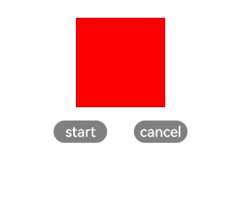

# Component Methods<a name="EN-US_TOPIC_0000001115814810"></a>

-   [this.$element\('id'\).animate\(Object, Object\)](#en-us_topic_0000001058670837_section844805134319)

After a component is assigned the  **id**  attribute, you can use the ID to obtain the component objects and call functions.

<a name="en-us_topic_0000001058670837_t16791c2761d34150a3a89954b52d1453"></a>
<table><thead align="left"><tr id="en-us_topic_0000001058670837_r0148773c052c4f38bef9962bc22a16bf"><th class="cellrowborder" valign="top" width="13.888611138886112%" id="mcps1.1.7.1.1"><p id="en-us_topic_0000001058670837_ab430207c41eb4593a9fff4377fd60b27"><a name="en-us_topic_0000001058670837_ab430207c41eb4593a9fff4377fd60b27"></a><a name="en-us_topic_0000001058670837_ab430207c41eb4593a9fff4377fd60b27"></a>Name</p>
</th>
<th class="cellrowborder" valign="top" width="25.947405259474053%" id="mcps1.1.7.1.2"><p id="en-us_topic_0000001058670837_adadb9fe3ee9d45ab8e55fad0a56ec311"><a name="en-us_topic_0000001058670837_adadb9fe3ee9d45ab8e55fad0a56ec311"></a><a name="en-us_topic_0000001058670837_adadb9fe3ee9d45ab8e55fad0a56ec311"></a>Parameter</p>
</th>
<th class="cellrowborder" valign="top" width="7.429257074292571%" id="mcps1.1.7.1.3"><p id="en-us_topic_0000001058670837_p5451162571712"><a name="en-us_topic_0000001058670837_p5451162571712"></a><a name="en-us_topic_0000001058670837_p5451162571712"></a>Mandatory</p>
</th>
<th class="cellrowborder" valign="top" width="9.2990700929907%" id="mcps1.1.7.1.4"><p id="en-us_topic_0000001058670837_ac36b82e7a5e14fb68f8dfc4d3a3aeee6"><a name="en-us_topic_0000001058670837_ac36b82e7a5e14fb68f8dfc4d3a3aeee6"></a><a name="en-us_topic_0000001058670837_ac36b82e7a5e14fb68f8dfc4d3a3aeee6"></a>Default Value</p>
</th>
<th class="cellrowborder" valign="top" width="7.519248075192481%" id="mcps1.1.7.1.5"><p id="en-us_topic_0000001058670837_p17256161265111"><a name="en-us_topic_0000001058670837_p17256161265111"></a><a name="en-us_topic_0000001058670837_p17256161265111"></a>Return Value</p>
</th>
<th class="cellrowborder" valign="top" width="35.91640835916409%" id="mcps1.1.7.1.6"><p id="en-us_topic_0000001058670837_a7a0dfce144d445e19289835b2e4c8697"><a name="en-us_topic_0000001058670837_a7a0dfce144d445e19289835b2e4c8697"></a><a name="en-us_topic_0000001058670837_a7a0dfce144d445e19289835b2e4c8697"></a>Description</p>
</th>
</tr>
</thead>
<tbody><tr id="en-us_topic_0000001058670837_row48146221457"><td class="cellrowborder" valign="top" width="13.888611138886112%" headers="mcps1.1.7.1.1 "><p id="en-us_topic_0000001058670837_p168151422164511"><a name="en-us_topic_0000001058670837_p168151422164511"></a><a name="en-us_topic_0000001058670837_p168151422164511"></a>animate</p>
<p id="en-us_topic_0000001058670837_p564915003620"><a name="en-us_topic_0000001058670837_p564915003620"></a><a name="en-us_topic_0000001058670837_p564915003620"></a></p>
</td>
<td class="cellrowborder" valign="top" width="25.947405259474053%" headers="mcps1.1.7.1.2 "><a name="en-us_topic_0000001058670837_ul97434919115"></a><a name="en-us_topic_0000001058670837_ul97434919115"></a><ul id="en-us_topic_0000001058670837_ul97434919115"><li>Object: <strong id="en-us_topic_0000001058670837_b84447498345"><a name="en-us_topic_0000001058670837_b84447498345"></a><a name="en-us_topic_0000001058670837_b84447498345"></a>keyframes</strong> is used to describe key frame parameters of the animation.</li><li>Object: <strong id="en-us_topic_0000001058670837_b15678137133510"><a name="en-us_topic_0000001058670837_b15678137133510"></a><a name="en-us_topic_0000001058670837_b15678137133510"></a>options</strong> is used to describe animation parameters.</li></ul>
</td>
<td class="cellrowborder" valign="top" width="7.429257074292571%" headers="mcps1.1.7.1.3 "><p id="en-us_topic_0000001058670837_p108159229458"><a name="en-us_topic_0000001058670837_p108159229458"></a><a name="en-us_topic_0000001058670837_p108159229458"></a>Yes</p>
</td>
<td class="cellrowborder" valign="top" width="9.2990700929907%" headers="mcps1.1.7.1.4 "><p id="en-us_topic_0000001058670837_p1181532216456"><a name="en-us_topic_0000001058670837_p1181532216456"></a><a name="en-us_topic_0000001058670837_p1181532216456"></a>-</p>
</td>
<td class="cellrowborder" valign="top" width="7.519248075192481%" headers="mcps1.1.7.1.5 "><p id="en-us_topic_0000001058670837_p6256112155112"><a name="en-us_topic_0000001058670837_p6256112155112"></a><a name="en-us_topic_0000001058670837_p6256112155112"></a>-</p>
</td>
<td class="cellrowborder" valign="top" width="35.91640835916409%" headers="mcps1.1.7.1.6 "><p id="en-us_topic_0000001058670837_p15815102244511"><a name="en-us_topic_0000001058670837_p15815102244511"></a><a name="en-us_topic_0000001058670837_p15815102244511"></a>Creates and runs an animation shortcut on the component. Specify the <strong id="en-us_topic_0000001058670837_b635643723719"><a name="en-us_topic_0000001058670837_b635643723719"></a><a name="en-us_topic_0000001058670837_b635643723719"></a>keyframes</strong> and <strong id="en-us_topic_0000001058670837_b1335713377375"><a name="en-us_topic_0000001058670837_b1335713377375"></a><a name="en-us_topic_0000001058670837_b1335713377375"></a>options</strong> required for the animation. This method returns the animation object.</p>
</td>
</tr>
</tbody>
</table>

## this.$element\('_id_'\).animate\(Object, Object\)<a name="en-us_topic_0000001058670837_section844805134319"></a>

You can use the  **animate\(keyframes, options\)**  method to obtain an animation object. This object supports properties, methods, and events of the animation component. If  **animate**  is called for multiple times and the replace policy is used, parameters passed to the last call will take effect.

-   keyframes

    <a name="en-us_topic_0000001058670837_table1491078445"></a>
    <table><thead align="left"><tr id="en-us_topic_0000001058670837_row159311381240"><th class="cellrowborder" valign="top" width="23.56%" id="mcps1.1.4.1.1"><p id="en-us_topic_0000001058670837_p79311181544"><a name="en-us_topic_0000001058670837_p79311181544"></a><a name="en-us_topic_0000001058670837_p79311181544"></a>Parameter</p>
    </th>
    <th class="cellrowborder" valign="top" width="23.95%" id="mcps1.1.4.1.2"><p id="en-us_topic_0000001058670837_p19311818417"><a name="en-us_topic_0000001058670837_p19311818417"></a><a name="en-us_topic_0000001058670837_p19311818417"></a>Type</p>
    </th>
    <th class="cellrowborder" valign="top" width="52.49%" id="mcps1.1.4.1.3"><p id="en-us_topic_0000001058670837_p17931185415"><a name="en-us_topic_0000001058670837_p17931185415"></a><a name="en-us_topic_0000001058670837_p17931185415"></a>Description</p>
    </th>
    </tr>
    </thead>
    <tbody><tr id="en-us_topic_0000001058670837_row993198749"><td class="cellrowborder" valign="top" width="23.56%" headers="mcps1.1.4.1.1 "><p id="en-us_topic_0000001058670837_p10931080410"><a name="en-us_topic_0000001058670837_p10931080410"></a><a name="en-us_topic_0000001058670837_p10931080410"></a>frames</p>
    </td>
    <td class="cellrowborder" valign="top" width="23.95%" headers="mcps1.1.4.1.2 "><p id="en-us_topic_0000001058670837_p1493113816413"><a name="en-us_topic_0000001058670837_p1493113816413"></a><a name="en-us_topic_0000001058670837_p1493113816413"></a>Array&lt;Style&gt;</p>
    </td>
    <td class="cellrowborder" valign="top" width="52.49%" headers="mcps1.1.4.1.3 "><p id="en-us_topic_0000001058670837_p15171240102918"><a name="en-us_topic_0000001058670837_p15171240102918"></a><a name="en-us_topic_0000001058670837_p15171240102918"></a>Array of objects used to set animation style attributes. For details about style attributes, see <a href="#en-us_topic_0000001058670837_table29075541349">Style attributes</a>.</p>
    </td>
    </tr>
    </tbody>
    </table>

    **Table  1**  Style attributes

    <a name="en-us_topic_0000001058670837_table29075541349"></a>
    <table><thead align="left"><tr id="en-us_topic_0000001058670837_row1961954543"><th class="cellrowborder" valign="top" width="22.91%" id="mcps1.2.5.1.1"><p id="en-us_topic_0000001058670837_p119614542419"><a name="en-us_topic_0000001058670837_p119614542419"></a><a name="en-us_topic_0000001058670837_p119614542419"></a>Parameter</p>
    </th>
    <th class="cellrowborder" valign="top" width="10.61%" id="mcps1.2.5.1.2"><p id="en-us_topic_0000001058670837_p2961954840"><a name="en-us_topic_0000001058670837_p2961954840"></a><a name="en-us_topic_0000001058670837_p2961954840"></a>Type</p>
    </th>
    <th class="cellrowborder" valign="top" width="24.58%" id="mcps1.2.5.1.3"><p id="en-us_topic_0000001058670837_p15961145416415"><a name="en-us_topic_0000001058670837_p15961145416415"></a><a name="en-us_topic_0000001058670837_p15961145416415"></a>Default Value</p>
    </th>
    <th class="cellrowborder" valign="top" width="41.9%" id="mcps1.2.5.1.4"><p id="en-us_topic_0000001058670837_p1196118542410"><a name="en-us_topic_0000001058670837_p1196118542410"></a><a name="en-us_topic_0000001058670837_p1196118542410"></a>Description</p>
    </th>
    </tr>
    </thead>
    <tbody><tr id="en-us_topic_0000001058670837_row1796113541041"><td class="cellrowborder" valign="top" width="22.91%" headers="mcps1.2.5.1.1 "><p id="en-us_topic_0000001058670837_p129615545417"><a name="en-us_topic_0000001058670837_p129615545417"></a><a name="en-us_topic_0000001058670837_p129615545417"></a>width</p>
    </td>
    <td class="cellrowborder" valign="top" width="10.61%" headers="mcps1.2.5.1.2 "><p id="en-us_topic_0000001058670837_p1296111541345"><a name="en-us_topic_0000001058670837_p1296111541345"></a><a name="en-us_topic_0000001058670837_p1296111541345"></a>number</p>
    </td>
    <td class="cellrowborder" valign="top" width="24.58%" headers="mcps1.2.5.1.3 "><p id="en-us_topic_0000001058670837_p296117541140"><a name="en-us_topic_0000001058670837_p296117541140"></a><a name="en-us_topic_0000001058670837_p296117541140"></a>-</p>
    </td>
    <td class="cellrowborder" valign="top" width="41.9%" headers="mcps1.2.5.1.4 "><p id="en-us_topic_0000001058670837_p1296112541247"><a name="en-us_topic_0000001058670837_p1296112541247"></a><a name="en-us_topic_0000001058670837_p1296112541247"></a>Width set for the component during playback of the animation.</p>
    </td>
    </tr>
    <tr id="en-us_topic_0000001058670837_row149616548418"><td class="cellrowborder" valign="top" width="22.91%" headers="mcps1.2.5.1.1 "><p id="en-us_topic_0000001058670837_p14961654846"><a name="en-us_topic_0000001058670837_p14961654846"></a><a name="en-us_topic_0000001058670837_p14961654846"></a>height</p>
    </td>
    <td class="cellrowborder" valign="top" width="10.61%" headers="mcps1.2.5.1.2 "><p id="en-us_topic_0000001058670837_p1296113545416"><a name="en-us_topic_0000001058670837_p1296113545416"></a><a name="en-us_topic_0000001058670837_p1296113545416"></a>number</p>
    </td>
    <td class="cellrowborder" valign="top" width="24.58%" headers="mcps1.2.5.1.3 "><p id="en-us_topic_0000001058670837_p11462818125515"><a name="en-us_topic_0000001058670837_p11462818125515"></a><a name="en-us_topic_0000001058670837_p11462818125515"></a>-</p>
    </td>
    <td class="cellrowborder" valign="top" width="41.9%" headers="mcps1.2.5.1.4 "><p id="en-us_topic_0000001058670837_p1696216541448"><a name="en-us_topic_0000001058670837_p1696216541448"></a><a name="en-us_topic_0000001058670837_p1696216541448"></a>Height set for the component during playback of the animation.</p>
    </td>
    </tr>
    <tr id="en-us_topic_0000001058670837_row1962754242"><td class="cellrowborder" valign="top" width="22.91%" headers="mcps1.2.5.1.1 "><p id="en-us_topic_0000001058670837_p14962145418411"><a name="en-us_topic_0000001058670837_p14962145418411"></a><a name="en-us_topic_0000001058670837_p14962145418411"></a>backgroundColor</p>
    </td>
    <td class="cellrowborder" valign="top" width="10.61%" headers="mcps1.2.5.1.2 "><p id="en-us_topic_0000001058670837_p09628541446"><a name="en-us_topic_0000001058670837_p09628541446"></a><a name="en-us_topic_0000001058670837_p09628541446"></a>&lt;color&gt;</p>
    </td>
    <td class="cellrowborder" valign="top" width="24.58%" headers="mcps1.2.5.1.3 "><p id="en-us_topic_0000001058670837_p39621754042"><a name="en-us_topic_0000001058670837_p39621754042"></a><a name="en-us_topic_0000001058670837_p39621754042"></a>none</p>
    </td>
    <td class="cellrowborder" valign="top" width="41.9%" headers="mcps1.2.5.1.4 "><p id="en-us_topic_0000001058670837_p11962125420412"><a name="en-us_topic_0000001058670837_p11962125420412"></a><a name="en-us_topic_0000001058670837_p11962125420412"></a>Background color set for the component during playback of the animation.</p>
    </td>
    </tr>
    <tr id="en-us_topic_0000001058670837_row99623548410"><td class="cellrowborder" valign="top" width="22.91%" headers="mcps1.2.5.1.1 "><p id="en-us_topic_0000001058670837_p1896216541345"><a name="en-us_topic_0000001058670837_p1896216541345"></a><a name="en-us_topic_0000001058670837_p1896216541345"></a>opacity</p>
    </td>
    <td class="cellrowborder" valign="top" width="10.61%" headers="mcps1.2.5.1.2 "><p id="en-us_topic_0000001058670837_p12409238152914"><a name="en-us_topic_0000001058670837_p12409238152914"></a><a name="en-us_topic_0000001058670837_p12409238152914"></a>number</p>
    </td>
    <td class="cellrowborder" valign="top" width="24.58%" headers="mcps1.2.5.1.3 "><p id="en-us_topic_0000001058670837_p6962354649"><a name="en-us_topic_0000001058670837_p6962354649"></a><a name="en-us_topic_0000001058670837_p6962354649"></a>1</p>
    </td>
    <td class="cellrowborder" valign="top" width="41.9%" headers="mcps1.2.5.1.4 "><p id="en-us_topic_0000001058670837_p1696275417410"><a name="en-us_topic_0000001058670837_p1696275417410"></a><a name="en-us_topic_0000001058670837_p1696275417410"></a>Opacity set for the component. The value ranges from <strong id="en-us_topic_0000001058670837_b76363459372"><a name="en-us_topic_0000001058670837_b76363459372"></a><a name="en-us_topic_0000001058670837_b76363459372"></a>0</strong> to <strong id="en-us_topic_0000001058670837_b1964116457373"><a name="en-us_topic_0000001058670837_b1964116457373"></a><a name="en-us_topic_0000001058670837_b1964116457373"></a>1</strong>.</p>
    </td>
    </tr>
    <tr id="en-us_topic_0000001058670837_row6141915145917"><td class="cellrowborder" valign="top" width="22.91%" headers="mcps1.2.5.1.1 "><p id="en-us_topic_0000001058670837_p14778012599"><a name="en-us_topic_0000001058670837_p14778012599"></a><a name="en-us_topic_0000001058670837_p14778012599"></a>backgroundPosition</p>
    </td>
    <td class="cellrowborder" valign="top" width="10.61%" headers="mcps1.2.5.1.2 "><p id="en-us_topic_0000001058670837_p151419151591"><a name="en-us_topic_0000001058670837_p151419151591"></a><a name="en-us_topic_0000001058670837_p151419151591"></a>string</p>
    </td>
    <td class="cellrowborder" valign="top" width="24.58%" headers="mcps1.2.5.1.3 "><p id="en-us_topic_0000001058670837_p11551505916"><a name="en-us_topic_0000001058670837_p11551505916"></a><a name="en-us_topic_0000001058670837_p11551505916"></a>-</p>
    </td>
    <td class="cellrowborder" valign="top" width="41.9%" headers="mcps1.2.5.1.4 "><p id="en-us_topic_0000001058670837_p615181514596"><a name="en-us_topic_0000001058670837_p615181514596"></a><a name="en-us_topic_0000001058670837_p615181514596"></a>The value format is <strong id="en-us_topic_0000001058670837_b49364643719"><a name="en-us_topic_0000001058670837_b49364643719"></a><a name="en-us_topic_0000001058670837_b49364643719"></a>x y</strong>, in percentage or pixels.</p>
    <p id="en-us_topic_0000001058670837_p74641623022"><a name="en-us_topic_0000001058670837_p74641623022"></a><a name="en-us_topic_0000001058670837_p74641623022"></a>The first value indicates the horizontal position, and the second value indicates the vertical position.</p>
    <p id="en-us_topic_0000001058670837_p5609351927"><a name="en-us_topic_0000001058670837_p5609351927"></a><a name="en-us_topic_0000001058670837_p5609351927"></a>If only one value is specified, the other value is <strong id="en-us_topic_0000001058670837_b2860446193717"><a name="en-us_topic_0000001058670837_b2860446193717"></a><a name="en-us_topic_0000001058670837_b2860446193717"></a>50%</strong> by default.</p>
    </td>
    </tr>
    <tr id="en-us_topic_0000001058670837_row8962754643"><td class="cellrowborder" valign="top" width="22.91%" headers="mcps1.2.5.1.1 "><p id="en-us_topic_0000001058670837_p7962145414417"><a name="en-us_topic_0000001058670837_p7962145414417"></a><a name="en-us_topic_0000001058670837_p7962145414417"></a>transformOrigin</p>
    </td>
    <td class="cellrowborder" valign="top" width="10.61%" headers="mcps1.2.5.1.2 "><p id="en-us_topic_0000001058670837_p896213541048"><a name="en-us_topic_0000001058670837_p896213541048"></a><a name="en-us_topic_0000001058670837_p896213541048"></a>string</p>
    </td>
    <td class="cellrowborder" valign="top" width="24.58%" headers="mcps1.2.5.1.3 "><p id="en-us_topic_0000001058670837_p169621454340"><a name="en-us_topic_0000001058670837_p169621454340"></a><a name="en-us_topic_0000001058670837_p169621454340"></a>'center center'</p>
    </td>
    <td class="cellrowborder" valign="top" width="41.9%" headers="mcps1.2.5.1.4 "><p id="en-us_topic_0000001058670837_p12962115415412"><a name="en-us_topic_0000001058670837_p12962115415412"></a><a name="en-us_topic_0000001058670837_p12962115415412"></a>Origin position of the transformed element.</p>
    <p id="en-us_topic_0000001058670837_p193331521134020"><a name="en-us_topic_0000001058670837_p193331521134020"></a><a name="en-us_topic_0000001058670837_p193331521134020"></a>The first value indicates the x-axis position. The value can be <strong id="en-us_topic_0000001058670837_b20914191218395"><a name="en-us_topic_0000001058670837_b20914191218395"></a><a name="en-us_topic_0000001058670837_b20914191218395"></a>left</strong>, <strong id="en-us_topic_0000001058670837_b16915141233913"><a name="en-us_topic_0000001058670837_b16915141233913"></a><a name="en-us_topic_0000001058670837_b16915141233913"></a>center</strong>, <strong id="en-us_topic_0000001058670837_b1591571233911"><a name="en-us_topic_0000001058670837_b1591571233911"></a><a name="en-us_topic_0000001058670837_b1591571233911"></a>right</strong>, a length, or a percentage.</p>
    <p id="en-us_topic_0000001058670837_p6457202144018"><a name="en-us_topic_0000001058670837_p6457202144018"></a><a name="en-us_topic_0000001058670837_p6457202144018"></a>The second value indicates the y-axis position. The value can be <strong id="en-us_topic_0000001058670837_b15935411173916"><a name="en-us_topic_0000001058670837_b15935411173916"></a><a name="en-us_topic_0000001058670837_b15935411173916"></a>top</strong>, <strong id="en-us_topic_0000001058670837_b994031111394"><a name="en-us_topic_0000001058670837_b994031111394"></a><a name="en-us_topic_0000001058670837_b994031111394"></a>center</strong>, <strong id="en-us_topic_0000001058670837_b19411111163910"><a name="en-us_topic_0000001058670837_b19411111163910"></a><a name="en-us_topic_0000001058670837_b19411111163910"></a>bottom</strong>, a length, or a percentage.</p>
    </td>
    </tr>
    <tr id="en-us_topic_0000001058670837_row496214548419"><td class="cellrowborder" valign="top" width="22.91%" headers="mcps1.2.5.1.1 "><p id="en-us_topic_0000001058670837_p139621354144"><a name="en-us_topic_0000001058670837_p139621354144"></a><a name="en-us_topic_0000001058670837_p139621354144"></a>transform</p>
    </td>
    <td class="cellrowborder" valign="top" width="10.61%" headers="mcps1.2.5.1.2 "><p id="en-us_topic_0000001058670837_p189624543418"><a name="en-us_topic_0000001058670837_p189624543418"></a><a name="en-us_topic_0000001058670837_p189624543418"></a><a href="animation-styles.md#en-us_topic_0000001058830799_table28802443315">Transform</a></p>
    </td>
    <td class="cellrowborder" valign="top" width="24.58%" headers="mcps1.2.5.1.3 "><p id="en-us_topic_0000001058670837_p1896218541242"><a name="en-us_topic_0000001058670837_p1896218541242"></a><a name="en-us_topic_0000001058670837_p1896218541242"></a>-</p>
    </td>
    <td class="cellrowborder" valign="top" width="41.9%" headers="mcps1.2.5.1.4 "><p id="en-us_topic_0000001058670837_p19962454547"><a name="en-us_topic_0000001058670837_p19962454547"></a><a name="en-us_topic_0000001058670837_p19962454547"></a>Transformation type set for a transformed element.</p>
    </td>
    </tr>
    <tr id="en-us_topic_0000001058670837_row18717853325"><td class="cellrowborder" valign="top" width="22.91%" headers="mcps1.2.5.1.1 "><p id="en-us_topic_0000001058670837_p197170513218"><a name="en-us_topic_0000001058670837_p197170513218"></a><a name="en-us_topic_0000001058670837_p197170513218"></a>offset</p>
    </td>
    <td class="cellrowborder" valign="top" width="10.61%" headers="mcps1.2.5.1.2 "><p id="en-us_topic_0000001058670837_p207175553213"><a name="en-us_topic_0000001058670837_p207175553213"></a><a name="en-us_topic_0000001058670837_p207175553213"></a>number</p>
    </td>
    <td class="cellrowborder" valign="top" width="24.58%" headers="mcps1.2.5.1.3 "><p id="en-us_topic_0000001058670837_p1171719518322"><a name="en-us_topic_0000001058670837_p1171719518322"></a><a name="en-us_topic_0000001058670837_p1171719518322"></a>-</p>
    </td>
    <td class="cellrowborder" valign="top" width="41.9%" headers="mcps1.2.5.1.4 "><a name="en-us_topic_0000001058670837_ul768313101318"></a><a name="en-us_topic_0000001058670837_ul768313101318"></a><ul id="en-us_topic_0000001058670837_ul768313101318"><li>The value of <strong id="en-us_topic_0000001058670837_b0754154863713"><a name="en-us_topic_0000001058670837_b0754154863713"></a><a name="en-us_topic_0000001058670837_b0754154863713"></a>offset</strong> must be within (0.0,1.0] and sorted in ascending order if it is provided.</li><li>If there are only two frames, <strong id="en-us_topic_0000001058670837_b10139164983712"><a name="en-us_topic_0000001058670837_b10139164983712"></a><a name="en-us_topic_0000001058670837_b10139164983712"></a>offset</strong> can be left empty.</li><li>If there are more than two frames, <strong id="en-us_topic_0000001058670837_b1271014953717"><a name="en-us_topic_0000001058670837_b1271014953717"></a><a name="en-us_topic_0000001058670837_b1271014953717"></a>offset</strong> is mandatory.</li></ul>
    </td>
    </tr>
    </tbody>
    </table>


-   options attributes

    <a name="en-us_topic_0000001058670837_table1712913269619"></a>
    <table><thead align="left"><tr id="en-us_topic_0000001058670837_row3169626264"><th class="cellrowborder" valign="top" width="25%" id="mcps1.1.5.1.1"><p id="en-us_topic_0000001058670837_p111694262068"><a name="en-us_topic_0000001058670837_p111694262068"></a><a name="en-us_topic_0000001058670837_p111694262068"></a>Parameter</p>
    </th>
    <th class="cellrowborder" valign="top" width="25%" id="mcps1.1.5.1.2"><p id="en-us_topic_0000001058670837_p101691267618"><a name="en-us_topic_0000001058670837_p101691267618"></a><a name="en-us_topic_0000001058670837_p101691267618"></a>Type</p>
    </th>
    <th class="cellrowborder" valign="top" width="25%" id="mcps1.1.5.1.3"><p id="en-us_topic_0000001058670837_p171699268617"><a name="en-us_topic_0000001058670837_p171699268617"></a><a name="en-us_topic_0000001058670837_p171699268617"></a>Default Value</p>
    </th>
    <th class="cellrowborder" valign="top" width="25%" id="mcps1.1.5.1.4"><p id="en-us_topic_0000001058670837_p816916264611"><a name="en-us_topic_0000001058670837_p816916264611"></a><a name="en-us_topic_0000001058670837_p816916264611"></a>Description</p>
    </th>
    </tr>
    </thead>
    <tbody><tr id="en-us_topic_0000001058670837_row1816912611616"><td class="cellrowborder" valign="top" width="25%" headers="mcps1.1.5.1.1 "><p id="en-us_topic_0000001058670837_p1716918267611"><a name="en-us_topic_0000001058670837_p1716918267611"></a><a name="en-us_topic_0000001058670837_p1716918267611"></a>duration</p>
    </td>
    <td class="cellrowborder" valign="top" width="25%" headers="mcps1.1.5.1.2 "><p id="en-us_topic_0000001058670837_p1216917260615"><a name="en-us_topic_0000001058670837_p1216917260615"></a><a name="en-us_topic_0000001058670837_p1216917260615"></a>number</p>
    </td>
    <td class="cellrowborder" valign="top" width="25%" headers="mcps1.1.5.1.3 "><p id="en-us_topic_0000001058670837_p21694261366"><a name="en-us_topic_0000001058670837_p21694261366"></a><a name="en-us_topic_0000001058670837_p21694261366"></a>0</p>
    </td>
    <td class="cellrowborder" valign="top" width="25%" headers="mcps1.1.5.1.4 "><p id="en-us_topic_0000001058670837_p1816917261763"><a name="en-us_topic_0000001058670837_p1816917261763"></a><a name="en-us_topic_0000001058670837_p1816917261763"></a>Duration for playing the animation, in milliseconds.</p>
    </td>
    </tr>
    <tr id="en-us_topic_0000001058670837_row5169172616611"><td class="cellrowborder" valign="top" width="25%" headers="mcps1.1.5.1.1 "><p id="en-us_topic_0000001058670837_p16169182610613"><a name="en-us_topic_0000001058670837_p16169182610613"></a><a name="en-us_topic_0000001058670837_p16169182610613"></a>easing</p>
    </td>
    <td class="cellrowborder" valign="top" width="25%" headers="mcps1.1.5.1.2 "><p id="en-us_topic_0000001058670837_p171691526966"><a name="en-us_topic_0000001058670837_p171691526966"></a><a name="en-us_topic_0000001058670837_p171691526966"></a>string</p>
    </td>
    <td class="cellrowborder" valign="top" width="25%" headers="mcps1.1.5.1.3 "><p id="en-us_topic_0000001058670837_p316913261769"><a name="en-us_topic_0000001058670837_p316913261769"></a><a name="en-us_topic_0000001058670837_p316913261769"></a>linear</p>
    </td>
    <td class="cellrowborder" valign="top" width="25%" headers="mcps1.1.5.1.4 "><p id="en-us_topic_0000001058670837_p91704263615"><a name="en-us_topic_0000001058670837_p91704263615"></a><a name="en-us_topic_0000001058670837_p91704263615"></a>Time curve of the animation. For details about the supported types, see <a href="#en-us_topic_0000001058670837_table333619566611">Available values of the easing attribute</a>.</p>
    </td>
    </tr>
    <tr id="en-us_topic_0000001058670837_row1417032616613"><td class="cellrowborder" valign="top" width="25%" headers="mcps1.1.5.1.1 "><p id="en-us_topic_0000001058670837_p1917011266616"><a name="en-us_topic_0000001058670837_p1917011266616"></a><a name="en-us_topic_0000001058670837_p1917011266616"></a>delay</p>
    </td>
    <td class="cellrowborder" valign="top" width="25%" headers="mcps1.1.5.1.2 "><p id="en-us_topic_0000001058670837_p101701826863"><a name="en-us_topic_0000001058670837_p101701826863"></a><a name="en-us_topic_0000001058670837_p101701826863"></a>number</p>
    </td>
    <td class="cellrowborder" valign="top" width="25%" headers="mcps1.1.5.1.3 "><p id="en-us_topic_0000001058670837_p2170172616616"><a name="en-us_topic_0000001058670837_p2170172616616"></a><a name="en-us_topic_0000001058670837_p2170172616616"></a>0</p>
    </td>
    <td class="cellrowborder" valign="top" width="25%" headers="mcps1.1.5.1.4 "><p id="en-us_topic_0000001058670837_p1617013261364"><a name="en-us_topic_0000001058670837_p1617013261364"></a><a name="en-us_topic_0000001058670837_p1617013261364"></a>Delay for the animation start. The default value indicates no delay.</p>
    </td>
    </tr>
    <tr id="en-us_topic_0000001058670837_row1217013262613"><td class="cellrowborder" valign="top" width="25%" headers="mcps1.1.5.1.1 "><p id="en-us_topic_0000001058670837_p21701526462"><a name="en-us_topic_0000001058670837_p21701526462"></a><a name="en-us_topic_0000001058670837_p21701526462"></a>iterations</p>
    </td>
    <td class="cellrowborder" valign="top" width="25%" headers="mcps1.1.5.1.2 "><p id="en-us_topic_0000001058670837_p1376895573910"><a name="en-us_topic_0000001058670837_p1376895573910"></a><a name="en-us_topic_0000001058670837_p1376895573910"></a>number | string</p>
    </td>
    <td class="cellrowborder" valign="top" width="25%" headers="mcps1.1.5.1.3 "><p id="en-us_topic_0000001058670837_p151701526064"><a name="en-us_topic_0000001058670837_p151701526064"></a><a name="en-us_topic_0000001058670837_p151701526064"></a>1</p>
    </td>
    <td class="cellrowborder" valign="top" width="25%" headers="mcps1.1.5.1.4 "><p id="en-us_topic_0000001058670837_p917062619617"><a name="en-us_topic_0000001058670837_p917062619617"></a><a name="en-us_topic_0000001058670837_p917062619617"></a>Number of times the animation will be played. <strong id="en-us_topic_0000001058670837_b1119019523812"><a name="en-us_topic_0000001058670837_b1119019523812"></a><a name="en-us_topic_0000001058670837_b1119019523812"></a>number</strong> indicates a fixed number of playback operations, and <strong id="en-us_topic_0000001058670837_b319110563816"><a name="en-us_topic_0000001058670837_b319110563816"></a><a name="en-us_topic_0000001058670837_b319110563816"></a>Infinity</strong> indicates an unlimited number of playback operations.</p>
    </td>
    </tr>
    <tr id="en-us_topic_0000001058670837_row3170192617615"><td class="cellrowborder" valign="top" width="25%" headers="mcps1.1.5.1.1 "><p id="en-us_topic_0000001058670837_p121708261267"><a name="en-us_topic_0000001058670837_p121708261267"></a><a name="en-us_topic_0000001058670837_p121708261267"></a>fill</p>
    </td>
    <td class="cellrowborder" valign="top" width="25%" headers="mcps1.1.5.1.2 "><p id="en-us_topic_0000001058670837_p417011261765"><a name="en-us_topic_0000001058670837_p417011261765"></a><a name="en-us_topic_0000001058670837_p417011261765"></a>string</p>
    </td>
    <td class="cellrowborder" valign="top" width="25%" headers="mcps1.1.5.1.3 "><p id="en-us_topic_0000001058670837_p1617022612616"><a name="en-us_topic_0000001058670837_p1617022612616"></a><a name="en-us_topic_0000001058670837_p1617022612616"></a>none</p>
    </td>
    <td class="cellrowborder" valign="top" width="25%" headers="mcps1.1.5.1.4 "><p id="en-us_topic_0000001058670837_p1971424075711"><a name="en-us_topic_0000001058670837_p1971424075711"></a><a name="en-us_topic_0000001058670837_p1971424075711"></a>Start and end styles of the animation</p>
    <p id="en-us_topic_0000001058670837_p471416406576"><a name="en-us_topic_0000001058670837_p471416406576"></a><a name="en-us_topic_0000001058670837_p471416406576"></a><strong id="en-us_topic_0000001058670837_b1223953919471"><a name="en-us_topic_0000001058670837_b1223953919471"></a><a name="en-us_topic_0000001058670837_b1223953919471"></a>none</strong>: No style is applied to the target before or after the animation is executed.</p>
    <p id="en-us_topic_0000001058670837_p371416405575"><a name="en-us_topic_0000001058670837_p371416405575"></a><a name="en-us_topic_0000001058670837_p371416405575"></a><strong id="en-us_topic_0000001058670837_b16571436154715"><a name="en-us_topic_0000001058670837_b16571436154715"></a><a name="en-us_topic_0000001058670837_b16571436154715"></a>forwards</strong>: The target keeps the state at the end of the animation (defined in the last key frame) after the animation is executed.</p>
    </td>
    </tr>
    </tbody>
    </table>

    **Table  2**  Available values of the easing attribute

    <a name="en-us_topic_0000001058670837_table333619566611"></a>
    <table><thead align="left"><tr id="en-us_topic_0000001058670837_row19392195612614"><th class="cellrowborder" valign="top" width="50%" id="mcps1.2.3.1.1"><p id="en-us_topic_0000001058670837_p23927561168"><a name="en-us_topic_0000001058670837_p23927561168"></a><a name="en-us_topic_0000001058670837_p23927561168"></a>Type</p>
    </th>
    <th class="cellrowborder" valign="top" width="50%" id="mcps1.2.3.1.2"><p id="en-us_topic_0000001058670837_p83924562061"><a name="en-us_topic_0000001058670837_p83924562061"></a><a name="en-us_topic_0000001058670837_p83924562061"></a>Description</p>
    </th>
    </tr>
    </thead>
    <tbody><tr id="en-us_topic_0000001058670837_row039210561966"><td class="cellrowborder" valign="top" width="50%" headers="mcps1.2.3.1.1 "><p id="en-us_topic_0000001058670837_p18392145619610"><a name="en-us_topic_0000001058670837_p18392145619610"></a><a name="en-us_topic_0000001058670837_p18392145619610"></a>linear</p>
    </td>
    <td class="cellrowborder" valign="top" width="50%" headers="mcps1.2.3.1.2 "><p id="en-us_topic_0000001058670837_p18393256963"><a name="en-us_topic_0000001058670837_p18393256963"></a><a name="en-us_topic_0000001058670837_p18393256963"></a>The animation speed keeps unchanged.</p>
    </td>
    </tr>
    <tr id="en-us_topic_0000001058670837_row203934561665"><td class="cellrowborder" valign="top" width="50%" headers="mcps1.2.3.1.1 "><p id="en-us_topic_0000001058670837_p539314563614"><a name="en-us_topic_0000001058670837_p539314563614"></a><a name="en-us_topic_0000001058670837_p539314563614"></a>ease-in</p>
    </td>
    <td class="cellrowborder" valign="top" width="50%" headers="mcps1.2.3.1.2 "><p id="en-us_topic_0000001058670837_p5393185617615"><a name="en-us_topic_0000001058670837_p5393185617615"></a><a name="en-us_topic_0000001058670837_p5393185617615"></a>The animation starts at a low speed. <strong id="en-us_topic_0000001058670837_b378417512383"><a name="en-us_topic_0000001058670837_b378417512383"></a><a name="en-us_topic_0000001058670837_b378417512383"></a>cubic-bezier(0.42, 0.0, 1.0, 1.0)</strong>.</p>
    </td>
    </tr>
    <tr id="en-us_topic_0000001058670837_row9393185610620"><td class="cellrowborder" valign="top" width="50%" headers="mcps1.2.3.1.1 "><p id="en-us_topic_0000001058670837_p639311569615"><a name="en-us_topic_0000001058670837_p639311569615"></a><a name="en-us_topic_0000001058670837_p639311569615"></a>ease-out</p>
    </td>
    <td class="cellrowborder" valign="top" width="50%" headers="mcps1.2.3.1.2 "><p id="en-us_topic_0000001058670837_p639315620619"><a name="en-us_topic_0000001058670837_p639315620619"></a><a name="en-us_topic_0000001058670837_p639315620619"></a>The animation ends at a low speed. <strong id="en-us_topic_0000001058670837_b715465119387"><a name="en-us_topic_0000001058670837_b715465119387"></a><a name="en-us_topic_0000001058670837_b715465119387"></a>cubic-bezier(0.0, 0.0, 0.58, 1.0)</strong>.</p>
    </td>
    </tr>
    <tr id="en-us_topic_0000001058670837_row4393956664"><td class="cellrowborder" valign="top" width="50%" headers="mcps1.2.3.1.1 "><p id="en-us_topic_0000001058670837_p7393856160"><a name="en-us_topic_0000001058670837_p7393856160"></a><a name="en-us_topic_0000001058670837_p7393856160"></a>ease-in-out</p>
    </td>
    <td class="cellrowborder" valign="top" width="50%" headers="mcps1.2.3.1.2 "><p id="en-us_topic_0000001058670837_p2039311561561"><a name="en-us_topic_0000001058670837_p2039311561561"></a><a name="en-us_topic_0000001058670837_p2039311561561"></a>The animation starts and ends at a low speed. <strong id="en-us_topic_0000001058670837_b1526650183812"><a name="en-us_topic_0000001058670837_b1526650183812"></a><a name="en-us_topic_0000001058670837_b1526650183812"></a>cubic-bezier(0.42, 0.0, 0.58, 1.0)</strong>.</p>
    </td>
    </tr>
    <tr id="en-us_topic_0000001058670837_row43934562061"><td class="cellrowborder" valign="top" width="50%" headers="mcps1.2.3.1.1 "><p id="en-us_topic_0000001058670837_p13931656662"><a name="en-us_topic_0000001058670837_p13931656662"></a><a name="en-us_topic_0000001058670837_p13931656662"></a>friction</p>
    </td>
    <td class="cellrowborder" valign="top" width="50%" headers="mcps1.2.3.1.2 "><p id="en-us_topic_0000001058670837_p339315562064"><a name="en-us_topic_0000001058670837_p339315562064"></a><a name="en-us_topic_0000001058670837_p339315562064"></a>Damping curve, <strong id="en-us_topic_0000001058670837_b2065404720381"><a name="en-us_topic_0000001058670837_b2065404720381"></a><a name="en-us_topic_0000001058670837_b2065404720381"></a>cubic-bezier(0.2, 0.0, 0.2, 1.0)</strong>.</p>
    </td>
    </tr>
    <tr id="en-us_topic_0000001058670837_row2039345616616"><td class="cellrowborder" valign="top" width="50%" headers="mcps1.2.3.1.1 "><p id="en-us_topic_0000001058670837_p43936565617"><a name="en-us_topic_0000001058670837_p43936565617"></a><a name="en-us_topic_0000001058670837_p43936565617"></a>extreme-deceleration</p>
    </td>
    <td class="cellrowborder" valign="top" width="50%" headers="mcps1.2.3.1.2 "><p id="en-us_topic_0000001058670837_p6393956065"><a name="en-us_topic_0000001058670837_p6393956065"></a><a name="en-us_topic_0000001058670837_p6393956065"></a>Extreme deceleration curve, <strong id="en-us_topic_0000001058670837_b84625466389"><a name="en-us_topic_0000001058670837_b84625466389"></a><a name="en-us_topic_0000001058670837_b84625466389"></a>cubic-bezier(0.0, 0.0, 0.0, 1.0)</strong>.</p>
    </td>
    </tr>
    <tr id="en-us_topic_0000001058670837_row163933564615"><td class="cellrowborder" valign="top" width="50%" headers="mcps1.2.3.1.1 "><p id="en-us_topic_0000001058670837_p73947561967"><a name="en-us_topic_0000001058670837_p73947561967"></a><a name="en-us_topic_0000001058670837_p73947561967"></a>sharp</p>
    </td>
    <td class="cellrowborder" valign="top" width="50%" headers="mcps1.2.3.1.2 "><p id="en-us_topic_0000001058670837_p20394165617615"><a name="en-us_topic_0000001058670837_p20394165617615"></a><a name="en-us_topic_0000001058670837_p20394165617615"></a>Sharp curve, <strong id="en-us_topic_0000001058670837_b13866045193817"><a name="en-us_topic_0000001058670837_b13866045193817"></a><a name="en-us_topic_0000001058670837_b13866045193817"></a>cubic-bezier(0.33, 0.0, 0.67, 1.0)</strong>.</p>
    </td>
    </tr>
    <tr id="en-us_topic_0000001058670837_row639413561566"><td class="cellrowborder" valign="top" width="50%" headers="mcps1.2.3.1.1 "><p id="en-us_topic_0000001058670837_p339417561663"><a name="en-us_topic_0000001058670837_p339417561663"></a><a name="en-us_topic_0000001058670837_p339417561663"></a>rhythm</p>
    </td>
    <td class="cellrowborder" valign="top" width="50%" headers="mcps1.2.3.1.2 "><p id="en-us_topic_0000001058670837_p839465611617"><a name="en-us_topic_0000001058670837_p839465611617"></a><a name="en-us_topic_0000001058670837_p839465611617"></a>Rhythm curve, <strong id="en-us_topic_0000001058670837_b1230104513388"><a name="en-us_topic_0000001058670837_b1230104513388"></a><a name="en-us_topic_0000001058670837_b1230104513388"></a>cubic-bezier(0.7, 0.0, 0.2, 1.0)</strong>.</p>
    </td>
    </tr>
    <tr id="en-us_topic_0000001058670837_row13949567614"><td class="cellrowborder" valign="top" width="50%" headers="mcps1.2.3.1.1 "><p id="en-us_topic_0000001058670837_p1539465619615"><a name="en-us_topic_0000001058670837_p1539465619615"></a><a name="en-us_topic_0000001058670837_p1539465619615"></a>smooth</p>
    </td>
    <td class="cellrowborder" valign="top" width="50%" headers="mcps1.2.3.1.2 "><p id="en-us_topic_0000001058670837_p193943561869"><a name="en-us_topic_0000001058670837_p193943561869"></a><a name="en-us_topic_0000001058670837_p193943561869"></a>Smooth curve, <strong id="en-us_topic_0000001058670837_b8396144416387"><a name="en-us_topic_0000001058670837_b8396144416387"></a><a name="en-us_topic_0000001058670837_b8396144416387"></a>cubic-bezier(0.4, 0.0, 0.4, 1.0)</strong>.</p>
    </td>
    </tr>
    <tr id="en-us_topic_0000001058670837_row1239419567619"><td class="cellrowborder" valign="top" width="50%" headers="mcps1.2.3.1.1 "><p id="en-us_topic_0000001058670837_p93949565611"><a name="en-us_topic_0000001058670837_p93949565611"></a><a name="en-us_topic_0000001058670837_p93949565611"></a>cubic-bezier(x1, y1, x2, y2)</p>
    </td>
    <td class="cellrowborder" valign="top" width="50%" headers="mcps1.2.3.1.2 "><p id="en-us_topic_0000001058670837_p53949561367"><a name="en-us_topic_0000001058670837_p53949561367"></a><a name="en-us_topic_0000001058670837_p53949561367"></a>You can customize an animation speed curve in the <strong id="en-us_topic_0000001058670837_b55061643143812"><a name="en-us_topic_0000001058670837_b55061643143812"></a><a name="en-us_topic_0000001058670837_b55061643143812"></a>cubic-bezier()</strong> function. The x and y values of each input parameter must be between 0 and 1.</p>
    </td>
    </tr>
    <tr id="en-us_topic_0000001058670837_row6122121135610"><td class="cellrowborder" valign="top" width="50%" headers="mcps1.2.3.1.1 "><p id="en-us_topic_0000001058670837_p412312119563"><a name="en-us_topic_0000001058670837_p412312119563"></a><a name="en-us_topic_0000001058670837_p412312119563"></a>steps(number, step-position)</p>
    </td>
    <td class="cellrowborder" valign="top" width="50%" headers="mcps1.2.3.1.2 "><p id="en-us_topic_0000001058670837_p136207354569"><a name="en-us_topic_0000001058670837_p136207354569"></a><a name="en-us_topic_0000001058670837_p136207354569"></a>Step curve.</p>
    <p id="en-us_topic_0000001058670837_p1620173511567"><a name="en-us_topic_0000001058670837_p1620173511567"></a><a name="en-us_topic_0000001058670837_p1620173511567"></a>The <strong id="en-us_topic_0000001058670837_b1284724173817"><a name="en-us_topic_0000001058670837_b1284724173817"></a><a name="en-us_topic_0000001058670837_b1284724173817"></a>number</strong> must be set and only an integer is supported.</p>
    <p id="en-us_topic_0000001058670837_p1762063510562"><a name="en-us_topic_0000001058670837_p1762063510562"></a><a name="en-us_topic_0000001058670837_p1762063510562"></a><strong id="en-us_topic_0000001058670837_b641613384388"><a name="en-us_topic_0000001058670837_b641613384388"></a><a name="en-us_topic_0000001058670837_b641613384388"></a>step-position</strong> is optional. It can be set to <strong id="en-us_topic_0000001058670837_b1942217380382"><a name="en-us_topic_0000001058670837_b1942217380382"></a><a name="en-us_topic_0000001058670837_b1942217380382"></a>start</strong> or <strong id="en-us_topic_0000001058670837_b1742333823814"><a name="en-us_topic_0000001058670837_b1742333823814"></a><a name="en-us_topic_0000001058670837_b1742333823814"></a>end</strong>. The default value is <strong id="en-us_topic_0000001058670837_b1842373863819"><a name="en-us_topic_0000001058670837_b1842373863819"></a><a name="en-us_topic_0000001058670837_b1842373863819"></a>end</strong>.</p>
    </td>
    </tr>
    </tbody>
    </table>


-   Return value

    Attributes supported by the animation object

    <a name="en-us_topic_0000001058670837_table11261733574"></a>
    <table><thead align="left"><tr id="en-us_topic_0000001058670837_row2029411331076"><th class="cellrowborder" valign="top" width="16.48%" id="mcps1.1.4.1.1"><p id="en-us_topic_0000001058670837_p629463316716"><a name="en-us_topic_0000001058670837_p629463316716"></a><a name="en-us_topic_0000001058670837_p629463316716"></a>Attribute</p>
    </th>
    <th class="cellrowborder" valign="top" width="20.46%" id="mcps1.1.4.1.2"><p id="en-us_topic_0000001058670837_p129411331718"><a name="en-us_topic_0000001058670837_p129411331718"></a><a name="en-us_topic_0000001058670837_p129411331718"></a>Type</p>
    </th>
    <th class="cellrowborder" valign="top" width="63.06%" id="mcps1.1.4.1.3"><p id="en-us_topic_0000001058670837_p11294123317716"><a name="en-us_topic_0000001058670837_p11294123317716"></a><a name="en-us_topic_0000001058670837_p11294123317716"></a>Description</p>
    </th>
    </tr>
    </thead>
    <tbody><tr id="en-us_topic_0000001058670837_row1429417331711"><td class="cellrowborder" valign="top" width="16.48%" headers="mcps1.1.4.1.1 "><p id="en-us_topic_0000001058670837_p1429416331375"><a name="en-us_topic_0000001058670837_p1429416331375"></a><a name="en-us_topic_0000001058670837_p1429416331375"></a>finished</p>
    </td>
    <td class="cellrowborder" valign="top" width="20.46%" headers="mcps1.1.4.1.2 "><p id="en-us_topic_0000001058670837_p52943334720"><a name="en-us_topic_0000001058670837_p52943334720"></a><a name="en-us_topic_0000001058670837_p52943334720"></a>boolean</p>
    </td>
    <td class="cellrowborder" valign="top" width="63.06%" headers="mcps1.1.4.1.3 "><p id="en-us_topic_0000001058670837_p7294233876"><a name="en-us_topic_0000001058670837_p7294233876"></a><a name="en-us_topic_0000001058670837_p7294233876"></a>Read-only attribute, which indicates whether the animation playback is complete.</p>
    </td>
    </tr>
    <tr id="en-us_topic_0000001058670837_row493817253419"><td class="cellrowborder" valign="top" width="16.48%" headers="mcps1.1.4.1.1 "><p id="en-us_topic_0000001058670837_p593913251444"><a name="en-us_topic_0000001058670837_p593913251444"></a><a name="en-us_topic_0000001058670837_p593913251444"></a>pending</p>
    </td>
    <td class="cellrowborder" valign="top" width="20.46%" headers="mcps1.1.4.1.2 "><p id="en-us_topic_0000001058670837_p2939925349"><a name="en-us_topic_0000001058670837_p2939925349"></a><a name="en-us_topic_0000001058670837_p2939925349"></a>boolean</p>
    </td>
    <td class="cellrowborder" valign="top" width="63.06%" headers="mcps1.1.4.1.3 "><p id="en-us_topic_0000001058670837_p293911251414"><a name="en-us_topic_0000001058670837_p293911251414"></a><a name="en-us_topic_0000001058670837_p293911251414"></a>Read-only attribute, which indicates whether the animation is waiting for the completion of other asynchronous operations (for example, start an animation with a delay).</p>
    </td>
    </tr>
    <tr id="en-us_topic_0000001058670837_row11294123313714"><td class="cellrowborder" valign="top" width="16.48%" headers="mcps1.1.4.1.1 "><p id="en-us_topic_0000001058670837_p22943339718"><a name="en-us_topic_0000001058670837_p22943339718"></a><a name="en-us_topic_0000001058670837_p22943339718"></a>playState</p>
    </td>
    <td class="cellrowborder" valign="top" width="20.46%" headers="mcps1.1.4.1.2 "><p id="en-us_topic_0000001058670837_p1129403315713"><a name="en-us_topic_0000001058670837_p1129403315713"></a><a name="en-us_topic_0000001058670837_p1129403315713"></a>string</p>
    </td>
    <td class="cellrowborder" valign="top" width="63.06%" headers="mcps1.1.4.1.3 "><p id="en-us_topic_0000001058670837_p1529417331719"><a name="en-us_topic_0000001058670837_p1529417331719"></a><a name="en-us_topic_0000001058670837_p1529417331719"></a>Read-write attribute, which indicates the playback status of the animation:</p>
    <a name="en-us_topic_0000001058670837_ul854516488179"></a><a name="en-us_topic_0000001058670837_ul854516488179"></a><ul id="en-us_topic_0000001058670837_ul854516488179"><li><strong id="en-us_topic_0000001058670837_b111155323383"><a name="en-us_topic_0000001058670837_b111155323383"></a><a name="en-us_topic_0000001058670837_b111155323383"></a>idle</strong>: The animation is not running (playback ended or not started).</li><li><strong id="en-us_topic_0000001058670837_b16562194011527"><a name="en-us_topic_0000001058670837_b16562194011527"></a><a name="en-us_topic_0000001058670837_b16562194011527"></a>running</strong>: The animation is running.</li><li><strong id="en-us_topic_0000001058670837_b1262634712524"><a name="en-us_topic_0000001058670837_b1262634712524"></a><a name="en-us_topic_0000001058670837_b1262634712524"></a>paused</strong>: The animation is paused.</li><li><strong id="en-us_topic_0000001058670837_b9892827103810"><a name="en-us_topic_0000001058670837_b9892827103810"></a><a name="en-us_topic_0000001058670837_b9892827103810"></a>finished</strong>: Animation playback ends.</li></ul>
    </td>
    </tr>
    <tr id="en-us_topic_0000001058670837_row1581113368516"><td class="cellrowborder" valign="top" width="16.48%" headers="mcps1.1.4.1.1 "><p id="en-us_topic_0000001058670837_p128116361853"><a name="en-us_topic_0000001058670837_p128116361853"></a><a name="en-us_topic_0000001058670837_p128116361853"></a>startTime</p>
    </td>
    <td class="cellrowborder" valign="top" width="20.46%" headers="mcps1.1.4.1.2 "><p id="en-us_topic_0000001058670837_p1281118361053"><a name="en-us_topic_0000001058670837_p1281118361053"></a><a name="en-us_topic_0000001058670837_p1281118361053"></a>number</p>
    </td>
    <td class="cellrowborder" valign="top" width="63.06%" headers="mcps1.1.4.1.3 "><p id="en-us_topic_0000001058670837_p1581133616512"><a name="en-us_topic_0000001058670837_p1581133616512"></a><a name="en-us_topic_0000001058670837_p1581133616512"></a>Read-write attribute, which indicates the animation start time. This attribute is similar to <strong id="en-us_topic_0000001058670837_b1099302618382"><a name="en-us_topic_0000001058670837_b1099302618382"></a><a name="en-us_topic_0000001058670837_b1099302618382"></a>delay</strong> in the <strong id="en-us_topic_0000001058670837_b149981261389"><a name="en-us_topic_0000001058670837_b149981261389"></a><a name="en-us_topic_0000001058670837_b149981261389"></a>options</strong> attribute.</p>
    </td>
    </tr>
    </tbody>
    </table>

    Methods supported by the animation object

    <a name="en-us_topic_0000001058670837_table17991117817"></a>
    <table><thead align="left"><tr id="en-us_topic_0000001058670837_row18321722815"><th class="cellrowborder" valign="top" width="30.86%" id="mcps1.1.4.1.1"><p id="en-us_topic_0000001058670837_p9322211811"><a name="en-us_topic_0000001058670837_p9322211811"></a><a name="en-us_topic_0000001058670837_p9322211811"></a>Method</p>
    </th>
    <th class="cellrowborder" valign="top" width="10.58%" id="mcps1.1.4.1.2"><p id="en-us_topic_0000001058670837_p53272783"><a name="en-us_topic_0000001058670837_p53272783"></a><a name="en-us_topic_0000001058670837_p53272783"></a>Parameter</p>
    </th>
    <th class="cellrowborder" valign="top" width="58.56%" id="mcps1.1.4.1.3"><p id="en-us_topic_0000001058670837_p7321921788"><a name="en-us_topic_0000001058670837_p7321921788"></a><a name="en-us_topic_0000001058670837_p7321921788"></a>Description</p>
    </th>
    </tr>
    </thead>
    <tbody><tr id="en-us_topic_0000001058670837_row632623816"><td class="cellrowborder" valign="top" width="30.86%" headers="mcps1.1.4.1.1 "><p id="en-us_topic_0000001058670837_p0321827812"><a name="en-us_topic_0000001058670837_p0321827812"></a><a name="en-us_topic_0000001058670837_p0321827812"></a>play</p>
    </td>
    <td class="cellrowborder" valign="top" width="10.58%" headers="mcps1.1.4.1.2 "><p id="en-us_topic_0000001058670837_p20321121812"><a name="en-us_topic_0000001058670837_p20321121812"></a><a name="en-us_topic_0000001058670837_p20321121812"></a>-</p>
    </td>
    <td class="cellrowborder" valign="top" width="58.56%" headers="mcps1.1.4.1.3 "><p id="en-us_topic_0000001058670837_p103222388"><a name="en-us_topic_0000001058670837_p103222388"></a><a name="en-us_topic_0000001058670837_p103222388"></a>Plays the animation.</p>
    </td>
    </tr>
    <tr id="en-us_topic_0000001058670837_row12321721285"><td class="cellrowborder" valign="top" width="30.86%" headers="mcps1.1.4.1.1 "><p id="en-us_topic_0000001058670837_p1632321988"><a name="en-us_topic_0000001058670837_p1632321988"></a><a name="en-us_topic_0000001058670837_p1632321988"></a>finish</p>
    </td>
    <td class="cellrowborder" valign="top" width="10.58%" headers="mcps1.1.4.1.2 "><p id="en-us_topic_0000001058670837_p832162782"><a name="en-us_topic_0000001058670837_p832162782"></a><a name="en-us_topic_0000001058670837_p832162782"></a>-</p>
    </td>
    <td class="cellrowborder" valign="top" width="58.56%" headers="mcps1.1.4.1.3 "><p id="en-us_topic_0000001058670837_p1329219819"><a name="en-us_topic_0000001058670837_p1329219819"></a><a name="en-us_topic_0000001058670837_p1329219819"></a>Ends the animation.</p>
    </td>
    </tr>
    <tr id="en-us_topic_0000001058670837_row12321421087"><td class="cellrowborder" valign="top" width="30.86%" headers="mcps1.1.4.1.1 "><p id="en-us_topic_0000001058670837_p18331421383"><a name="en-us_topic_0000001058670837_p18331421383"></a><a name="en-us_topic_0000001058670837_p18331421383"></a>pause</p>
    </td>
    <td class="cellrowborder" valign="top" width="10.58%" headers="mcps1.1.4.1.2 "><p id="en-us_topic_0000001058670837_p7332218813"><a name="en-us_topic_0000001058670837_p7332218813"></a><a name="en-us_topic_0000001058670837_p7332218813"></a>-</p>
    </td>
    <td class="cellrowborder" valign="top" width="58.56%" headers="mcps1.1.4.1.3 "><p id="en-us_topic_0000001058670837_p63317211815"><a name="en-us_topic_0000001058670837_p63317211815"></a><a name="en-us_topic_0000001058670837_p63317211815"></a>Pauses the animation.</p>
    </td>
    </tr>
    <tr id="en-us_topic_0000001058670837_row153318215815"><td class="cellrowborder" valign="top" width="30.86%" headers="mcps1.1.4.1.1 "><p id="en-us_topic_0000001058670837_p2331021080"><a name="en-us_topic_0000001058670837_p2331021080"></a><a name="en-us_topic_0000001058670837_p2331021080"></a>cancel</p>
    </td>
    <td class="cellrowborder" valign="top" width="10.58%" headers="mcps1.1.4.1.2 "><p id="en-us_topic_0000001058670837_p1133422818"><a name="en-us_topic_0000001058670837_p1133422818"></a><a name="en-us_topic_0000001058670837_p1133422818"></a>-</p>
    </td>
    <td class="cellrowborder" valign="top" width="58.56%" headers="mcps1.1.4.1.3 "><p id="en-us_topic_0000001058670837_p533162482"><a name="en-us_topic_0000001058670837_p533162482"></a><a name="en-us_topic_0000001058670837_p533162482"></a>Cancels the animation.</p>
    </td>
    </tr>
    <tr id="en-us_topic_0000001058670837_row833142687"><td class="cellrowborder" valign="top" width="30.86%" headers="mcps1.1.4.1.1 "><p id="en-us_topic_0000001058670837_p113313216816"><a name="en-us_topic_0000001058670837_p113313216816"></a><a name="en-us_topic_0000001058670837_p113313216816"></a>reverse</p>
    </td>
    <td class="cellrowborder" valign="top" width="10.58%" headers="mcps1.1.4.1.2 "><p id="en-us_topic_0000001058670837_p17331321689"><a name="en-us_topic_0000001058670837_p17331321689"></a><a name="en-us_topic_0000001058670837_p17331321689"></a>-</p>
    </td>
    <td class="cellrowborder" valign="top" width="58.56%" headers="mcps1.1.4.1.3 "><p id="en-us_topic_0000001058670837_p1733521285"><a name="en-us_topic_0000001058670837_p1733521285"></a><a name="en-us_topic_0000001058670837_p1733521285"></a>Plays the animation in reverse.</p>
    </td>
    </tr>
    </tbody>
    </table>

    Events supported by the animation object

    <a name="en-us_topic_0000001058670837_table42538381785"></a>
    <table><thead align="left"><tr id="en-us_topic_0000001058670837_row16274163811819"><th class="cellrowborder" valign="top" width="20.810000000000002%" id="mcps1.1.3.1.1"><p id="en-us_topic_0000001058670837_p13274123816814"><a name="en-us_topic_0000001058670837_p13274123816814"></a><a name="en-us_topic_0000001058670837_p13274123816814"></a>Event</p>
    </th>
    <th class="cellrowborder" valign="top" width="79.19%" id="mcps1.1.3.1.2"><p id="en-us_topic_0000001058670837_p7274163812815"><a name="en-us_topic_0000001058670837_p7274163812815"></a><a name="en-us_topic_0000001058670837_p7274163812815"></a>Description</p>
    </th>
    </tr>
    </thead>
    <tbody><tr id="en-us_topic_0000001058670837_row12749389813"><td class="cellrowborder" valign="top" width="20.810000000000002%" headers="mcps1.1.3.1.1 "><p id="en-us_topic_0000001058670837_p1927412381487"><a name="en-us_topic_0000001058670837_p1927412381487"></a><a name="en-us_topic_0000001058670837_p1927412381487"></a>cancel</p>
    </td>
    <td class="cellrowborder" valign="top" width="79.19%" headers="mcps1.1.3.1.2 "><p id="en-us_topic_0000001058670837_p17274203812816"><a name="en-us_topic_0000001058670837_p17274203812816"></a><a name="en-us_topic_0000001058670837_p17274203812816"></a>The animation is forcibly canceled.</p>
    </td>
    </tr>
    <tr id="en-us_topic_0000001058670837_row13274938488"><td class="cellrowborder" valign="top" width="20.810000000000002%" headers="mcps1.1.3.1.1 "><p id="en-us_topic_0000001058670837_p1727412383815"><a name="en-us_topic_0000001058670837_p1727412383815"></a><a name="en-us_topic_0000001058670837_p1727412383815"></a>finish</p>
    </td>
    <td class="cellrowborder" valign="top" width="79.19%" headers="mcps1.1.3.1.2 "><p id="en-us_topic_0000001058670837_p1327416383814"><a name="en-us_topic_0000001058670837_p1327416383814"></a><a name="en-us_topic_0000001058670837_p1327416383814"></a>The animation playback is complete.</p>
    </td>
    </tr>
    <tr id="en-us_topic_0000001058670837_row7836145011411"><td class="cellrowborder" valign="top" width="20.810000000000002%" headers="mcps1.1.3.1.1 "><p id="en-us_topic_0000001058670837_p208371050154117"><a name="en-us_topic_0000001058670837_p208371050154117"></a><a name="en-us_topic_0000001058670837_p208371050154117"></a>repeat</p>
    </td>
    <td class="cellrowborder" valign="top" width="79.19%" headers="mcps1.1.3.1.2 "><p id="en-us_topic_0000001058670837_p583735020415"><a name="en-us_topic_0000001058670837_p583735020415"></a><a name="en-us_topic_0000001058670837_p583735020415"></a>The animation repeats.</p>
    </td>
    </tr>
    </tbody>
    </table>


-   Example code:

    ```
    // xxx.js
    import prompt from '@system.prompt';
    export default {
      data : {
        animation:'',
      },
      onInit() {
      },
      onShow() {
        var options = {
          duration: 1500,
          easing: 'friction',
          delay: 500,
          fill: 'forwards',
          iterations: 2,
        };
        var frames = [
          {transform: {translate: '-120px -0px'}, opacity: 0.1, offset: 0.0},
          {transform: {translate: '120px 0px'}, opacity: 1.0, offset: 1.0}
        ];
        this.animation = this.$element('idName').animate(frames, options);
        // handle finish event
        this.animation.onfinish = function() {
          prompt.showToast({
            message: "The animation is finished."
          });
        };
        // handle cancel event
        this.animation.oncancel = function() {
          prompt.showToast({
            message: "The animation is canceled."
          });
        };
        // handle repeat event
        this.animation.onrepeat = function() {
          prompt.showToast({
            message: "The animation is repeated."
          });
        };
      },
      start() {
        this.animation.play();
      },
      cancel() {
        this.animation.cancel();
      }
    }
    ```

    


