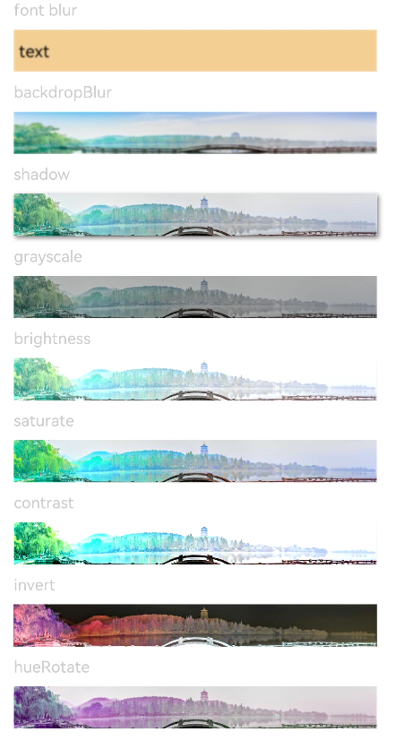

# Image Effect Configuration<a name="EN-US_TOPIC_0000001119928854"></a>

<a name="table3076mcpsimp"></a>
<table><thead align="left"><tr id="row3084mcpsimp"><th class="cellrowborder" valign="top" width="15.409999999999998%" id="mcps1.1.5.1.1"><p id="p3086mcpsimp"><a name="p3086mcpsimp"></a><a name="p3086mcpsimp"></a>Name</p>
</th>
<th class="cellrowborder" valign="top" width="20.91%" id="mcps1.1.5.1.2"><p id="p3088mcpsimp"><a name="p3088mcpsimp"></a><a name="p3088mcpsimp"></a>Type</p>
</th>
<th class="cellrowborder" valign="top" width="23.119999999999997%" id="mcps1.1.5.1.3"><p id="p3090mcpsimp"><a name="p3090mcpsimp"></a><a name="p3090mcpsimp"></a>Default Value</p>
</th>
<th class="cellrowborder" valign="top" width="40.56%" id="mcps1.1.5.1.4"><p id="p3094mcpsimp"><a name="p3094mcpsimp"></a><a name="p3094mcpsimp"></a>Description</p>
</th>
</tr>
</thead>
<tbody><tr id="row3095mcpsimp"><td class="cellrowborder" valign="top" width="15.409999999999998%" headers="mcps1.1.5.1.1 "><p id="p3097mcpsimp"><a name="p3097mcpsimp"></a><a name="p3097mcpsimp"></a>blur</p>
</td>
<td class="cellrowborder" valign="top" width="20.91%" headers="mcps1.1.5.1.2 "><p id="p3099mcpsimp"><a name="p3099mcpsimp"></a><a name="p3099mcpsimp"></a>number</p>
</td>
<td class="cellrowborder" valign="top" width="23.119999999999997%" headers="mcps1.1.5.1.3 "><p id="p3101mcpsimp"><a name="p3101mcpsimp"></a><a name="p3101mcpsimp"></a>-</p>
</td>
<td class="cellrowborder" valign="top" width="40.56%" headers="mcps1.1.5.1.4 "><p id="p3105mcpsimp"><a name="p3105mcpsimp"></a><a name="p3105mcpsimp"></a>Adds the content blurring for the current component. The input parameter is the blur radius. The larger the radius is, the more blurred the content is. If the value is <strong id="b0674181121916"><a name="b0674181121916"></a><a name="b0674181121916"></a>0</strong>, the content is not blurred.</p>
</td>
</tr>
<tr id="row3106mcpsimp"><td class="cellrowborder" valign="top" width="15.409999999999998%" headers="mcps1.1.5.1.1 "><p id="p3108mcpsimp"><a name="p3108mcpsimp"></a><a name="p3108mcpsimp"></a>backdropBlur</p>
</td>
<td class="cellrowborder" valign="top" width="20.91%" headers="mcps1.1.5.1.2 "><p id="p3110mcpsimp"><a name="p3110mcpsimp"></a><a name="p3110mcpsimp"></a>number</p>
</td>
<td class="cellrowborder" valign="top" width="23.119999999999997%" headers="mcps1.1.5.1.3 "><p id="p3112mcpsimp"><a name="p3112mcpsimp"></a><a name="p3112mcpsimp"></a>-</p>
</td>
<td class="cellrowborder" valign="top" width="40.56%" headers="mcps1.1.5.1.4 "><p id="p3116mcpsimp"><a name="p3116mcpsimp"></a><a name="p3116mcpsimp"></a>Adds the background blur effect for the current component. The input parameter is the blur radius. The larger the radius is, the more blurred the background is. If the value is <strong id="b9400146151918"><a name="b9400146151918"></a><a name="b9400146151918"></a>0</strong>, the background is not blurred.</p>
</td>
</tr>
<tr id="row3494113815448"><td class="cellrowborder" valign="top" width="15.409999999999998%" headers="mcps1.1.5.1.1 "><p id="p12494113824411"><a name="p12494113824411"></a><a name="p12494113824411"></a>shadow</p>
</td>
<td class="cellrowborder" valign="top" width="20.91%" headers="mcps1.1.5.1.2 "><p id="p58413718164"><a name="p58413718164"></a><a name="p58413718164"></a>{</p>
<p id="p06801858103018"><a name="p06801858103018"></a><a name="p06801858103018"></a>radius: number,</p>
<p id="p243903193118"><a name="p243903193118"></a><a name="p243903193118"></a>color?: Color,</p>
<p id="p13872673316"><a name="p13872673316"></a><a name="p13872673316"></a>offsetX?: number,</p>
<p id="p15182141141615"><a name="p15182141141615"></a><a name="p15182141141615"></a>offsetY?: number</p>
<p id="p154953383449"><a name="p154953383449"></a><a name="p154953383449"></a>}</p>
</td>
<td class="cellrowborder" valign="top" width="23.119999999999997%" headers="mcps1.1.5.1.3 "><p id="p34951138174417"><a name="p34951138174417"></a><a name="p34951138174417"></a>-</p>
</td>
<td class="cellrowborder" valign="top" width="40.56%" headers="mcps1.1.5.1.4 "><p id="p74951380449"><a name="p74951380449"></a><a name="p74951380449"></a>Adds the shadow effect to the current component. The input parameters are the fuzzy radius (mandatory), shadow color (optional; gray by default), X-axis offset (optional and 0 by default), and Y-axis offset (optional; 0 by default). The offset unit is px.</p>
</td>
</tr>
<tr id="row6209195195414"><td class="cellrowborder" valign="top" width="15.409999999999998%" headers="mcps1.1.5.1.1 "><p id="p192105516548"><a name="p192105516548"></a><a name="p192105516548"></a>grayscale</p>
</td>
<td class="cellrowborder" valign="top" width="20.91%" headers="mcps1.1.5.1.2 "><p id="p521035185410"><a name="p521035185410"></a><a name="p521035185410"></a>number</p>
</td>
<td class="cellrowborder" valign="top" width="23.119999999999997%" headers="mcps1.1.5.1.3 "><p id="p8210852546"><a name="p8210852546"></a><a name="p8210852546"></a>0.0</p>
</td>
<td class="cellrowborder" valign="top" width="40.56%" headers="mcps1.1.5.1.4 "><p id="p1421016514547"><a name="p1421016514547"></a><a name="p1421016514547"></a>The value indicates the grayscale conversion ratio. If the input value is <strong id="b106011217122317"><a name="b106011217122317"></a><a name="b106011217122317"></a>1.0</strong>, the image is converted into a grayscale image. If the input value is <strong id="b74651527202317"><a name="b74651527202317"></a><a name="b74651527202317"></a>0.0</strong>, the image does not change. If the input value is between <strong id="b07771658122518"><a name="b07771658122518"></a><a name="b07771658122518"></a>0.0</strong> and <strong id="b87231515266"><a name="b87231515266"></a><a name="b87231515266"></a>1.0</strong>, the effect changes in linear mode. The unit is percentage. The unit is percentage.</p>
</td>
</tr>
<tr id="row202641830144914"><td class="cellrowborder" valign="top" width="15.409999999999998%" headers="mcps1.1.5.1.1 "><p id="p14265113004918"><a name="p14265113004918"></a><a name="p14265113004918"></a>brightness</p>
</td>
<td class="cellrowborder" valign="top" width="20.91%" headers="mcps1.1.5.1.2 "><p id="p3265163018493"><a name="p3265163018493"></a><a name="p3265163018493"></a>number</p>
</td>
<td class="cellrowborder" valign="top" width="23.119999999999997%" headers="mcps1.1.5.1.3 "><p id="p226533020499"><a name="p226533020499"></a><a name="p226533020499"></a>1.0</p>
</td>
<td class="cellrowborder" valign="top" width="40.56%" headers="mcps1.1.5.1.4 "><p id="p8265730194912"><a name="p8265730194912"></a><a name="p8265730194912"></a>Adds a brightness to the current component. The input parameter is a brightness ratio. The value <strong id="b1647514093114"><a name="b1647514093114"></a><a name="b1647514093114"></a>1</strong> indicates no effects. The value <strong id="b86951213155511"><a name="b86951213155511"></a><a name="b86951213155511"></a>0</strong> indicates the complete darkness. If the value is less than <strong id="b989705893111"><a name="b989705893111"></a><a name="b989705893111"></a>1</strong>, the brightness decreases. If the value is greater than <strong id="b114435211326"><a name="b114435211326"></a><a name="b114435211326"></a>1</strong>, the brightness increases. A larger value indicates a higher brightness.</p>
</td>
</tr>
<tr id="row1723333504910"><td class="cellrowborder" valign="top" width="15.409999999999998%" headers="mcps1.1.5.1.1 "><p id="p323373520495"><a name="p323373520495"></a><a name="p323373520495"></a>saturate</p>
</td>
<td class="cellrowborder" valign="top" width="20.91%" headers="mcps1.1.5.1.2 "><p id="p42348356497"><a name="p42348356497"></a><a name="p42348356497"></a>number</p>
</td>
<td class="cellrowborder" valign="top" width="23.119999999999997%" headers="mcps1.1.5.1.3 "><p id="p123413356491"><a name="p123413356491"></a><a name="p123413356491"></a>1.0</p>
</td>
<td class="cellrowborder" valign="top" width="40.56%" headers="mcps1.1.5.1.4 "><p id="p323412350499"><a name="p323412350499"></a><a name="p323412350499"></a>Adds the saturation effect to the current component. The saturation is the ratio of the chromatic component to the achromatic component (gray) in a color. When the input value is <strong id="b1134517113910"><a name="b1134517113910"></a><a name="b1134517113910"></a>1</strong>, the source image is displayed. When the input value is greater than <strong id="b3873226203911"><a name="b3873226203911"></a><a name="b3873226203911"></a>1</strong>, a higher percentage of the chromatic component indicates a higher saturation. When the input value is less than <strong id="b109807619453"><a name="b109807619453"></a><a name="b109807619453"></a>1</strong>, a higher percentage of the achromatic component indicates a lower saturation. The unit is percentage.</p>
</td>
</tr>
<tr id="row852642445014"><td class="cellrowborder" valign="top" width="15.409999999999998%" headers="mcps1.1.5.1.1 "><p id="p252742465011"><a name="p252742465011"></a><a name="p252742465011"></a>contrast</p>
</td>
<td class="cellrowborder" valign="top" width="20.91%" headers="mcps1.1.5.1.2 "><p id="p35277245503"><a name="p35277245503"></a><a name="p35277245503"></a>number</p>
</td>
<td class="cellrowborder" valign="top" width="23.119999999999997%" headers="mcps1.1.5.1.3 "><p id="p7527824185013"><a name="p7527824185013"></a><a name="p7527824185013"></a>1.0</p>
</td>
<td class="cellrowborder" valign="top" width="40.56%" headers="mcps1.1.5.1.4 "><p id="p1652782475014"><a name="p1652782475014"></a><a name="p1652782475014"></a>Adds the contrast effect to the current component. The input parameter is a contrast value. If the value is <strong id="b1473145619494"><a name="b1473145619494"></a><a name="b1473145619494"></a>1</strong>, the source image is displayed. If the value is greater than <strong id="b1562516185018"><a name="b1562516185018"></a><a name="b1562516185018"></a>1</strong>, a larger value indicates a higher contrast and a clearer image. If the value is less than <strong id="b188170402509"><a name="b188170402509"></a><a name="b188170402509"></a>1</strong>, a smaller value indicates a lower contrast is. If the value is <strong id="b390541819511"><a name="b390541819511"></a><a name="b390541819511"></a>0</strong>, the image becomes all gray. The unit is percentage.</p>
</td>
</tr>
<tr id="row111960118522"><td class="cellrowborder" valign="top" width="15.409999999999998%" headers="mcps1.1.5.1.1 "><p id="p41971316528"><a name="p41971316528"></a><a name="p41971316528"></a>invert</p>
</td>
<td class="cellrowborder" valign="top" width="20.91%" headers="mcps1.1.5.1.2 "><p id="p171973135210"><a name="p171973135210"></a><a name="p171973135210"></a>number</p>
</td>
<td class="cellrowborder" valign="top" width="23.119999999999997%" headers="mcps1.1.5.1.3 "><p id="p17197101195218"><a name="p17197101195218"></a><a name="p17197101195218"></a>0</p>
</td>
<td class="cellrowborder" valign="top" width="40.56%" headers="mcps1.1.5.1.4 "><p id="p3476165475218"><a name="p3476165475218"></a><a name="p3476165475218"></a>Inverts the input image. The input parameter is an image inversion ratio. The value <strong id="b14161413529"><a name="b14161413529"></a><a name="b14161413529"></a>1</strong> indicates complete inversion. The value <strong id="b1662571385213"><a name="b1662571385213"></a><a name="b1662571385213"></a>0</strong> indicates that the image does not change. The unit is percentage.</p>
</td>
</tr>
<tr id="row4632151055214"><td class="cellrowborder" valign="top" width="15.409999999999998%" headers="mcps1.1.5.1.1 "><p id="p1632161019520"><a name="p1632161019520"></a><a name="p1632161019520"></a>sepia</p>
</td>
<td class="cellrowborder" valign="top" width="20.91%" headers="mcps1.1.5.1.2 "><p id="p6633171075214"><a name="p6633171075214"></a><a name="p6633171075214"></a>number</p>
</td>
<td class="cellrowborder" valign="top" width="23.119999999999997%" headers="mcps1.1.5.1.3 "><p id="p86331510165217"><a name="p86331510165217"></a><a name="p86331510165217"></a>0</p>
</td>
<td class="cellrowborder" valign="top" width="40.56%" headers="mcps1.1.5.1.4 "><p id="p10633111065216"><a name="p10633111065216"></a><a name="p10633111065216"></a>Converts the image color to sepia. The input parameter is an image inversion ratio. The value <strong id="b1359310473557"><a name="b1359310473557"></a><a name="b1359310473557"></a>1</strong> indicates the image is completely sepia. The value <strong id="b112966452564"><a name="b112966452564"></a><a name="b112966452564"></a>0</strong> indicates that the image does not change. The unit is percentage.</p>
</td>
</tr>
<tr id="row19167191310544"><td class="cellrowborder" valign="top" width="15.409999999999998%" headers="mcps1.1.5.1.1 "><p id="p19167141365415"><a name="p19167141365415"></a><a name="p19167141365415"></a>hueRotate</p>
</td>
<td class="cellrowborder" valign="top" width="20.91%" headers="mcps1.1.5.1.2 "><p id="p11167121395413"><a name="p11167121395413"></a><a name="p11167121395413"></a>Angle</p>
</td>
<td class="cellrowborder" valign="top" width="23.119999999999997%" headers="mcps1.1.5.1.3 "><p id="p11681713135413"><a name="p11681713135413"></a><a name="p11681713135413"></a>0deg</p>
</td>
<td class="cellrowborder" valign="top" width="40.56%" headers="mcps1.1.5.1.4 "><p id="p9168613165411"><a name="p9168613165411"></a><a name="p9168613165411"></a>Adds the hue rotation effect to the current component. The input parameter is a rotation angle. If the input value is <strong id="b4873953115713"><a name="b4873953115713"></a><a name="b4873953115713"></a>0deg</strong>, the image does not change (because the default rotation angle is <strong id="b1940868135812"><a name="b1940868135812"></a><a name="b1940868135812"></a>0deg</strong>). The input parameter does not have the maximum value. If the value exceeds <strong id="b191751105815"><a name="b191751105815"></a><a name="b191751105815"></a>360deg</strong>, the image is rotated one ore more circles.</p>
</td>
</tr>
</tbody>
</table>

## Example<a name="section4278134412416"></a>

```
@Entry
@Component
struct ImageEffectsExample {
  build() {
Column({space: 10}) {
      // Blur the font.
      Text('font blur').fontSize(15).fontColor(0xCCCCCC).width('90%')
      Text('text').blur(3).width('90%').height(40)
        .fontSize(16).backgroundColor(0xF9CF93).padding({ left: 5 })

      // Blur the background.
      Text('backdropBlur').fontSize(15).fontColor(0xCCCCCC).width('90%')
      Text().width('90%').height(40).fontSize(16).backdropBlur(3)
        .backgroundImage('/comment/bg.jpg')
        .backgroundImageSize({ width: 1200, height: 160 })

      Text('shadow').fontSize(15).fontColor(0xCCCCCC).width('90%')
      Image($r('app.media.bg')).width('90%').height(40)
        .shadow({ radius: 10, color: Color.Gray, offsetX: 5, offsetY: 5 })

      Text('grayscale').fontSize(15).fontColor(0xCCCCCC).width('90%')
      Image($r('app.media.bg')).width('90%').height(40).grayscale(0.6)

      Text('brightness').fontSize(15).fontColor(0xCCCCCC).width('90%')
      Image($r('app.media.bg')).width('90%').height(40).brightness(2.0)

      Text('saturate').fontSize(15).fontColor(0xCCCCCC).width('90%')
      Image($r('app.media.bg')).width('90%').height(40).saturate(2.0)

      Text('contrast').fontSize(15).fontColor(0xCCCCCC).width('90%')
      Image($r('app.media.bg')).width('90%').height(40).contrast(2.0)

      Text('invert').fontSize(15).fontColor(0xCCCCCC).width('90%')
      Image($r('app.media.bg')).width('90%').height(40).invert(1)

      Text('hueRotate').fontSize(15).fontColor(0xCCCCCC).width('90%')
      Image($r('app.media.bg')).width('90%').height(40).hueRotate(90)
    }.width('100%').margin({ top: 5 })
  }
}
```



