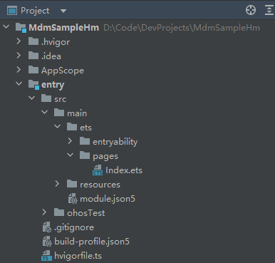

# EnterpriseAdminExtensionAbility Development

## Introduction

**EnterpriseAdminExtensionAbility** is an essential component for device administrator applications. When developing an MDM device administrator application, you need to create an **EnterpriseAdminExtensionAbility** instance and implement MDM service logic in this instance. **EnterpriseAdminExtensionAbility** implements notifications of system management status changes and defines the callbacks to be invoked when a device administrator application is enabled or disabled or an application is installed or uninstalled.

## Available APIs
The following lists the APIs used in this example. For details about more APIs and their usage, see [@ohos.enterprise.EnterpriseAdminExtensionAbility (EnterpriseAdminExtensionAbility)](../../application-dev/reference/apis-mdm-kit/js-apis-EnterpriseAdminExtensionAbility.md).

| API                                 | Description                        |
| ----------------------------------------- | ---------------------------- |
| [onAdminEnabled(): void](../../application-dev/reference/apis-mdm-kit/js-apis-EnterpriseAdminExtensionAbility.md#enterpriseadminextensionabilityonadminenabled)                    | Called when a device administrator application is enabled.  |
| [onAdminDisabled(): void](../../application-dev/reference/apis-mdm-kit/js-apis-EnterpriseAdminExtensionAbility.md#enterpriseadminextensionabilityonadmindisabled)                   | Called when a device administrator application is disabled.|
| [onBundleAdded(bundleName: string): void](../../application-dev/reference/apis-mdm-kit/js-apis-EnterpriseAdminExtensionAbility.md#enterpriseadminextensionabilityonbundleadded)   | Called when an application is installed.            |
| [onBundleRemoved(bundleName: string): void](../../application-dev/reference/apis-mdm-kit/js-apis-EnterpriseAdminExtensionAbility.md#enterpriseadminextensionabilityonbundleremoved) | Called when an application is uninstalled.            |

## How to Develop

Create a project. The project structure is as follows.



Create an **ExtensionAbility** of the **EnterpriseAdmin** type, that is, an **EnterpriseAdminExtensionAbility** instance.


Open the **EnterpriseAdminAbility.ets** file, import the **EnterpriseAdminExtensionAbility** module, enable it to inherit from the **EnterpriseAdminExtensionAbility** module, and define callbacks, such as **onAdminEnabled()** and **onAdminDisabled()**. When the device administrator application is enabled or disabled, the callback will be invoked to receive notifications.

```ts
import { EnterpriseAdminExtensionAbility } from '@kit.MDMKit';

export default class EnterpriseAdminAbility extends EnterpriseAdminExtensionAbility {
  // Callback to be invoked when the device administrator application is enabled. Initialization policy can be set in this callback.
  onAdminEnabled() {
    console.info("onAdminEnabled");
  }

  // Callback to be invoked when the device administrator application is disabled. This callback can be used to notify the enterprise administrator application that the device is no longer under management.
  onAdminDisabled() {
    console.info("onAdminDisabled");
  }
  
  // Callback to be invoked when an application is installed. This callback can be used to report events.
  onBundleAdded(bundleName: string) {
    console.info("EnterpriseAdminAbility onBundleAdded bundleName:" + bundleName);
  }

  // Callback to be invoked when an application is uninstalled. This callback can be used to report events.
  onBundleRemoved(bundleName: string) {
    console.info("EnterpriseAdminAbility onBundleRemoved bundleName" + bundleName);
  }
};
```

In the [module.json5](https://developer.huawei.com/consumer/en/doc/harmonyos-guides-V2/module-configuration-file-0000001427744540-V2) file of the project module, register **EnterpriseAdminAbility** as **ExtensionAbility**, and set type to **enterpriseAdmin** and **srcEntry** to the code path of the **ExtensionAbility** component.

```ts
"extensionAbilities": [
  {
	"name": "EnterpriseAdminAbility",
	"type": "enterpriseAdmin",
	"exported": true,
	"srcEntry": "./ets/enterpriseadminability/EnterpriseAdminAbility.ets"
  }
]
```

