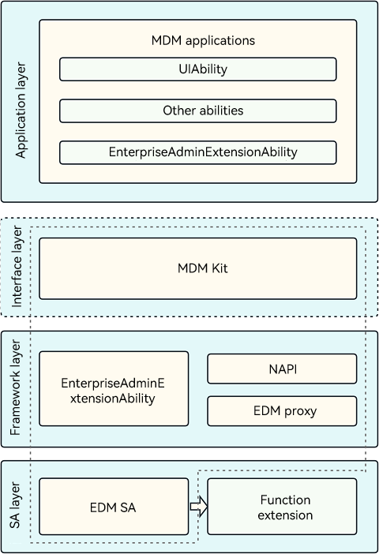

# About This Kit

<!--Kit: MDM Kit-->
<!--Subsystem: Customization-->
<!--Owner: @huanleima; @weizai16-->
<!--Designer: @hp_guo-->
<!--Tester: @lpw_work-->
<!--Adviser: @zhang_yixin13-->
<!-- md-trans-meta sourceCommit=188ff5fef3d90fc0078e4760b9813c31639f710c translatedAt=2026-08-04T13:31:42.232Z pushedAt=2026-08-05T09:03:15.843Z -->

## Introduction

MDM Kit provides APIs for enterprise-level Mobile Device Management (MDM) applications to manage and protect data and applications on enterprise devices. [MDM applications](./mdm-kit-term.md#mdm-app) ensure device and data security and stability through centralized management, remote configuration, and monitoring. They are widely used in enterprises and government agencies to ensure efficient management and secure use of devices and data.

## Scenarios

- Corporate-Owned, Personally Enabled (COPE): Enterprises centrally purchase and deploy devices such as laptops, tablets, and smartphones for employees. These devices are corporate-owned and subject to unified enterprise management.

- Bring Your Own Device (BYOD): Some enterprises allow employees to bring their own tablets or smartphones to the workplace and connect these devices to the office environment. This strategy applies to enterprise workplace scenarios, including those where external visitors access facilities such as factories and laboratories using their own devices.

## Working Principles

<!--RP1-->

The framework layer and system ability (SA) layer use the enterprise_device_management component to provide the device administrator application framework and basic device management capabilities. The device administrator application uses an [EnterpriseAdminExtensionAbility](./mdm-kit-admin.md) to call APIs in MDM Kit to manage devices.<!--RP1End-->

## Constraints

- The SDK version must be 5.0.0 (API version 12) or later.

- Only the stage model is supported.

<!--RP3--><!--RP3End-->