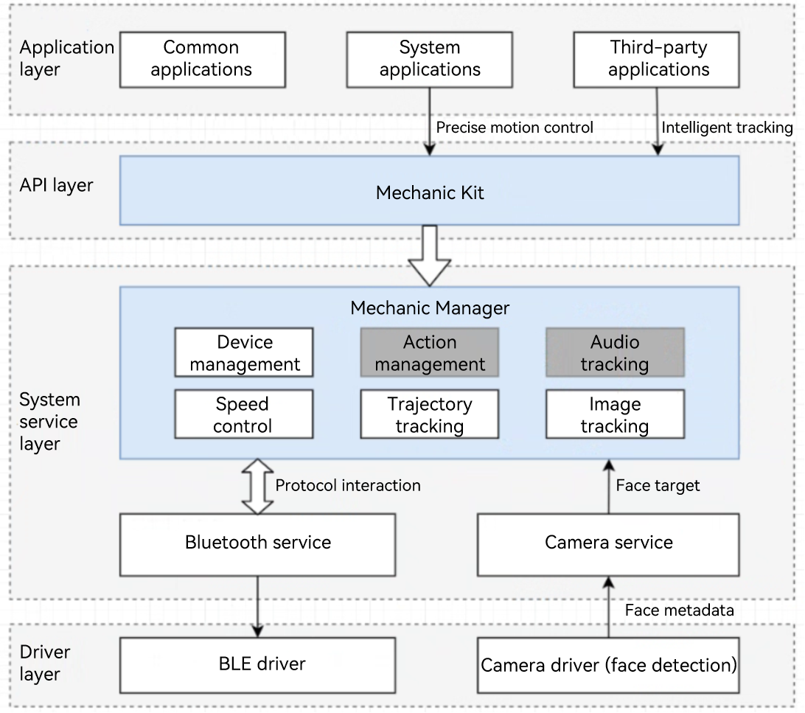

# Introduction to Mechanic Kit
<!--Kit: Mechanic Kit-->
<!--Subsystem: Mechanic-->
<!--Owner: @hobbycao-->
<!--Designer: @saga2025-->
<!--Tester: @zhaodengqi-->
<!--Adviser: @foryourself-->

Mechanic Kit is a set of APIs provided by `mechanicManager`. Starting from API version 20, applications can use Mechanic Kit to control mechanic devices. Mechanic Kit offers a complete integration solution for third-party mechanic devices, supporting interaction between mobile phones and devices such as gimbals and robotic arms.

Functions provided by Mechanic Kit include device connection management and intelligent tracking<!--Del-->, as well as status monitoring and precise control<!--Del-->, helping developers to build high-quality device interaction applications.

Through Mechanic Kit, your applications can control and interact with mechanic devices, providing functions such as connection management, control, and monitoring.

## When to Use

Mechanic Kit primarily targets interaction control scenarios involving intelligent mechanic devices such as gimbals and robotic arms.

- **Intelligent photographying assistance**: Enable face tracking and object tracking through mechanic devices to enhance photographying quality.
- **Photographying control**: With mobile phones serving as control terminals, manipulate mechanic devices like gimbals or robotic arms for precise angle adjustment and motion trajectory control.

Mechanic Kit provides device connection, intelligent tracking, and precise control functions, making it more convenient to build mechanic accessory control applications. 

## Capabilities

Mechanic Kit provides developers with comprehensive mechanic device control capabilities.

### Managing Device Connections

- **Device discovery**: Obtain the list of currently connected mechanic devices, such as tripods.
- **Connection status listening**: Listen for the connection status changes of mechanic devices in real time.
- **Device information query**: Obtain basic information such as the ID, name, and type of mechanic devices.

### Intelligent Tracking

- **Camera tracking switch**: Enable or disable intelligent tracking of the camera.
- **Tracking layout setting**: Provide four tracking layout modes: default, left, center, and right.
- **Tracking status listening**: Listen for events such as user operations and layout changes.

<!--Del-->
### Precise Device Control

- **Relative angle rotation**: Perform relative angle rotation control based on the current position.
- **Absolute angle rotation**: Perform rotation control based on the absolute Euler angle.
- **Movement stop control**: Stop all movement operations of the mechanic device immediately.
<!--DelEnd-->

### Status Monitoring

- **Current angle query**: Obtain the current angle of the mechanic device on three axes in real time.
- **Rotation limit query**: Obtain the maximum rotation range of the mechanic device on each axis.
- **Rotation axis status listening**: Listen for the enabling status change events and restriction of each rotation axis.
- **Movement parameter query**: Obtain the maximum rotation speed and continuous rotation time.

## Working Principles

**Intelligent tracking mechanism**: After detecting a face, the camera driver reports the face to the camera service. The camera service reports the face location and camera parameters to the mechanic manager service. The mechanic manager service converts the information into a rotation instruction and delivers the instruction to the mechanic device via Bluetooth. The application can manage intelligent tracking through open APIs.

**Precise device control mechanism**: An application controls the mechanical device through the APIs provided by Mechanic Kit and rotates the device at a specified speed or along a specified trajectory.

## Constraints

Before using Mechanic Kit, ensure that the following conditions are met:

- **Mechanical device**: The mechanic device must comply with the Mechanic Kit specifications.
- **Development device**: To support intelligent tracking, the camera driver on the development device must have the face detection capability and support the reporting of face metadata, which complies with the HDI specifications.
- **Device connection requirements**: The development device must be connected to the mechanic device to ensure that the communication link is normal.
- **Camera permission**: An application in the foreground must obtain the camera permission to support visual functions such as intelligent tracking.
- **System permission**: Some advanced functions (such as rotation control) require system application permissions.
- **Hardware restriction**: The operation range is limited by the movement limit of the mechanic device.

> **NOTE**
>
> Before calling the APIs of Mechanic Kit, make sure the preceding conditions are met. Otherwise, service exceptions may occur.
