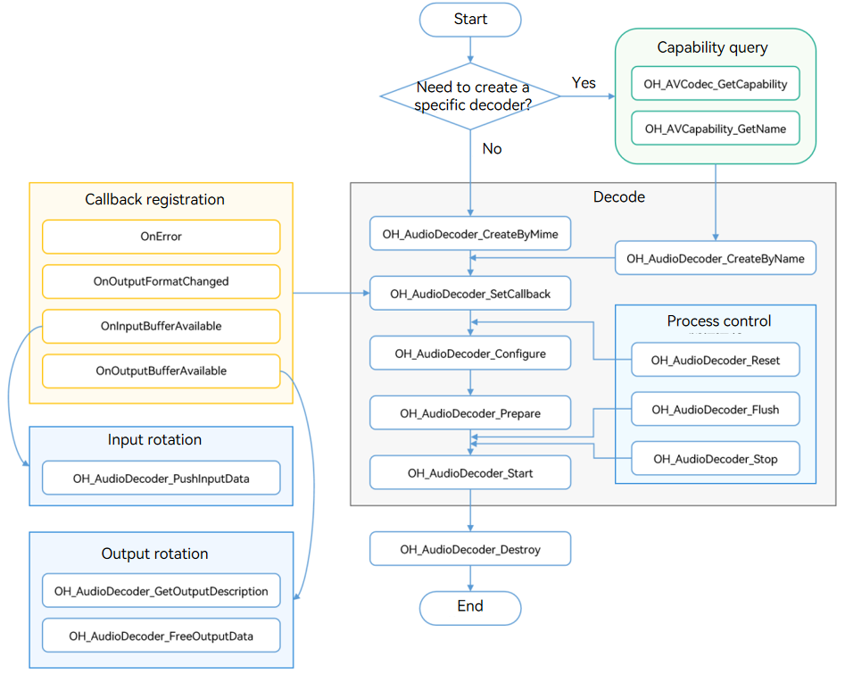

# Audio Decoding (C/C++)

You can call the native APIs provided by the **AudioDecoder** module to decode audio, that is, to decode media data into PCM streams.

Currently, the following decoding capabilities are supported:

| Container Specification| Audio Decoding Type                |
| -------- | :--------------------------- |
| mp4      | AAC, MPEG (MP3), FLAC, Vorbis|
| m4a      | AAC                          |
| flac     | FLAC                        |
| ogg      | Vorbis                       |
| aac      | AAC                          |
| mp3      | MPEG (MP3)                    |

**Usage Scenario**

- Audio playback

  Decode audio and transmit the data to the speaker for playing.
- Audio rendering

  Decode audio and transmit the data to the audio processing module for audio rendering.
- Audio editing

  Decode audio and transmit the data for audio editing (for example, adjusting the playback speed of a channel). Audio editing is performed based on PCM streams.

## How to Develop

Read [AudioDecoder](../reference/native-apis/_audio_decoder.md) for the API reference.

Refer to the code snippet below to complete the entire audio decoding process, including creating a decoder, setting decoding parameters (such as the sampling rate, bit rate, and number of audio channels), and starting, refreshing, resetting, and destroying the decoder.

During application development, you must call the APIs in the defined sequence. Otherwise, an exception or undefined behavior may occur.

The figure below shows the call relationship of audio decoding.



### Linking the Dynamic Library in the CMake Script

``` cmake
target_link_libraries(sample PUBLIC libnative_media_codecbase.so)
target_link_libraries(sample PUBLIC libnative_media_core.so)
target_link_libraries(sample PUBLIC libnative_media_adec.so)
```

### How to Develop

1. Add the header files.

   ```cpp
   #include <multimedia/player_framework/native_avcodec_audiodecoder.h>
   #include <multimedia/player_framework/avcodec_audio_channel_layout.h>
   #include <multimedia/player_framework/native_avcapability.h>
   #include <multimedia/player_framework/native_avcodec_base.h>
   #include <multimedia/player_framework/native_avformat.h>
   ```

2. Create a decoder instance.

    ```cpp
    // Namespace of the C++ standard library.
    using namespace std;
    // Create a decoder by name.
    OH_AVCapability *capability = OH_AVCodec_GetCapability(OH_AVCODEC_MIMETYPE_AUDIO_MPEG, false);
    const char *name = OH_AVCapability_GetName(capability);
    OH_AVCodec *audioDec = OH_AudioDecoder_CreateByName(name);
    ```

    ```cpp
    // Create a decoder by MIME type.
    OH_AVCodec *audioDec = OH_AudioDecoder_CreateByMime(OH_AVCODEC_MIMETYPE_AUDIO_MPEG);
    ```

    ```cpp
    // Initialize the queues.
    class ADecSignal {
    public:
        mutex inMutex_;
        mutex outMutex_;
        mutex startMutex_;
        condition_variable inCond_;
        condition_variable outCond_;
        condition_variable startCond_;
        queue<uint32_t> inQueue_;
        queue<uint32_t> outQueue_;
        queue<OH_AVMemory *> inBufferQueue_;
        queue<OH_AVMemory *> outBufferQueue_;
        queue<OH_AVCodecBufferAttr> attrQueue_;
    };
    ADecSignal *signal_;
    ```

3. Call **OH_AudioDecoder_SetCallback()** to set callback functions.

   Register the **OH_AVCodecAsyncCallback** struct that defines the following callback function pointers:
   
   - **OH_AVCodecOnError**, a callback used to report a codec operation error
   - **OH_AVCodecOnStreamChanged**, a callback used to report a codec stream change, for example, audio channel change
   - **OH_AVCodecOnNeedInputData**, a callback used to report input data required, which means that the decoder is ready for receiving data
   - **OH_AVCodecOnNewOutputData**, a callback used to report output data generated, which means that decoding is complete
   
   You need to process the callback functions to ensure that the decoder runs properly.
   
    ```cpp
   // Implement the OH_AVCodecOnError callback function.
   static void OnError(OH_AVCodec *codec, int32_t errorCode, void *userData)
   {
       (void)codec;
       (void)errorCode;
       (void)userData;
   }
   // Implement the OH_AVCodecOnStreamChanged callback function.
   static void OnStreamChanged(OH_AVCodec *codec, OH_AVFormat *format, void*userData)
   {
       (void)codec;
       (void)format;
       (void)userData;
   }
   // Implement the OH_AVCodecOnNeedInputData callback function.
   static void onNeedInputData(OH_AVCodec *codec, uint32_t index, OH_AVMemory*data, void *userData)
   {
       (void)codec;
       ADecSignal *signal = static_cast<ADecSignal *>(userData);
       unique_lock<mutex> lock(signal->inMutex_);
       signal->inQueue_.push(index);
       signal->inBufferQueue_.push(data);
       signal->inCond_.notify_all();
       // The input stream is sent to the InputBuffer queue.
   }
   // Implement the OH_AVCodecOnNewOutputData callback function.
   static void onNeedOutputData(OH_AVCodec *codec, uint32_t index, OH_AVMemory*data, OH_AVCodecBufferAttr *attr,
                                           void *userData)
   {
       (void)codec;
       ADecSignal *signal = static_cast<ADecSignal *>(userData);
       unique_lock<mutex> lock(signal->outMutex_);
       signal->outQueue_.push(index);
       signal->outBufferQueue_.push(data);
       if (attr) {
           signal->attrQueue_.push(*attr);
       }
       signal->outCond_.notify_all();
       // The index of the output buffer is sent to OutputQueue_.
       // The decoded data is sent to the OutputBuffer queue.
   }
   signal_ = new ADecSignal();
   OH_AVCodecAsyncCallback cb = {&OnError, &OnStreamChanged, &onNeedInputData, &onNeedOutputData};
   // Set the asynchronous callbacks.
   int32_t ret = OH_AudioDecoder_SetCallback(audioDec, cb, signal_);
   if (ret != AV_ERR_OK) {
       // Exception handling.
   }
    ```
   
4. Call **OH_AudioDecoder_Configure()** to configure the decoder.
   
   The following options are mandatory: sampling rate, bit rate, and number of audio channels. The maximum input length is optional.
   
   For AAC decoding, the parameter that specifies whether the data type is Audio Data Transport Stream (ADTS) must be specified. If this parameter is not specified, the data type is considered as Low Overhead Audio Transport Multiplex (LATM).
   
   ```cpp
    // Set the decoding resolution.
    int32_t ret;
    // (Mandatory) Configure the audio sampling rate.
    constexpr uint32_t DEFAULT_SMAPLERATE = 44100; 
    // (Mandatory) Configure the audio bit rate.
    constexpr uint32_t DEFAULT_BITRATE = 32000;
    // (Mandatory) Configure the number of audio channels.
    constexpr uint32_t DEFAULT_CHANNEL_COUNT = 2;
    // (Optional) Configure the maximum input length.
    constexpr uint32_t DEFAULT_MAX_INPUT_SIZE = 1152;
    // Configure whether to use ADTS decoding (ACC).
    constexpr uint32_t DEFAULT_AAC_TYPE = 1;
    OH_AVFormat *format = OH_AVFormat_Create();
    // Set the format.
    OH_AVFormat_SetIntValue(format, OH_MD_KEY_AUD_SAMPLE_RATE,DEFAULT_SMAPLERATE);
    OH_AVFormat_SetIntValue(format, OH_MD_KEY_BITRATE,DEFAULT_BITRATE);
    OH_AVFormat_SetIntValue(format, OH_MD_KEY_AUD_CHANNEL_COUNT,DEFAULT_CHANNEL_COUNT);
    OH_AVFormat_SetIntValue(format, OH_MD_KEY_MAX_INPUT_SIZE,DEFAULT_MAX_INPUT_SIZE);
    OH_AVFormat_SetIntValue(format, OH_MD_KEY_AAC_IS_ADTS, DEFAULT_AAC_TYPE);
    // Configure the decoder.
    ret = OH_AudioDecoder_Configure(audioDec, format);
    if (ret != AV_ERR_OK) {
        // Exception handling.
    }
   ```
   
5. Call **OH_AudioDecoder_Prepare()** to prepare internal resources for the decoder.

    ```cpp
    ret = OH_AudioDecoder_Prepare(audioDec);
    if (ret != AV_ERR_OK) {
        // Exception handling.
    }
    ```

6. Call **OH_AudioDecoder_Start()** to start the decoder.

    ```c++
    unique_ptr<ifstream> inputFile_ = make_unique<ifstream>();
    unique_ptr<ofstream> outFile_ = make_unique<ofstream>();
    // Open the path of the binary file to be decoded.
    inputFile_->open(inputFilePath.data(), ios::in | ios::binary); 
    // Configure the path of the output file.
    outFile_->open(outputFilePath.data(), ios::out | ios::binary);
    // Start decoding.
    ret = OH_AudioDecoder_Start(audioDec);
    if (ret != AV_ERR_OK) {
    // Exception handling.
    }
    ```

7. Call **OH_AudioDecoder_PushInputData()** to write the data to decode.

   To indicate the End of Stream (EOS), pass in the **AVCODEC_BUFFER_FLAGS_EOS** flag.

    ```c++
    // Configure the buffer information.
    OH_AVCodecBufferAttr info;
    // Set the size, offset, and timestamp.
    auto buffer = signal_->inBufferQueue_.front();
    int64_t size;
    int64_t pts;
    inputFile_.read(reinterpret_cast<char *>(&size), sizeof(size));
    if (inputFile_->eof()) {
        size = 0;
        info.flags = AVCODEC_BUFFER_FLAGS_EOS;
    } else {
        inputFile_.read(reinterpret_cast<char *>(&pts), sizeof(pts));
        inputFile_.read((char *)OH_AVMemory_GetAddr(buffer), size);
        info.flags = AVCODEC_BUFFER_FLAGS_CODEC_DATA;
    }
    info.size = size;
    info.offset = 0;
    info.pts = pts;
    uint32_t index = signal_->inQueue_.front();
    // Send the data to the input queue for decoding. The index is the subscript of the queue.
    int32_t ret = OH_AudioDecoder_PushInputData(audioDec, index, info);
    if (ret != AV_ERR_OK) {
        // Exception handling.
    }
    ```

8. Call **OH_AudioDecoder_FreeOutputData()** to output decoded PCM streams.

    ```c++
    OH_AVCodecBufferAttr attr = signal_->attrQueue_.front();
    OH_AVMemory *data = signal_->outBufferQueue_.front();
    uint32_t index = signal_->outQueue_.front();
    // Write the decoded data (specified by data) to the output file.
    outFile_->write(reinterpret_cast<char *>(OH_AVMemory_GetAddr(data)), attr.size);
    // Free the buffer that stores the data.
    ret = OH_AudioDecoder_FreeOutputData(audioDec, index);
    if (ret != AV_ERR_OK) {
        // Exception handling.
    }
    ```

9. (Optional) Call **OH_AudioDecoder_Flush()** to refresh the decoder.

    After **OH_AudioDecoder_Flush()** is called, the decoder remains in the running state, but the current queue is cleared and the buffer storing the decoded data is freed. To continue decoding, you must call **OH_AudioDecoder_Start()** again.

    You need to call **OH_AudioDecoder_Start()** in the following cases:
    
    * The EOS of the file is reached.
    * An error with **OH_AudioDecoder_IsValid** set to **true** (indicating that the execution can continue) occurs.
    
    ```c++
        // Refresh the decoder.
        ret = OH_AudioDecoder_Flush(audioDec);
        if (ret != AV_ERR_OK) {
            // Exception handling.
        }
        // Start decoding again.
        ret = OH_AudioDecoder_Start(audioDec);
        if (ret != AV_ERR_OK) {
            // Exception handling.
        }
    ```
    
10. (Optional) Call **OH_AudioDecoder_Reset()** to reset the decoder.

    After **OH_AudioDecoder_Reset()** is called, the decoder returns to the initialized state. To continue decoding, you must call **OH_AudioDecoder_Configure()** and then **OH_AudioDecoder_Start()**.

    ```c++
    // Reset the decoder.
    ret = OH_AudioDecoder_Reset(audioDec);
    if (ret != AV_ERR_OK) {
        // Exception handling.
    }
    // Reconfigure the decoder.
    ret = OH_AudioDecoder_Configure(audioDec, format);
    if (ret != AV_ERR_OK) {
    // Exception handling.
    }
    ```

11. Call **OH_AudioDecoder_Stop()** to stop the decoder.

      ```c++
      // Stop the decoder.
      ret = OH_AudioDecoder_Stop(audioDec);
      if (ret != AV_ERR_OK) {
          // Exception handling.
      }
      ```

12. Call **OH_AudioDecoder_Destroy()** to destroy the decoder instance and release resources.

      **NOTE**: You only need to call this API once.

      ```c++
      // Call OH_AudioDecoder_Destroy to destroy the decoder.
      ret = OH_AudioDecoder_Destroy(audioDec);
      if (ret != AV_ERR_OK) {
          // Exception handling.
      } else {
          audioDec = NULL; // The decoder cannot be destroyed repeatedly.
      }
      ```

