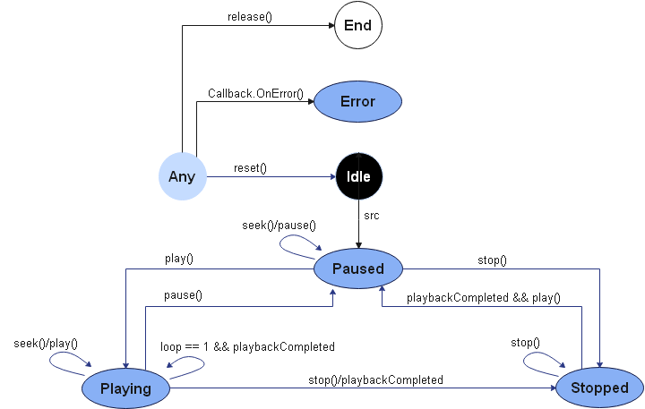
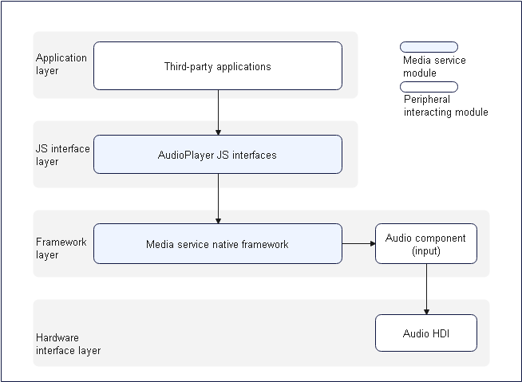

# Audio Playback Development

## When to Use

You can use audio playback APIs to convert audio data into audible analog signals, play the signals using output devices, and manage playback tasks.

**Figure 1** Playback status




**Figure 2** Layer 0 diagram of audio playback



## How to Develop

For details about the APIs, see [AudioPlayer in the Media API](../reference/apis/js-apis-media.md).

### Full-Process Scenario

The full audio playback process includes creating an instance, setting the URI, playing audio, seeking to the playback position, setting the volume, pausing playback, obtaining track information, stopping playback, resetting the player, and releasing resources.

For details about the **src** types supported by **AudioPlayer**, see the [src attribute](../reference/apis/js-apis-media.md#audioplayer_attributes).

```js
import media from '@ohos.multimedia.media'
import fileIO from '@ohos.fileio'

// Print the stream track information.
function printfDescription(obj) {
    for (let item in obj) {
        let property = obj[item];
        console.info('audio key is ' + item);
        console.info('audio value is ' + property);
    }
}

// Set the player callbacks.
function setCallBack(audioPlayer) {
    audioPlayer.on('dataLoad', () => {              // Set the dataLoad event callback, which is triggered when the src attribute is set successfully.
        console.info('audio set source success');
        audioPlayer.play();                         // The play() API can be invoked only after the dataLoad event callback is complete. The play event callback is then triggered.
    });
    audioPlayer.on('play', () => {                  // Set the play event callback.
        console.info('audio play success');
        audioPlayer.pause();                        // Trigger the pause event callback and pause the playback.
    });
    audioPlayer.on('pause', () => {                 // Set the pause event callback.
        console.info('audio pause success');
        audioPlayer.seek(5000);                     // Trigger the timeUpdate event callback, and seek to 5000 ms for playback.
    });
    audioPlayer.on('stop', () => {                  // Set the stop event callback.
        console.info('audio stop success');
        audioPlayer.reset();                        // Trigger the reset event callback, and reconfigure the src attribute to switch to the next song.
    });
    audioPlayer.on('reset', () => {                 // Set the reset event callback.
        console.info('audio reset success');
        audioPlayer.release();                      // Release the AudioPlayer resources.
        audioPlayer = undefined;
    });
    audioPlayer.on('timeUpdate', (seekDoneTime) => {// Set the timeUpdate event callback.
        if (typeof(seekDoneTime) == 'undefined') {
            console.info('audio seek fail');
            return;
        }
        console.info('audio seek success, and seek time is ' + seekDoneTime);
        audioPlayer.setVolume(0.5);                 // Trigger the volumeChange event callback.
    });
    audioPlayer.on('volumeChange', () => {          // Set the volumeChange event callback.
        console.info('audio volumeChange success');
        audioPlayer.getTrackDescription((error, arrlist) => {  // Obtain the audio track information in callback mode.
            if (typeof (arrlist) != 'undefined') {
                for (let i = 0; i < arrlist.length; i++) {
                    printfDescription(arrlist[i]);
                }
            } else {
                console.log(`audio getTrackDescription fail, error:${error.message}`);
            }
            audioPlayer.stop();                      // Trigger the stop event callback to stop the playback.
        });
    });
    audioPlayer.on('finish', () => {                 // Set the finish event callback, which is triggered when the playback is complete.
        console.info('audio play finish');
    });
    audioPlayer.on('error', (error) => {             // Set the error event callback.
        console.info(`audio error called, errName is ${error.name}`);
        console.info(`audio error called, errCode is ${error.code}`);
        console.info(`audio error called, errMessage is ${error.message}`);
    });
}

async function audioPlayerDemo() {
    // 1. Create an AudioPlayer instance.
    let audioPlayer = media.createAudioPlayer();
    setCallBack(audioPlayer);                          // Set the event callbacks.
    // 2. Set the URI of the audio file.
    let fdPath = 'fd://'
    // The stream in the path can be pushed to the device by running the "hdc file send D:\xxx\01.mp3 /data/app/el1/bundle/public/ohos.acts.multimedia.audio.audioplayer/ohos.acts.multimedia.audio.audioplayer/assets/entry/resources/rawfile" command.
    let path = '/data/app/el1/bundle/public/ohos.acts.multimedia.audio.audioplayer/ohos.acts.multimedia.audio.audioplayer/assets/entry/resources/rawfile/01.mp3';
    await fileIO.open(path).then((fdNumber) => {
        fdPath = fdPath + '' + fdNumber;
        console.info('open fd success fd is' + fdPath);
    }, (err) => {
        console.info('open fd failed err is' + err);
    }).catch((err) => {
        console.info('open fd failed err is' + err);
    });
    audioPlayer.src = fdPath; // Set the src attribute and trigger the dataLoad event callback.
}
```

### Normal Playback Scenario

```js
import media from '@ohos.multimedia.media'
import fileIO from '@ohos.fileio'
export class AudioDemo {
  // Set the player callbacks.
  setCallBack(audioPlayer) {
    audioPlayer.on('dataLoad', () => {              // Set the dataLoad event callback, which is triggered when the src attribute is set successfully.
      console.info('audio set source success');
      audioPlayer.play();                           // Call the play() API to start the playback and trigger the play event callback.
    });
    audioPlayer.on('play', () => {                  // Set the play event callback.
      console.info('audio play success');
    });
    audioPlayer.on('finish', () => {                // Set the finish event callback, which is triggered when the playback is complete.
      console.info('audio play finish');
      audioPlayer.release();                        // Release the AudioPlayer resources.
      audioPlayer = undefined;
    });
  }

  async audioPlayerDemo() {
    let audioPlayer = media.createAudioPlayer();     // Create an AudioPlayer instance.
    this.setCallBack(audioPlayer);                   // Set the event callbacks.
    let fdPath = 'fd://'
    // The stream in the path can be pushed to the device by running the "hdc file send D:\xxx\01.mp3 /data/app/el1/bundle/public/ohos.acts.multimedia.audio.audioplayer/ohos.acts.multimedia.audio.audioplayer/assets/entry/resources/rawfile" command.
    let path = '/data/app/el1/bundle/public/ohos.acts.multimedia.audio.audioplayer/ohos.acts.multimedia.audio.audioplayer/assets/entry/resources/rawfile/01.mp3';
    await fileIO.open(path).then((fdNumber) => {
      fdPath = fdPath + '' + fdNumber;
      console.info('open fd success fd is' + fdPath);
    }, (err) => {
      console.info('open fd failed err is' + err);
    }).catch((err) => {
      console.info('open fd failed err is' + err);
    });
    audioPlayer.src = fdPath; // Set the src attribute and trigger the dataLoad event callback.
  }
}
```

### Switching to the Next Song

```js
import media from '@ohos.multimedia.media'
import fileIO from '@ohos.fileio'
export class AudioDemo {
// Set the player callbacks.
  private isNextMusic = false;
  setCallBack(audioPlayer) {
    audioPlayer.on('dataLoad', () => {              // Set the dataLoad event callback, which is triggered when the src attribute is set successfully.
      console.info('audio set source success');
      audioPlayer.play();                           // Call the play() API to start the playback and trigger the play event callback.
    });
    audioPlayer.on('play', () => {                  // Set the play event callback.
      console.info('audio play success');
      audioPlayer.reset();                          // Call the reset() API and trigger the reset event callback.
    });
    audioPlayer.on('reset', () => {                 // Set the reset event callback.
      console.info('audio play success');
      if (!this.isNextMusic) {                      // When isNextMusic is false, changing songs is implemented.
        this.nextMusic(audioPlayer);                // Changing songs is implemented.
      } else {
        audioPlayer.release();                      // Release the AudioPlayer instance.
        audioPlayer = undefined;
      }
    });
  }

  async nextMusic(audioPlayer) {
    this.isNextMusic = true;
    let nextFdPath = 'fd://'
    // The stream in the path can be pushed to the device by running the "hdc file send D:\xxx\02.mp3 /data/app/el1/bundle/public/ohos.acts.multimedia.audio.audioplayer/ohos.acts.multimedia.audio.audioplayer/assets/entry/resources/rawfile" command.
    let nextpath = '/data/app/el1/bundle/public/ohos.acts.multimedia.audio.audioplayer/ohos.acts.multimedia.audio.audioplayer/assets/entry/resources/rawfile/02.mp3';
    await fileIO.open(nextpath).then((fdNumber) => {
      nextFdPath = nextFdPath + '' + fdNumber;
      console.info('open fd success fd is' + nextFdPath);
    }, (err) => {
      console.info('open fd failed err is' + err);
    }).catch((err) => {
      console.info('open fd failed err is' + err);
    });
    audioPlayer.src = nextFdPath; // Set the src attribute and trigger the dataLoad event callback.
  }

  async audioPlayerDemo() {
    let audioPlayer = media.createAudioPlayer();       // Create an AudioPlayer instance.
    this.setCallBack(audioPlayer);                     // Set the event callbacks.
    let fdPath = 'fd://'
    // The stream in the path can be pushed to the device by running the "hdc file send D:\xxx\01.mp3 /data/app/el1/bundle/public/ohos.acts.multimedia.audio.audioplayer/ohos.acts.multimedia.audio.audioplayer/assets/entry/resources/rawfile" command.
    let path = '/data/app/el1/bundle/public/ohos.acts.multimedia.audio.audioplayer/ohos.acts.multimedia.audio.audioplayer/assets/entry/resources/rawfile/01.mp3';
    await fileIO.open(path).then((fdNumber) => {
      fdPath = fdPath + '' + fdNumber;
      console.info('open fd success fd is' + fdPath);
    }, (err) => {
      console.info('open fd failed err is' + err);
    }).catch((err) => {
      console.info('open fd failed err is' + err);
    });
    audioPlayer.src = fdPath; // Set the src attribute and trigger the dataLoad event callback.
  }
}
```

### Looping a Song

```js
import media from '@ohos.multimedia.media'
import fileIO from '@ohos.fileio'
export class AudioDemo {
  // Set the player callbacks.
  setCallBack(audioPlayer) {
    audioPlayer.on('dataLoad', () => {              // Set the dataLoad event callback, which is triggered when the src attribute is set successfully.
      console.info('audio set source success');
      audioPlayer.loop = true;                      // Set the loop playback attribute.
      audioPlayer.play();                           // Call the play() API to start the playback and trigger the play event callback.
    });
    audioPlayer.on('play', () => {                  // Sets the play event callback to start loop playback.
      console.info('audio play success');
    });
  }

  async audioPlayerDemo() {
    let audioPlayer = media.createAudioPlayer();      // Create an AudioPlayer instance.
    this.setCallBack(audioPlayer);                    // Set the event callbacks.
    let fdPath = 'fd://'
    // The stream in the path can be pushed to the device by running the "hdc file send D:\xxx\01.mp3 /data/app/el1/bundle/public/ohos.acts.multimedia.audio.audioplayer/ohos.acts.multimedia.audio.audioplayer/assets/entry/resources/rawfile" command.
    let path = '/data/app/el1/bundle/public/ohos.acts.multimedia.audio.audioplayer/ohos.acts.multimedia.audio.audioplayer/assets/entry/resources/rawfile/01.mp3';
    await fileIO.open(path).then((fdNumber) => {
      fdPath = fdPath + '' + fdNumber;
      console.info('open fd success fd is' + fdPath);
    }, (err) => {
      console.info('open fd failed err is' + err);
    }).catch((err) => {
      console.info('open fd failed err is' + err);
    });
    audioPlayer.src = fdPath; // Set the src attribute and trigger the dataLoad event callback.
  }
}
```

## Samples

The following samples are provided to help you better understand how to develop audio playback:

- [`JsDistributedMusicPlayer`: Distributed Music Player (JS, API version 7)](https://gitee.com/openharmony/app_samples/tree/master/ability/JsDistributedMusicPlayer)
- [`JsAudioPlayer`: Audio Playback and Management (JS, API version 7)](https://gitee.com/openharmony/app_samples/tree/master/media/JsAudioPlayer)
- [`eTsAudioPlayer`: Audio Player (eTS)](https://gitee.com/openharmony/app_samples/blob/master/media/Recorder/entry/src/main/ets/MainAbility/pages/Play.ets)
- [Audio Player](https://gitee.com/openharmony/codelabs/tree/master/Media/Audio_OH_ETS)

