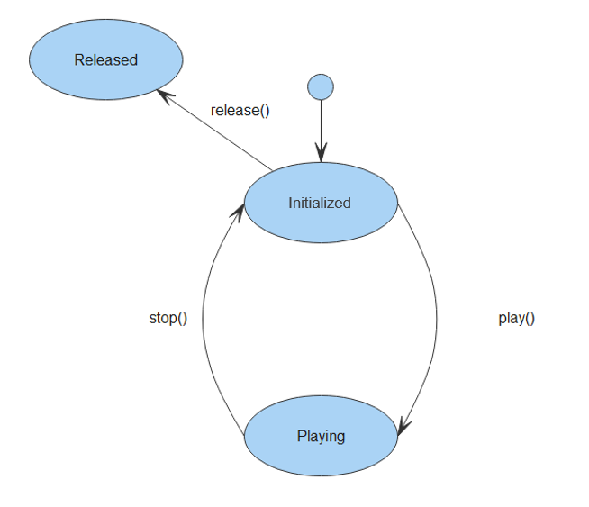

# Development Guidelines on Audio Playback

- [When to Use](#When-to-Use)
- [Available APIs](#Available-APIs)

## When to Use

You use audio playback APIs to convert audio data into audible analog signals, play the audio signals using output devices, and manage playback tasks.

**Figure 1** Playback status



## Available APIs

**Table 1** APIs for audio playback 

| API| Description| 
| -------- | -------- |
| media.createAudioPlayer() | Creates an **AudioPlayer** instance.| 
| AudioPlayer | Provides audio playback features. For details, see the table below.| 

**Table 2** AudioPlayer methods

| Method| Description| 
| -------- | -------- |
| release() | Releases audio resources.| 
| play() | Starts audio playback.| 
| pause() | Pauses playback.| 
| stop() | Stops playback.| 
| reset()<sup>7+</sup> | Resets the audio source to be played.| 
| setVolume(vol:&nbsp;number) | Sets playback volume.| 
| seek(timeMs:&nbsp;number) | Changes the playback position.| 
| src:string | Defines the URI of an audio file to play.| 
| state:AudioState | Defines the playback state.| 
| currentTime:number | Defines the current playback position.| 
| duration:number | Defines the playback duration. The value **-1** is returned if the data source does not support playback position change, for example, in the real-time streaming media scenario.| 
| loop:boolean | Defines whether to loop audio playback.| 
| on('play',&nbsp;function&nbsp;callback) | Subscribes to the playback start event.| 
| on('pause',&nbsp;function&nbsp;callback) | Subscribes to the playback pause event.| 
| on('stop',&nbsp;function&nbsp;callback) | Subscribes to the playback stop event.| 
| on('reset',&nbsp;function&nbsp;callback) | Subscribes to the playback reset event.| 
| on('finish',function&nbsp;callback) | Subscribes to the playback end event.| 
| on('error',&nbsp;function&nbsp;callback) | Subscribes to the playback error event.| 
| on('dataload',&nbsp;function&nbsp;callback) | Subscribes to the data loading event.| 
| on('volumeChange',&nbsp;function&nbsp;callback) | Subscribes to the volume change event.| 
| on('timeUpdate',&nbsp;function&nbsp;callback) | Subscribes to the progress change event.| 


1. Create an audio player.
   ```
   import media from '@ohos.multimedia.media';
   var player = media.createAudioPlayer();
   ```

2. Set the subscription events.
   ```
   player.on('play', (err, action) => {
       if (err) {
           console.error('Error returned in the play() callback.');
           return;
        }
        console.info('Current player duration: '+ player.duration);
        console.info('Current player time: ' + player.currentTime);
        console.info('Current player status: '+player.state);
        console.info('Pause MP3');
        player.pause();
   });
   player.on('pause', (err, action) => {
        if (err) {
            console.error('Error returned in the pause() callback.');
            return;
         }
         console.info('Current player status: ' + player.state);
         console.info('Current player time: ' + player.currentTime);
         player.seek(30000); // Seek for 30 seconds.
   });
   player.on('stop', (err, action) => {
       if (err) {
           console.error('Error returned in the stop() callback.');
           return;
       }
       console.info('stop callback invoked. State:' + player.state);
       player.reset();
   });
   player.on('dataLoad', (err, action) => {
       if (err) {
           console.error('Error returned in the dataLoad() callback.');
           return;
       }
        console.info('dataLoad callback invoked. Current time: ' + player.currentTime);
        console.info('Duration of the source:' + player.duration);
        player.play();
   });
   player.on('reset', (err, action) => {
       if (err) {
           console.error('Error returned in the reset() callback.');
           return;
       }
       console.info('reset callback invoked.');
       player.release();
   });
   player.on('finish', (err, action) => {
        if (err) {
           console.error('Error returned in the finish() callback.');
           return;
        }
        console.info('finish callback invoked.');
   });
   player.on('timeUpdate', (seekTime, action) => {
       console.info('Seek time: ' + seekTime);
       console.info('Current player time: ' + player.currentTime);
       var newTime = player.currentTime;
       if(newTime == 30000) {
           console.info('Seek succeeded. New time: ' + newTime);
       } else {
           console.error('Seek failed: ', + newTime);
        }
           player.stop();
   });
   player.on('error', (err) => {
        console.error('Player error: ${err.message}');
   });
   ```

3. Start playback.
   ```
   var audioSourceMp3 = 'file://test.mp3';
   player.src = audioSourceMp3;
   player.loop = true;
   ```
