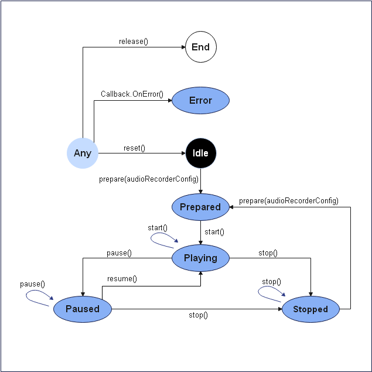
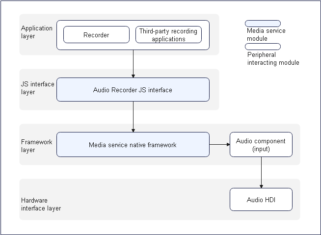

# Audio Recording Development

## When to Use

During audio recording, audio signals are captured, encoded, and saved to files. You can specify parameters such as the sampling rate, number of audio channels, encoding format, encapsulation format, and file path for audio recording.

**Figure 1** Audio recording state transition




**Figure 2** Layer 0 diagram of audio recording



## How to Develop

For details about the APIs, see [AudioRecorder in the Media API](../reference/apis/js-apis-media.md).

### Full-Process Scenario

The full audio recording process includes creating an instance, setting recording parameters, starting, pausing, resuming, and stopping recording, and releasing resources.

```js
import media from '@ohos.multimedia.media'
import mediaLibrary from '@ohos.multimedia.mediaLibrary'
export class AudioRecorderDemo {
  private testFdNumber; // Used to save the FD address.

  // Set the callbacks related to audio recording.
  setCallBack(audioRecorder) {
    audioRecorder.on('prepare', () => {              					       	// Set the prepare event callback.
      console.log('prepare success');
      audioRecorder.start();                                         			// Call the start API to start recording and trigger the start event callback.
    });
    audioRecorder.on('start', () => {    		     						   	// Set the start event callback.
      console.log('audio recorder start success');
      audioRecorder.pause();                                         			// Call the pause API to pause recording and trigger the pause event callback.
    });
    audioRecorder.on('pause', () => {    		     							// Set the pause event callback.
      console.log('audio recorder pause success');
      audioRecorder.resume();                                        			// Call the resume API to resume recording and trigger the resume event callback.
    });
    audioRecorder.on('resume', () => {    		     							// Set the resume event callback.
      console.log('audio recorder resume success');
      audioRecorder.stop();                                          			// Call the stop API to stop recording and trigger the stop event callback.
    });
    audioRecorder.on('stop', () => {    		     							// Set the stop event callback.
      console.log('audio recorder stop success');
      audioRecorder.reset();                                         			// Call the reset API to reset the recorder and trigger the reset event callback.
    });
    audioRecorder.on('reset', () => {    		     							// Set the reset event callback.
      console.log('audio recorder reset success');
      audioRecorder.release();                                       			// Call the release API to release resources and trigger the release event callback.
    });
    audioRecorder.on('release', () => {    		     							// Set the release event callback.
      console.log('audio recorder release success');
      audioRecorder = undefined;
    });
    audioRecorder.on('error', (error) => {             							// Set the error event callback.
      console.info(`audio error called, errName is ${error.name}`);
      console.info(`audio error called, errCode is ${error.code}`);
      console.info(`audio error called, errMessage is ${error.message}`);
    });
  }

  // pathName indicates the passed recording file name, for example, 01.mp3. The generated file address is /storage/media/100/local/files/Video/01.mp3.
  // To use the media library, declare the following permissions: ohos.permission.MEDIA_LOCATION, ohos.permission.WRITE_MEDIA, and ohos.permission.READ_MEDIA.
  async getFd(pathName) {
    let displayName = pathName;
    const mediaTest = mediaLibrary.getMediaLibrary();
    let fileKeyObj = mediaLibrary.FileKey;
    let mediaType = mediaLibrary.MediaType.VIDEO;
    let publicPath = await mediaTest.getPublicDirectory(mediaLibrary.DirectoryType.DIR_VIDEO);
    let dataUri = await mediaTest.createAsset(mediaType, displayName, publicPath);
    if (dataUri != undefined) {
      let args = dataUri.id.toString();
      let fetchOp = {
        selections : fileKeyObj.ID + "=?",
        selectionArgs : [args],
      }
      let fetchFileResult = await mediaTest.getFileAssets(fetchOp);
      let fileAsset = await fetchFileResult.getAllObject();
      let fdNumber = await fileAsset[0].open('Rw');
      this.testFdNumber = "fd://" + fdNumber.toString();
    }
  }

  async audioRecorderDemo() {
    // 1. Create an AudioRecorder instance.
    let audioRecorder = media.createAudioRecorder();
    // 2. Set the callbacks.
    this.setCallBack(audioRecorder);
    await this.getFd('01.mp3'); 							// Call the getFd method to obtain the FD address of the file to be recorded.
    // 3. Set the recording parameters.
    let audioRecorderConfig = {
      audioEncodeBitRate : 22050,
      audioSampleRate : 22050,
      numberOfChannels : 2,
      uri : this.testFdNumber,                             	// testFdNumber is generated by getFd.
      location : { latitude : 30, longitude : 130},
      audioEncoderMime : media.CodecMimeType.AUDIO_AAC,
      fileFormat : media.ContainerFormatType.CFT_MPEG_4A,
    }
    audioRecorder.prepare(audioRecorderConfig); 			// Call the prepare method to trigger the prepare event callback.
  }
}
```

### Normal Recording Scenario

Unlike the full-process scenario, the normal recording scenario does not include the process of pausing and resuming recording.

```js
import media from '@ohos.multimedia.media'
import mediaLibrary from '@ohos.multimedia.mediaLibrary'
export class AudioRecorderDemo {
  private testFdNumber; // Used to save the FD address.

  // Set the callbacks related to audio recording.
  setCallBack(audioRecorder) {
    audioRecorder.on('prepare', () => {              					       // Set the prepare event callback.
      console.log('prepare success');
      audioRecorder.start();                                         			// Call the start API to start recording and trigger the start event callback.
    });
    audioRecorder.on('start', () => {    		     							// Set the start event callback.
      console.log('audio recorder start success');
      audioRecorder.stop();                                          			// Call the stop API to stop recording and trigger the stop event callback.
    });
    audioRecorder.on('stop', () => {    		     							// Set the stop event callback.
      console.log('audio recorder stop success');
      audioRecorder.release();                                       			// Call the release API to release resources and trigger the release event callback.
    });
    audioRecorder.on('release', () => {    		     							// Set the release event callback.
      console.log('audio recorder release success');
      audioRecorder = undefined;
    });
    audioRecorder.on('error', (error) => {             							// Set the error event callback.
      console.info(`audio error called, errName is ${error.name}`);
      console.info(`audio error called, errCode is ${error.code}`);
      console.info(`audio error called, errMessage is ${error.message}`);
    });
  }

  // pathName indicates the passed recording file name, for example, 01.mp3. The generated file address is /storage/media/100/local/files/Video/01.mp3.
  // To use the media library, declare the following permissions: ohos.permission.MEDIA_LOCATION, ohos.permission.WRITE_MEDIA, and ohos.permission.READ_MEDIA.
  async getFd(pathName) {
    let displayName = pathName;
    const mediaTest = mediaLibrary.getMediaLibrary();
    let fileKeyObj = mediaLibrary.FileKey;
    let mediaType = mediaLibrary.MediaType.VIDEO;
    let publicPath = await mediaTest.getPublicDirectory(mediaLibrary.DirectoryType.DIR_VIDEO);
    let dataUri = await mediaTest.createAsset(mediaType, displayName, publicPath);
    if (dataUri != undefined) {
      let args = dataUri.id.toString();
      let fetchOp = {
        selections : fileKeyObj.ID + "=?",
        selectionArgs : [args],
      }
      let fetchFileResult = await mediaTest.getFileAssets(fetchOp);
      let fileAsset = await fetchFileResult.getAllObject();
      let fdNumber = await fileAsset[0].open('Rw');
      this.testFdNumber = "fd://" + fdNumber.toString();
    }
  }

  async audioRecorderDemo() {
    // 1. Create an AudioRecorder instance.
    let audioRecorder = media.createAudioRecorder();
    // 2. Set the callbacks.
    this.setCallBack(audioRecorder);
    await this.getFd('01.mp3'); 							// Call the getFd method to obtain the FD address of the file to be recorded.
    // 3. Set the recording parameters.
    let audioRecorderConfig = {
      audioEncodeBitRate : 22050,
      audioSampleRate : 22050,
      numberOfChannels : 2,
      uri : this.testFdNumber,                             	// testFdNumber is generated by getFd.
      location : { latitude : 30, longitude : 130},
      audioEncoderMime : media.CodecMimeType.AUDIO_AAC,
      fileFormat : media.ContainerFormatType.CFT_MPEG_4A,
    }
    audioRecorder.prepare(audioRecorderConfig); 			// Call the prepare method to trigger the prepare event callback.
  }
}
```

## Samples

The following samples are provided to help you better understand how to develop audio recording:

- [`Recorder`: Recorder (eTS, API version 8)](https://gitee.com/openharmony/app_samples/tree/master/media/Recorder)
- [`JsRecorder`: Recorder (JS, API version 8)](https://gitee.com/openharmony/app_samples/tree/master/media/JSRecorder)
- [`eTsAudioPlayer`: Audio Player (eTS)](https://gitee.com/openharmony/app_samples/blob/master/media/Recorder/entry/src/main/ets/MainAbility/pages/Play.ets)
- [Audio Player](https://gitee.com/openharmony/codelabs/tree/master/Media/Audio_OH_ETS)

