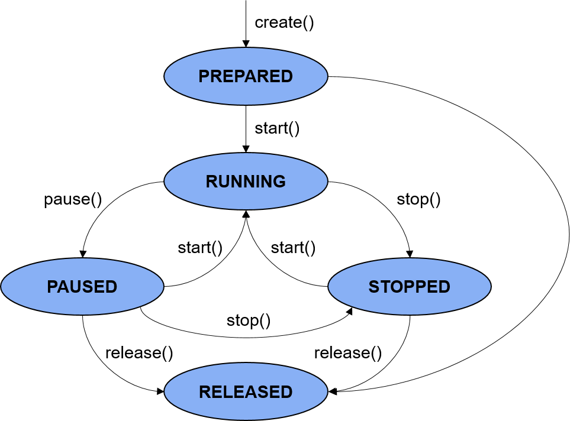

# Audio Rendering Development

## Introduction

**AudioRenderer** provides APIs for rendering audio files and controlling playback. It also supports audio interruption. You can use the APIs provided by **AudioRenderer** to play audio files in output devices and manage playback tasks.

Before calling the APIs, be familiar with the following terms:

- **Audio interruption**: When an audio stream with a higher priority needs to be played, the audio renderer interrupts the stream with a lower priority. For example, if a call comes in when the user is listening to music, the music playback, which is the lower priority stream, is paused.
- **Status check**: During application development, you are advised to use **on('stateChange')** to subscribe to state changes of the **AudioRenderer** instance. This is because some operations can be performed only when the audio renderer is in a given state. If the application performs an operation when the audio renderer is not in the given state, the system may throw an exception or generate other undefined behavior.
- **Asynchronous operation**: To prevent the UI thread from being blocked, most **AudioRenderer** calls are asynchronous. Each API provides the callback and promise functions. The following examples use the promise functions. For more information, see [AudioRenderer in Audio Management](../reference/apis/js-apis-audio.md#audiorenderer8).
- **Audio interruption mode**: OpenHarmony provides two audio interruption modes: **shared mode** and **independent mode**. In shared mode, all **AudioRenderer** instances created by the same application share one focus object, and there is no focus transfer inside the application. Therefore, no callback will be triggered. In independent mode, each **AudioRenderer** instance has an independent focus object, and focus preemption occurs. Focus preemption triggers focus transfer, and the **AudioRenderer** instance that originally has the focus receives a notification through the callback. By default, the shared mode is used. You can call **setInterruptMode()** to set the independent mode.

## Working Principles

The following figure shows the audio renderer state transitions.

Figure 1 Audio renderer state transitions



- **PREPARED**: The audio renderer enters this state by calling **create()**.
- **RUNNING**: The audio renderer enters this state by calling **start()** when it is in the **PREPARED** state or by calling **start()** when it is in the **STOPPED** state.
- **PAUSED**: The audio renderer in the **RUNNING** state can call **pause()** to pause the audio playback. After the audio playback is paused, it can call **start()** to resume the playback.
- **STOPPED**: The audio renderer in the **PAUSED** or **RUNNING** state can call **stop()** to stop the playback.
- **RELEASED**: The audio renderer in the **PREPARED**, **PAUSED**, or **STOPPED** state can use **release()** to release all occupied hardware and software resources. It will not transit to any other state after it enters the **RELEASED** state.

## How to Develop

For details about the APIs, see [AudioRenderer in Audio Management](../reference/apis/js-apis-audio.md#audiorenderer8).

1. Use **createAudioRenderer()** to create an **AudioRenderer** instance.
   

Set parameters of the **AudioRenderer** instance in **audioRendererOptions**. This instance is used to render audio, control and obtain the rendering status, and register a callback for notification.

   ```js
 import audio from '@ohos.multimedia.audio';
   
    let audioStreamInfo = {
        samplingRate: audio.AudioSamplingRate.SAMPLE_RATE_44100,
        channels: audio.AudioChannel.CHANNEL_1,
        sampleFormat: audio.AudioSampleFormat.SAMPLE_FORMAT_S16LE,
        encodingType: audio.AudioEncodingType.ENCODING_TYPE_RAW
    }
    let audioRendererInfo = {
        content: audio.ContentType.CONTENT_TYPE_SPEECH,
        usage: audio.StreamUsage.STREAM_USAGE_VOICE_COMMUNICATION,
        rendererFlags: 0 // 0 is the extended flag bit of the audio renderer. The default value is 0.
    }
    let audioRendererOptions = {
        streamInfo: audioStreamInfo,
        rendererInfo: audioRendererInfo
 }
   
    let audioRenderer = await audio.createAudioRenderer(audioRendererOptions);
    console.log("Create audio renderer success.");
   ```

2. Use **start()** to start audio rendering.

   ```js
   async function startRenderer() {
     let state = audioRenderer.state;
     // The audio renderer should be in the STATE_PREPARED, STATE_PAUSED, or STATE_STOPPED state after being started.
     if (state != audio.AudioState.STATE_PREPARED && state != audio.AudioState.STATE_PAUSED &&
       state != audio.AudioState.STATE_STOPPED) {
       console.info('Renderer is not in a correct state to start');
       return;
     }
   
     await audioRenderer.start();
   
     state = audioRenderer.state;
     if (state == audio.AudioState.STATE_RUNNING) {
       console.info('Renderer started');
     } else {
       console.error('Renderer start failed');
     }
   }
   ```
   The renderer state will be **STATE_RUNNING** once the audio renderer is started. The application can then begin reading buffers.


3. Call **write()** to write data to the buffer.

   Read the audio data to be played to the buffer. Call **write()** repeatedly to write the data to the buffer.

   ```js
   import fileio from '@ohos.fileio';
   import audio from '@ohos.multimedia.audio';

   async function writeBuffer(buf) {
     // The write operation can be performed only when the state is STATE_RUNNING.
     if (audioRenderer.state != audio.AudioState.STATE_RUNNING) {
       console.error('Renderer is not running, do not write');
       return;
     }
     let writtenbytes = await audioRenderer.write(buf);
     console.info(`Actual written bytes: ${writtenbytes} `);
     if (writtenbytes < 0) {
       console.error('Write buffer failed. check the state of renderer');
     }
   }
    
   // Set a proper buffer size for the audio renderer. You can also select a buffer of another size.
   const bufferSize = await audioRenderer.getBufferSize();
   let dir = globalThis.fileDir; // You must use the sandbox path.
   const path = dir + '/file_example_WAV_2MG.wav'; // The file to render is in the following path: /data/storage/el2/base/haps/entry/files/file_example_WAV_2MG.wav
   console.info(`file path: ${ path}`);
   let ss = fileio.createStreamSync(path, 'r');
   const totalSize = fileio.statSync(path).size; // Size of the file to render.
   let discardHeader = new ArrayBuffer(bufferSize);
   ss.readSync(discardHeader);
   let rlen = 0;
   rlen += bufferSize;
    
   let id = setInterval(() => {
     if (audioRenderer.state == audio.AudioState.STATE_RELEASED) { // The rendering stops if the audio renderer is in the STATE_RELEASED state.
       ss.closeSync();
       await audioRenderer.stop();
       clearInterval(id);
     }
     if (audioRenderer.state == audio.AudioState.STATE_RUNNING) {
       if (rlen >= totalSize) { // The rendering stops if the file finishes reading.
         ss.closeSync();
         await audioRenderer.stop();
         clearInterval(id);
       }
       let buf = new ArrayBuffer(bufferSize);
       rlen += ss.readSync(buf);
       console.info(`Total bytes read from file: ${rlen}`);
       writeBuffer(buf);
     } else {
       console.info('check after next interval');
     }
   }, 30); // The timer interval is set based on the audio format. The unit is millisecond.
   ```

4. (Optional) Call **pause()** or **stop()** to pause or stop rendering.

   ```js
    async function pauseRenderer() {
      let state = audioRenderer.state;
      // The audio renderer can be paused only when it is in the STATE_RUNNING state.
      if (state != audio.AudioState.STATE_RUNNING) {
        console.info('Renderer is not running');
        return;
      }

      await audioRenderer.pause();

      state = audioRenderer.state;
      if (state == audio.AudioState.STATE_PAUSED) {
        console.info('Renderer paused');
      } else {
        console.error('Renderer pause failed');
      }
    }

    async function stopRenderer() {
      let state = audioRenderer.state;
      // The audio renderer can be stopped only when it is in STATE_RUNNING or STATE_PAUSED state.
      if (state != audio.AudioState.STATE_RUNNING && state != audio.AudioState.STATE_PAUSED) {
        console.info('Renderer is not running or paused');
        return;
      }

      await audioRenderer.stop();

      state = audioRenderer.state;
      if (state == audio.AudioState.STATE_STOPPED) {
        console.info('Renderer stopped');
      } else {
        console.error('Renderer stop failed');
      }
    }
   ```

5. (Optional) Call **drain()** to clear the buffer.

   ```js
    async function drainRenderer() {
      let state = audioRenderer.state;
      // drain() can be used only when the audio renderer is in the STATE_RUNNING state.
      if (state != audio.AudioState.STATE_RUNNING) {
        console.info('Renderer is not running');
        return;
      }

      await audioRenderer.drain();

      state = audioRenderer.state;
    }
   ```

6. After the task is complete, call **release()** to release related resources.

   **AudioRenderer** uses a large number of system resources. Therefore, ensure that the resources are released after the task is complete.

   ```js
    async function releaseRenderer() {
      let state = audioRenderer.state;
      // The audio renderer can be released only when it is not in the STATE_RELEASED or STATE_NEW state.
      if (state == audio.AudioState.STATE_RELEASED || state == audio.AudioState.STATE_NEW) {
        console.info('Renderer already released');
        return;
      }

      await audioRenderer.release();

      state = audioRenderer.state;
      if (state == audio.AudioState.STATE_RELEASED) {
        console.info('Renderer released');
      } else {
        console.info('Renderer release failed');
      }
    }
   ```

7. (Optional) Obtain the audio renderer information.
   
   You can use the following code to obtain the audio renderer information:

   ```js
   // Obtain the audio renderer state.
   let state = audioRenderer.state;
   
   // Obtain the audio renderer information.
   let audioRendererInfo : audio.AudioRendererInfo = await audioRenderer.getRendererInfo();

   // Obtain the audio stream information.
   let audioStreamInfo : audio.AudioStreamInfo = await audioRenderer.getStreamInfo();

   // Obtain the audio stream ID.
   let audioStreamId : number = await audioRenderer.getAudioStreamId();

   // Obtain the Unix timestamp, in nanoseconds.
   let audioTime : number = await audioRenderer.getAudioTime();

   // Obtain a proper minimum buffer size.
   let bufferSize : number = await audioRenderer.getBuffersize();

   // Obtain the audio renderer rate.
   let renderRate : audio.AudioRendererRate = await audioRenderer.getRenderRate();
   ```

8. (Optional) Set the audio renderer information.
   
   You can use the following code to set the audio renderer information:

   ```js
   // Set the audio renderer rate to RENDER_RATE_NORMAL.
   let renderRate : audio.AudioRendererRate = audio.AudioRendererRate.RENDER_RATE_NORMAL;
   await audioRenderer.setRenderRate(renderRate);

   // Set the interruption mode of the audio renderer to SHARE_MODE.
   let interruptMode : audio.InterruptMode = audio.InterruptMode.SHARE_MODE;
   await audioRenderer.setInterruptMode(interruptMode);

   // Set the volume of the stream to 10.
   let volume : number = 10;
   await audioRenderer.setVolume(volume);
   ```

9. (Optional) Use **on('audioInterrupt')** to subscribe to the audio interruption event, and use **off('audioInterrupt')** to unsubscribe from the event.

   Audio interruption means that Stream A will be interrupted when Stream B with a higher or equal priority requests to become active and use the output device.

   In some cases, the audio renderer performs forcible operations such as pausing and ducking, and notifies the application through **InterruptEvent**. In other cases, the application can choose to act on the **InterruptEvent** or ignore it.

   In the case of audio interruption, the application may encounter write failures. To avoid such failures, interruption-unaware applications can use **audioRenderer.state** to check the audio renderer state before writing audio data. The applications can obtain more details by subscribing to the audio interruption events. For details, see [InterruptEvent](../reference/apis/js-apis-audio.md#interruptevent9).

   It should be noted that the audio interruption event subscription of the **AudioRenderer** module is slightly different from **on('interrupt')** in [AudioManager](../reference/apis/js-apis-audio.md#audiomanager). The **on('interrupt')** and **off('interrupt')** APIs are deprecated since API version 9. In the **AudioRenderer** module, you only need to call **on('audioInterrupt')** to listen for focus change events. When the **AudioRenderer** instance created by the application performs actions such as start, stop, and pause, it requests the focus, which triggers focus transfer and in return enables the related **AudioRenderer** instance to receive a notification through the callback. For instances other than **AudioRenderer**, such as frequency modulation (FM) and voice wakeup, the application does not create an instance. In this case, the application can call **on('interrupt')** in **AudioManager** to receive a focus change notification.
   
   ```js
   audioRenderer.on('audioInterrupt', (interruptEvent) => {
     console.info('InterruptEvent Received');
     console.info(`InterruptType: ${interruptEvent.eventType}`);
     console.info(`InterruptForceType: ${interruptEvent.forceType}`);
     console.info(`AInterruptHint: ${interruptEvent.hintType}`);

     if (interruptEvent.forceType == audio.InterruptForceType.INTERRUPT_FORCE) {
       switch (interruptEvent.hintType) {
         // Forcible pausing initiated by the audio framework. To prevent data loss, stop the write operation.
         case audio.InterruptHint.INTERRUPT_HINT_PAUSE:
           isPlay = false;
           break;
         // Forcible stopping initiated by the audio framework. To prevent data loss, stop the write operation.
         case audio.InterruptHint.INTERRUPT_HINT_STOP:
           isPlay = false;
           break;
         // Forcible ducking initiated by the audio framework.
         case audio.InterruptHint.INTERRUPT_HINT_DUCK:
           break;
         // Undocking initiated by the audio framework.
         case audio.InterruptHint.INTERRUPT_HINT_UNDUCK:
           break;
       }
     } else if (interruptEvent.forceType == audio.InterruptForceType.INTERRUPT_SHARE) {
       switch (interruptEvent.hintType) {
         // Notify the application that the rendering starts.
         case audio.InterruptHint.INTERRUPT_HINT_RESUME:
           startRenderer();
           break;
         // Notify the application that the audio stream is interrupted. The application determines whether to continue. (In this example, the application pauses the rendering.)
         case audio.InterruptHint.INTERRUPT_HINT_PAUSE:
           isPlay = false;
           pauseRenderer();
           break;
       }
     }
   });

   audioRenderer.off('audioInterrupt'); // Unsubscribe from the audio interruption event. This event will no longer be received.
   ```

10. (Optional) Use **on('markReach')** to subscribe to the mark reached event, and use **off('markReach')** to unsubscribe from the event.

    After the mark reached event is subscribed to, when the number of frames rendered by the audio renderer reaches the specified value, a callback is triggered and the specified value is returned.
   
    ```js
    audioRenderer.on('markReach', (reachNumber) => {
      console.info('Mark reach event Received');
      console.info(`The renderer reached frame: ${reachNumber}`);
    });

    audioRenderer.off('markReach'); // Unsubscribe from the mark reached event. This event will no longer be listened for.
    ```

11. (Optional) Use **on('periodReach')** to subscribe to the period reached event, and use **off('periodReach')** to unsubscribe from the event.

    After the period reached event is subscribed to, each time the number of frames rendered by the audio renderer reaches the specified value, a callback is triggered and the specified value is returned.
   
    ```js
    audioRenderer.on('periodReach', (reachNumber) => {
      console.info('Period reach event Received');
      console.info(`In this period, the renderer reached frame: ${reachNumber} `);
    });

    audioRenderer.off('periodReach'); // Unsubscribe from the period reached event. This event will no longer be listened for.
    ```

12. (Optional) Use **on('stateChange')** to subscribe to audio renderer state changes.

    After the **stateChange** event is subscribed to, when the audio renderer state changes, a callback is triggered and the audio renderer state is returned.
   
    ```js
    audioRenderer.on('stateChange', (audioState) => {
      console.info('State change event Received');
      console.info(`Current renderer state is: ${audioState}`);
    });
    ```

13. (Optional) Handle exceptions of **on()**.

    If the string or the parameter type passed in **on()** is incorrect , the application throws an exception. In this case, you can use **try catch** to capture the exception.
   
    ```js
    try {
      audioRenderer.on('invalidInput', () => { // The string does not match.
      })
    } catch (err) {
      console.info(`Call on function error, ${err}`); // The application throws exception 401.
    }
    try {
      audioRenderer.on(1, () => { // The type of the input parameter is incorrect.
      })
    } catch (err) {
      console.info(`Call on function error,  ${err}`); // The application throws exception 6800101.
    }
    ```

14. (Optional) Refer to the complete example of **on('audioInterrupt')**.
    
    Create **AudioRender1** and **AudioRender2** in an application, configure the independent interruption mode, and call **on('audioInterrupt')** to subscribe to audio interruption events. At the beginning, **AudioRender1** has the focus. When **AudioRender2** attempts to obtain the focus, **AudioRenderer1** receives a focus transfer notification and the related log information is printed. If the shared mode is used, the log information will not be printed during application running.
    
    ```js
     async runningAudioRender1(){
       let audioStreamInfo = {
         samplingRate: audio.AudioSamplingRate.SAMPLE_RATE_48000,
         channels: audio.AudioChannel.CHANNEL_1,
         sampleFormat: audio.AudioSampleFormat.SAMPLE_FORMAT_S32LE,
         encodingType: audio.AudioEncodingType.ENCODING_TYPE_RAW
       }
       let audioRendererInfo = {
         content: audio.ContentType.CONTENT_TYPE_MUSIC,
         usage: audio.StreamUsage.STREAM_USAGE_MEDIA,
         rendererFlags: 0 // 0 is the extended flag bit of the audio renderer. The default value is 0.
       }
       let audioRendererOptions = {
         streamInfo: audioStreamInfo,
     rendererInfo: audioRendererInfo
       }
    
       // 1.1 Create an instance.
      audioRenderer1 = await audio.createAudioRenderer(audioRendererOptions);
       console.info("Create audio renderer 1 success.");
    
       // 1.2 Set the independent mode.
       audioRenderer1.setInterruptMode(1).then( data => {
         console.info('audioRenderer1 setInterruptMode Success!');
       }).catch((err) => {
     console.error(`audioRenderer1 setInterruptMode Fail: ${err}`);
       });
    
       // 1.3 Set the listener.
       audioRenderer1.on('audioInterrupt', async(interruptEvent) => {
     console.info(`audioRenderer1 on audioInterrupt : ${JSON.stringify(interruptEvent)}`)
       });
    
       // 1.4 Start rendering.
      await audioRenderer1.start();
       console.info('startAudioRender1 success');
    
       // 1.5 Obtain the buffer size, which is the proper minimum buffer size of the audio renderer. You can also select a buffer of another size.
      const bufferSize = await audioRenderer1.getBufferSize();
       console.info(`audio bufferSize: ${bufferSize}`);
    
       // 1.6 Obtain the original audio data file.
       let dir = globalThis.fileDir; // You must use the sandbox path.
       const path1 = dir + '/music001_48000_32_1.wav'; // The file to render is in the following path: /data/storage/el2/base/haps/entry/files/music001_48000_32_1.wav
       console.info(`audioRender1 file path: ${ path1}`);
       let ss1 = await fileio.createStream(path1,'r');
       const totalSize1 = fileio.statSync(path1).size; // Size of the file to render.
       console.info(`totalSize1   -------: ${totalSize1}`);
       let discardHeader = new ArrayBuffer(bufferSize);
       ss1.readSync(discardHeader);
      let rlen = 0;
       rlen += bufferSize;
    
       // 1.7 Render the original audio data in the buffer by using audioRenderer.
       let id = setInterval(async () => {
         if (audioRenderer1.state == audio.AudioState.STATE_RELEASED) { // The rendering stops if the audio renderer is in the STATE_RELEASED state.
           ss1.closeSync();
           audioRenderer1.stop();
           clearInterval(id);
         }
         if (audioRenderer1.state == audio.AudioState.STATE_RUNNING) {
           if (rlen >= totalSize1) { // The rendering stops if the file finishes reading.
             ss1.closeSync();
             await audioRenderer1.stop();
             clearInterval(id);
           }
           let buf = new ArrayBuffer(bufferSize);
           rlen += ss1.readSync(buf);
           console.info(`Total bytes read from file: ${rlen}`);
           await writeBuffer(buf, that.audioRenderer1);
         } else {
           console.info('check after next interval');
         }
      }, 30); // The timer interval is set based on the audio format. The unit is millisecond.
     }
    
     async runningAudioRender2(){
       let audioStreamInfo = {
         samplingRate: audio.AudioSamplingRate.SAMPLE_RATE_48000,
         channels: audio.AudioChannel.CHANNEL_1,
         sampleFormat: audio.AudioSampleFormat.SAMPLE_FORMAT_S32LE,
         encodingType: audio.AudioEncodingType.ENCODING_TYPE_RAW
       }
       let audioRendererInfo = {
         content: audio.ContentType.CONTENT_TYPE_MUSIC,
         usage: audio.StreamUsage.STREAM_USAGE_MEDIA,
         rendererFlags: 0 // 0 is the extended flag bit of the audio renderer. The default value is 0.
       }
       let audioRendererOptions = {
         streamInfo: audioStreamInfo,
     rendererInfo: audioRendererInfo
       }
    
       // 2.1 Create another instance.
      audioRenderer2 = await audio.createAudioRenderer(audioRendererOptions);
       console.info("Create audio renderer 2 success.");
    
       // 2.2 Set the independent mode.
       audioRenderer2.setInterruptMode(1).then( data => {
         console.info('audioRenderer2 setInterruptMode Success!');
       }).catch((err) => {
     console.error(`audioRenderer2 setInterruptMode Fail: ${err}`);
       });
    
       // 2.3 Set the listener.
       audioRenderer2.on('audioInterrupt', async(interruptEvent) => {
     console.info(`audioRenderer2 on audioInterrupt : ${JSON.stringify(interruptEvent)}`)
       });
    
       // 2.4 Start rendering.
      await audioRenderer2.start();
       console.info('startAudioRender2 success');
    
       // 2.5 Obtain the buffer size.
      const bufferSize = await audioRenderer2.getBufferSize();
       console.info(`audio bufferSize: ${bufferSize}`);
    
       // 2.6 Read the original audio data file.
       let dir = globalThis.fileDir; // You must use the sandbox path.
       const path2 = dir + '/music002_48000_32_1.wav'; // The file to render is in the following path: /data/storage/el2/base/haps/entry/files/music002_48000_32_1.wav
       console.error(`audioRender1 file path: ${ path2}`);
       let ss2 = await fileio.createStream(path2,'r');
       const totalSize2 = fileio.statSync(path2).size; // Size of the file to render.
       console.error(`totalSize2   -------: ${totalSize2}`);
       let discardHeader2 = new ArrayBuffer(bufferSize);
       ss2.readSync(discardHeader2);
      let rlen = 0;
       rlen += bufferSize;
    
       // 2.7 Render the original audio data in the buffer by using audioRenderer.
       let id = setInterval(async () => {
         if (audioRenderer2.state == audio.AudioState.STATE_RELEASED) { // The rendering stops if the audio renderer is in the STATE_RELEASED state.
           ss2.closeSync();
           that.audioRenderer2.stop();
           clearInterval(id);
         }
         if (audioRenderer1.state == audio.AudioState.STATE_RUNNING) {
           if (rlen >= totalSize2) { // The rendering stops if the file finishes reading.
             ss2.closeSync();
             await audioRenderer2.stop();
             clearInterval(id);
           }
           let buf = new ArrayBuffer(bufferSize);
           rlen += ss2.readSync(buf);
           console.info(`Total bytes read from file: ${rlen}`);
           await writeBuffer(buf, that.audioRenderer2);
         } else {
           console.info('check after next interval');
         }
      }, 30); // The timer interval is set based on the audio format. The unit is millisecond.
     }
    
     async writeBuffer(buf, audioRender) {
       let writtenbytes;
       await audioRender.write(buf).then((value) => {
         writtenbytes = value;
         console.info(`Actual written bytes: ${writtenbytes} `);
       });
       if (typeof(writtenbytes) != 'number' || writtenbytes < 0) {
         console.error('get Write buffer failed. check the state of renderer');
      }
     }
    
     // Integrated invoking entry.
     async test(){
       await runningAudioRender1();
      await runningAudioRender2();
     }
    
    ```
