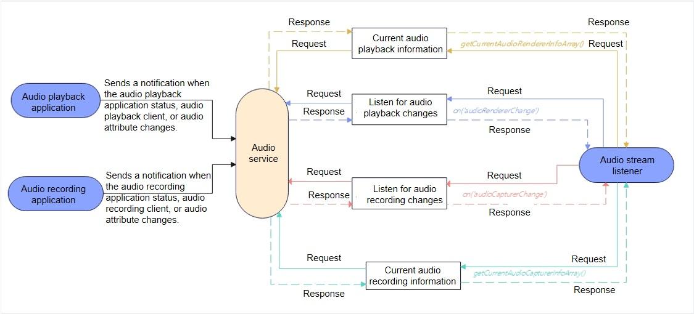

# Audio Stream Management Development

## Introduction

You can use **AudioStreamManager** to manage audio streams.

## Working Principles

The following figure shows the calling relationship of **AudioStreamManager** APIs.

**Figure 1** AudioStreamManager API calling relationship



**NOTE**: During application development, use **getStreamManager()** to create an **AudioStreamManager** instance. Then, you can call **on('audioRendererChange')** or **on('audioCapturerChange')** to listen for status, client, and audio attribute changes of the audio playback or recording application. To cancel the listening for these changes, call **off('audioRendererChange')** or **off('audioCapturerChange')**. You can call **getCurrentAudioRendererInfoArray()** to obtain information about the audio playback application, such as the unique audio stream ID, UID of the audio playback client, and audio status. Similarly, you can call **getCurrentAudioCapturerInfoArray()** to obtain information about the audio recording application.

## How to Develop

For details about the APIs, see [AudioStreamManager](../reference/apis/js-apis-audio.md#audiostreammanager9).

1. Create an **AudioStreamManager** instance.

   Before using **AudioStreamManager** APIs, you must use **getStreamManager()** to create an **AudioStreamManager** instance.

   ```js
   var audioManager = audio.getAudioManager();
   var audioStreamManager = audioManager.getStreamManager();
   ```

2. (Optional) Call **on('audioRendererChange')** to listen for audio renderer changes.

  If an application needs to receive notifications when the audio playback application status, audio playback client, or audio attribute changes, it can subscribe to this event. For more events that can be subscribed to, see [Audio Management](../reference/apis/js-apis-audio.md).

  ```js
  audioStreamManager.on('audioRendererChange',  (AudioRendererChangeInfoArray) => {
    for (let i = 0; i < AudioRendererChangeInfoArray.length; i++) {
      AudioRendererChangeInfo = AudioRendererChangeInfoArray[i];
      console.info('## RendererChange on is called for ' + i + ' ##');
      console.info('StreamId for ' + i + ' is:' + AudioRendererChangeInfo.streamId);
      console.info('ClientUid for ' + i + ' is:' + AudioRendererChangeInfo.clientUid);
      console.info('Content for ' + i + ' is:' + AudioRendererChangeInfo.rendererInfo.content);
      console.info('Stream for ' + i + ' is:' + AudioRendererChangeInfo.rendererInfo.usage);
      console.info('Flag ' + i + ' is:' + AudioRendererChangeInfo.rendererInfo.rendererFlags);
      console.info('State for ' + i + ' is:' + AudioRendererChangeInfo.rendererState);  
      var devDescriptor = AudioRendererChangeInfo.deviceDescriptors;
      for (let j = 0; j < AudioRendererChangeInfo.deviceDescriptors.length; j++) {
        console.info('Id:' + i + ':' + AudioRendererChangeInfo.deviceDescriptors[j].id);
        console.info('Type:' + i + ':' + AudioRendererChangeInfo.deviceDescriptors[j].deviceType);
        console.info('Role:' + i + ':' + AudioRendererChangeInfo.deviceDescriptors[j].deviceRole);
        console.info('Name:' + i + ':' + AudioRendererChangeInfo.deviceDescriptors[j].name);
        console.info('Address:' + i + ':' + AudioRendererChangeInfo.deviceDescriptors[j].address);
        console.info('SampleRates:' + i + ':' + AudioRendererChangeInfo.deviceDescriptors[j].sampleRates[0]);
        console.info('ChannelCounts' + i + ':' + AudioRendererChangeInfo.deviceDescriptors[j].channelCounts[0]);
        console.info('ChannelMask:' + i + ':' + AudioRendererChangeInfo.deviceDescriptors[j].channelMasks);
      }
    }
  });
  ```

3. (Optional) Call **off('audioRendererChange')** to cancel listening for audio renderer changes.

   ```js
   audioStreamManager.off('audioRendererChange');
   console.info('######### RendererChange Off is called #########');
   ```

4. (Optional) Call **on('audioCapturerChange')** to listen for audio capturer changes.

  If an application needs to receive notifications when the audio recording application status, audio recording client, or audio attribute changes, it can subscribe to this event. For more events that can be subscribed to, see [Audio Management](../reference/apis/js-apis-audio.md).

  ```js
  audioStreamManager.on('audioCapturerChange', (AudioCapturerChangeInfoArray) =>  {
    for (let i = 0; i < AudioCapturerChangeInfoArray.length; i++) {
      console.info(' ## audioCapturerChange on is called for element ' + i + ' ##');
      console.info('StreamId for ' + i + 'is:' + AudioCapturerChangeInfoArray[i].streamId);
      console.info('ClientUid for ' + i + 'is:' + AudioCapturerChangeInfoArray[i].clientUid);
      console.info('Source for ' + i + 'is:' + AudioCapturerChangeInfoArray[i].capturerInfo.source);
      console.info('Flag ' + i + 'is:' + AudioCapturerChangeInfoArray[i].capturerInfo.capturerFlags);
      console.info('State for ' + i + 'is:' + AudioCapturerChangeInfoArray[i].capturerState);  
      for (let j = 0; j < AudioCapturerChangeInfoArray[i].deviceDescriptors.length; j++) {
        console.info('Id:' + i + ':' + AudioCapturerChangeInfoArray[i].deviceDescriptors[j].id);
        console.info('Type:' + i + ':' + AudioCapturerChangeInfoArray[i].deviceDescriptors[j].deviceType);
        console.info('Role:' + i + ':' + AudioCapturerChangeInfoArray[i].deviceDescriptors[j].deviceRole);
        console.info('Name:' + i + ':' + AudioCapturerChangeInfoArray[i].deviceDescriptors[j].name);
        console.info('Address:' + i + ':' + AudioCapturerChangeInfoArray[i].deviceDescriptors[j].address);
        console.info('SampleRates:' + i + ':' + AudioCapturerChangeInfoArray[i].deviceDescriptors[j].sampleRates[0]);
        console.info('ChannelCounts' + i + ':' + AudioCapturerChangeInfoArray[i].deviceDescriptors[j].channelCounts[0]);
        console.info('ChannelMask:' + i + ':' + AudioCapturerChangeInfoArray[i].deviceDescriptors[j].channelMasks);
      }
    }
  });
  ```

5. (Optional) Call **off('audioCapturerChange')** to cancel listening for audio capturer changes.

   ```js
   audioStreamManager.off('audioCapturerChange');
   console.info('######### CapturerChange Off is called #########');
   ```

6. (Optional) Call **getCurrentAudioRendererInfoArray()** to obtain information about the current audio renderer.

  This API can be used to obtain the unique ID of the audio stream, UID of the audio playback client, audio status, and other information about the audio player. Before calling this API, a third-party application must have the **ohos.permission.USE_BLUETOOTH** permission configured, for the device name and device address to be displayed correctly.

  ```js
  await audioStreamManager.getCurrentAudioRendererInfoArray().then( function (AudioRendererChangeInfoArray) {
    console.info('######### Get Promise is called ##########');
    if (AudioRendererChangeInfoArray != null) {
      for (let i = 0; i < AudioRendererChangeInfoArray.length; i++) {
        AudioRendererChangeInfo = AudioRendererChangeInfoArray[i];
        console.info('StreamId for ' + i +' is:' + AudioRendererChangeInfo.streamId);
        console.info('ClientUid for ' + i + ' is:' + AudioRendererChangeInfo.clientUid);
        console.info('Content ' + i + ' is:' + AudioRendererChangeInfo.rendererInfo.content);
        console.info('Stream' + i +' is:' + AudioRendererChangeInfo.rendererInfo.usage);
        console.info('Flag' + i + ' is:' + AudioRendererChangeInfo.rendererInfo.rendererFlags); 
        console.info('State for ' + i + ' is:' + AudioRendererChangeInfo.rendererState);  
        var devDescriptor = AudioRendererChangeInfo.deviceDescriptors;
        for (let j = 0; j < AudioRendererChangeInfo.deviceDescriptors.length; j++) {
          console.info('Id:' + i + ':' + AudioRendererChangeInfo.deviceDescriptors[j].id);
          console.info('Type:' + i + ':' + AudioRendererChangeInfo.deviceDescriptors[j].deviceType);
          console.info('Role:' + i + ':' + AudioRendererChangeInfo.deviceDescriptors[j].deviceRole);
          console.info('Name:' + i + ':' + AudioRendererChangeInfo.deviceDescriptors[j].name);
          console.info('Address:' + i + ':' + AudioRendererChangeInfo.deviceDescriptors[j].address);
          console.info('SampleRates:' + i + ':' + AudioRendererChangeInfo.deviceDescriptors[j].sampleRates[0]);
          console.info('ChannelCounts' + i + ':' + AudioRendererChangeInfo.deviceDescriptors[j].channelCounts[0]);
          console.info('ChannelMask:' + i + ':' + AudioRendererChangeInfo.deviceDescriptors[j].channelMasks);
        }
      }
    }
  }).catch((err) => {
    console.log('getCurrentAudioRendererInfoArray :ERROR: ' + err.message);
  });
  ```

7. (Optional) Call **getCurrentAudioCapturerInfoArray()** to obtain information about the current audio capturer.
  This API can be used to obtain the unique ID of the audio stream, UID of the audio recording client, audio status, and other information about the audio capturer. Before calling this API, a third-party application must have the **ohos.permission.USE_BLUETOOTH** permission configured, for the device name and device address to be displayed correctly.

  ```js
  await audioStreamManager.getCurrentAudioCapturerInfoArray().then( function (AudioCapturerChangeInfoArray) {
    console.info('getCurrentAudioCapturerInfoArray: **** Get Promise Called ****');
    if (AudioCapturerChangeInfoArray != null) {
      for (let i = 0; i < AudioCapturerChangeInfoArray.length; i++) {
        console.info('StreamId for ' + i + 'is:' + AudioCapturerChangeInfoArray[i].streamId);
        console.info('ClientUid for ' + i + 'is:' + AudioCapturerChangeInfoArray[i].clientUid);
        console.info('Source for ' + i + 'is:' + AudioCapturerChangeInfoArray[i].capturerInfo.source);
        console.info('Flag ' + i + 'is:' + AudioCapturerChangeInfoArray[i].capturerInfo.capturerFlags);
        console.info('State for ' + i + 'is:' + AudioCapturerChangeInfoArray[i].capturerState);  
        var devDescriptor = AudioCapturerChangeInfoArray[i].deviceDescriptors;
        for (let j = 0; j < AudioCapturerChangeInfoArray[i].deviceDescriptors.length; j++) {
          console.info('Id:' + i + ':' + AudioCapturerChangeInfoArray[i].deviceDescriptors[j].id);
          console.info('Type:' + i + ':' + AudioCapturerChangeInfoArray[i].deviceDescriptors[j].deviceType);
          console.info('Role:' + i + ':' + AudioCapturerChangeInfoArray[i].deviceDescriptors[j].deviceRole);
          console.info('Name:' + i + ':' + AudioCapturerChangeInfoArray[i].deviceDescriptors[j].name)
          console.info('Address:' + i + ':' + AudioCapturerChangeInfoArray[i].deviceDescriptors[j].address);
          console.info('SampleRates:' + i + ':' + AudioCapturerChangeInfoArray[i].deviceDescriptors[j].sampleRates[0]);
          console.info('ChannelCounts' + i + ':' + AudioCapturerChangeInfoArray[i].deviceDescriptors[j].channelCounts[0]);
          console.info('ChannelMask:' + i + ':' + AudioCapturerChangeInfoArray[i].deviceDescriptors[j].channelMasks);
        }
      }
    }
  }).catch((err) => {
    console.log('getCurrentAudioCapturerInfoArray :ERROR: ' + err.message);
  });
  ```
