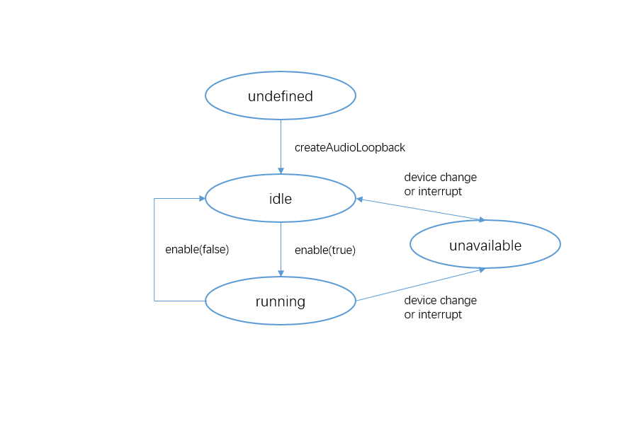

# Low-Latency Audio Monitoring

AudioLoopback is an audio monitoring tool that delivers audio to headphones with reduced latency in real time, enabling users to hear their own voice or other relevant sounds immediately.

It is commonly used in karaoke applications, where the recorded vocals and background music are sent to the headphones in real time. This allows users to adjust their performance based on the feedback, enhancing their experience.

When audio loopback is enabled, the system creates a low-latency renderer and capturer to implement low-latency in-ear monitoring. The audio captured is routed back to the renderer through an internal path. The renderer follows the audio focus strategy for [STREAM_USAGE_MUSIC](../../reference/apis-audio-kit/arkts-apis-audio-e.md#streamusage), whereas the capturer follows the strategy for [SOURCE_TYPE_MIC](../../reference/apis-audio-kit/arkts-apis-audio-e.md#sourcetype8).

The system automatically chooses the input and output devices. If these devices do not support low latency, audio loopback does not work. If another audio stream takes over the audio focus or if the input or output device changes to the one that does not support low latency, the system disables audio loopback automatically.

## Prerequisites

- Currently, low-latency audio monitoring is only supported through wired headphones, where audio is captured and played back via the wired headphones.

- Low-power renderers and low-latency renderers cannot be used concurrently in API version 20. To enable a renderer, you are advised to use [STREAM_USAGE_UNKNOWN](../../reference/apis-audio-kit/arkts-apis-audio-e.md#streamusage). If [STREAM_USAGE_MUSIC](../../reference/apis-audio-kit/arkts-apis-audio-e.md#streamusage) is used, the system creates a normal renderer.

## Development Guidelines

Using AudioLoopback for audio monitoring involves querying the monitoring capability with [isAudioLoopbackSupported](../../reference/apis-audio-kit/arkts-apis-audio-AudioStreamManager.md#isaudioloopbacksupported20), creating an AudioLoopback instance, setting the volume, listening for status changes, and enabling/disabling audio loopback. This guide walks you through the process of enabling audio monitoring using AudioLoopback, with a focus on how to use AudioLoopback for audio monitoring. You are advised to read this in conjunction with the [AudioLoopback](../../reference/apis-audio-kit/arkts-apis-audio-AudioLoopback.md) API documentation.

The figure below shows the status changes of the AudioLoopback. After an AudioLoopback instance is created, different APIs can be called to switch the AudioLoopback to different states and trigger the required behavior.

If an API is called when the AudioLoopback is not in the given state, the system may throw an exception or generate other undefined behavior. Therefore, you are advised to check the AudioLoopback state before triggering state transition.

**AudioLoopback status changes**



The [on('statusChange')](../../reference/apis-audio-kit/arkts-apis-audio-AudioLoopback.md#onstatuschange20) API can be used to listen for AudioLoopback status changes. For details about the value and description of each status, see [AudioLoopbackStatus](../../reference/apis-audio-kit/arkts-apis-audio-e.md#audioloopbackstatus20).

### How to Develop

1. Query the audio monitoring capability and create an AudioLoopback instance. For details about the AudioLoopback mode, see [AudioLoopbackMode](../../reference/apis-audio-kit/arkts-apis-audio-e.md#audioloopbackmode20).

   > **NOTE**
   >
   > You must request the ohos.permission.MICROPHONE permission for audio monitoring. For details, see [Requesting User Authorization](../../security/AccessToken/request-user-authorization.md).

   ```ts
    import { audio } from '@kit.AudioKit';
    import { BusinessError } from '@kit.BasicServicesKit';
    
    let mode: audio.AudioLoopbackMode.HARDWARE;
    let audioLoopback: audio.AudioLoopback;
    let isSupported = audio.getAudioManager().getStreamManager().isAudioLoopbackSupported(mode);
    if (isSupported) {
      audio.createAudioLoopback(mode).then((loopback) => {
        audioLoopback = loopback;
        console.info('Invoke createAudioLoopback succeeded.');
      }).catch((err: BusinessError) => {
        console.error(`Invoke createAudioLoopback failed, code is ${err.code}, message is ${err.message}.`);
      });
    }
   ```

2. Call [getStatus](../../reference/apis-audio-kit/arkts-apis-audio-AudioLoopback.md#getstatus20) to obtain the current audio loopback status.

    > **NOTE**
    >
    > The audio loopback status is affected by factors such as audio focus, low-latency control, and capturer and renderer devices.

   ```ts
    import { BusinessError } from '@kit.BasicServicesKit';

    audioLoopback.getStatus().then((status: audio.AudioLoopbackStatus) => {
      console.info(`getStatus success, status is ${status}.`);
    }).catch((err: BusinessError) => {
      console.error(`getStatus failed, code is ${err.code}, message is ${err.message}.`);
    })
   ```

3. Call [setVolume](../../reference/apis-audio-kit/arkts-apis-audio-AudioLoopback.md#setvolume20) to set the audio loopback volume.

    > **NOTE**
    > - Setting the volume before enabling audio loopback will take effect after successful activation of audio loopback.
    > - Setting the volume after enabling audio loopback will take effect immediately.
    > - If the volume is not set before enabling audio loopback, the default volume of 0.5 is used upon activation of audio loopback.

   ```ts
    import { BusinessError } from '@kit.BasicServicesKit';

    audioLoopback.setVolume(0.5).then(() => {
      console.info('setVolume success.');
    }).catch((err: BusinessError) => {
      console.error(`setVolume failed, code is ${err.code}, message is ${err.message}.`);
    });
   ```

4. Call [enable](../../reference/apis-audio-kit/arkts-apis-audio-AudioLoopback.md#enable20) to enable or disable audio loopback.

   ```ts
    import { BusinessError } from '@kit.BasicServicesKit';

    audioLoopback.enable(true).then((isSuccess) => {
      if (isSuccess) {
        console.info('enable success.');
      } else {
        console.info('enable failed.');
      }
    }).catch((err: BusinessError) => {
      console.error(`enable failed, code is ${err.code}, message is ${err.message}.`);
    });

    audioLoopback.enable(false).then((isSuccess) => {
      if (isSuccess) {
        console.info('disable success.');
      } else {
        console.info('disable failed.');
      }
    }).catch((err: BusinessError) => {
      console.error(`disable failed, code is ${err.code}, message is ${err.message}.`);
    });
   ```

### Sample Code

The following example demonstrates how to use AudioLoopback to enable low-latency audio monitoring:

```ts
import { audio } from '@kit.AudioKit';
import { BusinessError } from '@kit.BasicServicesKit';
import { common } from '@kit.AbilityKit';

const TAG = 'AudioLoopbackDemo';

let mode: audio.AudioLoopbackMode.HARDWARE;
let audioLoopback: audio.AudioLoopback | undefined = undefined;

let statusChangeCallback = (status: audio.AudioLoopbackStatus) => {
  if (status == audio.AudioLoopbackStatus.UNAVAILABLE_DEVICE) {
    console.info('Audio loopback status is: UNAVAILABLE_DEVICE');
  } else if (status == audio.AudioLoopbackStatus.UNAVAILABLE_SCENE) {
    console.info('Audio loopback status is: UNAVAILABLE_SCENE');
  } else if (status == audio.AudioLoopbackStatus.AVAILABLE_IDLE) {
    console.info('Audio loopback status is: AVAILABLE_IDLE');
  } else if (status == audio.AudioLoopbackStatus.AVAILABLE_RUNNING) {
    console.info('Audio loopback status is: AVAILABLE_RUNNING');
  }
};

// Query the capability and create an instance.
function init() {
  let isSupported = audio.getAudioManager().getStreamManager().isAudioLoopbackSupported(mode);
  if (isSupported) {
    audio.createAudioLoopback(mode).then((loopback) => {
      console.info('Invoke createAudioLoopback succeeded.');
      audioLoopback = loopback;
    }).catch((err: BusinessError) => {
      console.error(`Invoke createAudioLoopback failed, code is ${err.code}, message is ${err.message}.`);
    });
  } else {
    console.error('Audio loopback is unsupported.');
  }
}

// Set the volume for audio loopback.
async function setVolume(volume: number) {
  if (audioLoopback !== undefined) {
    try {
      await audioLoopback.setVolume(volume);
      console.info(`Invoke setVolume ${volume} succeeded.`);
    } catch (err) {
      console.error(`Invoke setVolume failed, code is ${err.code}, message is ${err.message}.`);
    }
  } else {
    console.error('Audio loopback not created.');
  }
}

// Set a listener and enable audio loopback.
async function enable() {
  if (audioLoopback !== undefined) {
    try {
      let status = await audioLoopback.getStatus();
      if (status == audio.AudioLoopbackStatus.AVAILABLE_IDLE) {
        // Register a listener.
        audioLoopback.on('statusChange', statusChangeCallback);
        // Enable audio loopback.
        let success = await audioLoopback.enable(true);
        if (success) {
          console.info('Invoke enable succeeded');
        } else {
          status = await audioLoopback.getStatus();
          statusChangeCallback(status);
        }
      } else {
        statusChangeCallback(status);
      }
    } catch (err) {
      console.error(`Invoke enable failed, code is ${err.code}, message is ${err.message}.`);
    }
  } else {
    console.error('Audio loopback not created.');
  }
}

// Disable audio loopback and unregister the listener.
async function disable() {
  if (audioLoopback !== undefined) {
    try {
      let status = await audioLoopback.getStatus();
      if (status == audio.AudioLoopbackStatus.AVAILABLE_RUNNING) {
        // Disable audio loopback.
        let success = await audioLoopback.enable(false);
        if (success) {
          console.info('Invoke disable succeeded');
          // Unregister the listener.
          audioLoopback.off('statusChange', statusChangeCallback);
        } else {
          status = await audioLoopback.getStatus();
          statusChangeCallback(status);
        }
      } else {
        statusChangeCallback(status);
      }
    } catch (err) {
      console.error(`Invoke disable failed, code is ${err.code}, message is ${err.message}.`);
    }
  } else {
    console.error('Audio loopback not created.');
  }
}
```
