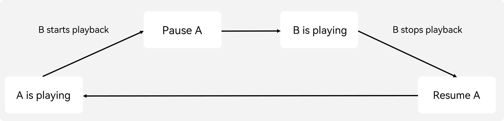

# Audio Focus and Audio Session Overview

<!--Kit: Audio Kit-->
<!--Subsystem: Multimedia-->
<!--Owner: @funny_sunix-->
<!--Designer: @hao-liangfei-->
<!--Tester: @Filger-->
<!--Adviser: @w_Machine_cc-->
<!-- md-trans-meta sourceCommit=249567c57853ff4ccedf632ba69d388b5f14b19c translatedAt=2026-08-06T01:43:56.686Z pushedAt=2026-08-06T06:50:43.871Z -->

When an app plays or records audio, it may encounter audio focus conflicts with other apps or with other audio streams within the same app. This section provides an overview of how these conflicts are handled and explains how to use the system's audio focus management capabilities to resolve audio interruption issues.

The system provides two mechanisms for managing audio conflicts: audio focus and audio sessions.

Audio focus uses predefined system policies to handle relatively simple scenarios. After the appropriate audio stream type is selected, the system automatically manages audio focus without requiring app involvement.

If audio focus cannot meet the app's requirements, use audio sessions to customize the app's audio conflict management policy. This requires the app to integrate audio session support.

The following table lists the main differences between audio focus and audio session.

| Comparison Item | Audio Focus | Audio Session |
|---|---|---|
| Management granularity | Individual audio stream level. | Overall management of a group of audio streams. |
| Conflict resolution strategy | Fixed priority rules. | Configurable concurrency modes (MIX/DUCK/PAUSE, etc.). |
| Control flexibility | System-driven; apps respond passively. | Apps can proactively configure policies. |
| Status callback | Interruption event callback. | Status change callback, device change callback, and session invalidation callback. |
| Applicable scenario | Single playback and recording scenarios. | Complex concurrency scenarios requiring fine-grained control. |

## Audio Focus Usage Scenarios

Audio focus is a system-managed mechanism that uses predefined focus policies to handle simple audio concurrency scenarios. Typical use cases include the following.

### Scenario 1: VoIP Calls Interrupted by Incoming Cellular Calls

A user is in a [VoIP call](./audio-call-overview.md) when an incoming cellular call arrives. The app must handle the transition between the two calls correctly.

Solution: Cellular calls have the highest audio focus priority and exclusively acquire audio focus. When the VoIP app receives `INTERRUPT_HINT_PAUSE`, it should pause the call. After the cellular call ends, the VoIP app receives `INTERRUPT_HINT_RESUME` and can resume the call.

Focus characteristics: Incoming cellular calls always preempt other audio by using the system-defined priority policy. The VoIP app passively responds to interruption events and cannot override the system's focus policy.

### Scenario 2: Background Playback Interrupted by Foreground App

A background music player is playing audio when a foreground app (such as a short video app) starts audio playback.

Solution: The background app requests audio focus (through the session mechanism or focus mechanism). The background player receives an interruption callback and, based on [`InterruptHint`](../../reference/apis-audio-kit/arkts-apis-audio-e.md#interrupthint), executes `INTERRUPT_HINT_PAUSE` or `INTERRUPT_HINT_DUCK`. After the foreground app releases the focus, the background player receives `INTERRUPT_HINT_RESUME` and resumes playback.

Focus characteristics: The background app passively receives interruption events and responds according to `InterruptHint` (pause/stop/duck). The app cannot actively declare a policy. This is suitable for traditional apps or simple playback scenarios.

### Scenario 3: Music Playback Interrupted by an Incoming Cellular Call

A user is listening to music when an incoming cellular call arrives. Playback should resume automatically after the call ends.

Solution: When the music player receives `INTERRUPT_HINT_PAUSE`, it pauses playback. After the call ends, it receives `INTERRUPT_HINT_RESUME` and resumes playback automatically.

Focus characteristics: Audio focus provides automatic playback recovery. When an `INTERRUPT_TYPE_END` event with an `INTERRUPT_HINT_RESUME` hint is delivered, the app can restore playback by responding to the interruption event.

## Audio Session Usage Scenarios

If the system default policies do not meet your scenario requirements, you are advised to use audio rendering, recording, and session-related APIs for processing. Typical scenarios are described below.

### Scenario 1: Music Playback Interrupted by a Later-Launched App and Unable to Resume

App A is playing music. The user then launches App B, which also starts audio playback. Under the default audio focus policy (STOP), App A is interrupted by App B and does not resume playback after App B stops playing. To enable App A to resume playback, the system provides the options listed in the following table.

<!--Table: 6%; 30%; 30%; 17%; 17% -->

| - | App A | App B | Interruption Effect | Remarks |
|--|-------|-------|---------|------|
| Default scenario | Plays media audio (music) | Plays media audio (short video) | The default focus policy is stop. After B starts playing, A is interrupted and does not resume. | If App A needs to continue playback, see the following solutions. |
| Solution 1 | Uses the audio rendering API [setIndependentAudioSessionStrategy](../../reference/apis-audio-kit/arkts-apis-audio-AudioRenderer.md#setindependentaudiosessionstrategy24) with `MUTE_WHEN_INTERRUPTED` for `AudioSessionBehaviorFlags`. | No adaptation required. | After B preempts focus, A continues playback silently. After B finishes, A resumes. | After resumption, the content muted during the silent period is skipped. Not recommended for scenarios sensitive to progress bars. |
| Solution 2 | Uses the audio rendering API [setIndependentAudioSessionStrategy](../../reference/apis-audio-kit/arkts-apis-audio-AudioRenderer.md#setindependentaudiosessionstrategy24) with `PAUSE_WHEN_INTERRUPTED` for `AudioSessionBehaviorFlags`. | No adaptation required. | When App B interrupts App A, the pause policy is used. After B finishes, A receives a RESUME message and continues playback. | Recommended for progress-bar-sensitive apps. |
| Solution 3 | No adaptation required. | Uses an audio session with `CONCURRENCY_PAUSE_OTHERS` at startup and the PAUSE policy upon interruption. When App B releases focus, it sends a RESUME event to A. | After B finishes, a RESUME event is sent and A continues playback. | - |
| Solution 4 | App A provides a switch, and the audio session concurrency policy uses `CONCURRENCY_MIX_WITH_OTHERS`. | No adaptation required. | App A provides a setting switch that takes effect when manually enabled by the user. After B starts playing, A and B play simultaneously. | For the switch, refer to the system music settings. |
| Solution 5 | No adaptation required. | App B provides a switch, and the audio session concurrency policy uses `CONCURRENCY_MIX_WITH_OTHERS`. | App B provides a setting switch that takes effect when manually enabled by the user. After B starts playing, A and B play simultaneously. | For the switch, refer to the system music settings. |
| Solution 6 | Uses the audio session API [setAudioSessionBehavior](../../reference/apis-audio-kit/arkts-apis-audio-AudioSessionManager.md#setaudiosessionbehavior24) with `MUTE_WHEN_INTERRUPTED` for `AudioSessionBehaviorFlags`. | App B provides a switch, and the audio session concurrency policy uses `CONCURRENCY_MIX_WITH_OTHERS`. | The app provides a setting switch that takes effect when manually enabled by the user. After B starts playing, A and B play simultaneously. | For the switch, refer to the system music settings. |
| Solution 7 | No adaptation required. | The audio session concurrency policy uses `CONCURRENCY_DUCK_OTHERS`. | A's volume is lowered. After B stops, A's volume is automatically restored. | Volume is automatically restored; no additional adaptation required. |

### Scenario 2: Recording Interrupted by a Calling App and Unable to Resume

<!--Table: 6%; 30%; 30%; 17%; 17% -->

| - | App A | App B | Interruption Effect | Remarks |
|--|-------|-------|---------|------|
| Default scenario | Starts audio recording | Cellular call, video call | For security reasons, calls and VoIP calls prohibit recording. | - |
| Solution 1 | Uses the [setWillMuteWhenInterrupted](../../reference/apis-audio-kit/arkts-apis-audio-AudioCapturer.md#setwillmutewheninterrupted20) API to set recording mute upon interruption. | No configuration required. | When App B plays or records audio, App A can continue recording, with the recording stream being silent. | - |
| Solution 2 | Uses the audio recording API [setIndependentAudioSessionStrategy](../../reference/apis-audio-kit/arkts-apis-audio-AudioCapturer.md#setindependentaudiosessionstrategy24) with `MUTE_WHEN_INTERRUPTED` for `AudioSessionBehaviorFlags`. | No configuration required. | When App B interrupts A's recording, App A records silent data. After App B finishes, audible data resumes. | The effect is equivalent to Solution 1. Solution 2 is recommended. |
| Solution 3 | Uses the audio recording API [setIndependentAudioSessionStrategy](../../reference/apis-audio-kit/arkts-apis-audio-AudioCapturer.md#setindependentaudiosessionstrategy24) with `PAUSE_WHEN_INTERRUPTED` for `AudioSessionBehaviorFlags`. | No configuration required. | When App B interrupts A's recording, App A's recording is paused. After App B finishes, App A receives a RESUME event and resumes recording. | - |

### Scenario 3: Recording Fails to Start During a Call

<!--Table: 6%; 30%; 30%; 17%; 17% -->

| - | App A | App B | Interruption Effect | Remarks |
|--|-------|-------|---------|------|
| Default scenario | Starts a call | Starts recording | Recording fails. | - |
| Solution 1 | No configuration required. | Uses the [setWillMuteWhenInterrupted](../../reference/apis-audio-kit/arkts-apis-audio-AudioCapturer.md#setwillmutewheninterrupted20) API. | Recording can start, and the recorded data is a silent stream. | - |
| Solution 2 | No configuration required. | Uses the audio recording API [setIndependentAudioSessionStrategy](../../reference/apis-audio-kit/arkts-apis-audio-AudioCapturer.md#setindependentaudiosessionstrategy24) with `MUTE_WHEN_INTERRUPTED` for `AudioSessionBehaviorFlags`. | Recording can start, and the recorded data is a silent stream. | The effect is equivalent to Solution 1. Solution 2 is recommended. |
| Solution 3 | No configuration required. | Uses the audio recording API [setIndependentAudioSessionStrategy](../../reference/apis-audio-kit/arkts-apis-audio-AudioCapturer.md#setindependentaudiosessionstrategy24) with `PAUSE_WHEN_INTERRUPTED` for `AudioSessionBehaviorFlags`. | Recording is paused. After App A's call ends, App B receives a RESUME event and resumes recording. | - |

### Scenario 4: Recording Started During Music Playback, Interrupting the Music

App A is playing music, and app B starts recording (via voice recognition, voice recorder, etc.). The music is paused, and playback can resume after the recording ends.

| - | App A | App B | Interruption Effect | Remarks |
|--|-------|-------|---------|------|
| Default scenario | Starts music playback | Starts recording | Recording preempts focus, and music is paused. After recording ends, music receives a RESUME notification and can resume. | The RESUME event requires the app to actively call `play()` to resume. |
| Solution 1 | Uses the audio recording API [setIndependentAudioSessionStrategy](../../reference/apis-audio-kit/arkts-apis-audio-AudioRenderer.md#setindependentaudiosessionstrategy24) with `MUTE_WHEN_INTERRUPTED` for `AudioSessionBehaviorFlags`. | No adaptation required. | During recording, music continues playback silently. After recording ends, music resumes audibly. | After resumption, the content muted during the silent period is skipped. Not recommended for scenarios sensitive to progress bars. |
| Solution 2 | No adaptation required. | The audio session concurrency policy uses `CONCURRENCY_DUCK_OTHERS`. | Recording proceeds normally, and music volume is lowered. After recording ends, the volume is automatically restored. | Volume is automatically restored; no additional adaptation required. |
| Solution 3 | No adaptation required. | The audio session concurrency policy uses `CONCURRENCY_MIX_WITH_OTHERS`. | Recording and music run simultaneously without affecting each other. | - |

### Scenario 5: Music Interrupted by TTS Notification Tone and Unable to Resume

App A is playing music while App B plays a notification sound. If the notification sound uses the `STREAM_USAGE_NOTIFICATION` stream type, it does not interrupt music playback. However, when App B uses Text-to-Speech (TTS), the TTS audio is treated as a media audio stream. Under the default audio focus policy (`STOP`) between media streams, music playback is interrupted and does not resume automatically.

| - | App A | App B | Interruption Effect | Remarks |
|--|-------|-------|---------|------|
| Default scenario | Starts music playback | Plays a prompt tone (TTS, media-type stream) | TTS preempts focus, and music stops without resuming | Both TTS and music are media-type streams, and the default policy is STOP |
| Solution 1 | Starts music playback | Plays a prompt tone using the STREAM_USAGE_NOTIFICATION stream type | NOTIFICATION plays normally, and music volume is lowered; music volume automatically restores after the prompt tone ends | - |
| Solution 2 | Uses the recording interface [setIndependentAudioSessionStrategy](../../reference/apis-audio-kit/arkts-apis-audio-AudioRenderer.md#setindependentaudiosessionstrategy24), with AudioSessionBehaviorFlags set to MUTE_WHEN_INTERRUPTED | No adaptation required | After B preempts focus, A continues playback muted; A resumes after B finishes the prompt broadcast | Resumed playback skips the muted period, so this is not recommended for scenarios sensitive to progress bar position |
| Solution 3 | No adaptation required | Uses `CONCURRENCY_MIX_WITH_OTHERS` as the audio session concurrency policy | TTS and music play simultaneously without affecting each other | - |

## Focus Management Scenarios Within the Same App

Multiple audio streams may be created simultaneously within the same app. For example, a music player may start a new song while background music is already playing, or a short video player may play a video while background music is also playing.

The system provides the focus mode (InterruptMode) to manage focus decisions among audio streams within the same app. For details and practice on focus mode, see [In-App Focus Management](./audio-playback-concurrency.md#in-app-focus-management).

**Common scenario: Music and video conflict within the same app**

| - | Stream A | Stream B | Adaptation Solution | Interruption Effect |
|--|-------|-------|-------------|---------|
| Default scenario | Playing music (MUSIC) | Playing video (MOVIE) | The default mode is SHARE_MODE, which does not trigger the focus policy. | Music A and video B play concurrently. |
| Solution 1 (recommended) | Playing music (MUSIC) | Playing video (MOVIE) | Both stream A and stream B are in SHARE_MODE, and the app manages the behavior of each stream on its own. As shown in the figure:  | Music A is interrupted by video B. Video B pauses, and music A resumes. |
| Solution 2 | Playing music (MUSIC) | Playing video (MOVIE) | Either stream A or stream B, or both, are in INDEPENDENT_MODE, and the system makes focus decisions for the two streams. | Music A is interrupted by video B. Video B pauses, and music A does not resume. |