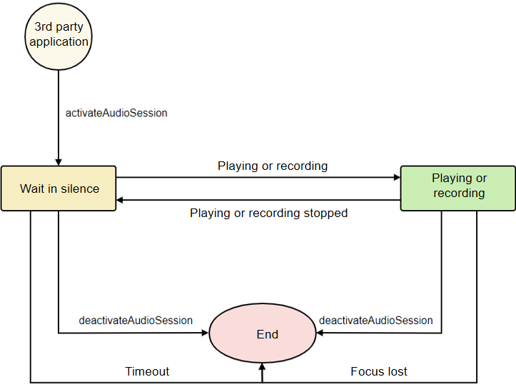

# Introduction to Audio Focus and Audio Session

When an application plays or records a sound, conflicts with other audio streams may occur, adversely affecting user experience. For example, when a video starts playing while music is playing in the background, users expect the music to pause to prioritize the video's audio. This is where audio focus comes into play. For applications that provide audio services, it is important to properly manage audio focus, which can significantly improve the audio experience of users.

This topic outlines the system's audio focus strategy, detailing how applications can request and release audio focus and respond to focus changes.

The system also provides an audio session mechanism, which allows applications to customize the focus strategy for its audio streams. During audio focus management carried out by the system, all audio streams of the application preferentially adhere to this strategy as long as conditions permit.

## Audio Focus

The system has a default [audio focus strategy](#audio-focus-strategy) that manages all playback and recording audio streams based on their types and the order in which they initiate.

Applications must [request audio focus](#requesting-audio-focus) before starting playback or recording and [release it](#releasing-audio-focus) in time when the playback or recording is complete. During playback or recording, audio focus may be lost due to the intervention of other audio streams. In this case, the application needs to [take measures based on the focus changes](#handling-audio-focus-changes).

To ensure a superior audio focus experience for users, applications should:

- Before starting playback or recording, [select an appropriate audio stream type](using-right-streamusage-and-sourcetype.md) based on the specific use of the audio, by accurately setting [StreamUsage](../../reference/apis-audio-kit/js-apis-audio.md#streamusage) or [SourceType](../../reference/apis-audio-kit/js-apis-audio.md#sourcetype8).

- During playback or recording, [listen for audio focus events](#handling-audio-focus-changes) and take measures when receiving such an event (specified by [InterruptEvent](../../reference/apis-audio-kit/js-apis-audio.md#interruptevent9)).

- To actively manage audio focus, call the APIs related to [AudioSession](#managing-audio-focus-with-audiosession).

### Requesting Audio Focus

When an application starts to play or record audio, the system automatically requests audio focus for that audio stream.

For example, when an application [uses AudioRenderer for audio playback](using-audiorenderer-for-playback.md) and calls [start](../../reference/apis-audio-kit/js-apis-audio.md#start8) of AudioRenderer, the system automatically requests audio focus for the application.

If the audio focus request is successful, the audio stream starts normally; otherwise, the audio stream fails to start.

It is recommended that the application proactively [listen for audio focus events](#handling-audio-focus-changes). If the audio focus request is rejected, the application receives an audio focus event (specified by [InterruptEvent](../../reference/apis-audio-kit/js-apis-audio.md#interruptevent9)).

**Special scenarios:**

1. **Sound playback**: If an application [uses SoundPool for audio playback](../media/using-soundpool-for-playback.md) and sets [StreamUsage](../../reference/apis-audio-kit/js-apis-audio.md#streamusage) to **Music**, **Movie**, or **AudioBook**, the concurrent mode is used by default for the focus request, without affecting other audio.

2. **Silent playback**: If an application starts to play audio (or video) in mute mode and intends to avoid affecting other audio during the mute phase, and then seeks audio focus with a standard strategy when unmuting, it can call APIs related to the silent concurrent playback mode. For details, see:

   - [Using AVPlayer for Audio Playback](../media/using-avplayer-for-playback.md), where you can call [setMediaMuted](../../reference/apis-media-kit/js-apis-media.md#setmediamuted12).

   - [Using AudioRenderer for Audio Playback](using-audiorenderer-for-playback.md), where you can call [setSilentModeAndMixWithOthers](../../reference/apis-audio-kit/js-apis-audio.md#setsilentmodeandmixwithothers12).

   - [Using OHAudio for Audio Playback](using-ohaudio-for-playback.md), where you can call [OH_AudioRenderer_SetSilentModeAndMixWithOthers](../../reference/apis-audio-kit/_o_h_audio.md#oh_audiorenderer_setsilentmodeandmixwithothers).

### Releasing Audio Focus

When an application stops playing or recording audio, the system automatically releases audio focus for that audio stream.

For example, when an application [uses AudioRenderer for audio playback](using-audiorenderer-for-playback.md) and calls [pause](../../reference/apis-audio-kit/js-apis-audio.md#pause8), [stop](../../reference/apis-audio-kit/js-apis-audio.md#stop8), or [release](../../reference/apis-audio-kit/js-apis-audio.md#release8) of AudioRenderer, the system releases audio focus for the application.

After the audio focus is released, other audio streams (for example, streams with reduced volume or paused streams) affected by the audio stream will be resumed.

If an application prefers not to release audio focus immediately when the audio stream stops, it can call the APIs related to [AudioSession](#managing-audio-focus-with-audiosession) to delay the release.

### Audio Focus Strategy

When an audio stream requests or releases audio focus, the system manages focus for all audio streams (including playback and recording) based on the audio focus strategy to determine which audio streams can run properly and which need to be interrupted or perform other operations.

The system's default audio focus strategy is determined based on the audio stream type ([StreamUsage](../../reference/apis-audio-kit/js-apis-audio.md#streamusage) for playback streams and [SourceType](../../reference/apis-audio-kit/js-apis-audio.md#sourcetype8) for recording streams) and the sequence in which the audio streams start.

To prevent unexpected focus changes, applications must correctly set **StreamUsage** or **SourceType** based on the usage of the audio stream before starting playback or recording. For details about the stream types, see [Selecting an Appropriate Audio Stream Type](using-right-streamusage-and-sourcetype.md).

Common audio focus scenarios are as follows:

- When a Movie stream starts playing, the Music stream that is playing will be paused. When the Movie stream ends, the Music stream will not receive any resume notification.
- When a Navigation stream starts playing, the Music stream that is playing will be ducked. When the Navigation stream ends, the volume of the Music stream will be restored.
- A Music stream and a Game stream can be mixed and played concurrently without affecting each other.
- When a VoiceCommunication stream starts playing, the Music stream that is playing will be paused. When the VoiceCommunication stream ends, the Music stream will receive a notification to resume the playback.
- When a VoiceMessage stream starts playing, the Music stream that is playing will be paused. When the VoiceMessage stream ends, the Music stream will receive a notification to resume the playback.

If the default audio focus strategy fails to meet specific scenario requirements, applications can use [AudioSession](#managing-audio-focus-with-audiosession) to adjust the audio focus strategy used by their audio streams.

### Audio Focus Mode

Applications can set the focus mode (specified by [InterruptMode](../../reference/apis-audio-kit/js-apis-audio.md#interruptmode9)) to either self-manage its audio streams or allow the system to manage them uniformly.

The system provides two predefined focus modes:

- **SHARE_MODE**: Multiple audio streams from the same application share a single audio focus. The concurrency rules between these audio streams are determined by the application, without the use of the audio focus strategy. However, if another application needs to play audio while one of these audio streams is being played, the audio focus strategy is triggered.

- **INDEPENDENT_MODE**: Each audio stream from the application has its own audio focus, and the audio focus strategy is triggered when multiple audio streams are played concurrently.

Applications can select the appropriate focus mode based on their needs. By default, the system uses **SHARE_MODE** when creating audio streams, but applications can specify a different mode if desired.

You can set the audio focus mode in one of the following ways:

- If you [use AVPlayer for audio playback (ArkTS)](../media/using-avplayer-for-playback.md), set [audioInterruptMode](../../reference/apis-media-kit/js-apis-media.md#avplayer9) of AVPlayer to set the audio focus mode.

- If you [use AVPlayer for audio playback (C/C++)](../media/using-ndk-avplayer-for-playerback.md), call [OH_AVPlayer_SetAudioInterruptMode](../../reference/apis-media-kit/_a_v_player.md#oh_avplayer_setaudiointerruptmode) to set the audio focus mode.

- If you [use AudioRenderer for audio playback](using-audiorenderer-for-playback.md), call [setInterruptMode](../../reference/apis-audio-kit/js-apis-audio.md#setinterruptmode9) of AudioRenderer to set the audio focus mode.

- If you [use OHAudio for audio playback (C/C++)](using-ohaudio-for-playback.md), call [OH_AudioStreamBuilder_SetRendererInterruptMode](../../reference/apis-audio-kit/_o_h_audio.md#oh_audiostreambuilder_setrendererinterruptmode) to set the audio focus mode.

### Handling Audio Focus Changes

If another audio stream requests focus when an application is playing or recording audio, the system handles this situation based on the [focus strategy](#audio-focus-strategy). If the current audio stream encounters a focus change and requires operations such as pausing, resuming, ducking, and unducking, the system performs necessary operations and notifies the application through an audio focus event (specified by [InterruptEvent](../../reference/apis-audio-kit/js-apis-audio.md#interruptevent9)).

To maintain state consistency between the application and system and ensure a positive user experience, it is recommended that the application listen for audio focus events (specified by [InterruptEvent](../../reference/apis-audio-kit/js-apis-audio.md#interruptevent9)) and respond appropriately to the event when focus changes.

The manners for listening for audio focus events vary according to the development modes:

- If you [use AVPlayer for audio playback (ArkTS)](../media/using-avplayer-for-playback.md), call [on('audioInterrupt')](../../reference/apis-media-kit/js-apis-media.md#onaudiointerrupt9) to listen for audio focus events (specified by [InterruptEvent](../../reference/apis-audio-kit/js-apis-audio.md#interruptevent9)).

- If you [use AVPlayer for audio playback (C/C++)](../media/using-ndk-avplayer-for-playerback.md), call [OH_AVPlayer_SetOnInfoCallback()](../../reference/apis-media-kit/_a_v_player.md#oh_avplayer_setoninfocallback) to listen for audio focus events (specified by [OH_AVPlayerOnInfoCallback](../../reference/apis-media-kit/_a_v_player.md#oh_avplayeroninfocallback)).

- If you [use AudioRenderer for audio playback](using-audiorenderer-for-playback.md), call [on('audioInterrupt')](../../reference/apis-audio-kit/js-apis-audio.md#onaudiointerrupt9) to listen for audio focus events (specified by [InterruptEvent](../../reference/apis-audio-kit/js-apis-audio.md#interruptevent9)).

- If you [use OHAudio for audio playback (C/C++)](using-ohaudio-for-playback.md), call [OH_AudioStreamBuilder_SetRendererCallback](../../reference/apis-audio-kit/_o_h_audio.md#oh_audiostreambuilder_setrenderercallback) to listen for audio focus events (specified by [OH_AudioRenderer_OnInterruptEvent](../../reference/apis-audio-kit/_o_h___audio_renderer___callbacks___struct.md#oh_audiorenderer_oninterruptevent)).

- If you [use AudioCapturer for audio recording](using-audiocapturer-for-recording.md), call [on('audioInterrupt')](../../reference/apis-audio-kit/js-apis-audio.md#onaudiointerrupt10) to listen for audio focus events (specified by [InterruptEvent](../../reference/apis-audio-kit/js-apis-audio.md#interruptevent9)).

- If you [use OHAudio for audio recording (C/C++)](using-ohaudio-for-recording.md), call [OH_AudioStreamBuilder_SetCapturerCallback](../../reference/apis-audio-kit/_o_h_audio.md#oh_audiostreambuilder_setcapturercallback) to listen for audio focus events (specified by [OH_AudioCapturer_OnInterruptEvent](../../reference/apis-audio-kit/_o_h___audio_capturer___callbacks___struct.md#oh_audiocapturer_oninterruptevent)).

When receiving an audio focus event (specified by [InterruptEvent](../../reference/apis-audio-kit/js-apis-audio.md#interruptevent9)), applications must perform corresponding processing based on the information in the event to maintain consistency with the system state and deliver a quality audio experience to users.

In an audio focus event, applications should pay attention to two key pieces of information: **InterruptForceType** and **InterruptHint**.

- [InterruptForceType](../../reference/apis-audio-kit/js-apis-audio.md#interruptforcetype9):

  This parameter specifies whether the focus change is forcibly performed by the system.

  - **INTERRUPT_FORCE**: enforced by the system, requiring the application to perform necessary processing, for example, updating the state and UI display.

  - **INTERRUPT_SHARE**: managed by the application, which can choose to respond or ignore, without system interference.

  By default, the system preferentially uses **INTERRUPT_FORCE**.

  > **NOTE**
  >
  > For operations that cannot be forcibly performed by the system (for example, **INTERRUPT_HINT_RESUME**), **INTERRUPT_SHARE** is used.

- [InterruptHint](../../reference/apis-audio-kit/js-apis-audio.md#interrupthint):

  This parameter is used to notify the application of the audio stream status.

  - **INTERRUPT_HINT_RESUME**: Audio playback or recording can be resumed. This is received only after a PAUSE message is received.

      This operation cannot be forcibly performed by the system, and the corresponding **InterruptForceType** must be **INTERRUPT_SHARE**.

  - **INTERRUPT_HINT_PAUSE**: The audio stream is paused and audio focus is lost temporarily. When focus is available, **INTERRUPT_HINT_RESUME** will be received.
  - **INTERRUPT_HINT_STOP**: The audio stream stops and audio focus is lost.
  - **INTERRUPT_HINT_DUCK**: The audio stream should lower its volume but continue playing, defaulting to 20% of the normal volume.
  - **INTERRUPT_HINT_UNDUCK**: The audio stream should return to its normal volume.

The following provides an example of audio focus processing.

To deliver an optimal audio experience for users, applications should perform processing based on the event content. The following [uses AudioRenderer for audio playback](using-audiorenderer-for-playback.md) as an example to describe the recommended processing methods for applications.

If you use other APIs to develop audio playback or recording, the processing method is similar. You can compile the code based on service requirements or adjust the processing methods as needed.

```ts
import { audio } from '@kit.AudioKit';  // Import the audio module.
import { BusinessError } from '@kit.BasicServicesKit'; // Import BusinessError.

let isPlay: boolean; // An identifier specifying whether the audio stream is being played. In actual development, this parameter corresponds to the module related to the audio playback state.
let isDucked: boolean; // An identifier specifying whether to duck the volume down. In actual development, this parameter corresponds to the module related to the audio volume.
let started: boolean; // An identifier specifying whether the start operation is successful.

async function onAudioInterrupt(): Promise<void> {
  // The AudioRenderer is used as an example to describe how to develop audio playback. The audioRenderer variable is the AudioRenderer instance created for playback.
  audioRenderer.on('audioInterrupt', async(interruptEvent: audio.InterruptEvent) => {
    // When audio focus changes, the AudioRenderer receives the interruptEvent callback and performs processing based on the content in the callback.
    // 1. (Optional) The AudioRenderer reads the value of interruptEvent.forceType to see whether the system has forcibly performed the operation.
    // Note: In the default focus strategy, INTERRUPT_HINT_RESUME maps to the force type INTERRUPT_SHARE, and others map to INTERRUPT_FORCE. Therefore, the value of forceType does not need to be checked.
    // 2. (Mandatory) The AudioRenderer then reads the value of interruptEvent.hintType and performs corresponding processing.
    if (interruptEvent.forceType === audio.InterruptForceType.INTERRUPT_FORCE) {
      // If the value of interruptEvent.forceType is INTERRUPT_FORCE, the system has performed audio-related processing, and the application needs to update its state and make adjustments accordingly.
       switch (interruptEvent.hintType) {
        case audio.InterruptHint.INTERRUPT_HINT_PAUSE:
          // The system has paused the audio stream (focus is temporarily lost). To ensure state consistency, the application needs to switch to the audio paused state.
          // Temporarily losing focus: After other audio streams release focus, the current audio stream will receive the audio focus event corresponding to resume and automatically resume the playback.
          isPlay = false; // A simplified processing indicating several operations for switching the application to the audio paused state.
          break;
        case audio.InterruptHint.INTERRUPT_HINT_STOP:
          // The system has stopped the audio stream (focus is permanently lost). To ensure state consistency, the application needs to switch to the audio paused state.
          // Permanently losing focus: No audio focus event will be received. The user must manually trigger the operation to resume playback.
          isPlay = false; // A simplified processing indicating several operations for switching the application to the audio paused state.
          break;
        case audio.InterruptHint.INTERRUPT_HINT_DUCK:
          // The system has ducked the volume down (to 20% of the normal volume by default).
          isDucked = true; // A simplified processing indicating several operations for switching the application to the volume decreased state.
          break;
        case audio.InterruptHint.INTERRUPT_HINT_UNDUCK:
          // The system has restored the audio volume to normal.
          isDucked = false; // A simplified processing indicating several operations for switching the application to the normal volume state.
          break;
        default:
          break;
      }
    } else if (interruptEvent.forceType === audio.InterruptForceType.INTERRUPT_SHARE) {
      // If the value of interruptEvent.forceType is INTERRUPT_SHARE, the application can take action or ignore as required.
      switch (interruptEvent.hintType) {
        case audio.InterruptHint.INTERRUPT_HINT_RESUME:
          // The paused audio stream can be played. It is recommended that the application continue to play the audio stream and switch to the audio playing state.
          // If the application does not want to continue the playback, it can ignore the event.
          // To continue the playback, the application needs to call start(), and use the identifier variable started to record the execution result of start().
          await audioRenderer.start().then(() => {
            started = true; // Calling start() is successful.
          }).catch((err: BusinessError) => {
            started = false; // Calling start() fails.
          });
          // If calling start() is successful, the application needs to switch to the audio playing state.
          if (started) {
            isPlay = true; // A simplified processing indicating several operations for switching the application to the audio playing state.
          } else {
            // Resuming the audio playback fails.
          }
          break;
        default:
          break;
      }
   }
  });
}
```

## Managing Audio Focus with AudioSession

Applications may use AudioSession APIs to customize a focus strategy for its audio streams. When the system performs focus management, all audio streams of the application preferentially comply with this strategy whenever possible.

The AudioSession APIs are used to implement the following functions:

- Once an application activates an audio session and specifies an [audio session strategy] (#audio-session-strategy), all audio streams of the application preferentially use this strategy during focus management.

  Typical scenario: When an application plays a short video, the music playing in the background is interrupted. It is expected that the background music be automatically restored once the audio stream of the application stops.

- When an audio session is in the activated state and all audio streams of the application are stopped, audio focus is not released immediately. The system retains focus until the audio session is deactivated or a new audio stream of the application requests focus.

  Typical scenario: When an application plays multiple audio clips sequentially, it desires to maintain audio focus continuity throughout the entire playback, without other affected audio in the background resuming automatically during the intervals between audio clips.

### Audio Session Usage Workflow

The following figure demonstrates the usage workflow of AudioSession.



1. Before starting the audio service, obtain an **AudioSessionManager** instance.

   For details, see [Obtaining an Audio Session Manager (ArkTS)](audio-session-management.md#obtaining-an-audio-session-manager) or [Obtaining an Audio Session Manager (C/C++)](using-ohaudio-for-session.md#obtaining-an-audio-session-manager).

2. Activate an audio session for the application and specify [AudioSessionStrategy](#audio-session-strategy) as required.

   For details, see [Activating an Audio Session (ArkTS)](audio-session-management.md#activating-an-audio-session) or [Activating an Audio Session (C/C++)](using-ohaudio-for-session.md#activating-an-audio-session).

   > **NOTE**
   > - The strategy passed for audio session activation is saved. This strategy is preferentially used during focus management of the audio stream of the application (for example, requesting or releasing focus).
   > - An audio session can be activated repeatedly. During repeated activation, the saved strategy is updated, and the latest policy is used in focus management.

   An active audio session has the following features:
   - If the application has no running audio streams, the system automatically deactivates the audio session after one minute.
   - When the audio stream of the application stops and the application does not have other audio streams, focus is not released immediately. Instead, it is maintained in the silent wait state until the audio session is deactivated or the application requests focus with a new audio stream.

3. The application normally starts the audio service such as playback or recording. The system requests audio focus when the audio stream starts. All audio streams of the application prioritize the strategy specified by the audio session during focus management.

4. Deactivate the audio session after the audio service ends. The system releases audio focus when the audio stream stops and the audio session is deactivated.

   The application must proactively stop the audio session after the audio service ends.

   When the application deactivates an audio session, if all audio streams of the application have stopped (focus in maintained in the silent wait state), audio focus is released immediately. If the application still has an audio stream running, that audio stream holds focus until it stops.

   For details, see [Deactivating an Audio Session (ArkTS)](audio-session-management.md#deactivating-an-audio-session) or [Deactivating an Audio Session (C/C++)](using-ohaudio-for-session.md#deactivating-an-audio-session).

During the use of an audio session, it is recommended that the application [listen for audio session deactivation events](#listening-for-audio-session-deactivation-events). When the audio session is deactivated, the application receives such a notification when the [event](../../reference/apis-audio-kit/js-apis-audio.md#audiosessiondeactivatedevent12) is triggered.

### Audio Session Strategy

When an application activates an audio session, it must specify an audio session strategy, which contains [AudioConcurrencyMode](../../reference/apis-audio-kit/js-apis-audio.md#audioconcurrencymode12) used to declare different audio concurrency modes.

The system presets the following four audio concurrency modes:

- **CONCURRENCY_DEFAULT**): default [audio focus strategy](#audio-focus-strategy) of the system.

- **CONCURRENCY_MIX_WITH_OTHERS**: concurrency with other audio streams.

- **CONCURRENCY_DUCK_OTHERS**: concurrency with other audio streams and lowering their volume.

- **CONCURRENCY_PAUSE_OTHERS**: pausing other audio streams and notifying them to resume after releasing focus.

> **NOTE**
>
> When an application uses the preceding modes through an audio session, the system will try to meet the focus strategy, but it may not be guaranteed in all scenarios.
>
> For example, in **CONCURRENCY_PAUSE_OTHERS** mode, if a Movie stream requests audio focus while a Music stream is playing, the Music stream is paused. However, if a VoiceCommunication stream is playing, it is not paused.

### Listening for Audio Session Deactivation Events

It is recommended that applications listen for audio session deactivation events (AudioSessionDeactivatedEvent) when using an audio session. When the audio session is deactivated (not proactively), the application receives a notification. The application can handle it based on service requirements, for example, releasing resources or reactivating the audio session.

For details, see [Using AudioSession to Manage Audio Focus (ArkTS)](audio-session-management.md) or [Using AudioSession to Manage Audio Focus (C/C++)](using-ohaudio-for-session.md).

**AudioSessionDeactivatedEvent** contains the **AudioSessionDeactivatedReason** parameter. This parameter specifies the reason for the deactivation, which can be either of the following:

- **DEACTIVATED_LOWER_PRIORITY**: All audio streams of the application are interrupted by other audio streams. As a result, focus is lost and the audio session is deactivated.

- **DEACTIVATED_TIMEOUT**: The audio session is activated, but the application has no audio streams running. The audio session will be deactivated after one minute.

   > **NOTE**
   >
   > When an audio session is deactivated due to a timeout, the audio stream that has been ducked by the audio session triggers the unduck operation, and the audio stream that is paused by the audio session triggers the stop operation.

## Typical Scenarios

The following lists typical adaptation scenarios for audio focus, where application A plays audio streams first and application B plays audio streams at a later time.

| Audio Type of Application A      | Recommended Stream Type        | Audio Type of Application B| Recommended Stream Type           | Recommended User Experience                                                    | Adaptation Solution                                                    |
| ---------------- | ------------------ | ------------ | --------------------- | ------------------------------------------------------------ | ------------------------------------------------------------ |
| Music        | STREAM_USAGE_MUSIC | Music        | STREAM_USAGE_MUSIC    | Application A stops playing the music, and the UI displays the stopped state. Application B plays the music normally.| Application A listens for audio focus events. When it receives the **INTERRUPT_HINT_STOP** event, it stops music playback and updates its UI.|
| Music        | STREAM_USAGE_MUSIC | Navigation        | STREAM_USAGE_NAVIGATION    | The navigation is played properly, and the music volume is decreased. After the navigation ends, the music volume is restored to normal.| Application A listens for audio focus events. When it receives the **INTERRUPT_HINT_DUCK** and **INTERRUPT_HINT_UNDUCK** events, it updates its UI.|
| Video          | STREAM_USAGE_MOVIE | Alarm        | STREAM_USAGE_ALARM    | When the alarm rings, the video playback pauses. When the alarm ends, the video playback resumes.        | Application A listens for audio focus events. When it receives the **INTERRUPT_HINT_PAUSE** event, it pauses video playback and updates its UI. When the alarm ends, application A receives the **INTERRUPT_HINT_RESUME** event and restarts the playback.|
| Music        | STREAM_USAGE_MUSIC | Ringtone    | STREAM_USAGE_RINGTONE | When the phone rings, the music playback pauses. When the call is not connected or the call is connected and then ended, the music playback resumes.| Application A listens for audio focus events. When it receives the **INTERRUPT_HINT_PAUSE** event, it pauses music playback and updates its UI. When the call ends, application A receives the **INTERRUPT_HINT_RESUME** event and restarts the playback.|
| Music        | STREAM_USAGE_MUSIC | VoIP call    | STREAM_USAGE_VOICE_COMMUNICATION | When a call is connected, the music playback pauses. When the call ends, the music playback resumes.| Application A listens for audio focus events. When it receives the **INTERRUPT_HINT_PAUSE** event, it pauses music playback and updates its UI. When the call ends, application A receives the **INTERRUPT_HINT_RESUME** event and restarts the playback.|
